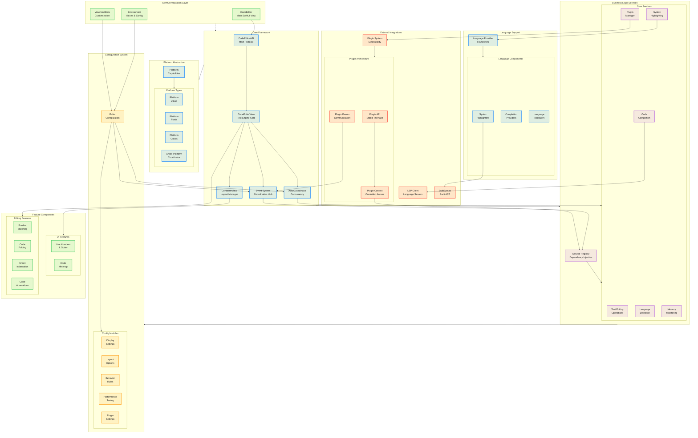

# High-Level Architecture Diagram

This diagram shows the overall architecture of the CodeEditorPlugin framework, illustrating the main layers and their relationships.

## Key Architectural Principles

1. **Layered Architecture**: Clear separation between UI (SwiftUI), Core logic, Services, and Platform abstractions
2. **Protocol-Oriented**: Core functionality defined through protocols (CodeEditorAPI)
3. **Service-Based**: Business logic encapsulated in services managed by a central registry
4. **Dependency Injection**: No singletons - all dependencies injected via configuration
5. **Platform Agnostic**: Platform-specific code isolated in abstraction layer
6. **Event-Driven**: Unified event system for decoupled communication
7. **Configurable**: Comprehensive configuration system with environment integration
8. **Extensible**: Plugin system with stable API and controlled access
9. **Concurrent**: ActorCoordinator manages safe concurrent operations
10. **Memory Efficient**: Active memory monitoring and iOS-specific optimizations