# Core Components Class Diagram

This diagram details the main classes and protocols that form the core of the CodeEditorPlugin framework.

```mermaid
classDiagram
    direction LR
    
    %% Top Row - Core Protocols
    class CodeEditorAPI {
        &lt;&lt;protocol&gt;&gt;
        +language LanguageConfig?
        +text String
        +configuration EditorConfiguration
        +setLanguage()
        +invalidateLayout()
    }

    class CodeEditorViewDelegate {
        &lt;&lt;protocol&gt;&gt;
        +didChangeText()
        +shouldChangeText()
        +didChangeSelection()
    }

    %% Second Row - Main Components
    class CodeEditorView {
        &lt;&lt;main text view&gt;&gt;
        +delegate CodeEditorViewDelegate?
        +language LanguageConfig?
        +eventSystem UnifiedEventSystem
        +serviceRegistry BusinessLogicServiceRegistry
        +performTextEdit()
    }

    class CodeEditorContainerView {
        &lt;&lt;layout container&gt;&gt;
        +codeEditorView CodeEditorView
        +gutterView GutterView?
        +minimapView MinimapView?
        +configuration EditorConfiguration
    }

    %% Third Row - SwiftUI & Configuration
    class CodeEditor {
        &lt;&lt;SwiftUI wrapper&gt;&gt;
        @Binding text String
        +configuration EditorConfiguration
        +language LanguageConfig?
        +makeNSView()
        +makeUIView()
    }

    class EditorConfiguration {
        &lt;&lt;configuration&gt;&gt;
        +display DisplayConfiguration
        +layout LayoutConfiguration
        +behavior BehaviorConfiguration
        +performance PerformanceConfiguration
        +eventSystem UnifiedEventSystem?
        +actorCoordinator ActorCoordinator?
        +validate()
    }

    class LanguageConfig {
        &lt;&lt;language definition&gt;&gt;
        +identifier String
        +name String
        +fileExtensions [String]
        +supportsCompletion Bool
    }

    %% Fourth Row - Event System
    class UnifiedEventSystem {
        &lt;&lt;event system&gt;&gt;
        +register()
        +emit()
        +addFilter()
        +publish(event)
    }

    class Event {
        &lt;&lt;data structure&gt;&gt;
        +type EventType
        +source Any
        +timestamp Date
    }

    class EventType {
        &lt;&lt;enumeration&gt;&gt;
        textChanged
        selectionChanged
        configurationChanged
        languageChanged
    }

    %% Fifth Row - Service Registry
    class BusinessLogicServiceRegistry {
        &lt;&lt;dependency injection&gt;&gt;
        +textEditingService TextEditingService
        +syntaxHighlightingService SyntaxHighlightingService
        +languageDetectionService LanguageDetectionService
        +completionProviderRegistry CompletionProviderRegistry
        +lineNumberCalculationService LineNumberCalculationService
        +gutterSizingService GutterSizingService
        +codeFoldingCoordinatorService CodeFoldingCoordinatorService
        +editorLayoutService EditorLayoutService
        +memoryManagementCoordinator MemoryManagementCoordinator
        +configureForEditor()
        +getServiceStatus()
        +clearAllCaches()
        +resetAllServices()
    }

    class TextEditingService {
        &lt;&lt;text operations&gt;&gt;
        +performEdit()
        +undoManager UndoManager
        +undo()
        +redo()
    }

    class SyntaxHighlightingService {
        &lt;&lt;syntax coloring&gt;&gt;
        +highlightText()
        +highlightRange()
        +clearHighlighting()
    }

    %% Sixth Row - More Services & Layout
    class LanguageDetectionService {
        &lt;&lt;language recognition&gt;&gt;
        +detectLanguage()
        +supportedLanguages [LanguageConfig]
        +registerLanguage()
    }

    class CompletionProviderRegistry {
        &lt;&lt;provider management&gt;&gt;
        +providers [String: CompletionProvider]
        +languageProviders [Language: [CompletionProvider]]
        +register()
        +getCompletions()
        +mergeCompletionResults()
        +validateProviders()
    }

    class CompletionManager {
        &lt;&lt;completion orchestration&gt;&gt;
        +registerProvider()
        +requestCompletions()
        +invalidateCache()
        +clearCache()
    }

    class LineNumberCalculationService {
        &lt;&lt;line positioning&gt;&gt;
        +calculateVisibleLineRanges()
        +calculateLinePosition()
        +clearCache()
    }

    class GutterSizingService {
        &lt;&lt;gutter calculations&gt;&gt;
        -lineNumberCalculationService LineNumberCalculationService
        +calculateOptimalWidth()
        +clearCache()
    }

    class CodeFoldingCoordinatorService {
        &lt;&lt;folding management&gt;&gt;
        -lineNumberCalculationService LineNumberCalculationService
        -codeFoldingEngine CodeFoldingEngine
        +toggleFold()
        +calculateFoldControlPosition()
        +getCurrentFoldState()
        +saveFoldingState()
    }

    class EditorLayoutService {
        &lt;&lt;layout orchestration&gt;&gt;
        -gutterSizingService GutterSizingService
        +calculateComponentFrames()
        +calculateTextContainerInsets()
        +optimizeLayoutForConfiguration()
    }

    class MemoryManagementCoordinator {
        &lt;&lt;memory orchestration&gt;&gt;
        -memoryMonitor MemoryMonitor
        -components ManagedComponents
        +createAsyncHighlighter()
        +createRenderingOptimizer()
        +createCompletionManager()
        +updateMemoryMonitor()
    }

    class CodeEditorLayoutManager {
        &lt;&lt;NSLayoutManager&gt;&gt;
        +lineHeight CGFloat
        +characterWidth CGFloat
        +tabWidth Int
        +drawBackground()
        +drawGlyphs()
    }

    %% Seventh Row - UI & Performance
    class LineIndexCache {
        &lt;&lt;performance&gt;&gt;
        +invalidate()
        +lineInfo()
        +updateLine()
    }

    class GutterView {
        &lt;&lt;line numbers&gt;&gt;
        +showLineNumbers Bool
        +width CGFloat
        +drawLineNumbers()
        +handleClick()
    }

    class MinimapView {
        &lt;&lt;code overview&gt;&gt;
        +isVisible Bool
        +scale CGFloat
        +updateContent()
        +syncWithEditor()
    }

    %% Eighth Row - Concurrency
    class ActorCoordinator {
        &lt;&lt;concurrency&gt;&gt;
        +backgroundQueue DispatchQueue
        +performAsync()
        +performSync()
        +create()$ ActorCoordinator
    }

    %% Bottom Row - Supporting Data Types
    class LineInfo {
        &lt;&lt;line metadata&gt;&gt;
        +lineNumber Int
        +startIndex Int
        +endIndex Int
    }

    class TextChange {
        &lt;&lt;change record&gt;&gt;
        +range NSRange
        +replacementText String
        +timestamp Date
    }

    class CompletionContext {
        &lt;&lt;completion state&gt;&gt;
        +position NSRange
        +language LanguageConfig?
        +text String
    }

    class CompletionItem {
        &lt;&lt;completion suggestion&gt;&gt;
        +title String
        +detail String?
        +insertText String
    }

    %% Relationships
    CodeEditorView ..|> CodeEditorAPI : implements
    CodeEditorView --> CodeEditorViewDelegate : delegates to
    CodeEditorView --> UnifiedEventSystem : uses
    CodeEditorView --> BusinessLogicServiceRegistry : uses
    CodeEditorView --> CodeEditorLayoutManager : uses
    CodeEditorView --> LineIndexCache : maintains
    CodeEditorView --> EditorConfiguration : configured by
    CodeEditorView --> LanguageConfig : uses
    
    CodeEditorContainerView --> CodeEditorView : contains
    CodeEditorContainerView --> GutterView : contains
    CodeEditorContainerView --> MinimapView : contains
    CodeEditorContainerView --> EditorConfiguration : configured by
    
    CodeEditor --> CodeEditorContainerView : creates
    CodeEditor --> CodeEditorView : configures
    CodeEditor --> EditorConfiguration : uses
    CodeEditor --> LanguageConfig : uses
    
    UnifiedEventSystem --> Event : processes
    UnifiedEventSystem --> EventType : categorizes
    UnifiedEventSystem --> EventHandler : uses
    UnifiedEventSystem --> EventFilter : applies
    
    BusinessLogicServiceRegistry --> TextEditingService : manages
    BusinessLogicServiceRegistry --> SyntaxHighlightingService : manages
    BusinessLogicServiceRegistry --> LanguageDetectionService : manages
    BusinessLogicServiceRegistry --> CompletionProviderRegistry : manages
    BusinessLogicServiceRegistry --> LineNumberCalculationService : manages
    BusinessLogicServiceRegistry --> GutterSizingService : manages
    BusinessLogicServiceRegistry --> CodeFoldingCoordinatorService : manages
    BusinessLogicServiceRegistry --> EditorLayoutService : manages
    BusinessLogicServiceRegistry --> MemoryManagementCoordinator : manages
    
    %% Inter-service Dependencies
    GutterSizingService --> LineNumberCalculationService : uses
    EditorLayoutService --> GutterSizingService : uses
    CodeFoldingCoordinatorService --> LineNumberCalculationService : uses
    MemoryManagementCoordinator --> MemoryMonitor : orchestrates
    
    EditorConfiguration --> ActorCoordinator : includes
    EditorConfiguration --> UnifiedEventSystem : includes
    
    MemoryManagementCoordinator --> CompletionManager : creates
    
    Event --> EventType : categorized by
    Event --> TextChange : may contain
    
    LineIndexCache --> LineInfo : stores
    
    TextEditingService --> TextChange : creates
    SyntaxHighlightingService --> LanguageConfig : uses
    LanguageDetectionService --> LanguageConfig : provides
    CompletionManager --> CompletionContext : uses
    CompletionManager --> CompletionItem : provides
    
    CodeEditorLayoutManager --> NSLayoutManager : inherits

    %% Styling - Light/Dark mode compatible colors
    classDef protocol fill:#34C75920,stroke:#34C759,stroke-width:2px,color:#1D1D1F
    classDef core fill:#007AFF20,stroke:#007AFF,stroke-width:2px,color:#1D1D1F
    classDef swiftui fill:#34C75920,stroke:#34C759,stroke-width:2px,color:#1D1D1F
    classDef event fill:#FF950020,stroke:#FF9500,stroke-width:2px,color:#1D1D1F
    classDef service fill:#AF52DE20,stroke:#AF52DE,stroke-width:2px,color:#1D1D1F
    classDef layout fill:#007AFF20,stroke:#007AFF,stroke-width:2px,color:#1D1D1F
    classDef ui fill:#FF3B3020,stroke:#FF3B30,stroke-width:2px,color:#1D1D1F
    classDef config fill:#007AFF20,stroke:#007AFF,stroke-width:2px,color:#1D1D1F
    classDef support fill:#8E8E9320,stroke:#8E8E93,stroke-width:2px,color:#1D1D1F
    classDef enum fill:#8E8E9320,stroke:#8E8E93,stroke-width:2px,color:#1D1D1F
    
    class CodeEditorAPI protocol
    class CodeEditorViewDelegate protocol
    class CodeEditorView core
    class CodeEditorContainerView core
    class CodeEditor swiftui
    class UnifiedEventSystem event
    class Event event
    class EventHandler event
    class EventFilter event
    class BusinessLogicServiceRegistry service
    class TextEditingService service
    class SyntaxHighlightingService service
    class LanguageDetectionService service
    class CompletionProviderRegistry service
    class CompletionManager service
    class MemoryMonitor service
    class CodeEditorLayoutManager layout
    class LineIndexCache layout
    class GutterView ui
    class MinimapView ui
    class EditorConfiguration config
    class LanguageConfig config
    class LineInfo support
    class TextChange support
    class CompletionContext support
    class CompletionItem support
    class EventType enum
    class ActorCoordinator service
```

## Key Design Patterns

1. **Protocol-Oriented Design**: Core functionality exposed through `CodeEditorAPI` protocol
2. **Delegation Pattern**: `CodeEditorViewDelegate` for customizable behavior
3. **Service Locator**: `BusinessLogicServiceRegistry` manages all services
4. **Dependency Injection**: No singletons - services injected via configuration
5. **Observer Pattern**: `UnifiedEventSystem` for decoupled event handling
6. **Composite Pattern**: `CodeEditorContainerView` composes multiple views
7. **Bridge Pattern**: `CodeEditor` SwiftUI wrapper bridges to AppKit/UIKit
8. **Cache Pattern**: `LineIndexCache` for performance optimization
9. **Actor Pattern**: `ActorCoordinator` for safe concurrency
