# Core Components Class Diagram

This diagram details the main classes and protocols that form the core of the CodeEditorPlugin framework.

```mermaid
classDiagram
    %% Core Protocols
    class CodeEditorAPI {
        &lt;&lt;protocol&gt;&gt;
        +language LanguageConfig?
        +text String
        +textStorage NSTextStorage
        +configuration EditorConfiguration
        +setLanguage(LanguageConfig?)
        +setLanguage(fileExtension String)
        +invalidateLayout()
        +ensureLayout()
        +scrollToLine(Int)
    }

    class CodeEditorViewDelegate {
        &lt;&lt;protocol&gt;&gt;
        +codeEditorViewDidChangeText(CodeEditorView)
        +codeEditorView(shouldChangeTextIn NSRange, replacementString String) Bool
        +codeEditorViewDidChangeSelection(CodeEditorView)
    }

    %% Main Editor Components
    class CodeEditorView {
        &lt;&lt;main text view&gt;&gt;
        +delegate CodeEditorViewDelegate?
        +language LanguageConfig?
        +eventSystem UnifiedEventSystem
        +serviceRegistry BusinessLogicServiceRegistry
        +textContainer NSTextContainer
        +layoutManager CodeEditorLayoutManager
        +lineIndexCache LineIndexCache
        -setupTextSystem()
        -setupServices()
        -registerEventHandlers()
        +performTextEdit(EditAction)
    }

    class CodeEditorContainerView {
        &lt;&lt;layout container&gt;&gt;
        +codeEditorView CodeEditorView
        +gutterView GutterView?
        +minimapView MinimapView?
        +configuration EditorConfiguration
        -setupSubviews()
        -updateLayout()
        -configureGutter()
        -configureMinimap()
    }

    class CodeEditor {
        &lt;&lt;SwiftUI wrapper&gt;&gt;
        @Binding text String
        +configuration EditorConfiguration
        +language LanguageConfig?
        +onTextChange ((String) -> Void)?
        +makeNSView(context) NSView
        +makeUIView(context) UIView
        +updateNSView(NSView, context)
        +updateUIView(UIView, context)
    }

    %% Event Management System
    class UnifiedEventSystem {
        &lt;&lt;singleton&gt;&gt;
        -eventHandlers [EventType: [EventHandler]]
        -eventFilters [EventFilter]
        +shared UnifiedEventSystem
        +register(EventType, priority Int, handler)
        +emit(Event)
        +addFilter(EventFilter)
        +removeFilter(EventFilter)
    }

    class Event {
        &lt;&lt;data structure&gt;&gt;
        +type EventType
        +source Any
        +timestamp Date
        +data [String: Any]
    }

    %% Service Management
    class BusinessLogicServiceRegistry {
        &lt;&lt;dependency injection&gt;&gt;
        -services [String: Any]
        +textEditingService TextEditingService
        +syntaxHighlightingService SyntaxHighlightingService
        +languageDetectionService LanguageDetectionService
        +completionManager CompletionManager
        +memoryMonitor MemoryMonitor
        +register(T.Type, service T)
        +resolve(T.Type) T?
    }

    %% Layout & Performance
    class CodeEditorLayoutManager {
        &lt;&lt;NSLayoutManager subclass&gt;&gt;
        +lineHeight CGFloat
        +characterWidth CGFloat
        +tabWidth Int
        +showInvisibles Bool
        -calculateLineHeight()
        -calculateCharacterWidth()
        +drawBackground(forGlyphRange, at)
        +drawGlyphs(forGlyphRange, at)
    }

    class LineIndexCache {
        &lt;&lt;performance optimization&gt;&gt;
        -cache [Int: LineInfo]
        -version Int
        +invalidate()
        +lineInfo(at Int) LineInfo?
        +updateLine(Int, info LineInfo)
        +batchUpdate(updates)
    }

    %% UI Feature Components
    class GutterView {
        &lt;&lt;line numbers & markers&gt;&gt;
        +showLineNumbers Bool
        +showFoldingMarkers Bool
        +showBreakpoints Bool
        +backgroundColor PlatformColor
        +lineNumberColor PlatformColor
        +width CGFloat
        +drawLineNumbers(range NSRange)
        +drawFoldingMarkers(range NSRange)
        +handleClick(at CGPoint)
    }

    class MinimapView {
        &lt;&lt;code overview&gt;&gt;
        +isVisible Bool
        +scale CGFloat
        +contentView PlatformView
        +viewportIndicator PlatformView
        +updateContent()
        +syncWithEditor(scrollPosition CGPoint)
        +handleScroll(gesture PanGesture)
    }

    %% Business Logic Services
    class TextEditingService {
        &lt;&lt;text operations&gt;&gt;
        +performEdit(action EditAction) EditResult
        +undoManager UndoManager
        +canUndo Bool
        +canRedo Bool
        +undo()
        +redo()
        +validateEdit(action EditAction) Bool
    }

    class SyntaxHighlightingService {
        &lt;&lt;syntax coloring&gt;&gt;
        +highlightText(text String, language LanguageConfig) HighlightResult
        +highlightRange(range NSRange, language LanguageConfig)
        +clearHighlighting()
        +updateHighlighting(change TextChange)
        +isHighlightingEnabled Bool
    }

    class LanguageDetectionService {
        &lt;&lt;language recognition&gt;&gt;
        +detectLanguage(text String) LanguageConfig?
        +detectLanguage(fileExtension String) LanguageConfig?
        +detectLanguage(fileName String) LanguageConfig?
        +supportedLanguages [LanguageConfig]
        +registerLanguage(config LanguageConfig)
    }

    class CompletionManager {
        &lt;&lt;code completion&gt;&gt;
        +provideCompletions(context CompletionContext) [CompletionItem]
        +registerProvider(provider CompletionProvider)
        +isCompletionActive Bool
        +activeSession CompletionSession?
        +triggerCompletion(at NSRange)
        +dismissCompletion()
    }

    class MemoryMonitor {
        &lt;&lt;performance monitoring&gt;&gt;
        +currentMemoryUsage Int64
        +peakMemoryUsage Int64
        +memoryWarningThreshold Int64
        +startMonitoring()
        +stopMonitoring()
        +reportMemoryUsage() MemoryReport
        +cleanup()
    }

    %% Configuration System
    class EditorConfiguration {
        &lt;&lt;configuration root&gt;&gt;
        +display DisplayConfiguration
        +layout LayoutConfiguration
        +behavior BehaviorConfiguration
        +performance PerformanceConfiguration
        +validate() ValidationResult
        +reset()
        +copy() EditorConfiguration
    }

    class LanguageConfig {
        &lt;&lt;language definition&gt;&gt;
        +identifier String
        +name String
        +fileExtensions [String]
        +supportsCompletion Bool
        +supportsSyntaxHighlighting Bool
        +supportsSymbolNavigation Bool
    }

    %% Event System Support
    class EventType {
        &lt;&lt;enumeration&gt;&gt;
        textChanged
        selectionChanged
        configurationChanged
        languageChanged
        memoryWarning
        completionRequested
        custom(String)
    }

    class EventHandler {
        &lt;&lt;event processor&gt;&gt;
        +priority Int
        +handle(event Event) EventResult
        +canHandle(eventType EventType) Bool
    }

    class EventFilter {
        &lt;&lt;event filter&gt;&gt;
        +shouldFilter(event Event) Bool
        +transform(event Event) Event?
        +priority Int
    }

    %% Supporting Data Types
    class LineInfo {
        &lt;&lt;line metadata&gt;&gt;
        +lineNumber Int
        +startIndex Int
        +endIndex Int
        +lineHeight CGFloat
        +attributes [NSAttributedString.Key: Any]
    }

    class TextChange {
        &lt;&lt;change record&gt;&gt;
        +range NSRange
        +replacementText String
        +timestamp Date
    }

    class CompletionContext {
        &lt;&lt;completion state&gt;&gt;
        +position NSRange
        +triggerCharacter String?
        +language LanguageConfig?
        +text String
    }

    class CompletionItem {
        &lt;&lt;completion suggestion&gt;&gt;
        +title String
        +detail String?
        +kind CompletionItemKind
        +insertText String
        +priority Int
    }

    %% Relationships
    CodeEditorView ..|> CodeEditorAPI : implements
    CodeEditorView --> CodeEditorViewDelegate : delegates to
    CodeEditorView --> UnifiedEventSystem : uses
    CodeEditorView --> BusinessLogicServiceRegistry : uses
    CodeEditorView --> CodeEditorLayoutManager : uses
    CodeEditorView --> LineIndexCache : maintains
    CodeEditorView --> EditorConfiguration : configured by
    CodeEditorView --> LanguageConfig : uses
    
    CodeEditorContainerView --> CodeEditorView : contains
    CodeEditorContainerView --> GutterView : contains
    CodeEditorContainerView --> MinimapView : contains
    CodeEditorContainerView --> EditorConfiguration : configured by
    
    CodeEditor --> CodeEditorContainerView : creates
    CodeEditor --> CodeEditorView : configures
    CodeEditor --> EditorConfiguration : uses
    CodeEditor --> LanguageConfig : uses
    
    UnifiedEventSystem --> Event : processes
    UnifiedEventSystem --> EventType : categorizes
    UnifiedEventSystem --> EventHandler : uses
    UnifiedEventSystem --> EventFilter : applies
    
    BusinessLogicServiceRegistry --> TextEditingService : manages
    BusinessLogicServiceRegistry --> SyntaxHighlightingService : manages
    BusinessLogicServiceRegistry --> LanguageDetectionService : manages
    BusinessLogicServiceRegistry --> CompletionManager : manages
    BusinessLogicServiceRegistry --> MemoryMonitor : manages
    
    Event --> EventType : categorized by
    Event --> TextChange : may contain
    
    LineIndexCache --> LineInfo : stores
    
    TextEditingService --> TextChange : creates
    SyntaxHighlightingService --> LanguageConfig : uses
    LanguageDetectionService --> LanguageConfig : provides
    CompletionManager --> CompletionContext : uses
    CompletionManager --> CompletionItem : provides
    
    CodeEditorLayoutManager --> NSLayoutManager : inherits

    %% Styling - Dark mode friendly colors
    classDef protocol fill:#10b98120,stroke:#10b981,stroke-width:2px,color:#fff
    classDef core fill:#6366f120,stroke:#6366f1,stroke-width:2px,color:#fff
    classDef swiftui fill:#10b98120,stroke:#10b981,stroke-width:2px,color:#fff
    classDef event fill:#f59e0b20,stroke:#f59e0b,stroke-width:2px,color:#fff
    classDef service fill:#8b5cf620,stroke:#8b5cf6,stroke-width:2px,color:#fff
    classDef layout fill:#3b82f620,stroke:#3b82f6,stroke-width:2px,color:#fff
    classDef ui fill:#ec489920,stroke:#ec4899,stroke-width:2px,color:#fff
    classDef config fill:#06b6d420,stroke:#06b6d4,stroke-width:2px,color:#fff
    classDef support fill:#6b728020,stroke:#6b7280,stroke-width:2px,color:#fff
    classDef enum fill:#6b728020,stroke:#6b7280,stroke-width:2px,color:#fff
    
    class CodeEditorAPI protocol
    class CodeEditorViewDelegate protocol
    class CodeEditorView core
    class CodeEditorContainerView core
    class CodeEditor swiftui
    class UnifiedEventSystem event
    class Event event
    class EventHandler event
    class EventFilter event
    class BusinessLogicServiceRegistry service
    class TextEditingService service
    class SyntaxHighlightingService service
    class LanguageDetectionService service
    class CompletionManager service
    class MemoryMonitor service
    class CodeEditorLayoutManager layout
    class LineIndexCache layout
    class GutterView ui
    class MinimapView ui
    class EditorConfiguration config
    class LanguageConfig config
    class LineInfo support
    class TextChange support
    class CompletionContext support
    class CompletionItem support
    class EventType enum
```

## Key Design Patterns

1. **Protocol-Oriented Design**: Core functionality exposed through `CodeEditorAPI` protocol
2. **Delegation Pattern**: `CodeEditorViewDelegate` for customizable behavior
3. **Service Locator**: `BusinessLogicServiceRegistry` manages all services
4. **Observer Pattern**: `UnifiedEventSystem` for decoupled event handling
5. **Composite Pattern**: `CodeEditorContainerView` composes multiple views
6. **Bridge Pattern**: `CodeEditor` SwiftUI wrapper bridges to AppKit/UIKit
7. **Cache Pattern**: `LineIndexCache` for performance optimization