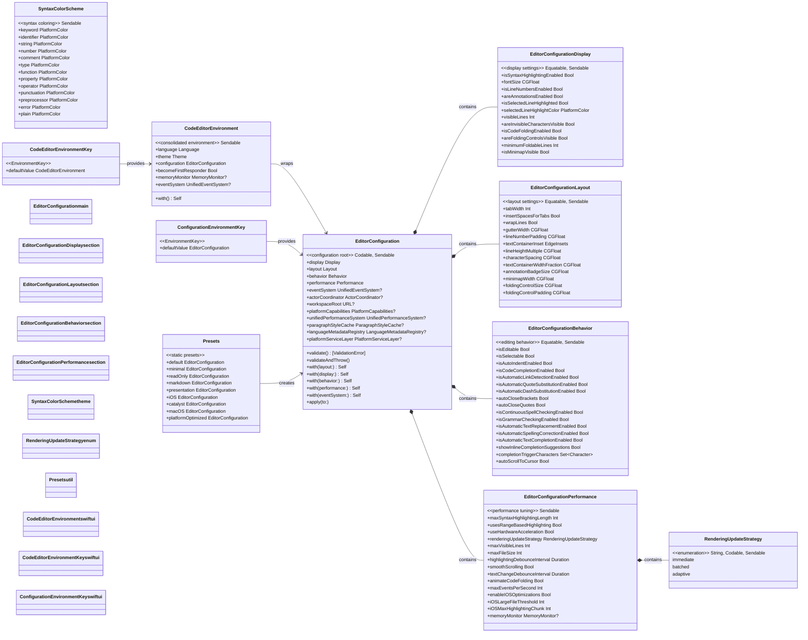

# Configuration System Diagram

This diagram illustrates the configuration system used throughout the CodeEditorPlugin framework, including nested configuration sections, presets, and SwiftUI environment integration.



## Configuration Usage Patterns

### Direct Property Access
```swift
config.display.isLineNumbersEnabled = true
config.layout.tabWidth = 4
config.behavior.isAutoIndentEnabled = true
config.performance.maxSyntaxHighlightingLength = 500_000
```

### Immutable Updates via with()
```swift
let config = EditorConfiguration()
let updated = config
    .with(display: modifiedDisplay)
    .with(layout: modifiedLayout)
    .with(behavior: modifiedBehavior)
```

### Presets
```swift
let defaultConfig = EditorConfiguration.default
let minimalConfig = EditorConfiguration.minimal
let readOnlyConfig = EditorConfiguration.readOnly
let markdownConfig = EditorConfiguration.markdown
let presentationConfig = EditorConfiguration.presentation
let platformConfig = EditorConfiguration.platformOptimized

// Platform-specific presets
let iOSConfig = EditorConfiguration.iOS
let catalystConfig = EditorConfiguration.catalyst
let macOSConfig = EditorConfiguration.macOS
```

### Environment Integration
```swift
CodeEditor(text: $code)
    .codeEditorEnvironment(
        language: .swift,
        theme: .default,
        configuration: customConfig
    )

// Or set the full environment directly
CodeEditor(text: $code)
    .environment(\.codeEditorEnvironment, CodeEditorEnvironment(
        language: .swift,
        theme: .dark,
        configuration: myConfig
    ))
```
