# Configuration System Diagram

This diagram illustrates the comprehensive configuration system used throughout the CodeEditorPlugin framework.

```mermaid
classDiagram
    %% Root Configuration
    class EditorConfiguration {
        &lt;&lt;configuration root&gt;&gt;
        +display DisplayConfiguration
        +layout LayoutConfiguration
        +behavior BehaviorConfiguration
        +performance PerformanceConfiguration
        +static defaultConfiguration EditorConfiguration
        +static minimalConfiguration EditorConfiguration
        +static performanceConfiguration EditorConfiguration
        +validate() throws
        +copy(with (inout EditorConfiguration) -> Void) EditorConfiguration
    }

    %% Visual Display Settings
    class DisplayConfiguration {
        &lt;&lt;visual settings&gt;&gt;
        +fontSize CGFloat
        +fontName String?
        +showLineNumbers Bool
        +showInvisibles Bool
        +showMinimap Bool
        +theme ThemeConfiguration
        +cursorStyle CursorStyle
        +selectionStyle SelectionStyle
    }

    class ThemeConfiguration {
        &lt;&lt;color theme&gt;&gt;
        +backgroundColor Color
        +textColor Color
        +lineNumberColor Color
        +gutterBackgroundColor Color
        +selectionColor Color
        +cursorColor Color
        +syntaxColors SyntaxColorScheme
    }

    class SyntaxColorScheme {
        &lt;&lt;syntax coloring&gt;&gt;
        +keyword Color
        +string Color
        +comment Color
        +number Color
        +function Color
        +type Color
        +variable Color
        +operator Color
    }

    %% Layout & Spacing Settings
    class LayoutConfiguration {
        &lt;&lt;layout settings&gt;&gt;
        +tabWidth Int
        +indentStyle IndentStyle
        +lineWrapping LineWrappingMode
        +gutterWidth CGFloat?
        +minimapWidth CGFloat
        +lineSpacing CGFloat
        +contentInsets EdgeInsets
    }

    class IndentStyle {
        &lt;&lt;enumeration&gt;&gt;
        spaces(Int)
        tabs
    }

    class LineWrappingMode {
        &lt;&lt;enumeration&gt;&gt;
        none
        word
        character
    }

    %% Editor Behavior Settings
    class BehaviorConfiguration {
        &lt;&lt;editing behavior&gt;&gt;
        +autoIndent Bool
        +autoCloseBrackets Bool
        +highlightMatchingBrackets Bool
        +enableCompletions Bool
        +completionTriggerCharacters Set~String~
        +tabKeyBehavior TabKeyBehavior
        +pasteFormatting PasteFormatting
    }

    class TabKeyBehavior {
        &lt;&lt;enumeration&gt;&gt;
        insertTab
        insertSpaces
        triggerCompletion
    }

    %% Performance & Optimization Settings
    class PerformanceConfiguration {
        &lt;&lt;performance tuning&gt;&gt;
        +asyncHighlighting Bool
        +highlightingDebounce TimeInterval
        +maxHighlightingLength Int
        +enableLineCache Bool
        +cacheSize Int
        +virtualScrolling Bool
        +memoryWarningThreshold Double
    }

    %% Configuration Management System
    class ConfigurationValidator {
        &lt;&lt;validation logic&gt;&gt;
        +validate(EditorConfiguration) throws
        +validateFontSize(CGFloat) throws
        +validateTabWidth(Int) throws
        +validateCacheSize(Int) throws
    }

    class ConfigurationPresets {
        &lt;&lt;preset factory&gt;&gt;
        +minimal() EditorConfiguration
        +standard() EditorConfiguration
        +performance() EditorConfiguration
        +accessibility() EditorConfiguration
        +custom(builder) EditorConfiguration
    }

    %% SwiftUI Integration Layer
    class ConfigurationEnvironmentKey {
        &lt;&lt;EnvironmentKey&gt;&gt;
        +defaultValue EditorConfiguration
    }

    class AppState {
        &lt;&lt;ObservableObject&gt;&gt;
        @Published configuration EditorConfiguration
        +updateConfiguration((inout EditorConfiguration) -> Void)
        +resetToDefault()
        +loadFromUserDefaults()
        +saveToUserDefaults()
    }

    %% Persistence & Storage
    class ConfigurationPersistence {
        &lt;&lt;data persistence&gt;&gt;
        +save(EditorConfiguration, to URL) throws
        +load(from URL) EditorConfiguration throws
        +encodeJSON(EditorConfiguration) Data throws
        +decodeJSON(Data) EditorConfiguration throws
    }

    %% Relationships
    EditorConfiguration *-- DisplayConfiguration : contains
    EditorConfiguration *-- LayoutConfiguration : contains
    EditorConfiguration *-- BehaviorConfiguration : contains
    EditorConfiguration *-- PerformanceConfiguration : contains
    
    DisplayConfiguration *-- ThemeConfiguration : contains
    ThemeConfiguration *-- SyntaxColorScheme : contains
    
    LayoutConfiguration --> IndentStyle : uses
    LayoutConfiguration --> LineWrappingMode : uses
    
    BehaviorConfiguration --> TabKeyBehavior : uses
    
    ConfigurationValidator --> EditorConfiguration : validates
    ConfigurationPresets --> EditorConfiguration : creates
    
    AppState --> EditorConfiguration : manages
    AppState --> ConfigurationPersistence : uses
    
    ConfigurationEnvironmentKey --> EditorConfiguration : provides
    
    %% Styling - Dark mode friendly colors
    classDef main fill:#6366f120,stroke:#6366f1,stroke-width:3px,color:#fff
    classDef section fill:#8b5cf620,stroke:#8b5cf6,stroke-width:2px,color:#fff
    classDef theme fill:#10b98120,stroke:#10b981,stroke-width:2px,color:#fff
    classDef enum fill:#06b6d420,stroke:#06b6d4,stroke-width:2px,color:#fff
    classDef util fill:#f59e0b20,stroke:#f59e0b,stroke-width:2px,color:#fff
    classDef swiftui fill:#10b98120,stroke:#10b981,stroke-width:2px,color:#fff
    
    class EditorConfiguration main
    class DisplayConfiguration section
    class LayoutConfiguration section
    class BehaviorConfiguration section
    class PerformanceConfiguration section
    class ThemeConfiguration theme
    class SyntaxColorScheme theme
    class IndentStyle enum
    class LineWrappingMode enum
    class TabKeyBehavior enum
    class ConfigurationValidator util
    class ConfigurationPresets util
    class ConfigurationPersistence util
    class ConfigurationEnvironmentKey swiftui
    class AppState swiftui
```



## Configuration Usage Patterns

### Direct Property Access
```swift
config.display.showLineNumbers = true
config.layout.tabWidth = 4
```

### Batch Updates
```swift
appState.updateConfiguration { config in
    config.display.fontSize = 16
    config.behavior.autoIndent = true
}
```

### Environment Integration
```swift
CodeEditor(text: $code)
    .environment(\.codeEditorConfiguration, customConfig)
```

### Presets
```swift
let minimalConfig = EditorConfiguration.minimal
let performanceConfig = EditorConfiguration.performance
```