# Configuration System Diagram

This diagram illustrates the comprehensive configuration system used throughout the CodeEditorPlugin framework, including batch update management for minimizing change notifications.

```mermaid
classDiagram
    direction LR
    
    %% Top Row - Root Configuration
    class EditorConfiguration {
        &lt;&lt;configuration root&gt;&gt;
        +display DisplayConfiguration
        +layout LayoutConfiguration
        +behavior BehaviorConfiguration
        +performance PerformanceConfiguration
        +eventSystem UnifiedEventSystem?
        +actorCoordinator ActorCoordinator?
        +workspaceRoot URL?
        +allowedPlugins Set~String~
        +pluginSettings [String: Any]
        +validate()
        +copy()
        +updateConfiguration()
    }

    class ConfigurationPresets {
        &lt;&lt;preset factory&gt;&gt;
        +minimal()
        +standard()
        +performance()
        +accessibility()
        +custom()
    }

    class ConfigurationValidator {
        &lt;&lt;validation logic&gt;&gt;
        +validate()
        +validateFontSize()
        +validateTabWidth()
        +validateCacheSize()
        +autoFixSuggestions()
        +detailedReporting()
    }

    %% New Configuration Features
    class ConfigurationDSL {
        &lt;&lt;result builder&gt;&gt;
        +buildBlock()
        +buildExpression()
        +createConfiguration()
    }

    class ConfigurationHotReload {
        &lt;&lt;ObservableObject&gt;&gt;
        +isEnabled Bool
        +reloadHistory [ConfigurationSnapshot]
        +undoStack [EditorConfiguration]
        +enableHotReload()
        +revertChanges()
        +clearHistory()
    }

    class ConfigurationMigrator {
        &lt;&lt;version management&gt;&gt;
        +currentVersion String
        +migrate()
        +validateVersion()
        +backup()
    }

    %% Second Row - Core Configuration Sections
    class DisplayConfiguration {
        &lt;&lt;visual settings&gt;&gt;
        +fontSize CGFloat
        +fontName String?
        +showLineNumbers Bool
        +showInvisibles Bool
        +showMinimap Bool
        +theme ThemeConfiguration
    }

    class LayoutConfiguration {
        &lt;&lt;layout settings&gt;&gt;
        +tabWidth Int
        +indentStyle IndentStyle
        +lineWrapping LineWrappingMode
        +gutterWidth CGFloat?
        +minimapWidth CGFloat
        +lineSpacing CGFloat
    }

    class BehaviorConfiguration {
        &lt;&lt;editing behavior&gt;&gt;
        +autoIndent Bool
        +autoCloseBrackets Bool
        +highlightMatchingBrackets Bool
        +enableCompletions Bool
        +tabKeyBehavior TabKeyBehavior
    }

    %% Third Row - Performance & Themes
    class PerformanceConfiguration {
        &lt;&lt;performance tuning&gt;&gt;
        +asyncHighlighting Bool
        +highlightingDebounce TimeInterval
        +maxHighlightingLength Int
        +enableLineCache Bool
        +cacheSize Int
        +virtualScrolling Bool
        +iOSLargeFileOptimization Bool
        +chunkSize Int
        +memoryThreshold Double
    }

    class ThemeConfiguration {
        &lt;&lt;color theme&gt;&gt;
        +backgroundColor Color
        +textColor Color
        +lineNumberColor Color
        +selectionColor Color
        +cursorColor Color
        +syntaxColors SyntaxColorScheme
    }

    class SyntaxColorScheme {
        &lt;&lt;syntax coloring&gt;&gt;
        +keyword Color
        +string Color
        +comment Color
        +number Color
        +function Color
        +type Color
    }

    %% Fourth Row - Enumerations
    class IndentStyle {
        &lt;&lt;enumeration&gt;&gt;
        spaces(Int)
        tabs
    }

    class LineWrappingMode {
        &lt;&lt;enumeration&gt;&gt;
        none
        word
        character
    }

    class TabKeyBehavior {
        &lt;&lt;enumeration&gt;&gt;
        insertTab
        insertSpaces
        triggerCompletion
    }

    %% Fifth Row - Plugin & System Configuration
    class PluginConfiguration {
        &lt;&lt;plugin settings&gt;&gt;
        +enabledPlugins Set~String~
        +pluginPermissions [String: Set~PluginPermission~]
        +pluginSettings [String: Any]
        +autoLoadPlugins Bool
        +pluginSearchPaths [URL]
    }

    class SystemConfiguration {
        &lt;&lt;system integration&gt;&gt;
        +eventSystem UnifiedEventSystem?
        +actorCoordinator ActorCoordinator?
        +memoryMonitor MemoryMonitor?
        +languageRegistry LanguageRegistry
        +completionRegistry CompletionProviderRegistry
    }

    %% Sixth Row - SwiftUI Integration & Persistence
    class AppState {
        &lt;&lt;ObservableObject&gt;&gt;
        @Published configuration EditorConfiguration
        +updateConfiguration()
        +resetToDefault()
        +loadFromUserDefaults()
        +saveToUserDefaults()
    }

    class CodeEditorEnvironment {
        &lt;&lt;consolidated environment&gt;&gt;
        +language Language
        +theme CodeEditorSwiftUITheme
        +configuration EditorConfiguration
        +becomeFirstResponder Bool
        +memoryMonitor MemoryMonitor?
        +eventSystem UnifiedEventSystem?
        +with() CodeEditorEnvironment
    }

    class CodeEditorEnvironmentKey {
        &lt;&lt;EnvironmentKey&gt;&gt;
        +defaultValue CodeEditorEnvironment
    }

    class ConfigurationPersistence {
        &lt;&lt;data persistence&gt;&gt;
        +save() throws
        +load() throws
        +encodeJSON() throws
        +decodeJSON() throws
    }

    %% Seventh Row - Configuration Update Management
    class ConfigurationBatchUpdater {
        &lt;&lt;batch updates&gt;&gt;
        +pendingUpdates [(EditorConfiguration) -> EditorConfiguration]
        +updateTimer Timer?
        +updateDelay TimeInterval
        +onUpdate (EditorConfiguration) -> Void
        +lazyEvaluation Bool
        +validationCaching Bool
        +batchUpdate()
        +flushUpdates()
        +queueUpdate()
        +applyPendingUpdates()
        +scheduleUpdate()
    }

    %% Relationships
    EditorConfiguration *-- DisplayConfiguration : contains
    EditorConfiguration *-- LayoutConfiguration : contains
    EditorConfiguration *-- BehaviorConfiguration : contains
    EditorConfiguration *-- PerformanceConfiguration : contains
    EditorConfiguration --> SystemConfiguration : integrates
    EditorConfiguration --> PluginConfiguration : includes
    
    DisplayConfiguration *-- ThemeConfiguration : contains
    ThemeConfiguration *-- SyntaxColorScheme : contains
    
    LayoutConfiguration --> IndentStyle : uses
    LayoutConfiguration --> LineWrappingMode : uses
    
    BehaviorConfiguration --> TabKeyBehavior : uses
    
    ConfigurationValidator --> EditorConfiguration : validates
    ConfigurationPresets --> EditorConfiguration : creates
    ConfigurationDSL --> EditorConfiguration : builds
    ConfigurationMigrator --> EditorConfiguration : upgrades
    ConfigurationHotReload --> EditorConfiguration : observes
    
    AppState --> EditorConfiguration : manages
    AppState --> ConfigurationPersistence : uses
    AppState --> ConfigurationBatchUpdater : uses
    
    CodeEditorEnvironment --> EditorConfiguration : wraps
    CodeEditorEnvironmentKey --> CodeEditorEnvironment : provides
    
    ConfigurationBatchUpdater --> EditorConfiguration : batches updates
    
    ConfigurationEnvironmentKey --> EditorConfiguration : provides
    
    %% Styling - Light/Dark mode compatible colors
    classDef main fill:#007AFF20,stroke:#007AFF,stroke-width:3px,color:#1D1D1F
    classDef section fill:#AF52DE20,stroke:#AF52DE,stroke-width:2px,color:#1D1D1F
    classDef theme fill:#34C75920,stroke:#34C759,stroke-width:2px,color:#1D1D1F
    classDef enum fill:#007AFF20,stroke:#007AFF,stroke-width:2px,color:#1D1D1F
    classDef util fill:#FF950020,stroke:#FF9500,stroke-width:2px,color:#1D1D1F
    classDef swiftui fill:#34C75920,stroke:#34C759,stroke-width:2px,color:#1D1D1F
    
    class EditorConfiguration main
    class DisplayConfiguration section
    class LayoutConfiguration section
    class BehaviorConfiguration section
    class PerformanceConfiguration section
    class ThemeConfiguration theme
    class SyntaxColorScheme theme
    class IndentStyle enum
    class LineWrappingMode enum
    class PluginConfiguration integration
    class SystemConfiguration integration
    class PluginPermission enum
    class TabKeyBehavior enum
    class ConfigurationValidator util
    class ConfigurationPresets util
    class ConfigurationPersistence util
    class ConfigurationBatchUpdater util
    class ConfigurationEnvironmentKey swiftui
    class AppState swiftui
```



## Configuration Usage Patterns

### Direct Property Access
```swift
config.display.showLineNumbers = true
config.layout.tabWidth = 4
```

### Batch Updates
```swift
appState.updateConfiguration { config in
    config.display.fontSize = 16
    config.behavior.autoIndent = true
}
```

### Batch Updates with Updater
```swift
let batchUpdater = ConfigurationBatchUpdater { updatedConfig in
    appState.configuration = updatedConfig
}

// Queue multiple updates
batchUpdater.queueUpdate { config in
    config.display.fontSize = 16
}

batchUpdater.queueUpdate { config in
    config.behavior.autoIndent = true
}

// Updates are automatically batched and applied after delay
```

### Environment Integration
```swift
CodeEditor(text: $code)
    .environment(\.codeEditorConfiguration, customConfig)
```

### Presets
```swift
let minimalConfig = EditorConfiguration.minimal
let performanceConfig = EditorConfiguration.performance
```