# Service Architecture Diagram

This diagram shows the service-oriented architecture and how services interact within the CodeEditorPlugin framework.

```mermaid
classDiagram
    %% Service Registry
    class BusinessLogicServiceRegistry {
        -services: Dictionary~String, Any~
        -eventSystem: UnifiedEventSystem
        +shared: BusinessLogicServiceRegistry
        +register~T~(type: T.Type, service: T)
        +resolve~T~(type: T.Type) T?
        +initialize(eventSystem: UnifiedEventSystem)
        +shutdown()
    }

    %% Core Services
    class TextEditingService {
        -textView: CodeEditorView
        -undoManager: UndoManager
        +performEdit(EditAction)
        +insertText(String, at: NSRange)
        +deleteText(in: NSRange)
        +replaceText(in: NSRange, with: String)
        +applyIndentation(to: NSRange)
        +toggleComment(in: NSRange)
    }

    class EditAction {
        &lt;&lt;enumeration&gt;&gt;
        insert(text: String, range: NSRange)
        delete(range: NSRange)
        replace(range: NSRange, text: String)
        indent(range: NSRange)
        outdent(range: NSRange)
        comment(range: NSRange)
    }

    class SyntaxHighlightingService {
        -coordinator: SyntaxHighlightingCoordinator
        -cache: HighlightingCache
        -queue: DispatchQueue
        +highlightDocument(text: String, language: LanguageConfig)
        +highlightRange(NSRange, in: String, language: LanguageConfig)
        +invalidateCache(for: NSRange?)
        +cancelPendingHighlighting()
    }

    class LanguageDetectionService {
        -detectors: [LanguageDetector]
        -cache: Dictionary~String, LanguageConfig~
        +detectLanguage(fileExtension: String) LanguageConfig?
        +detectLanguage(content: String) LanguageConfig?
        +registerDetector(LanguageDetector)
        +clearCache()
    }

    class CompletionManager {
        -providers: Dictionary~String, CompletionProvider~
        -activeSession: CompletionSession?
        -debouncer: Debouncer
        +requestCompletions(context: CompletionContext)
        +registerProvider(for: String, provider: CompletionProvider)
        +cancelActiveSession()
        +applyCompletion(CompletionItem)
    }

    class MemoryMonitor {
        -threshold: Double
        -timer: Timer?
        -delegate: MemoryMonitorDelegate?
        +startMonitoring(interval: TimeInterval)
        +stopMonitoring()
        +currentMemoryUsage() Double
        +checkMemoryPressure()
    }

    %% Service Lifecycle
    class ServiceLifecycle {
        &lt;&lt;interface&gt;&gt;
        +initialize()
        +shutdown()
        +suspend()
        +resume()
    }

    %% Service Dependencies
    class ServiceDependencies {
        +eventSystem: UnifiedEventSystem
        +configuration: EditorConfiguration
        +logger: CrossPlatformLogger
        +cache: CacheManager
    }

    %% Coordination
    class SyntaxHighlightingCoordinator {
        -highlighters: Dictionary~String, SyntaxHighlighter~
        -swiftSyntaxHighlighter: SwiftSyntaxHighlighter?
        -regexHighlighter: RegexHighlighter
        +coordinate(request: HighlightingRequest)
        +selectHighlighter(for: LanguageConfig) SyntaxHighlighter
    }

    class CompletionSession {
        +id: UUID
        +context: CompletionContext
        +provider: CompletionProvider
        +startTime: Date
        +items: [CompletionItem]
        +isActive: Bool
        +cancel()
    }

    %% Cache Management
    class CacheManager {
        -caches: Dictionary~String, Cache~
        +syntaxCache: Cache~HighlightingResult~
        +completionCache: Cache~CompletionResult~
        +languageCache: Cache~LanguageConfig~
        +clearAll()
        +clearExpired()
    }

    %% Event Integration
    class ServiceEventHandler {
        -registry: BusinessLogicServiceRegistry
        +handleTextChange(Event)
        +handleLanguageChange(Event)
        +handleConfigurationChange(Event)
        +handleMemoryWarning(Event)
    }

    %% Relationships
    BusinessLogicServiceRegistry "1" *-- "*" TextEditingService : manages
    BusinessLogicServiceRegistry "1" *-- "1" SyntaxHighlightingService : manages
    BusinessLogicServiceRegistry "1" *-- "1" LanguageDetectionService : manages
    BusinessLogicServiceRegistry "1" *-- "1" CompletionManager : manages
    BusinessLogicServiceRegistry "1" *-- "1" MemoryMonitor : manages
    
    TextEditingService --> EditAction : uses
    TextEditingService ..|> ServiceLifecycle : implements
    
    SyntaxHighlightingService --> SyntaxHighlightingCoordinator : uses
    SyntaxHighlightingService --> CacheManager : uses
    SyntaxHighlightingService ..|> ServiceLifecycle : implements
    
    LanguageDetectionService --> CacheManager : uses
    LanguageDetectionService ..|> ServiceLifecycle : implements
    
    CompletionManager --> CompletionSession : creates
    CompletionManager --> CacheManager : uses
    CompletionManager ..|> ServiceLifecycle : implements
    
    MemoryMonitor ..|> ServiceLifecycle : implements
    
    BusinessLogicServiceRegistry --> ServiceDependencies : uses
    BusinessLogicServiceRegistry --> ServiceEventHandler : uses
    
    ServiceEventHandler --> UnifiedEventSystem : listens to
    
    SyntaxHighlightingCoordinator --> SyntaxHighlighter : coordinates
    
    %% Styling
    classDef registry fill:#e3f2fd,stroke:#2196f3,stroke-width:3px
    classDef service fill:#fff3e0,stroke:#ff9800,stroke-width:2px
    classDef coordinator fill:#e8f5e9,stroke:#4caf50,stroke-width:2px
    classDef lifecycle fill:#f3e5f5,stroke:#9c27b0,stroke-width:2px
    classDef support fill:#fce4ec,stroke:#e91e63,stroke-width:2px
    classDef enum fill:#e0f2f1,stroke:#009688,stroke-width:2px
    
    class BusinessLogicServiceRegistry registry
    class TextEditingService service
    class SyntaxHighlightingService service
    class LanguageDetectionService service
    class CompletionManager service
    class MemoryMonitor service
    class SyntaxHighlightingCoordinator coordinator
    class CompletionSession coordinator
    class ServiceLifecycle lifecycle
    class ServiceDependencies support
    class CacheManager support
    class ServiceEventHandler support
    class EditAction enum
```

## Service Architecture Principles

1. **Service Registry Pattern**: Central registry manages all service instances
2. **Dependency Injection**: Services receive dependencies through constructor
3. **Lifecycle Management**: All services implement lifecycle protocol
4. **Event-Driven Communication**: Services communicate through event system
5. **Caching Strategy**: Shared cache manager for performance
6. **Async Operations**: Heavy operations run on background queues
7. **Memory Management**: Automatic cleanup on memory warnings