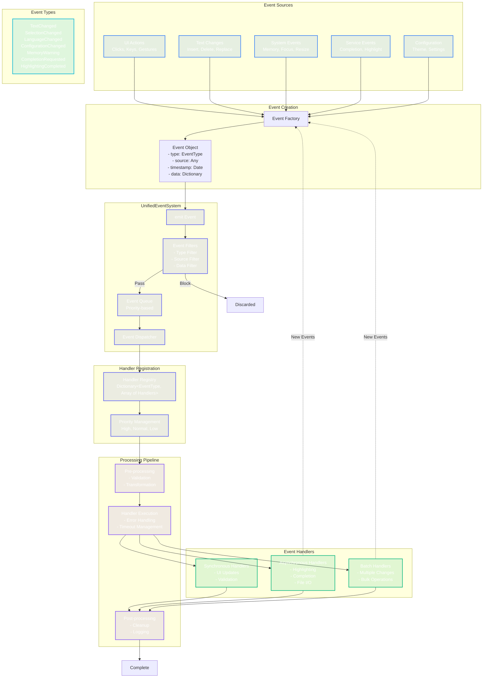

# Event System Flow Diagram

This diagram illustrates the unified event system that enables decoupled communication between components.



## Event System Code Examples

### Event Definition
```swift
struct Event {
    let type: EventType
    let source: Any
    let timestamp: Date
    let data: [String: Any]
}

enum EventType {
    case textChanged
    case selectionChanged
    case languageChanged
    case configurationChanged
    case memoryWarning
    case completionRequested
    case highlightingCompleted
}
```

### Handler Registration
```swift
eventSystem.register(.textChanged, priority: .high) { event in
    // Handle text change
    guard let range = event.data["range"] as? NSRange else { return }
    // Process change...
}
```

### Event Emission
```swift
eventSystem.emit(Event(
    type: .textChanged,
    source: self,
    timestamp: Date(),
    data: ["range": range, "text": newText]
))
```

### Event Filtering
```swift
eventSystem.addFilter { event in
    // Only process events from specific sources
    return event.source is CodeEditorView
}
```

## Key Features

1. **Priority-based Processing**: High-priority events processed first
2. **Asynchronous Support**: Long-running handlers don't block UI
3. **Event Filtering**: Reduce unnecessary processing
4. **Batch Processing**: Efficient handling of multiple related events
5. **Error Isolation**: Handler errors don't crash the system
6. **Event Chaining**: Handlers can emit new events
7. **Performance Monitoring**: Track handler execution times