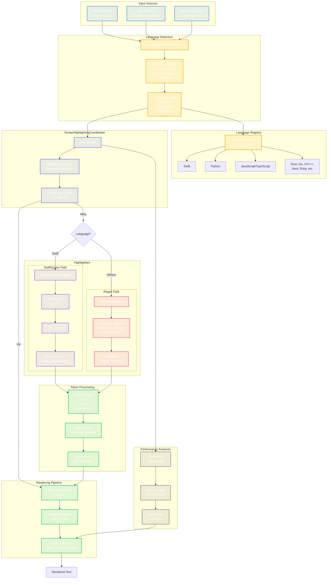

# Language Support & Syntax Highlighting Pipeline

This diagram shows the complete pipeline for language detection and syntax highlighting, including both SwiftSyntax and regex-based paths.



## Language Configuration Example

```swift
struct LanguageConfig {
    let identifier: String
    let displayName: String
    let fileExtensions: [String]
    let highlighterType: HighlighterType
    let completionProvider: CompletionProvider?
    let indentationRules: IndentationRules
}

enum HighlighterType {
    case swiftSyntax
    case regex(patterns: LanguagePatterns)
}
```

## Performance Optimizations

1. **AST Caching**: SwiftSyntax ASTs cached for reuse
2. **LRU Cache**: Recently highlighted documents cached
3. **Viewport Rendering**: Only visible text highlighted
4. **Incremental Updates**: Only changed regions re-highlighted
5. **Debouncing**: Rapid changes batched together
6. **Background Processing**: Heavy parsing off main thread
7. **Token Batching**: Multiple tokens applied in single update