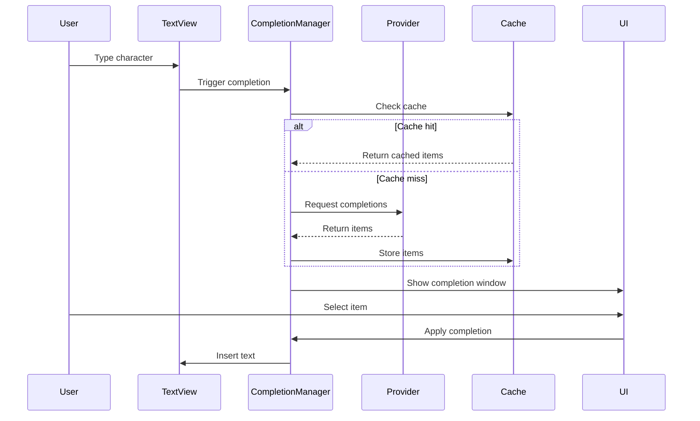

# Completion System Architecture

This diagram shows the code completion system architecture, including provider management, caching, and UI integration.

```mermaid
classDiagram
    direction LR
    
    %% Top Row - Core Manager & Context
    class CompletionManager {
        &lt;&lt;completion orchestrator&gt;&gt;
        -providers Dictionary
        -activeSession CompletionSession?
        -debouncer Debouncer
        -cache CompletionCache
        +requestCompletions()
        +registerProvider()
        +cancelActiveSession()
        +applyCompletion()
    }

    class CompletionContext {
        &lt;&lt;completion request&gt;&gt;
        +textView CodeEditorView
        +position TextPosition
        +prefix String
        +lineContent String
        +language LanguageConfig
        +trigger CompletionTrigger
    }

    class CompletionSession {
        &lt;&lt;session state&gt;&gt;
        +id UUID
        +context CompletionContext
        +provider CompletionProvider
        +startTime Date
        +items [CompletionItem]
        +isActive Bool
        +cancel()
        +filter()
        +sort()
    }

    %% Second Row - Provider System
    class CompletionProvider {
        &lt;&lt;provider protocol&gt;&gt;
        +languageId String
        +triggerCharacters Set
        +provideCompletions() async
        +resolveCompletion() async
        +shouldTrigger() Bool
    }

    class UniversalCompletionProvider {
        &lt;&lt;provider factory&gt;&gt;
        -registry ProviderRegistry
        +createProvider()
        +registerCustomProvider()
    }

    class SwiftCompletionProvider {
        &lt;&lt;Swift provider&gt;&gt;
        -sourceKitService SourceKitService
        -astCache ASTCache
        +provideCompletions() async
        +resolveCompletion() async
    }

    %% Third Row - Provider Implementations
    class LSPCompletionProvider {
        &lt;&lt;LSP provider&gt;&gt;
        -lspClient LSPClient
        -documentManager DocumentManager
        +provideCompletions() async
        +resolveCompletion() async
    }

    class KeywordCompletionProvider {
        &lt;&lt;keyword provider&gt;&gt;
        -keywordDatabase KeywordDatabase
        +provideCompletions() async
    }

    class SnippetCompletionProvider {
        &lt;&lt;snippet provider&gt;&gt;
        -snippetLibrary SnippetLibrary
        +provideCompletions() async
        +expandSnippet() String
    }

    %% Fourth Row - Completion Items & UI
    class CompletionItem {
        &lt;&lt;completion suggestion&gt;&gt;
        +label String
        +kind CompletionItemKind
        +detail String?
        +documentation String?
        +insertText String
        +range NSRange
        +score Double
    }

    class CompletionWindowController {
        &lt;&lt;UI controller&gt;&gt;
        -tableView NSTableView
        -items [CompletionItem]
        -selectedIndex Int
        +show()
        +hide()
        +selectNext()
        +selectPrevious()
        +applySelectedCompletion()
    }

    class CompletionCellView {
        &lt;&lt;UI cell&gt;&gt;
        +iconView NSImageView
        +labelField NSTextField
        +detailField NSTextField
        +configure()
    }

    %% Fifth Row - Caching & Enumerations
    class CompletionCache {
        &lt;&lt;completion cache&gt;&gt;
        -cache LRUCache
        -ttl TimeInterval
        +get() CachedCompletion?
        +set()
        +invalidate()
        +cleanExpired()
    }

    class CachedCompletion {
        &lt;&lt;cached data&gt;&gt;
        +items [CompletionItem]
        +timestamp Date
        +context CompletionContext
    }

    class CompletionTrigger {
        &lt;&lt;enumeration&gt;&gt;
        automatic
        manual
        snippet
        import
    }

    class CompletionItemKind {
        &lt;&lt;enumeration&gt;&gt;
        text
        method
        function
        constructor
        field
        variable
        class
        interface
        module
        property
        keyword
        snippet
    }

    %% Key Relationships
    CompletionManager --> CompletionSession : manages
    CompletionManager --> CompletionProvider : uses
    CompletionManager --> CompletionCache : uses
    CompletionManager --> CompletionWindowController : controls
    
    CompletionSession --> CompletionContext : contains
    CompletionSession --> CompletionItem : produces
    
    CompletionProvider <|-- SwiftCompletionProvider : implements
    CompletionProvider <|-- LSPCompletionProvider : implements
    CompletionProvider <|-- KeywordCompletionProvider : implements
    CompletionProvider <|-- SnippetCompletionProvider : implements
    
    UniversalCompletionProvider --> CompletionProvider : creates
    CompletionContext --> CompletionTrigger : contains
    CompletionItem --> CompletionItemKind : has
    CompletionWindowController --> CompletionCellView : displays
    CompletionCache --> CachedCompletion : stores
    
    %% Styling - Dark mode friendly colors
    classDef manager fill:#007AFF20,stroke:#007AFF,stroke-width:3px,color:#1D1D1F
    classDef provider fill:#AF52DE20,stroke:#AF52DE,stroke-width:2px,color:#1D1D1F
    classDef context fill:#34C75920,stroke:#34C759,stroke-width:2px,color:#1D1D1F
    classDef ui fill:#007AFF20,stroke:#007AFF,stroke-width:2px,color:#1D1D1F
    classDef cache fill:#FF950020,stroke:#FF9500,stroke-width:2px,color:#1D1D1F
    classDef enum fill:#007AFF20,stroke:#007AFF,stroke-width:2px,color:#1D1D1F
    
    class CompletionManager manager
    class CompletionProvider provider
    class UniversalCompletionProvider provider
    class SwiftCompletionProvider provider
    class LSPCompletionProvider provider
    class KeywordCompletionProvider provider
    class SnippetCompletionProvider provider
    class CompletionContext context
    class CompletionSession context
    class CompletionItem context
    class CompletionWindowController ui
    class CompletionCellView ui
    class CompletionCache cache
    class CachedCompletion cache
    class CompletionTrigger enum
    class CompletionItemKind enum
```

## Completion Flow

## Key Features

1. **Multi-Provider Support**: Different providers for different languages
2. **Async Processing**: Non-blocking completion requests
3. **Smart Caching**: LRU cache with context-aware invalidation
4. **Debouncing**: Prevents excessive completion requests
5. **Filtering & Sorting**: Client-side filtering of results
6. **LSP Integration**: Full Language Server Protocol support
7. **Snippet Expansion**: Template-based code snippets