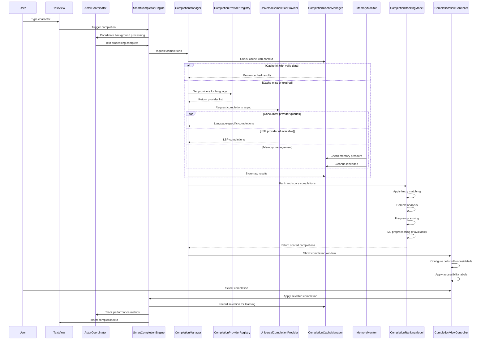
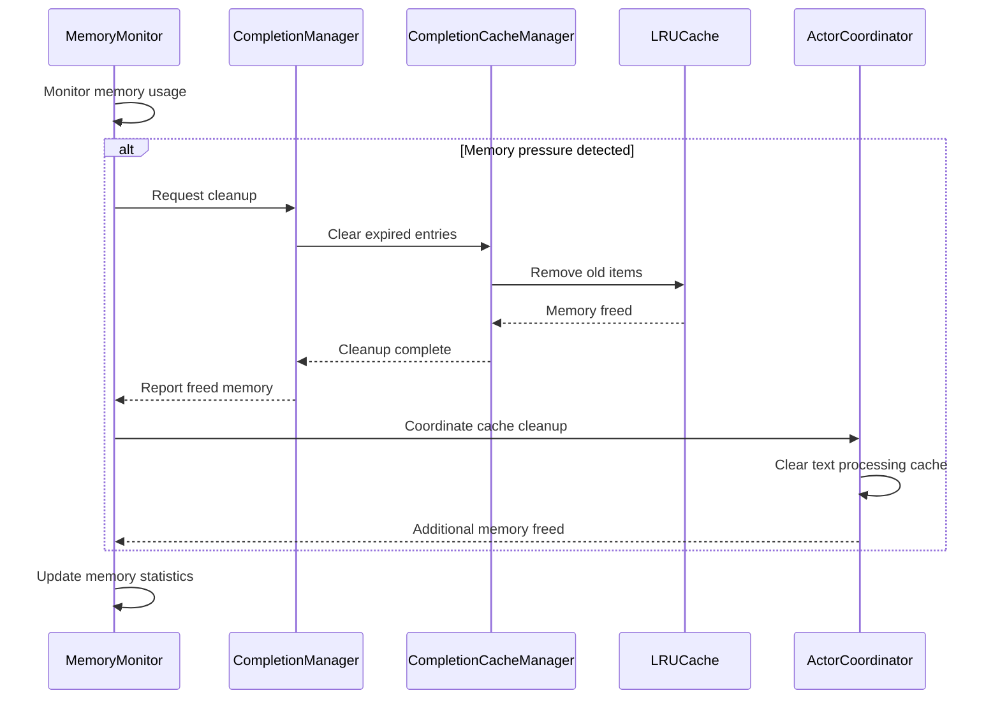
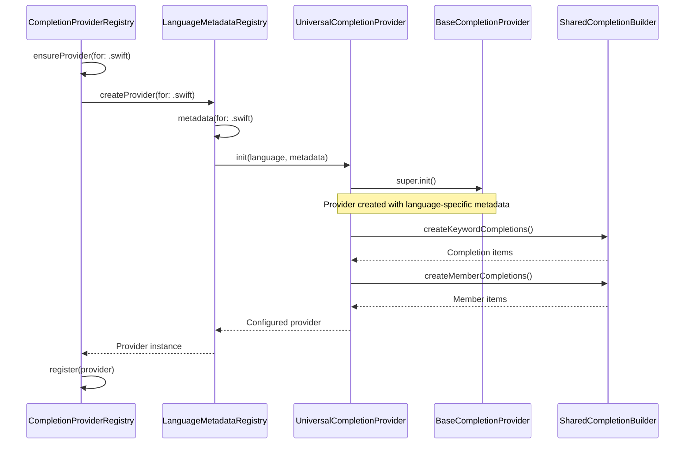

# Completion System Architecture

This diagram shows the production-ready code completion system architecture with factory patterns, intelligent caching, ML-ready ranking, comprehensive LSP integration, ActorCoordinator patterns, enhanced memory management, and cross-platform completion providers.

```mermaid
classDiagram
    direction LR
    
    %% Actor Coordination Layer (NEW)
    class ActorCoordinator {
        <<dependency injection>>
        -textProcessor TextProcessingActor
        -cacheCoordinator CacheCoordinatorActor
        -performanceMetrics PerformanceMetricsActor
        -documentState DocumentStateActor
        -errorRecovery ErrorRecoveryCoordinator
        +processText() async String
        +trackPerformance() async
        +createDocument() async UUID
        +handleError() async
    }

    %% Core Orchestration Layer (ENHANCED)
    class SmartCompletionEngine {
        <<intelligent orchestrator>>
        -sessionTracker SessionTracker
        -rankingModel CompletionRankingModel
        -memoryMonitor MemoryMonitor
        -debouncer CompletionDebouncer
        -actorCoordinator ActorCoordinator
        -fuzzyMatcher FuzzyMatcher
        -settings SmartCompletionSettings
        +requestCompletions() async
        +recordSelection()
        +getSmartSuggestions() async
        +clearAllData()
        +performCleanup() async
    }

    class CompletionManager {
        <<production coordinator>>
        -providers [String: CompletionProvider]
        -cache LRUCache<CompletionKey, CachedResult>
        -debouncer CompletionDebouncer
        -memoryMonitor MemoryMonitor
        -statistics CompletionStatistics
        +registerProvider()
        +requestCompletions() async
        +requestCompletionsDebounced()
        +cancelCurrentRequest()
    }

    %% Registry and Factory Layer (ENHANCED)
    class CompletionProviderRegistry {
        <<centralized registry>>
        -providers [String: CompletionProvider]
        -languageProviders [Language: [CompletionProvider]]
        +register() CompletionProvider
        +ensureProvider() CompletionProvider?
        +getCompletions() async [CompletionResult]
        +mergeCompletionResults()
        +loadAllLanguageProviders()
        +validateProviders() async
    }

    class LanguageMetadataRegistry {
        <<metadata repository>>
        -completeLanguageMetadata [Language: ExtendedLanguageMetadata]
        +metadata() ExtendedLanguageMetadata?
        +createProvider() CompletionProvider?
        +supportedLanguages [Language]
        -createSwiftMetadata()
        -createTypeScriptMetadata()
        -createGoMetadata()
    }

    class UniversalCompletionProvider {
        <<universal provider>>
        -language Language
        -metadata LanguageMetadata
        +completions() async CompletionResult
        +id String
        +supportedLanguages [Language]
        +triggerCharacters [String]
    }

    class BaseCompletionProvider {
        <<abstract provider>>
        +keywords [String]
        +types [String]
        +functions [String]
        +literals [String]
        +snippets [SnippetTemplate]
        +analyzeContext() ContextAnalysisResult
        +createKeywordCompletions()
        +createMemberCompletions()
    }

    %% Enhanced Provider Implementations
    class SwiftCompletionProvider {
        <<Swift provider>>
        -sourceKitService SourceKitService
        -astCache TypedASTCache
        -symbolIndex SymbolIndex
        +provideCompletions() async
        +resolveCompletion() async
        +getDocumentation() async
    }

    class LSPCompletionProvider {
        <<LSP provider>>
        -lspManager LSPManager
        -currentFilePath String?
        -logger CrossPlatformLogger
        +completions() async CompletionResult
        +canProvideCompletion() Bool
        +updateContext()
        -convertLSPItemToCompletionItem()
        -languageIdForLanguage()
    }

    %% Advanced Caching System (ENHANCED)
    class CompletionCacheManager {
        <<intelligent cache>>
        -cache [String: CacheEntry]
        -maxCacheSize Int
        -maxCacheAge TimeInterval
        -cacheHits Int
        -cacheMisses Int
        +generateCacheKey() String
        +getCachedCompletions() [CompletionItem]
        +cacheCompletions()
        +clearCache()
        +cacheStatistics (size: Int, hitRate: Double)
        +recordCacheHit()
        +recordCacheMiss()
    }

    class LRUCache {
        <<generic LRU cache>>
        -capacity Int
        -memoryMonitor MemoryMonitor
        -items [Key: Value]
        -accessOrder [Key]
        +get() Value?
        +set()
        +removeAll()
        +statistics CacheStatistics
        +allKeys [Key]
    }

    %% Memory Management Integration (NEW)
    class MemoryMonitor {
        <<memory management>>
        -memoryProvider PlatformMemoryProvider
        -cleanupHandlers [String: CleanupHandler]
        -memoryStats MemoryStatistics
        -isUnderPressure Bool
        +registerCleanupHandler()
        +performCleanup() async Double
        +getCurrentMemoryUsage() Double
        +startMonitoring()
        +stopMonitoring()
    }

    %% Ranking and Intelligence (ENHANCED)
    class CompletionRankingModel {
        <<ML-ready ranking>>
        -fuzzyMatcher OptimizedFuzzyMatcher
        -contextAnalyzer ContextAnalyzer
        -usageTracker UsageTracker
        -mlPreprocessor MLPreprocessor?
        +rank() [CompletionItemModel]
        +rankCompletions() [ScoredCompletion]
        +updateModel()
        +exportFeatures() FeatureVector
    }

    class OptimizedFuzzyMatcher {
        <<optimized matching>>
        -algorithm FuzzyAlgorithm
        -characterWeights CharacterWeights
        -positionBias PositionBias
        -cacheEnabled Bool
        +match() FuzzyScore
        +batchMatch() [FuzzyScore]
        +optimizeForLanguage()
    }

    class FuzzyMatcher {
        <<standard fuzzy matching>>
        +match() [FuzzyMatchResult]
        +calculateScore() Double
        +isMatch() Bool
    }

    %% Cross-Platform UI Components (ENHANCED)
    class CompletionViewController {
        <<cross-platform UI>>
        -platformView PlatformView
        -completionList CompletionListView
        -detailView CompletionDetailView
        -accessibilityManager AccessibilityManager
        +showCompletions()
        +hideCompletions()
        +updateCompletions()
        +handleSelection()
    }

    class CompletionViewControllerBase {
        <<platform abstraction>>
        +configuration CompletionConfiguration
        +delegate CompletionViewControllerDelegate?
        +showCompletions() async
        +hideCompletions() async
        +setupPlatformSpecificBehavior()
    }

    class CompletionCellConfigurator {
        <<cell management>>
        -iconProvider IconProvider
        -textRenderer TextRenderer
        -detailFormatter DetailFormatter
        +configureCell()
        +updateAppearance()
        +setAccessibilityInfo()
    }

    %% Enhanced Data Models
    class ExtendedLanguageMetadata {
        <<enhanced metadata>>
        +keywords [String]
        +types [String]
        +functions [String]
        +literals [String]
        +triggerCharacters [String]
        +snippets [SnippetTemplate]
        +memberCompletions LanguageMemberCompletions
        +commonModules [String]
    }

    class CompletionContextModel {
        <<completion context>>
        +text String
        +cursorPosition Int
        +language Language
        +lineText String
        +currentWord String
        +timestamp Date
        +triggerCharacter String?
    }

    class CompletionItemModel {
        <<completion item>>
        +label String
        +insertText String
        +kind CompletionItemKind
        +detail String?
        +documentation String?
        +priority Double
        +snippetSupport Bool
        +textEdit CompletionTextEdit?
        +additionalTextEdits [CompletionTextEdit]
        +cacheableCopy() CompletionItemModel
    }

    class CompletionResult {
        <<completion result>>
        +items [CompletionItemModel]
        +context CompletionContextModel
        +isIncomplete Bool
        +processingTime TimeInterval
    }

    class CompletionStatistics {
        <<performance stats>>
        +totalRequests Int
        +totalCacheHits Int
        +totalCacheMisses Int
        +averageProcessingTime TimeInterval
        +lastRequestTime Date?
        +cacheHitRate Double
        +recordRequest()
        +recordCacheHit()
        +recordCacheMiss()
        +reset()
    }

    %% Snippet Collections (NEW)
    class SwiftSnippets {
        <<snippet templates>>
        +all [SnippetTemplate]
        -func SnippetTemplate
        -class SnippetTemplate
        -struct SnippetTemplate
        -enum SnippetTemplate
        -protocol SnippetTemplate
    }

    class TypeScriptSnippets {
        <<TypeScript snippets>>
        +all [SnippetTemplate]
        -interface SnippetTemplate
        -type SnippetTemplate
        -class SnippetTemplate
        -function SnippetTemplate
        -arrow SnippetTemplate
        -async SnippetTemplate
    }

    class GoSnippets {
        <<Go snippets>>
        +all [SnippetTemplate]
        -func SnippetTemplate
        -method SnippetTemplate
        -struct SnippetTemplate
        -interface SnippetTemplate
        -error SnippetTemplate
    }

    %% Member Completions (NEW)
    class SwiftMemberCompletions {
        <<Swift members>>
        +createMemberCompletions() [CompletionItemModel]
        -createStringMemberCompletions()
        -createArrayMemberCompletions()
        -createDictionaryMemberCompletions()
        -createCommonMemberCompletions()
    }

    class SharedCompletionBuilder {
        <<completion builder>>
        +createKeywordCompletions() [CompletionItemModel]
        +createTypeCompletions() [CompletionItemModel]
        +createFunctionCompletions() [CompletionItemModel]
        +createLiteralCompletions() [CompletionItemModel]
        +createMemberItems() [CompletionItemModel]
        +createParameterCompletions() [CompletionItemModel]
    }

    %% Key Relationships
    ActorCoordinator --> SmartCompletionEngine : coordinates
    SmartCompletionEngine --> CompletionManager : delegates to
    SmartCompletionEngine --> MemoryMonitor : manages memory
    SmartCompletionEngine --> FuzzyMatcher : uses
    
    CompletionManager --> CompletionProviderRegistry : queries
    CompletionManager --> LRUCache : caches results
    CompletionManager --> CompletionStatistics : tracks metrics
    
    CompletionProviderRegistry --> LanguageMetadataRegistry : uses metadata
    LanguageMetadataRegistry --> UniversalCompletionProvider : creates
    LanguageMetadataRegistry --> ExtendedLanguageMetadata : contains
    
    UniversalCompletionProvider --> BaseCompletionProvider : extends
    BaseCompletionProvider <|-- SwiftCompletionProvider : implements
    BaseCompletionProvider <|-- LSPCompletionProvider : implements
    
    LSPCompletionProvider --> CompletionItemModel : creates
    SwiftCompletionProvider --> CompletionItemModel : creates
    
    CompletionCacheManager --> LRUCache : uses
    MemoryMonitor --> CompletionCacheManager : cleanup target
    
    CompletionRankingModel --> OptimizedFuzzyMatcher : uses
    CompletionRankingModel --> FuzzyMatcher : fallback
    
    CompletionViewController --> CompletionViewControllerBase : extends
    CompletionViewController --> CompletionCellConfigurator : uses
    
    ExtendedLanguageMetadata --> SwiftSnippets : contains
    ExtendedLanguageMetadata --> TypeScriptSnippets : contains
    ExtendedLanguageMetadata --> GoSnippets : contains
    ExtendedLanguageMetadata --> SwiftMemberCompletions : uses
    
    SharedCompletionBuilder --> CompletionItemModel : creates
    CompletionResult --> CompletionItemModel : contains
    CompletionContextModel --> CompletionResult : context for

    %% Styling - Modern dark mode colors with new categories
    classDef actor fill:#007AFF25,stroke:#007AFF,stroke-width:3px,color:#1D1D1F
    classDef engine fill:#AF52DE25,stroke:#AF52DE,stroke-width:3px,color:#1D1D1F
    classDef registry fill:#34C75925,stroke:#34C759,stroke-width:2px,color:#1D1D1F
    classDef provider fill:#FF950025,stroke:#FF9500,stroke-width:2px,color:#1D1D1F
    classDef cache fill:#FF375F25,stroke:#FF375F,stroke-width:2px,color:#1D1D1F
    classDef memory fill:#5AC8FA25,stroke:#5AC8FA,stroke-width:2px,color:#1D1D1F
    classDef ranking fill:#FFCC0025,stroke:#FFCC00,stroke-width:2px,color:#1D1D1F
    classDef ui fill:#32D74B25,stroke:#32D74B,stroke-width:2px,color:#1D1D1F
    classDef data fill:#FF453A25,stroke:#FF453A,stroke-width:2px,color:#1D1D1F
    classDef snippets fill:#BF5AF225,stroke:#BF5AF2,stroke-width:2px,color:#1D1D1F
    classDef builder fill:#00C7BE25,stroke:#00C7BE,stroke-width:2px,color:#1D1D1F

    class ActorCoordinator actor
    class SmartCompletionEngine engine
    class CompletionManager engine
    class CompletionProviderRegistry registry
    class LanguageMetadataRegistry registry
    class UniversalCompletionProvider provider
    class BaseCompletionProvider provider
    class SwiftCompletionProvider provider
    class LSPCompletionProvider provider
    class CompletionCacheManager cache
    class LRUCache cache
    class MemoryMonitor memory
    class CompletionRankingModel ranking
    class OptimizedFuzzyMatcher ranking
    class FuzzyMatcher ranking
    class CompletionViewController ui
    class CompletionViewControllerBase ui
    class CompletionCellConfigurator ui
    class ExtendedLanguageMetadata data
    class CompletionContextModel data
    class CompletionItemModel data
    class CompletionResult data
    class CompletionStatistics data
    class SwiftSnippets snippets
    class TypeScriptSnippets snippets
    class GoSnippets snippets
    class SwiftMemberCompletions snippets
    class SharedCompletionBuilder builder
```

## Advanced Completion Flow (UPDATED)

## Memory Management Integration

## Factory Pattern Enhancement

## Key Features

### Core Architecture Enhancements
1. **ActorCoordinator Integration**: Centralized actor management with dependency injection
2. **Enhanced Memory Management**: Sophisticated memory monitoring with automatic cleanup
3. **Registry-Based Providers**: Centralized provider registry with dynamic language support
4. **Production-Ready Statistics**: Comprehensive performance tracking and metrics

### Advanced Caching Strategy
1. **Multi-Tier Caching**: LRU cache with memory-aware cleanup and statistics tracking
2. **Context-Aware Invalidation**: Smart cache invalidation based on editing context
3. **Memory Pressure Handling**: Automatic cache cleanup during low memory conditions
4. **Performance Optimization**: Cache hit rate monitoring and optimization

### Cross-Platform Provider Support
1. **Universal Provider Pattern**: Single provider implementation supporting multiple languages
2. **Metadata-Driven Architecture**: Language-specific behavior driven by structured metadata
3. **Snippet Integration**: Rich snippet support with language-specific templates
4. **Member Completion Intelligence**: Context-aware member completions for types

### LSP Integration Improvements
1. **Enhanced Error Handling**: Robust error recovery and retry mechanisms
2. **Document Synchronization**: Real-time document sync with version tracking
3. **Cross-Platform Compatibility**: Platform-aware LSP client management
4. **Performance Monitoring**: LSP request performance tracking and optimization

### Memory Management Features
1. **Dependency Injection**: MemoryMonitor injection through EditorConfiguration
2. **Cleanup Handler Registry**: Modular cleanup system with priority-based execution
3. **Memory Pressure Detection**: Real-time memory pressure monitoring
4. **Automatic Resource Management**: Background cleanup during idle periods

### Production Features
1. **Comprehensive Error Recovery**: Multi-layer error handling with graceful degradation
2. **Performance Budgets**: Configurable performance thresholds and monitoring
3. **Telemetry Integration**: Detailed metrics for completion system optimization
4. **Scalable Architecture**: Support for multiple concurrent completion sessions

This updated architecture reflects the current state of the completion system with all the modern patterns, dependency injection, memory management improvements, and cross-platform enhancements discovered in the codebase analysis.