# Platform Abstraction Layer

This diagram shows how the CodeEditorPlugin achieves cross-platform compatibility across macOS, iOS, and Mac Catalyst with comprehensive coordinator system and capability detection.

```mermaid
classDiagram
    direction LR
    
    %% Top Row - Enhanced Platform Detection & Core Coordination
    class PlatformCapabilities {
        &lt;&lt;enhanced platform detection&gt;&gt;
        +isMacOS Bool
        +isiOS Bool
        +isMacCatalyst Bool
        +isVisionOS Bool
        +hasHoverSupport Bool
        +hasPreciseScrolling Bool
        +hasKeyboardShortcuts Bool
        +hasMultipleWindows Bool
        +hasApplePencilSupport Bool
        +hasHapticFeedback Bool
        +hasTrackpadSupport Bool
        +hasExternalKeyboard Bool
        +hasTouchBar Bool
        +hasVibrantMaterials Bool
        +hasMinimap Bool
        +hasGameController Bool
        +deviceType DeviceType
        +inputMethods [InputMethod]
        +detect() PlatformInfo
        +supportsFeature() FeatureLevel
        +getAvailabilityLevel() AvailabilityLevel
    }

    class PlatformCapabilitiesInputExtensions {
        &lt;&lt;input capabilities&gt;&gt;
        +applePencilGeneration Int?
        +hapticCapabilities HapticCapabilities
        +trackpadGestures [TrackpadGesture]
        +externalKeyboardLayout KeyboardLayout?
        +forceTouch3DSupport Bool
        +pencilDoubleTapSupport Bool
        +pencilHoverSupport Bool
        +gameControllerTypes [ControllerType]
    }

    class PlatformCapabilitiesUIExtensions {
        &lt;&lt;UI capabilities&gt;&gt;
        +minimapSupport MinimapLevel
        +multiWindowSupport WindowLevel
        +touchBarSupport TouchBarLevel
        +vibrantMaterialTypes [MaterialType]
        +dynamicTypeSupport Bool
        +darkModeSupport Bool
        +highContrastSupport Bool
        +reducedMotionSupport Bool
    }

    class CrossPlatformCoordinator {
        &lt;&lt;master coordinator&gt;&gt;
        +currentPlatform Platform
        +deviceType DeviceType
        +capabilities PlatformCapabilities
        +eventAdapter EventAdapter
        +inputCoordinator InputCoordinator
        +toolbarCoordinator ToolbarCoordinator
        +contextMenuCoordinator ContextMenuCoordinator
        +drawingCoordinator UnifiedDrawingCoordinator
        +catalystHybridMode Bool
        +coordinate()
        +adaptForCatalyst()
        +optimizeForDevice()
    }

    class EnhancedPlatformTypeAliases {
        &lt;&lt;comprehensive type aliases&gt;&gt;
        PlatformView = NSView|UIView|UIHostingController
        PlatformColor = NSColor|UIColor|Color
        PlatformFont = NSFont|UIFont|Font
        PlatformImage = NSImage|UIImage|Image
        PlatformEvent = NSEvent|UIEvent|GCControllerEvent
        PlatformMenu = NSMenu|UIMenu|UIContextMenuConfiguration
        PlatformGesture = NSGestureRecognizer|UIGestureRecognizer
        PlatformViewController = NSViewController|UIViewController
        PlatformWindow = NSWindow|UIWindow|UIWindowScene
        PlatformInputView = NSTextInputContext|UITextInputView
        PlatformDrawing = NSGraphicsContext|CGContext|GraphicsContext
    }

    class PlatformInputTypes {
        &lt;&lt;unified input types&gt;&gt;
        UnifiedEvent = MouseEvent|TouchEvent|PencilEvent|KeyEvent
        ModifierFlags = NSEvent.ModifierFlags|UIKeyModifierFlags
        TouchInfo = TouchPhase|TouchType|TouchForce|TouchAltitude
        KeyboardInfo = KeyCode|Characters|ModifierFlags|InputSource
        GestureInfo = GestureState|Translation|Velocity|Scale
        GamepadInfo = ButtonMask|ThumbstickVector|TriggerValue
    }

    %% Second Row - New Platform Coordinators
    class InputCoordinator {
        &lt;&lt;comprehensive input handling&gt;&gt;
        +keyboardHandler KeyboardInputHandler
        +mouseHandler MouseInputHandler
        +touchHandler TouchInputHandler
        +pencilHandler ApplePencilHandler
        +gamepadHandler GameControllerHandler
        +catalystHybridSupport Bool
        +activeInputMethods [InputMethod]
        +coordinateInput()
        +handleHybridInput()
        +detectInputMethod()
        +adaptInputForDevice()
    }

    class ToolbarCoordinator {
        &lt;&lt;cross-platform toolbar creation&gt;&gt;
        +iPhoneToolbar CompactToolbar
        +iPadToolbar AdaptiveToolbar
        +macOSToolbar NativeToolbar
        +catalystToolbar HybridToolbar
        +adaptiveLayout Bool
        +createToolbar()
        +adaptForDevice()
        +updateToolbarItems()
        +handleOrientationChange()
    }

    class ContextMenuCoordinator {
        &lt;&lt;context menu creation&gt;&gt;
        +macOSContextMenu NSMenu
        +iOSContextMenu UIMenu
        +catalystContextMenu HybridMenu
        +refactoringOperations [RefactorOperation]
        +createContextMenu()
        +addRefactoringActions()
        +adaptMenuStructure()
        +handleMenuSelection()
    }

    class UnifiedDrawingCoordinator {
        &lt;&lt;drawing abstraction&gt;&gt;
        +coordinateSystem CoordinateSystem
        +flippedCoordinates Bool
        +drawingContext PlatformDrawing
        +textEditorDrawing TextDrawingFunctions
        +handleCoordinateConversion()
        +drawWithContext()
        +adaptForFlippedCoordinates()
        +optimizeDrawingPerformance()
    }

    %% Third Row - Enhanced Event Handling
    class EventAdapter {
        &lt;&lt;enhanced event protocol&gt;&gt;
        +adaptMouseEvent()
        +adaptTouchEvent()
        +adaptPencilEvent()
        +adaptKeyEvent()
        +adaptGestureEvent()
        +adaptGamepadEvent()
        +adaptHybridEvent()
        +detectEventSource()
    }

    class MacOSEventAdapter {
        &lt;&lt;macOS events + Catalyst&gt;&gt;
        +adaptMouseEvent()
        +adaptKeyEvent()
        +adaptTrackpadGesture()
        +handleRightClick()
        +handleScroll()
        +handleTouchBar()
        +handleCatalystTouch()
        +handleForceTouch()
    }

    class iOSEventAdapter {
        &lt;&lt;iOS events + Pencil&gt;&gt;
        +adaptTouchEvent()
        +adaptPencilEvent()
        +adaptGestureEvent()
        +handleLongPress()
        +handlePencilDoubleTap()
        +handlePencilHover()
        +handleHapticFeedback()
        +handle3DTouch()
    }

    %% Fourth Row - Enhanced Input Handling
    class InputAdapter {
        &lt;&lt;enhanced input protocol&gt;&gt;
        +handleTextInput()
        +handleKeyCommand()
        +handlePaste()
        +handleDragDrop()
        +handleVoiceInput()
        +handleScribble()
        +handleGamepadInput()
        +handleExternalKeyboard()
    }

    class MacOSInputAdapter {
        &lt;&lt;macOS input + Catalyst&gt;&gt;
        -keyBindings [KeyBinding]
        -catalystTouchBindings [TouchBinding]
        +handleKeyDown()
        +handleFlagsChanged()
        +performDragOperation()
        +handleCatalystInput()
        +handleTrackpadGestures()
        +handleTouchBarInput()
    }

    class iOSInputAdapter {
        &lt;&lt;iOS input + Advanced&gt;&gt;
        -textInputView UITextInput
        -pencilInputHandler ApplePencilHandler
        -scribbleHandler ScribbleHandler
        +insertText()
        +deleteBackward()
        +handleKeyCommand()
        +handlePencilInput()
        +handleScribbleInput()
        +handleDictation()
        +handleExternalKeyboard()
    }

    %% Fifth Row - Enhanced View Abstractions
    class PlatformTextView {
        &lt;&lt;enhanced text view protocol&gt;&gt;
        +text String
        +selectedRange NSRange
        +font PlatformFont
        +textColor PlatformColor
        +minimap MinimapView?
        +lineNumbers LineNumberView?
        +becomeFirstResponder()
        +resignFirstResponder()
        +supportsPencilInput()
        +supportsScribble()
    }

    class MacOSTextView {
        &lt;&lt;NSTextView + Catalyst&gt;&gt;
        +isRichText Bool
        +isEditable Bool
        +allowsUndo Bool
        +textContainer NSTextContainer
        +touchBarSupport Bool
        +catalystTouchSupport Bool
        +trackpadGestureSupport Bool
    }

    class iOSTextView {
        &lt;&lt;UITextView + Advanced&gt;&gt;
        +isEditable Bool
        +dataDetectorTypes UIDataDetectorTypes
        +textContainer NSTextContainer
        +pencilInteraction UIPencilInteraction?
        +scribbleInteraction UIScribbleInteraction?
        +largeContentViewerInteraction UILargeContentViewerInteraction?
    }

    %% Sixth Row - Enhanced Graphics & Coordinate Systems
    class PlatformGraphicsContext {
        &lt;&lt;enhanced graphics protocol&gt;&gt;
        +fillRect()
        +strokeRect()
        +drawText()
        +setFont()
        +coordinateSystem CoordinateSystem
        +isFlipped Bool
        +convertPoint()
        +handleHighDPI()
    }

    class MacOSGraphicsContext {
        &lt;&lt;macOS graphics + Catalyst&gt;&gt;
        -nsGraphicsContext NSGraphicsContext
        +saveGraphicsState()
        +restoreGraphicsState()
        +setNeedsDisplay()
        +flippedCoordinates Bool
        +catalystScaleFactor CGFloat
        +vibrantMaterials [NSVisualEffectView.Material]
    }

    class iOSGraphicsContext {
        &lt;&lt;iOS graphics + Advanced&gt;&gt;
        -cgContext CGContext
        +saveGState()
        +restoreGState()
        +setNeedsDisplay()
        +traitCollection UITraitCollection
        +dynamicTypeSize ContentSizeCategory
        +preferredContentSizeCategory ContentSizeCategory
    }

    %% Seventh Row - Enhanced Menu & UI Builders
    class PlatformMenuBuilder {
        &lt;&lt;enhanced menu protocol&gt;&gt;
        +buildEditMenu()
        +buildViewMenu()
        +buildFormatMenu()
        +buildRefactorMenu()
        +buildContextMenu()
        +addAccessibilitySupport()
    }

    class MacOSMenuBuilder {
        &lt;&lt;macOS menus + Catalyst&gt;&gt;
        +buildMainMenu()
        +buildContextMenu()
        +buildTouchBarMenu()
        +addKeyboardShortcut()
        +addCatalystAlternatives()
        +buildRefactoringSubmenu()
    }

    class iOSMenuBuilder {
        &lt;&lt;iOS menus + Advanced&gt;&gt;
        +buildEditMenu()
        +buildContextMenu()
        +buildKeyCommands()
        +buildRefactoringActions()
        +addVoiceControlSupport()
        +addSwitchControlSupport()
    }

    %% Bottom Row - Enhanced Enumerations & Device Types
    class Platform {
        &lt;&lt;enhanced enumeration&gt;&gt;
        macOS
        iOS
        iPadOS
        macCatalyst
        visionOS
        watchOS
        tvOS
    }

    class DeviceType {
        &lt;&lt;device enumeration&gt;&gt;
        iPhone
        iPad
        iPadMini
        iPadPro
        iMac
        MacBookAir
        MacBookPro
        MacStudio
        MacPro
        AppleVisionPro
        AppleWatch
        AppleTV
        +capabilities [DeviceCapability]
        +recommendedFeatures [EditorFeature]
        +performanceProfile PerformanceProfile
    }

    class EditorFeatureAvailability {
        &lt;&lt;25+ editor features&gt;&gt;
        lineNumbers: AvailabilityLevel
        syntaxHighlighting: AvailabilityLevel
        codeCompletion: AvailabilityLevel
        minimap: AvailabilityLevel
        multipleWindows: AvailabilityLevel
        splitView: AvailabilityLevel
        findReplace: AvailabilityLevel
        refactoring: AvailabilityLevel
        debugging: AvailabilityLevel
        gitIntegration: AvailabilityLevel
        livePreview: AvailabilityLevel
        codeSnippets: AvailabilityLevel
        bracketMatching: AvailabilityLevel
        indentationGuides: AvailabilityLevel
        wordWrap: AvailabilityLevel
        searchHighlight: AvailabilityLevel
        bookmarks: AvailabilityLevel
        folding: AvailabilityLevel
        outlining: AvailabilityLevel
        dragAndDrop: AvailabilityLevel
        undoRedo: AvailabilityLevel
        multiCursor: AvailabilityLevel
        symbolNavigation: AvailabilityLevel
        quickActions: AvailabilityLevel
        contextualMenus: AvailabilityLevel
    }

    class AvailabilityLevel {
        &lt;&lt;feature level enumeration&gt;&gt;
        full
        partial
        limited
        unavailable
        +description String
        +requirements [PlatformRequirement]
    }

    class InputMethod {
        &lt;&lt;input method enumeration&gt;&gt;
        keyboard
        mouse
        trackpad
        touch
        applePencil
        applePencilGen2
        gameController
        voiceControl
        switchControl
        assistiveTouch
        externalKeyboard
        dictation
        scribble
        +isAvailable Bool
        +capabilities [InputCapability]
    }

    %% Enhanced Key Relationships
    CrossPlatformCoordinator --> PlatformCapabilities : uses
    CrossPlatformCoordinator --> Platform : manages
    CrossPlatformCoordinator --> DeviceType : detects
    CrossPlatformCoordinator --> EventAdapter : uses
    CrossPlatformCoordinator --> InputCoordinator : coordinates
    CrossPlatformCoordinator --> ToolbarCoordinator : coordinates
    CrossPlatformCoordinator --> ContextMenuCoordinator : coordinates
    CrossPlatformCoordinator --> UnifiedDrawingCoordinator : coordinates
    
    PlatformCapabilities --> PlatformCapabilitiesInputExtensions : extends
    PlatformCapabilities --> PlatformCapabilitiesUIExtensions : extends
    PlatformCapabilities --> EditorFeatureAvailability : provides
    PlatformCapabilities --> InputMethod : detects
    
    InputCoordinator --> InputAdapter : uses
    InputCoordinator --> EventAdapter : coordinates
    
    EventAdapter <|-- MacOSEventAdapter : implements
    EventAdapter <|-- iOSEventAdapter : implements
    InputAdapter <|-- MacOSInputAdapter : implements
    InputAdapter <|-- iOSInputAdapter : implements
    
    PlatformTextView <|-- MacOSTextView : implements
    PlatformTextView <|-- iOSTextView : implements
    PlatformGraphicsContext <|-- MacOSGraphicsContext : implements
    PlatformGraphicsContext <|-- iOSGraphicsContext : implements
    PlatformMenuBuilder <|-- MacOSMenuBuilder : implements
    PlatformMenuBuilder <|-- iOSMenuBuilder : implements
    
    UnifiedDrawingCoordinator --> PlatformGraphicsContext : uses
    ContextMenuCoordinator --> PlatformMenuBuilder : uses
    ToolbarCoordinator --> DeviceType : adapts
    
    DeviceType --> EditorFeatureAvailability : determines
    EditorFeatureAvailability --> AvailabilityLevel : uses
    
    %% Enhanced Styling - Dark mode friendly colors with new categories
    classDef detection fill:#007AFF20,stroke:#007AFF,stroke-width:2px,color:#1D1D1F
    classDef coordinator fill:#007AFF20,stroke:#007AFF,stroke-width:2px,color:#1D1D1F
    classDef newCoordinator fill:#32D74B20,stroke:#32D74B,stroke-width:2px,color:#1D1D1F
    classDef abstraction fill:#34C75920,stroke:#34C759,stroke-width:2px,color:#1D1D1F
    classDef platform fill:#AF52DE20,stroke:#AF52DE,stroke-width:2px,color:#1D1D1F
    classDef enum fill:#FF9F0A20,stroke:#FF9F0A,stroke-width:2px,color:#1D1D1F
    classDef extensions fill:#FF453A20,stroke:#FF453A,stroke-width:2px,color:#1D1D1F
    classDef types fill:#64D2FF20,stroke:#64D2FF,stroke-width:2px,color:#1D1D1F
    
    class PlatformCapabilities detection
    class CrossPlatformCoordinator coordinator
    class InputCoordinator newCoordinator
    class ToolbarCoordinator newCoordinator
    class ContextMenuCoordinator newCoordinator
    class UnifiedDrawingCoordinator newCoordinator
    class EventAdapter abstraction
    class InputAdapter abstraction
    class PlatformTextView abstraction
    class PlatformGraphicsContext abstraction
    class PlatformMenuBuilder abstraction
    class MacOSEventAdapter platform
    class iOSEventAdapter platform
    class MacOSInputAdapter platform
    class iOSInputAdapter platform
    class MacOSTextView platform
    class iOSTextView platform
    class MacOSGraphicsContext platform
    class iOSGraphicsContext platform
    class MacOSMenuBuilder platform
    class iOSMenuBuilder platform
    class Platform enum
    class DeviceType enum
    class AvailabilityLevel enum
    class InputMethod enum
    class EditorFeatureAvailability enum
    class PlatformCapabilitiesInputExtensions extensions
    class PlatformCapabilitiesUIExtensions extensions
    class EnhancedPlatformTypeAliases types
    class PlatformInputTypes types
```



## Enhanced Platform-Specific Code Examples

### Multi-Coordinator Usage
```swift
// Enhanced platform detection with Vision Pro support
#if canImport(AppKit)
import AppKit
import GameController
typealias PlatformView = NSView
typealias PlatformColor = NSColor
typealias PlatformMenu = NSMenu
#elseif canImport(UIKit)
import UIKit
import PencilKit
import GameController
typealias PlatformView = UIView
typealias PlatformColor = UIColor
typealias PlatformMenu = UIMenu
#endif

// Comprehensive capability detection
let capabilities = PlatformCapabilities.shared
if capabilities.hasApplePencilSupport {
    // Enable Apple Pencil features
    inputCoordinator.enablePencilInput()
}

if capabilities.deviceType == .iPadPro && capabilities.hasMultipleWindows {
    // Enable advanced iPad Pro features
    toolbarCoordinator.enableAdvancedToolbar()
}

// Mac Catalyst hybrid input handling
if capabilities.isMacCatalyst {
    inputCoordinator.enableHybridMode()
    // Handle both touch and mouse/keyboard input
}
```

### Advanced Coordinator Usage
```swift
// Input coordination across multiple input methods
class InputCoordinator {
    func coordinateInput(event: UnifiedEvent) {
        switch event {
        case .mouse(let mouseEvent):
            mouseHandler.process(mouseEvent)
        case .touch(let touchEvent):
            touchHandler.process(touchEvent)
        case .pencil(let pencilEvent):
            pencilHandler.process(pencilEvent)
        case .gamepad(let gamepadEvent):
            gamepadHandler.process(gamepadEvent)
        }
    }
}

// Toolbar adaptation for different devices
class ToolbarCoordinator {
    func createToolbar() -> PlatformToolbar {
        switch CrossPlatformCoordinator.shared.deviceType {
        case .iPhone:
            return CompactToolbar()
        case .iPad, .iPadPro:
            return AdaptiveToolbar()
        case .iMac, .MacBookPro:
            return NativeToolbar()
        default:
            return StandardToolbar()
        }
    }
}

// Context menu with refactoring operations
class ContextMenuCoordinator {
    func createContextMenu() -> PlatformMenu {
        let menu = PlatformMenu()
        
        // Add platform-specific refactoring actions
        if capabilities.supportsFeature(.refactoring) == .full {
            addRefactoringSubmenu(to: menu)
        }
        
        return menu
    }
}
```

### Feature Availability System
```swift
// Check feature availability levels
let availability = EditorFeatureAvailability.shared

switch availability.minimap {
case .full:
    enableFullMinimap()
case .partial:
    enableBasicMinimap()
case .limited:
    showMinimapUnavailableMessage()
case .unavailable:
    hideMinimap()
}

// Device-specific optimizations
let deviceCapabilities = DeviceType.current.capabilities
if deviceCapabilities.contains(.highPerformanceGPU) {
    enableAdvancedSyntaxHighlighting()
}
```

### Coordinate System Handling
```swift
// Unified drawing with coordinate system conversion
class UnifiedDrawingCoordinator {
    func drawWithContext(context: PlatformDrawing) {
        if context.isFlipped {
            handleFlippedCoordinates()
        }
        
        // Platform-agnostic drawing operations
        drawTextEditor(in: context)
    }
    
    private func handleFlippedCoordinates() {
        // Convert between macOS (flipped) and iOS (non-flipped) coordinates
        coordinateSystem.applyTransform()
    }
}
```

## Enhanced Abstraction Principles

1. **Multi-Coordinator Architecture**: Separate concerns across specialized coordinators
2. **Capability-Based Feature Detection**: Runtime detection of 25+ editor features
3. **Input Method Unification**: Handle keyboard, mouse, touch, Pencil, and gamepad uniformly
4. **Mac Catalyst Hybrid Support**: Seamless mouse/touch input switching
5. **Device-Specific Optimization**: Adapt UI and features based on device capabilities
6. **Availability Level System**: Graceful degradation with full/partial/limited/unavailable states
7. **Vision Pro Ready**: Future-proof architecture for spatial computing
8. **Advanced Input Support**: Apple Pencil Gen 2, haptic feedback, Game Controller framework
9. **Coordinate System Abstraction**: Handle flipped vs non-flipped coordinate systems
10. **Refactoring Integration**: Platform-specific refactoring operations in context menus
11. **Toolbar Adaptation**: Responsive toolbars for iPhone/iPad/macOS form factors
12. **Enhanced Type Safety**: Comprehensive type aliases for all platform abstractions