# Platform Abstraction Layer

This diagram shows how the CodeEditorPlugin achieves cross-platform compatibility across macOS, iOS, and Mac Catalyst.

```mermaid
classDiagram
    direction LR
    
    %% Top Row - Platform Detection & Coordination
    class PlatformCapabilities {
        &lt;&lt;platform detection&gt;&gt;
        +isMacOS Bool
        +isiOS Bool
        +isMacCatalyst Bool
        +hasHoverSupport Bool
        +hasPreciseScrolling Bool
        +hasKeyboardShortcuts Bool
        +detect()
        +supportsFeature()
    }

    class CrossPlatformCoordinator {
        &lt;&lt;platform coordinator&gt;&gt;
        +currentPlatform Platform
        +capabilities PlatformCapabilities
        +eventAdapter EventAdapter
        +inputAdapter InputAdapter
        +coordinate()
        +adaptEvent()
    }

    class PlatformTypeAliases {
        &lt;&lt;type aliases&gt;&gt;
        PlatformView = NSView or UIView
        PlatformColor = NSColor or UIColor
        PlatformFont = NSFont or UIFont
        PlatformImage = NSImage or UIImage
        PlatformEvent = NSEvent or UIEvent
    }

    %% Second Row - Event Handling Protocols & Implementations
    class EventAdapter {
        &lt;&lt;event protocol&gt;&gt;
        +adaptMouseEvent()
        +adaptTouchEvent()
        +adaptKeyEvent()
        +adaptGestureEvent()
    }

    class MacOSEventAdapter {
        &lt;&lt;macOS events&gt;&gt;
        +adaptMouseEvent()
        +adaptKeyEvent()
        +handleRightClick()
        +handleScroll()
    }

    class iOSEventAdapter {
        &lt;&lt;iOS events&gt;&gt;
        +adaptTouchEvent()
        +adaptGestureEvent()
        +handleLongPress()
    }

    %% Third Row - Input Handling
    class InputAdapter {
        &lt;&lt;input protocol&gt;&gt;
        +handleTextInput()
        +handleKeyCommand()
        +handlePaste()
        +handleDragDrop()
    }

    class MacOSInputAdapter {
        &lt;&lt;macOS input&gt;&gt;
        -keyBindings [KeyBinding]
        +handleKeyDown()
        +handleFlagsChanged()
        +performDragOperation()
    }

    class iOSInputAdapter {
        &lt;&lt;iOS input&gt;&gt;
        -textInputView UITextInput
        +insertText()
        +deleteBackward()
        +handleKeyCommand()
    }

    %% Fourth Row - View Abstractions
    class PlatformTextView {
        &lt;&lt;text view protocol&gt;&gt;
        +text String
        +selectedRange NSRange
        +font PlatformFont
        +textColor PlatformColor
        +becomeFirstResponder()
        +resignFirstResponder()
    }

    class MacOSTextView {
        &lt;&lt;NSTextView&gt;&gt;
        +isRichText Bool
        +isEditable Bool
        +allowsUndo Bool
        +textContainer NSTextContainer
    }

    class iOSTextView {
        &lt;&lt;UITextView&gt;&gt;
        +isEditable Bool
        +dataDetectorTypes UIDataDetectorTypes
        +textContainer NSTextContainer
    }

    %% Fifth Row - Graphics & Menu Abstractions
    class PlatformGraphicsContext {
        &lt;&lt;graphics protocol&gt;&gt;
        +fillRect()
        +strokeRect()
        +drawText()
        +setFont()
    }

    class MacOSGraphicsContext {
        &lt;&lt;macOS graphics&gt;&gt;
        -nsGraphicsContext NSGraphicsContext
        +saveGraphicsState()
        +restoreGraphicsState()
        +setNeedsDisplay()
    }

    class iOSGraphicsContext {
        &lt;&lt;iOS graphics&gt;&gt;
        -cgContext CGContext
        +saveGState()
        +restoreGState()
        +setNeedsDisplay()
    }

    %% Sixth Row - Menu Builders & Enumerations
    class PlatformMenuBuilder {
        &lt;&lt;menu protocol&gt;&gt;
        +buildEditMenu()
        +buildViewMenu()
        +buildFormatMenu()
    }

    class MacOSMenuBuilder {
        &lt;&lt;macOS menus&gt;&gt;
        +buildMainMenu()
        +buildContextMenu()
        +addKeyboardShortcut()
    }

    class iOSMenuBuilder {
        &lt;&lt;iOS menus&gt;&gt;
        +buildEditMenu()
        +buildContextMenu()
        +buildKeyCommands()
    }

    %% Bottom Row - Enumerations
    class Platform {
        &lt;&lt;enumeration&gt;&gt;
        macOS
        iOS
        macCatalyst
    }

    class PlatformFeature {
        &lt;&lt;enumeration&gt;&gt;
        hover
        rightClick
        keyboardShortcuts
        multipleWindows
        dragAndDrop
        touchBar
        forceTouch
    }

    %% Key Relationships
    CrossPlatformCoordinator --> PlatformCapabilities : uses
    CrossPlatformCoordinator --> Platform : manages
    CrossPlatformCoordinator --> EventAdapter : uses
    CrossPlatformCoordinator --> InputAdapter : uses
    
    EventAdapter <|-- MacOSEventAdapter : implements
    EventAdapter <|-- iOSEventAdapter : implements
    InputAdapter <|-- MacOSInputAdapter : implements
    InputAdapter <|-- iOSInputAdapter : implements
    
    PlatformTextView <|-- MacOSTextView : implements
    PlatformTextView <|-- iOSTextView : implements
    PlatformGraphicsContext <|-- MacOSGraphicsContext : implements
    PlatformGraphicsContext <|-- iOSGraphicsContext : implements
    PlatformMenuBuilder <|-- MacOSMenuBuilder : implements
    PlatformMenuBuilder <|-- iOSMenuBuilder : implements
    
    PlatformCapabilities --> PlatformFeature : checks
    
    %% Styling - Dark mode friendly colors
    classDef detection fill:#007AFF20,stroke:#007AFF,stroke-width:2px,color:#1D1D1F
    classDef coordinator fill:#007AFF20,stroke:#007AFF,stroke-width:2px,color:#1D1D1F
    classDef abstraction fill:#34C75920,stroke:#34C759,stroke-width:2px,color:#1D1D1F
    classDef platform fill:#AF52DE20,stroke:#AF52DE,stroke-width:2px,color:#1D1D1F
    classDef enum fill:#007AFF20,stroke:#007AFF,stroke-width:2px,color:#1D1D1F
    
    class PlatformCapabilities detection
    class CrossPlatformCoordinator coordinator
    class EventAdapter abstraction
    class InputAdapter abstraction
    class PlatformTextView abstraction
    class PlatformGraphicsContext abstraction
    class PlatformMenuBuilder abstraction
    class MacOSEventAdapter platform
    class iOSEventAdapter platform
    class MacOSInputAdapter platform
    class iOSInputAdapter platform
    class MacOSTextView platform
    class iOSTextView platform
    class MacOSGraphicsContext platform
    class iOSGraphicsContext platform
    class MacOSMenuBuilder platform
    class iOSMenuBuilder platform
    class PlatformFeature enum
    class Platform enum
```



## Platform-Specific Code Example

```swift
// Platform detection
#if canImport(AppKit)
import AppKit
typealias PlatformView = NSView
typealias PlatformColor = NSColor
#elseif canImport(UIKit)
import UIKit
typealias PlatformView = UIView
typealias PlatformColor = UIColor
#endif

// Feature detection
if PlatformCapabilities.shared.hasHoverSupport {
    // Enable hover highlighting
}

// Platform-specific behavior
switch CrossPlatformCoordinator.shared.currentPlatform {
case .macOS:
    // macOS-specific implementation
case .iOS:
    // iOS-specific implementation
case .macCatalyst:
    // Catalyst-specific implementation
}
```

## Key Abstraction Principles

1. **Compile-time Type Aliases**: Use `typealias` for platform types
2. **Runtime Feature Detection**: Check capabilities at runtime
3. **Protocol-based Abstractions**: Define common interfaces
4. **Adapter Pattern**: Convert platform-specific events to unified format
5. **Factory Pattern**: Create platform-specific implementations
6. **Conditional Compilation**: Use `#if canImport()` for platform code
7. **Graceful Degradation**: Disable unsupported features cleanly