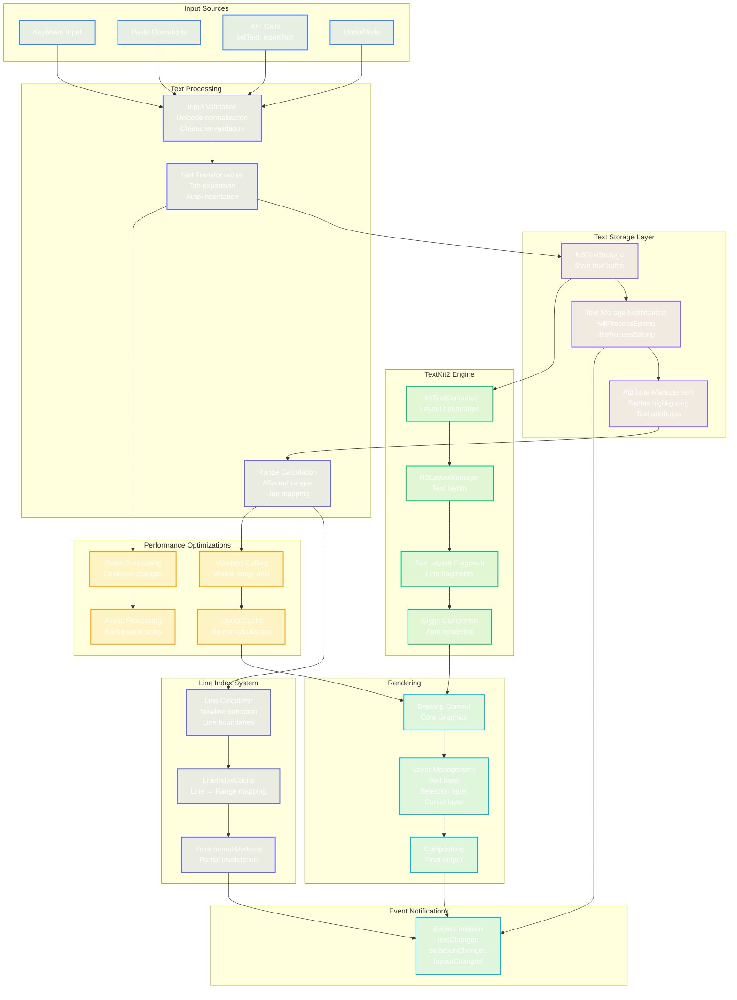

# Text Processing Pipeline

This diagram illustrates the text processing pipeline, from input to rendering, including TextKit2 integration and performance optimizations.



## Detailed Processing Steps

### 1. Input Validation
```swift
func validateInput(_ text: String) -> String {
    // Unicode normalization
    let normalized = text.precomposedStringWithCanonicalMapping
    
    // Remove control characters
    let cleaned = normalized.filter { !$0.isControl }
    
    return cleaned
}
```

### 2. Line Index Management
```swift
class LineIndexCache {
    private var lineStarts: [Int] = []
    private var version: Int = 0
    
    func updateForTextChange(range: NSRange, delta: Int) {
        // Incremental update algorithm
        let startLine = lineContaining(location: range.location)
        // Update only affected lines...
    }
}
```

### 3. Batch Processing
```swift
class BatchProcessor {
    private var pendingChanges: [TextChange] = []
    private var timer: Timer?
    
    func addChange(_ change: TextChange) {
        pendingChanges.append(change)
        scheduleBatchProcessing()
    }
    
    private func processBatch() {
        textStorage.beginEditing()
        pendingChanges.forEach { apply($0) }
        textStorage.endEditing()
    }
}
```

## Performance Characteristics

| Operation | Complexity | Optimization |
|-----------|------------|--------------|
| Text Insertion | O(n) | Batch updates |
| Line Lookup | O(1) | Cached indices |
| Syntax Highlight | O(n) | Viewport only |
| Layout | O(visible) | Virtualization |
| Scrolling | O(1) | Pre-calculated |

## Key Optimizations

1. **Incremental Updates**: Only process changed regions
2. **Line Caching**: O(1) line number lookups
3. **Viewport Rendering**: Only layout visible text
4. **Batch Processing**: Coalesce rapid changes
5. **Async Highlighting**: Non-blocking syntax updates
6. **Glyph Caching**: Reuse font measurements
7. **Layer Composition**: Separate layers for different elements