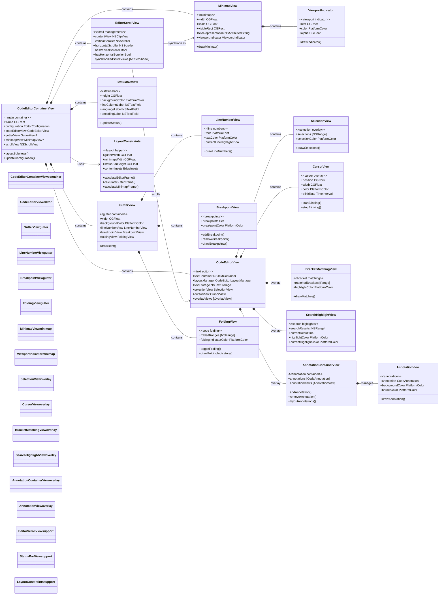
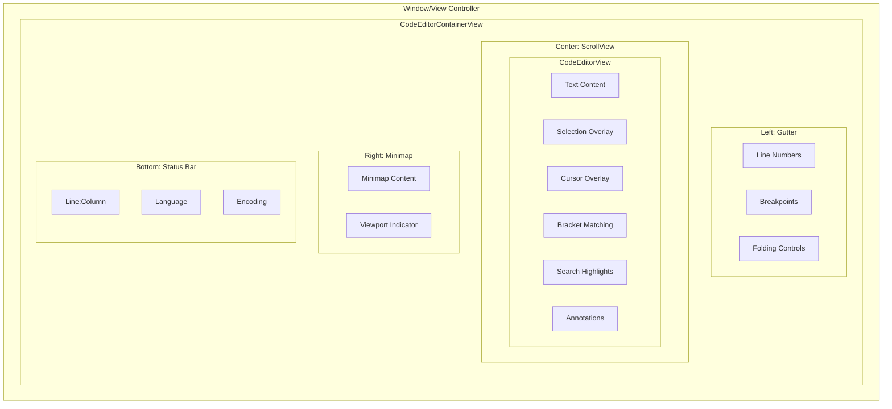

# UI Component Hierarchy

This diagram shows the visual component hierarchy and layout structure of the CodeEditorPlugin.

## Layout Structure

## Component Responsibilities

1. **Container View**: Manages overall layout and coordinates subviews
2. **Gutter View**: Displays line numbers, breakpoints, and folding controls
3. **Editor View**: Main text editing area with TextKit2 integration
4. **Minimap View**: Provides document overview and navigation
5. **Overlay Views**: Handle selections, cursor, and visual feedback
6. **Scroll View**: Manages scrolling and viewport synchronization
7. **Status Bar**: Shows current editor state and file information