# Advanced Features Integration Architecture

This diagram shows the advanced features system that extends the core CodeEditorPlugin functionality with debugging, search/replace, smart editing, code folding, and symbol navigation capabilities.

```mermaid
classDiagram
    direction LR
    
    %% Top Row - Core Coordinator & Feature Types
    class AdvancedFeaturesCoordinator {
        &lt;&lt;features coordinator&gt;&gt;
        +debuggerIntegration DebuggerIntegrationCore
        +searchEngine SearchReplaceEngine
        +smartEditing SmartEditingEngine
        +codeFolding CodeFoldingEngine
        +symbolNavigator SymbolNavigator
        +initialize()
        +enableFeature()
        +disableFeature()
    }

    class FeatureType {
        &lt;&lt;enumeration&gt;&gt;
        debugger
        search
        smartEditing
        codeFolding
        symbolNavigation
    }

    class SymbolNavigator {
        &lt;&lt;symbol navigation&gt;&gt;
        +symbolProviders [SymbolProvider]
        +symbolCache SymbolCache
        +breadcrumbProvider BreadcrumbProvider
        +outlineProvider OutlineProvider
        +navigateToSymbol()
        +findSymbolReferences()
        +getDocumentOutline()
    }

    %% Second Row - Debugger System
    class DebuggerIntegrationCore {
        &lt;&lt;debugger core&gt;&gt;
        +adapter DebugAdapter
        +models DebuggerModels
        +breakpointManager BreakpointManager
        +evaluationEngine DebuggerEvaluation
        +executionController DebuggerExecution
        +startDebugging()
        +stopDebugging()
        +handleDebugEvent()
    }

    class DebugAdapter {
        &lt;&lt;debug adapter&gt;&gt;
        +protocol DebugProtocol
        +transport DebugTransport
        +connect()
        +sendRequest()
        +handleResponse()
    }

    class BreakpointManager {
        &lt;&lt;breakpoint mgmt&gt;&gt;
        +breakpoints [Breakpoint]
        +pendingBreakpoints [PendingBreakpoint]
        +addBreakpoint()
        +removeBreakpoint()
        +validateBreakpoints()
        +syncWithDebugger()
    }

    %% Third Row - Debugger Support & Search Engine
    class DebuggerModels {
        &lt;&lt;debug models&gt;&gt;
        +session DebugSession
        +threads [DebugThread]
        +stackFrames [StackFrame]
        +variables [Variable]
        +sources [DebugSource]
    }

    class DebuggerEvaluation {
        &lt;&lt;debug evaluation&gt;&gt;
        +evaluateExpression()
        +evaluateHover()
        +getVariableDetails()
        +setVariableValue()
    }

    class DebuggerExecution {
        &lt;&lt;debug execution&gt;&gt;
        +continue()
        +stepOver()
        +stepInto()
        +stepOut()
        +pause()
        +restart()
        +terminate()
    }

    %% Fourth Row - Search & Replace System
    class SearchReplaceEngine {
        &lt;&lt;search engine&gt;&gt;
        +searchProvider SearchProvider
        +replaceProvider ReplaceProvider
        +regexEngine RegexEngine
        +searchHistory SearchHistory
        +currentSearch SearchContext?
        +search()
        +replace()
        +replaceAll()
    }

    class SearchProvider {
        &lt;&lt;search provider&gt;&gt;
        +textualSearch()
        +regexSearch()
        +symbolSearch()
        +fileSearch()
    }

    class ReplaceProvider {
        &lt;&lt;replace provider&gt;&gt;
        +performReplace()
        +performReplaceAll()
        +undoReplace()
        +redoReplace()
    }

    %% Fifth Row - Smart Editing System
    class SmartEditingEngine {
        &lt;&lt;smart editing&gt;&gt;
        +autoCompletionEnhancer AutoCompletionEnhancer
        +smartIndentationEngine SmartIndentationEngine
        +bracketCompletionHandler BracketCompletionHandler
        +codeActionProvider CodeActionProvider
        +enhanceCompletion()
        +performSmartIndent()
        +handleBracketInput()
    }

    class AutoCompletionEnhancer {
        &lt;&lt;completion enhancer&gt;&gt;
        +contextAnalyzer ContextAnalyzer
        +priorityCalculator PriorityCalculator
        +enhanceCompletions()
        +analyzeContext()
        +calculatePriority()
    }

    class SmartIndentationEngine {
        &lt;&lt;smart indentation&gt;&gt;
        +indentationRules [IndentationRule]
        +languageSpecificRules Dictionary
        +calculateIndentation()
        +adjustIndentationForContext()
        +handleElectricCharacters()
    }

    %% Sixth Row - Code Folding & Actions
    class CodeFoldingEngine {
        &lt;&lt;code folding&gt;&gt;
        +foldingProviders [FoldingProvider]
        +foldingRegions [FoldingRegion]
        +foldingRenderer FoldingRenderer
        +detectFoldingRegions()
        +foldRegion()
        +unfoldRegion()
        +toggleFolding()
    }

    class CodeActionProvider {
        &lt;&lt;code actions&gt;&gt;
        +availableActions [CodeAction]
        +getActionsForRange()
        +executeAction()
        +registerAction()
    }

    class SearchContext {
        &lt;&lt;search context&gt;&gt;
        +query SearchQuery
        +results [SearchResult]
        +currentIndex Int
        +searchScope SearchScope
        +options SearchOptions
    }

    %% Seventh Row - Folding Providers
    class FoldingProvider {
        &lt;&lt;folding protocol&gt;&gt;
        +languageId String
        +provideFolding()
        +supportsFoldingType()
    }

    class BraceFoldingProvider {
        &lt;&lt;brace folding&gt;&gt;
        +detectBraceRegions()
        +matchBraces()
        +validateBraceStructure()
    }

    class IndentationFoldingProvider {
        &lt;&lt;indent folding&gt;&gt;
        +detectIndentationRegions()
        +analyzeIndentationLevel()
        +groupByIndentation()
    }

    class CommentFoldingProvider {
        &lt;&lt;comment folding&gt;&gt;
        +detectCommentBlocks()
        +identifyCommentStyles()
    }

    %% Key Relationships
    AdvancedFeaturesCoordinator --> DebuggerIntegrationCore : manages
    AdvancedFeaturesCoordinator --> SearchReplaceEngine : manages
    AdvancedFeaturesCoordinator --> SmartEditingEngine : manages
    AdvancedFeaturesCoordinator --> CodeFoldingEngine : manages
    AdvancedFeaturesCoordinator --> SymbolNavigator : manages
    AdvancedFeaturesCoordinator --> FeatureType : uses

    DebuggerIntegrationCore --> DebugAdapter : uses
    DebuggerIntegrationCore --> DebuggerModels : manages
    DebuggerIntegrationCore --> BreakpointManager : uses
    DebuggerIntegrationCore --> DebuggerEvaluation : uses
    DebuggerIntegrationCore --> DebuggerExecution : uses

    SearchReplaceEngine --> SearchProvider : uses
    SearchReplaceEngine --> ReplaceProvider : uses
    SearchReplaceEngine --> SearchContext : manages

    SmartEditingEngine --> AutoCompletionEnhancer : uses
    SmartEditingEngine --> SmartIndentationEngine : uses
    SmartEditingEngine --> CodeActionProvider : uses

    CodeFoldingEngine --> FoldingProvider : uses
    FoldingProvider <|-- BraceFoldingProvider : implements
    FoldingProvider <|-- IndentationFoldingProvider : implements
    FoldingProvider <|-- CommentFoldingProvider : implements

    %% Styling - Dark mode friendly colors
    classDef coordinator fill:#6366f120,stroke:#6366f1,stroke-width:3px,color:#fff
    classDef debugger fill:#ec489920,stroke:#ec4899,stroke-width:2px,color:#fff
    classDef search fill:#8b5cf620,stroke:#8b5cf6,stroke-width:2px,color:#fff
    classDef smart fill:#10b98120,stroke:#10b981,stroke-width:2px,color:#fff
    classDef folding fill:#f59e0b20,stroke:#f59e0b,stroke-width:2px,color:#fff
    classDef symbol fill:#3b82f620,stroke:#3b82f6,stroke-width:2px,color:#fff
    classDef provider fill:#06b6d420,stroke:#06b6d4,stroke-width:2px,color:#fff
    classDef enum fill:#6b728020,stroke:#6b7280,stroke-width:2px,color:#fff

    class AdvancedFeaturesCoordinator coordinator
    class DebuggerIntegrationCore debugger
    class DebugAdapter debugger
    class DebuggerModels debugger
    class BreakpointManager debugger
    class DebuggerEvaluation debugger
    class DebuggerExecution debugger
    class SearchReplaceEngine search
    class SearchProvider search
    class ReplaceProvider search
    class SearchContext search
    class SmartEditingEngine smart
    class AutoCompletionEnhancer smart
    class SmartIndentationEngine smart
    class CodeActionProvider smart
    class CodeFoldingEngine folding
    class BraceFoldingProvider folding
    class IndentationFoldingProvider folding
    class CommentFoldingProvider folding
    class SymbolNavigator symbol
    class FoldingProvider provider
    class FeatureType enum
```

## Key Features Integration

### 1. Debugger Integration
- **Full DAP Support**: Debug Adapter Protocol implementation
- **Breakpoint Management**: Visual breakpoints with validation
- **Variable Inspection**: Expression evaluation and variable watching
- **Execution Control**: Step-by-step debugging with full control

### 2. Search & Replace Engine
- **Multi-mode Search**: Text, regex, symbol, and file search
- **Advanced Replace**: Single and batch replace with undo/redo
- **Search History**: Previous searches with quick access
- **Scope Control**: Document, selection, or project-wide search

### 3. Smart Editing Engine
- **Context-aware Completion**: Enhanced completion with priority calculation
- **Intelligent Indentation**: Language-specific smart indentation
- **Auto-completion**: Bracket matching and electric character handling
- **Code Actions**: Quick fixes and refactoring suggestions

### 4. Code Folding System
- **Multi-provider Support**: Brace, indentation, and comment folding
- **Language Agnostic**: Works with any supported language
- **Visual Integration**: Seamless UI integration with gutter
- **Persistent State**: Folding state preserved across sessions

### 5. Symbol Navigation
- **Document Outline**: Hierarchical symbol view
- **Breadcrumb Navigation**: Current scope breadcrumbs
- **Go-to Definition**: Quick symbol navigation
- **Find References**: Symbol usage across codebase

## Architecture Benefits

1. **Modular Design**: Each feature can be enabled/disabled independently
2. **Language Support**: Features work across all supported languages
3. **Performance Optimized**: Lazy loading and efficient caching
4. **Extensible**: Plugin architecture for additional features
5. **Integration Ready**: Seamless integration with LSP and other systems