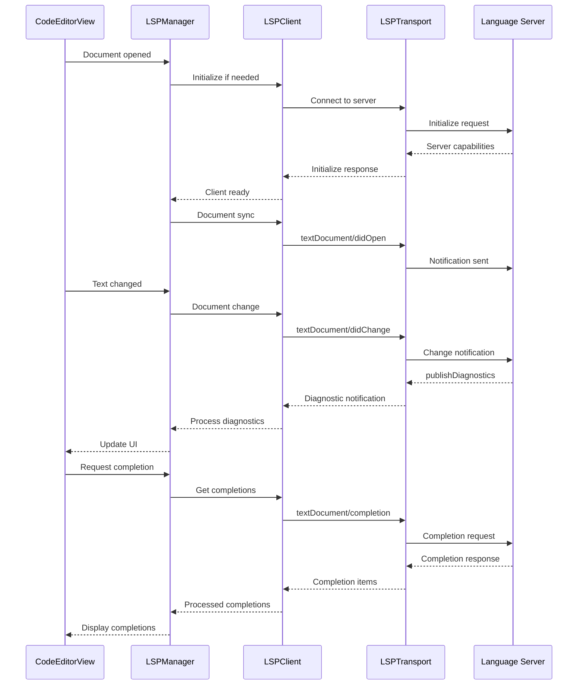

# LSP System Complete Architecture

This diagram shows the comprehensive Language Server Protocol implementation that provides advanced language features through external language servers, featuring enterprise-grade security, cross-platform support, intelligent retry mechanisms, sophisticated message handling with connection resilience, and performance monitoring integration.

```mermaid
classDiagram
    direction LR
    
    %% Top Row - Core Management & Cross-Platform
    class LSPManager {
        &lt;&lt;LSP orchestrator&gt;&gt;
        +clientRegistry LSPClientRegistry
        +documentManager LSPDocumentManager  
        +memoryMonitor MemoryMonitor
        +activeClients [String: LSPClient]
        +serverConfigurations [String: LanguageServerConfig]
        +workspaceRoot URL?
        +registerLanguageServer()
        +startLanguageServer()
        +stopLanguageServer()
        +requestCompletion()
        +requestHover()
        +requestDefinition()
        +getDiagnostics()
        +isLanguageServerAvailable()
        +findLanguageServerPaths()
    }

    class LSPClientRegistry {
        &lt;&lt;client registry&gt;&gt;
        +activeClients [String: LSPClient]
        +serverConfigurations [String: LanguageServerConfig]
        +extensionToLanguageIdCache [String: String]
        +workspaceRoot URL?
        +pathResolver LSPPathResolver
        +registerLanguageServer()
        +unregisterLanguageServer()
        +languageId(for:)
        +startLanguageServer()
        +stopLanguageServer()
        +client(for:)
        +restartAllClients()
        +isLanguageServerAvailable()
        +findLanguageServerPaths()
        +resolveLanguageServerPath()
    }

    class LSPClient {
        &lt;&lt;language client&gt;&gt;
        +connectionState ConnectionState
        +serverCapabilities ServerCapabilities?
        +diagnostics [String: [LSPDiagnostic]]
        +messageHandler LSPMessageHandler
        +transport LSPTransport?
        +pendingRequests [Int: LSPRequestCompletion]
        +nextRequestId Int
        +connect()
        +disconnect()
        +openDocument()
        +updateDocument()
        +closeDocument()
        +requestCompletion()
        +requestHover()
        +requestDefinition()
        +requestDocumentSymbols()
        +setupMessageHandler()
    }

    class PerformanceMonitor {
        &lt;&lt;performance monitoring&gt;&gt;
        +metrics [String: MonitoringPerformanceMetric]
        +cleanupTask Task?
        +startMeasuring()
        +endMeasuring()
        +measure()
        +getAllMetrics()
        +getMetrics()
        +clearMetrics()
        +generateReport()
        +cleanupOldMetrics()
    }

    %% Second Row - Enhanced Transport Layer
    class LSPTransport {
        &lt;&lt;transport protocol&gt;&gt;
        +isConnected Bool
        +connect()
        +disconnect()
        +send()
        +receive()
        +setDataHandler()
    }

    class LSPTransportConfiguration {
        &lt;&lt;transport config&gt;&gt;
        +connectionTimeout TimeInterval
        +readTimeout TimeInterval
        +writeTimeout TimeInterval
        +autoReconnect Bool
        +maxReconnectAttempts Int
        +reconnectDelay TimeInterval
    }

    class ProcessTransport {
        &lt;&lt;stdio transport&gt;&gt;
        +executablePath String
        +arguments [String]
        +workingDirectory URL?
        +environment [String: String]
        +isConnected Bool
        +connect()
        +disconnect()
        +send()
        +receive()
        +setDataHandler()
    }

    class WebSocketTransport {
        &lt;&lt;websocket transport&gt;&gt;
        +url URL
        +headers [String: String]
        +configuration LSPTransportConfiguration
        +webSocketTask URLSessionWebSocketTask?
        +urlSession URLSession?
        +dataHandler (@Sendable (Data) -> Void)?
        +messageQueue [Data]
        +reconnectAttempts Int
        +isReconnecting Bool
        +connect()
        +disconnect()
        +send()
        +receive()
        +setDataHandler()
        +attemptReconnection()
    }

    %% Third Row - Document Management & Message Handling
    class LSPMessageHandler {
        &lt;&lt;message handler&gt;&gt;
        +onNotification (@Sendable (String, Data) -> Void)?
        +onResponse (@Sendable (Int, Result<LSPResponse, LSPError>) -> Void)?
        +messageBuffer Data
        +setNotificationCallback()
        +setResponseCallback()
        +processIncomingData()
        +extractCompleteMessage()
        +parseContentLength()
        +processMessage()
        +processServerMessage()
        +processServerResponse()
    }

    class LSPDocumentManager {
        &lt;&lt;document sync&gt;&gt;
        +openDocuments [String: OpenDocument]
        +clientRegistry LSPClientRegistry?
        +openDocument()
        +updateDocument()
        +closeDocument()
        +reopenDocuments()
        +getDocument()
        +getAllDocuments()
        +cleanup()
    }

    %% Fourth Row - Protocol Types & Responses
    class LSPResponse {
        &lt;&lt;response wrapper&gt;&gt;
        +data Data
        +decode()
        +rawResult Any?
    }

    class OpenDocument {
        &lt;&lt;document info&gt;&gt;
        +uri String
        +languageId String
        +version Int
        +filePath String
        +incrementVersion()
    }

    class LanguageServerConfig {
        &lt;&lt;server configuration&gt;&gt;
        +languageId String
        +serverPath String
        +fileExtensions [String]
        +serverArguments [String]
        +capabilities ClientCapabilities
        +autoStart Bool
        +enablePathResolution Bool
        +retryConfiguration LSPRetryConfiguration
    }

    %% Fifth Row - Enhanced Path Resolution & Retry Configuration
    class LSPPathResolver {
        &lt;&lt;path resolver&gt;&gt;
        +commonInstallationPaths [String]
        +resolvePath()
        +findAllPaths()
        +isAvailable()
        +resolveFromEnvironment()
        +findExecutableInPath()
        +findInCommonLocations()
        +getPathDirectories()
    }

    class LSPRetryConfiguration {
        &lt;&lt;retry configuration&gt;&gt;
        +maxRetries Int
        +initialDelay TimeInterval
        +maxDelay TimeInterval
        +backoffFactor Double
        +jitterEnabled Bool
        +default LSPRetryConfiguration
        +aggressive LSPRetryConfiguration
        +conservative LSPRetryConfiguration
        +noRetry LSPRetryConfiguration
        +delay(for:)
    }

    class MeasurementToken {
        &lt;&lt;performance token&gt;&gt;
        +name String
        +startTime CFAbsoluteTime
    }

    class MonitoringPerformanceMetric {
        &lt;&lt;performance metric&gt;&gt;
        +name String
        +startTime CFAbsoluteTime
        +endTime CFAbsoluteTime?
        +duration TimeInterval?
        +isComplete Bool
    }

    %% Sixth Row - Remote Configuration & Security
    class LSPServerConfiguration {
        &lt;&lt;server config enum&gt;&gt;
        local(LocalLSPConfiguration)
        remote(RemoteLSPConfiguration)
        +createTransport()
    }

    class LocalLSPConfiguration {
        &lt;&lt;local server config&gt;&gt;
        +executablePath String
        +arguments [String]
        +workingDirectory URL?
        +environment [String: String]
    }

    class RemoteLSPConfiguration {
        &lt;&lt;remote server config&gt;&gt;
        +serverURL URL
        +authentication LSPAuthentication?
        +reconnectPolicy ReconnectPolicy
        +customHeaders [String: String]
        +transportConfiguration LSPTransportConfiguration?
        +validateSSLCertificates Bool
        +certificatePinning CertificatePinning?
        +securityOptions SecurityOptions
        +publicServer()
        +privateServer()
        +secureServer()
        +enterpriseServer()
    }

    class PerformanceReport {
        &lt;&lt;performance report&gt;&gt;
        +totalOperations Int
        +completedOperations Int
        +totalDuration TimeInterval
        +averageDuration TimeInterval
        +slowestOperations [MonitoringPerformanceMetric]
        +oldestMetricAge TimeInterval?
        +summary String
    }

    %% Seventh Row - Enterprise Security & Authentication
    class LSPAuthentication {
        &lt;&lt;authentication enum&gt;&gt;
        noAuth
        bearerToken(String)
        basic(username: String, password: String)
        apiKey(key: String, headerName: String)
        custom(headers: [String: String])
        oauth2(accessToken: String)
        +headers [String: String]
    }

    class SecurityOptions {
        &lt;&lt;security options&gt;&gt;
        +minimumTLSVersion TLSVersion
        +allowedCipherSuites Set&lt;String&gt;
        +requireOCSPStapling Bool
        +requireCertificateTransparency Bool
        +securityValidationTimeout TimeInterval
    }

    class CertificatePinning {
        &lt;&lt;certificate pinning&gt;&gt;
        +method PinningMethod
        +pinnedData [Data]
        +allowDebugBypass Bool
        +backupPins [Data]
        +fromCertificateFiles()
        +fromPublicKeyHashes()
    }

    class ReconnectPolicy {
        &lt;&lt;reconnect policy enum&gt;&gt;
        never
        immediate
        exponentialBackoff(maxAttempts: Int, initialDelay: TimeInterval, maxDelay: TimeInterval)
        fixedDelay(attempts: Int, delay: TimeInterval)
        +transportConfig (autoReconnect: Bool, maxAttempts: Int, delay: TimeInterval)
    }

    %% Eighth Row - Enumerations & Error Types
    class ConnectionState {
        &lt;&lt;enumeration&gt;&gt;
        disconnected
        connecting
        initializing
        initialized
        shuttingDown
        error
    }

    class LSPTransportError {
        &lt;&lt;error enum&gt;&gt;
        notConnected
        connectionFailed(underlying: Error?)
        sendFailed(underlying: Error?)
        receiveFailed(underlying: Error?)
        invalidData
        transportSpecific(message: String)
        +errorDescription String?
    }

    class LSPError {
        &lt;&lt;error enum&gt;&gt;
        notConnected
        alreadyConnected
        transportNotConfigured
        serverError(code: Int, message: String, data: String?)
        invalidResponse(String)
        decodingError(String)
        connectionFailed(String)
        timeout
        +errorDescription String?
    }

    %% Bottom Row - Additional Types & Enumerations
    class PinningMethod {
        &lt;&lt;enumeration&gt;&gt;
        certificate
        publicKey
        intermediateCertificate
    }

    class TLSVersion {
        &lt;&lt;enumeration&gt;&gt;
        tls10
        tls11
        tls12
        tls13
    }

    class MemoryMonitor {
        &lt;&lt;memory management&gt;&gt;
        +registerCleanupHandler()
        +performCleanup()
        +getMemoryUsage()
    }

    %% Enhanced Key Relationships
    LSPManager --> LSPClientRegistry : manages
    LSPManager --> LSPDocumentManager : coordinates
    LSPManager --> MemoryMonitor : integrates
    
    LSPClientRegistry --> LanguageServerConfig : manages
    LSPClientRegistry --> LSPClient : creates
    LSPClientRegistry --> LSPPathResolver : uses
    
    LSPClient --> LSPTransport : uses
    LSPClient --> LSPMessageHandler : processes
    LSPClient --> ConnectionState : maintains
    
    LSPDocumentManager --> OpenDocument : manages
    LSPDocumentManager --> LSPClientRegistry : accesses
    
    LSPTransport <|-- ProcessTransport : implements
    LSPTransport <|-- WebSocketTransport : implements
    LSPTransport --> LSPTransportConfiguration : configured by
    
    ProcessTransport --> LSPPathResolver : resolves paths
    WebSocketTransport --> RemoteLSPConfiguration : configured by
    
    LSPMessageHandler --> LSPResponse : creates
    LSPMessageHandler --> LSPError : handles
    
    LanguageServerConfig --> LSPRetryConfiguration : includes
    
    LSPServerConfiguration --> LocalLSPConfiguration : contains
    LSPServerConfiguration --> RemoteLSPConfiguration : contains
    
    RemoteLSPConfiguration --> LSPAuthentication : uses
    RemoteLSPConfiguration --> CertificatePinning : uses
    RemoteLSPConfiguration --> SecurityOptions : uses
    RemoteLSPConfiguration --> ReconnectPolicy : uses
    
    CertificatePinning --> PinningMethod : uses
    SecurityOptions --> TLSVersion : specifies
    
    PerformanceMonitor --> MeasurementToken : creates
    PerformanceMonitor --> MonitoringPerformanceMetric : stores
    PerformanceMonitor --> PerformanceReport : generates
    
    LSPManager --> PerformanceMonitor : performance tracking

    %% Styling - Dark mode friendly colors
    classDef manager fill:#007AFF20,stroke:#007AFF,stroke-width:3px,color:#1D1D1F
    classDef client fill:#AF52DE20,stroke:#AF52DE,stroke-width:2px,color:#1D1D1F
    classDef transport fill:#34C75920,stroke:#34C759,stroke-width:2px,color:#1D1D1F
    classDef document fill:#007AFF20,stroke:#007AFF,stroke-width:2px,color:#1D1D1F
    classDef protocol fill:#FF950020,stroke:#FF9500,stroke-width:2px,color:#1D1D1F
    classDef config fill:#007AFF20,stroke:#007AFF,stroke-width:2px,color:#1D1D1F
    classDef security fill:#FF2D9220,stroke:#FF2D92,stroke-width:2px,color:#1D1D1F
    classDef performance fill:#32D74B20,stroke:#32D74B,stroke-width:2px,color:#1D1D1F
    classDef error fill:#FF3B3020,stroke:#FF3B30,stroke-width:2px,color:#1D1D1F
    classDef enum fill:#8E8E9320,stroke:#8E8E93,stroke-width:2px,color:#1D1D1F

    class LSPManager manager
    class LSPClientRegistry client
    class LSPClient client
    class PerformanceMonitor performance
    class LSPTransport transport
    class LSPTransportConfiguration config
    class ProcessTransport transport
    class WebSocketTransport transport
    class LSPMessageHandler protocol
    class LSPDocumentManager document
    class LSPResponse protocol
    class OpenDocument document
    class LanguageServerConfig config
    class LSPPathResolver config
    class LSPRetryConfiguration config
    class MeasurementToken performance
    class MonitoringPerformanceMetric performance
    class LSPServerConfiguration config
    class LocalLSPConfiguration config
    class RemoteLSPConfiguration config
    class PerformanceReport performance
    class LSPAuthentication security
    class SecurityOptions security
    class CertificatePinning security
    class ReconnectPolicy config
    class ConnectionState enum
    class LSPTransportError error
    class LSPError error
    class PinningMethod enum
    class TLSVersion enum
    class MemoryMonitor performance
```



## LSP System Flow



## Key LSP Features

### 1. Enhanced Multi-Transport Support
- **Process Transport**: Standard stdio-based communication for local language servers (macOS only)
- **WebSocket Transport**: Cross-platform remote language servers with automatic reconnection
- **Transport Abstraction**: Unified LSPTransport protocol with async/await support
- **Intelligent Fallback**: Automatic transport selection based on platform capabilities

### 2. Cross-Platform Architecture
- **macOS Full Support**: Both local and remote LSP servers with process spawning
- **iOS/Mac Catalyst Support**: Remote LSP servers only via WebSocket transport
- **Platform-Aware Configuration**: Automatic detection and configuration based on platform constraints
- **Unified API**: Same interface across all platforms with platform-specific optimizations

### 3. Enterprise-Grade Security
- **Certificate Pinning**: Multiple strategies (certificate, public key, intermediate CA)
- **Authentication Methods**: Bearer token, basic auth, API key, OAuth2, custom headers
- **TLS Configuration**: Minimum TLS version, cipher suites, OCSP stapling
- **Security Options**: Certificate transparency, validation timeouts, debug bypass control
- **Enterprise Presets**: Pre-configured secure server configurations

### 4. Advanced Retry & Connection Management
- **Four Retry Profiles**: Default (3 retries), aggressive (5), conservative (2), no-retry (0)
- **Exponential Backoff**: Configurable backoff factor with maximum delay limits
- **Jitter Support**: Random variance to prevent thundering herd problems
- **Connection Resilience**: Automatic reconnection with message queuing during disconnections
- **State Management**: Comprehensive connection state tracking and error handling

### 5. Intelligent Path Resolution
- **Environment Variables**: LSP_<EXECUTABLE>_PATH overrides for custom installations
- **Multi-Location Search**: System PATH, Homebrew, MacPorts, npm, Cargo, Go paths
- **Executable Validation**: Availability checking with execute permission validation
- **Platform-Aware Discovery**: Automatic detection of language server installations

### 6. Advanced Message Handling
- **LSP Protocol Compliance**: Proper message framing with Content-Length headers
- **Type-Safe Decoding**: Comprehensive response decoding with error handling
- **Async Message Processing**: Actor-based message handler with buffering support
- **Error Recovery**: Sophisticated error handling with detailed error types

### 7. Document Synchronization
- **Lifecycle Management**: Open, update, close document notifications
- **Version Tracking**: Document version management with conflict resolution
- **Incremental Changes**: Support for both full and incremental content updates
- **Automatic Reopening**: Document restoration after language server restarts

### 8. Performance Monitoring Integration
- **Operation Tracking**: Automatic measurement of LSP operations with timing data
- **Performance Reports**: Detailed reports with average duration and slowest operations
- **Memory Management**: Integration with memory monitor for resource cleanup
- **Automatic Cleanup**: Old metrics cleanup with configurable retention policies

### 9. Configuration Management
- **Language Server Registry**: Centralized management of server configurations
- **Default Configurations**: Pre-configured setups for popular language servers
- **Auto-Start Support**: Automatic server startup based on configuration
- **Workspace Integration**: Project-specific settings with workspace root detection
- **Extension Mapping**: Automatic language detection from file extensions

## Benefits

1. **Cross-Platform Support**: Native support for macOS (full), iOS/Mac Catalyst (remote only)
2. **Performance Monitoring**: Integrated performance tracking with detailed metrics and reports
3. **Memory Efficient**: Automatic cleanup and memory management with configurable retention
4. **Enterprise Ready**: Comprehensive security with certificate pinning and authentication
5. **Highly Resilient**: Advanced retry mechanisms with exponential backoff and jitter
6. **Developer Friendly**: Pre-configured language servers with automatic path resolution
7. **Type Safe**: Swift 6 concurrency with actor isolation and comprehensive error handling
8. **Flexible Architecture**: Actor-based design with dependency injection patterns
9. **Production Ready**: Robust error handling with graceful degradation
10. **Extensible**: Plugin architecture supporting custom transports and configurations

## Configuration Examples

### Basic LSP Manager Setup
```swift
// Initialize with memory monitor integration
let memoryMonitor = MemoryMonitor()
let lspManager = LSPManager(memoryMonitor: memoryMonitor, workspaceRoot: projectURL)

// Register a language server with default configuration
let swiftConfig = LanguageServerConfig(
    languageId: "swift",
    serverPath: "sourcekit-lsp",
    fileExtensions: [".swift"],
    enablePathResolution: true,
    autoStart: true
)
lspManager.registerLanguageServer(swiftConfig)
```

### Advanced Retry Configuration
```swift
// Pre-configured retry profiles
let defaultRetry = LSPRetryConfiguration.default    // 3 retries, 1s delay, jitter
let aggressiveRetry = LSPRetryConfiguration.aggressive  // 5 retries, 0.5s delay
let conservativeRetry = LSPRetryConfiguration.conservative  // 2 retries, 2s delay
let noRetry = LSPRetryConfiguration.noRetry         // No retries

// Custom retry configuration
let customRetry = LSPRetryConfiguration(
    maxRetries: 4,
    initialDelay: 0.75,
    maxDelay: 30.0,
    backoffFactor: 2.0,
    jitterEnabled: true
)

// Start server with specific retry configuration
try await lspManager.startLanguageServer(for: "typescript", retryConfig: aggressiveRetry)
```

### Remote LSP Server Configuration
```swift
// Basic remote server
let publicConfig = RemoteLSPConfiguration.publicServer(
    url: URL(string: "wss://lsp.example.com/typescript")!
)

// Private server with authentication
let privateConfig = RemoteLSPConfiguration.privateServer(
    url: URL(string: "wss://private-lsp.company.com/swift")!,
    token: "your-bearer-token"
)

// Enterprise secure configuration
let enterpriseConfig = RemoteLSPConfiguration.enterpriseServer(
    url: URL(string: "wss://secure-lsp.enterprise.com/python")!,
    authentication: .bearerToken("enterprise-token"),
    pinnedPublicKeys: [publicKeyData],
    backupKeys: [backupKeyData]
)
```

### Performance Monitoring Integration
```swift
// Performance monitor is automatically integrated
let performanceMonitor = PerformanceMonitor()

// Manual performance measurement
let token = await performanceMonitor.startMeasuring("lsp-completion")
let completions = try await lspManager.requestCompletion(
    filePath: "/path/to/file.swift",
    line: 10,
    character: 5
)
await performanceMonitor.endMeasuring(token)

// Block-based measurement
let result = await performanceMonitor.measure("lsp-hover") {
    try await lspManager.requestHover(filePath: path, line: line, character: char)
}

// Generate performance report
let report = await performanceMonitor.generateReport()
logger.info(report.summary)
```

### Path Resolution and Environment Variables
```swift
// Environment variable overrides
// Set LSP_RUST_ANALYZER_PATH="/custom/path/rust-analyzer"
// Set LSP_TYPESCRIPT_LANGUAGE_SERVER_PATH="/opt/typescript-lsp"

// Path resolver automatically checks these locations:
// - Environment variables (highest priority)
// - System PATH
// - Homebrew paths (/opt/homebrew/bin, /usr/local/bin)
// - MacPorts (/opt/local/bin)
// - npm global (/usr/local/share/npm/bin)
// - Cargo (~/.cargo/bin)
// - Go (~/go/bin)
// - Xcode toolchain paths

// Check server availability
let isAvailable = lspManager.isLanguageServerAvailable(swiftConfig)
let availablePaths = lspManager.findLanguageServerPaths(for: "rust-analyzer")
```