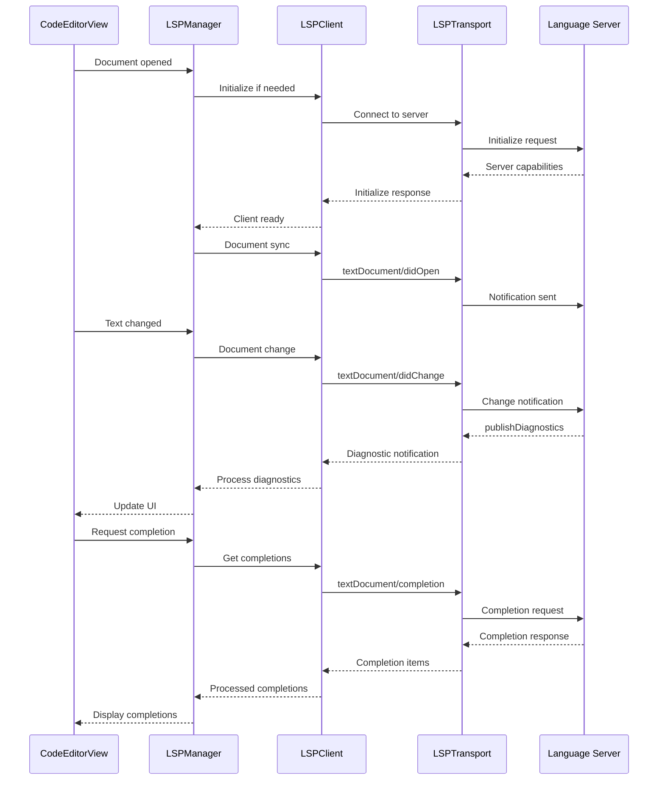

# LSP System Complete Architecture

This diagram shows the comprehensive Language Server Protocol implementation that provides advanced language features through external language servers.

```mermaid
classDiagram
    %% LSP Core Management
    class LSPManager {
        +clients: [String: LSPClient]
        +registry: LSPClientRegistry
        +documentManager: LSPDocumentManager
        +messageHandler: LSPMessageHandler
        +pathResolver: LSPPathResolver
        +startLanguageServer(languageId: String) LSPClient?
        +stopLanguageServer(languageId: String)
        +getClient(languageId: String) LSPClient?
        +handleDocumentChange(uri: String, changes: [TextDocumentContentChangeEvent])
    }

    class LSPClientRegistry {
        +registeredServers: [String: LSPServerConfiguration]
        +activeClients: [String: LSPClient]
        +configurationProvider: LSPConfigurationProvider
        +register(languageId: String, config: LSPServerConfiguration)
        +unregister(languageId: String)
        +getConfiguration(languageId: String) LSPServerConfiguration?
        +isLanguageSupported(languageId: String) Bool
    }

    class LSPClient {
        +serverProcess: Process?
        +transport: LSPTransport
        +messageHandler: LSPMessageHandler
        +documentManager: LSPDocumentManager
        +capabilities: ServerCapabilities?
        +state: LSPClientState
        +initialize(initializationOptions: InitializeParams)
        +shutdown()
        +sendRequest~T~(method: String, params: T) Future~LSPResponse~
        +sendNotification~T~(method: String, params: T)
    }

    class LSPClientState {
        &lt;&lt;enumeration&gt;&gt;
        notStarted
        starting
        initialized
        shutdownRequested
        stopped
        failed
    }

    %% Transport Layer
    class LSPTransport {
        &lt;&lt;protocol&gt;&gt;
        +isConnected: Bool
        +connect() Future~Void~
        +disconnect()
        +sendMessage(message: LSPMessage)
        +onMessageReceived: ((LSPMessage) -> Void)?
        +onError: ((Error) -> Void)?
    }

    class ProcessTransport {
        +process: Process
        +executablePath: String
        +arguments: [String]
        +workingDirectory: String?
        +environment: [String: String]
        +startProcess()
        +terminateProcess()
        +writeToStdin(data: Data)
        +readFromStdout() Data?
    }

    class WebSocketTransport {
        +webSocket: URLSessionWebSocketTask
        +url: URL
        +headers: [String: String]
        +connectWebSocket()
        +closeWebSocket()
        +sendWebSocketMessage(message: URLSessionWebSocketTask.Message)
    }

    class TCPTransport {
        +socket: NWConnection
        +host: String
        +port: Int
        +establishConnection()
        +closeConnection()
        +sendData(data: Data)
        +receiveData() Data?
    }

    %% Document Management
    class LSPDocumentManager {
        +openDocuments: [String: LSPTextDocument]
        +documentVersions: [String: Int]
        +synchronizationKind: TextDocumentSyncKind
        +openDocument(uri: String, languageId: String, text: String)
        +closeDocument(uri: String)
        +changeDocument(uri: String, changes: [TextDocumentContentChangeEvent])
        +saveDocument(uri: String)
        +getDocument(uri: String) LSPTextDocument?
    }

    class LSPTextDocument {
        +uri: String
        +languageId: String
        +version: Int
        +text: String
        +isDirty: Bool
        +lastSyncedVersion: Int
        +applyChanges(changes: [TextDocumentContentChangeEvent])
        +getTextInRange(range: LSPRange) String
        +positionToOffset(position: LSPPosition) Int
    }

    %% Message Handling
    class LSPMessageHandler {
        +requestHandlers: [String: LSPRequestHandler]
        +notificationHandlers: [String: LSPNotificationHandler]
        +responseCallbacks: [String: LSPResponseCallback]
        +nextRequestId: Int
        +handleMessage(message: LSPMessage)
        +registerRequestHandler(method: String, handler: LSPRequestHandler)
        +registerNotificationHandler(method: String, handler: LSPNotificationHandler)
        +sendRequest~T~(method: String, params: T) Future~LSPResponse~
    }

    class LSPMessage {
        +jsonrpc: String
        +id: LSPRequestId?
        +method: String?
        +params: Any?
        +result: Any?
        +error: LSPResponseError?
    }

    %% Protocol Types & Models
    class LSPProtocol {
        +initialize: InitializeRequest
        +textDocument: TextDocumentMethods
        +workspace: WorkspaceMethods
        +window: WindowMethods
        +completionProvider: CompletionProvider
        +hoverProvider: HoverProvider
        +signatureHelpProvider: SignatureHelpProvider
        +definitionProvider: DefinitionProvider
    }

    class LSPTypes {
        +Position: LSPPosition
        +Range: LSPRange
        +Location: LSPLocation
        +Diagnostic: LSPDiagnostic
        +CompletionItem: LSPCompletionItem
        +Hover: LSPHover
        +SignatureHelp: LSPSignatureHelp
    }

    class ServerCapabilities {
        +textDocumentSync: TextDocumentSyncOptions?
        +completionProvider: CompletionOptions?
        +hoverProvider: Bool
        +signatureHelpProvider: SignatureHelpOptions?
        +definitionProvider: Bool
        +referencesProvider: Bool
        +documentHighlightProvider: Bool
        +documentSymbolProvider: Bool
        +codeActionProvider: CodeActionOptions?
        +documentFormattingProvider: Bool
        +documentRangeFormattingProvider: Bool
        +renameProvider: RenameOptions?
        +foldingRangeProvider: Bool
        +semanticTokensProvider: SemanticTokensOptions?
    }

    %% Configuration & Path Resolution
    class LSPConfigurationProvider {
        +configurations: [String: LSPServerConfiguration]
        +userConfigurations: [String: Any]
        +workspaceConfigurations: [String: Any]
        +getConfiguration(languageId: String) LSPServerConfiguration
        +updateConfiguration(languageId: String, config: LSPServerConfiguration)
        +loadUserConfigurations()
        +loadWorkspaceConfigurations()
    }

    class LSPServerConfiguration {
        +languageId: String
        +serverName: String
        +command: String
        +arguments: [String]
        +workingDirectory: String?
        +environment: [String: String]
        +transportType: LSPTransportType
        +initializationOptions: [String: Any]?
        +settings: [String: Any]?
    }

    class LSPTransportType {
        &lt;&lt;enumeration&gt;&gt;
        stdio
        tcp(host: String, port: Int)
        websocket(url: URL)
        namedPipe(path: String)
    }

    class LSPPathResolver {
        +workspaceRoots: [String]
        +fileWatcher: LSPFileWatcher
        +resolveURI(uri: String) String?
        +createURI(filePath: String) String
        +isFileInWorkspace(filePath: String) Bool
        +getRelativePath(filePath: String) String?
        +watchWorkspaceChanges()
    }

    %% LSP Feature Providers
    class LSPCompletionProvider {
        +client: LSPClient
        +triggerCharacters: [String]
        +resolveProvider: Bool
        +provideCompletions(document: TextDocument, position: Position) [CompletionItem]
        +resolveCompletion(item: CompletionItem) CompletionItem
        +mapLSPCompletionItems(items: [LSPCompletionItem]) [CompletionItem]
    }

    class LSPHoverProvider {
        +client: LSPClient
        +provideHover(document: TextDocument, position: Position) Hover?
        +convertLSPHover(hover: LSPHover) Hover
    }

    class LSPDefinitionProvider {
        +client: LSPClient
        +provideDefinition(document: TextDocument, position: Position) [Location]
        +convertLSPLocations(locations: [LSPLocation]) [Location]
    }

    class LSPDiagnosticsProvider {
        +client: LSPClient
        +diagnosticsByURI: [String: [LSPDiagnostic]]
        +onDiagnosticsReceived: (([LSPDiagnostic]) -> Void)?
        +handlePublishDiagnostics(params: PublishDiagnosticsParams)
        +getDiagnostics(uri: String) [LSPDiagnostic]
        +clearDiagnostics(uri: String)
    }

    %% Remote Configuration Support
    class RemoteLSPConfiguration {
        +remoteServers: [RemoteServerConfig]
        +connectionManager: RemoteConnectionManager
        +authenticator: RemoteAuthenticator
        +connectToRemoteServer(config: RemoteServerConfig) LSPClient
        +authenticateConnection(credentials: RemoteCredentials)
        +handleConnectionLoss()
    }

    %% Relationships
    LSPManager --> LSPClientRegistry : uses
    LSPManager --> LSPClient : manages
    LSPManager --> LSPDocumentManager : coordinates
    LSPManager --> LSPMessageHandler : uses
    LSPManager --> LSPPathResolver : uses

    LSPClientRegistry --> LSPServerConfiguration : manages
    LSPClientRegistry --> LSPConfigurationProvider : uses

    LSPClient --> LSPTransport : uses
    LSPClient --> LSPMessageHandler : uses
    LSPClient --> LSPDocumentManager : syncs with
    LSPClient --> LSPClientState : maintains
    LSPClient --> ServerCapabilities : negotiates

    LSPTransport <|-- ProcessTransport : implements
    LSPTransport <|-- WebSocketTransport : implements
    LSPTransport <|-- TCPTransport : implements

    LSPDocumentManager --> LSPTextDocument : manages
    LSPMessageHandler --> LSPMessage : processes
    LSPProtocol --> LSPTypes : uses
    LSPConfigurationProvider --> LSPServerConfiguration : provides
    LSPServerConfiguration --> LSPTransportType : specifies
    LSPPathResolver --> LSPFileWatcher : uses

    LSPCompletionProvider --> LSPClient : uses
    LSPHoverProvider --> LSPClient : uses
    LSPDefinitionProvider --> LSPClient : uses
    LSPDiagnosticsProvider --> LSPClient : uses

    RemoteLSPConfiguration --> RemoteConnectionManager : uses
    RemoteLSPConfiguration --> RemoteAuthenticator : uses

    %% Styling - Dark mode friendly colors
    classDef manager fill:#6366f120,stroke:#6366f1,stroke-width:3px,color:#fff
    classDef client fill:#8b5cf620,stroke:#8b5cf6,stroke-width:2px,color:#fff
    classDef transport fill:#10b98120,stroke:#10b981,stroke-width:2px,color:#fff
    classDef document fill:#3b82f620,stroke:#3b82f6,stroke-width:2px,color:#fff
    classDef protocol fill:#f59e0b20,stroke:#f59e0b,stroke-width:2px,color:#fff
    classDef provider fill:#ec489920,stroke:#ec4899,stroke-width:2px,color:#fff
    classDef config fill:#06b6d420,stroke:#06b6d4,stroke-width:2px,color:#fff
    classDef enum fill:#6b728020,stroke:#6b7280,stroke-width:2px,color:#fff

    class LSPManager manager
    class LSPClientRegistry client
    class LSPClient client
    class LSPTransport transport
    class ProcessTransport transport
    class WebSocketTransport transport
    class TCPTransport transport
    class LSPDocumentManager document
    class LSPTextDocument document
    class LSPMessageHandler protocol
    class LSPMessage protocol
    class LSPProtocol protocol
    class LSPTypes protocol
    class ServerCapabilities protocol
    class LSPCompletionProvider provider
    class LSPHoverProvider provider
    class LSPDefinitionProvider provider
    class LSPDiagnosticsProvider provider
    class LSPConfigurationProvider config
    class LSPServerConfiguration config
    class LSPPathResolver config
    class RemoteLSPConfiguration config
    class LSPClientState enum
    class LSPTransportType enum
```

## LSP System Flow

## Key LSP Features

### 1. Multi-Transport Support
- **Process Transport**: Standard stdio-based communication
- **WebSocket Transport**: Web-based language servers
- **TCP Transport**: Network-based language servers
- **Named Pipe Transport**: IPC-based communication

### 2. Document Synchronization
- **Full Sync**: Complete document content synchronization
- **Incremental Sync**: Delta-based change synchronization
- **Version Management**: Document version tracking
- **Change Batching**: Efficient change aggregation

### 3. Feature Providers
- **Completion Provider**: LSP-based code completion
- **Hover Provider**: Symbol information on hover
- **Definition Provider**: Go-to-definition functionality
- **Diagnostics Provider**: Error and warning reporting
- **Formatting Provider**: Code formatting support

### 4. Configuration Management
- **Server Registry**: Automatic server discovery
- **User Configuration**: Customizable server settings
- **Workspace Configuration**: Project-specific settings
- **Remote Support**: Cloud-based language servers

### 5. Reliability Features
- **Connection Recovery**: Automatic reconnection on failure
- **Error Handling**: Comprehensive error management
- **State Management**: Robust client state tracking
- **Resource Cleanup**: Proper resource disposal

## Benefits

1. **Language Agnostic**: Works with any LSP-compliant language server
2. **Scalable**: Handles multiple concurrent language servers
3. **Robust**: Built-in error handling and recovery
4. **Extensible**: Plugin architecture for custom providers
5. **Performance**: Optimized message handling and caching