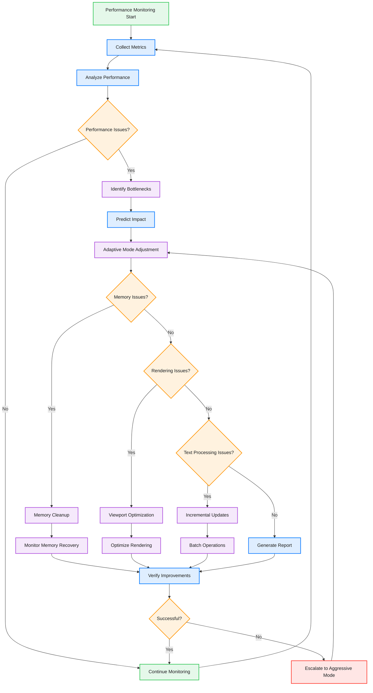

# Performance Monitoring & Optimization System

This diagram shows the comprehensive performance monitoring and optimization system that ensures 60fps rendering and efficient resource usage.

```mermaid
classDiagram
    direction LR
    
    %% Row 1 - Core System
    class UnifiedPerformanceSystem {
        <<performance system>>
        +performanceMonitor PerformanceMonitor
        +performanceInsights PerformanceInsights
        +productionMetrics ProductionPerformanceMetrics
        +initialize()
        +startMonitoring()
        +generateReport()
    }

    class PerformanceMonitor {
        <<monitor>>
        +metrics PerformanceMetrics
        +thresholds PerformanceThresholds
        +isMonitoring Bool
        +recordMetric()
        +checkThresholds()
    }

    class PerformanceInsights {
        <<insights>>
        +analyzer PerformanceAnalyzer
        +predictor PerformancePredictor
        +analyzePerformance()
        +predictBottlenecks()
    }

    %% Row 2 - Metrics
    class PerformanceMetrics {
        <<metrics container>>
        +renderingMetrics RenderingMetrics
        +memoryMetrics MemoryMetrics
        +textProcessingMetrics TextProcessingMetrics
        +timestamp Date
    }

    class RenderingMetrics {
        <<rendering>>
        +frameRate Double
        +frameDrops Int
        +renderTime TimeInterval
        +scrollPerformance ScrollPerformance
    }

    class MemoryMetrics {
        <<memory>>
        +totalMemoryUsage Int
        +peakMemoryUsage Int
        +memoryPressureLevel MemoryPressureLevel
        +leakDetection [MemoryLeak]
    }


    %% Row 3 - Analysis & Production

    class PerformanceAnalyzer {
        <<analyzer>>
        +patterns [PerformancePattern]
        +trendAnalyzer TrendAnalyzer
        +identifyBottlenecks()
        +analyzeRenderingPerformance()
    }

    class PerformancePredictor {
        <<predictor>>
        +models [PredictionModel]
        +historicalData PerformanceHistory
        +predictFrameRate()
        +predictMemoryUsage()
    }

    class ProductionPerformanceMetrics {
        <<production>>
        +telemetryCollector TelemetryCollector
        +metricsAggregator MetricsAggregator
        +collectUserMetrics()
        +reportToCloud()
    }


    %% Row 4 - Adaptive & Memory
    class AdaptivePerformanceMode {
        <<adaptive>>
        +currentMode PerformanceMode
        +modeController PerformanceModeController
        +adjustPerformanceMode()
        +optimizeForBattery()
    }

    class MemoryMonitor {
        <<memory monitor>>
        +memoryPressureHandler MemoryPressureHandler
        +leakDetector MemoryLeakDetector
        +startMemoryMonitoring()
        +performCleanup()
    }

    class ViewportManager {
        <<viewport>>
        +visibleRange NSRange
        +cachedContent ViewportCache
        +updateVisibleRange()
        +optimizeRendering()
    }

    %% Row 5 - Support Components
    class TelemetryCollector {
        <<telemetry>>
        +userConsent Bool
        +dataRetentionPolicy DataRetentionPolicy
        +collectRenderingTelemetry()
        +collectUsagePatterns()
    }

    class PerformanceModeController {
        <<mode controller>>
        +currentSettings PerformanceModeSettings
        +switchMode()
        +applySettings()
    }

    class TextProcessingMetrics {
        <<text metrics>>
        +editingLatency TimeInterval
        +typingResponsiveness Double
        +undoRedoPerformance TimeInterval
    }


    %% Row 6 - Memory & Viewport Support
    class MemoryPressureHandler {
        <<pressure handler>>
        +pressureCallbacks [MemoryPressureCallback]
        +cleanupStrategies [CleanupStrategy]
        +handleLowMemory()
        +recoverFromMemoryPressure()
    }

    class MemoryLeakDetector {
        <<leak detector>>
        +trackedObjects WeakObjectSet
        +suspiciousRetainCycles [RetainCycle]
        +scanForLeaks()
        +analyzeRetainCycles()
    }

    class ViewportCache {
        <<cache>>
        +cachedLines [Int: CachedLine]
        +cacheStrategy CacheStrategy
        +cacheLine()
        +evictLeastUsed()
    }

    %% Row 7 - Optimization Components
    class ScrollPredictor {
        <<scroll prediction>>
        +scrollHistory ScrollHistory
        +predictionModel ScrollPredictionModel
        +predictScrollDirection()
        +estimateScrollVelocity()
    }

    class OptimizedLineIndexCache {
        <<optimized cache>>
        +cache LRUCache
        +incrementalUpdater IncrementalUpdater
        +optimizedLineInfo()
        +batchUpdate()
    }

    class IncrementalSyntaxHighlighter {
        <<incremental highlighter>>
        +highlighter SyntaxHighlighter
        +changeTracker ChangeTracker
        +incrementalHighlight()
        +scheduleBackgroundHighlighting()
    }

    %% Row 8 - Views & Types
    class PerformanceViews {
        <<views>>
        +performanceDashboard PerformanceDashboard
        +metricsOverlay MetricsOverlay
        +showPerformanceDashboard()
        +toggleMetricsOverlay()
    }

    class PerformanceDashboard {
        <<dashboard>>
        +realTimeMetrics RealTimeMetricsView
        +charts [PerformanceChart]
        +updateMetrics()
        +addChart()
    }

    class PerformanceMode {
        <<enumeration>>
        battery
        balanced
        performance
        memory
    }

    %% Key Relationships
    UnifiedPerformanceSystem --> PerformanceMonitor : uses
    UnifiedPerformanceSystem --> PerformanceInsights : uses
    UnifiedPerformanceSystem --> ProductionPerformanceMetrics : uses
    UnifiedPerformanceSystem --> AdaptivePerformanceMode : uses
    UnifiedPerformanceSystem --> MemoryMonitor : uses
    UnifiedPerformanceSystem --> ViewportManager : uses

    PerformanceMonitor --> PerformanceMetrics : collects
    PerformanceMetrics --> RenderingMetrics : contains
    PerformanceMetrics --> MemoryMetrics : contains
    PerformanceMetrics --> TextProcessingMetrics : contains

    PerformanceInsights --> PerformanceAnalyzer : uses
    PerformanceInsights --> PerformancePredictor : uses

    ProductionPerformanceMetrics --> TelemetryCollector : uses
    AdaptivePerformanceMode --> PerformanceModeController : uses
    AdaptivePerformanceMode --> PerformanceMode : manages

    MemoryMonitor --> MemoryPressureHandler : uses
    MemoryMonitor --> MemoryLeakDetector : uses

    ViewportManager --> ViewportCache : uses
    ViewportManager --> ScrollPredictor : uses

    PerformanceViews --> PerformanceDashboard : contains

    %% Styling - Dark mode friendly colors
    classDef system fill:#007AFF20,stroke:#007AFF,stroke-width:3px,color:#1D1D1F
    classDef monitor fill:#AF52DE20,stroke:#AF52DE,stroke-width:2px,color:#1D1D1F
    classDef metrics fill:#34C75920,stroke:#34C759,stroke-width:2px,color:#1D1D1F
    classDef insights fill:#007AFF20,stroke:#007AFF,stroke-width:2px,color:#1D1D1F
    classDef adaptive fill:#FF950020,stroke:#FF9500,stroke-width:2px,color:#1D1D1F
    classDef memory fill:#FF3B3020,stroke:#FF3B30,stroke-width:2px,color:#1D1D1F
    classDef viewport fill:#007AFF20,stroke:#007AFF,stroke-width:2px,color:#1D1D1F
    classDef optimized fill:#34C75920,stroke:#34C759,stroke-width:2px,color:#1D1D1F
    classDef views fill:#8E8E9320,stroke:#8E8E93,stroke-width:2px,color:#1D1D1F
    classDef enum fill:#8E8E9320,stroke:#8E8E93,stroke-width:2px,color:#1D1D1F

    class UnifiedPerformanceSystem system
    class PerformanceMonitor monitor
    class TelemetryCollector monitor
    class PerformanceMetrics metrics
    class RenderingMetrics metrics
    class MemoryMetrics metrics
    class TextProcessingMetrics metrics
    class PerformanceInsights insights
    class PerformanceAnalyzer insights
    class PerformancePredictor insights
    class ProductionPerformanceMetrics insights
    class AdaptivePerformanceMode adaptive
    class PerformanceModeController adaptive
    class MemoryMonitor memory
    class MemoryPressureHandler memory
    class MemoryLeakDetector memory
    class ViewportManager viewport
    class ViewportCache viewport
    class ScrollPredictor viewport
    class OptimizedLineIndexCache optimized
    class IncrementalSyntaxHighlighter optimized
    class PerformanceViews views
    class PerformanceDashboard views
    class PerformanceMode enum
```

## Performance Optimization Flow

## Key Performance Features

### 1. Real-time Monitoring
- **Frame Rate Tracking**: Continuous 60fps monitoring
- **Memory Usage**: Real-time memory pressure detection
- **Processing Times**: Edit latency and responsiveness tracking
- **Resource Utilization**: CPU and memory usage optimization

### 2. Adaptive Performance
- **Dynamic Mode Switching**: Automatic performance mode adjustment
- **Resource-based Optimization**: Battery/performance/memory optimized modes
- **Contextual Adaptation**: File size and complexity based adjustments
- **User Preference Integration**: Customizable performance profiles

### 3. Memory Management
- **Pressure Handling**: Automatic cleanup on memory warnings
- **Leak Detection**: Proactive memory leak identification
- **Smart Caching**: Efficient viewport and content caching
- **Garbage Collection**: Optimized memory reclamation

### 4. Viewport Optimization
- **Visible Range Management**: Only render visible content
- **Predictive Loading**: Preload content based on scroll patterns
- **Efficient Invalidation**: Minimal redraw operations
- **Smart Caching**: Cache frequently accessed content

### 5. Performance Analytics
- **Bottleneck Identification**: Automatic performance issue detection
- **Trend Analysis**: Long-term performance pattern analysis
- **Predictive Analytics**: Performance prediction based on context
- **Optimization Suggestions**: Automated performance recommendations

## Benefits

1. **Consistent Performance**: Maintains 60fps across all operations
2. **Memory Efficiency**: Handles large files without memory bloat
3. **Adaptive Behavior**: Automatically optimizes for current conditions
4. **Proactive Optimization**: Prevents performance issues before they occur
5. **Data-Driven**: Uses metrics to make optimization decisions