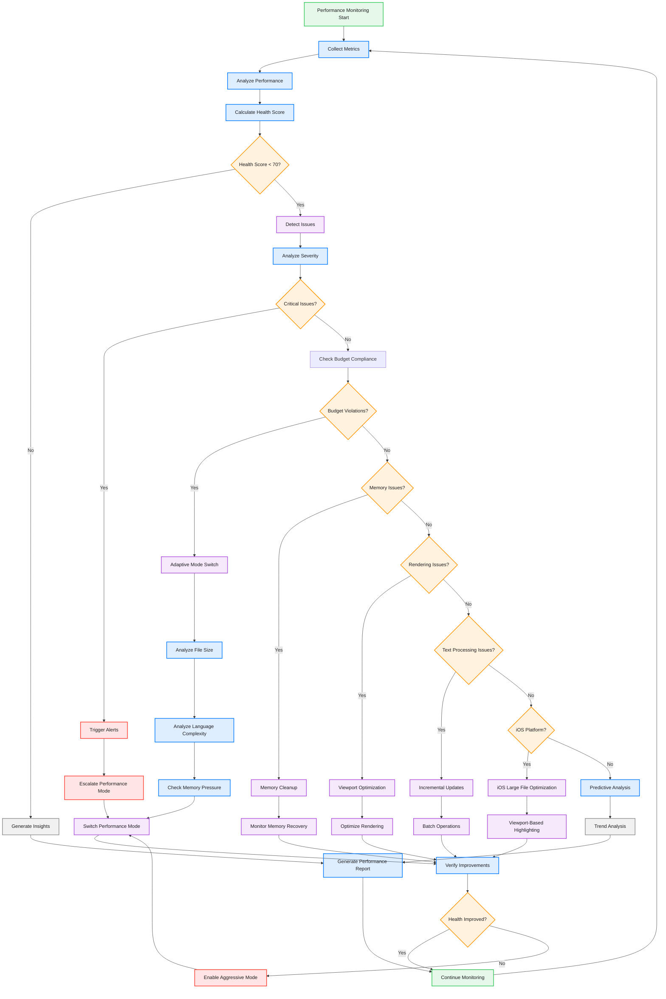
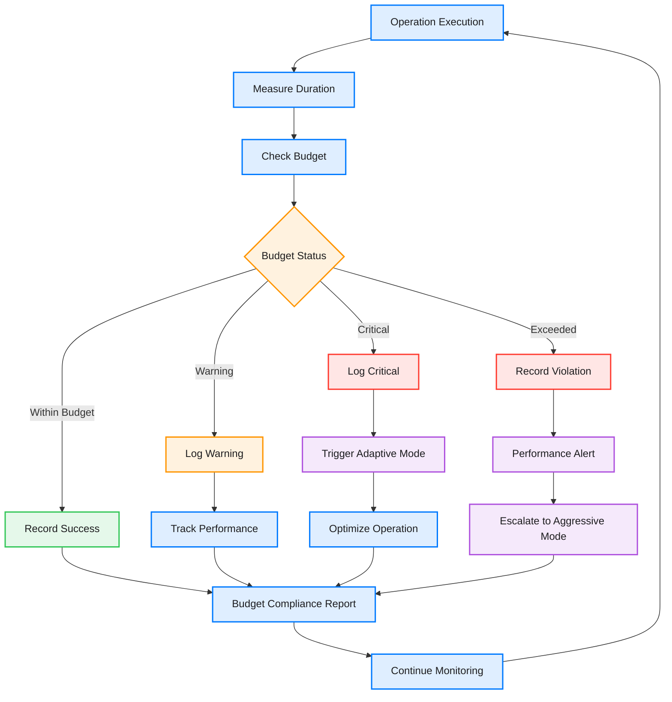

# Performance Monitoring & Optimization System

This diagram shows the comprehensive performance monitoring and optimization system that ensures 60fps rendering and efficient resource usage, including performance budget enforcement, real-time insights, and intelligent optimization.

```mermaid
classDiagram
    direction LR
    
    %% Row 1 - Core System
    class UnifiedPerformanceSystem {
        <<central coordinator>>
        +performanceMonitor PerformanceMonitor
        +performanceInsights PerformanceInsights
        +productionMetrics ProductionPerformanceMetrics
        +performanceBudget PerformanceBudget
        +budgetReporter PerformanceBudgetReporter
        +adaptiveMode AdaptivePerformanceMode
        +alertSystem PerformanceAlertSystem
        +healthScore Double
        +currentProfile PerformanceProfile
        +operationTracking [String: OperationMetrics]
        +memoryDeltaTracking MemoryDeltaTracker
        +initialize()
        +startMonitoring()
        +generateReport()
        +trackOperation(name: String)
        +calculateHealthScore() Double
        +switchProfile(profile: PerformanceProfile)
        +enableRealTimeTracking()
        +detectIssues() [PerformanceIssue]
    }

    class PerformanceMonitor {
        <<monitor>>
        +metrics PerformanceMetrics
        +thresholds PerformanceThresholds
        +isMonitoring Bool
        +operationMonitor AutomaticOperationMonitor
        +recordMetric()
        +checkThresholds()
        +startAutomaticMonitoring()
    }

    class PerformanceInsights {
        <<insights system>>
        +analyzer PerformanceAnalyzer
        +predictor PerformancePredictor
        +statusTracker PerformanceStatusTracker
        +issueDetector AutomaticIssueDetector
        +trendAnalyzer TrendAnalyzer
        +alertSystem PerformanceAlertSystem
        +currentStatus PerformanceStatus
        +detectedIssues [PerformanceIssue]
        +analyzeRealTimePerformance()
        +predictBottlenecks()
        +detectIssues() [PerformanceIssue]
        +analyzeTrends() TrendAnalysis
        +generateInsights() PerformanceReport
        +configureThresholds(thresholds: AlertThresholds)
    }

    %% Row 2 - Enhanced Metrics & Status
    class PerformanceMetrics {
        <<metrics container>>
        +renderingMetrics RenderingMetrics
        +memoryMetrics MemoryMetrics
        +textProcessingMetrics TextProcessingMetrics
        +operationMetrics [String: OperationMetrics]
        +timestamp Date
        +memoryDelta MemoryDelta
    }

    class PerformanceStatus {
        <<enumeration>>
        optimal
        suboptimal
        degraded
        critical
    }

    class PerformanceProfile {
        <<enumeration>>
        lowMemory
        highLatency
        cpuIntensive
        balanced
    }

    class PerformanceIssue {
        <<issue model>>
        +type IssueType
        +severity IssueSeverity
        +description String
        +detectedAt Date
        +affectedOperations [String]
        +suggestedActions [String]
    }

    class IssueSeverity {
        <<enumeration>>
        info
        warning
        critical
    }

    %% Row 3 - Analysis & Alert System
    class PerformanceAnalyzer {
        <<analyzer>>
        +patterns [PerformancePattern]
        +trendAnalyzer TrendAnalyzer
        +healthScorer HealthScorer
        +identifyBottlenecks()
        +analyzeRenderingPerformance()
        +calculateHealthScore() Double
        +analyzeComprehensiveHealth() HealthReport
    }

    class PerformancePredictor {
        <<predictor>>
        +models [PredictionModel]
        +historicalData PerformanceHistory
        +trendAnalysis TrendAnalysis
        +predictFrameRate()
        +predictMemoryUsage()
        +predictPerformanceTrends() TrendPrediction
    }

    class PerformanceAlertSystem {
        <<alert system>>
        +thresholds AlertThresholds
        +alertHandlers [AlertHandler]
        +activeAlerts [PerformanceAlert]
        +configureThresholds(thresholds: AlertThresholds)
        +checkThresholds(metrics: PerformanceMetrics)
        +triggerAlert(alert: PerformanceAlert)
        +resolveAlert(alertId: String)
    }

    class ProductionPerformanceMetrics {
        <<production system>>
        +telemetryCollector TelemetryCollector
        +metricsAggregator MetricsAggregator
        +p95Analyzer P95P99Analyzer
        +eventHandler PerformanceEventHandler
        +collectUserMetrics()
        +reportToCloud()
        +analyzeP95P99Performance()
        +handlePerformanceEvents()
    }

    %% Row 4 - Budget System Enhanced
    class PerformanceBudget {
        <<budget system>>
        +budgets [String: Budget]
        +operationTypes [OperationType]
        +complianceTracker BudgetComplianceTracker
        +violationHistory [BudgetViolation]
        +realTimeChecking Bool
        +budget(for: String) Budget?
        +checkBudgets() [BudgetViolation]
        +checkRealTimeCompliance(operation: String, duration: TimeInterval) BudgetStatus
        +trackViolation(violation: BudgetViolation)
        +generateComplianceReport() BudgetComplianceReport
        +defineBudgets() [String: Budget]
    }

    class OperationType {
        <<operation types>>
        syntaxHighlighting
        textLayout
        scrolling
        completion
        fileOperations
        undoRedo
        search
        replace
        formatting
        languageDetection
        memoryCleanup
        caching
        rendering
        textProcessing
        viewportUpdate
    }

    class BudgetStatus {
        <<enumeration>>
        withinBudget
        warning
        critical
        exceeded
    }

    class PerformanceBudgetReporter {
        <<budget reporter>>
        +measurements [String: [TimeInterval]]
        +complianceTracker BudgetComplianceTracker
        +violationTracker ViolationTracker
        +record(operation: String, duration: TimeInterval)
        +averageMeasurements() [String: TimeInterval]
        +generateReport() PerformanceBudgetReport
        +trackCompliance() ComplianceReport
        +reset()
    }

    %% Row 5 - Adaptive Performance Enhanced
    class AdaptivePerformanceMode {
        <<adaptive system>>
        +currentMode PerformanceMode
        +modeController PerformanceModeController
        +fileSizeAnalyzer FileSizeAnalyzer
        +languageComplexityAnalyzer LanguageComplexityAnalyzer
        +memoryPressureResponder MemoryPressureResponder
        +modeHistory [PerformanceModeChange]
        +adjustPerformanceMode()
        +optimizeForBattery()
        +analyzeFileSize(size: Int) FileSizeFactor
        +analyzeLanguageComplexity(language: Language) ComplexityFactor
        +respondToMemoryPressure(level: MemoryPressureLevel)
        +switchMode(to: PerformanceMode, reason: String)
    }

    class PerformanceMode {
        <<enumeration>>
        highQuality
        balanced
        performance
    }

    class MemoryMonitor {
        <<memory monitor>>
        +memoryPressureHandler MemoryPressureHandler
        +leakDetector MemoryLeakDetector
        +actorCoordinator ActorCoordinator
        +deltaTracker MemoryDeltaTracker
        +init(coordinator)
        +startMemoryMonitoring()
        +performCleanup()
        +trackMemoryDelta()
    }

    %% Row 6 - iOS-Specific Enhanced
    class IOSLargeFileOptimizer {
        <<iOS optimizer>>
        +optimizationThreshold Int
        +maxHighlightingRange Int
        +viewportExpansion CGFloat
        +memoryPressureMode MemoryPressureMode
        +isOptimizing Bool
        +currentMode OptimizationMode
        +metrics OptimizationMetrics
        +viewportHighlighter ViewportBasedHighlighter
        +memoryPressureHandler iOSMemoryPressureHandler
        +enableOptimizations()
        +disableOptimizations()
        +startViewportHighlighting()
        +handleMemoryPressure(level: MemoryPressureLevel)
        +optimizeForLargeFile(size: Int)
        +switchOptimizationMode(mode: OptimizationMode)
    }

    class OptimizationMode {
        <<enumeration>>
        highQuality
        balanced
        performance
    }

    class MemoryPressureMode {
        <<enumeration>>
        ignore
        adaptive
        aggressive
    }

    class ViewportBasedHighlighter {
        <<viewport highlighter>>
        +visibleRange NSRange
        +bufferSize Int
        +highlightQueue DispatchQueue
        +highlightVisibleContent()
        +expandHighlightingBuffer()
        +optimizeForLargeFiles()
    }

    %% Row 7 - Support Components
    class ViewportManager {
        <<viewport>>
        +visibleRange NSRange
        +cachedContent ViewportCache
        +scrollPredictor ScrollPredictor
        +updateVisibleRange()
        +optimizeRendering()
        +predictScrollDirection()
    }

    class RenderingMetrics {
        <<rendering>>
        +frameRate Double
        +frameDrops Int
        +renderTime TimeInterval
        +scrollPerformance ScrollPerformance
        +p95RenderTime TimeInterval
        +p99RenderTime TimeInterval
    }

    class MemoryMetrics {
        <<memory>>
        +totalMemoryUsage Int
        +peakMemoryUsage Int
        +memoryPressureLevel MemoryPressureLevel
        +leakDetection [MemoryLeak]
        +memoryDelta MemoryDelta
    }

    class TextProcessingMetrics {
        <<text metrics>>
        +editingLatency TimeInterval
        +typingResponsiveness Double
        +undoRedoPerformance TimeInterval
        +p95EditingLatency TimeInterval
        +p99EditingLatency TimeInterval
    }

    %% Row 8 - Advanced Analytics
    class TrendAnalyzer {
        <<trend analyzer>>
        +historicalData [PerformanceSnapshot]
        +trendModels [TrendModel]
        +predictiveAnalyzer PredictiveAnalyzer
        +analyzeTrends() TrendAnalysis
        +predictFuturePerformance() PerformancePrediction
        +identifyPerformancePatterns() [PerformancePattern]
    }

    class HealthScorer {
        <<health scorer>>
        +scoringRules [ScoringRule]
        +issueWeights [IssueType: Double]
        +calculateHealthScore(metrics: PerformanceMetrics) Double
        +identifyHealthIssues() [HealthIssue]
        +generateHealthReport() HealthReport
    }

    class AutomaticIssueDetector {
        <<issue detector>>
        +detectionRules [DetectionRule]
        +severityAnalyzer SeverityAnalyzer
        +detectIssues(metrics: PerformanceMetrics) [PerformanceIssue]
        +analyzeSeverity(issue: PerformanceIssue) IssueSeverity
        +suggestActions(issue: PerformanceIssue) [String]
    }

    class P95P99Analyzer {
        <<percentile analyzer>>
        +measurements [String: [TimeInterval]]
        +calculate95thPercentile(operation: String) TimeInterval
        +calculate99thPercentile(operation: String) TimeInterval
        +analyzePerformanceDistribution() DistributionReport
    }

    %% Row 9 - Memory & Cache
    class MemoryPressureHandler {
        <<pressure handler>>
        +pressureCallbacks [MemoryPressureCallback]
        +cleanupStrategies [CleanupStrategy]
        +aggressiveMode Bool
        +handleLowMemory()
        +recoverFromMemoryPressure()
        +enableAggressiveMode()
    }

    class MemoryLeakDetector {
        <<leak detector>>
        +trackedObjects WeakObjectSet
        +suspiciousRetainCycles [RetainCycle]
        +scanForLeaks()
        +analyzeRetainCycles()
    }

    class ViewportCache {
        <<cache>>
        +cachedLines [Int: CachedLine]
        +cacheStrategy CacheStrategy
        +lruCache LRUCache
        +cacheLine()
        +evictLeastUsed()
        +optimizeForMemoryPressure()
    }

    class MemoryDeltaTracker {
        <<delta tracker>>
        +baseline MemorySnapshot
        +currentSnapshot MemorySnapshot
        +deltaHistory [MemoryDelta]
        +trackMemoryDelta()
        +analyzeMemoryTrends()
        +detectMemoryLeaks() [MemoryLeak]
    }

    %% Row 10 - Performance Views & Dashboard
    class PerformanceViews {
        <<views>>
        +performanceDashboard PerformanceDashboard
        +metricsOverlay MetricsOverlay
        +insightsPanel PerformanceInsightsPanel
        +budgetPanel BudgetCompliancePanel
        +showPerformanceDashboard()
        +toggleMetricsOverlay()
        +showInsights()
        +showBudgetCompliance()
    }

    class PerformanceDashboard {
        <<dashboard>>
        +realTimeMetrics RealTimeMetricsView
        +charts [PerformanceChart]
        +healthIndicator HealthIndicator
        +alertsPanel AlertsPanel
        +updateMetrics()
        +addChart()
        +showHealthStatus()
        +displayAlerts()
    }

    class PerformanceInsightsPanel {
        <<insights panel>>
        +statusIndicator StatusIndicator
        +issuesList IssuesList
        +trendsChart TrendsChart
        +predictionsView PredictionsView
        +displayStatus()
        +showIssues()
        +showTrends()
        +showPredictions()
    }

    %% Row 11 - Telemetry & Support
    class TelemetryCollector {
        <<telemetry>>
        +userConsent Bool
        +dataRetentionPolicy DataRetentionPolicy
        +performanceEventHandler PerformanceEventHandler
        +collectRenderingTelemetry()
        +collectUsagePatterns()
        +handlePerformanceEvents()
    }

    class PerformanceModeController {
        <<mode controller>>
        +currentSettings PerformanceModeSettings
        +modeTransitions [ModeTransition]
        +switchMode()
        +applySettings()
        +trackModeChanges()
    }

    class ScrollPredictor {
        <<scroll prediction>>
        +scrollHistory ScrollHistory
        +predictionModel ScrollPredictionModel
        +predictScrollDirection()
        +estimateScrollVelocity()
    }

    class OptimizedLineIndexCache {
        <<optimized cache>>
        +cache LRUCache
        +incrementalUpdater IncrementalUpdater
        +optimizedLineInfo()
        +batchUpdate()
    }

    class IncrementalSyntaxHighlighter {
        <<incremental highlighter>>
        +highlighter SyntaxHighlighter
        +changeTracker ChangeTracker
        +incrementalHighlight()
        +scheduleBackgroundHighlighting()
    }

    %% Key Relationships
    UnifiedPerformanceSystem --> PerformanceMonitor : uses
    UnifiedPerformanceSystem --> PerformanceInsights : uses
    UnifiedPerformanceSystem --> ProductionPerformanceMetrics : uses
    UnifiedPerformanceSystem --> AdaptivePerformanceMode : uses
    UnifiedPerformanceSystem --> MemoryMonitor : uses
    UnifiedPerformanceSystem --> ViewportManager : uses
    UnifiedPerformanceSystem --> PerformanceBudget : enforces
    UnifiedPerformanceSystem --> PerformanceBudgetReporter : reports

    PerformanceMonitor --> PerformanceMetrics : collects
    PerformanceMetrics --> RenderingMetrics : contains
    PerformanceMetrics --> MemoryMetrics : contains
    PerformanceMetrics --> TextProcessingMetrics : contains

    PerformanceInsights --> PerformanceAnalyzer : uses
    PerformanceInsights --> PerformancePredictor : uses
    PerformanceInsights --> PerformanceAlertSystem : uses
    PerformanceInsights --> AutomaticIssueDetector : uses
    PerformanceInsights --> TrendAnalyzer : uses
    PerformanceInsights --> PerformanceStatus : tracks

    PerformanceAnalyzer --> HealthScorer : uses
    PerformanceAnalyzer --> TrendAnalyzer : uses
    PerformancePredictor --> TrendAnalyzer : uses

    ProductionPerformanceMetrics --> TelemetryCollector : uses
    ProductionPerformanceMetrics --> P95P99Analyzer : uses

    AdaptivePerformanceMode --> PerformanceModeController : uses
    AdaptivePerformanceMode --> PerformanceMode : manages

    PerformanceBudget --> OperationType : defines
    PerformanceBudget --> BudgetStatus : evaluates
    PerformanceBudgetReporter --> PerformanceBudget : uses
    PerformanceMonitor --> PerformanceBudgetReporter : records to

    MemoryMonitor --> MemoryPressureHandler : uses
    MemoryMonitor --> MemoryLeakDetector : uses
    MemoryMonitor --> MemoryDeltaTracker : uses

    ViewportManager --> ViewportCache : uses
    ViewportManager --> ScrollPredictor : uses

    IOSLargeFileOptimizer --> MemoryMonitor : uses
    IOSLargeFileOptimizer --> ViewportManager : coordinates with
    IOSLargeFileOptimizer --> IncrementalSyntaxHighlighter : uses
    IOSLargeFileOptimizer --> OptimizationMode : manages
    IOSLargeFileOptimizer --> MemoryPressureMode : uses
    IOSLargeFileOptimizer --> ViewportBasedHighlighter : uses

    PerformanceViews --> PerformanceDashboard : contains
    PerformanceViews --> PerformanceInsightsPanel : contains
    PerformanceDashboard --> PerformanceInsights : displays

    %% Styling - Dark mode friendly colors
    classDef system fill:#007AFF20,stroke:#007AFF,stroke-width:3px,color:#1D1D1F
    classDef monitor fill:#AF52DE20,stroke:#AF52DE,stroke-width:2px,color:#1D1D1F
    classDef metrics fill:#34C75920,stroke:#34C759,stroke-width:2px,color:#1D1D1F
    classDef insights fill:#007AFF20,stroke:#007AFF,stroke-width:2px,color:#1D1D1F
    classDef adaptive fill:#FF950020,stroke:#FF9500,stroke-width:2px,color:#1D1D1F
    classDef memory fill:#FF3B3020,stroke:#FF3B30,stroke-width:2px,color:#1D1D1F
    classDef viewport fill:#007AFF20,stroke:#007AFF,stroke-width:2px,color:#1D1D1F
    classDef optimized fill:#34C75920,stroke:#34C759,stroke-width:2px,color:#1D1D1F
    classDef views fill:#8E8E9320,stroke:#8E8E93,stroke-width:2px,color:#1D1D1F
    classDef enum fill:#8E8E9320,stroke:#8E8E93,stroke-width:2px,color:#1D1D1F
    classDef ios fill:#FF950020,stroke:#FF9500,stroke-width:2px,color:#1D1D1F
    classDef budget fill:#34C75920,stroke:#34C759,stroke-width:2px,color:#1D1D1F
    classDef alert fill:#FF3B3020,stroke:#FF3B30,stroke-width:2px,color:#1D1D1F
    classDef analytics fill:#AF52DE20,stroke:#AF52DE,stroke-width:2px,color:#1D1D1F

    class UnifiedPerformanceSystem system
    class PerformanceMonitor monitor
    class TelemetryCollector monitor
    class PerformanceMetrics metrics
    class RenderingMetrics metrics
    class MemoryMetrics metrics
    class TextProcessingMetrics metrics
    class PerformanceInsights insights
    class PerformanceAnalyzer insights
    class PerformancePredictor insights
    class ProductionPerformanceMetrics insights
    class PerformanceInsightsPanel insights
    class AdaptivePerformanceMode adaptive
    class PerformanceModeController adaptive
    class PerformanceMode adaptive
    class MemoryMonitor memory
    class MemoryPressureHandler memory
    class MemoryLeakDetector memory
    class MemoryDeltaTracker memory
    class ViewportManager viewport
    class ViewportCache viewport
    class ScrollPredictor viewport
    class ViewportBasedHighlighter viewport
    class OptimizedLineIndexCache optimized
    class IncrementalSyntaxHighlighter optimized
    class IOSLargeFileOptimizer ios
    class OptimizationMode ios
    class MemoryPressureMode ios
    class PerformanceViews views
    class PerformanceDashboard views
    class PerformanceStatus enum
    class PerformanceProfile enum
    class IssueSeverity enum
    class BudgetStatus enum
    class OperationType enum
    class PerformanceBudget budget
    class PerformanceBudgetReporter budget
    class PerformanceAlertSystem alert
    class PerformanceIssue alert
    class TrendAnalyzer analytics
    class HealthScorer analytics
    class AutomaticIssueDetector analytics
    class P95P99Analyzer analytics
```

## Performance Optimization Flow



## Performance Budget System Flow



## Key Performance Features

### 1. Real-time Monitoring & Intelligence
- **Frame Rate Tracking**: Continuous 60fps monitoring with P95/P99 analysis
- **Memory Usage**: Real-time memory pressure detection with delta tracking
- **Processing Times**: Edit latency and responsiveness tracking with percentile analysis
- **Resource Utilization**: CPU and memory usage optimization
- **Automatic Operation Monitoring**: Track all operations without manual instrumentation
- **Health Scoring**: 0-100 comprehensive health score with issue detection

### 2. Performance Insights System
- **Real-time Status Tracking**: Optimal, suboptimal, degraded, critical performance states
- **Automatic Issue Detection**: AI-powered issue identification with severity analysis
- **Predictive Analytics**: Trend analysis and future performance prediction
- **Performance Alerts**: Configurable threshold-based alerting system
- **Comprehensive Reporting**: Detailed insights with actionable recommendations

### 3. Performance Budget System
- **15+ Operation Types**: Pre-defined budgets for all major operations
  - Syntax highlighting, text layout, scrolling, completion
  - File operations, undo/redo, search/replace, formatting
  - Language detection, memory cleanup, caching, rendering
- **Real-time Compliance**: Automatic budget checking with violation tracking
- **Budget Status**: Within budget, warning, critical, exceeded states
- **Compliance Reporting**: Detailed budget violation analysis and trends

### 4. Adaptive Performance System
- **File Size Analysis**: Automatic performance mode switching based on file size
- **Language Complexity**: Smart optimization based on language complexity factors
- **Memory Pressure Response**: Intelligent response to memory pressure levels
- **Performance Profiles**: lowMemory, highLatency, cpuIntensive, balanced modes
- **Mode History**: Track performance mode changes and effectiveness

### 5. Enhanced Memory Management
- **Pressure Handling**: Automatic cleanup on memory warnings with three modes
- **Leak Detection**: Proactive memory leak identification and analysis
- **Smart Caching**: Efficient viewport and content caching with LRU optimization
- **Memory Delta Tracking**: Track memory usage changes over time
- **Garbage Collection**: Optimized memory reclamation strategies

### 6. iOS-Specific Optimizations
- **Three Optimization Modes**: High quality, balanced, performance modes
- **Memory Pressure Handling**: Ignore, adaptive, aggressive response strategies
- **Viewport-Based Highlighting**: Only highlight visible content + smart buffer
- **Large File Optimization**: Automatic optimization for files exceeding thresholds
- **Reduced Resource Usage**: Dynamic resource management for iOS constraints

### 7. Advanced Analytics & Insights
- **P95/P99 Analysis**: Detailed percentile performance analysis
- **Trend Analysis**: Long-term performance pattern identification
- **Health Scoring**: Comprehensive 0-100 health score calculation
- **Issue Severity Analysis**: Automatic severity classification (info, warning, critical)
- **Predictive Modeling**: AI-powered performance prediction and bottleneck identification

### 8. Performance Dashboard & Visualization
- **Real-time Dashboard**: Live performance metrics with health indicators
- **Insights Panel**: Performance status, issues, trends, and predictions
- **Budget Compliance Panel**: Budget violation tracking and compliance reporting
- **Alert Management**: Visual alert system with configurable thresholds
- **Interactive Charts**: Performance trends and analytics visualization

## Benefits

1. **Intelligent Performance Management**: AI-powered issue detection and optimization
2. **Proactive Optimization**: Prevents performance issues before they impact users
3. **Budget Enforcement**: Ensures operations stay within defined performance budgets
4. **Real-time Insights**: Comprehensive performance analysis with actionable recommendations
5. **Adaptive Behavior**: Automatically optimizes for current conditions and constraints
6. **Platform-Specific**: Tailored optimizations for iOS device limitations
7. **Predictive Analytics**: Forecast performance trends and potential bottlenecks
8. **Comprehensive Monitoring**: Track all performance aspects with detailed metrics
9. **Memory Efficiency**: Advanced memory management with leak detection
10. **60fps Guarantee**: Maintains smooth rendering across all operations

## Performance Budget Integration

```swift
// Define comprehensive performance budgets
let budgets = [
    "syntax_highlighting": Budget(operation: "Syntax Highlighting", targetTime: 0.016),
    "text_layout": Budget(operation: "Text Layout", targetTime: 0.016),
    "scrolling": Budget(operation: "Scrolling", targetTime: 0.008),
    "completion_request": Budget(operation: "Completion", targetTime: 0.05),
    "file_operations": Budget(operation: "File Operations", targetTime: 0.1),
    "undo_redo": Budget(operation: "Undo/Redo", targetTime: 0.02),
    "search": Budget(operation: "Search", targetTime: 0.03),
    "formatting": Budget(operation: "Formatting", targetTime: 0.025),
    "memory_cleanup": Budget(operation: "Memory Cleanup", targetTime: 0.05),
    "viewport_update": Budget(operation: "Viewport Update", targetTime: 0.01)
]

// Real-time budget tracking with health scoring
let performanceSystem = UnifiedPerformanceSystem()
performanceSystem.enableRealTimeTracking()
performanceSystem.trackOperation(name: "syntax_highlighting")

// Health score calculation (0-100)
let healthScore = performanceSystem.calculateHealthScore()
if healthScore < 70 {
    let issues = performanceSystem.detectIssues()
    performanceSystem.switchProfile(.lowMemory)
}

// Automatic issue detection and alerts
let insights = performanceSystem.performanceInsights
insights.configureThresholds(AlertThresholds(
    criticalHealthScore: 50,
    warningMemoryUsage: 0.8,
    criticalFrameDrops: 5
))
```

## Performance Profiles & Adaptive Modes

```swift
// Performance profiles for different scenarios
enum PerformanceProfile {
    case lowMemory      // Optimize for memory-constrained environments
    case highLatency    // Optimize for high-latency operations
    case cpuIntensive   // Optimize for CPU-heavy tasks
    case balanced       // Balanced optimization
}

// Adaptive performance mode switching
let adaptiveMode = AdaptivePerformanceMode()
adaptiveMode.analyzeFileSize(size: fileSize)
adaptiveMode.analyzeLanguageComplexity(language: .swift)
adaptiveMode.respondToMemoryPressure(level: .moderate)

// iOS-specific large file optimization
let iosOptimizer = IOSLargeFileOptimizer()
iosOptimizer.optimizeForLargeFile(size: 2_000_000) // 2MB threshold
iosOptimizer.handleMemoryPressure(level: .high)
iosOptimizer.startViewportHighlighting()
```