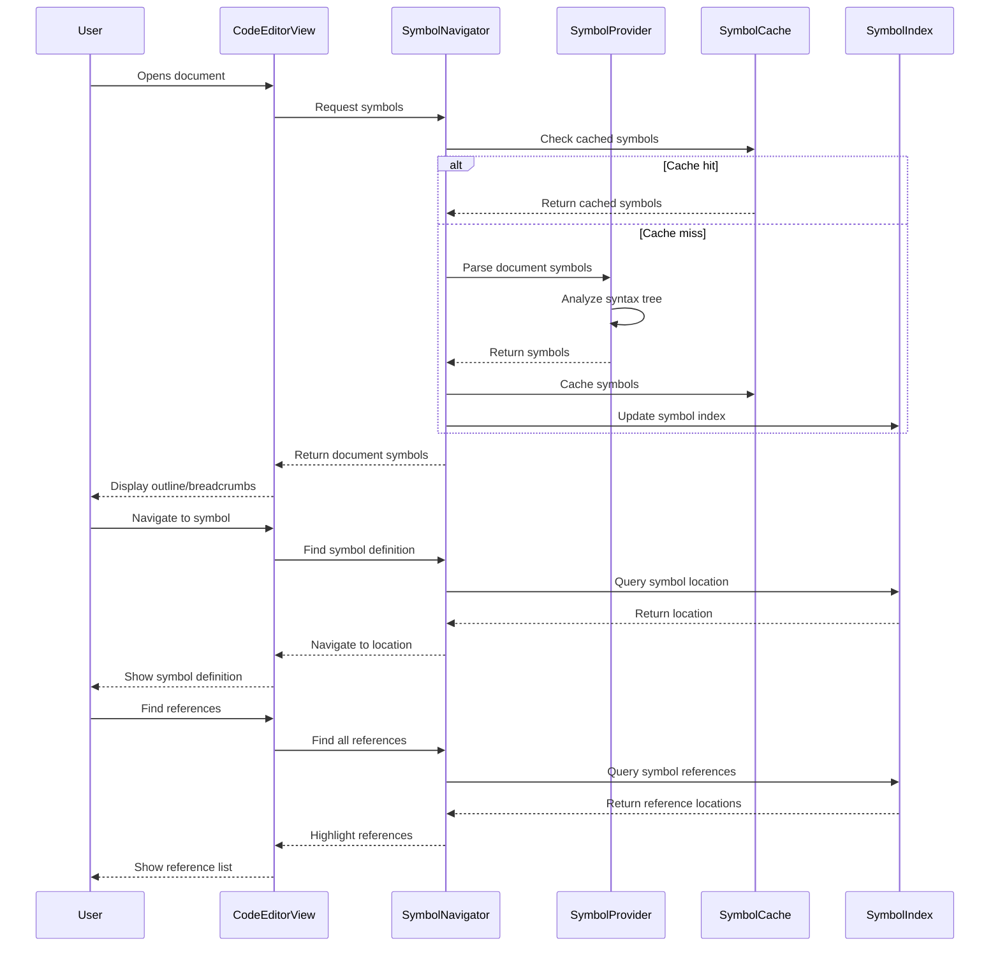

# Symbol Navigation & Code Intelligence

This diagram shows the comprehensive symbol navigation and code intelligence system that provides advanced code understanding and navigation capabilities.

```mermaid
classDiagram
    %% Core Symbol Navigation System
    class SymbolNavigator {
        +symbolProviders: [SymbolProvider]
        +symbolCache: SymbolCache
        +breadcrumbProvider: BreadcrumbProvider
        +outlineProvider: OutlineProvider
        +referenceProvider: ReferenceProvider
        +definitionProvider: DefinitionProvider
        +navigateToSymbol(symbol: DocumentSymbol)
        +findSymbolReferences(symbol: DocumentSymbol) [SymbolReference]
        +getDocumentOutline() DocumentOutline
        +getCurrentScope(position: TextPosition) ScopeInfo?
    }

    class OptimizedSymbolNavigator {
        +indexManager: SymbolIndexManager
        +cacheManager: OptimizedCacheManager
        +backgroundIndexer: BackgroundSymbolIndexer
        +incrementalUpdater: IncrementalSymbolUpdater
        +buildSymbolIndex(document: TextDocument)
        +updateSymbolIndex(changes: [TextChange])
        +querySymbolIndex(query: SymbolQuery) [DocumentSymbol]
        +optimizeIndexPerformance()
    }

    %% Symbol Provider System
    class SymbolProvider {
        &lt;&lt;protocol&gt;&gt;
        +languageId: String
        +capabilities: SymbolCapabilities
        +provideDocumentSymbols(document: TextDocument) [DocumentSymbol]
        +provideWorkspaceSymbols(query: String) [SymbolInformation]
        +resolveSymbol(symbol: DocumentSymbol) ResolvedSymbol?
    }

    class SwiftSymbolProvider {
        +swiftSyntaxParser: SwiftSyntaxParser
        +symbolExtractor: SwiftSymbolExtractor
        +contextAnalyzer: SwiftContextAnalyzer
        +extractClassSymbols(syntax: ClassDeclSyntax) [DocumentSymbol]
        +extractFunctionSymbols(syntax: FunctionDeclSyntax) [DocumentSymbol]
        +extractPropertySymbols(syntax: VariableDeclSyntax) [DocumentSymbol]
        +resolveInheritance(classSymbol: DocumentSymbol) [DocumentSymbol]
    }

    class PythonSymbolProvider {
        +astParser: PythonASTParser
        +symbolExtractor: PythonSymbolExtractor
        +importResolver: PythonImportResolver
        +extractClassSymbols(node: ast.ClassDef) [DocumentSymbol]
        +extractFunctionSymbols(node: ast.FunctionDef) [DocumentSymbol]
        +resolveImports(importNode: ast.Import) [DocumentSymbol]
    }

    class JavaScriptSymbolProvider {
        +babelParser: BabelParser
        +symbolExtractor: JSSymbolExtractor
        +moduleResolver: JSModuleResolver
        +typeInferencer: JSTypeInferencer
        +extractObjectSymbols(node: ObjectExpression) [DocumentSymbol]
        +extractFunctionSymbols(node: FunctionDeclaration) [DocumentSymbol]
        +inferTypes(symbol: DocumentSymbol) TypeInformation
    }

    class GenericSymbolProvider {
        +regexPatterns: [SymbolPattern]
        +heuristicAnalyzer: HeuristicAnalyzer
        +patternMatcher: PatternMatcher
        +fallbackExtractor: FallbackSymbolExtractor
        +extractSymbolsWithPatterns(text: String) [DocumentSymbol]
        +analyzeStructure(text: String) StructureAnalysis
    }

    %% Symbol Types and Models
    class DocumentSymbol {
        +name: String
        +kind: SymbolKind
        +range: NSRange
        +selectionRange: NSRange
        +detail: String?
        +children: [DocumentSymbol]
        +parent: DocumentSymbol?
        +containerName: String?
        +tags: [SymbolTag]
        +deprecated: Bool
    }

    class SymbolKind {
        &lt;&lt;enumeration&gt;&gt;
        file
        module
        namespace
        package
        class
        method
        property
        field
        constructor
        enum
        interface
        function
        variable
        constant
        string
        number
        boolean
        array
        object
        key
        null
        enumMember
        struct
        event
        operator
        typeParameter
    }

    class SymbolInformation {
        +symbol: DocumentSymbol
        +location: SymbolLocation
        +containerName: String?
        +score: Double
        +lastAccess: Date
        +accessCount: Int
    }

    class SymbolReference {
        +symbol: DocumentSymbol
        +location: SymbolLocation
        +referenceKind: ReferenceKind
        +context: ReferenceContext
        +isDeclaration: Bool
    }

    class ReferenceKind {
        &lt;&lt;enumeration&gt;&gt;
        declaration
        definition
        read
        write
        call
        instantiation
        inheritance
        implementation
    }

    %% Document Outline System
    class OutlineProvider {
        +symbolNavigator: SymbolNavigator
        +filterManager: OutlineFilterManager
        +groupingStrategy: OutlineGroupingStrategy
        +viewModel: OutlineViewModel
        +generateOutline(document: TextDocument) DocumentOutline
        +applyFilter(filter: OutlineFilter)
        +groupSymbols(symbols: [DocumentSymbol]) GroupedOutline
    }

    class DocumentOutline {
        +rootSymbols: [DocumentSymbol]
        +flatSymbols: [DocumentSymbol]
        +symbolHierarchy: SymbolHierarchy
        +metadata: OutlineMetadata
        +findSymbol(name: String) DocumentSymbol?
        +getSymbolPath(symbol: DocumentSymbol) [DocumentSymbol]
        +filterByKind(kinds: [SymbolKind]) [DocumentSymbol]
    }

    class OutlineViewModel {
        +expandedNodes: Set~String~
        +selectedSymbol: DocumentSymbol?
        +searchQuery: String?
        +filteredSymbols: [DocumentSymbol]
        +expandNode(symbolId: String)
        +collapseNode(symbolId: String)
        +selectSymbol(symbol: DocumentSymbol)
        +updateFilter(query: String)
    }

    %% Breadcrumb System
    class BreadcrumbProvider {
        +symbolNavigator: SymbolNavigator
        +scopeAnalyzer: ScopeAnalyzer
        +breadcrumbFormatter: BreadcrumbFormatter
        +generateBreadcrumbs(position: TextPosition) [BreadcrumbItem]
        +getCurrentScope(position: TextPosition) ScopeInfo
        +getSymbolPath(position: TextPosition) [DocumentSymbol]
    }

    class BreadcrumbItem {
        +symbol: DocumentSymbol
        +displayName: String
        +icon: SymbolIcon
        +range: NSRange
        +clickAction: BreadcrumbAction
        +contextMenu: [BreadcrumbMenuItem]
    }

    class ScopeAnalyzer {
        +analyzeScope(position: TextPosition, symbols: [DocumentSymbol]) ScopeInfo
        +findContainingScope(position: TextPosition) DocumentSymbol?
        +getVisibleSymbols(scope: DocumentSymbol) [DocumentSymbol]
        +resolveSymbolVisibility(symbol: DocumentSymbol, position: TextPosition) Bool
    }

    %% Symbol Indexing & Caching
    class SymbolIndexManager {
        +indices: [String: SymbolIndex]
        +indexBuilder: SymbolIndexBuilder
        +incrementalUpdater: IncrementalIndexUpdater
        +queryEngine: SymbolQueryEngine
        +buildIndex(document: TextDocument) SymbolIndex
        +updateIndex(documentId: String, changes: [TextChange])
        +querySymbols(query: SymbolQuery) [SymbolSearchResult]
    }

    class SymbolIndex {
        +documentId: String
        +symbols: [IndexedSymbol]
        +nameIndex: [String: [IndexedSymbol]]
        +kindIndex: [SymbolKind: [IndexedSymbol]]
        +positionIndex: IntervalTree~IndexedSymbol~
        +lastUpdated: Date
        +version: Int
    }

    class SymbolCache {
        +cache: LRUCache~String, CachedSymbols~
        +invalidationManager: CacheInvalidationManager
        +persistentCache: PersistentSymbolCache
        +cacheSymbols(documentId: String, symbols: [DocumentSymbol])
        +getCachedSymbols(documentId: String) [DocumentSymbol]?
        +invalidateCache(documentId: String)
        +persistCache()
    }

    %% Reference and Definition Resolution
    class ReferenceProvider {
        +symbolNavigator: SymbolNavigator
        +crossReferenceAnalyzer: CrossReferenceAnalyzer
        +workspaceIndexer: WorkspaceIndexer
        +findReferences(symbol: DocumentSymbol) [SymbolReference]
        +findAllReferences(symbol: DocumentSymbol, includeDeclaration: Bool) [SymbolReference]
        +analyzeSymbolUsage(symbol: DocumentSymbol) UsageAnalysis
    }

    class DefinitionProvider {
        +symbolNavigator: SymbolNavigator
        +definitionResolver: DefinitionResolver
        +importResolver: ImportResolver
        +findDefinition(symbol: DocumentSymbol) SymbolLocation?
        +findTypeDefinition(symbol: DocumentSymbol) SymbolLocation?
        +resolveImportedSymbol(importSymbol: DocumentSymbol) DocumentSymbol?
    }

    class CrossReferenceAnalyzer {
        +referenceDatabase: ReferenceDatabase
        +linkAnalyzer: SymbolLinkAnalyzer
        +dependencyTracker: DependencyTracker
        +analyzeReferences(document: TextDocument) [CrossReference]
        +buildReferenceGraph(symbols: [DocumentSymbol]) ReferenceGraph
        +detectCircularReferences(graph: ReferenceGraph) [CircularReference]
    }

    %% Symbol Navigation Types
    class SymbolNavigationTypes {
        +SymbolQuery: SymbolQuery
        +SymbolSearchResult: SymbolSearchResult
        +SymbolCapabilities: SymbolCapabilities
        +SymbolLocation: SymbolLocation
        +ScopeInfo: ScopeInfo
        +OutlineMetadata: OutlineMetadata
        +UsageAnalysis: UsageAnalysis
        +ReferenceGraph: ReferenceGraph
    }

    %% Relationships
    SymbolNavigator --> SymbolProvider : uses
    SymbolNavigator --> SymbolCache : caches with
    SymbolNavigator --> BreadcrumbProvider : coordinates
    SymbolNavigator --> OutlineProvider : coordinates
    SymbolNavigator --> ReferenceProvider : uses
    SymbolNavigator --> DefinitionProvider : uses

    OptimizedSymbolNavigator --> SymbolIndexManager : uses
    OptimizedSymbolNavigator --> BackgroundSymbolIndexer : schedules

    SymbolProvider <|-- SwiftSymbolProvider : implements
    SymbolProvider <|-- PythonSymbolProvider : implements
    SymbolProvider <|-- JavaScriptSymbolProvider : implements
    SymbolProvider <|-- GenericSymbolProvider : implements

    DocumentSymbol --> SymbolKind : categorized by
    DocumentSymbol --> SymbolInformation : extends to
    SymbolReference --> ReferenceKind : categorized by

    OutlineProvider --> DocumentOutline : generates
    OutlineProvider --> OutlineViewModel : manages
    DocumentOutline --> DocumentSymbol : contains

    BreadcrumbProvider --> BreadcrumbItem : generates
    BreadcrumbProvider --> ScopeAnalyzer : uses
    BreadcrumbItem --> DocumentSymbol : represents

    SymbolIndexManager --> SymbolIndex : manages
    SymbolCache --> CachedSymbols : stores

    ReferenceProvider --> CrossReferenceAnalyzer : uses
    CrossReferenceAnalyzer --> ReferenceGraph : builds

    %% Styling - Dark mode friendly colors
    classDef navigator fill:#6366f120,stroke:#6366f1,stroke-width:3px,color:#fff
    classDef provider fill:#8b5cf620,stroke:#8b5cf6,stroke-width:2px,color:#fff
    classDef symbol fill:#10b98120,stroke:#10b981,stroke-width:2px,color:#fff
    classDef outline fill:#3b82f620,stroke:#3b82f6,stroke-width:2px,color:#fff
    classDef breadcrumb fill:#f59e0b20,stroke:#f59e0b,stroke-width:2px,color:#fff
    classDef index fill:#ec489920,stroke:#ec4899,stroke-width:2px,color:#fff
    classDef reference fill:#06b6d420,stroke:#06b6d4,stroke-width:2px,color:#fff
    classDef types fill:#6b728020,stroke:#6b7280,stroke-width:2px,color:#fff
    classDef enum fill:#6b728020,stroke:#6b7280,stroke-width:2px,color:#fff

    class SymbolNavigator,OptimizedSymbolNavigator navigator
    class SymbolProvider,SwiftSymbolProvider,PythonSymbolProvider,JavaScriptSymbolProvider,GenericSymbolProvider provider
    class DocumentSymbol,SymbolInformation,SymbolReference symbol
    class OutlineProvider,DocumentOutline,OutlineViewModel outline
    class BreadcrumbProvider,BreadcrumbItem,ScopeAnalyzer breadcrumb
    class SymbolIndexManager,SymbolIndex,SymbolCache index
    class ReferenceProvider,DefinitionProvider,CrossReferenceAnalyzer reference
    class SymbolNavigationTypes types
    class SymbolKind,ReferenceKind enum
```

## Symbol Navigation Flow



## Key Symbol Intelligence Features

### 1. Multi-Language Symbol Providers
- **Swift Integration**: Full SwiftSyntax AST analysis
- **Python Support**: AST-based symbol extraction with import resolution
- **JavaScript/TypeScript**: Babel parser with type inference
- **Generic Fallback**: Pattern-based extraction for any language

### 2. Document Outline System
- **Hierarchical View**: Nested symbol structure display
- **Filtering & Search**: Real-time symbol filtering
- **Expandable Nodes**: Interactive tree navigation
- **Symbol Grouping**: Organize by type, visibility, or custom rules

### 3. Breadcrumb Navigation
- **Scope Awareness**: Shows current code context
- **Interactive Navigation**: Click to navigate to any scope level
- **Context Menus**: Quick actions for each breadcrumb item
- **Real-time Updates**: Updates as cursor moves

### 4. Reference & Definition Resolution
- **Go-to-Definition**: Precise symbol definition location
- **Find All References**: Complete symbol usage analysis
- **Cross-file Navigation**: Multi-document symbol resolution
- **Import Resolution**: Automatic import path resolution

### 5. Optimized Performance
- **Background Indexing**: Non-blocking symbol parsing
- **Incremental Updates**: Efficient partial re-indexing
- **Smart Caching**: LRU cache with persistent storage
- **Query Optimization**: Fast symbol search and lookup

### 6. Advanced Analysis
- **Scope Analysis**: Understand symbol visibility and context
- **Dependency Tracking**: Symbol relationship mapping
- **Circular Reference Detection**: Identify problematic dependencies
- **Usage Analytics**: Track symbol access patterns

## Benefits

1. **Fast Navigation**: Instant symbol lookup and navigation
2. **Language Agnostic**: Works across all supported languages
3. **Context Aware**: Understands code structure and relationships
4. **Scalable**: Handles large codebases efficiently
5. **Extensible**: Plugin architecture for new languages
6. **Persistent**: Maintains symbol information across sessions