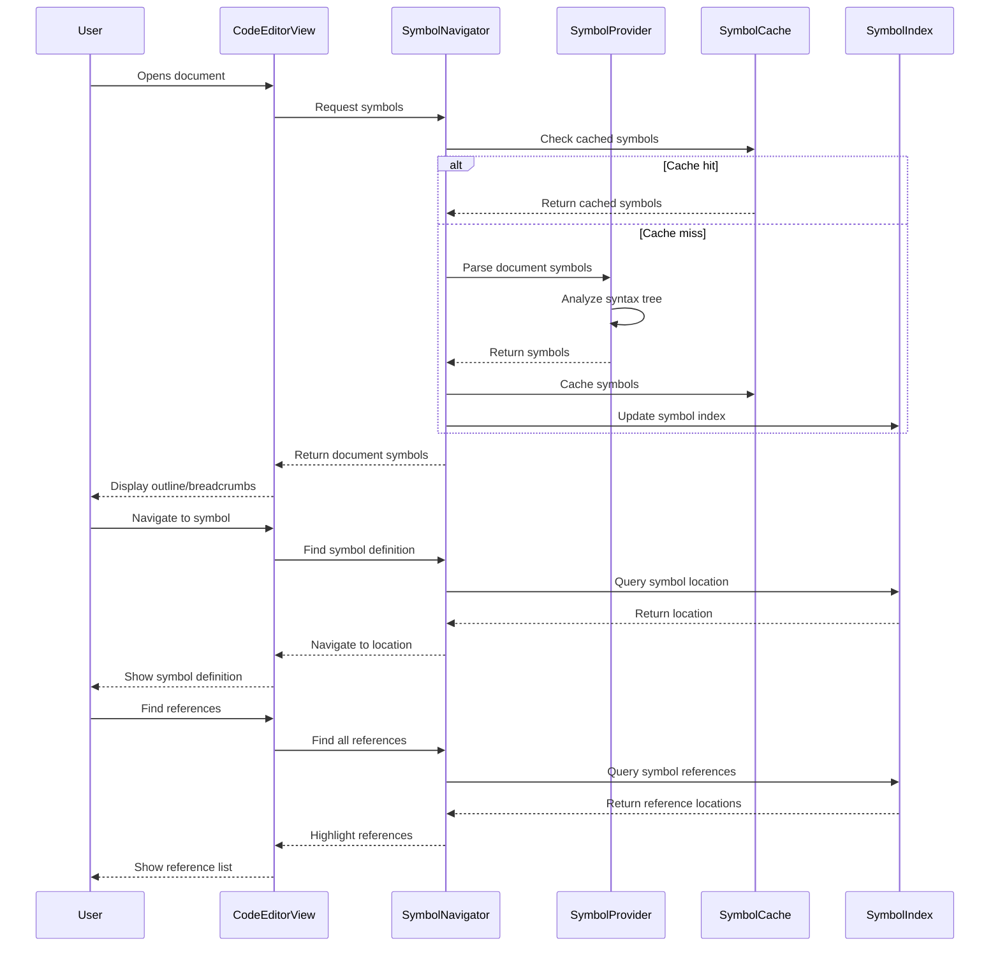

# Symbol Navigation & Code Intelligence

This diagram shows the comprehensive symbol navigation and code intelligence system that provides advanced code understanding and navigation capabilities.

```mermaid
classDiagram
    direction LR
    
    %% Row 1 - Core Navigation System
    class SymbolNavigator {
        <<navigator>>
        +symbolProviders [SymbolProvider]
        +symbolCache SymbolCache
        +breadcrumbProvider BreadcrumbProvider
        +navigateToSymbol()
        +findSymbolReferences()
        +getDocumentOutline()
    }

    class OptimizedSymbolNavigator {
        <<optimized navigator>>
        +indexManager SymbolIndexManager
        +cacheManager OptimizedCacheManager
        +backgroundIndexer BackgroundSymbolIndexer
        +buildSymbolIndex()
        +updateSymbolIndex()
        +querySymbolIndex()
    }

    class SymbolProvider {
        <<protocol>>
        +languageId String
        +capabilities SymbolCapabilities
        +provideDocumentSymbols()
        +provideWorkspaceSymbols()
        +resolveSymbol()
    }

    %% Row 2 - Language Providers

    class SwiftSymbolProvider {
        <<swift provider>>
        +swiftSyntaxParser SwiftSyntaxParser
        +symbolExtractor SwiftSymbolExtractor
        +extractClassSymbols()
        +extractFunctionSymbols()
        +resolveInheritance()
    }

    class PythonSymbolProvider {
        <<python provider>>
        +astParser PythonASTParser
        +symbolExtractor PythonSymbolExtractor
        +importResolver PythonImportResolver
        +extractClassSymbols()
        +resolveImports()
    }

    class JavaScriptSymbolProvider {
        <<javascript provider>>
        +babelParser BabelParser
        +symbolExtractor JSSymbolExtractor
        +moduleResolver JSModuleResolver
        +extractObjectSymbols()
        +inferTypes()
    }

    class GenericSymbolProvider {
        <<generic provider>>
        +regexPatterns [SymbolPattern]
        +heuristicAnalyzer HeuristicAnalyzer
        +extractSymbolsWithPatterns()
        +analyzeStructure()
    }

    %% Row 3 - Symbol Models
    class DocumentSymbol {
        <<symbol>>
        +name String
        +kind SymbolKind
        +range NSRange
        +children [DocumentSymbol]
        +deprecated Bool
    }

    class SymbolInformation {
        <<symbol info>>
        +symbol DocumentSymbol
        +location SymbolLocation
        +score Double
        +accessCount Int
    }

    class SymbolReference {
        <<reference>>
        +symbol DocumentSymbol
        +location SymbolLocation
        +referenceKind ReferenceKind
        +isDeclaration Bool
    }


    %% Row 4 - Outline System
    class OutlineProvider {
        <<outline provider>>
        +symbolNavigator SymbolNavigator
        +filterManager OutlineFilterManager
        +viewModel OutlineViewModel
        +generateOutline()
        +applyFilter()
        +groupSymbols()
    }

    class DocumentOutline {
        <<outline>>
        +rootSymbols [DocumentSymbol]
        +flatSymbols [DocumentSymbol]
        +symbolHierarchy SymbolHierarchy
        +findSymbol()
        +getSymbolPath()
    }

    class OutlineViewModel {
        <<view model>>
        +expandedNodes Set~String~
        +selectedSymbol DocumentSymbol?
        +filteredSymbols [DocumentSymbol]
        +expandNode()
        +selectSymbol()
    }

    %% Row 5 - Breadcrumb System
    class BreadcrumbProvider {
        <<breadcrumb provider>>
        +symbolNavigator SymbolNavigator
        +scopeAnalyzer ScopeAnalyzer
        +generateBreadcrumbs()
        +getCurrentScope()
    }

    class BreadcrumbItem {
        <<breadcrumb item>>
        +symbol DocumentSymbol
        +displayName String
        +icon SymbolIcon
        +range NSRange
    }

    class ScopeAnalyzer {
        <<scope analyzer>>
        +analyzeScope()
        +findContainingScope()
        +getVisibleSymbols()
        +resolveSymbolVisibility()
    }

    %% Row 6 - Indexing & Caching
    class SymbolIndexManager {
        <<index manager>>
        +indices [String: SymbolIndex]
        +indexBuilder SymbolIndexBuilder
        +incrementalUpdater IncrementalIndexUpdater
        +buildIndex()
        +querySymbols()
    }

    class SymbolIndex {
        <<index>>
        +documentId String
        +symbols [IndexedSymbol]
        +nameIndex [String: [IndexedSymbol]]
        +positionIndex IntervalTree~IndexedSymbol~
        +version Int
    }

    class SymbolCache {
        <<cache>>
        +cache LRUCache~String, CachedSymbols~
        +invalidationManager CacheInvalidationManager
        +cacheSymbols()
        +getCachedSymbols()
        +invalidateCache()
    }

    %% Row 7 - Reference & Definition
    class ReferenceProvider {
        <<reference provider>>
        +symbolNavigator SymbolNavigator
        +crossReferenceAnalyzer CrossReferenceAnalyzer
        +findReferences()
        +analyzeSymbolUsage()
    }

    class DefinitionProvider {
        <<definition provider>>
        +symbolNavigator SymbolNavigator
        +definitionResolver DefinitionResolver
        +findDefinition()
        +findTypeDefinition()
        +resolveImportedSymbol()
    }

    class CrossReferenceAnalyzer {
        <<reference analyzer>>
        +referenceDatabase ReferenceDatabase
        +linkAnalyzer SymbolLinkAnalyzer
        +analyzeReferences()
        +buildReferenceGraph()
        +detectCircularReferences()
    }

    %% Row 8 - Enumerations
    class SymbolKind {
        <<enumeration>>
        file
        class
        method
        property
        function
        variable
    }

    class ReferenceKind {
        <<enumeration>>
        declaration
        definition
        read
        write
        call
    }

    %% Key Relationships
    SymbolNavigator --> SymbolProvider : uses
    SymbolNavigator --> SymbolCache : caches with
    SymbolNavigator --> BreadcrumbProvider : coordinates
    SymbolNavigator --> OutlineProvider : coordinates
    SymbolNavigator --> ReferenceProvider : uses
    SymbolNavigator --> DefinitionProvider : uses

    OptimizedSymbolNavigator --> SymbolIndexManager : uses

    SymbolProvider <|-- SwiftSymbolProvider : implements
    SymbolProvider <|-- PythonSymbolProvider : implements
    SymbolProvider <|-- JavaScriptSymbolProvider : implements
    SymbolProvider <|-- GenericSymbolProvider : implements

    DocumentSymbol --> SymbolKind : categorized by
    SymbolReference --> ReferenceKind : categorized by

    OutlineProvider --> DocumentOutline : generates
    OutlineProvider --> OutlineViewModel : manages
    DocumentOutline --> DocumentSymbol : contains

    BreadcrumbProvider --> BreadcrumbItem : generates
    BreadcrumbProvider --> ScopeAnalyzer : uses

    SymbolIndexManager --> SymbolIndex : manages
    ReferenceProvider --> CrossReferenceAnalyzer : uses

    %% Styling - Dark mode friendly colors
    classDef navigator fill:#6366f120,stroke:#6366f1,stroke-width:3px,color:#fff
    classDef provider fill:#8b5cf620,stroke:#8b5cf6,stroke-width:2px,color:#fff
    classDef symbol fill:#10b98120,stroke:#10b981,stroke-width:2px,color:#fff
    classDef outline fill:#3b82f620,stroke:#3b82f6,stroke-width:2px,color:#fff
    classDef breadcrumb fill:#f59e0b20,stroke:#f59e0b,stroke-width:2px,color:#fff
    classDef index fill:#ec489920,stroke:#ec4899,stroke-width:2px,color:#fff
    classDef reference fill:#06b6d420,stroke:#06b6d4,stroke-width:2px,color:#fff
    classDef types fill:#6b728020,stroke:#6b7280,stroke-width:2px,color:#fff
    classDef enum fill:#6b728020,stroke:#6b7280,stroke-width:2px,color:#fff

    class SymbolNavigator navigator
    class OptimizedSymbolNavigator navigator
    class SymbolProvider provider
    class SwiftSymbolProvider provider
    class PythonSymbolProvider provider
    class JavaScriptSymbolProvider provider
    class GenericSymbolProvider provider
    class DocumentSymbol symbol
    class SymbolInformation symbol
    class SymbolReference symbol
    class OutlineProvider outline
    class DocumentOutline outline
    class OutlineViewModel outline
    class BreadcrumbProvider breadcrumb
    class BreadcrumbItem breadcrumb
    class ScopeAnalyzer breadcrumb
    class SymbolIndexManager index
    class SymbolIndex index
    class SymbolCache index
    class ReferenceProvider reference
    class DefinitionProvider reference
    class CrossReferenceAnalyzer reference
    class SymbolNavigationTypes types
    class SymbolKind enum
    class ReferenceKind enum
```

## Symbol Navigation Flow

## Key Symbol Intelligence Features

### 1. Multi-Language Symbol Providers
- **Swift Integration**: Full SwiftSyntax AST analysis
- **Python Support**: AST-based symbol extraction with import resolution
- **JavaScript/TypeScript**: Babel parser with type inference
- **Generic Fallback**: Pattern-based extraction for any language

### 2. Document Outline System
- **Hierarchical View**: Nested symbol structure display
- **Filtering & Search**: Real-time symbol filtering
- **Expandable Nodes**: Interactive tree navigation
- **Symbol Grouping**: Organize by type, visibility, or custom rules

### 3. Breadcrumb Navigation
- **Scope Awareness**: Shows current code context
- **Interactive Navigation**: Click to navigate to any scope level
- **Context Menus**: Quick actions for each breadcrumb item
- **Real-time Updates**: Updates as cursor moves

### 4. Reference & Definition Resolution
- **Go-to-Definition**: Precise symbol definition location
- **Find All References**: Complete symbol usage analysis
- **Cross-file Navigation**: Multi-document symbol resolution
- **Import Resolution**: Automatic import path resolution

### 5. Optimized Performance
- **Background Indexing**: Non-blocking symbol parsing
- **Incremental Updates**: Efficient partial re-indexing
- **Smart Caching**: LRU cache with persistent storage
- **Query Optimization**: Fast symbol search and lookup

### 6. Advanced Analysis
- **Scope Analysis**: Understand symbol visibility and context
- **Dependency Tracking**: Symbol relationship mapping
- **Circular Reference Detection**: Identify problematic dependencies
- **Usage Analytics**: Track symbol access patterns

## Benefits

1. **Fast Navigation**: Instant symbol lookup and navigation
2. **Language Agnostic**: Works across all supported languages
3. **Context Aware**: Understands code structure and relationships
4. **Scalable**: Handles large codebases efficiently
5. **Extensible**: Plugin architecture for new languages
6. **Persistent**: Maintains symbol information across sessions