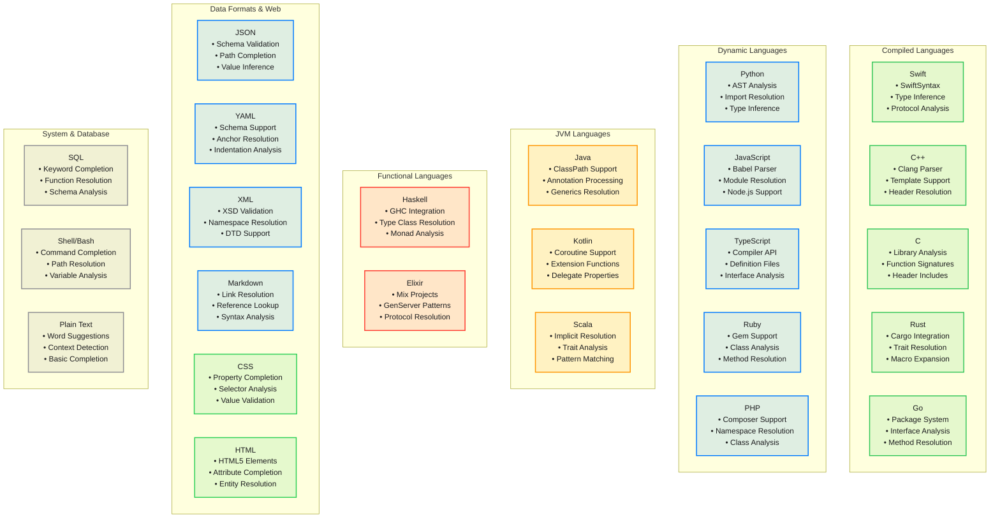

# Language Provider Complete Ecosystem

This comprehensive diagram shows the complete language provider ecosystem supporting 20 languages with completion, symbols, folding, and data providers.

```mermaid
classDiagram
    direction LR
    
    %% Row 1 - Core Provider Management
    class LanguageProviderFactory {
        <<factory>>
        +registry CompletionProviderRegistry
        +metadataRegistry LanguageMetadataRegistry
        +sharedBuilder SharedCompletionBuilder
        +createProvider()
        +registerCustomProvider()
        +initializeAllProviders()
    }

    class CompletionProviderRegistry {
        <<registry>>
        +providers [String: CompletionProvider]
        +symbolProviders [String: SymbolProvider]
        +foldingProviders [String: FoldingProvider]
        +universalProvider UniversalCompletionProvider
        +performanceMonitor ProviderPerformanceMonitor
        +registerProvider()
        +getProvider()
        +validateProvider()
        +getAllSupportedLanguages()
        +createDynamicProvider()
    }

    class LanguageMetadataRegistry {
        <<metadata registry>>
        +languageMetadata [String: LanguageMetadata]
        +completionMetadata [String: CompletionMetadata]
        +getLanguageInfo()
        +updateMetadata()
    }


    %% Row 2 - Compiled Languages
    class SwiftCompletionProvider {
        <<swift provider>>
        +swiftSyntax SwiftSyntaxHighlighter
        +symbolProvider SwiftSymbolProvider
        +contextAnalyzer SwiftContextAnalyzer
        +provideCompletions()
        +resolveImports()
        +inferTypes()
    }

    class CppCompletionProvider {
        <<cpp provider>>
        +clangParser ClangParser
        +headerResolver HeaderResolver
        +templateEngine TemplateEngine
        +provideCompletions()
        +resolveIncludes()
        +expandTemplates()
    }

    class CCompletionProvider {
        <<c provider>>
        +cParser CParser
        +headerAnalyzer CHeaderAnalyzer
        +libraryResolver CLibraryResolver
        +provideCompletions()
        +resolveHeaders()
        +analyzeFunctionSignatures()
    }

    class RustCompletionProvider {
        <<rust provider>>
        +rustAnalyzer RustAnalyzer
        +cargoResolver CargoResolver
        +traitResolver TraitResolver
        +provideCompletions()
        +resolveCrates()
        +expandMacros()
    }

    class GoCompletionProvider {
        <<go provider>>
        +goParser GoParser
        +packageResolver GoPackageResolver
        +interfaceAnalyzer InterfaceAnalyzer
        +provideCompletions()
        +resolvePackages()
        +analyzeInterfaces()
    }

    %% Row 3 - Dynamic Languages
    class PythonCompletionProvider {
        <<python provider>>
        +astParser PythonASTParser
        +importResolver PythonImportResolver
        +typeInferencer PythonTypeInferencer
        +provideCompletions()
        +resolveImports()
        +inferTypes()
    }

    class JavaScriptCompletionProvider {
        <<javascript provider>>
        +babelParser BabelParser
        +moduleResolver JSModuleResolver
        +typeInferencer JSTypeInferencer
        +provideCompletions()
        +resolveModules()
        +inferJSTypes()
    }

    class TypeScriptCompletionProvider {
        <<typescript provider>>
        +tsCompiler TypeScriptCompiler
        +definitionResolver TSDefinitionResolver
        +interfaceAnalyzer TSInterfaceAnalyzer
        +provideCompletions()
        +resolveDefinitions()
        +analyzeInterfaces()
    }

    class RubyCompletionProvider {
        <<ruby provider>>
        +rubyParser RubyParser
        +gemResolver GemResolver
        +classAnalyzer RubyClassAnalyzer
        +provideCompletions()
        +resolveGems()
        +analyzeClasses()
    }

    class PHPCompletionProvider {
        <<php provider>>
        +phpParser PHPParser
        +namespaceResolver PHPNamespaceResolver
        +classAnalyzer PHPClassAnalyzer
        +provideCompletions()
        +resolveNamespaces()
        +analyzeClasses()
    }

    %% Row 4 - JVM Languages
    class JavaCompletionProvider {
        <<java provider>>
        +javaParser JavaParser
        +classPathResolver ClassPathResolver
        +annotationProcessor AnnotationProcessor
        +provideCompletions()
        +resolveClassPath()
        +processAnnotations()
    }

    class KotlinCompletionProvider {
        <<kotlin provider>>
        +kotlinCompiler KotlinCompiler
        +coroutineAnalyzer CoroutineAnalyzer
        +extensionResolver ExtensionFunctionResolver
        +provideCompletions()
        +analyzeCoroutines()
        +resolveExtensions()
    }

    class ScalaCompletionProvider {
        <<scala provider>>
        +scalaCompiler ScalaCompiler
        +implicitResolver ImplicitResolver
        +traitAnalyzer TraitAnalyzer
        +provideCompletions()
        +resolveImplicits()
        +analyzePatterns()
    }

    %% Row 5 - Functional Languages
    class HaskellCompletionProvider {
        <<haskell provider>>
        +ghcCompiler GHCCompiler
        +typeClassResolver TypeClassResolver
        +moduleResolver HaskellModuleResolver
        +provideCompletions()
        +resolveTypeClasses()
        +analyzeMonads()
    }

    class ElixirCompletionProvider {
        <<elixir provider>>
        +elixirParser ElixirParser
        +mixResolver MixProjectResolver
        +genServerAnalyzer GenServerAnalyzer
        +provideCompletions()
        +resolveMixDependencies()
        +analyzeProtocols()
    }

    %% Row 6 - Data Format Providers
    class JSONCompletionProvider {
        <<json provider>>
        +schemaValidator JSONSchemaValidator
        +schemaResolver JSONSchemaResolver
        +pathAnalyzer JSONPathAnalyzer
        +provideCompletions()
        +validateSchema()
        +inferValueTypes()
    }

    class YAMLCompletionProvider {
        <<yaml provider>>
        +yamlParser YAMLParser
        +schemaValidator YAMLSchemaValidator
        +anchorResolver YAMLAnchorResolver
        +provideCompletions()
        +resolveAnchors()
        +validateIndentation()
    }

    class XMLCompletionProvider {
        <<xml provider>>
        +xmlParser XMLParser
        +xsdValidator XSDValidator
        +namespaceResolver XMLNamespaceResolver
        +provideCompletions()
        +validateXSD()
        +resolveNamespaces()
    }

    class MarkdownCompletionProvider {
        <<markdown provider>>
        +markdownParser MarkdownParser
        +linkResolver MarkdownLinkResolver
        +referenceLookup ReferenceManager
        +provideCompletions()
        +resolveLinks()
        +analyzeSyntax()
    }

    class CSSCompletionProvider {
        <<css provider>>
        +cssParser CSSParser
        +propertyDatabase CSSPropertyDatabase
        +selectorAnalyzer CSSSelectorAnalyzer
        +valueResolver CSSValueResolver
        +provideCompletions()
        +resolveProperties()
        +validateValues()
        +analyzeSelectors()
    }

    class HTMLCompletionProvider {
        <<html provider>>
        +htmlParser HTMLParser
        +elementDatabase HTML5ElementDatabase
        +attributeResolver HTMLAttributeResolver
        +entityResolver HTMLEntityResolver
        +provideCompletions()
        +resolveElements()
        +validateAttributes()
        +resolveEntities()
    }

    class SQLCompletionProvider {
        <<sql provider>>
        +sqlParser SQLParser
        +keywordDatabase SQLKeywordDatabase
        +functionResolver SQLFunctionResolver
        +schemaAnalyzer SQLSchemaAnalyzer
        +provideCompletions()
        +resolveKeywords()
        +analyzeFunctions()
        +validateSyntax()
    }

    class ShellCompletionProvider {
        <<shell provider>>
        +shellParser ShellParser
        +commandDatabase ShellCommandDatabase
        +pathResolver ShellPathResolver
        +variableAnalyzer ShellVariableAnalyzer
        +provideCompletions()
        +resolveCommands()
        +expandPaths()
        +analyzeVariables()
    }

    class PlainTextCompletionProvider {
        <<plaintext provider>>
        +textAnalyzer PlainTextAnalyzer
        +wordDatabase CommonWordDatabase
        +contextDetector TextContextDetector
        +provideCompletions()
        +suggestWords()
        +detectContext()
    }

    %% Row 7 - Symbol & Folding Providers
    class SymbolProviderRegistry {
        <<symbol registry>>
        +symbolProviders [String: SymbolProvider]
        +universalProvider UniversalSymbolProvider
        +cacheManager SymbolCacheManager
        +getSymbolProvider()
        +registerSymbolProvider()
    }

    class UniversalSymbolProvider {
        <<universal symbol>>
        +patternMatchers [LanguagePatternMatcher]
        +heuristicAnalyzer SymbolHeuristicAnalyzer
        +fallbackExtractor FallbackSymbolExtractor
        +provideSymbols()
        +extractWithPatterns()
    }

    class CSSSymbolProvider {
        <<css symbol>>
        +ruleExtractor CSSRuleExtractor
        +selectorAnalyzer CSSSelectorAnalyzer
        +classIdExtractor CSSClassIdExtractor
        +extractSymbols()
        +analyzeSelectors()
    }

    class HTMLSymbolProvider {
        <<html symbol>>
        +elementExtractor HTMLElementExtractor
        +idClassAnalyzer HTMLIdClassAnalyzer
        +sectionExtractor HTMLSectionExtractor
        +extractSymbols()
        +analyzeStructure()
    }

    class SQLSymbolProvider {
        <<sql symbol>>
        +tableExtractor SQLTableExtractor
        +procedureAnalyzer SQLProcedureAnalyzer
        +viewExtractor SQLViewExtractor
        +extractSymbols()
        +analyzeSchema()
    }

    class ShellSymbolProvider {
        <<shell symbol>>
        +functionExtractor ShellFunctionExtractor
        +variableAnalyzer ShellVariableAnalyzer
        +aliasExtractor ShellAliasExtractor
        +extractSymbols()
        +analyzeScope()
    }

    class FoldingProviderRegistry {
        <<folding registry>>
        +foldingProviders [String: FoldingProvider]
        +braceProvider BraceFoldingProvider
        +indentationProvider IndentationFoldingProvider
        +commentProvider CommentFoldingProvider
    }

    class BraceFoldingProvider {
        <<brace folding>>
        +braceMatchers [BraceMatcher]
        +balanceChecker BraceBalanceChecker
        +nestedAnalyzer NestedStructureAnalyzer
        +detectBraceRegions()
        +validateBraceBalance()
    }

    class IndentationFoldingProvider {
        <<indentation folding>>
        +indentationDetector IndentationDetector
        +hierarchyBuilder IndentationHierarchy
        +detectIndentationRegions()
        +buildIndentationHierarchy()
    }

    class CommentFoldingProvider {
        <<comment folding>>
        +commentDetectors [CommentDetector]
        +blockCommentAnalyzer BlockCommentAnalyzer
        +detectCommentBlocks()
        +extractDocComments()
    }

    class RubyFoldingProvider {
        <<ruby folding>>
        +blockDetector RubyBlockDetector
        +classMethodAnalyzer RubyClassMethodAnalyzer
        +endKeywordMatcher RubyEndKeywordMatcher
        +detectRubyBlocks()
        +analyzeClassMethods()
    }

    class XMLFoldingProvider {
        <<xml folding>>
        +tagMatcher XMLTagMatcher
        +elementAnalyzer XMLElementAnalyzer
        +nestingDetector XMLNestingDetector
        +detectXMLElements()
        +analyzeNesting()
    }

    class ShellFoldingProvider {
        <<shell folding>>
        +functionDetector ShellFunctionDetector
        +blockAnalyzer ShellBlockAnalyzer
        +hereDocDetector HereDocDetector
        +detectShellBlocks()
        +analyzeHereDocs()
    }

    class SQLFoldingProvider {
        <<sql folding>>
        +procedureDetector SQLProcedureDetector
        +blockAnalyzer SQLBlockAnalyzer
        +cteDetector SQLCTEDetector
        +detectSQLBlocks()
        +analyzeProcedures()
    }

    %% Row 8 - Shared Infrastructure
    class SharedCompletionBuilder {
        <<shared builder>>
        +keywordDatabase KeywordDatabase
        +snippetLibrary SnippetLibrary
        +contextAnalyzer SharedContextAnalyzer
        +buildKeywordCompletions()
        +buildSnippetCompletions()
        +calculatePriorities()
    }

    class LanguageMemberCompletions {
        <<member completions>>
        +memberAnalyzer MemberAnalyzer
        +inheritanceResolver InheritanceResolver
        +accessibilityChecker AccessibilityChecker
        +analyzeMembers()
        +resolveInheritance()
        +checkAccessibility()
    }

    %% Key Relationships
    LanguageProviderFactory --> CompletionProviderRegistry : manages
    LanguageProviderFactory --> LanguageMetadataRegistry : uses
    LanguageProviderFactory --> SharedCompletionBuilder : coordinates

    CompletionProviderRegistry --> SwiftCompletionProvider : contains
    CompletionProviderRegistry --> PythonCompletionProvider : contains
    CompletionProviderRegistry --> JavaScriptCompletionProvider : contains
    CompletionProviderRegistry --> JavaCompletionProvider : contains
    CompletionProviderRegistry --> JSONCompletionProvider : contains
    CompletionProviderRegistry --> CSSCompletionProvider : contains
    CompletionProviderRegistry --> HTMLCompletionProvider : contains
    CompletionProviderRegistry --> SQLCompletionProvider : contains
    CompletionProviderRegistry --> ShellCompletionProvider : contains
    CompletionProviderRegistry --> PlainTextCompletionProvider : contains
    
    CompletionProviderRegistry --> SymbolProviderRegistry : coordinates
    CompletionProviderRegistry --> FoldingProviderRegistry : coordinates

    SymbolProviderRegistry --> UniversalSymbolProvider : fallback to
    SymbolProviderRegistry --> CSSSymbolProvider : contains
    SymbolProviderRegistry --> HTMLSymbolProvider : contains
    SymbolProviderRegistry --> SQLSymbolProvider : contains
    SymbolProviderRegistry --> ShellSymbolProvider : contains
    
    FoldingProviderRegistry --> BraceFoldingProvider : uses
    FoldingProviderRegistry --> IndentationFoldingProvider : uses
    FoldingProviderRegistry --> CommentFoldingProvider : uses
    FoldingProviderRegistry --> RubyFoldingProvider : contains
    FoldingProviderRegistry --> XMLFoldingProvider : contains
    FoldingProviderRegistry --> ShellFoldingProvider : contains
    FoldingProviderRegistry --> SQLFoldingProvider : contains

    SharedCompletionBuilder --> LanguageMemberCompletions : uses

    %% Styling - Dark mode friendly colors
    classDef factory fill:#007AFF20,stroke:#007AFF,stroke-width:3px,color:#1D1D1F
    classDef registry fill:#AF52DE20,stroke:#AF52DE,stroke-width:2px,color:#1D1D1F
    classDef compiled fill:#34C75920,stroke:#34C759,stroke-width:2px,color:#1D1D1F
    classDef dynamic fill:#007AFF20,stroke:#007AFF,stroke-width:2px,color:#1D1D1F
    classDef jvm fill:#FF950020,stroke:#FF9500,stroke-width:2px,color:#1D1D1F
    classDef functional fill:#FF3B3020,stroke:#FF3B30,stroke-width:2px,color:#1D1D1F
    classDef data fill:#007AFF20,stroke:#007AFF,stroke-width:2px,color:#1D1D1F
    classDef symbol fill:#AF52DE20,stroke:#AF52DE,stroke-width:2px,color:#1D1D1F
    classDef folding fill:#34C75920,stroke:#34C759,stroke-width:2px,color:#1D1D1F
    classDef shared fill:#8E8E9320,stroke:#8E8E93,stroke-width:2px,color:#1D1D1F

    class LanguageProviderFactory factory
    class CompletionProviderRegistry registry
    class LanguageMetadataRegistry registry
    class SwiftCompletionProvider compiled
    class CppCompletionProvider compiled
    class CCompletionProvider compiled
    class RustCompletionProvider compiled
    class GoCompletionProvider compiled
    class PythonCompletionProvider dynamic
    class JavaScriptCompletionProvider dynamic
    class TypeScriptCompletionProvider dynamic
    class RubyCompletionProvider dynamic
    class PHPCompletionProvider dynamic
    class JavaCompletionProvider jvm
    class KotlinCompletionProvider jvm
    class ScalaCompletionProvider jvm
    class HaskellCompletionProvider functional
    class ElixirCompletionProvider functional
    class JSONCompletionProvider data
    class YAMLCompletionProvider data
    class XMLCompletionProvider data
    class MarkdownCompletionProvider data
    class CSSCompletionProvider data
    class HTMLCompletionProvider data
    class SQLCompletionProvider data
    class ShellCompletionProvider dynamic
    class PlainTextCompletionProvider shared
    class SymbolProviderRegistry symbol
    class UniversalSymbolProvider symbol
    class CSSSymbolProvider symbol
    class HTMLSymbolProvider symbol
    class SQLSymbolProvider symbol
    class ShellSymbolProvider symbol
    class FoldingProviderRegistry folding
    class BraceFoldingProvider folding
    class IndentationFoldingProvider folding
    class CommentFoldingProvider folding
    class RubyFoldingProvider folding
    class XMLFoldingProvider folding
    class ShellFoldingProvider folding
    class SQLFoldingProvider folding
    class SharedCompletionBuilder shared
    class LanguageMemberCompletions shared
```

## Language Support Matrix



## Key Ecosystem Features

### 1. Universal Provider Factory
- **Automatic Registration**: Self-registering language providers
- **Capability Discovery**: Runtime provider capability detection
- **Dynamic Loading**: Lazy loading of language-specific providers
- **Custom Provider Support**: Plugin architecture for additional languages

### 2. Comprehensive Language Support
- **20 Languages**: Full support for major programming languages
- **Complete Web Stack**: HTML, CSS, JavaScript, TypeScript support
- **Data Format Support**: JSON, YAML, XML, Markdown completion
- **System Languages**: Shell/Bash, SQL, Plain Text completion
- **Domain-Specific**: Specialized providers for different language paradigms
- **Extensible Architecture**: Easy addition of new language providers

### 3. Shared Infrastructure
- **Common Completion Logic**: Reusable completion building components
- **Keyword Databases**: Centralized keyword management
- **Snippet Libraries**: Shared code snippet repositories
- **Context Analysis**: Universal context understanding

### 4. Advanced Features
- **Context-Aware Completion**: CSS rules vs selectors, HTML tag-aware attributes
- **Symbol Resolution**: Cross-file symbol navigation for all supported languages
- **Import/Module Resolution**: Automatic dependency resolution
- **Type Inference**: Intelligent type analysis where applicable
- **Language Metadata Registry**: Dynamic provider creation and validation
- **Provider Performance Monitoring**: Real-time performance tracking
- **Universal Completion Provider**: Fallback completion with language metadata
- **Documentation Integration**: Inline documentation support

### 5. Performance Optimizations
- **Lazy Loading**: Providers loaded on demand
- **Caching**: Intelligent caching of parsing results
- **Background Processing**: Non-blocking completion generation
- **Incremental Parsing**: Efficient re-parsing on changes

## Benefits

1. **Complete Language Ecosystem**: Support for all 20 major programming languages
2. **Full-Stack Development**: Complete web development support (HTML, CSS, JS, TS)
3. **System Administration**: Shell scripting and SQL database support
4. **Consistent Experience**: Uniform completion behavior across all languages
5. **Context-Aware Intelligence**: Language-specific completion with contextual awareness
6. **High Performance**: Optimized for speed with performance monitoring
7. **Extensible Architecture**: Easy addition of new languages and providers
8. **Maintainable Codebase**: Shared infrastructure reduces code duplication
9. **Scalable Design**: Handles large codebases and complex projects efficiently
10. **Enhanced Provider Capabilities**: Symbol extraction, folding, and completion for all languages