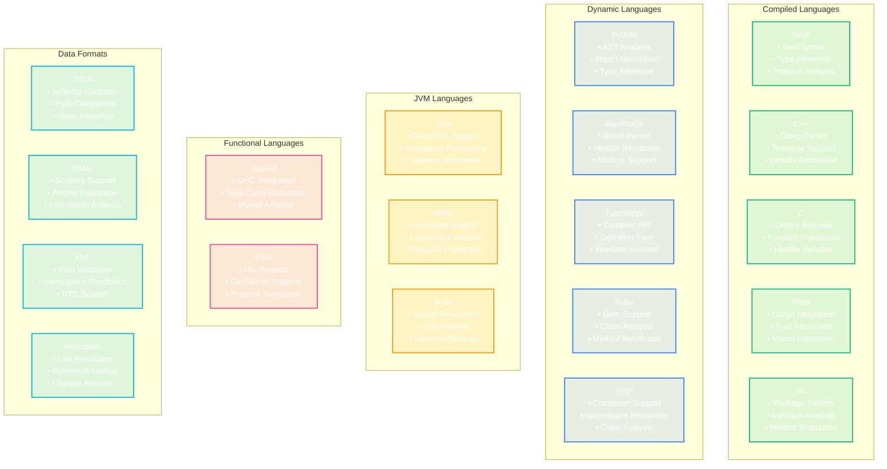

# Language Provider Complete Ecosystem

This comprehensive diagram shows the complete language provider ecosystem supporting 17+ languages with completion, symbols, folding, and data providers.

```mermaid
classDiagram
    %% Core Provider Management
    class LanguageProviderFactory {
        +registry: CompletionProviderRegistry
        +metadataRegistry: LanguageMetadataRegistry
        +sharedBuilder: SharedCompletionBuilder
        +createProvider(languageId: String) CompletionProvider?
        +registerCustomProvider(CompletionProvider)
        +getProviderCapabilities(languageId: String) ProviderCapabilities
        +initializeAllProviders()
    }

    class CompletionProviderRegistry {
        +providers: [String: CompletionProvider]
        +symbolProviders: [String: SymbolProvider]
        +foldingProviders: [String: FoldingProvider]
        +dataProviders: [String: DataProvider]
        +registerProvider(languageId: String, provider: CompletionProvider)
        +getProvider(languageId: String) CompletionProvider?
        +getAllSupportedLanguages() [String]
    }

    class LanguageMetadataRegistry {
        +languageMetadata: [String: LanguageMetadata]
        +completionMetadata: [String: CompletionMetadata]
        +symbolMetadata: [String: SymbolMetadata]
        +getLanguageInfo(languageId: String) LanguageMetadata?
        +updateMetadata(languageId: String, metadata: LanguageMetadata)
    }

    %% Core Language Providers (Compiled Languages)
    class SwiftCompletionProvider {
        +swiftSyntax: SwiftSyntaxHighlighter
        +symbolProvider: SwiftSymbolProvider
        +contextAnalyzer: SwiftContextAnalyzer
        +completionEngine: SwiftCompletionEngine
        +provideCompletions(context: CompletionContext) [CompletionItem]
        +resolveImports(imports: [ImportDecl]) [CompletionItem]
        +inferTypes(expression: Expr) TypeInformation
    }

    class CppCompletionProvider {
        +clangParser: ClangParser
        +headerResolver: HeaderResolver
        +templateEngine: TemplateEngine
        +macroExpander: MacroExpander
        +provideCompletions(context: CompletionContext) [CompletionItem]
        +resolveIncludes(includes: [IncludeDirective]) [CompletionItem]
        +expandTemplates(template: TemplateDecl) [CompletionItem]
    }

    class CCompletionProvider {
        +cParser: CParser
        +headerAnalyzer: CHeaderAnalyzer
        +libraryResolver: CLibraryResolver
        +functionAnalyzer: CFunctionAnalyzer
        +provideCompletions(context: CompletionContext) [CompletionItem]
        +resolveHeaders(headers: [HeaderInclude]) [CompletionItem]
        +analyzeFunctionSignatures(functions: [FunctionDecl]) [CompletionItem]
    }

    class RustCompletionProvider {
        +rustAnalyzer: RustAnalyzer
        +cargoResolver: CargoResolver
        +traitResolver: TraitResolver
        +macroExpander: RustMacroExpander
        +provideCompletions(context: CompletionContext) [CompletionItem]
        +resolveCrates(crates: [CrateDecl]) [CompletionItem]
        +expandMacros(macros: [MacroCall]) [CompletionItem]
    }

    class GoCompletionProvider {
        +goParser: GoParser
        +packageResolver: GoPackageResolver
        +interfaceAnalyzer: InterfaceAnalyzer
        +methodResolver: GoMethodResolver
        +provideCompletions(context: CompletionContext) [CompletionItem]
        +resolvePackages(packages: [PackageDecl]) [CompletionItem]
        +analyzeInterfaces(interfaces: [InterfaceDecl]) [CompletionItem]
    }

    %% Dynamic/Interpreted Language Providers
    class PythonCompletionProvider {
        +astParser: PythonASTParser
        +importResolver: PythonImportResolver
        +typeInferencer: PythonTypeInferencer
        +libraryAnalyzer: PythonLibraryAnalyzer
        +provideCompletions(context: CompletionContext) [CompletionItem]
        +resolveImports(imports: [ImportStmt]) [CompletionItem]
        +inferTypes(node: AST) TypeInformation
        +analyzeLibraries(libraries: [ModuleType]) [CompletionItem]
    }

    class JavaScriptCompletionProvider {
        +babelParser: BabelParser
        +moduleResolver: JSModuleResolver
        +typeInferencer: JSTypeInferencer
        +nodeResolver: NodeModuleResolver
        +provideCompletions(context: CompletionContext) [CompletionItem]
        +resolveModules(modules: [ImportDeclaration]) [CompletionItem]
        +inferJSTypes(expression: Expression) TypeInformation
    }

    class TypeScriptCompletionProvider {
        +tsCompiler: TypeScriptCompiler
        +definitionResolver: TSDefinitionResolver
        +interfaceAnalyzer: TSInterfaceAnalyzer
        +decoratorResolver: DecoratorResolver
        +provideCompletions(context: CompletionContext) [CompletionItem]
        +resolveDefinitions(definitions: [TypeDefinition]) [CompletionItem]
        +analyzeInterfaces(interfaces: [InterfaceDeclaration]) [CompletionItem]
    }

    class RubyCompletionProvider {
        +rubyParser: RubyParser
        +gemResolver: GemResolver
        +classAnalyzer: RubyClassAnalyzer
        +methodResolver: RubyMethodResolver
        +provideCompletions(context: CompletionContext) [CompletionItem]
        +resolveGems(gems: [GemDecl]) [CompletionItem]
        +analyzeClasses(classes: [ClassDecl]) [CompletionItem]
    }

    class PHPCompletionProvider {
        +phpParser: PHPParser
        +namespaceResolver: PHPNamespaceResolver
        +classAnalyzer: PHPClassAnalyzer
        +composerResolver: ComposerResolver
        +provideCompletions(context: CompletionContext) [CompletionItem]
        +resolveNamespaces(namespaces: [NamespaceDecl]) [CompletionItem]
        +analyzeClasses(classes: [ClassDeclaration]) [CompletionItem]
    }

    %% JVM Language Providers
    class JavaCompletionProvider {
        +javaParser: JavaParser
        +classPathResolver: ClassPathResolver
        +annotationProcessor: AnnotationProcessor
        +genericsResolver: GenericsResolver
        +provideCompletions(context: CompletionContext) [CompletionItem]
        +resolveClassPath(classPath: [ClassReference]) [CompletionItem]
        +processAnnotations(annotations: [Annotation]) [CompletionItem]
    }

    class KotlinCompletionProvider {
        +kotlinCompiler: KotlinCompiler
        +coroutineAnalyzer: CoroutineAnalyzer
        +extensionResolver: ExtensionFunctionResolver
        +delegateResolver: DelegateResolver
        +provideCompletions(context: CompletionContext) [CompletionItem]
        +analyzeCoroutines(coroutines: [SuspendFunction]) [CompletionItem]
        +resolveExtensions(extensions: [ExtensionFunction]) [CompletionItem]
    }

    class ScalaCompletionProvider {
        +scalaCompiler: ScalaCompiler
        +implicitResolver: ImplicitResolver
        +traitAnalyzer: TraitAnalyzer
        +patternMatcher: PatternMatcher
        +provideCompletions(context: CompletionContext) [CompletionItem]
        +resolveImplicits(implicits: [ImplicitDecl]) [CompletionItem]
        +analyzePatterns(patterns: [Pattern]) [CompletionItem]
    }

    %% Functional Language Providers
    class HaskellCompletionProvider {
        +ghcCompiler: GHCCompiler
        +typeClassResolver: TypeClassResolver
        +moduleResolver: HaskellModuleResolver
        +monadAnalyzer: MonadAnalyzer
        +provideCompletions(context: CompletionContext) [CompletionItem]
        +resolveTypeClasses(typeClasses: [TypeClass]) [CompletionItem]
        +analyzeMonads(monads: [MonadDecl]) [CompletionItem]
    }

    class ElixirCompletionProvider {
        +elixirParser: ElixirParser
        +mixResolver: MixProjectResolver
        +genServerAnalyzer: GenServerAnalyzer
        +protocolResolver: ProtocolResolver
        +provideCompletions(context: CompletionContext) [CompletionItem]
        +resolveMixDependencies(deps: [Dependency]) [CompletionItem]
        +analyzeProtocols(protocols: [Protocol]) [CompletionItem]
    }

    %% Data Format Providers
    class JSONCompletionProvider {
        +schemaValidator: JSONSchemaValidator
        +schemaResolver: JSONSchemaResolver
        +pathAnalyzer: JSONPathAnalyzer
        +valueInferencer: JSONValueInferencer
        +provideCompletions(context: CompletionContext) [CompletionItem]
        +validateSchema(schema: JSONSchema) ValidationResult
        +inferValueTypes(jsonPath: String) [CompletionItem]
    }

    class YAMLCompletionProvider {
        +yamlParser: YAMLParser
        +schemaValidator: YAMLSchemaValidator
        +anchorResolver: YAMLAnchorResolver
        +indentationAnalyzer: YAMLIndentationAnalyzer
        +provideCompletions(context: CompletionContext) [CompletionItem]
        +resolveAnchors(anchors: [YAMLAnchor]) [CompletionItem]
        +validateIndentation(yaml: YAMLDocument) ValidationResult
    }

    class XMLCompletionProvider {
        +xmlParser: XMLParser
        +xsdValidator: XSDValidator
        +namespaceResolver: XMLNamespaceResolver
        +dtdResolver: DTDResolver
        +provideCompletions(context: CompletionContext) [CompletionItem]
        +validateXSD(xsd: XSDSchema) ValidationResult
        +resolveNamespaces(namespaces: [XMLNamespace]) [CompletionItem]
    }

    class MarkdownCompletionProvider {
        +markdownParser: MarkdownParser
        +linkResolver: MarkdownLinkResolver
        +referenceLookup: ReferenceManager
        +syntaxAnalyzer: MarkdownSyntaxAnalyzer
        +provideCompletions(context: CompletionContext) [CompletionItem]
        +resolveLinks(links: [MarkdownLink]) [CompletionItem]
        +analyzeSyntax(markdown: MarkdownDocument) [CompletionItem]
    }

    %% Symbol Providers
    class SymbolProviderRegistry {
        +symbolProviders: [String: SymbolProvider]
        +universalProvider: UniversalSymbolProvider
        +cacheManager: SymbolCacheManager
        +getSymbolProvider(languageId: String) SymbolProvider?
        +registerSymbolProvider(languageId: String, provider: SymbolProvider)
    }

    class UniversalSymbolProvider {
        +patternMatchers: [LanguagePatternMatcher]
        +heuristicAnalyzer: SymbolHeuristicAnalyzer
        +fallbackExtractor: FallbackSymbolExtractor
        +provideSymbols(document: TextDocument) [DocumentSymbol]
        +extractWithPatterns(text: String, language: String) [DocumentSymbol]
    }

    %% Folding Providers
    class FoldingProviderRegistry {
        +foldingProviders: [String: FoldingProvider]
        +braceProvider: BraceFoldingProvider
        +indentationProvider: IndentationFoldingProvider
        +commentProvider: CommentFoldingProvider
        +customProviders: [String: CustomFoldingProvider]
    }

    class BraceFoldingProvider {
        +braceMatchers: [BraceMatcher]
        +balanceChecker: BraceBalanceChecker
        +nestedAnalyzer: NestedStructureAnalyzer
        +detectBraceRegions(text: String) [FoldingRange]
        +validateBraceBalance(text: String) BalanceResult
        +analyzeNesting(ranges: [FoldingRange]) NestingAnalysis
    }

    class IndentationFoldingProvider {
        +indentationDetector: IndentationDetector
        +hierarchyBuilder: IndentationHierarchy
        +foldingRangeCalculator: FoldingRangeCalculator
        +detectIndentationRegions(text: String) [FoldingRange]
        +buildIndentationHierarchy(lines: [String]) IndentationTree
        +calculateFoldingRanges(hierarchy: IndentationTree) [FoldingRange]
    }

    class CommentFoldingProvider {
        +commentDetectors: [CommentDetector]
        +blockCommentAnalyzer: BlockCommentAnalyzer
        +docCommentExtractor: DocumentationCommentExtractor
        +detectCommentBlocks(text: String, language: String) [FoldingRange]
        +extractDocComments(comments: [CommentBlock]) [DocumentationComment]
    }

    %% Shared Completion Infrastructure
    class SharedCompletionBuilder {
        +keywordDatabase: KeywordDatabase
        +snippetLibrary: SnippetLibrary
        +contextAnalyzer: SharedContextAnalyzer
        +priorityCalculator: CompletionPriorityCalculator
        +buildKeywordCompletions(language: String) [CompletionItem]
        +buildSnippetCompletions(context: CompletionContext) [CompletionItem]
        +calculatePriorities(items: [CompletionItem], context: CompletionContext) [CompletionItem]
    }

    class LanguageMemberCompletions {
        +memberAnalyzer: MemberAnalyzer
        +inheritanceResolver: InheritanceResolver
        +accessibilityChecker: AccessibilityChecker
        +overrideDetector: OverrideDetector
        +analyzeMembers(type: TypeDeclaration) [MemberInfo]
        +resolveInheritance(type: TypeDeclaration) [InheritedMember]
        +checkAccessibility(member: MemberInfo, context: CompletionContext) Bool
    }

    %% Relationships
    LanguageProviderFactory --> CompletionProviderRegistry : manages
    LanguageProviderFactory --> LanguageMetadataRegistry : uses
    LanguageProviderFactory --> SharedCompletionBuilder : coordinates

    CompletionProviderRegistry --> SwiftCompletionProvider : contains
    CompletionProviderRegistry --> CppCompletionProvider : contains
    CompletionProviderRegistry --> CCompletionProvider : contains
    CompletionProviderRegistry --> RustCompletionProvider : contains
    CompletionProviderRegistry --> GoCompletionProvider : contains
    CompletionProviderRegistry --> PythonCompletionProvider : contains
    CompletionProviderRegistry --> JavaScriptCompletionProvider : contains
    CompletionProviderRegistry --> TypeScriptCompletionProvider : contains
    CompletionProviderRegistry --> RubyCompletionProvider : contains
    CompletionProviderRegistry --> PHPCompletionProvider : contains
    CompletionProviderRegistry --> JavaCompletionProvider : contains
    CompletionProviderRegistry --> KotlinCompletionProvider : contains
    CompletionProviderRegistry --> ScalaCompletionProvider : contains
    CompletionProviderRegistry --> HaskellCompletionProvider : contains
    CompletionProviderRegistry --> ElixirCompletionProvider : contains
    CompletionProviderRegistry --> JSONCompletionProvider : contains
    CompletionProviderRegistry --> YAMLCompletionProvider : contains
    CompletionProviderRegistry --> XMLCompletionProvider : contains
    CompletionProviderRegistry --> MarkdownCompletionProvider : contains

    CompletionProviderRegistry --> SymbolProviderRegistry : coordinates
    CompletionProviderRegistry --> FoldingProviderRegistry : coordinates

    SymbolProviderRegistry --> UniversalSymbolProvider : fallback to
    FoldingProviderRegistry --> BraceFoldingProvider : uses
    FoldingProviderRegistry --> IndentationFoldingProvider : uses
    FoldingProviderRegistry --> CommentFoldingProvider : uses

    SharedCompletionBuilder --> LanguageMemberCompletions : uses

    %% Styling - Dark mode friendly colors
    classDef factory fill:#6366f120,stroke:#6366f1,stroke-width:3px,color:#fff
    classDef registry fill:#8b5cf620,stroke:#8b5cf6,stroke-width:2px,color:#fff
    classDef compiled fill:#10b98120,stroke:#10b981,stroke-width:2px,color:#fff
    classDef dynamic fill:#3b82f620,stroke:#3b82f6,stroke-width:2px,color:#fff
    classDef jvm fill:#f59e0b20,stroke:#f59e0b,stroke-width:2px,color:#fff
    classDef functional fill:#ec489920,stroke:#ec4899,stroke-width:2px,color:#fff
    classDef data fill:#06b6d420,stroke:#06b6d4,stroke-width:2px,color:#fff
    classDef symbol fill:#8b5cf620,stroke:#8b5cf6,stroke-width:2px,color:#fff
    classDef folding fill:#10b98120,stroke:#10b981,stroke-width:2px,color:#fff
    classDef shared fill:#6b728020,stroke:#6b7280,stroke-width:2px,color:#fff

    class LanguageProviderFactory factory
    class CompletionProviderRegistry registry
    class LanguageMetadataRegistry registry
    class SwiftCompletionProvider compiled
    class CppCompletionProvider compiled
    class CCompletionProvider compiled
    class RustCompletionProvider compiled
    class GoCompletionProvider compiled
    class PythonCompletionProvider dynamic
    class JavaScriptCompletionProvider dynamic
    class TypeScriptCompletionProvider dynamic
    class RubyCompletionProvider dynamic
    class PHPCompletionProvider dynamic
    class JavaCompletionProvider jvm
    class KotlinCompletionProvider jvm
    class ScalaCompletionProvider jvm
    class HaskellCompletionProvider functional
    class ElixirCompletionProvider functional
    class JSONCompletionProvider data
    class YAMLCompletionProvider data
    class XMLCompletionProvider data
    class MarkdownCompletionProvider data
    class SymbolProviderRegistry symbol
    class UniversalSymbolProvider symbol
    class FoldingProviderRegistry folding
    class BraceFoldingProvider folding
    class IndentationFoldingProvider folding
    class CommentFoldingProvider folding
    class SharedCompletionBuilder shared
    class LanguageMemberCompletions shared
```

## Language Support Matrix



## Key Ecosystem Features

### 1. Universal Provider Factory
- **Automatic Registration**: Self-registering language providers
- **Capability Discovery**: Runtime provider capability detection
- **Dynamic Loading**: Lazy loading of language-specific providers
- **Custom Provider Support**: Plugin architecture for additional languages

### 2. Comprehensive Language Support
- **17+ Languages**: Full support for major programming languages
- **Data Format Support**: JSON, YAML, XML, Markdown completion
- **Domain-Specific**: Specialized providers for different language paradigms
- **Extensible Architecture**: Easy addition of new language providers

### 3. Shared Infrastructure
- **Common Completion Logic**: Reusable completion building components
- **Keyword Databases**: Centralized keyword management
- **Snippet Libraries**: Shared code snippet repositories
- **Context Analysis**: Universal context understanding

### 4. Advanced Features
- **Symbol Resolution**: Cross-file symbol navigation
- **Import/Module Resolution**: Automatic dependency resolution
- **Type Inference**: Intelligent type analysis where applicable
- **Documentation Integration**: Inline documentation support

### 5. Performance Optimizations
- **Lazy Loading**: Providers loaded on demand
- **Caching**: Intelligent caching of parsing results
- **Background Processing**: Non-blocking completion generation
- **Incremental Parsing**: Efficient re-parsing on changes

## Benefits

1. **Comprehensive Coverage**: Support for virtually any programming language
2. **Consistent Experience**: Uniform completion behavior across languages
3. **High Performance**: Optimized for speed and responsiveness
4. **Extensible**: Easy to add support for new languages
5. **Maintainable**: Shared infrastructure reduces code duplication
6. **Scalable**: Handles large codebases and complex projects efficiently