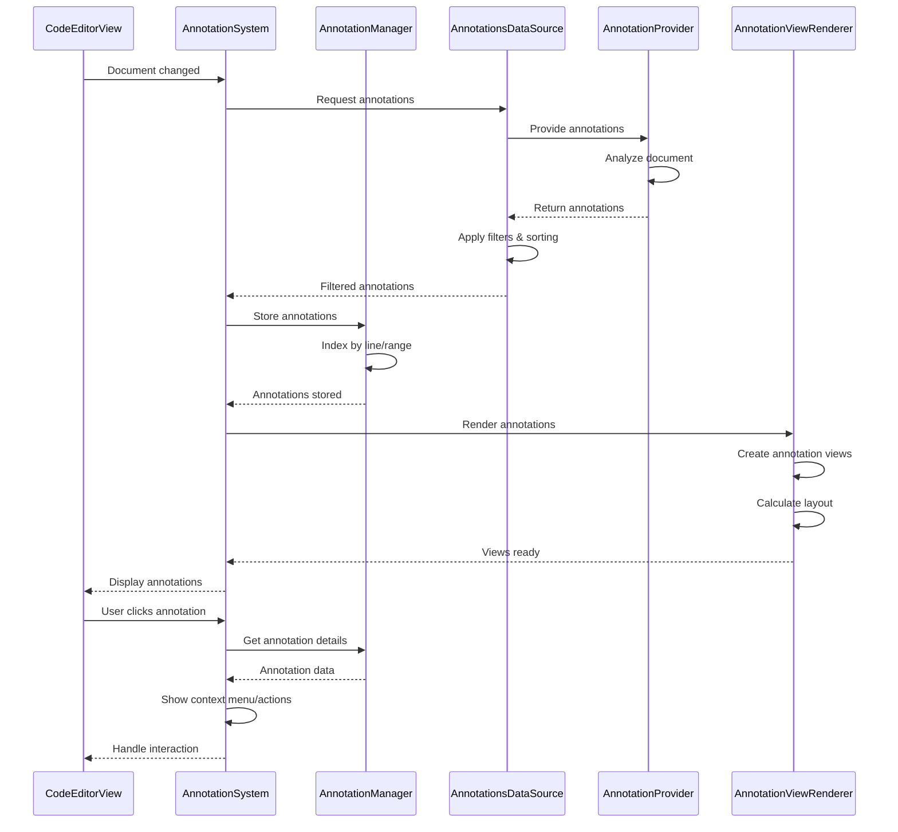

# Annotation System Detailed Architecture

This diagram shows the comprehensive annotation system that provides code annotations, diagnostics, and contextual information overlay capabilities.

```mermaid
classDiagram
    %% Core Annotation System
    class AnnotationSystem {
        +annotationManager: AnnotationManager
        +dataSource: AnnotationsDataSource
        +viewRenderer: AnnotationViewRenderer
        +contentProvider: AnnotationsContentView
        +eventProcessor: AnnotationEventProcessor
        +initialize(codeEditorView: CodeEditorView)
        +addAnnotation(annotation: Annotation)
        +removeAnnotation(id: String)
        +updateAnnotation(id: String, annotation: Annotation)
        +getAnnotations(range: NSRange) [Annotation]
    }

    class AnnotationManager {
        +annotations: [String: Annotation]
        +lineAnnotations: [Int: [LineAnnotation]]
        +messageAnnotations: [String: MessageLineAnnotation]
        +codeAnnotations: [String: CodeEditorViewAnnotation]
        +sortedAnnotations: SortedAnnotationList
        +addAnnotation(annotation: Annotation) String
        +removeAnnotation(id: String) Bool
        +updateAnnotation(id: String, annotation: Annotation) Bool
        +getAnnotationsInRange(range: NSRange) [Annotation]
        +getAnnotationsForLine(line: Int) [LineAnnotation]
    }

    %% Annotation Models
    class Annotation {
        +id: String
        +kind: AnnotationKind
        +range: NSRange
        +message: String
        +severity: AnnotationSeverity
        +source: AnnotationSource
        +data: AnnotationData
        +timestamp: Date
        +isVisible: Bool
        +priority: Int
    }

    class AnnotationKind {
        &lt;&lt;enumeration&gt;&gt;
        error
        warning
        info
        hint
        deprecated
        todo
        fixme
        note
        bookmark
        breakpoint
        coverage
        performance
        security
        accessibility
        custom(type: String)
    }

    class AnnotationSeverity {
        &lt;&lt;enumeration&gt;&gt;
        error
        warning
        information
        hint
    }

    class AnnotationSource {
        &lt;&lt;enumeration&gt;&gt;
        compiler
        linter
        languageServer
        plugin
        user
        debugger
        testing
        performance
        security
    }

    class AnnotationData {
        +title: String?
        +description: String?
        +suggestions: [FixSuggestion]
        +relatedInformation: [RelatedInformation]
        +tags: [String]
        +metadata: [String: Any]
        +actions: [AnnotationAction]
    }

    %% Specialized Annotation Types
    class LineAnnotation {
        +line: Int
        +column: Int?
        +text: String
        +icon: AnnotationIcon?
        +backgroundColor: PlatformColor?
        +textColor: PlatformColor?
        +isFullLine: Bool
        +indentationLevel: Int
    }

    class MessageLineAnnotation {
        +messageText: String
        +attributedMessage: NSAttributedString
        +messageType: MessageType
        +isExpandable: Bool
        +expandedContent: String?
        +contextualActions: [MessageAction]
        +formatting: MessageFormatting
    }

    class CodeEditorViewAnnotation {
        +editorView: CodeEditorView
        +overlayView: AnnotationOverlayView
        +positioning: AnnotationPositioning
        +layoutConstraints: [NSLayoutConstraint]
        +isFloating: Bool
        +tracksCursor: Bool
        +autoHide: Bool
    }

    %% Annotation Views and Rendering
    class AnnotationView {
        +annotation: Annotation
        +contentView: AnnotationContentView
        +backgroundView: AnnotationBackgroundView
        +borderView: AnnotationBorderView
        +gestureRecognizers: [UIGestureRecognizer]
        +configure(with: Annotation)
        +updateAppearance()
        +handleTap(gesture: UITapGestureRecognizer)
        +handleHover(gesture: UIHoverGestureRecognizer)
    }

    class AnnotationContentView {
        +titleLabel: UILabel
        +messageLabel: UILabel
        +iconView: UIImageView
        +actionsStackView: UIStackView
        +detailsView: AnnotationDetailsView?
        +setupLayout()
        +updateContent(annotation: Annotation)
        +addAction(action: AnnotationAction)
    }

    class AnnotationViewRenderer {
        +viewCache: AnnotationViewCache
        +layoutManager: AnnotationLayoutManager
        +animationController: AnnotationAnimationController
        +themeManager: AnnotationThemeManager
        +renderAnnotation(annotation: Annotation) AnnotationView
        +updateAnnotationView(view: AnnotationView, annotation: Annotation)
        +layoutAnnotations(annotations: [Annotation])
        +animateAnnotationChange(change: AnnotationChange)
    }

    class AnnotationLayoutManager {
        +positioningStrategy: AnnotationPositioningStrategy
        +collisionDetector: AnnotationCollisionDetector
        +spacingCalculator: AnnotationSpacingCalculator
        +calculatePosition(annotation: Annotation) CGPoint
        +resolveCollisions(annotations: [PositionedAnnotation]) [PositionedAnnotation]
        +optimizeLayout(layout: AnnotationLayout) AnnotationLayout
    }

    %% Data Source and Content Management
    class AnnotationsDataSource {
        +providers: [AnnotationProvider]
        +cache: AnnotationCache
        +filterManager: AnnotationFilterManager
        +sortingManager: AnnotationSortingManager
        +loadAnnotations(document: TextDocument) [Annotation]
        +registerProvider(provider: AnnotationProvider)
        +applyFilters(annotations: [Annotation]) [Annotation]
        +sortAnnotations(annotations: [Annotation]) [Annotation]
    }

    class AnnotationProvider {
        &lt;&lt;protocol&gt;&gt;
        +providerName: String
        +supportedKinds: [AnnotationKind]
        +priority: Int
        +provideAnnotations(document: TextDocument) [Annotation]
        +canProvideAnnotation(kind: AnnotationKind) Bool
        +validateAnnotation(annotation: Annotation) ValidationResult
    }

    class DiagnosticAnnotationProvider {
        +diagnosticsSource: DiagnosticsSource
        +severityMapper: SeverityMapper
        +messageFormatter: DiagnosticMessageFormatter
        +provideAnnotations(document: TextDocument) [Annotation]
        +convertDiagnostic(diagnostic: Diagnostic) Annotation
        +formatDiagnosticMessage(diagnostic: Diagnostic) String
    }

    class LSPAnnotationProvider {
        +lspClient: LSPClient
        +diagnosticProcessor: LSPDiagnosticProcessor
        +codeActionProvider: LSPCodeActionProvider
        +provideAnnotations(document: TextDocument) [Annotation]
        +processDiagnostics(diagnostics: [LSPDiagnostic]) [Annotation]
        +extractCodeActions(annotation: Annotation) [AnnotationAction]
    }

    class UserAnnotationProvider {
        +bookmarkManager: BookmarkManager
        +noteManager: NoteManager
        +todoExtractor: TodoCommentExtractor
        +provideAnnotations(document: TextDocument) [Annotation]
        +extractTodos(text: String) [Annotation]
        +loadBookmarks(document: TextDocument) [Annotation]
    }

    %% Annotation Interaction and Actions
    class AnnotationInteractionManager {
        +gestureProcessor: AnnotationGestureProcessor
        +contextMenuProvider: AnnotationContextMenuProvider
        +hoverController: AnnotationHoverController
        +clickHandler: AnnotationClickHandler
        +handleAnnotationInteraction(interaction: AnnotationInteraction)
        +showContextMenu(annotation: Annotation, point: CGPoint)
        +processHover(annotation: Annotation, duration: TimeInterval)
    }

    class AnnotationAction {
        +id: String
        +title: String
        +icon: ActionIcon?
        +handler: AnnotationActionHandler
        +isDestructive: Bool
        +requiresConfirmation: Bool
        +shortcut: KeyboardShortcut?
        +execute(context: AnnotationActionContext)
        +canExecute(context: AnnotationActionContext) Bool
    }

    class FixSuggestion {
        +title: String
        +description: String
        +textEdits: [TextEdit]
        +additionalChanges: [DocumentChange]
        +confidence: Double
        +category: FixCategory
        +apply(document: TextDocument) FixResult
        +preview() FixPreview
    }

    %% Annotation Filtering and Organization
    class AnnotationFilterManager {
        +activeFilters: [AnnotationFilter]
        +filterPresets: [FilterPreset]
        +customFilters: [CustomAnnotationFilter]
        +applyFilters(annotations: [Annotation]) [Annotation]
        +addFilter(filter: AnnotationFilter)
        +removeFilter(filterId: String)
        +createPreset(filters: [AnnotationFilter], name: String) FilterPreset
    }

    class AnnotationFilter {
        +filterId: String
        +name: String
        +predicate: AnnotationPredicate
        +isEnabled: Bool
        +priority: Int
        +apply(annotations: [Annotation]) [Annotation]
        +matches(annotation: Annotation) Bool
    }

    class AnnotationCache {
        +cache: LRUCache~String, [Annotation]~
        +persistentCache: PersistentAnnotationCache
        +invalidationRules: [CacheInvalidationRule]
        +cacheAnnotations(documentId: String, annotations: [Annotation])
        +getCachedAnnotations(documentId: String) [Annotation]?
        +invalidateCache(documentId: String)
        +cleanupExpiredEntries()
    }

    %% Theme and Appearance
    class AnnotationThemeManager {
        +currentTheme: AnnotationTheme
        +lightTheme: AnnotationTheme
        +darkTheme: AnnotationTheme
        +customThemes: [String: AnnotationTheme]
        +getTheme(kind: AnnotationKind) AnnotationAppearance
        +updateTheme(theme: AnnotationTheme)
        +createCustomTheme(name: String, appearance: [AnnotationKind: AnnotationAppearance])
    }

    class AnnotationTheme {
        +name: String
        +appearances: [AnnotationKind: AnnotationAppearance]
        +defaultAppearance: AnnotationAppearance
        +backgroundOverlay: OverlayStyle
        +getAppearance(kind: AnnotationKind) AnnotationAppearance
    }

    class AnnotationAppearance {
        +backgroundColor: PlatformColor
        +borderColor: PlatformColor
        +textColor: PlatformColor
        +iconTint: PlatformColor
        +borderWidth: CGFloat
        +cornerRadius: CGFloat
        +shadow: ShadowStyle?
        +animation: AnimationStyle?
    }

    %% Relationships
    AnnotationSystem --> AnnotationManager : manages
    AnnotationSystem --> AnnotationsDataSource : uses
    AnnotationSystem --> AnnotationViewRenderer : renders with
    AnnotationSystem --> AnnotationsContentView : displays
    AnnotationSystem --> AnnotationInteractionManager : handles interactions

    AnnotationManager --> Annotation : stores
    Annotation --> AnnotationKind : categorized by
    Annotation --> AnnotationSeverity : has
    Annotation --> AnnotationSource : originates from
    Annotation --> AnnotationData : contains

    Annotation <|-- LineAnnotation : specializes to
    Annotation <|-- MessageLineAnnotation : specializes to
    Annotation <|-- CodeEditorViewAnnotation : specializes to

    AnnotationViewRenderer --> AnnotationView : creates
    AnnotationViewRenderer --> AnnotationLayoutManager : uses
    AnnotationView --> AnnotationContentView : contains

    AnnotationsDataSource --> AnnotationProvider : uses
    AnnotationProvider <|-- DiagnosticAnnotationProvider : implements
    AnnotationProvider <|-- LSPAnnotationProvider : implements
    AnnotationProvider <|-- UserAnnotationProvider : implements

    AnnotationsDataSource --> AnnotationFilterManager : filters with
    AnnotationsDataSource --> AnnotationCache : caches with
    AnnotationFilterManager --> AnnotationFilter : applies

    AnnotationInteractionManager --> AnnotationAction : executes
    AnnotationData --> FixSuggestion : contains
    AnnotationData --> AnnotationAction : contains

    AnnotationViewRenderer --> AnnotationThemeManager : themes with
    AnnotationThemeManager --> AnnotationTheme : manages
    AnnotationTheme --> AnnotationAppearance : defines

    %% Styling - Dark mode friendly colors
    classDef system fill:#6366f120,stroke:#6366f1,stroke-width:3px,color:#fff
    classDef core fill:#8b5cf620,stroke:#8b5cf6,stroke-width:2px,color:#fff
    classDef annotation fill:#10b98120,stroke:#10b981,stroke-width:2px,color:#fff
    classDef view fill:#3b82f620,stroke:#3b82f6,stroke-width:2px,color:#fff
    classDef provider fill:#f59e0b20,stroke:#f59e0b,stroke-width:2px,color:#fff
    classDef interaction fill:#ec489920,stroke:#ec4899,stroke-width:2px,color:#fff
    classDef filter fill:#06b6d420,stroke:#06b6d4,stroke-width:2px,color:#fff
    classDef theme fill:#6b728020,stroke:#6b7280,stroke-width:2px,color:#fff
    classDef enum fill:#6b728020,stroke:#6b7280,stroke-width:2px,color:#fff

    class AnnotationSystem system
    class AnnotationManager,AnnotationsDataSource,AnnotationCache core
    class Annotation,LineAnnotation,MessageLineAnnotation,CodeEditorViewAnnotation,AnnotationData annotation
    class AnnotationView,AnnotationContentView,AnnotationViewRenderer,AnnotationLayoutManager view
    class AnnotationProvider,DiagnosticAnnotationProvider,LSPAnnotationProvider,UserAnnotationProvider provider
    class AnnotationInteractionManager,AnnotationAction,FixSuggestion interaction
    class AnnotationFilterManager,AnnotationFilter filter
    class AnnotationThemeManager,AnnotationTheme,AnnotationAppearance theme
    class AnnotationKind,AnnotationSeverity,AnnotationSource enum
```

## Annotation System Flow



## Key Annotation Features

### 1. Multi-Source Annotation Support
- **Diagnostic Annotations**: Compiler errors, warnings, and hints
- **LSP Integration**: Language server diagnostics and code actions
- **User Annotations**: Bookmarks, notes, and custom markers
- **Plugin Support**: Third-party annotation providers

### 2. Rich Annotation Types
- **Line Annotations**: Simple line-based markers and messages
- **Message Annotations**: Detailed messages with formatting
- **Code Editor Annotations**: Complex overlay annotations
- **Contextual Information**: Related information and suggestions

### 3. Interactive Features
- **Click Actions**: Execute fixes and navigate to related code
- **Hover Information**: Show detailed information on hover
- **Context Menus**: Quick actions and options
- **Keyboard Navigation**: Navigate between annotations

### 4. Smart Filtering and Organization
- **Filter by Type**: Error, warning, info, custom categories
- **Filter by Source**: Compiler, LSP, user, plugins
- **Custom Filters**: User-defined filtering criteria
- **Sorting Options**: By severity, line, timestamp, source

### 5. Visual Customization
- **Theme Support**: Light/dark mode with custom themes
- **Appearance Configuration**: Colors, borders, shadows
- **Animation Support**: Smooth transitions and effects
- **Layout Options**: Positioning and collision resolution

### 6. Performance Optimizations
- **View Recycling**: Efficient view reuse for large documents
- **Incremental Updates**: Only update changed annotations
- **Lazy Loading**: Load annotations as needed
- **Caching**: Cache annotation data and views

## Benefits

1. **Comprehensive Feedback**: Multi-source annotation integration
2. **Rich Interactivity**: Clickable actions and contextual information
3. **Customizable**: Extensive theming and filtering options
4. **Performance**: Optimized for large documents with many annotations
5. **Extensible**: Plugin architecture for custom annotation types
6. **User-Friendly**: Intuitive interaction patterns and visual design