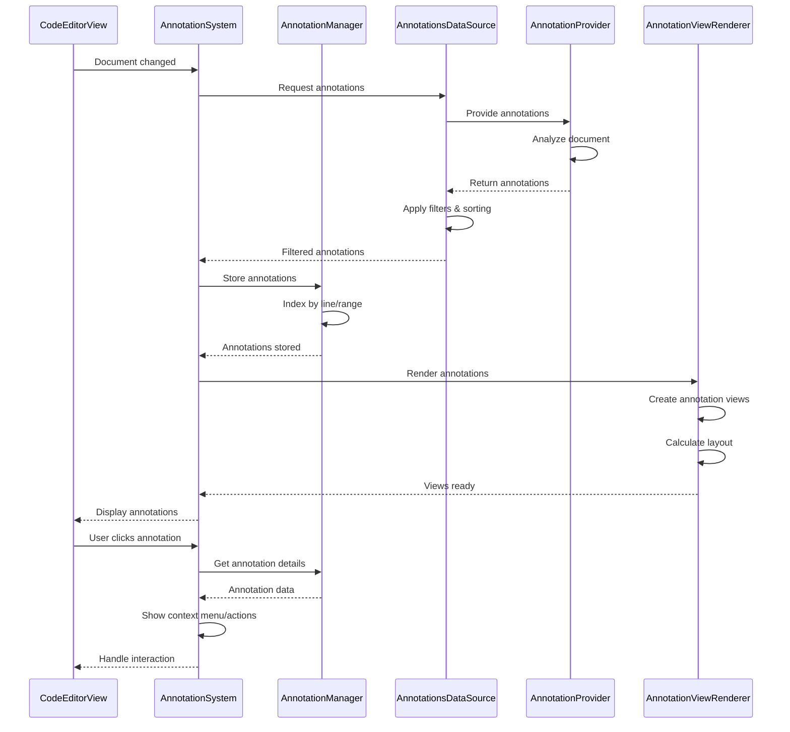

# Annotation System Detailed Architecture

This diagram shows the comprehensive annotation system that provides code annotations, diagnostics, and contextual information overlay capabilities.

```mermaid
classDiagram
    direction LR
    
    %% Row 1 - Core Annotation System
    class AnnotationSystem {
        <<system>>
        +annotationManager AnnotationManager
        +dataSource AnnotationsDataSource
        +viewRenderer AnnotationViewRenderer
        +eventProcessor AnnotationEventProcessor
        +initialize()
        +addAnnotation()
        +removeAnnotation()
        +updateAnnotation()
    }

    class AnnotationManager {
        <<manager>>
        +annotations [String: Annotation]
        +lineAnnotations [Int: [LineAnnotation]]
        +messageAnnotations [String: MessageLineAnnotation]
        +sortedAnnotations SortedAnnotationList
        +addAnnotation()
        +removeAnnotation()
        +getAnnotationsInRange()
    }

    class AnnotationsDataSource {
        <<data source>>
        +providers [AnnotationProvider]
        +cache AnnotationCache
        +filterManager AnnotationFilterManager
        +loadAnnotations()
        +registerProvider()
        +applyFilters()
    }

    %% Row 2 - Annotation Models
    class Annotation {
        <<annotation>>
        +id String
        +kind AnnotationKind
        +range NSRange
        +message String
        +severity AnnotationSeverity
        +source AnnotationSource
        +data AnnotationData
        +isVisible Bool
    }

    class AnnotationData {
        <<data>>
        +title String?
        +description String?
        +suggestions [FixSuggestion]
        +relatedInformation [RelatedInformation]
        +actions [AnnotationAction]
    }

    class LineAnnotation {
        <<line annotation>>
        +line Int
        +column Int?
        +text String
        +icon AnnotationIcon?
        +backgroundColor PlatformColor?
        +isFullLine Bool
    }

    class MessageLineAnnotation {
        <<message annotation>>
        +messageText String
        +attributedMessage NSAttributedString
        +messageType MessageType
        +isExpandable Bool
        +expandedContent String?
    }


    %% Row 3 - View System
    class AnnotationViewRenderer {
        <<renderer>>
        +viewCache AnnotationViewCache
        +layoutManager AnnotationLayoutManager
        +animationController AnnotationAnimationController
        +renderAnnotation()
        +updateAnnotationView()
        +layoutAnnotations()
    }

    class AnnotationView {
        <<view>>
        +annotation Annotation
        +contentView AnnotationContentView
        +backgroundView AnnotationBackgroundView
        +gestureRecognizers [UIGestureRecognizer]
        +configure()
        +updateAppearance()
        +handleTap()
    }

    class AnnotationContentView {
        <<content view>>
        +titleLabel UILabel
        +messageLabel UILabel
        +iconView UIImageView
        +actionsStackView UIStackView
        +setupLayout()
        +updateContent()
        +addAction()
    }

    class AnnotationLayoutManager {
        <<layout manager>>
        +positioningStrategy AnnotationPositioningStrategy
        +collisionDetector AnnotationCollisionDetector
        +spacingCalculator AnnotationSpacingCalculator
        +calculatePosition()
        +resolveCollisions()
        +optimizeLayout()
    }

    %% Row 4 - Annotation Providers

    class AnnotationProvider {
        <<protocol>>
        +providerName String
        +supportedKinds [AnnotationKind]
        +priority Int
        +provideAnnotations()
        +canProvideAnnotation()
        +validateAnnotation()
    }

    class DiagnosticAnnotationProvider {
        <<diagnostic provider>>
        +diagnosticsSource DiagnosticsSource
        +severityMapper SeverityMapper
        +messageFormatter DiagnosticMessageFormatter
        +provideAnnotations()
        +convertDiagnostic()
        +formatDiagnosticMessage()
    }

    class LSPAnnotationProvider {
        <<lsp provider>>
        +lspClient LSPClient
        +diagnosticProcessor LSPDiagnosticProcessor
        +codeActionProvider LSPCodeActionProvider
        +provideAnnotations()
        +processDiagnostics()
        +extractCodeActions()
    }

    class UserAnnotationProvider {
        <<user provider>>
        +bookmarkManager BookmarkManager
        +noteManager NoteManager
        +todoExtractor TodoCommentExtractor
        +provideAnnotations()
        +extractTodos()
        +loadBookmarks()
    }

    %% Row 5 - Interaction & Actions
    class AnnotationInteractionManager {
        <<interaction manager>>
        +gestureProcessor AnnotationGestureProcessor
        +contextMenuProvider AnnotationContextMenuProvider
        +hoverController AnnotationHoverController
        +handleAnnotationInteraction()
        +showContextMenu()
        +processHover()
    }

    class AnnotationAction {
        <<action>>
        +id String
        +title String
        +icon ActionIcon?
        +handler AnnotationActionHandler
        +isDestructive Bool
        +requiresConfirmation Bool
        +execute()
        +canExecute()
    }

    class FixSuggestion {
        <<fix suggestion>>
        +title String
        +description String
        +textEdits [TextEdit]
        +additionalChanges [DocumentChange]
        +confidence Double
        +apply()
        +preview()
    }

    %% Row 6 - Filtering & Caching
    class AnnotationFilterManager {
        <<filter manager>>
        +activeFilters [AnnotationFilter]
        +filterPresets [FilterPreset]
        +customFilters [CustomAnnotationFilter]
        +applyFilters()
        +addFilter()
        +createPreset()
    }

    class AnnotationFilter {
        <<filter>>
        +filterId String
        +name String
        +predicate AnnotationPredicate
        +isEnabled Bool
        +priority Int
        +apply()
        +matches()
    }

    class AnnotationCache {
        <<cache>>
        +cache LRUCache~String, [Annotation]~
        +persistentCache PersistentAnnotationCache
        +invalidationRules [CacheInvalidationRule]
        +cacheAnnotations()
        +getCachedAnnotations()
        +invalidateCache()
    }

    %% Row 7 - Theme System
    class AnnotationThemeManager {
        <<theme manager>>
        +currentTheme AnnotationTheme
        +lightTheme AnnotationTheme
        +darkTheme AnnotationTheme
        +customThemes [String: AnnotationTheme]
        +getTheme()
        +updateTheme()
        +createCustomTheme()
    }

    class AnnotationTheme {
        <<theme>>
        +name String
        +appearances [AnnotationKind: AnnotationAppearance]
        +defaultAppearance AnnotationAppearance
        +backgroundOverlay OverlayStyle
        +getAppearance()
    }

    class AnnotationAppearance {
        <<appearance>>
        +backgroundColor PlatformColor
        +borderColor PlatformColor
        +textColor PlatformColor
        +iconTint PlatformColor
        +borderWidth CGFloat
        +cornerRadius CGFloat
    }

    %% Row 8 - Enumerations
    class AnnotationKind {
        <<enumeration>>
        error
        warning
        info
        hint
        todo
        bookmark
        breakpoint
    }

    class AnnotationSeverity {
        <<enumeration>>
        error
        warning
        information
        hint
    }

    class AnnotationSource {
        <<enumeration>>
        compiler
        linter
        languageServer
        plugin
        user
    }

    %% Key Relationships
    AnnotationSystem --> AnnotationManager : manages
    AnnotationSystem --> AnnotationsDataSource : uses
    AnnotationSystem --> AnnotationViewRenderer : renders with
    AnnotationSystem --> AnnotationInteractionManager : handles interactions

    AnnotationManager --> Annotation : stores
    Annotation --> AnnotationKind : categorized by
    Annotation --> AnnotationSeverity : has
    Annotation --> AnnotationSource : originates from
    Annotation --> AnnotationData : contains

    Annotation <|-- LineAnnotation : specializes to
    Annotation <|-- MessageLineAnnotation : specializes to

    AnnotationViewRenderer --> AnnotationView : creates
    AnnotationViewRenderer --> AnnotationLayoutManager : uses
    AnnotationView --> AnnotationContentView : contains

    AnnotationsDataSource --> AnnotationProvider : uses
    AnnotationProvider <|-- DiagnosticAnnotationProvider : implements
    AnnotationProvider <|-- LSPAnnotationProvider : implements
    AnnotationProvider <|-- UserAnnotationProvider : implements

    AnnotationsDataSource --> AnnotationFilterManager : filters with
    AnnotationsDataSource --> AnnotationCache : caches with
    AnnotationFilterManager --> AnnotationFilter : applies

    AnnotationInteractionManager --> AnnotationAction : executes
    AnnotationData --> FixSuggestion : contains

    AnnotationViewRenderer --> AnnotationThemeManager : themes with
    AnnotationThemeManager --> AnnotationTheme : manages
    AnnotationTheme --> AnnotationAppearance : defines

    %% Styling - Dark mode friendly colors
    classDef system fill:#6366f120,stroke:#6366f1,stroke-width:3px,color:#fff
    classDef core fill:#8b5cf620,stroke:#8b5cf6,stroke-width:2px,color:#fff
    classDef annotation fill:#10b98120,stroke:#10b981,stroke-width:2px,color:#fff
    classDef view fill:#3b82f620,stroke:#3b82f6,stroke-width:2px,color:#fff
    classDef provider fill:#f59e0b20,stroke:#f59e0b,stroke-width:2px,color:#fff
    classDef interaction fill:#ec489920,stroke:#ec4899,stroke-width:2px,color:#fff
    classDef filter fill:#06b6d420,stroke:#06b6d4,stroke-width:2px,color:#fff
    classDef theme fill:#6b728020,stroke:#6b7280,stroke-width:2px,color:#fff
    classDef enum fill:#6b728020,stroke:#6b7280,stroke-width:2px,color:#fff

    class AnnotationSystem system
    class AnnotationManager core
    class AnnotationsDataSource core
    class AnnotationCache core
    class Annotation annotation
    class LineAnnotation annotation
    class MessageLineAnnotation annotation
    class CodeEditorViewAnnotation annotation
    class AnnotationData annotation
    class AnnotationView view
    class AnnotationContentView view
    class AnnotationViewRenderer view
    class AnnotationLayoutManager view
    class AnnotationProvider provider
    class DiagnosticAnnotationProvider provider
    class LSPAnnotationProvider provider
    class UserAnnotationProvider provider
    class AnnotationInteractionManager interaction
    class AnnotationAction interaction
    class FixSuggestion interaction
    class AnnotationFilterManager filter
    class AnnotationFilter filter
    class AnnotationThemeManager theme
    class AnnotationTheme theme
    class AnnotationAppearance theme
    class AnnotationKind enum
    class AnnotationSeverity enum
    class AnnotationSource enum
```

## Annotation System Flow

## Key Annotation Features

### 1. Multi-Source Annotation Support
- **Diagnostic Annotations**: Compiler errors, warnings, and hints
- **LSP Integration**: Language server diagnostics and code actions
- **User Annotations**: Bookmarks, notes, and custom markers
- **Plugin Support**: Third-party annotation providers

### 2. Rich Annotation Types
- **Line Annotations**: Simple line-based markers and messages
- **Message Annotations**: Detailed messages with formatting
- **Code Editor Annotations**: Complex overlay annotations
- **Contextual Information**: Related information and suggestions

### 3. Interactive Features
- **Click Actions**: Execute fixes and navigate to related code
- **Hover Information**: Show detailed information on hover
- **Context Menus**: Quick actions and options
- **Keyboard Navigation**: Navigate between annotations

### 4. Smart Filtering and Organization
- **Filter by Type**: Error, warning, info, custom categories
- **Filter by Source**: Compiler, LSP, user, plugins
- **Custom Filters**: User-defined filtering criteria
- **Sorting Options**: By severity, line, timestamp, source

### 5. Visual Customization
- **Theme Support**: Light/dark mode with custom themes
- **Appearance Configuration**: Colors, borders, shadows
- **Animation Support**: Smooth transitions and effects
- **Layout Options**: Positioning and collision resolution

### 6. Performance Optimizations
- **View Recycling**: Efficient view reuse for large documents
- **Incremental Updates**: Only update changed annotations
- **Lazy Loading**: Load annotations as needed
- **Caching**: Cache annotation data and views

## Benefits

1. **Comprehensive Feedback**: Multi-source annotation integration
2. **Rich Interactivity**: Clickable actions and contextual information
3. **Customizable**: Extensive theming and filtering options
4. **Performance**: Optimized for large documents with many annotations
5. **Extensible**: Plugin architecture for custom annotation types
6. **User-Friendly**: Intuitive interaction patterns and visual design