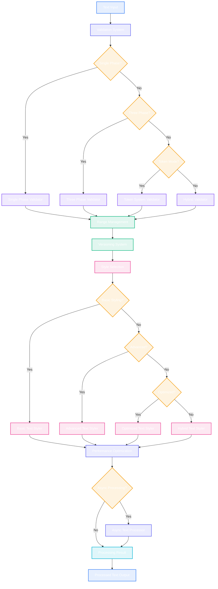

# Advanced Text Processing & Validation Pipeline

This diagram shows the comprehensive text processing and validation system that ensures robust text handling, range validation, and performance optimization.

```mermaid
classDiagram
    %% Core Text Processing System
    class AdvancedTextProcessor {
        +textStorage: NSTextStorage
        +validationSystem: TextValidationSystem
        +rangeManager: RangeManager
        +versioningSystem: TextVersioningSystem
        +styler: TextSystemStyler
        +processTextChange(change: TextChange) TextProcessingResult
        +validateText(text: String) ValidationResult
        +optimizeTextStorage()
        +synchronizeWithUI()
    }

    class TextValidationSystem {
        +singlePhaseValidator: SinglePhaseRangeValidator
        +threePhaseValidator: ThreePhaseRangeValidator
        +tokenValidator: TokenSystemValidator
        +contextValidator: ValidationContext
        +hybridValidator: HybridSyncAsyncValidator
        +validateText(text: String, mode: ValidationMode) ValidationResult
        +validateRange(range: NSRange, text: String) RangeValidationResult
        +validateTokens(tokens: [Token]) TokenValidationResult
    }

    class ValidationMode {
        &lt;&lt;enumeration&gt;&gt;
        singlePhase
        threePhase
        token
        hybrid
        context
    }

    %% Range Validation System
    class SinglePhaseRangeValidator {
        +validationRules: [ValidationRule]
        +errorCollector: ValidationErrorCollector
        +performanceMetrics: ValidationMetrics
        +validate(text: String) SinglePhaseResult
        +applyRules(text: String, rules: [ValidationRule]) [ValidationError]
        +optimizeValidation(text: String) OptimizedValidation
    }

    class ThreePhaseRangeValidator {
        +phase1Validator: PreProcessingValidator
        +phase2Validator: CoreValidator
        +phase3Validator: PostProcessingValidator
        +phaseCoordinator: PhaseCoordinator
        +validate(text: String) ThreePhaseResult
        +executePhase1(text: String) Phase1Result
        +executePhase2(phase1Result: Phase1Result) Phase2Result
        +executePhase3(phase2Result: Phase2Result) Phase3Result
    }

    class TokenSystemValidator {
        +tokenizer: AdvancedTokenizer
        +tokenRules: [TokenValidationRule]
        +semanticAnalyzer: SemanticTokenAnalyzer
        +syntaxValidator: SyntaxValidator
        +validate(text: String) TokenValidationResult
        +tokenize(text: String) [ValidatedToken]
        +validateSyntax(tokens: [ValidatedToken]) SyntaxValidationResult
        +analyzeSemantics(tokens: [ValidatedToken]) SemanticAnalysisResult
    }

    class ValidationContext {
        +documentContext: DocumentContext
        +languageContext: LanguageContext
        +editContext: EditingContext
        +performanceContext: PerformanceContext
        +createContext(document: TextDocument) ValidationContext
        +updateContext(change: TextChange)
        +optimizeForContext(validator: Validator) OptimizedValidator
    }

    class HybridSyncAsyncValidator {
        +syncValidator: SynchronousValidator
        +asyncValidator: AsynchronousValidator
        +validationQueue: ValidationQueue
        +resultMerger: ValidationResultMerger
        +validate(text: String, mode: HybridMode) HybridValidationResult
        +scheduleSyncValidation(text: String) SyncValidationResult
        +scheduleAsyncValidation(text: String) Future~AsyncValidationResult~
    }

    %% Range Management System
    class RangeManager {
        +versionedRanges: [VersionedRange]
        +rangeBuffer: RangeInvalidationBuffer
        +rangeCalculator: RangeCalculator
        +invalidationTracker: InvalidationTracker
        +createRange(location: Int, length: Int) VersionedRange
        +invalidateRange(range: NSRange, reason: InvalidationReason)
        +updateRanges(textChange: TextChange) [RangeUpdate]
        +optimizeRanges() RangeOptimizationResult
    }

    class VersionedRange {
        +range: NSRange
        +version: Int
        +isValid: Bool
        +invalidationReason: InvalidationReason?
        +metadata: RangeMetadata
        +updateVersion()
        +invalidate(reason: InvalidationReason)
        +validate(text: String) Bool
    }

    class RangeInvalidationBuffer {
        +pendingInvalidations: [PendingInvalidation]
        +batchProcessor: BatchInvalidationProcessor
        +invalidationScheduler: InvalidationScheduler
        +addInvalidation(range: NSRange, reason: InvalidationReason)
        +processPendingInvalidations()
        +batchInvalidations(threshold: Int) [BatchInvalidation]
        +flushBuffer()
    }

    class RangeCalculator {
        +textMetrics: TextMetricsCalculator
        +lineIndexer: LineIndexer
        +characterMapper: CharacterMapper
        +calculateRange(start: TextPosition, end: TextPosition) NSRange
        +calculateTextPosition(range: NSRange) (TextPosition, TextPosition)
        +adjustRangeForChange(range: NSRange, change: TextChange) NSRange
    }

    %% Text Versioning System
    class TextVersioningSystem {
        +versions: [TextVersion]
        +currentVersion: Int
        +versionHistory: VersionHistory
        +changeTracker: TextChangeTracker
        +createVersion(text: String) TextVersion
        +incrementVersion(changes: [TextChange]) TextVersion
        +rollbackToVersion(version: Int) RollbackResult
        +compareVersions(v1: Int, v2: Int) VersionDifference
    }

    class TextVersion {
        +versionNumber: Int
        +text: String
        +checksum: String
        +timestamp: Date
        +changes: [TextChange]
        +parentVersion: Int?
        +metadata: VersionMetadata
    }

    class VersionedContent {
        +content: String
        +version: Int
        +contentHash: String
        +associatedRanges: [VersionedRange]
        +updateContent(newContent: String)
        +validateConsistency() Bool
        +generateDiff(other: VersionedContent) ContentDifference
    }

    %% Text System Stylers
    class TextSystemStyler {
        &lt;&lt;protocol&gt;&gt;
        +styleText(text: String, context: StylingContext) StyledText
        +updateStyles(changes: [TextChange])
        +optimizeStyles(text: String) StylingOptimization
    }

    class BasicTextSystemStyler {
        +basicStyles: [TextStyle]
        +colorScheme: ColorScheme
        +fontManager: FontManager
        +styleText(text: String, context: StylingContext) StyledText
        +applyBasicStyles(text: String) StyledText
    }

    class AdvancedTextSystemStyler {
        +syntaxHighlighter: SyntaxHighlighter
        +semanticAnalyzer: SemanticStyleAnalyzer
        +contextualStyler: ContextualStyler
        +performanceOptimizer: StylingOptimizer
        +styleText(text: String, context: StylingContext) StyledText
        +applySyntaxHighlighting(text: String) StyledText
        +applySemanticStyles(text: String) StyledText
    }

    class OptimizedTextSystemStyler {
        +cacheManager: StyleCacheManager
        +incrementalStyler: IncrementalStyler
        +backgroundProcessor: BackgroundStylingProcessor
        +styleText(text: String, context: StylingContext) StyledText
        +incrementalStyle(changes: [TextChange]) IncrementalStyleResult
        +scheduleBackgroundStyling(text: String)
    }

    class HybridTextSystemStyler {
        +basicStyler: BasicTextSystemStyler
        +advancedStyler: AdvancedTextSystemStyler
        +optimizedStyler: OptimizedTextSystemStyler
        +styleCoordinator: StyleCoordinator
        +styleText(text: String, context: StylingContext) StyledText
        +selectOptimalStyler(context: StylingContext) TextSystemStyler
        +coordiateStyles(results: [StyledText]) StyledText
    }

    %% Validation Results and Types
    class ValidationResult {
        +isValid: Bool
        +errors: [ValidationError]
        +warnings: [ValidationWarning]
        +performance: ValidationPerformance
        +suggestions: [ValidationSuggestion]
        +metadata: ValidationMetadata
    }

    class ValidationError {
        +range: NSRange
        +severity: ErrorSeverity
        +message: String
        +errorCode: String
        +suggestions: [FixSuggestion]
        +relatedInformation: [RelatedInfo]
    }

    class TextChange {
        +range: NSRange
        +replacementText: String
        +changeType: TextChangeType
        +timestamp: Date
        +source: TextChangeSource
        +metadata: ChangeMetadata
    }

    class TextChangeType {
        &lt;&lt;enumeration&gt;&gt;
        insertion
        deletion
        replacement
        formatting
        move
        batch
    }

    %% Performance Optimization
    class TextProcessingOptimizer {
        +memoryOptimizer: MemoryOptimizer
        +performanceProfiler: TextProcessingProfiler
        +cacheManager: ProcessingCacheManager
        +asyncProcessor: AsyncTextProcessor
        +optimizeProcessing(text: String) OptimizationResult
        +profilePerformance(operation: ProcessingOperation) PerformanceProfile
        +manageCache(cacheOperation: CacheOperation)
    }

    class AsyncTextProcessor {
        +processingQueue: DispatchQueue
        +taskScheduler: ProcessingTaskScheduler
        +resultAggregator: AsyncResultAggregator
        +processAsync(text: String, operation: ProcessingOperation) Future~ProcessingResult~
        +scheduleProcessing(tasks: [ProcessingTask])
        +aggregateResults(results: [ProcessingResult]) AggregatedResult
    }

    %% Relationships
    AdvancedTextProcessor --> TextValidationSystem : validates with
    AdvancedTextProcessor --> RangeManager : manages ranges
    AdvancedTextProcessor --> TextVersioningSystem : versions with
    AdvancedTextProcessor --> TextSystemStyler : styles with

    TextValidationSystem --> SinglePhaseRangeValidator : uses
    TextValidationSystem --> ThreePhaseRangeValidator : uses
    TextValidationSystem --> TokenSystemValidator : uses
    TextValidationSystem --> ValidationContext : uses
    TextValidationSystem --> HybridSyncAsyncValidator : uses

    RangeManager --> VersionedRange : manages
    RangeManager --> RangeInvalidationBuffer : buffers with
    RangeManager --> RangeCalculator : calculates with

    TextVersioningSystem --> TextVersion : creates
    TextVersioningSystem --> VersionedContent : manages

    TextSystemStyler <|-- BasicTextSystemStyler : implements
    TextSystemStyler <|-- AdvancedTextSystemStyler : implements
    TextSystemStyler <|-- OptimizedTextSystemStyler : implements
    TextSystemStyler <|-- HybridTextSystemStyler : implements

    HybridTextSystemStyler --> BasicTextSystemStyler : delegates to
    HybridTextSystemStyler --> AdvancedTextSystemStyler : delegates to
    HybridTextSystemStyler --> OptimizedTextSystemStyler : delegates to

    ValidationResult --> ValidationError : contains
    AdvancedTextProcessor --> TextProcessingOptimizer : optimizes with
    TextProcessingOptimizer --> AsyncTextProcessor : processes async

    %% Styling - Dark mode friendly colors
    classDef processor fill:#6366f120,stroke:#6366f1,stroke-width:3px,color:#fff
    classDef validation fill:#8b5cf620,stroke:#8b5cf6,stroke-width:2px,color:#fff
    classDef range fill:#10b98120,stroke:#10b981,stroke-width:2px,color:#fff
    classDef version fill:#3b82f620,stroke:#3b82f6,stroke-width:2px,color:#fff
    classDef styler fill:#f59e0b20,stroke:#f59e0b,stroke-width:2px,color:#fff
    classDef result fill:#ec489920,stroke:#ec4899,stroke-width:2px,color:#fff
    classDef optimizer fill:#06b6d420,stroke:#06b6d4,stroke-width:2px,color:#fff
    classDef enum fill:#6b728020,stroke:#6b7280,stroke-width:2px,color:#fff

    class AdvancedTextProcessor processor
    class TextValidationSystem validation
    class SinglePhaseRangeValidator validation
    class ThreePhaseRangeValidator validation
    class TokenSystemValidator validation
    class ValidationContext validation
    class HybridSyncAsyncValidator validation
    class RangeManager range
    class VersionedRange range
    class RangeInvalidationBuffer range
    class RangeCalculator range
    class TextVersioningSystem version
    class TextVersion version
    class VersionedContent version
    class TextSystemStyler styler
    class BasicTextSystemStyler styler
    class AdvancedTextSystemStyler styler
    class OptimizedTextSystemStyler styler
    class HybridTextSystemStyler styler
    class ValidationResult result
    class ValidationError result
    class TextChange result
    class TextProcessingOptimizer optimizer
    class AsyncTextProcessor optimizer
    class ValidationMode enum
    class TextChangeType enum
```

## Text Processing Flow

## Key Text Processing Features

### 1. Multi-Phase Validation System
- **Single Phase**: Fast validation for simple text changes
- **Three Phase**: Comprehensive validation with pre/core/post processing
- **Token-Based**: Advanced syntax and semantic validation
- **Hybrid Sync/Async**: Balanced performance and thoroughness

### 2. Advanced Range Management
- **Versioned Ranges**: Track range validity across text changes
- **Invalidation Buffer**: Efficient batch processing of range updates
- **Smart Recalculation**: Optimize range updates for performance
- **Metadata Tracking**: Associate custom data with text ranges

### 3. Text Versioning System
- **Version History**: Complete change tracking and rollback capability
- **Content Integrity**: Checksum validation and consistency checking
- **Change Tracking**: Detailed change metadata and analysis
- **Diff Generation**: Efficient difference calculation between versions

### 4. Flexible Styling System
- **Multiple Styler Types**: Basic, advanced, optimized, and hybrid stylers
- **Contextual Styling**: Style based on document context and language
- **Performance Optimization**: Incremental styling and background processing
- **Cache Management**: Efficient style result caching and invalidation

### 5. Performance Optimization
- **Memory Management**: Efficient memory usage and cleanup
- **Async Processing**: Non-blocking text processing operations
- **Smart Caching**: Intelligent caching of processing results
- **Performance Profiling**: Built-in performance monitoring and optimization

### 6. Comprehensive Validation
- **Multi-Level Errors**: Errors, warnings, hints, and suggestions
- **Context-Aware**: Validation based on document and language context
- **Fix Suggestions**: Automatic fix recommendations
- **Performance Metrics**: Validation performance tracking

## Benefits

1. **Robust Text Handling**: Comprehensive validation and error handling
2. **High Performance**: Optimized for large documents and frequent changes
3. **Flexible Architecture**: Multiple validation and styling strategies
4. **Version Control**: Complete text history and change tracking
5. **Extensible**: Plugin architecture for custom validators and stylers
6. **Memory Efficient**: Smart caching and memory management