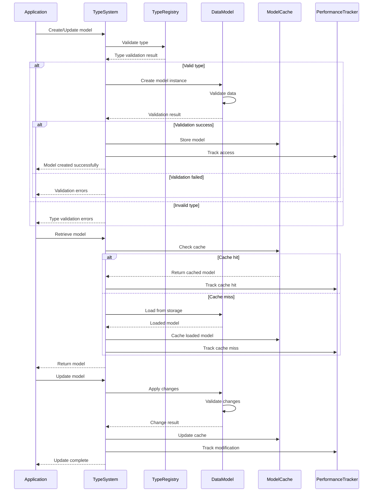

# Data Models & Type System Architecture

This diagram shows the comprehensive data models and type system that forms the foundation of the CodeEditorPlugin's data structures and type safety.

```mermaid
classDiagram
    direction LR
    
    %% Row 1 - Core Type System
    class TypeSystem {
        <<type system>>
        +typeRegistry TypeRegistry
        +typeValidator TypeValidator
        +typeInferencer TypeInferencer
        +typeConverter TypeConverter
        +registerType()
        +validateType()
        +inferType()
        +convertType()
    }

    class TypeRegistry {
        <<registry>>
        +registeredTypes [String: DataType]
        +primitiveTypes [PrimitiveType]
        +compositeTypes [CompositeType]
        +customTypes [CustomType]
        +register()
        +lookup()
        +getAllTypes()
    }

    class DataModel {
        <<protocol>>
        +modelId String
        +version Int
        +validate()
        +serialize()
        +deserialize()
    }

    %% Row 2 - Text Data Models
    class FoldableRegion {
        <<foldable region>>
        +range NSRange
        +isExpanded Bool
        +foldingType FoldingType
        +displayText String?
        +nestedRegions [FoldableRegion]
        +metadata RegionMetadata
        +expand()
        +collapse()
        +toggle()
    }

    class MarkedText {
        <<marked text>>
        +text String
        +markers [TextMarker]
        +attributes [NSAttributedString.Key: Any]
        +range NSRange
        +language String?
        +addMarker()
        +removeMarker()
        +getMarkersInRange()
    }

    class TextMarker {
        <<text marker>>
        +id String
        +range NSRange
        +type MarkerType
        +priority Int
        +data MarkerData
        +isVisible Bool
        +update()
        +intersects()
    }

    class MarkerData {
        <<marker data>>
        +title String?
        +description String?
        +color PlatformColor?
        +icon PlatformImage?
        +metadata [String: Any]
        +actions [MarkerAction]
    }

    %% Row 3 - Token System
    class Token {
        <<token>>
        +value String
        +type TokenType
        +range NSRange
        +syntaxKind SyntaxKind?
        +semanticInfo SemanticInfo?
        +parentToken Token?
        +childTokens [Token]
        +isValid Bool
    }

    class SemanticInfo {
        <<semantic info>>
        +symbolKind SymbolKind
        +scope Scope
        +references [TokenReference]
        +definition TokenDefinition?
        +typeInfo TypeInformation?
        +accessibility AccessibilityLevel
    }

    class TextSegment {
        <<text segment>>
        +content String
        +type NSTextSegmentType
        +range NSRange
        +attributes [NSAttributedString.Key: Any]
        +metadata SegmentMetadata
        +isEditable Bool
        +render()
    }

    class SegmentMetadata {
        <<segment metadata>>
        +language String?
        +syntaxHighlighted Bool
        +lastModified Date
        +userAnnotations [String]
        +systemTags [SystemTag]
        +performance SegmentPerformanceInfo
    }

    %% Row 4 - Versioning System
    class Versioned~T~ {
        <<versioned>>
        +content T
        +version Int
        +timestamp Date
        +checksum String
        +metadata VersionMetadata
        +updateContent()
        +rollback()
        +compare()
    }

    class VersionedContent {
        <<versioned content>>
        +textContent String
        +binaryContent Data?
        +encoding String.Encoding
        +lineEndings LineEndingType
        +contentType ContentType
        +size Int
        +hash String
    }

    class VersionMetadata {
        <<version metadata>>
        +author String?
        +message String?
        +tags [String]
        +parentVersion Int?
        +branchInfo BranchInfo?
        +changeType ChangeType
    }

    class VersionDifference {
        <<version difference>>
        +addedLines [LineChange]
        +removedLines [LineChange]
        +modifiedLines [LineChange]
        +statistics DifferenceStatistics
        +generatePatch()
    }

    %% Row 5 - Mutation System
    class RangeMutation {
        <<range mutation>>
        +originalRange NSRange
        +newRange NSRange
        +mutationType MutationType
        +textDelta String
        +timestamp Date
        +reversible Bool
        +apply()
        +reverse()
        +combine()
    }

    class MutationResult {
        <<mutation result>>
        +success Bool
        +resultingRange NSRange
        +affectedRanges [NSRange]
        +warnings [MutationWarning]
        +undo UndoOperation?
    }

    class RegionMetadata {
        <<region metadata>>
        +createdAt Date
        +modifiedAt Date
        +foldCount Int
        +userPreference UserFoldingPreference
        +persistentId String
        +tags [String]
    }

    %% Row 6 - Type Information System
    class TypeInformation {
        <<type information>>
        +typeName String
        +typeKind TypeKind
        +generics [GenericParameter]
        +constraints [TypeConstraint]
        +members [TypeMember]
        +inheritance [TypeInformation]
        +isNullable Bool
        +documentation String?
    }

    class GenericParameter {
        <<generic parameter>>
        +name String
        +constraints [TypeConstraint]
        +defaultType TypeInformation?
        +variance GenericVariance
    }

    class TypeConstraint {
        <<type constraint>>
        +constraintType ConstraintType
        +targetType TypeInformation
        +isOptional Bool
    }

    class TypeMember {
        <<type member>>
        +name String
        +memberType TypeInformation
        +accessibility AccessibilityLevel
        +isStatic Bool
        +isReadOnly Bool
        +documentation String?
    }

    %% Row 7 - Model Relationships & Performance
    class ModelRelationship {
        <<model relationship>>
        +sourceModel DataModel
        +targetModel DataModel
        +relationshipType RelationshipType
        +cardinality Cardinality
        +isOptional Bool
        +cascadeDelete Bool
    }

    class ModelPerformanceTracker {
        <<performance tracker>>
        +accessPatterns [AccessPattern]
        +memoryUsage MemoryUsageInfo
        +serializationMetrics SerializationMetrics
        +trackAccess()
        +analyzePerformance()
        +optimizeModel()
    }

    class ModelCache~T~ {
        <<model cache>>
        +cache LRUCache~String, T~
        +validator ModelValidator~T~
        +serializer ModelSerializer~T~
        +store()
        +retrieve()
        +invalidate()
        +compact()
    }

    %% Row 8 - Enumerations
    class FoldingType {
        <<enumeration>>
        braces
        indentation
        comment
        imports
        function
        class
        custom
    }

    class MarkerType {
        <<enumeration>>
        highlight
        error
        warning
        bookmark
        selection
        search
        annotation
        debugging
        custom
    }

    class TokenType {
        <<enumeration>>
        keyword
        identifier
        literal
        operator
        punctuation
        comment
        whitespace
        newline
        string
        number
        boolean
        regex
        custom
    }

    class SyntaxKind {
        <<enumeration>>
        declaration
        statement
        expression
        type
        modifier
        annotation
        import
        package
        unknown
    }

    class MutationType {
        <<enumeration>>
        insertion
        deletion
        replacement
        move
        split
        merge
        format
    }

    class NSTextSegmentType {
        <<enumeration>>
        standard
        whitespace
        tab
        lineBreak
        selection
        link
        attachment
        custom
    }

    class TypeKind {
        <<enumeration>>
        primitive
        struct
        class
        interface
        enum
        union
        function
        generic
        array
        dictionary
        optional
        unknown
    }

    class ContentType {
        <<enumeration>>
        plainText
        sourcecode
        markdown
        json
        xml
        yaml
        binary
        image
        custom
    }

    class LineEndingType {
        <<enumeration>>
        lf
        crlf
        cr
        mixed
        auto
    }

    class ChangeType {
        <<enumeration>>
        created
        modified
        deleted
        moved
        renamed
        merged
        conflicted
    }

    class RelationshipType {
        <<enumeration>>
        oneToOne
        oneToMany
        manyToOne
        manyToMany
        composition
        aggregation
        dependency
    }

    %% Key Relationships
    TypeSystem --> TypeRegistry : uses
    TypeSystem --> DataModel : manages
    
    FoldableRegion --> FoldingType : categorized by
    FoldableRegion --> RegionMetadata : contains
    
    MarkedText --> TextMarker : contains
    TextMarker --> MarkerType : categorized by
    TextMarker --> MarkerData : contains
    
    Token --> TokenType : categorized by
    Token --> SyntaxKind : has
    Token --> SemanticInfo : contains
    
    Versioned --> VersionMetadata : contains
    Versioned --> VersionedContent : wraps
    
    RangeMutation --> MutationType : categorized by
    RangeMutation --> MutationResult : produces
    
    TextSegment --> NSTextSegmentType : categorized by
    TextSegment --> SegmentMetadata : contains
    
    TypeInformation --> TypeKind : categorized by
    TypeInformation --> GenericParameter : contains
    TypeInformation --> TypeConstraint : has
    TypeInformation --> TypeMember : contains
    
    ModelRelationship --> RelationshipType : categorized by
    ModelRelationship --> DataModel : relates
    
    ModelPerformanceTracker --> DataModel : tracks
    ModelCache --> DataModel : caches

    %% Styling - Dark mode friendly colors
    classDef system fill:#6366f120,stroke:#6366f1,stroke-width:3px,color:#fff
    classDef model fill:#8b5cf620,stroke:#8b5cf6,stroke-width:2px,color:#fff
    classDef token fill:#10b98120,stroke:#10b981,stroke-width:2px,color:#fff
    classDef version fill:#3b82f620,stroke:#3b82f6,stroke-width:2px,color:#fff
    classDef mutation fill:#f59e0b20,stroke:#f59e0b,stroke-width:2px,color:#fff
    classDef type fill:#ec489920,stroke:#ec4899,stroke-width:2px,color:#fff
    classDef content fill:#06b6d420,stroke:#06b6d4,stroke-width:2px,color:#fff
    classDef perf fill:#6b728020,stroke:#6b7280,stroke-width:2px,color:#fff
    classDef enum fill:#6b728020,stroke:#6b7280,stroke-width:2px,color:#fff

    class TypeSystem system
    class TypeRegistry system
    class FoldableRegion model
    class MarkedText model
    class TextMarker model
    class MarkerData model
    class RegionMetadata model
    class TextSegment model
    class SegmentMetadata model
    class Token token
    class SemanticInfo token
    class TokenType token
    class SyntaxKind token
    class Versioned version
    class VersionedContent version
    class VersionMetadata version
    class VersionDifference version
    class RangeMutation mutation
    class MutationResult mutation
    class TypeInformation type
    class TypeKind type
    class GenericParameter type
    class TypeConstraint type
    class TypeMember type
    class ContentType content
    class LineEndingType content
    class ChangeType content
    class NSTextSegmentType content
    class ModelPerformanceTracker perf
    class ModelCache perf
    class FoldingType enum
    class MarkerType enum
    class MutationType enum
    class RelationshipType enum
```

## Data Model Interaction Flow

## Key Data Model Features

### 1. Comprehensive Type System
- **Type Registry**: Central type registration and validation
- **Type Inference**: Automatic type detection and inference
- **Generic Support**: Full generic type parameter support
- **Constraint System**: Type constraints and validation rules

### 2. Rich Text Models
- **Foldable Regions**: Hierarchical code folding with metadata
- **Marked Text**: Text with multiple markers and annotations
- **Token System**: Comprehensive tokenization with semantic info
- **Text Segments**: Typed text segments with attributes

### 3. Versioning and History
- **Generic Versioning**: Version any data type with full history
- **Content Management**: Rich content with encoding and metadata
- **Difference Tracking**: Detailed change analysis and patch generation
- **Rollback Support**: Full version rollback capabilities

### 4. Range and Mutation System
- **Range Mutations**: Comprehensive text range modification tracking
- **Mutation Types**: Full spectrum of text change operations
- **Reversible Operations**: Undo/redo support for all mutations
- **Batch Operations**: Efficient handling of multiple changes

### 5. Advanced Type Information
- **Rich Type Metadata**: Comprehensive type information with documentation
- **Generic Parameters**: Full generic type support with constraints
- **Member Information**: Detailed type member analysis
- **Inheritance Tracking**: Complete inheritance hierarchy support

### 6. Performance Optimization
- **Model Caching**: Efficient caching with LRU and validation
- **Performance Tracking**: Comprehensive performance monitoring
- **Access Pattern Analysis**: Optimize based on usage patterns
- **Memory Management**: Smart memory usage and cleanup

### 7. Content Type Support
- **Multiple Formats**: Support for various content types and encodings
- **Line Ending Handling**: Comprehensive line ending support
- **Binary Content**: Support for both text and binary content
- **MIME Type Integration**: Standard MIME type recognition

## Benefits

1. **Type Safety**: Comprehensive type validation and inference
2. **Rich Metadata**: Detailed information for all data models
3. **Version Control**: Complete history and change tracking
4. **Performance**: Optimized caching and access patterns
5. **Extensibility**: Easy addition of new data types and models
6. **Consistency**: Uniform data model patterns throughout framework