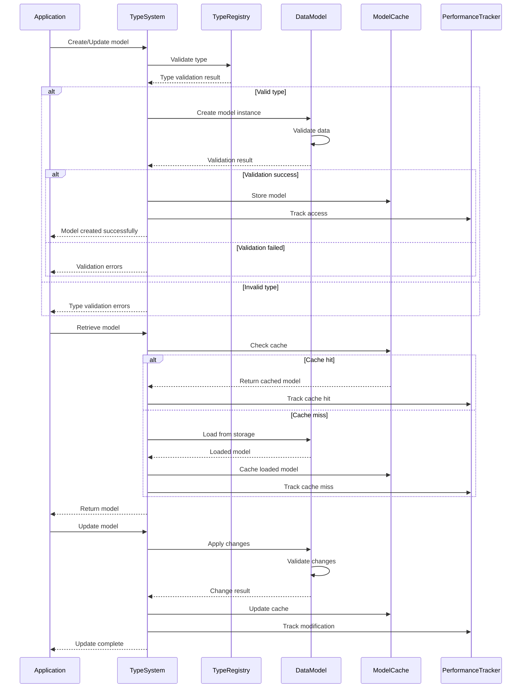

# Data Models & Type System Architecture

This diagram shows the comprehensive data models and type system that forms the foundation of the CodeEditorPlugin's data structures and type safety.

```mermaid
classDiagram
    %% Core Type System
    class TypeSystem {
        +typeRegistry: TypeRegistry
        +typeValidator: TypeValidator
        +typeInferencer: TypeInferencer
        +typeConverter: TypeConverter
        +registerType(type: DataType)
        +validateType(value: Any, expectedType: DataType) Bool
        +inferType(value: Any) DataType?
        +convertType(value: Any, targetType: DataType) Any?
    }

    class TypeRegistry {
        +registeredTypes: [String: DataType]
        +primitiveTypes: [PrimitiveType]
        +compositeTypes: [CompositeType]
        +customTypes: [CustomType]
        +register(type: DataType, identifier: String)
        +lookup(identifier: String) DataType?
        +getAllTypes() [DataType]
    }

    %% Core Data Models
    class FoldableRegion {
        +range: NSRange
        +isExpanded: Bool
        +foldingType: FoldingType
        +displayText: String?
        +nestedRegions: [FoldableRegion]
        +metadata: RegionMetadata
        +expand()
        +collapse()
        +toggle()
        +containsRange(range: NSRange) Bool
    }

    class FoldingType {
        &lt;&lt;enumeration&gt;&gt;
        braces
        indentation
        comment
        imports
        function
        class
        custom(type: String)
    }

    class RegionMetadata {
        +createdAt: Date
        +modifiedAt: Date
        +foldCount: Int
        +userPreference: UserFoldingPreference
        +persistentId: String
        +tags: [String]
    }

    class MarkedText {
        +text: String
        +markers: [TextMarker]
        +attributes: [NSAttributedString.Key: Any]
        +range: NSRange
        +language: String?
        +addMarker(marker: TextMarker)
        +removeMarker(id: String)
        +getMarkersInRange(range: NSRange) [TextMarker]
        +applyAttributes(attributes: [NSAttributedString.Key: Any])
    }

    class TextMarker {
        +id: String
        +range: NSRange
        +type: MarkerType
        +priority: Int
        +data: MarkerData
        +isVisible: Bool
        +update(range: NSRange)
        +intersects(range: NSRange) Bool
    }

    class MarkerType {
        &lt;&lt;enumeration&gt;&gt;
        highlight
        error
        warning
        bookmark
        selection
        search
        annotation
        debugging
        custom(type: String)
    }

    class MarkerData {
        +title: String?
        +description: String?
        +color: PlatformColor?
        +icon: PlatformImage?
        +metadata: [String: Any]
        +actions: [MarkerAction]
    }

    %% Token System
    class Token {
        +value: String
        +type: TokenType
        +range: NSRange
        +syntaxKind: SyntaxKind?
        +semanticInfo: SemanticInfo?
        +parentToken: Token?
        +childTokens: [Token]
        +isValid: Bool
    }

    class TokenType {
        &lt;&lt;enumeration&gt;&gt;
        keyword
        identifier
        literal
        operator
        punctuation
        comment
        whitespace
        newline
        string
        number
        boolean
        regex
        custom(type: String)
    }

    class SyntaxKind {
        &lt;&lt;enumeration&gt;&gt;
        declaration
        statement
        expression
        type
        modifier
        annotation
        import
        package
        unknown
    }

    class SemanticInfo {
        +symbolKind: SymbolKind
        +scope: Scope
        +references: [TokenReference]
        +definition: TokenDefinition?
        +typeInfo: TypeInformation?
        +accessibility: AccessibilityLevel
    }

    %% Versioning System
    class Versioned~T~ {
        +content: T
        +version: Int
        +timestamp: Date
        +checksum: String
        +metadata: VersionMetadata
        +updateContent(newContent: T)
        +rollback(version: Int) Bool
        +compare(other: Versioned~T~) VersionDifference
    }

    class VersionedContent {
        +textContent: String
        +binaryContent: Data?
        +encoding: String.Encoding
        +lineEndings: LineEndingType
        +contentType: ContentType
        +size: Int
        +hash: String
    }

    class VersionMetadata {
        +author: String?
        +message: String?
        +tags: [String]
        +parentVersion: Int?
        +branchInfo: BranchInfo?
        +changeType: ChangeType
    }

    class VersionDifference {
        +addedLines: [LineChange]
        +removedLines: [LineChange]
        +modifiedLines: [LineChange]
        +statistics: DifferenceStatistics
        +generatePatch() String
    }

    %% Range and Mutation System
    class RangeMutation {
        +originalRange: NSRange
        +newRange: NSRange
        +mutationType: MutationType
        +textDelta: String
        +timestamp: Date
        +reversible: Bool
        +apply(text: inout String) MutationResult
        +reverse() RangeMutation?
        +combine(with: RangeMutation) RangeMutation?
    }

    class MutationType {
        &lt;&lt;enumeration&gt;&gt;
        insertion
        deletion
        replacement
        move
        split
        merge
        format
    }

    class MutationResult {
        +success: Bool
        +resultingRange: NSRange
        +affectedRanges: [NSRange]
        +warnings: [MutationWarning]
        +undo: UndoOperation?
    }

    %% Text Segment System
    class NSTextSegmentType {
        &lt;&lt;enumeration&gt;&gt;
        standard
        whitespace
        tab
        lineBreak
        selection
        link
        attachment
        custom(type: String)
    }

    class TextSegment {
        +content: String
        +type: NSTextSegmentType
        +range: NSRange
        +attributes: [NSAttributedString.Key: Any]
        +metadata: SegmentMetadata
        +isEditable: Bool
        +render() NSAttributedString
    }

    class SegmentMetadata {
        +language: String?
        +syntaxHighlighted: Bool
        +lastModified: Date
        +userAnnotations: [String]
        +systemTags: [SystemTag]
        +performance: SegmentPerformanceInfo
    }

    %% Type Information System
    class TypeInformation {
        +typeName: String
        +typeKind: TypeKind
        +generics: [GenericParameter]
        +constraints: [TypeConstraint]
        +members: [TypeMember]
        +inheritance: [TypeInformation]
        +isNullable: Bool
        +documentation: String?
    }

    class TypeKind {
        &lt;&lt;enumeration&gt;&gt;
        primitive
        struct
        class
        interface
        enum
        union
        function
        generic
        array
        dictionary
        optional
        unknown
    }

    class GenericParameter {
        +name: String
        +constraints: [TypeConstraint]
        +defaultType: TypeInformation?
        +variance: GenericVariance
    }

    class TypeConstraint {
        +constraintType: ConstraintType
        +targetType: TypeInformation
        +isOptional: Bool
    }

    class TypeMember {
        +name: String
        +memberType: TypeInformation
        +accessibility: AccessibilityLevel
        +isStatic: Bool
        +isReadOnly: Bool
        +documentation: String?
    }

    %% Content Management
    class ContentType {
        &lt;&lt;enumeration&gt;&gt;
        plainText
        sourcecode
        markdown
        json
        xml
        yaml
        binary
        image
        custom(mimeType: String)
    }

    class LineEndingType {
        &lt;&lt;enumeration&gt;&gt;
        lf
        crlf
        cr
        mixed
        auto
    }

    class ChangeType {
        &lt;&lt;enumeration&gt;&gt;
        created
        modified
        deleted
        moved
        renamed
        merged
        conflicted
    }

    %% Model Relationships and Dependencies
    class ModelRelationship {
        +sourceModel: DataModel
        +targetModel: DataModel
        +relationshipType: RelationshipType
        +cardinality: Cardinality
        +isOptional: Bool
        +cascadeDelete: Bool
    }

    class RelationshipType {
        &lt;&lt;enumeration&gt;&gt;
        oneToOne
        oneToMany
        manyToOne
        manyToMany
        composition
        aggregation
        dependency
    }

    class DataModel {
        &lt;&lt;protocol&gt;&gt;
        +modelId: String
        +version: Int
        +validate() ValidationResult
        +serialize() Data
        +deserialize(data: Data) Self?
    }

    %% Performance and Optimization
    class ModelPerformanceTracker {
        +accessPatterns: [AccessPattern]
        +memoryUsage: MemoryUsageInfo
        +serializationMetrics: SerializationMetrics
        +trackAccess(model: DataModel, operation: ModelOperation)
        +analyzePerformance() PerformanceReport
        +optimizeModel(model: DataModel) OptimizationSuggestions
    }

    class ModelCache~T~ {
        +cache: LRUCache~String, T~
        +validator: ModelValidator~T~
        +serializer: ModelSerializer~T~
        +store(key: String, model: T)
        +retrieve(key: String) T?
        +invalidate(key: String)
        +compact()
    }

    %% Relationships
    TypeSystem --> TypeRegistry : uses
    TypeSystem --> TypeValidator : validates with
    TypeSystem --> TypeInferencer : infers with

    FoldableRegion --> FoldingType : categorized by
    FoldableRegion --> RegionMetadata : contains
    FoldableRegion --> FoldableRegion : contains nested

    MarkedText --> TextMarker : contains
    TextMarker --> MarkerType : categorized by
    TextMarker --> MarkerData : contains

    Token --> TokenType : categorized by
    Token --> SyntaxKind : has
    Token --> SemanticInfo : contains
    Token --> Token : parent/child

    Versioned --> VersionMetadata : contains
    Versioned --> VersionedContent : wraps
    VersionMetadata --> ChangeType : categorized by

    RangeMutation --> MutationType : categorized by
    RangeMutation --> MutationResult : produces

    TextSegment --> NSTextSegmentType : categorized by
    TextSegment --> SegmentMetadata : contains

    TypeInformation --> TypeKind : categorized by
    TypeInformation --> GenericParameter : contains
    TypeInformation --> TypeConstraint : has
    TypeInformation --> TypeMember : contains

    ModelRelationship --> RelationshipType : categorized by
    ModelRelationship --> DataModel : relates

    ModelPerformanceTracker --> DataModel : tracks
    ModelCache --> DataModel : caches

    %% Styling - Dark mode friendly colors
    classDef system fill:#6366f120,stroke:#6366f1,stroke-width:3px,color:#fff
    classDef model fill:#8b5cf620,stroke:#8b5cf6,stroke-width:2px,color:#fff
    classDef token fill:#10b98120,stroke:#10b981,stroke-width:2px,color:#fff
    classDef version fill:#3b82f620,stroke:#3b82f6,stroke-width:2px,color:#fff
    classDef mutation fill:#f59e0b20,stroke:#f59e0b,stroke-width:2px,color:#fff
    classDef type fill:#ec489920,stroke:#ec4899,stroke-width:2px,color:#fff
    classDef content fill:#06b6d420,stroke:#06b6d4,stroke-width:2px,color:#fff
    classDef perf fill:#6b728020,stroke:#6b7280,stroke-width:2px,color:#fff
    classDef enum fill:#6b728020,stroke:#6b7280,stroke-width:2px,color:#fff

    class TypeSystem,TypeRegistry system
    class FoldableRegion,MarkedText,TextMarker,MarkerData,RegionMetadata,TextSegment,SegmentMetadata model
    class Token,SemanticInfo,TokenType,SyntaxKind token
    class Versioned,VersionedContent,VersionMetadata,VersionDifference version
    class RangeMutation,MutationResult mutation
    class TypeInformation,TypeKind,GenericParameter,TypeConstraint,TypeMember type
    class ContentType,LineEndingType,ChangeType,NSTextSegmentType content
    class ModelPerformanceTracker,ModelCache perf
    class FoldingType,MarkerType,MutationType,RelationshipType enum
```

## Data Model Interaction Flow



## Key Data Model Features

### 1. Comprehensive Type System
- **Type Registry**: Central type registration and validation
- **Type Inference**: Automatic type detection and inference
- **Generic Support**: Full generic type parameter support
- **Constraint System**: Type constraints and validation rules

### 2. Rich Text Models
- **Foldable Regions**: Hierarchical code folding with metadata
- **Marked Text**: Text with multiple markers and annotations
- **Token System**: Comprehensive tokenization with semantic info
- **Text Segments**: Typed text segments with attributes

### 3. Versioning and History
- **Generic Versioning**: Version any data type with full history
- **Content Management**: Rich content with encoding and metadata
- **Difference Tracking**: Detailed change analysis and patch generation
- **Rollback Support**: Full version rollback capabilities

### 4. Range and Mutation System
- **Range Mutations**: Comprehensive text range modification tracking
- **Mutation Types**: Full spectrum of text change operations
- **Reversible Operations**: Undo/redo support for all mutations
- **Batch Operations**: Efficient handling of multiple changes

### 5. Advanced Type Information
- **Rich Type Metadata**: Comprehensive type information with documentation
- **Generic Parameters**: Full generic type support with constraints
- **Member Information**: Detailed type member analysis
- **Inheritance Tracking**: Complete inheritance hierarchy support

### 6. Performance Optimization
- **Model Caching**: Efficient caching with LRU and validation
- **Performance Tracking**: Comprehensive performance monitoring
- **Access Pattern Analysis**: Optimize based on usage patterns
- **Memory Management**: Smart memory usage and cleanup

### 7. Content Type Support
- **Multiple Formats**: Support for various content types and encodings
- **Line Ending Handling**: Comprehensive line ending support
- **Binary Content**: Support for both text and binary content
- **MIME Type Integration**: Standard MIME type recognition

## Benefits

1. **Type Safety**: Comprehensive type validation and inference
2. **Rich Metadata**: Detailed information for all data models
3. **Version Control**: Complete history and change tracking
4. **Performance**: Optimized caching and access patterns
5. **Extensibility**: Easy addition of new data types and models
6. **Consistency**: Uniform data model patterns throughout framework