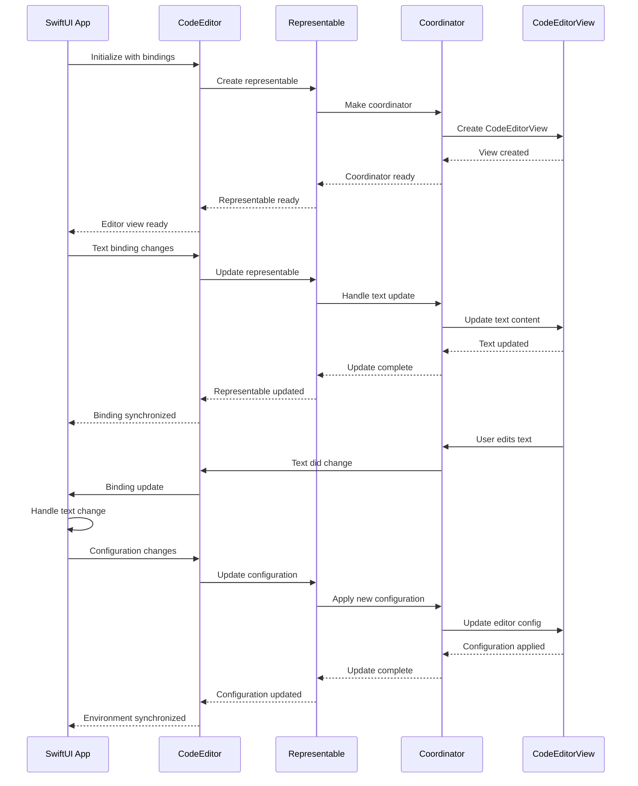

# SwiftUI Integration Complete Ecosystem

This diagram shows the comprehensive SwiftUI integration ecosystem that provides seamless integration between the CodeEditorPlugin framework and SwiftUI applications.

```mermaid
classDiagram
    direction LR
    
    %% Row 1 - Core Integration System
    class SwiftUIIntegrationSystem {
        <<integration system>>
        +codeEditor CodeEditor
        +representableHelper CodeEditorRepresentableHelper
        +environmentManager SwiftUIEnvironmentManager
        +modifierSystem ViewModifierSystem
        +bindingSystem SwiftUIBindingSystem
        +integrateWithSwiftUI()
        +setupEnvironment()
        +handleViewUpdates()
    }

    class CodeEditor {
        <<SwiftUI View>>
        @Binding text String
        @State configuration EditorConfiguration
        @State isEditing Bool
        @State selectionRange NSRange
        +language LanguageConfig?
        +onTextChange Closure?
        +onSelectionChange Closure?
        +body some View
    }

    class CodeEditorRepresentableHelper {
        <<representable helper>>
        +platformDetector PlatformDetector
        +viewFactory SwiftUIViewFactory
        +updateCoordinator ViewUpdateCoordinator
        +lifecycleManager ViewLifecycleManager
        +createRepresentable()
        +handleViewUpdate()
        +manageViewLifecycle()
    }

    %% Row 2 - Platform Representables
    class CodeEditorRepresentable {
        <<representable protocol>>
        +configuration EditorConfiguration
        +text Binding<String>
        +coordinator Coordinator
        +makeCoordinator()
    }

    class AppKitCodeEditorRepresentable {
        <<NSViewRepresentable>>
        +makeNSView()
        +updateNSView()
        +dismantleNSView()
        +handleMacOSSpecificUpdates()
    }

    class UIKitCodeEditorRepresentable {
        <<UIViewRepresentable>>
        +makeUIView()
        +updateUIView()
        +dismantleUIView()
        +handleiOSSpecificUpdates()
    }

    class SwiftUIViewFactory {
        <<view factory>>
        +createAppKitRepresentable()
        +createUIKitRepresentable()
        +createCatalystRepresentable()
        +configureRepresentable()
    }

    %% Row 3 - Coordination System
    class CodeEditorCoordinator {
        <<coordinator>>
        +parent CodeEditor
        +codeEditorView CodeEditorView
        +bindingManager SwiftUIBindingManager
        +eventBridge SwiftUIEventBridge
        +setupCodeEditor()
        +textDidChange()
        +selectionDidChange()
        +configurationDidChange()
    }

    class SwiftUIBindingManager {
        <<binding manager>>
        +textBinding Binding<String>
        +configurationBinding Binding<EditorConfiguration>
        +selectionBinding Binding<NSRange>
        +editingBinding Binding<Bool>
        +syncBindings()
        +updateBinding()
        +observeChanges()
    }

    class SwiftUIEventBridge {
        <<event bridge>>
        +swiftUICallbacks [EventType: SwiftUICallback]
        +codeEditorEvents [CodeEditorEvent]
        +bridgeEvent()
        +registerCallback()
        +handleCodeEditorEvent()
    }

    class ViewUpdateCoordinator {
        <<update coordinator>>
        +pendingUpdates [ViewUpdate]
        +updateScheduler ViewUpdateScheduler
        +animationCoordinator SwiftUIAnimationCoordinator
        +scheduleUpdate()
        +processUpdates()
        +coordinateAnimations()
    }

    %% Row 4 - Environment System
    class SwiftUIEnvironmentManager {
        <<environment manager>>
        +environmentValues SwiftUIEnvironmentValues
        +configurationKey ConfigurationEnvironmentKey
        +themeKey ThemeEnvironmentKey
        +languageKey LanguageEnvironmentKey
        +setupEnvironment()
        +updateEnvironment()
        +propagateEnvironmentChanges()
    }

    class SwiftUIEnvironmentValues {
        <<environment values>>
        +codeEditorConfiguration EditorConfiguration
        +codeEditorTheme EditorTheme
        +codeEditorLanguage LanguageConfig?
        +codeEditorState EditorState
        +isDebugMode Bool
        +accessibilityConfiguration AccessibilityConfiguration
    }

    class ConfigurationEnvironmentKey {
        <<EnvironmentKey>>
        +static defaultValue EditorConfiguration
    }

    class ThemeEnvironmentKey {
        <<EnvironmentKey>>
        +static defaultValue EditorTheme
    }

    class LanguageEnvironmentKey {
        <<EnvironmentKey>>
        +static defaultValue LanguageConfig?
    }

    %% Row 5 - View Modifier System
    class ViewModifierSystem {
        <<modifier system>>
        +modifiers [CodeEditorViewModifier]
        +modifierChain ViewModifierChain
        +modifierProcessor ModifierProcessor
        +applyModifiers()
        +registerModifier()
        +processModifierChain()
    }

    class CodeEditorViewModifier {
        <<modifier protocol>>
        +body()
        +modifierName String
        +priority Int
    }

    class LanguageViewModifier {
        <<language modifier>>
        +language LanguageConfig
        +body()
    }

    class ThemeViewModifier {
        <<theme modifier>>
        +theme EditorTheme
        +body()
    }

    class ConfigurationViewModifier {
        <<configuration modifier>>
        +configuration EditorConfiguration
        +body()
    }

    class ReadOnlyViewModifier {
        <<readonly modifier>>
        +isReadOnly Bool
        +body()
    }

    class DebugModeViewModifier {
        <<debug modifier>>
        +isDebugMode Bool
        +showDebugOverlay Bool
        +body()
    }

    %% Row 6 - State Management
    class SwiftUIStateManager {
        <<state manager>>
        +editorState EditorState
        +bindingObserver StateBindingObserver
        +stateValidator StateValidator
        +changeNotifier StateChangeNotifier
        +manageState()
        +updateState()
        +validateState()
    }

    class EditorState {
        <<editor state>>
        +text String
        +selection NSRange
        +isEditing Bool
        +language LanguageConfig?
        +configuration EditorConfiguration
        +hasUnsavedChanges Bool
        +version Int
    }

    class StateBindingObserver {
        <<binding observer>>
        +observedBindings [StateBinding]
        +changeHandlers [StateChangeHandler]
        +observeBinding()
        +removeObserver()
        +notifyChanges()
    }

    %% Row 7 - Animation & Accessibility
    class SwiftUIAnimationCoordinator {
        <<animation coordinator>>
        +animationPresets [AnimationPreset]
        +transitionManager TransitionManager
        +timingCurves [TimingCurve]
        +animateChanges()
        +coordinateTransitions()
        +createCustomAnimation()
    }

    class AnimationPreset {
        <<animation preset>>
        +name String
        +animation Animation
        +duration Double
        +curve AnimationCurve
        +apply()
    }

    class SwiftUIAccessibilityManager {
        <<accessibility manager>>
        +accessibilityConfiguration AccessibilityConfiguration
        +voiceOverSupport VoiceOverSupport
        +keyboardNavigation KeyboardNavigationSupport
        +setupAccessibility()
        +updateAccessibilityLabels()
        +handleAccessibilityActions()
    }

    class AccessibilityConfiguration {
        <<accessibility config>>
        +isVoiceOverEnabled Bool
        +dynamicTypeSize DynamicTypeSize
        +reduceMotion Bool
        +increaseContrast Bool
        +customLabels [String: String]
        +customActions [AccessibilityAction]
    }

    %% Row 8 - Development Support
    class SwiftUIPreviewSupport {
        <<preview support>>
        +previewProviders [PreviewProvider]
        +mockDataManager MockDataManager
        +previewConfigurations [PreviewConfiguration]
        +createPreview()
        +generateMockData()
        +setupPreviewEnvironment()
    }

    class PreviewProvider {
        <<preview protocol>>
        +static previews some View
        +static previewDevice PreviewDevice?
        +static previewDisplayName String?
    }

    class CodeEditorPreview {
        <<code editor preview>>
        +static previews some View
        +static sampleCode String
        +static configurations [EditorConfiguration]
    }

    class SwiftUIExtensionManager {
        <<extension manager>>
        +customViews [CustomSwiftUIView]
        +viewExtensions [SwiftUIViewExtension]
        +modifierExtensions [SwiftUIModifierExtension]
        +registerCustomView()
        +registerExtension()
        +applyExtensions()
    }

    %% Key Relationships
    SwiftUIIntegrationSystem --> CodeEditor : manages
    SwiftUIIntegrationSystem --> CodeEditorRepresentableHelper : uses
    SwiftUIIntegrationSystem --> SwiftUIEnvironmentManager : manages environment
    SwiftUIIntegrationSystem --> ViewModifierSystem : applies modifiers
    
    CodeEditor --> CodeEditorRepresentable : uses
    CodeEditor --> CodeEditorCoordinator : coordinates with
    
    CodeEditorRepresentable <|-- AppKitCodeEditorRepresentable : implements
    CodeEditorRepresentable <|-- UIKitCodeEditorRepresentable : implements
    
    CodeEditorCoordinator --> SwiftUIBindingManager : manages bindings
    CodeEditorCoordinator --> SwiftUIEventBridge : bridges events
    
    CodeEditorRepresentableHelper --> SwiftUIViewFactory : creates views
    CodeEditorRepresentableHelper --> ViewUpdateCoordinator : coordinates updates
    
    SwiftUIEnvironmentManager --> SwiftUIEnvironmentValues : manages
    SwiftUIEnvironmentManager --> ConfigurationEnvironmentKey : uses
    SwiftUIEnvironmentManager --> ThemeEnvironmentKey : uses
    SwiftUIEnvironmentManager --> LanguageEnvironmentKey : uses
    
    ViewModifierSystem --> CodeEditorViewModifier : applies
    CodeEditorViewModifier <|-- LanguageViewModifier : implements
    CodeEditorViewModifier <|-- ThemeViewModifier : implements
    CodeEditorViewModifier <|-- ConfigurationViewModifier : implements
    CodeEditorViewModifier <|-- ReadOnlyViewModifier : implements
    CodeEditorViewModifier <|-- DebugModeViewModifier : implements
    
    SwiftUIStateManager --> EditorState : manages
    SwiftUIStateManager --> StateBindingObserver : observes with
    
    SwiftUIAnimationCoordinator --> AnimationPreset : uses
    SwiftUIAccessibilityManager --> AccessibilityConfiguration : uses
    
    SwiftUIPreviewSupport --> PreviewProvider : manages
    PreviewProvider <|-- CodeEditorPreview : implements
    
    SwiftUIIntegrationSystem --> SwiftUIExtensionManager : extends with

    %% Styling - Dark mode friendly colors
    classDef system fill:#007AFF20,stroke:#007AFF,stroke-width:3px,color:#1D1D1F
    classDef swiftui fill:#AF52DE20,stroke:#AF52DE,stroke-width:2px,color:#1D1D1F
    classDef representable fill:#34C75920,stroke:#34C759,stroke-width:2px,color:#1D1D1F
    classDef coordinator fill:#007AFF20,stroke:#007AFF,stroke-width:2px,color:#1D1D1F
    classDef environment fill:#FF950020,stroke:#FF9500,stroke-width:2px,color:#1D1D1F
    classDef modifier fill:#FF3B3020,stroke:#FF3B30,stroke-width:2px,color:#1D1D1F
    classDef state fill:#007AFF20,stroke:#007AFF,stroke-width:2px,color:#1D1D1F
    classDef support fill:#8E8E9320,stroke:#8E8E93,stroke-width:2px,color:#1D1D1F

    class SwiftUIIntegrationSystem system
    class CodeEditor swiftui
    class CodeEditorRepresentable representable
    class AppKitCodeEditorRepresentable representable
    class UIKitCodeEditorRepresentable representable
    class CodeEditorCoordinator coordinator
    class SwiftUIBindingManager coordinator
    class SwiftUIEventBridge coordinator
    class CodeEditorRepresentableHelper coordinator
    class SwiftUIViewFactory coordinator
    class ViewUpdateCoordinator coordinator
    class SwiftUIEnvironmentManager environment
    class SwiftUIEnvironmentValues environment
    class ConfigurationEnvironmentKey environment
    class ThemeEnvironmentKey environment
    class LanguageEnvironmentKey environment
    class ViewModifierSystem modifier
    class CodeEditorViewModifier modifier
    class LanguageViewModifier modifier
    class ThemeViewModifier modifier
    class ConfigurationViewModifier modifier
    class ReadOnlyViewModifier modifier
    class DebugModeViewModifier modifier
    class SwiftUIStateManager state
    class EditorState state
    class StateBindingObserver state
    class SwiftUIAnimationCoordinator support
    class SwiftUIAccessibilityManager support
    class SwiftUIPreviewSupport support
    class SwiftUIExtensionManager support
    class AnimationPreset support
    class AccessibilityConfiguration support
    class PreviewProvider support
    class CodeEditorPreview support
```



## SwiftUI Integration Flow



## Key SwiftUI Integration Features

### 1. Seamless SwiftUI Integration
- **Native SwiftUI View**: CodeEditor acts as a true SwiftUI view
- **Binding Support**: Full two-way binding with SwiftUI state
- **Environment Integration**: Uses SwiftUI environment system
- **Modifier Support**: Custom view modifiers for configuration

### 2. Platform-Specific Representables
- **AppKit Integration**: Native macOS NSViewRepresentable
- **UIKit Integration**: Native iOS/iPadOS UIViewRepresentable
- **Mac Catalyst**: Specialized Catalyst representable
- **Cross-Platform Coordination**: Unified behavior across platforms

### 3. Advanced State Management
- **Binding Synchronization**: Automatic sync between SwiftUI and CodeEditor
- **State Validation**: Comprehensive state validation and consistency
- **Change Observation**: Reactive updates to state changes
- **Version Tracking**: State versioning and history

### 4. Rich Environment System
- **Environment Values**: Custom environment values for configuration
- **Theme Integration**: Automatic theme propagation through environment
- **Language Support**: Language configuration via environment
- **Accessibility**: Full accessibility environment integration

### 5. View Modifier Ecosystem
- **Fluent API**: Chainable view modifiers for configuration
- **Custom Modifiers**: Extensible modifier system
- **Priority System**: Modifier application order management
- **Animation Support**: Smooth transitions for modifier changes

### 6. Animation and Transitions
- **SwiftUI Animations**: Native SwiftUI animation support
- **Custom Transitions**: Specialized code editor transitions
- **Performance Optimized**: Animations optimized for text editing
- **Accessibility Aware**: Respects reduce motion preferences

### 7. Development Support
- **Preview Support**: Comprehensive SwiftUI preview integration
- **Mock Data**: Rich mock data for development and testing
- **Debug Mode**: Special debug overlays and information
- **Extension System**: Plugin architecture for custom SwiftUI components

## Usage Examples

### Basic Implementation
```swift
struct ContentView: View {
    @State private var code = "// Hello World"
    @State private var config = EditorConfiguration.default
    
    var body: some View {
        CodeEditor(text: $code)
            .codeLanguage(.swift)
            .codeTheme(.xcode)
            .environment(\.codeEditorConfiguration, config)
    }
}
```

### Advanced Configuration
```swift
CodeEditor(text: $sourceCode)
    .codeLanguage(.python)
    .codeTheme(.github)
    .readOnly(isReadOnly)
    .showLineNumbers(true)
    .enableSyntaxHighlighting(true)
    .onTextChange { newText in
        handleTextChange(newText)
    }
    .onSelectionChange { range in
        handleSelectionChange(range)
    }
```

### Custom Environment
```swift
CodeEditor(text: $code)
    .environment(\.codeEditorConfiguration, customConfig)
    .environment(\.codeEditorTheme, darkTheme)
    .environment(\.codeEditorLanguage, .javascript)
```

## Benefits

1. **Native SwiftUI**: True SwiftUI integration with full ecosystem support
2. **Cross-Platform**: Single API works across macOS, iOS, and Catalyst
3. **Reactive**: Automatic synchronization with SwiftUI state management
4. **Extensible**: Rich modifier and extension system
5. **Accessible**: Full accessibility support with VoiceOver integration
6. **Developer Friendly**: Comprehensive preview and debugging support