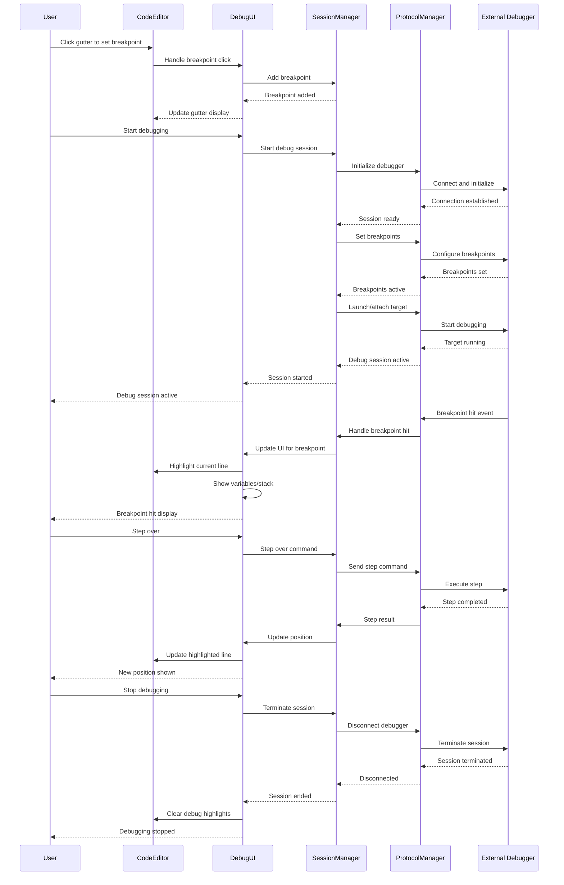

# Debugging Integration Architecture (Design Document)

> **Note:** This diagram represents a planned/extended debugging architecture. The currently implemented debugging system is documented in [`20-debugging-integration.md`](20-debugging-integration.md). Only `DebugAdapter.swift`, `DebuggerIntegrationCore.swift`, `DebuggerIntegration+Breakpoints.swift`, `DebuggerIntegration+Evaluation.swift`, `DebuggerIntegration+Execution.swift`, and `DebuggerModels.swift` are implemented. Classes like `DebugIntegrationSystem`, `DebugSessionManager`, `DebugSessionFactory`, `DebugProtocolManager`, `DebugStateManager`, etc. are aspirational.

This diagram shows the planned comprehensive debugging integration system that provides breakpoint management, debug session control, and debugging visualization capabilities within the code editor.

```mermaid
classDiagram
    direction LR
    
    %% Row 1 - Core Debug System
    class DebugIntegrationSystem {
        <<debug system>>
        +debugSessionManager DebugSessionManager
        +breakpointManager BreakpointManager
        +debugUI DebugUIController
        +debugEventProcessor DebugEventProcessor
        +debugDataProvider DebugDataProvider
        +initializeDebugging()
        +startDebugSession()
        +stopDebugSession()
        +attachToProcess()
    }

    class DebugSessionManager {
        <<session manager>>
        +activeSessions [String: DebugSession]
        +sessionFactory DebugSessionFactory
        +protocolManager DebugProtocolManager
        +stateManager DebugStateManager
        +createSession()
        +terminateSession()
        +pauseSession()
        +resumeSession()
        +stepInto()
        +stepOver()
        +stepOut()
    }

    class DebugDataProvider {
        <<data provider>>
        +sessionDataCache DebugSessionDataCache
        +symbolResolver DebugSymbolResolver
        +sourceMapper DebugSourceMapper
        +memoryReader MemoryReader
        +getVariables()
        +getCallStack()
        +evaluateExpression()
        +readMemory()
        +resolveSymbol()
    }

    %% Row 2 - Debug Session & Configuration
    class DebugSession {
        <<debug session>>
        +sessionId String
        +debugger Debugger
        +state DebugState
        +configuration DebugConfiguration
        +threads [DebugThread]
        +callStack [StackFrame]
        +variables [Variable]
        +start()
        +stop()
        +pause()
        +resume()
        +evaluate()
    }

    class DebugConfiguration {
        <<debug config>>
        +name String
        +type DebuggerType
        +executable String
        +arguments [String]
        +workingDirectory String
        +environment [String: String]
        +attachMode AttachMode
        +sourceMap [String: String]
        +breakOnEntry Bool
        +stopOnException Bool
    }

    class DebugThread {
        <<debug thread>>
        +threadId String
        +name String
        +state ThreadState
        +callStack [StackFrame]
        +topFrame StackFrame?
        +canStep Bool
        +canContinue Bool
    }

    class StackFrame {
        <<stack frame>>
        +frameId String
        +name String
        +source SourceLocation
        +line Int
        +column Int
        +variables [Variable]
        +scopes [Scope]
        +instructionPointerReference String?
    }

    %% Row 3 - Breakpoint System
    class BreakpointManager {
        <<breakpoint manager>>
        +breakpoints [String: Breakpoint]
        +lineBreakpoints [Int: LineBreakpoint]
        +conditionalBreakpoints [String: ConditionalBreakpoint]
        +logBreakpoints [String: LogBreakpoint]
        +exceptionBreakpoints [String: ExceptionBreakpoint]
        +addBreakpoint()
        +removeBreakpoint()
        +toggleBreakpoint()
        +enableAllBreakpoints()
        +disableAllBreakpoints()
        +clearAllBreakpoints()
    }

    class Breakpoint {
        <<breakpoint>>
        +id String
        +enabled Bool
        +verified Bool
        +condition String?
        +hitCondition String?
        +logMessage String?
        +location BreakpointLocation
        +hitCount Int
        +metadata BreakpointMetadata
        +toggle()
        +validate()
    }

    class LineBreakpoint {
        <<line breakpoint>>
        +line Int
        +column Int?
        +sourceFile String
        +isResolved Bool
        +actualLine Int?
        +instructionAddress UInt64?
        +resolve()
    }

    class ConditionalBreakpoint {
        <<conditional breakpoint>>
        +condition String
        +conditionLanguage ConditionLanguage
        +evaluationCount Int
        +lastEvaluationResult Bool
        +conditionValidator ConditionValidator
        +evaluateCondition()
    }

    class LogBreakpoint {
        <<log breakpoint>>
        +logMessage String
        +logFormat LogFormat
        +outputDestination LogDestination
        +interpolatedVariables [String]
        +logCount Int
        +formatMessage()
        +writeLog()
    }

    class ExceptionBreakpoint {
        <<exception breakpoint>>
        +exceptionType ExceptionType
        +uncaughtOnly Bool
        +includeSubtypes Bool
        +filterPattern String?
        +exceptionMatcher ExceptionMatcher
        +matchesException()
    }

    %% Row 4 - Debug UI System
    class DebugUIController {
        <<ui controller>>
        +breakpointGutter BreakpointGutter
        +debugInfoOverlay DebugInfoOverlay
        +variableInspector VariableInspectorView
        +callStackView CallStackView
        +debugConsole DebugConsoleView
        +stepControls DebugStepControls
        +updateUI()
        +showBreakpointHit()
        +highlightCurrentLine()
        +clearHighlights()
    }

    class BreakpointGutter {
        <<breakpoint gutter>>
        +gutterView GutterView
        +breakpointRenderer BreakpointRenderer
        +gestureHandler BreakpointGestureHandler
        +breakpointIcons [BreakpointState: PlatformImage]
        +renderBreakpoint()
        +handleBreakpointClick()
        +showBreakpointContextMenu()
    }

    class DebugInfoOverlay {
        <<debug overlay>>
        +overlayView OverlayView
        +hoverController DebugHoverController
        +tooltipManager DebugTooltipManager
        +valueRenderer DebugValueRenderer
        +showVariableValue()
        +showExpressionResult()
        +hideOverlays()
    }

    class VariableInspectorView {
        <<variable inspector>>
        +treeView ExpandableTreeView
        +variableRenderer VariableRenderer
        +valueEditor VariableValueEditor
        +filterController VariableFilterController
        +updateVariables()
        +expandVariable()
        +editVariableValue()
        +applyFilters()
    }

    class CallStackView {
        <<call stack view>>
        +stackFrameList StackFrameListView
        +frameRenderer StackFrameRenderer
        +navigationController CallStackNavigationController
        +sourceLocator SourceLocationResolver
        +updateCallStack()
        +selectFrame()
        +navigateToFrame()
    }

    %% Row 5 - Data Models & Variables
    class Variable {
        <<variable>>
        +name String
        +value String
        +type String?
        +kind VariableKind
        +memoryReference String?
        +presentationHint VariablePresentationHint?
        +children [Variable]
        +isExpandable Bool
        +evaluate()
        +setValue()
    }

    class DebugSymbolResolver {
        <<symbol resolver>>
        +symbolTable DebugSymbolTable
        +sourceLineMapping SourceLineMapping
        +typeInfoProvider TypeInformationProvider
        +resolveSymbol()
        +getTypeInformation()
        +mapAddressToSource()
    }

    %% Row 6 - Event System
    class DebugEventProcessor {
        <<event processor>>
        +eventHandlers [DebugEventType: DebugEventHandler]
        +eventQueue DebugEventQueue
        +filterManager DebugEventFilterManager
        +notificationCenter DebugNotificationCenter
        +processEvent()
        +registerHandler()
        +filterEvents()
    }

    class DebugEvent {
        <<debug event>>
        +eventType DebugEventType
        +sessionId String
        +timestamp Date
        +data DebugEventData
        +threadId String?
        +frameId String?
    }

    %% Row 7 - Protocol System
    class DebugProtocolManager {
        <<protocol manager>>
        +dapClient DebugAdapterProtocolClient
        +protocolHandlers [DebuggerType: ProtocolHandler]
        +messageQueue DebugMessageQueue
        +responseManager DebugResponseManager
        +sendRequest()
        +handleNotification()
        +establishConnection()
    }

    class DebugAdapterProtocolClient {
        <<DAP client>>
        +connection DebugConnection
        +messageDispatcher MessageDispatcher
        +sequenceManager SequenceManager
        +initialize()
        +launch()
        +attach()
        +setBreakpoints()
        +continue()
        +stepIn()
        +stepOut()
        +evaluate()
    }

    class ProtocolHandler {
        <<protocol handler>>
        +handlerType DebuggerType
        +supportedCapabilities [DebugCapability]
        +handleRequest()
        +translateBreakpoint()
        +parseVariable()
    }

    class LLDBProtocolHandler {
        <<LLDB handler>>
        +lldbClient LLDBClient
        +commandTranslator LLDBCommandTranslator
        +responseParser LLDBResponseParser
        +targetManager LLDBTargetManager
        +handleRequest()
        +executeLLDBCommand()
        +parseStackTrace()
    }

    class GDBProtocolHandler {
        <<GDB handler>>
        +gdbClient GDBClient
        +miInterpreter GDBMachineInterface
        +breakpointTranslator GDBBreakpointTranslator
        +variableParser GDBVariableParser
        +handleRequest()
        +executeMICommand()
        +parseGDBOutput()
    }

    %% Row 8 - Console & Performance
    class DebugConsoleView {
        <<debug console>>
        +consoleTextView TextView
        +commandInput CommandInputView
        +commandHistory CommandHistory
        +outputFormatter DebugOutputFormatter
        +executeCommand()
        +displayOutput()
        +showEvaluationResult()
        +clearConsole()
    }

    class CommandHistory {
        <<command history>>
        +commands [String]
        +currentIndex Int
        +maxHistorySize Int
        +addCommand()
        +getPreviousCommand()
        +getNextCommand()
        +searchHistory()
    }

    class DebugPerformanceOptimizer {
        <<performance optimizer>>
        +eventThrottler DebugEventThrottler
        +dataCache DebugDataCache
        +lazyLoader DebugDataLazyLoader
        +memoryOptimizer DebugMemoryOptimizer
        +optimizeEventProcessing()
        +cacheDebugData()
        +preloadCriticalData()
    }

    %% Row 9 - Enumerations
    class DebuggerType {
        <<enumeration>>
        lldb
        gdb
        nodeDebugger
        pythonDebugger
        javaDebugger
        swiftDebugger
        rustDebugger
        customDebugger
    }

    class DebugState {
        <<enumeration>>
        stopped
        running
        paused
        stepping
        terminating
        disconnected
        error
    }

    class VariableKind {
        <<enumeration>>
        local
        parameter
        field
        global
        static
        constant
        synthetic
    }

    class DebugEventType {
        <<enumeration>>
        sessionStarted
        sessionTerminated
        breakpointHit
        stepped
        paused
        resumed
        threadStarted
        threadExited
        variableChanged
        exceptionThrown
        outputReceived
    }

    %% Key Relationships
    DebugIntegrationSystem --> DebugSessionManager : manages
    DebugIntegrationSystem --> BreakpointManager : manages
    DebugIntegrationSystem --> DebugUIController : controls
    DebugIntegrationSystem --> DebugEventProcessor : processes events
    DebugIntegrationSystem --> DebugDataProvider : provides data
    
    DebugSessionManager --> DebugSession : creates
    DebugSession --> DebugConfiguration : configured by
    DebugSession --> DebugThread : contains
    DebugSession --> StackFrame : has stack
    DebugSession --> Variable : exposes
    
    BreakpointManager --> Breakpoint : manages
    Breakpoint <|-- LineBreakpoint : specializes to
    Breakpoint <|-- ConditionalBreakpoint : specializes to
    Breakpoint <|-- LogBreakpoint : specializes to
    Breakpoint <|-- ExceptionBreakpoint : specializes to
    
    DebugUIController --> BreakpointGutter : displays
    DebugUIController --> DebugInfoOverlay : shows overlays
    DebugUIController --> VariableInspectorView : displays variables
    DebugUIController --> CallStackView : shows stack
    DebugUIController --> DebugConsoleView : provides console
    
    DebugThread --> StackFrame : contains
    StackFrame --> Variable : contains
    
    DebugEventProcessor --> DebugEvent : processes
    DebugEvent --> DebugEventType : categorized by
    
    DebugSessionManager --> DebugProtocolManager : communicates via
    DebugProtocolManager --> DebugAdapterProtocolClient : uses
    DebugProtocolManager --> ProtocolHandler : delegates to
    ProtocolHandler <|-- LLDBProtocolHandler : implements
    ProtocolHandler <|-- GDBProtocolHandler : implements
    
    DebugDataProvider --> DebugSymbolResolver : resolves symbols
    DebugUIController --> DebugConsoleView : integrates
    DebugConsoleView --> CommandHistory : tracks history
    
    DebugIntegrationSystem --> DebugPerformanceOptimizer : optimizes with

    %% Styling - Dark mode friendly colors
    classDef system fill:#007AFF20,stroke:#007AFF,stroke-width:3px,color:#1D1D1F
    classDef session fill:#AF52DE20,stroke:#AF52DE,stroke-width:2px,color:#1D1D1F
    classDef breakpoint fill:#34C75920,stroke:#34C759,stroke-width:2px,color:#1D1D1F
    classDef ui fill:#007AFF20,stroke:#007AFF,stroke-width:2px,color:#1D1D1F
    classDef data fill:#FF950020,stroke:#FF9500,stroke-width:2px,color:#1D1D1F
    classDef event fill:#FF3B3020,stroke:#FF3B30,stroke-width:2px,color:#1D1D1F
    classDef protocol fill:#007AFF20,stroke:#007AFF,stroke-width:2px,color:#1D1D1F
    classDef console fill:#AF52DE20,stroke:#AF52DE,stroke-width:2px,color:#1D1D1F
    classDef optimization fill:#8E8E9320,stroke:#8E8E93,stroke-width:2px,color:#1D1D1F
    classDef enum fill:#8E8E9320,stroke:#8E8E93,stroke-width:2px,color:#1D1D1F

    class DebugIntegrationSystem system
    class DebugSessionManager session
    class DebugSession session
    class DebugConfiguration session
    class DebugThread session
    class BreakpointManager breakpoint
    class Breakpoint breakpoint
    class LineBreakpoint breakpoint
    class ConditionalBreakpoint breakpoint
    class LogBreakpoint breakpoint
    class ExceptionBreakpoint breakpoint
    class DebugUIController ui
    class BreakpointGutter ui
    class DebugInfoOverlay ui
    class VariableInspectorView ui
    class CallStackView ui
    class StackFrame data
    class Variable data
    class DebugDataProvider data
    class DebugSymbolResolver data
    class DebugEventProcessor event
    class DebugEvent event
    class DebugProtocolManager protocol
    class DebugAdapterProtocolClient protocol
    class ProtocolHandler protocol
    class LLDBProtocolHandler protocol
    class GDBProtocolHandler protocol
    class DebugConsoleView console
    class CommandHistory console
    class DebugPerformanceOptimizer optimization
    class DebuggerType enum
    class DebugState enum
    class VariableKind enum
    class DebugEventType enum
```

## Debug Integration Flow

## Key Debugging Features

### 1. Multi-Debugger Support
- **LLDB Integration**: Native debugging for Swift, C, C++, Objective-C
- **GDB Support**: GNU debugger for C, C++, and other compiled languages
- **Language-Specific**: Specialized debuggers for Python, Node.js, Java
- **Debug Adapter Protocol**: Standard protocol for debugger integration

### 2. Comprehensive Breakpoint Management
- **Line Breakpoints**: Simple line-based breakpoints
- **Conditional Breakpoints**: Break only when conditions are met
- **Log Breakpoints**: Output messages without stopping execution
- **Exception Breakpoints**: Break on specific exception types

### 3. Rich Debug UI
- **Breakpoint Gutter**: Visual breakpoint indicators in editor
- **Variable Inspector**: Hierarchical variable viewing and editing
- **Call Stack View**: Navigate through execution stack frames
- **Debug Console**: Interactive command execution and output

### 4. Advanced Debug Features
- **Expression Evaluation**: Evaluate expressions in debug context
- **Memory Inspection**: View and modify memory contents
- **Symbol Resolution**: Navigate to symbol definitions
- **Source Mapping**: Handle source maps and transformed code

### 5. Interactive Debugging
- **Step Controls**: Step in, over, out, and continue operations
- **Hover Inspection**: View variable values on hover
- **Context Menus**: Quick actions for breakpoints and variables
- **Keyboard Shortcuts**: Efficient debugging workflow

### 6. Performance Optimizations
- **Event Throttling**: Prevent UI flooding from rapid debug events
- **Lazy Loading**: Load debug data on demand
- **Data Caching**: Cache frequently accessed debug information
- **Memory Management**: Efficient cleanup of debug sessions

## Benefits

1. **Universal Debugging**: Support for multiple debuggers and languages
2. **Rich Visualization**: Comprehensive debug information display
3. **Interactive Experience**: Intuitive debugging workflow
4. **Performance**: Optimized for responsive debugging sessions
5. **Extensible**: Plugin architecture for additional debugger types
6. **Standards Compliant**: Debug Adapter Protocol support for compatibility