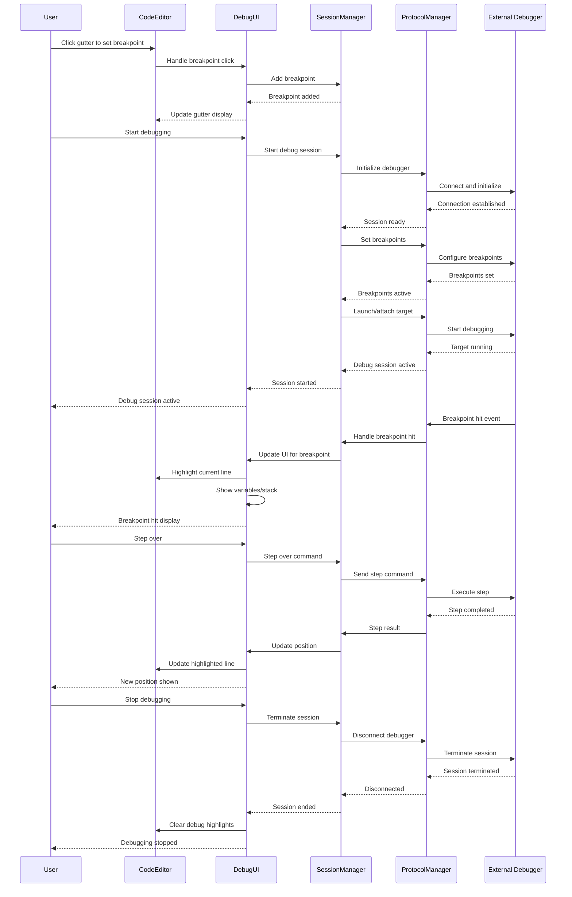

# Debugging Integration Detailed Architecture

This diagram shows the comprehensive debugging integration system that provides breakpoint management, debug session control, and debugging visualization capabilities within the code editor.

```mermaid
classDiagram
    %% Core Debugging System
    class DebugIntegrationSystem {
        +debugSessionManager: DebugSessionManager
        +breakpointManager: BreakpointManager
        +debugUI: DebugUIController
        +debugEventProcessor: DebugEventProcessor
        +debugDataProvider: DebugDataProvider
        +initializeDebugging(codeEditor: CodeEditorView)
        +startDebugSession(config: DebugConfiguration)
        +stopDebugSession()
        +attachToProcess(processId: Int)
        +detachFromProcess()
    }

    class DebugSessionManager {
        +activeSessions: [String: DebugSession]
        +sessionFactory: DebugSessionFactory
        +protocolManager: DebugProtocolManager
        +stateManager: DebugStateManager
        +createSession(config: DebugConfiguration) DebugSession
        +terminateSession(sessionId: String)
        +pauseSession(sessionId: String)
        +resumeSession(sessionId: String)
        +stepInto(sessionId: String)
        +stepOver(sessionId: String)
        +stepOut(sessionId: String)
    }

    %% Debug Session Types
    class DebugSession {
        +sessionId: String
        +debugger: Debugger
        +state: DebugState
        +configuration: DebugConfiguration
        +threads: [DebugThread]
        +callStack: [StackFrame]
        +variables: [Variable]
        +start() DebugResult
        +stop() DebugResult
        +pause() DebugResult
        +resume() DebugResult
        +evaluate(expression: String) EvaluationResult
    }

    class DebugConfiguration {
        +name: String
        +type: DebuggerType
        +executable: String
        +arguments: [String]
        +workingDirectory: String
        +environment: [String: String]
        +attachMode: AttachMode
        +sourceMap: [String: String]
        +breakOnEntry: Bool
        +stopOnException: Bool
    }

    class DebuggerType {
        <<enumeration>>
        lldb
        gdb
        nodeDebugger
        pythonDebugger
        javaDebugger
        swiftDebugger
        rustDebugger
        customDebugger(type: String)
    }

    class DebugState {
        <<enumeration>>
        stopped
        running
        paused
        stepping
        terminating
        disconnected
        error
    }

    %% Breakpoint Management System
    class BreakpointManager {
        +breakpoints: [String: Breakpoint]
        +lineBreakpoints: [Int: LineBreakpoint]
        +conditionalBreakpoints: [String: ConditionalBreakpoint]
        +logBreakpoints: [String: LogBreakpoint]
        +exceptionBreakpoints: [String: ExceptionBreakpoint]
        +addBreakpoint(breakpoint: Breakpoint) String
        +removeBreakpoint(id: String) Bool
        +toggleBreakpoint(id: String) Bool
        +enableAllBreakpoints()
        +disableAllBreakpoints()
        +clearAllBreakpoints()
    }

    class Breakpoint {
        +id: String
        +enabled: Bool
        +verified: Bool
        +condition: String?
        +hitCondition: String?
        +logMessage: String?
        +location: BreakpointLocation
        +hitCount: Int
        +metadata: BreakpointMetadata
        +toggle()
        +validate() ValidationResult
    }

    class LineBreakpoint {
        +line: Int
        +column: Int?
        +sourceFile: String
        +isResolved: Bool
        +actualLine: Int?
        +instructionAddress: UInt64?
        +resolve(debugSession: DebugSession) ResolveResult
    }

    class ConditionalBreakpoint {
        +condition: String
        +conditionLanguage: ConditionLanguage
        +evaluationCount: Int
        +lastEvaluationResult: Bool
        +conditionValidator: ConditionValidator
        +evaluateCondition(context: DebugContext) Bool
    }

    class LogBreakpoint {
        +logMessage: String
        +logFormat: LogFormat
        +outputDestination: LogDestination
        +interpolatedVariables: [String]
        +logCount: Int
        +formatMessage(context: DebugContext) String
        +writeLog(message: String)
    }

    class ExceptionBreakpoint {
        +exceptionType: ExceptionType
        +uncaughtOnly: Bool
        +includeSubtypes: Bool
        +filterPattern: String?
        +exceptionMatcher: ExceptionMatcher
        +matchesException(exception: Exception) Bool
    }

    %% Debug UI Integration
    class DebugUIController {
        +breakpointGutter: BreakpointGutter
        +debugInfoOverlay: DebugInfoOverlay
        +variableInspector: VariableInspectorView
        +callStackView: CallStackView
        +debugConsole: DebugConsoleView
        +stepControls: DebugStepControls
        +updateUI(debugEvent: DebugEvent)
        +showBreakpointHit(breakpoint: Breakpoint, context: DebugContext)
        +highlightCurrentLine(line: Int)
        +clearHighlights()
    }

    class BreakpointGutter {
        +gutterView: GutterView
        +breakpointRenderer: BreakpointRenderer
        +gestureHandler: BreakpointGestureHandler
        +breakpointIcons: [BreakpointState: PlatformImage]
        +renderBreakpoint(breakpoint: Breakpoint, line: Int)
        +handleBreakpointClick(line: Int, gesture: ClickGesture)
        +showBreakpointContextMenu(breakpoint: Breakpoint, point: CGPoint)
    }

    class DebugInfoOverlay {
        +overlayView: OverlayView
        +hoverController: DebugHoverController
        +tooltipManager: DebugTooltipManager
        +valueRenderer: DebugValueRenderer
        +showVariableValue(variable: Variable, location: CGPoint)
        +showExpressionResult(expression: String, result: EvaluationResult)
        +hideOverlays()
    }

    class VariableInspectorView {
        +treeView: ExpandableTreeView
        +variableRenderer: VariableRenderer
        +valueEditor: VariableValueEditor
        +filterController: VariableFilterController
        +updateVariables(variables: [Variable])
        +expandVariable(variable: Variable)
        +editVariableValue(variable: Variable, newValue: String)
        +applyFilters(filter: VariableFilter)
    }

    class CallStackView {
        +stackFrameList: StackFrameListView
        +frameRenderer: StackFrameRenderer
        +navigationController: CallStackNavigationController
        +sourceLocator: SourceLocationResolver
        +updateCallStack(frames: [StackFrame])
        +selectFrame(frame: StackFrame)
        +navigateToFrame(frame: StackFrame)
    }

    %% Debug Data Models
    class DebugThread {
        +threadId: String
        +name: String
        +state: ThreadState
        +callStack: [StackFrame]
        +topFrame: StackFrame?
        +canStep: Bool
        +canContinue: Bool
    }

    class StackFrame {
        +frameId: String
        +name: String
        +source: SourceLocation
        +line: Int
        +column: Int
        +variables: [Variable]
        +scopes: [Scope]
        +instructionPointerReference: String?
    }

    class Variable {
        +name: String
        +value: String
        +type: String?
        +kind: VariableKind
        +memoryReference: String?
        +presentationHint: VariablePresentationHint?
        +children: [Variable]
        +isExpandable: Bool
        +evaluate(expression: String) EvaluationResult
        +setValue(newValue: String) SetValueResult
    }

    class VariableKind {
        <<enumeration>>
        local
        parameter
        field
        global
        static
        constant
        synthetic
    }

    %% Debug Events and Communication
    class DebugEventProcessor {
        +eventHandlers: [DebugEventType: DebugEventHandler]
        +eventQueue: DebugEventQueue
        +filterManager: DebugEventFilterManager
        +notificationCenter: DebugNotificationCenter
        +processEvent(event: DebugEvent)
        +registerHandler(eventType: DebugEventType, handler: DebugEventHandler)
        +filterEvents(events: [DebugEvent]) [DebugEvent]
    }

    class DebugEvent {
        +eventType: DebugEventType
        +sessionId: String
        +timestamp: Date
        +data: DebugEventData
        +threadId: String?
        +frameId: String?
    }

    class DebugEventType {
        <<enumeration>>
        sessionStarted
        sessionTerminated
        breakpointHit
        stepped
        paused
        resumed
        threadStarted
        threadExited
        variableChanged
        exceptionThrown
        outputReceived
    }

    %% Debug Protocol Integration
    class DebugProtocolManager {
        +dapClient: DebugAdapterProtocolClient
        +protocolHandlers: [DebuggerType: ProtocolHandler]
        +messageQueue: DebugMessageQueue
        +responseManager: DebugResponseManager
        +sendRequest(request: DebugRequest) Future<DebugResponse>
        +handleNotification(notification: DebugNotification)
        +establishConnection(config: DebugConfiguration) ConnectionResult
    }

    class DebugAdapterProtocolClient {
        +connection: DebugConnection
        +messageDispatcher: MessageDispatcher
        +sequenceManager: SequenceManager
        +initialize(capabilities: DebugCapabilities) InitializeResult
        +launch(config: LaunchConfiguration) LaunchResult
        +attach(config: AttachConfiguration) AttachResult
        +setBreakpoints(breakpoints: [SourceBreakpoint]) SetBreakpointsResult
        +continue(threadId: String) ContinueResult
        +stepIn(threadId: String) StepResult
        +stepOut(threadId: String) StepResult
        +evaluate(expression: String, context: EvaluateContext) EvaluateResult
    }

    class ProtocolHandler {
        <<protocol>>
        +handlerType: DebuggerType
        +supportedCapabilities: [DebugCapability]
        +handleRequest(request: DebugRequest) DebugResponse
        +translateBreakpoint(breakpoint: Breakpoint) ProtocolBreakpoint
        +parseVariable(protocolVariable: ProtocolVariable) Variable
    }

    class LLDBProtocolHandler {
        +lldbClient: LLDBClient
        +commandTranslator: LLDBCommandTranslator
        +responseParser: LLDBResponseParser
        +targetManager: LLDBTargetManager
        +handleRequest(request: DebugRequest) DebugResponse
        +executeLLDBCommand(command: String) LLDBResult
        +parseStackTrace(output: String) [StackFrame]
    }

    class GDBProtocolHandler {
        +gdbClient: GDBClient
        +miInterpreter: GDBMachineInterface
        +breakpointTranslator: GDBBreakpointTranslator
        +variableParser: GDBVariableParser
        +handleRequest(request: DebugRequest) DebugResponse
        +executeMICommand(command: MICommand) MIResult
        +parseGDBOutput(output: String) GDBResponse
    }

    %% Debug Data Provider
    class DebugDataProvider {
        +sessionDataCache: DebugSessionDataCache
        +symbolResolver: DebugSymbolResolver
        +sourceMapper: DebugSourceMapper
        +memoryReader: MemoryReader
        +getVariables(frameId: String) [Variable]
        +getCallStack(threadId: String) [StackFrame]
        +evaluateExpression(expression: String, frameId: String) EvaluationResult
        +readMemory(memoryReference: String, count: Int) MemoryData
        +resolveSymbol(symbolName: String) SymbolInformation?
    }

    class DebugSymbolResolver {
        +symbolTable: DebugSymbolTable
        +sourceLineMapping: SourceLineMapping
        +typeInfoProvider: TypeInformationProvider
        +resolveSymbol(name: String, context: DebugContext) SymbolResolution?
        +getTypeInformation(variable: Variable) TypeInformation
        +mapAddressToSource(address: UInt64) SourceLocation?
    }

    %% Debug Console Integration
    class DebugConsoleView {
        +consoleTextView: TextView
        +commandInput: CommandInputView
        +commandHistory: CommandHistory
        +outputFormatter: DebugOutputFormatter
        +executeCommand(command: String)
        +displayOutput(output: String, type: OutputType)
        +showEvaluationResult(expression: String, result: EvaluationResult)
        +clearConsole()
    }

    class CommandHistory {
        +commands: [String]
        +currentIndex: Int
        +maxHistorySize: Int
        +addCommand(command: String)
        +getPreviousCommand() String?
        +getNextCommand() String?
        +searchHistory(query: String) [String]
    }

    %% Performance and Optimization
    class DebugPerformanceOptimizer {
        +eventThrottler: DebugEventThrottler
        +dataCache: DebugDataCache
        +lazyLoader: DebugDataLazyLoader
        +memoryOptimizer: DebugMemoryOptimizer
        +optimizeEventProcessing(events: [DebugEvent]) [DebugEvent]
        +cacheDebugData(sessionId: String, data: DebugData)
        +preloadCriticalData(session: DebugSession)
    }

    %% Relationships
    DebugIntegrationSystem --> DebugSessionManager : manages
    DebugIntegrationSystem --> BreakpointManager : manages
    DebugIntegrationSystem --> DebugUIController : controls
    DebugIntegrationSystem --> DebugEventProcessor : processes events
    DebugIntegrationSystem --> DebugDataProvider : provides data

    DebugSessionManager --> DebugSession : creates
    DebugSession --> DebugConfiguration : configured by
    DebugSession --> DebugThread : contains
    DebugSession --> StackFrame : has stack
    DebugSession --> Variable : exposes

    BreakpointManager --> Breakpoint : manages
    Breakpoint <|-- LineBreakpoint : specializes to
    Breakpoint <|-- ConditionalBreakpoint : specializes to
    Breakpoint <|-- LogBreakpoint : specializes to
    Breakpoint <|-- ExceptionBreakpoint : specializes to

    DebugUIController --> BreakpointGutter : displays
    DebugUIController --> DebugInfoOverlay : shows overlays
    DebugUIController --> VariableInspectorView : displays variables
    DebugUIController --> CallStackView : shows stack
    DebugUIController --> DebugConsoleView : provides console

    DebugThread --> StackFrame : contains
    StackFrame --> Variable : contains

    DebugEventProcessor --> DebugEvent : processes
    DebugEvent --> DebugEventType : categorized by

    DebugSessionManager --> DebugProtocolManager : communicates via
    DebugProtocolManager --> DebugAdapterProtocolClient : uses
    DebugProtocolManager --> ProtocolHandler : delegates to
    ProtocolHandler <|-- LLDBProtocolHandler : implements
    ProtocolHandler <|-- GDBProtocolHandler : implements

    DebugDataProvider --> DebugSymbolResolver : resolves symbols
    DebugUIController --> DebugConsoleView : integrates
    DebugConsoleView --> CommandHistory : tracks history

    DebugIntegrationSystem --> DebugPerformanceOptimizer : optimizes with

    %% Styling - Dark mode friendly colors
    classDef system fill:#6366f120,stroke:#6366f1,stroke-width:3px,color:#fff
    classDef session fill:#8b5cf620,stroke:#8b5cf6,stroke-width:2px,color:#fff
    classDef breakpoint fill:#10b98120,stroke:#10b981,stroke-width:2px,color:#fff
    classDef ui fill:#3b82f620,stroke:#3b82f6,stroke-width:2px,color:#fff
    classDef data fill:#f59e0b20,stroke:#f59e0b,stroke-width:2px,color:#fff
    classDef event fill:#ec489920,stroke:#ec4899,stroke-width:2px,color:#fff
    classDef protocol fill:#06b6d420,stroke:#06b6d4,stroke-width:2px,color:#fff
    classDef console fill:#8b5cf620,stroke:#8b5cf6,stroke-width:2px,color:#fff
    classDef optimization fill:#6b728020,stroke:#6b7280,stroke-width:2px,color:#fff
    classDef enum fill:#6b728020,stroke:#6b7280,stroke-width:2px,color:#fff

    class DebugIntegrationSystem system
    class DebugSessionManager,DebugSession,DebugConfiguration,DebugThread session
    class BreakpointManager,Breakpoint,LineBreakpoint,ConditionalBreakpoint,LogBreakpoint,ExceptionBreakpoint breakpoint
    class DebugUIController,BreakpointGutter,DebugInfoOverlay,VariableInspectorView,CallStackView ui
    class StackFrame,Variable,DebugDataProvider,DebugSymbolResolver data
    class DebugEventProcessor,DebugEvent event
    class DebugProtocolManager,DebugAdapterProtocolClient,ProtocolHandler,LLDBProtocolHandler,GDBProtocolHandler protocol
    class DebugConsoleView,CommandHistory console
    class DebugPerformanceOptimizer optimization
    class DebuggerType,DebugState,VariableKind,DebugEventType enum
```

## Debug Integration Flow



## Key Debugging Features

### 1. Multi-Debugger Support
- **LLDB Integration**: Native debugging for Swift, C, C++, Objective-C
- **GDB Support**: GNU debugger for C, C++, and other compiled languages
- **Language-Specific**: Specialized debuggers for Python, Node.js, Java
- **Debug Adapter Protocol**: Standard protocol for debugger integration

### 2. Comprehensive Breakpoint Management
- **Line Breakpoints**: Simple line-based breakpoints
- **Conditional Breakpoints**: Break only when conditions are met
- **Log Breakpoints**: Output messages without stopping execution
- **Exception Breakpoints**: Break on specific exception types

### 3. Rich Debug UI
- **Breakpoint Gutter**: Visual breakpoint indicators in editor
- **Variable Inspector**: Hierarchical variable viewing and editing
- **Call Stack View**: Navigate through execution stack frames
- **Debug Console**: Interactive command execution and output

### 4. Advanced Debug Features
- **Expression Evaluation**: Evaluate expressions in debug context
- **Memory Inspection**: View and modify memory contents
- **Symbol Resolution**: Navigate to symbol definitions
- **Source Mapping**: Handle source maps and transformed code

### 5. Interactive Debugging
- **Step Controls**: Step in, over, out, and continue operations
- **Hover Inspection**: View variable values on hover
- **Context Menus**: Quick actions for breakpoints and variables
- **Keyboard Shortcuts**: Efficient debugging workflow

### 6. Performance Optimizations
- **Event Throttling**: Prevent UI flooding from rapid debug events
- **Lazy Loading**: Load debug data on demand
- **Data Caching**: Cache frequently accessed debug information
- **Memory Management**: Efficient cleanup of debug sessions

## Benefits

1. **Universal Debugging**: Support for multiple debuggers and languages
2. **Rich Visualization**: Comprehensive debug information display
3. **Interactive Experience**: Intuitive debugging workflow
4. **Performance**: Optimized for responsive debugging sessions
5. **Extensible**: Plugin architecture for additional debugger types
6. **Standards Compliant**: Debug Adapter Protocol support for compatibility