# Utility Systems & Extensions Network

This diagram shows the comprehensive utility systems and extensions network that provides shared utilities, cross-platform helpers, and extensibility infrastructure throughout the CodeEditorPlugin framework.

```mermaid
classDiagram
    direction LR
    
    %% Row 1 - Core Utility System
    class UtilitySystemManager {
        <<utility manager>>
        +extensionRegistry ExtensionRegistry
        +utilityProviders [String: UtilityProvider]
        +crossPlatformHelpers CrossPlatformHelperManager
        +performanceUtilities PerformanceUtilityManager
        +dataUtilities DataUtilityManager
        +initializeUtilities()
        +registerProvider()
        +getUtility()
        +shutdownUtilities()
    }

    class ExtensionRegistry {
        <<extension registry>>
        +loadedExtensions [String: Extension]
        +extensionManifests [ExtensionManifest]
        +dependencyResolver ExtensionDependencyResolver
        +lifecycleManager ExtensionLifecycleManager
        +loadExtension()
        +unloadExtension()
        +resolveExtensionDependencies()
        +validateExtension()
    }

    class CrossPlatformHelperManager {
        <<helper manager>>
        +fileSystemHelpers FileSystemHelpers
        +networkHelpers NetworkHelpers
        +cryptographyHelpers CryptographyHelpers
        +compressionHelpers CompressionHelpers
        +imageUtilities ImageUtilities
        +textUtilities TextUtilities
        +dateTimeUtilities DateTimeUtilities
        +concurrencyUtilities ConcurrencyUtilities
    }

    %% Row 2 - Core Platform Helpers
    class FileSystemHelpers {
        <<filesystem helpers>>
        +pathUtilities PathUtilities
        +fileOperations FileOperations
        +directoryWatcher DirectoryWatcher
        +temporaryFiles TemporaryFileManager
        +createPath()
        +relativePath()
        +watchDirectory()
        +createTemporaryFile()
        +copyFile()
        +moveFile()
        +deleteFile()
    }

    class NetworkHelpers {
        <<network helpers>>
        +httpClient HTTPClient
        +downloadManager DownloadManager
        +uploadManager UploadManager
        +reachabilityMonitor NetworkReachabilityMonitor
        +makeRequest()
        +downloadFile()
        +uploadFile()
        +monitorReachability()
    }

    class CryptographyHelpers {
        <<crypto helpers>>
        +hashGenerator HashGenerator
        +encryptionProvider EncryptionProvider
        +keyManager CryptoKeyManager
        +randomGenerator SecureRandomGenerator
        +generateHash()
        +encrypt()
        +decrypt()
        +generateSecureRandom()
    }

    class CompressionHelpers {
        <<compression helpers>>
        +gzipCompressor GZipCompressor
        +zipArchiver ZipArchiver
        +tarArchiver TarArchiver
        +lz4Compressor LZ4Compressor
        +compressData()
        +decompressData()
        +createArchive()
        +extractArchive()
    }

    %% Row 3 - Data & Text Utilities
    class TextUtilities {
        <<text utilities>>
        +stringProcessors [StringProcessor]
        +encodingDetector TextEncodingDetector
        +lineEndingDetector LineEndingDetector
        +textNormalizer TextNormalizer
        +regexHelper RegexHelper
        +detectEncoding()
        +detectLineEndings()
        +normalizeText()
        +escapeRegexCharacters()
        +validateEmail()
        +validateURL()
    }

    class DataUtilities {
        <<data utilities>>
        +jsonProcessor JSONProcessor
        +xmlProcessor XMLProcessor
        +yamlProcessor YAMLProcessor
        +csvProcessor CSVProcessor
        +binaryDataAnalyzer BinaryDataAnalyzer
        +parseJSON()
        +serializeJSON()
        +parseXML()
        +parseYAML()
        +parseCSV()
        +analyzeBinaryData()
    }

    class ImageUtilities {
        <<image utilities>>
        +imageProcessor ImageProcessor
        +formatConverter ImageFormatConverter
        +compressionOptimizer ImageCompressionOptimizer
        +metadataExtractor ImageMetadataExtractor
        +resizeImage()
        +convertFormat()
        +optimizeImage()
        +extractMetadata()
        +generateThumbnail()
    }

    class DateTimeUtilities {
        <<datetime utilities>>
        +calendarHelper CalendarHelper
        +timeZoneManager TimeZoneManager
        +dateFormatter DateFormatterPool
        +durationCalculator DurationCalculator
        +formatDate()
        +parseDate()
        +addTimeInterval()
        +calculateDuration()
        +convertTimeZone()
        +isWorkday()
    }

    %% Row 4 - Performance System
    class PerformanceUtilityManager {
        <<performance manager>>
        +profiler PerformanceProfiler
        +memoryTracker MemoryUsageTracker
        +cacheManager CacheManager
        +lazyLoader LazyLoadingManager
        +benchmarkRunner BenchmarkRunner
        +startProfiling()
        +stopProfiling()
        +trackMemoryUsage()
        +cacheObject()
        +getCachedObject()
    }

    class CacheManager {
        <<cache manager>>
        +memoryCaches [String: MemoryCache]
        +diskCache DiskCache
        +cacheEvictionPolicy CacheEvictionPolicy
        +cacheMetrics CacheMetrics
        +createMemoryCache()
        +store()
        +retrieve()
        +evictExpiredEntries()
        +clearCache()
    }

    class LazyLoadingManager {
        <<lazy loading manager>>
        +lazyWrappers [String: LazyWrapper]
        +loadingQueue DispatchQueue
        +loadingStrategies [LoadingStrategy]
        +createLazyWrapper()
        +loadValue()
        +preloadValues()
        +setLoadingStrategy()
    }

    %% Row 5 - Concurrency System
    class ConcurrencyUtilities {
        <<concurrency utilities>>
        +taskManager TaskManager
        +threadPoolManager ThreadPoolManager
        +lockManager LockManager
        +atomicOperations AtomicOperations
        +asyncHelper AsyncHelper
        +createTask()
        +createTaskGroup()
        +acquireLock()
        +performAtomic()
        +delay()
    }

    class TaskManager {
        <<task manager>>
        +activeTasks [String: Task]
        +taskQueue TaskQueue
        +taskScheduler TaskScheduler
        +taskMonitor TaskMonitor
        +scheduleTask()
        +cancelTask()
        +pauseTask()
        +resumeTask()
        +getTaskStatus()
    }

    class ThreadPoolManager {
        <<thread pool manager>>
        +threadPools [String: ThreadPool]
        +poolConfigurations [ThreadPoolConfiguration]
        +loadBalancer ThreadPoolLoadBalancer
        +createThreadPool()
        +submitWork()
        +shutdownPool()
        +optimizePoolSizes()
    }

    %% Row 6 - Extension System
    class Extension {
        <<extension>>
        +extensionId String
        +manifest ExtensionManifest
        +bundle Bundle
        +principalClass ExtensionPrincipalClass?
        +dependencies [ExtensionDependency]
        +state ExtensionState
        +activate()
        +deactivate()
        +handleMessage()
    }

    class ExtensionManifest {
        <<extension manifest>>
        +name String
        +version String
        +description String
        +author String
        +supportedPlatforms [Platform]
        +requiredCapabilities [Capability]
        +dependencies [ExtensionDependency]
        +entryPoints [EntryPoint]
        +permissions [Permission]
    }

    %% Row 7 - Utility Providers
    class UtilityProvider {
        <<utility provider>>
        +providerId String
        +supportedUtilities [UtilityType]
        +dependencies [String]
        +initialize()
        +shutdown()
        +provideUtility()
        +validateConfiguration()
    }

    class CoreUtilityProvider {
        <<core provider>>
        +fileSystemHelpers FileSystemHelpers
        +textUtilities TextUtilities
        +dataUtilities DataUtilities
        +dateTimeUtilities DateTimeUtilities
        +provideUtility()
    }

    class NetworkUtilityProvider {
        <<network provider>>
        +networkHelpers NetworkHelpers
        +downloadManager DownloadManager
        +uploadManager UploadManager
        +provideUtility()
    }

    class CryptoUtilityProvider {
        <<crypto provider>>
        +cryptographyHelpers CryptographyHelpers
        +keyManager CryptoKeyManager
        +secureRandomGenerator SecureRandomGenerator
        +provideUtility()
    }

    class PerformanceUtilityProvider {
        <<performance provider>>
        +performanceProfiler PerformanceProfiler
        +memoryTracker MemoryUsageTracker
        +cacheManager CacheManager
        +provideUtility()
    }

    %% Row 8 - Specialized Utilities
    class StringProcessor {
        <<string processor>>
        +processingType StringProcessingType
        +inputValidation InputValidator
        +outputFormatter OutputFormatter
        +process()
        +validate()
        +format()
    }

    class RegexHelper {
        <<regex helper>>
        +compiledPatterns [String: NSRegularExpression]
        +patternCache PatternCache
        +escapeUtility RegexEscapeUtility
        +compile()
        +match()
        +replace()
        +split()
    }

    class BinaryDataAnalyzer {
        <<binary analyzer>>
        +dataTypeDetector DataTypeDetector
        +structureAnalyzer BinaryStructureAnalyzer
        +checksumValidator ChecksumValidator
        +analyzeStructure()
        +detectDataType()
        +validateIntegrity()
        +extractMetadata()
    }

    %% Row 9 - Enumerations
    class UtilityType {
        <<enumeration>>
        fileSystem
        network
        cryptography
        compression
        text
        data
        image
        performance
        concurrency
        dateTime
        custom
    }

    class ExtensionState {
        <<enumeration>>
        unloaded
        loading
        loaded
        active
        inactive
        error
        unloading
    }

    class CompressionAlgorithm {
        <<enumeration>>
        gzip
        zip
        tar
        lz4
        bzip2
        custom
    }

    class ImageFormat {
        <<enumeration>>
        png
        jpeg
        gif
        tiff
        bmp
        heic
        webp
    }

    %% Key Relationships
    UtilitySystemManager --> ExtensionRegistry : manages
    UtilitySystemManager --> CrossPlatformHelperManager : coordinates
    UtilitySystemManager --> PerformanceUtilityManager : uses
    UtilitySystemManager --> UtilityProvider : manages
    
    ExtensionRegistry --> Extension : loads
    Extension --> ExtensionManifest : configured by
    
    CrossPlatformHelperManager --> FileSystemHelpers : contains
    CrossPlatformHelperManager --> NetworkHelpers : contains
    CrossPlatformHelperManager --> CryptographyHelpers : contains
    CrossPlatformHelperManager --> CompressionHelpers : contains
    CrossPlatformHelperManager --> ImageUtilities : contains
    CrossPlatformHelperManager --> TextUtilities : contains
    CrossPlatformHelperManager --> DataUtilities : contains
    CrossPlatformHelperManager --> DateTimeUtilities : contains
    CrossPlatformHelperManager --> ConcurrencyUtilities : contains
    
    PerformanceUtilityManager --> CacheManager : manages
    PerformanceUtilityManager --> LazyLoadingManager : manages
    
    ConcurrencyUtilities --> TaskManager : uses
    ConcurrencyUtilities --> ThreadPoolManager : uses
    
    TextUtilities --> StringProcessor : uses
    TextUtilities --> RegexHelper : uses
    DataUtilities --> BinaryDataAnalyzer : uses
    
    UtilityProvider <|-- CoreUtilityProvider : implements
    UtilityProvider <|-- NetworkUtilityProvider : implements
    UtilityProvider <|-- CryptoUtilityProvider : implements
    UtilityProvider <|-- PerformanceUtilityProvider : implements
    
    CoreUtilityProvider --> FileSystemHelpers : provides
    CoreUtilityProvider --> TextUtilities : provides
    CoreUtilityProvider --> DataUtilities : provides
    CoreUtilityProvider --> DateTimeUtilities : provides
    
    NetworkUtilityProvider --> NetworkHelpers : provides
    CryptoUtilityProvider --> CryptographyHelpers : provides
    PerformanceUtilityProvider --> PerformanceUtilityManager : provides

    %% Styling - Dark mode friendly colors
    classDef manager fill:#6366f120,stroke:#6366f1,stroke-width:3px,color:#fff
    classDef helper fill:#8b5cf620,stroke:#8b5cf6,stroke-width:2px,color:#fff
    classDef utility fill:#10b98120,stroke:#10b981,stroke-width:2px,color:#fff
    classDef performance fill:#3b82f620,stroke:#3b82f6,stroke-width:2px,color:#fff
    classDef concurrency fill:#f59e0b20,stroke:#f59e0b,stroke-width:2px,color:#fff
    classDef extension fill:#ec489920,stroke:#ec4899,stroke-width:2px,color:#fff
    classDef provider fill:#06b6d420,stroke:#06b6d4,stroke-width:2px,color:#fff
    classDef specialized fill:#8b5cf620,stroke:#8b5cf6,stroke-width:2px,color:#fff
    classDef enum fill:#6b728020,stroke:#6b7280,stroke-width:2px,color:#fff

    class UtilitySystemManager manager
    class CrossPlatformHelperManager manager
    class FileSystemHelpers helper
    class NetworkHelpers helper
    class CryptographyHelpers helper
    class CompressionHelpers helper
    class ImageUtilities helper
    class TextUtilities helper
    class DataUtilities helper
    class DateTimeUtilities helper
    class StringProcessor specialized
    class RegexHelper specialized
    class BinaryDataAnalyzer specialized
    class PerformanceUtilityManager performance
    class CacheManager performance
    class LazyLoadingManager performance
    class ConcurrencyUtilities concurrency
    class TaskManager concurrency
    class ThreadPoolManager concurrency
    class ExtensionRegistry extension
    class Extension extension
    class ExtensionManifest extension
    class UtilityProvider provider
    class CoreUtilityProvider provider
    class NetworkUtilityProvider provider
    class CryptoUtilityProvider provider
    class PerformanceUtilityProvider provider
    class UtilityType enum
    class ExtensionState enum
    class CompressionAlgorithm enum
    class ImageFormat enum
```



## Utility System Integration Flow

```mermaid
flowchart TB
    INIT[System Initialization] --> LOAD[Load Extension Registry]
    LOAD --> SCAN[Scan for Extensions]
    SCAN --> VALIDATE[Validate Extensions]
    
    VALIDATE --> RESOLVE[Resolve Dependencies]
    RESOLVE --> REGISTER[Register Utility Providers]
    REGISTER --> ACTIVATE[Activate Extensions]
    
    ACTIVATE --> READY[System Ready]
    
    subgraph "Core Utilities"
        FS[File System Helpers]
        NET[Network Helpers]
        CRYPTO[Cryptography Helpers]
        COMP[Compression Helpers]
        TEXT[Text Utilities]
        DATA[Data Utilities]
        IMG[Image Utilities]
        DATE[DateTime Utilities]
    end
    
    subgraph "Performance Utilities"
        CACHE[Cache Manager]
        LAZY[Lazy Loading Manager]
        PROF[Performance Profiler]
        MEM[Memory Tracker]
    end
    
    subgraph "Concurrency Utilities"
        TASK[Task Manager]
        THREAD[Thread Pool Manager]
        LOCK[Lock Manager]
        ATOMIC[Atomic Operations]
    end
    
    READY --> FS
    READY --> NET
    READY --> CRYPTO
    READY --> COMP
    READY --> TEXT
    READY --> DATA
    READY --> IMG
    READY --> DATE
    READY --> CACHE
    READY --> LAZY
    READY --> PROF
    READY --> MEM
    READY --> TASK
    READY --> THREAD
    READY --> LOCK
    READY --> ATOMIC
    
    FS --> PROVIDE[Provide Utilities to Framework]
    NET --> PROVIDE
    CRYPTO --> PROVIDE
    COMP --> PROVIDE
    TEXT --> PROVIDE
    DATA --> PROVIDE
    IMG --> PROVIDE
    DATE --> PROVIDE
    CACHE --> PROVIDE
    LAZY --> PROVIDE
    PROF --> PROVIDE
    MEM --> PROVIDE
    TASK --> PROVIDE
    THREAD --> PROVIDE
    LOCK --> PROVIDE
    ATOMIC --> PROVIDE

    %% Styling - Dark mode friendly colors
    classDef init fill:#6366f120,stroke:#6366f1,stroke-width:2px,color:#fff
    classDef process fill:#8b5cf620,stroke:#8b5cf6,stroke-width:2px,color:#fff
    classDef core fill:#10b98120,stroke:#10b981,stroke-width:2px,color:#fff
    classDef performance fill:#3b82f620,stroke:#3b82f6,stroke-width:2px,color:#fff
    classDef concurrency fill:#f59e0b20,stroke:#f59e0b,stroke-width:2px,color:#fff
    classDef result fill:#ec489920,stroke:#ec4899,stroke-width:2px,color:#fff

    class INIT init
    class READY init
    class LOAD process
    class SCAN process
    class VALIDATE process
    class RESOLVE process
    class REGISTER process
    class ACTIVATE process
    class FS core
    class NET core
    class CRYPTO core
    class COMP core
    class TEXT core
    class DATA core
    class IMG core
    class DATE core
    class CACHE performance
    class LAZY performance
    class PROF performance
    class MEM performance
    class TASK concurrency
    class THREAD concurrency
    class LOCK concurrency
    class ATOMIC concurrency
    class PROVIDE result
```



## Key Utility System Features

### 1. Comprehensive Platform Utilities
- **File System Helpers**: Cross-platform file operations, path utilities, directory watching
- **Network Helpers**: HTTP client, download/upload management, reachability monitoring
- **Cryptography Helpers**: Secure hashing, encryption/decryption, key management
- **Compression Helpers**: Multiple compression algorithms with archive support

### 2. Advanced Data Processing
- **Text Utilities**: Encoding detection, normalization, regex helpers, validation
- **Data Utilities**: JSON/XML/YAML/CSV processing, binary data analysis
- **Image Utilities**: Format conversion, compression optimization, metadata extraction
- **Binary Analysis**: Data type detection, structure analysis, integrity validation

### 3. Performance Optimization
- **Cache Management**: Multi-level caching with eviction policies
- **Lazy Loading**: Smart loading strategies with preload capabilities
- **Performance Profiling**: Built-in profiling and benchmarking tools
- **Memory Tracking**: Comprehensive memory usage monitoring

### 4. Concurrency Support
- **Task Management**: Comprehensive task scheduling and monitoring
- **Thread Pool Management**: Dynamic thread pool optimization
- **Lock Management**: Advanced locking primitives and strategies
- **Atomic Operations**: Thread-safe atomic operations

### 5. Extension System
- **Dynamic Loading**: Runtime extension loading and unloading
- **Dependency Resolution**: Automatic dependency management
- **Lifecycle Management**: Complete extension lifecycle control
- **Validation**: Extension validation and security checks

### 6. Date and Time Support
- **Calendar Helpers**: Advanced calendar operations and calculations
- **Time Zone Management**: Cross-timezone date/time handling
- **Date Formatting**: Flexible date formatting with locale support
- **Duration Calculations**: Precise duration and interval calculations

## Usage Examples

### File System Operations
```swift
let fileHelpers = UtilitySystemManager.shared.getUtility(FileSystemHelpers.self)
let tempFile = fileHelpers?.createTemporaryFile(prefix: "editor_cache")
let success = fileHelpers?.copyFile(from: sourcePath, to: destPath)
```

### Network Operations
```swift
let networkHelpers = UtilitySystemManager.shared.getUtility(NetworkHelpers.self)
let response = await networkHelpers?.makeRequest(httpRequest)
let downloadTask = networkHelpers?.downloadFile(url: url, destination: path)
```

### Performance Monitoring
```swift
let perfManager = UtilitySystemManager.shared.getUtility(PerformanceUtilityManager.self)
perfManager?.startProfiling(identifier: "text_processing")
// ... perform operations
let result = perfManager?.stopProfiling(identifier: "text_processing")
```

### Concurrency
```swift
let concurrency = UtilitySystemManager.shared.getUtility(ConcurrencyUtilities.self)
let task = concurrency?.createTask {
    // Background work
    return processLargeFile()
}
let result = await task?.value
```

## Benefits

1. **Unified Access**: Single point of access for all utility functions
2. **Cross-Platform**: Consistent behavior across macOS, iOS, and Catalyst
3. **Extensible**: Plugin architecture for custom utilities
4. **Performance**: Optimized implementations with caching and lazy loading
5. **Thread-Safe**: Comprehensive concurrency support throughout
6. **Maintainable**: Modular design with clear separation of concerns