# Utility Systems & Extensions Network

This diagram shows the comprehensive utility systems and extensions network that provides shared utilities, cross-platform helpers, and extensibility infrastructure throughout the CodeEditorPlugin framework.

```mermaid
classDiagram
    %% Core Utility System
    class UtilitySystemManager {
        +extensionRegistry: ExtensionRegistry
        +utilityProviders: [String: UtilityProvider]
        +crossPlatformHelpers: CrossPlatformHelperManager
        +performanceUtilities: PerformanceUtilityManager
        +dataUtilities: DataUtilityManager
        +initializeUtilities()
        +registerProvider(provider: UtilityProvider)
        +getUtility~T~(type: T.Type) T?
        +shutdownUtilities()
    }

    class ExtensionRegistry {
        +loadedExtensions: [String: Extension]
        +extensionManifests: [ExtensionManifest]
        +dependencyResolver: ExtensionDependencyResolver
        +lifecycleManager: ExtensionLifecycleManager
        +loadExtension(manifestPath: String) ExtensionLoadResult
        +unloadExtension(extensionId: String) Bool
        +resolveExtensionDependencies(extension: Extension) [Extension]
        +validateExtension(extension: Extension) ValidationResult
    }

    %% Platform Utilities and Helpers
    class CrossPlatformHelperManager {
        +fileSystemHelpers: FileSystemHelpers
        +networkHelpers: NetworkHelpers
        +cryptographyHelpers: CryptographyHelpers
        +compressionHelpers: CompressionHelpers
        +imageUtilities: ImageUtilities
        +textUtilities: TextUtilities
        +dateTimeUtilities: DateTimeUtilities
        +concurrencyUtilities: ConcurrencyUtilities
    }

    class FileSystemHelpers {
        +pathUtilities: PathUtilities
        +fileOperations: FileOperations
        +directoryWatcher: DirectoryWatcher
        +temporaryFiles: TemporaryFileManager
        +createPath(components: [String]) String
        +relativePath(from: String, to: String) String
        +watchDirectory(path: String, handler: DirectoryChangeHandler)
        +createTemporaryFile(prefix: String) TemporaryFile
        +copyFile(from: String, to: String) CopyResult
        +moveFile(from: String, to: String) MoveResult
        +deleteFile(path: String) Bool
    }

    class NetworkHelpers {
        +httpClient: HTTPClient
        +downloadManager: DownloadManager
        +uploadManager: UploadManager
        +reachabilityMonitor: NetworkReachabilityMonitor
        +makeRequest(request: HTTPRequest) HTTPResponse
        +downloadFile(url: URL, destination: String) DownloadTask
        +uploadFile(filePath: String, url: URL) UploadTask
        +monitorReachability(handler: ReachabilityHandler)
    }

    class CryptographyHelpers {
        +hashGenerator: HashGenerator
        +encryptionProvider: EncryptionProvider
        +keyManager: CryptoKeyManager
        +randomGenerator: SecureRandomGenerator
        +generateHash(data: Data, algorithm: HashAlgorithm) String
        +encrypt(data: Data, key: CryptoKey) EncryptionResult
        +decrypt(encryptedData: Data, key: CryptoKey) DecryptionResult
        +generateSecureRandom(length: Int) Data
    }

    class CompressionHelpers {
        +gzipCompressor: GZipCompressor
        +zipArchiver: ZipArchiver
        +tarArchiver: TarArchiver
        +lz4Compressor: LZ4Compressor
        +compressData(data: Data, algorithm: CompressionAlgorithm) CompressedData
        +decompressData(compressedData: Data, algorithm: CompressionAlgorithm) Data
        +createArchive(files: [String], destination: String) ArchiveResult
        +extractArchive(archivePath: String, destination: String) ExtractionResult
    }

    %% Text and Data Utilities
    class TextUtilities {
        +stringProcessors: [StringProcessor]
        +encodingDetector: TextEncodingDetector
        +lineEndingDetector: LineEndingDetector
        +textNormalizer: TextNormalizer
        +regexHelper: RegexHelper
        +detectEncoding(data: Data) String.Encoding?
        +detectLineEndings(text: String) LineEndingType
        +normalizeText(text: String, options: NormalizationOptions) String
        +escapeRegexCharacters(text: String) String
        +validateEmail(email: String) Bool
        +validateURL(url: String) Bool
    }

    class DataUtilities {
        +jsonProcessor: JSONProcessor
        +xmlProcessor: XMLProcessor
        +yamlProcessor: YAMLProcessor
        +csvProcessor: CSVProcessor
        +binaryDataAnalyzer: BinaryDataAnalyzer
        +parseJSON~T~(data: Data, type: T.Type) T?
        +serializeJSON~T~(object: T) Data?
        +parseXML(data: Data) XMLDocument?
        +parseYAML~T~(data: Data, type: T.Type) T?
        +parseCSV(data: Data, options: CSVOptions) CSVDocument
        +analyzeBinaryData(data: Data) BinaryAnalysis
    }

    class ImageUtilities {
        +imageProcessor: ImageProcessor
        +formatConverter: ImageFormatConverter
        +compressionOptimizer: ImageCompressionOptimizer
        +metadataExtractor: ImageMetadataExtractor
        +resizeImage(image: PlatformImage, size: CGSize) PlatformImage?
        +convertFormat(image: PlatformImage, format: ImageFormat) Data?
        +optimizeImage(image: PlatformImage, quality: Float) PlatformImage?
        +extractMetadata(imageData: Data) ImageMetadata?
        +generateThumbnail(image: PlatformImage, size: CGSize) PlatformImage?
    }

    %% Performance and Optimization Utilities
    class PerformanceUtilityManager {
        +profiler: PerformanceProfiler
        +memoryTracker: MemoryUsageTracker
        +cacheManager: CacheManager
        +lazyLoader: LazyLoadingManager
        +benchmarkRunner: BenchmarkRunner
        +startProfiling(identifier: String)
        +stopProfiling(identifier: String) ProfilingResult
        +trackMemoryUsage(component: String) MemorySnapshot
        +cacheObject~T~(key: String, object: T, policy: CachePolicy)
        +getCachedObject~T~(key: String, type: T.Type) T?
    }

    class CacheManager {
        +memoryCaches: [String: MemoryCache]
        +diskCache: DiskCache
        +cacheEvictionPolicy: CacheEvictionPolicy
        +cacheMetrics: CacheMetrics
        +createMemoryCache~T~(identifier: String, capacity: Int) MemoryCache~T~
        +store~T~(key: String, value: T, cache: String)
        +retrieve~T~(key: String, cache: String, type: T.Type) T?
        +evictExpiredEntries()
        +clearCache(identifier: String)
    }

    class LazyLoadingManager {
        +lazyWrappers: [String: LazyWrapper]
        +loadingQueue: DispatchQueue
        +loadingStrategies: [LoadingStrategy]
        +createLazyWrapper~T~(key: String, loader: LazyLoader~T~) LazyWrapper~T~
        +loadValue~T~(wrapper: LazyWrapper~T~) T
        +preloadValues(keys: [String])
        +setLoadingStrategy(key: String, strategy: LoadingStrategy)
    }

    %% Concurrency and Threading Utilities
    class ConcurrencyUtilities {
        +taskManager: TaskManager
        +threadPoolManager: ThreadPoolManager
        +lockManager: LockManager
        +atomicOperations: AtomicOperations
        +asyncHelper: AsyncHelper
        +createTask~T~(operation: @escaping () -> T) Task~T~
        +createTaskGroup() TaskGroup
        +acquireLock(identifier: String) Lock
        +performAtomic~T~(operation: @escaping () -> T) T
        +delay(seconds: Double) async
    }

    class TaskManager {
        +activeTasks: [String: Task]
        +taskQueue: TaskQueue
        +taskScheduler: TaskScheduler
        +taskMonitor: TaskMonitor
        +scheduleTask(task: Task, delay: TimeInterval)
        +cancelTask(taskId: String)
        +pauseTask(taskId: String)
        +resumeTask(taskId: String)
        +getTaskStatus(taskId: String) TaskStatus
    }

    class ThreadPoolManager {
        +threadPools: [String: ThreadPool]
        +poolConfigurations: [ThreadPoolConfiguration]
        +loadBalancer: ThreadPoolLoadBalancer
        +createThreadPool(identifier: String, configuration: ThreadPoolConfiguration) ThreadPool
        +submitWork~T~(poolId: String, work: @escaping () -> T) Future~T~
        +shutdownPool(identifier: String)
        +optimizePoolSizes()
    }

    %% Date, Time, and Calendar Utilities
    class DateTimeUtilities {
        +calendarHelper: CalendarHelper
        +timeZoneManager: TimeZoneManager
        +dateFormatter: DateFormatterPool
        +durationCalculator: DurationCalculator
        +formatDate(date: Date, format: String) String
        +parseDate(string: String, format: String) Date?
        +addTimeInterval(date: Date, interval: TimeInterval) Date
        +calculateDuration(start: Date, end: Date) Duration
        +convertTimeZone(date: Date, from: TimeZone, to: TimeZone) Date
        +isWorkday(date: Date, calendar: Calendar) Bool
    }

    %% Extension System
    class Extension {
        +extensionId: String
        +manifest: ExtensionManifest
        +bundle: Bundle
        +principalClass: ExtensionPrincipalClass?
        +dependencies: [ExtensionDependency]
        +state: ExtensionState
        +activate() ActivationResult
        +deactivate() DeactivationResult
        +handleMessage(message: ExtensionMessage) MessageResult
    }

    class ExtensionManifest {
        +name: String
        +version: String
        +description: String
        +author: String
        +supportedPlatforms: [Platform]
        +requiredCapabilities: [Capability]
        +dependencies: [ExtensionDependency]
        +entryPoints: [EntryPoint]
        +permissions: [Permission]
    }

    class UtilityProvider {
        <<protocol>>
        +providerId: String
        +supportedUtilities: [UtilityType]
        +dependencies: [String]
        +initialize() InitializationResult
        +shutdown()
        +provideUtility~T~(type: T.Type) T?
        +validateConfiguration() ValidationResult
    }

    class CoreUtilityProvider {
        +fileSystemHelpers: FileSystemHelpers
        +textUtilities: TextUtilities
        +dataUtilities: DataUtilities
        +dateTimeUtilities: DateTimeUtilities
        +provideUtility~T~(type: T.Type) T?
    }

    class NetworkUtilityProvider {
        +networkHelpers: NetworkHelpers
        +downloadManager: DownloadManager
        +uploadManager: UploadManager
        +provideUtility~T~(type: T.Type) T?
    }

    class CryptoUtilityProvider {
        +cryptographyHelpers: CryptographyHelpers
        +keyManager: CryptoKeyManager
        +secureRandomGenerator: SecureRandomGenerator
        +provideUtility~T~(type: T.Type) T?
    }

    class PerformanceUtilityProvider {
        +performanceProfiler: PerformanceProfiler
        +memoryTracker: MemoryUsageTracker
        +cacheManager: CacheManager
        +provideUtility~T~(type: T.Type) T?
    }

    %% Specialized Utility Categories
    class StringProcessor {
        +processingType: StringProcessingType
        +inputValidation: InputValidator
        +outputFormatter: OutputFormatter
        +process(input: String, options: ProcessingOptions) ProcessingResult
        +validate(input: String) ValidationResult
        +format(output: String, style: FormattingStyle) String
    }

    class RegexHelper {
        +compiledPatterns: [String: NSRegularExpression]
        +patternCache: PatternCache
        +escapeUtility: RegexEscapeUtility
        +compile(pattern: String, options: RegexOptions) NSRegularExpression?
        +match(text: String, pattern: String) [RegexMatch]
        +replace(text: String, pattern: String, replacement: String) String
        +split(text: String, pattern: String) [String]
    }

    class BinaryDataAnalyzer {
        +dataTypeDetector: DataTypeDetector
        +structureAnalyzer: BinaryStructureAnalyzer
        +checksumValidator: ChecksumValidator
        +analyzeStructure(data: Data) BinaryStructure
        +detectDataType(data: Data) DataType
        +validateIntegrity(data: Data, checksum: String) Bool
        +extractMetadata(data: Data) BinaryMetadata
    }

    %% Support Types and Enums
    class UtilityType {
        <<enumeration>>
        fileSystem
        network
        cryptography
        compression
        text
        data
        image
        performance
        concurrency
        dateTime
        custom(type: String)
    }

    class ExtensionState {
        <<enumeration>>
        unloaded
        loading
        loaded
        active
        inactive
        error
        unloading
    }

    class CompressionAlgorithm {
        <<enumeration>>
        gzip
        zip
        tar
        lz4
        bzip2
        custom(algorithm: String)
    }

    class ImageFormat {
        <<enumeration>>
        png
        jpeg
        gif
        tiff
        bmp
        heic
        webp
    }

    %% Relationships
    UtilitySystemManager --> ExtensionRegistry : manages
    UtilitySystemManager --> CrossPlatformHelperManager : coordinates
    UtilitySystemManager --> PerformanceUtilityManager : uses
    UtilitySystemManager --> UtilityProvider : manages

    ExtensionRegistry --> Extension : loads
    Extension --> ExtensionManifest : configured by

    CrossPlatformHelperManager --> FileSystemHelpers : contains
    CrossPlatformHelperManager --> NetworkHelpers : contains
    CrossPlatformHelperManager --> CryptographyHelpers : contains
    CrossPlatformHelperManager --> CompressionHelpers : contains
    CrossPlatformHelperManager --> ImageUtilities : contains
    CrossPlatformHelperManager --> TextUtilities : contains
    CrossPlatformHelperManager --> DataUtilities : contains
    CrossPlatformHelperManager --> DateTimeUtilities : contains
    CrossPlatformHelperManager --> ConcurrencyUtilities : contains

    PerformanceUtilityManager --> CacheManager : manages
    PerformanceUtilityManager --> LazyLoadingManager : manages

    ConcurrencyUtilities --> TaskManager : uses
    ConcurrencyUtilities --> ThreadPoolManager : uses

    TextUtilities --> StringProcessor : uses
    TextUtilities --> RegexHelper : uses
    DataUtilities --> BinaryDataAnalyzer : uses

    UtilityProvider <|-- CoreUtilityProvider : implements
    UtilityProvider <|-- NetworkUtilityProvider : implements
    UtilityProvider <|-- CryptoUtilityProvider : implements
    UtilityProvider <|-- PerformanceUtilityProvider : implements

    CoreUtilityProvider --> FileSystemHelpers : provides
    CoreUtilityProvider --> TextUtilities : provides
    CoreUtilityProvider --> DataUtilities : provides
    CoreUtilityProvider --> DateTimeUtilities : provides

    NetworkUtilityProvider --> NetworkHelpers : provides
    CryptoUtilityProvider --> CryptographyHelpers : provides
    PerformanceUtilityProvider --> PerformanceUtilityManager : provides

    %% Styling - Dark mode friendly colors
    classDef manager fill:#6366f120,stroke:#6366f1,stroke-width:3px,color:#fff
    classDef helper fill:#8b5cf620,stroke:#8b5cf6,stroke-width:2px,color:#fff
    classDef utility fill:#10b98120,stroke:#10b981,stroke-width:2px,color:#fff
    classDef performance fill:#3b82f620,stroke:#3b82f6,stroke-width:2px,color:#fff
    classDef concurrency fill:#f59e0b20,stroke:#f59e0b,stroke-width:2px,color:#fff
    classDef extension fill:#ec489920,stroke:#ec4899,stroke-width:2px,color:#fff
    classDef provider fill:#06b6d420,stroke:#06b6d4,stroke-width:2px,color:#fff
    classDef specialized fill:#8b5cf620,stroke:#8b5cf6,stroke-width:2px,color:#fff
    classDef enum fill:#6b728020,stroke:#6b7280,stroke-width:2px,color:#fff

    class UtilitySystemManager,CrossPlatformHelperManager manager
    class FileSystemHelpers,NetworkHelpers,CryptographyHelpers,CompressionHelpers,ImageUtilities,TextUtilities,DataUtilities,DateTimeUtilities helper
    class StringProcessor,RegexHelper,BinaryDataAnalyzer specialized
    class PerformanceUtilityManager,CacheManager,LazyLoadingManager performance
    class ConcurrencyUtilities,TaskManager,ThreadPoolManager concurrency
    class ExtensionRegistry,Extension,ExtensionManifest extension
    class UtilityProvider,CoreUtilityProvider,NetworkUtilityProvider,CryptoUtilityProvider,PerformanceUtilityProvider provider
    class UtilityType,ExtensionState,CompressionAlgorithm,ImageFormat enum
```

## Utility System Integration Flow

```mermaid
flowchart TB
    INIT[System Initialization] --> LOAD[Load Extension Registry]
    LOAD --> SCAN[Scan for Extensions]
    SCAN --> VALIDATE[Validate Extensions]
    
    VALIDATE --> RESOLVE[Resolve Dependencies]
    RESOLVE --> REGISTER[Register Utility Providers]
    REGISTER --> ACTIVATE[Activate Extensions]
    
    ACTIVATE --> READY[System Ready]
    
    subgraph "Core Utilities"
        FS[File System Helpers]
        NET[Network Helpers]
        CRYPTO[Cryptography Helpers]
        COMP[Compression Helpers]
        TEXT[Text Utilities]
        DATA[Data Utilities]
        IMG[Image Utilities]
        DATE[DateTime Utilities]
    end
    
    subgraph "Performance Utilities"
        CACHE[Cache Manager]
        LAZY[Lazy Loading Manager]
        PROF[Performance Profiler]
        MEM[Memory Tracker]
    end
    
    subgraph "Concurrency Utilities"
        TASK[Task Manager]
        THREAD[Thread Pool Manager]
        LOCK[Lock Manager]
        ATOMIC[Atomic Operations]
    end
    
    READY --> FS
    READY --> NET
    READY --> CRYPTO
    READY --> COMP
    READY --> TEXT
    READY --> DATA
    READY --> IMG
    READY --> DATE
    READY --> CACHE
    READY --> LAZY
    READY --> PROF
    READY --> MEM
    READY --> TASK
    READY --> THREAD
    READY --> LOCK
    READY --> ATOMIC
    
    FS --> PROVIDE[Provide Utilities to Framework]
    NET --> PROVIDE
    CRYPTO --> PROVIDE
    COMP --> PROVIDE
    TEXT --> PROVIDE
    DATA --> PROVIDE
    IMG --> PROVIDE
    DATE --> PROVIDE
    CACHE --> PROVIDE
    LAZY --> PROVIDE
    PROF --> PROVIDE
    MEM --> PROVIDE
    TASK --> PROVIDE
    THREAD --> PROVIDE
    LOCK --> PROVIDE
    ATOMIC --> PROVIDE

    %% Styling - Dark mode friendly colors
    classDef init fill:#6366f120,stroke:#6366f1,stroke-width:2px,color:#fff
    classDef process fill:#8b5cf620,stroke:#8b5cf6,stroke-width:2px,color:#fff
    classDef core fill:#10b98120,stroke:#10b981,stroke-width:2px,color:#fff
    classDef performance fill:#3b82f620,stroke:#3b82f6,stroke-width:2px,color:#fff
    classDef concurrency fill:#f59e0b20,stroke:#f59e0b,stroke-width:2px,color:#fff
    classDef result fill:#ec489920,stroke:#ec4899,stroke-width:2px,color:#fff

    class INIT init
    class READY init
    class LOAD process
    class SCAN process
    class VALIDATE process
    class RESOLVE process
    class REGISTER process
    class ACTIVATE process
    class FS core
    class NET core
    class CRYPTO core
    class COMP core
    class TEXT core
    class DATA core
    class IMG core
    class DATE core
    class CACHE performance
    class LAZY performance
    class PROF performance
    class MEM performance
    class TASK concurrency
    class THREAD concurrency
    class LOCK concurrency
    class ATOMIC concurrency
    class PROVIDE result
```



## Key Utility System Features

### 1. Comprehensive Platform Utilities
- **File System Helpers**: Cross-platform file operations, path utilities, directory watching
- **Network Helpers**: HTTP client, download/upload management, reachability monitoring
- **Cryptography Helpers**: Secure hashing, encryption/decryption, key management
- **Compression Helpers**: Multiple compression algorithms with archive support

### 2. Advanced Data Processing
- **Text Utilities**: Encoding detection, normalization, regex helpers, validation
- **Data Utilities**: JSON/XML/YAML/CSV processing, binary data analysis
- **Image Utilities**: Format conversion, compression optimization, metadata extraction
- **Binary Analysis**: Data type detection, structure analysis, integrity validation

### 3. Performance Optimization
- **Cache Management**: Multi-level caching with eviction policies
- **Lazy Loading**: Smart loading strategies with preload capabilities
- **Performance Profiling**: Built-in profiling and benchmarking tools
- **Memory Tracking**: Comprehensive memory usage monitoring

### 4. Concurrency Support
- **Task Management**: Comprehensive task scheduling and monitoring
- **Thread Pool Management**: Dynamic thread pool optimization
- **Lock Management**: Advanced locking primitives and strategies
- **Atomic Operations**: Thread-safe atomic operations

### 5. Extension System
- **Dynamic Loading**: Runtime extension loading and unloading
- **Dependency Resolution**: Automatic dependency management
- **Lifecycle Management**: Complete extension lifecycle control
- **Validation**: Extension validation and security checks

### 6. Date and Time Support
- **Calendar Helpers**: Advanced calendar operations and calculations
- **Time Zone Management**: Cross-timezone date/time handling
- **Date Formatting**: Flexible date formatting with locale support
- **Duration Calculations**: Precise duration and interval calculations

## Usage Examples

### File System Operations
```swift
let fileHelpers = UtilitySystemManager.shared.getUtility(FileSystemHelpers.self)
let tempFile = fileHelpers?.createTemporaryFile(prefix: "editor_cache")
let success = fileHelpers?.copyFile(from: sourcePath, to: destPath)
```

### Network Operations
```swift
let networkHelpers = UtilitySystemManager.shared.getUtility(NetworkHelpers.self)
let response = await networkHelpers?.makeRequest(httpRequest)
let downloadTask = networkHelpers?.downloadFile(url: url, destination: path)
```

### Performance Monitoring
```swift
let perfManager = UtilitySystemManager.shared.getUtility(PerformanceUtilityManager.self)
perfManager?.startProfiling(identifier: "text_processing")
// ... perform operations
let result = perfManager?.stopProfiling(identifier: "text_processing")
```

### Concurrency
```swift
let concurrency = UtilitySystemManager.shared.getUtility(ConcurrencyUtilities.self)
let task = concurrency?.createTask {
    // Background work
    return processLargeFile()
}
let result = await task?.value
```

## Benefits

1. **Unified Access**: Single point of access for all utility functions
2. **Cross-Platform**: Consistent behavior across macOS, iOS, and Catalyst
3. **Extensible**: Plugin architecture for custom utilities
4. **Performance**: Optimized implementations with caching and lazy loading
5. **Thread-Safe**: Comprehensive concurrency support throughout
6. **Maintainable**: Modular design with clear separation of concerns