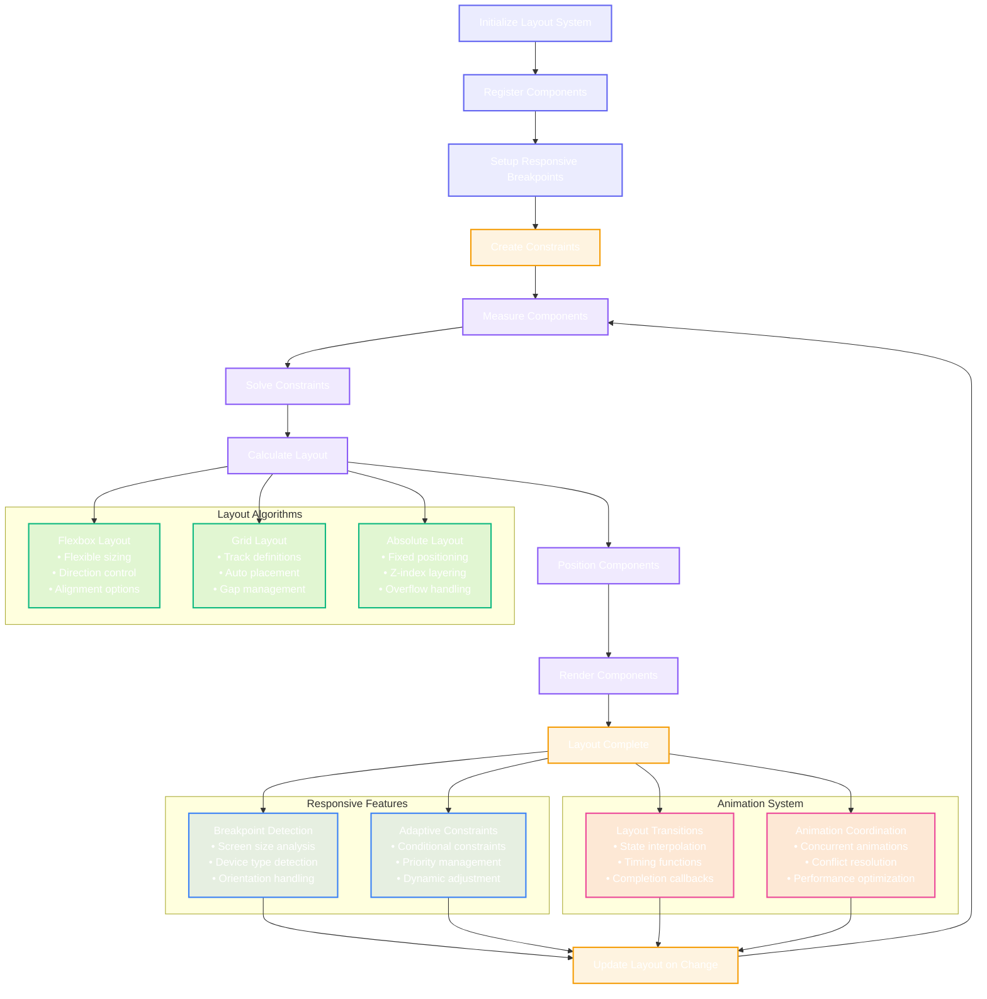

# Advanced Layout & UI Components Architecture

This diagram shows the comprehensive layout system and UI component architecture that handles advanced positioning, responsive design, and complex component interactions within the CodeEditorPlugin.

```mermaid
classDiagram
    %% Core Layout System
    class AdvancedLayoutSystem {
        +layoutEngine: LayoutEngine
        +componentManager: UIComponentManager
        +responsiveManager: ResponsiveLayoutManager
        +animationCoordinator: LayoutAnimationCoordinator
        +constraintSolver: ConstraintSolver
        +initializeLayout(containerView: PlatformView)
        +updateLayout(changes: [LayoutChange])
        +invalidateLayout(component: UIComponent)
        +performLayout() LayoutResult
        +optimizeLayout() OptimizationResult
    }

    class LayoutEngine {
        +layoutAlgorithm: LayoutAlgorithm
        +measurementCache: MeasurementCache
        +layoutTree: LayoutTree
        +performanceTracker: LayoutPerformanceTracker
        +calculateLayout(component: UIComponent) LayoutCalculation
        +measureComponent(component: UIComponent, constraints: LayoutConstraints) ComponentMeasurement
        +positionComponent(component: UIComponent, frame: CGRect)
        +validateLayout(layoutTree: LayoutTree) ValidationResult
    }

    class LayoutAlgorithm {
        <<enumeration>>
        flexbox
        grid
        absolute
        flow
        custom(algorithm: String)
    }

    %% UI Component Management
    class UIComponentManager {
        +registeredComponents: [String: UIComponent]
        +componentHierarchy: ComponentHierarchy
        +componentFactory: ComponentFactory
        +lifecycleManager: ComponentLifecycleManager
        +registerComponent(component: UIComponent, identifier: String)
        +createComponent(type: ComponentType, configuration: ComponentConfiguration) UIComponent
        +destroyComponent(identifier: String)
        +updateComponent(identifier: String, configuration: ComponentConfiguration)
        +getComponent(identifier: String) UIComponent?
    }

    class UIComponent {
        <<protocol>>
        +componentId: String
        +frame: CGRect
        +constraints: [LayoutConstraint]
        +isVisible: Bool
        +alpha: CGFloat
        +transformations: [ComponentTransformation]
        +render(context: RenderContext)
        +measure(constraints: LayoutConstraints) ComponentSize
        +layoutSubcomponents()
        +handleEvent(event: ComponentEvent)
    }

    %% Advanced Editor Components
    class CodeEditorComponent {
        +textView: CodeTextView
        +gutterView: GutterComponent
        +minimapView: MinimapComponent
        +scrollView: ScrollComponent
        +overlayManager: OverlayManager
        +render(context: RenderContext)
        +updateContent(text: String)
        +scrollToLine(line: Int, animated: Bool)
        +setSelectionRange(range: NSRange)
    }

    class GutterComponent {
        +lineNumberRenderer: LineNumberRenderer
        +breakpointRenderer: BreakpointRenderer
        +foldingRenderer: FoldingRenderer
        +annotationRenderer: AnnotationRenderer
        +gutterWidth: CGFloat
        +render(context: RenderContext)
        +renderLineNumbers(visibleRange: NSRange)
        +renderBreakpoints(breakpoints: [Breakpoint])
        +handleGutterClick(location: CGPoint) GutterClickResult
    }

    class MinimapComponent {
        +minimapRenderer: MinimapRenderer
        +viewportIndicator: ViewportIndicator
        +contentCache: MinimapContentCache
        +scaleFactor: CGFloat
        +isVisible: Bool
        +render(context: RenderContext)
        +updateMinimap(textContent: String)
        +handleMinimapScroll(offset: CGPoint)
        +syncWithMainView(scrollPosition: CGPoint)
    }

    class ScrollComponent {
        +scrollView: PlatformScrollView
        +scrollBehavior: ScrollBehavior
        +scrollIndicators: ScrollIndicators
        +elasticBehavior: ElasticScrollBehavior
        +zoomLevel: CGFloat
        +contentInsets: PlatformEdgeInsets
        +setContentSize(size: CGSize)
        +scrollToPoint(point: CGPoint, animated: Bool)
        +zoomToRect(rect: CGRect, animated: Bool)
        +handleScrollEvent(event: ScrollEvent)
    }

    class OverlayManager {
        +activeOverlays: [String: OverlayComponent]
        +overlayLayers: [OverlayLayer]
        +positionCalculator: OverlayPositionCalculator
        +addOverlay(overlay: OverlayComponent, layer: OverlayLayer)
        +removeOverlay(identifier: String)
        +updateOverlayPosition(identifier: String, position: CGPoint)
        +renderOverlays(context: RenderContext)
    }

    %% Responsive Layout System
    class ResponsiveLayoutManager {
        +breakpoints: [ResponsiveBreakpoint]
        +adaptiveConstraints: [AdaptiveConstraint]
        +deviceMetrics: DeviceMetrics
        +orientationHandler: OrientationChangeHandler
        +updateLayoutForSize(size: CGSize) ResponsiveUpdateResult
        +handleOrientationChange(orientation: DeviceOrientation)
        +calculateBreakpoint(size: CGSize) ResponsiveBreakpoint?
        +adaptConstraints(breakpoint: ResponsiveBreakpoint) [LayoutConstraint]
    }

    class ResponsiveBreakpoint {
        +name: String
        +minWidth: CGFloat?
        +maxWidth: CGFloat?
        +minHeight: CGFloat?
        +maxHeight: CGFloat?
        +deviceType: DeviceType
        +orientation: DeviceOrientation?
        +matches(size: CGSize, device: DeviceType) Bool
    }

    class AdaptiveConstraint {
        +baseConstraint: LayoutConstraint
        +breakpointOverrides: [ResponsiveBreakpoint: LayoutConstraint]
        +priority: ConstraintPriority
        +isActive: Bool
        +getConstraintForBreakpoint(breakpoint: ResponsiveBreakpoint) LayoutConstraint
        +activateForBreakpoint(breakpoint: ResponsiveBreakpoint)
    }

    %% Constraint System
    class ConstraintSolver {
        +constraints: [LayoutConstraint]
        +constraintGraph: ConstraintGraph
        +solver: LinearConstraintSolver
        +conflictResolver: ConstraintConflictResolver
        +addConstraint(constraint: LayoutConstraint) ConstraintResult
        +removeConstraint(constraint: LayoutConstraint)
        +solveConstraints() SolutionResult
        +detectConflicts() [ConstraintConflict]
        +resolveConflict(conflict: ConstraintConflict) ResolutionResult
    }

    class LayoutConstraint {
        +constraintId: String
        +firstItem: UIComponent
        +firstAttribute: LayoutAttribute
        +relation: ConstraintRelation
        +secondItem: UIComponent?
        +secondAttribute: LayoutAttribute?
        +multiplier: CGFloat
        +constant: CGFloat
        +priority: ConstraintPriority
        +isActive: Bool
    }

    class LayoutAttribute {
        <<enumeration>>
        leading
        trailing
        top
        bottom
        width
        height
        centerX
        centerY
        baseline
        firstBaseline
        lastBaseline
    }

    class ConstraintRelation {
        <<enumeration>>
        equal
        lessThanOrEqual
        greaterThanOrEqual
    }

    %% Animation and Transitions
    class LayoutAnimationCoordinator {
        +animationEngine: AnimationEngine
        +transitionManager: TransitionManager
        +timingFunctions: [TimingFunction]
        +activeAnimations: [String: LayoutAnimation]
        +animateLayoutChange(change: LayoutChange, animation: AnimationConfiguration)
        +createTransition(from: LayoutState, to: LayoutState) LayoutTransition
        +interruptAnimation(identifier: String)
        +completeAllAnimations()
    }

    class LayoutAnimation {
        +animationId: String
        +targetComponent: UIComponent
        +fromState: LayoutState
        +toState: LayoutState
        +duration: TimeInterval
        +timingFunction: TimingFunction
        +completion: AnimationCompletion?
        +start()
        +pause()
        +resume()
        +cancel()
    }

    class AnimationConfiguration {
        +duration: TimeInterval
        +delay: TimeInterval
        +timingFunction: TimingFunction
        +repeatCount: Int
        +autoreverses: Bool
        +fillMode: AnimationFillMode
    }

    %% Component Factory and Lifecycle
    class ComponentFactory {
        +componentTemplates: [ComponentType: ComponentTemplate]
        +dependencyInjector: ComponentDependencyInjector
        +configurationValidator: ComponentConfigurationValidator
        +createComponent(type: ComponentType, config: ComponentConfiguration) UIComponent
        +cloneComponent(component: UIComponent) UIComponent
        +validateConfiguration(config: ComponentConfiguration) ValidationResult
        +registerTemplate(type: ComponentType, template: ComponentTemplate)
    }

    class ComponentLifecycleManager {
        +componentStates: [String: ComponentLifecycleState]
        +lifecycleObservers: [ComponentLifecycleObserver]
        +transitionComponent(componentId: String, to: ComponentLifecycleState)
        +notifyObservers(componentId: String, event: LifecycleEvent)
        +cleanupComponent(componentId: String)
        +validateTransition(from: ComponentLifecycleState, to: ComponentLifecycleState) Bool
    }

    class ComponentLifecycleState {
        <<enumeration>>
        created
        initialized
        configured
        rendered
        visible
        hidden
        destroyed
    }

    %% Advanced Layout Features
    class FlexboxLayout {
        +flexDirection: FlexDirection
        +flexWrap: FlexWrap
        +justifyContent: JustifyContent
        +alignItems: AlignItems
        +alignContent: AlignContent
        +gap: CGFloat
        +calculateFlexLayout(components: [UIComponent], container: CGRect) FlexLayoutResult
        +distributeSpace(components: [UIComponent], availableSpace: CGFloat)
        +alignComponents(components: [UIComponent], crossAxis: FlexCrossAxis)
    }

    class GridLayout {
        +templateColumns: [GridTrack]
        +templateRows: [GridTrack]
        +gap: GridGap
        +justifyItems: JustifyItems
        +alignItems: AlignItems
        +autoFlow: GridAutoFlow
        +calculateGridLayout(components: [UIComponent], container: CGRect) GridLayoutResult
        +placeComponent(component: UIComponent, cell: GridCell)
        +resolveTrackSizes(tracks: [GridTrack], availableSize: CGFloat) [CGFloat]
    }

    class AbsoluteLayout {
        +positioningStrategy: PositioningStrategy
        +zIndexManager: ZIndexManager
        +overflowBehavior: OverflowBehavior
        +calculateAbsoluteLayout(components: [UIComponent], container: CGRect) AbsoluteLayoutResult
        +positionComponent(component: UIComponent, position: CGPoint)
        +handleOverflow(component: UIComponent, container: CGRect) OverflowResult
    }

    %% Performance Optimization
    class LayoutPerformanceOptimizer {
        +layoutCache: LayoutCache
        +measurementBatcher: MeasurementBatcher
        +dirtyRegionTracker: DirtyRegionTracker
        +layoutProfiler: LayoutProfiler
        +optimizeLayoutPass() OptimizationResult
        +batchMeasurements(components: [UIComponent]) [ComponentMeasurement]
        +trackDirtyRegion(region: CGRect)
        +invalidateCache(component: UIComponent)
    }

    class LayoutCache {
        +measurementCache: [String: ComponentMeasurement]
        +layoutResultCache: [String: LayoutResult]
        +cacheEvictionPolicy: CacheEvictionPolicy
        +hitRate: Double
        +cacheMeasurement(componentId: String, measurement: ComponentMeasurement)
        +getCachedMeasurement(componentId: String) ComponentMeasurement?
        +invalidateCache(componentId: String)
        +clearExpiredEntries()
    }

    %% Accessibility Integration
    class AccessibilityLayoutManager {
        +accessibilityElements: [AccessibilityElement]
        +focusManager: AccessibilityFocusManager
        +navigationAssistant: AccessibilityNavigationAssistant
        +setupAccessibility(components: [UIComponent])
        +updateAccessibilityElements(layoutChange: LayoutChange)
        +handleAccessibilityFocus(element: AccessibilityElement)
        +provideAccessibilityPath() AccessibilityPath
    }

    %% Event Handling
    class ComponentEventSystem {
        +eventHandlers: [ComponentEventType: ComponentEventHandler]
        +eventPropagation: EventPropagationManager
        +gestureRecognizers: [ComponentGestureRecognizer]
        +handleEvent(event: ComponentEvent, component: UIComponent)
        +propagateEvent(event: ComponentEvent, hierarchy: ComponentHierarchy)
        +registerGestureRecognizer(recognizer: ComponentGestureRecognizer)
    }

    %% Relationships
    AdvancedLayoutSystem --> LayoutEngine : uses
    AdvancedLayoutSystem --> UIComponentManager : manages
    AdvancedLayoutSystem --> ResponsiveLayoutManager : adapts with
    AdvancedLayoutSystem --> LayoutAnimationCoordinator : animates with
    AdvancedLayoutSystem --> ConstraintSolver : solves with

    LayoutEngine --> LayoutAlgorithm : implements
    LayoutEngine --> LayoutCache : caches with

    UIComponentManager --> UIComponent : manages
    UIComponentManager --> ComponentFactory : creates with
    UIComponentManager --> ComponentLifecycleManager : lifecycle with

    UIComponent <|-- CodeEditorComponent : specializes to
    UIComponent <|-- GutterComponent : specializes to
    UIComponent <|-- MinimapComponent : specializes to
    UIComponent <|-- ScrollComponent : specializes to

    CodeEditorComponent --> OverlayManager : manages overlays
    ResponsiveLayoutManager --> ResponsiveBreakpoint : uses
    ResponsiveLayoutManager --> AdaptiveConstraint : manages

    ConstraintSolver --> LayoutConstraint : solves
    LayoutConstraint --> LayoutAttribute : references
    LayoutConstraint --> ConstraintRelation : defines

    LayoutAnimationCoordinator --> LayoutAnimation : creates
    LayoutAnimation --> AnimationConfiguration : configured by

    ComponentFactory --> ComponentLifecycleManager : coordinates with
    ComponentLifecycleState --> ComponentLifecycleManager : managed by

    LayoutEngine --> FlexboxLayout : can use
    LayoutEngine --> GridLayout : can use
    LayoutEngine --> AbsoluteLayout : can use

    AdvancedLayoutSystem --> LayoutPerformanceOptimizer : optimizes with
    LayoutPerformanceOptimizer --> LayoutCache : uses

    AdvancedLayoutSystem --> AccessibilityLayoutManager : accessibility with
    UIComponentManager --> ComponentEventSystem : events with

    %% Styling - Dark mode friendly colors
    classDef system fill:#6366f120,stroke:#6366f1,stroke-width:3px,color:#fff
    classDef engine fill:#8b5cf620,stroke:#8b5cf6,stroke-width:2px,color:#fff
    classDef component fill:#10b98120,stroke:#10b981,stroke-width:2px,color:#fff
    classDef responsive fill:#3b82f620,stroke:#3b82f6,stroke-width:2px,color:#fff
    classDef constraint fill:#f59e0b20,stroke:#f59e0b,stroke-width:2px,color:#fff
    classDef animation fill:#ec489920,stroke:#ec4899,stroke-width:2px,color:#fff
    classDef factory fill:#06b6d420,stroke:#06b6d4,stroke-width:2px,color:#fff
    classDef layout fill:#8b5cf620,stroke:#8b5cf6,stroke-width:2px,color:#fff
    classDef performance fill:#10b98120,stroke:#10b981,stroke-width:2px,color:#fff
    classDef accessibility fill:#6b728020,stroke:#6b7280,stroke-width:2px,color:#fff
    classDef enum fill:#6b728020,stroke:#6b7280,stroke-width:2px,color:#fff

    class AdvancedLayoutSystem system
    class LayoutEngine,LayoutPerformanceOptimizer engine
    class UIComponent,CodeEditorComponent,GutterComponent,MinimapComponent,ScrollComponent,OverlayManager component
    class ResponsiveLayoutManager,ResponsiveBreakpoint,AdaptiveConstraint responsive
    class ConstraintSolver,LayoutConstraint constraint
    class LayoutAnimationCoordinator,LayoutAnimation,AnimationConfiguration animation
    class ComponentFactory,ComponentLifecycleManager factory
    class FlexboxLayout,GridLayout,AbsoluteLayout layout
    class LayoutCache performance
    class AccessibilityLayoutManager,ComponentEventSystem accessibility
    class LayoutAlgorithm,LayoutAttribute,ConstraintRelation,ComponentLifecycleState enum
```

## Layout System Flow



## Key Layout System Features

### 1. Advanced Layout Algorithms
- **Flexbox Layout**: Flexible sizing with direction control and alignment options
- **Grid Layout**: CSS Grid-inspired layout with track definitions and auto placement
- **Absolute Layout**: Fixed positioning with z-index layering and overflow handling
- **Flow Layout**: Traditional flow-based layout for text and inline elements

### 2. Responsive Design System
- **Breakpoint Management**: Screen size and device type responsive breakpoints
- **Adaptive Constraints**: Conditional constraints that adapt to different screen sizes
- **Orientation Handling**: Automatic layout adaptation for orientation changes
- **Device-Specific Optimizations**: Tailored layouts for different device capabilities

### 3. Advanced Constraint System
- **Linear Constraint Solver**: Efficient constraint solving with conflict detection
- **Priority-Based Resolution**: Constraint priority system for conflict resolution
- **Dynamic Constraints**: Runtime constraint modification and updates
- **Performance Optimization**: Cached constraint solutions and batch processing

### 4. Component Architecture
- **Protocol-Based Components**: Flexible component protocol for extensibility
- **Lifecycle Management**: Complete component lifecycle from creation to destruction
- **Factory Pattern**: Configurable component creation with dependency injection
- **Event System**: Comprehensive event handling and propagation

### 5. Animation and Transitions
- **Layout Animations**: Smooth transitions between layout states
- **Timing Functions**: Customizable animation timing and easing
- **Concurrent Animations**: Multiple simultaneous animations with coordination
- **Performance Optimization**: Hardware-accelerated animations where possible

### 6. Performance Optimizations
- **Measurement Caching**: Intelligent caching of component measurements
- **Dirty Region Tracking**: Minimal redraws using dirty region optimization
- **Batch Processing**: Batched layout calculations for improved performance
- **Memory Management**: Efficient memory usage and cleanup

### 7. Accessibility Integration
- **Accessibility Elements**: Automatic accessibility element generation
- **Focus Management**: Keyboard and assistive technology focus handling
- **Navigation Assistance**: Screen reader navigation support
- **Dynamic Updates**: Accessibility updates during layout changes

## Editor-Specific Components

### 1. Code Editor Component
- **Text Rendering**: High-performance text rendering with syntax highlighting
- **Selection Management**: Text selection with multi-cursor support
- **Scrolling Integration**: Smooth scrolling with momentum and elastic behavior
- **Overlay System**: Flexible overlay system for annotations and UI elements

### 2. Gutter Component
- **Line Numbers**: Efficient line number rendering with customizable formatting
- **Breakpoint Visualization**: Interactive breakpoint display and management
- **Code Folding**: Visual code folding indicators with expand/collapse
- **Annotation Display**: Rich annotation display with hover interactions

### 3. Minimap Component
- **Content Overview**: Miniature view of entire document content
- **Viewport Indicator**: Visual indicator of current viewport position
- **Navigation Interface**: Click and drag navigation through document
- **Performance Optimization**: Efficient rendering with content caching

### 4. Scroll Component
- **Smooth Scrolling**: Hardware-accelerated smooth scrolling
- **Zoom Support**: Pinch-to-zoom with content scaling
- **Elastic Behavior**: Natural scrolling behavior with bounce effects
- **Scroll Indicators**: Customizable scroll bar appearance and behavior

## Benefits

1. **Flexible Layout**: Support for multiple layout algorithms and responsive design
2. **High Performance**: Optimized layout calculations with caching and batching
3. **Smooth Animations**: Hardware-accelerated animations with conflict resolution
4. **Accessibility**: Built-in accessibility support with comprehensive navigation
5. **Extensible**: Protocol-based architecture allows for custom components
6. **Cross-Platform**: Consistent behavior across macOS, iOS, and Catalyst