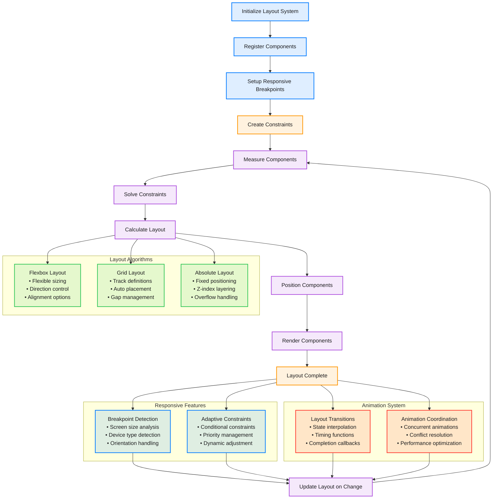

# Advanced Layout & UI Components Architecture

This diagram shows the comprehensive layout system and UI component architecture that handles advanced positioning, responsive design, and complex component interactions within the CodeEditorPlugin.

```mermaid
classDiagram
    direction LR
    
    %% Row 1 - Core Layout System
    class AdvancedLayoutSystem {
        <<layout system>>
        +layoutEngine LayoutEngine
        +componentManager UIComponentManager
        +responsiveManager ResponsiveLayoutManager
        +animationCoordinator LayoutAnimationCoordinator
        +initializeLayout()
        +updateLayout()
        +performLayout()
        +optimizeLayout()
    }

    class LayoutEngine {
        <<layout engine>>
        +layoutAlgorithm LayoutAlgorithm
        +measurementCache MeasurementCache
        +layoutTree LayoutTree
        +performanceTracker LayoutPerformanceTracker
        +calculateLayout()
        +measureComponent()
        +positionComponent()
        +validateLayout()
    }

    class UIComponentManager {
        <<component manager>>
        +registeredComponents [String: UIComponent]
        +componentHierarchy ComponentHierarchy
        +componentFactory ComponentFactory
        +lifecycleManager ComponentLifecycleManager
        +registerComponent()
        +createComponent()
        +destroyComponent()
        +updateComponent()
    }

    %% Row 2 - UI Component Management
    class UIComponent {
        <<component protocol>>
        +componentId String
        +frame CGRect
        +constraints [LayoutConstraint]
        +isVisible Bool
        +render()
        +measure()
        +layoutSubcomponents()
        +handleEvent()
    }

    class CodeEditorComponent {
        <<editor component>>
        +textView CodeTextView
        +gutterView GutterComponent
        +minimapView MinimapComponent
        +scrollView ScrollComponent
        +render()
        +updateContent()
        +scrollToLine()
        +setSelectionRange()
    }

    class GutterComponent {
        <<gutter component>>
        +lineNumberRenderer LineNumberRenderer
        +breakpointRenderer BreakpointRenderer
        +foldingRenderer FoldingRenderer
        +gutterWidth CGFloat
        +renderLineNumbers()
        +renderBreakpoints()
        +handleGutterClick()
    }

    class MinimapComponent {
        <<minimap component>>
        +minimapRenderer MinimapRenderer
        +viewportIndicator ViewportIndicator
        +contentCache MinimapContentCache
        +scaleFactor CGFloat
        +updateMinimap()
        +handleMinimapScroll()
        +syncWithMainView()
    }

    %% Row 3 - Layout Algorithms
    class FlexboxLayout {
        <<flexbox layout>>
        +flexDirection FlexDirection
        +flexWrap FlexWrap
        +justifyContent JustifyContent
        +alignItems AlignItems
        +calculateFlexLayout()
        +distributeSpace()
        +alignComponents()
    }

    class GridLayout {
        <<grid layout>>
        +templateColumns [GridTrack]
        +templateRows [GridTrack]
        +gap GridGap
        +justifyItems JustifyItems
        +calculateGridLayout()
        +placeComponent()
        +resolveTrackSizes()
    }

    class AbsoluteLayout {
        <<absolute layout>>
        +positioningStrategy PositioningStrategy
        +zIndexManager ZIndexManager
        +overflowBehavior OverflowBehavior
        +calculateAbsoluteLayout()
        +positionComponent()
        +handleOverflow()
    }

    class ScrollComponent {
        <<scroll component>>
        +scrollView PlatformScrollView
        +scrollBehavior ScrollBehavior
        +elasticBehavior ElasticScrollBehavior
        +zoomLevel CGFloat
        +setContentSize()
        +scrollToPoint()
        +zoomToRect()
    }

    %% Row 4 - Responsive System
    class ResponsiveLayoutManager {
        <<responsive manager>>
        +breakpoints [ResponsiveBreakpoint]
        +adaptiveConstraints [AdaptiveConstraint]
        +deviceMetrics DeviceMetrics
        +orientationHandler OrientationChangeHandler
        +updateLayoutForSize()
        +handleOrientationChange()
        +calculateBreakpoint()
        +adaptConstraints()
    }

    class ResponsiveBreakpoint {
        <<responsive breakpoint>>
        +name String
        +minWidth CGFloat?
        +maxWidth CGFloat?
        +deviceType DeviceType
        +orientation DeviceOrientation?
        +matches()
    }

    class AdaptiveConstraint {
        <<adaptive constraint>>
        +baseConstraint LayoutConstraint
        +breakpointOverrides [ResponsiveBreakpoint: LayoutConstraint]
        +priority ConstraintPriority
        +isActive Bool
        +getConstraintForBreakpoint()
        +activateForBreakpoint()
    }

    class OverlayManager {
        <<overlay manager>>
        +activeOverlays [String: OverlayComponent]
        +overlayLayers [OverlayLayer]
        +positionCalculator OverlayPositionCalculator
        +addOverlay()
        +removeOverlay()
        +updateOverlayPosition()
        +renderOverlays()
    }

    %% Row 5 - Constraint System
    class ConstraintSolver {
        <<constraint solver>>
        +constraints [LayoutConstraint]
        +constraintGraph ConstraintGraph
        +solver LinearConstraintSolver
        +conflictResolver ConstraintConflictResolver
        +addConstraint()
        +removeConstraint()
        +solveConstraints()
        +detectConflicts()
    }

    class LayoutConstraint {
        <<layout constraint>>
        +constraintId String
        +firstItem UIComponent
        +firstAttribute LayoutAttribute
        +relation ConstraintRelation
        +secondItem UIComponent?
        +multiplier CGFloat
        +constant CGFloat
        +priority ConstraintPriority
        +isActive Bool
    }

    class ComponentFactory {
        <<component factory>>
        +componentTemplates [ComponentType: ComponentTemplate]
        +dependencyInjector ComponentDependencyInjector
        +configurationValidator ComponentConfigurationValidator
        +createComponent()
        +cloneComponent()
        +validateConfiguration()
        +registerTemplate()
    }

    class ComponentLifecycleManager {
        <<lifecycle manager>>
        +componentStates [String: ComponentLifecycleState]
        +lifecycleObservers [ComponentLifecycleObserver]
        +transitionComponent()
        +notifyObservers()
        +cleanupComponent()
        +validateTransition()
    }

    %% Row 6 - Animation System
    class LayoutAnimationCoordinator {
        <<animation coordinator>>
        +animationEngine AnimationEngine
        +transitionManager TransitionManager
        +timingFunctions [TimingFunction]
        +activeAnimations [String: LayoutAnimation]
        +animateLayoutChange()
        +createTransition()
        +interruptAnimation()
        +completeAllAnimations()
    }

    class LayoutAnimation {
        <<layout animation>>
        +animationId String
        +targetComponent UIComponent
        +fromState LayoutState
        +toState LayoutState
        +duration TimeInterval
        +timingFunction TimingFunction
        +start()
        +pause()
        +resume()
        +cancel()
    }

    class AnimationConfiguration {
        <<animation config>>
        +duration TimeInterval
        +delay TimeInterval
        +timingFunction TimingFunction
        +repeatCount Int
        +autoreverses Bool
        +fillMode AnimationFillMode
    }

    class AccessibilityLayoutManager {
        <<accessibility manager>>
        +accessibilityElements [AccessibilityElement]
        +focusManager AccessibilityFocusManager
        +navigationAssistant AccessibilityNavigationAssistant
        +setupAccessibility()
        +updateAccessibilityElements()
        +handleAccessibilityFocus()
        +provideAccessibilityPath()
    }

    %% Row 7 - Performance & Optimization
    class LayoutPerformanceOptimizer {
        <<performance optimizer>>
        +layoutCache LayoutCache
        +measurementBatcher MeasurementBatcher
        +dirtyRegionTracker DirtyRegionTracker
        +layoutProfiler LayoutProfiler
        +optimizeLayoutPass()
        +batchMeasurements()
        +trackDirtyRegion()
        +invalidateCache()
    }

    class LayoutCache {
        <<layout cache>>
        +measurementCache [String: ComponentMeasurement]
        +layoutResultCache [String: LayoutResult]
        +cacheEvictionPolicy CacheEvictionPolicy
        +hitRate Double
        +cacheMeasurement()
        +getCachedMeasurement()
        +invalidateCache()
        +clearExpiredEntries()
    }

    class ComponentEventSystem {
        <<event system>>
        +eventHandlers [ComponentEventType: ComponentEventHandler]
        +eventPropagation EventPropagationManager
        +gestureRecognizers [ComponentGestureRecognizer]
        +handleEvent()
        +propagateEvent()
        +registerGestureRecognizer()
    }

    %% Row 8 - Enumerations
    class LayoutAlgorithm {
        <<enumeration>>
        flexbox
        grid
        absolute
        flow
        custom
    }

    class LayoutAttribute {
        <<enumeration>>
        leading
        trailing
        top
        bottom
        width
        height
        centerX
        centerY
        baseline
    }

    class ConstraintRelation {
        <<enumeration>>
        equal
        lessThanOrEqual
        greaterThanOrEqual
    }

    class ComponentLifecycleState {
        <<enumeration>>
        created
        initialized
        configured
        rendered
        visible
        hidden
        destroyed
    }

    %% Key Relationships
    AdvancedLayoutSystem --> LayoutEngine : uses
    AdvancedLayoutSystem --> UIComponentManager : manages
    AdvancedLayoutSystem --> ResponsiveLayoutManager : adapts with
    AdvancedLayoutSystem --> LayoutAnimationCoordinator : animates with
    AdvancedLayoutSystem --> ConstraintSolver : solves with
    
    LayoutEngine --> LayoutAlgorithm : implements
    UIComponentManager --> UIComponent : manages
    UIComponentManager --> ComponentFactory : creates with
    UIComponent <|-- CodeEditorComponent : specializes to
    UIComponent <|-- GutterComponent : specializes to
    UIComponent <|-- MinimapComponent : specializes to
    UIComponent <|-- ScrollComponent : specializes to
    
    ResponsiveLayoutManager --> ResponsiveBreakpoint : uses
    ResponsiveLayoutManager --> AdaptiveConstraint : manages
    
    ConstraintSolver --> LayoutConstraint : solves
    LayoutConstraint --> LayoutAttribute : references
    LayoutConstraint --> ConstraintRelation : defines
    
    LayoutAnimationCoordinator --> LayoutAnimation : creates
    LayoutAnimation --> AnimationConfiguration : configured by
    
    ComponentFactory --> ComponentLifecycleManager : coordinates with
    ComponentLifecycleManager --> ComponentLifecycleState : manages
    
    LayoutEngine --> FlexboxLayout : can use
    LayoutEngine --> GridLayout : can use
    LayoutEngine --> AbsoluteLayout : can use
    
    LayoutPerformanceOptimizer --> LayoutCache : uses
    AdvancedLayoutSystem --> AccessibilityLayoutManager : accessibility with

    %% Styling - Dark mode friendly colors
    classDef system fill:#007AFF20,stroke:#007AFF,stroke-width:3px,color:#1D1D1F
    classDef engine fill:#AF52DE20,stroke:#AF52DE,stroke-width:2px,color:#1D1D1F
    classDef component fill:#34C75920,stroke:#34C759,stroke-width:2px,color:#1D1D1F
    classDef responsive fill:#007AFF20,stroke:#007AFF,stroke-width:2px,color:#1D1D1F
    classDef constraint fill:#FF950020,stroke:#FF9500,stroke-width:2px,color:#1D1D1F
    classDef animation fill:#FF3B3020,stroke:#FF3B30,stroke-width:2px,color:#1D1D1F
    classDef factory fill:#007AFF20,stroke:#007AFF,stroke-width:2px,color:#1D1D1F
    classDef layout fill:#AF52DE20,stroke:#AF52DE,stroke-width:2px,color:#1D1D1F
    classDef performance fill:#34C75920,stroke:#34C759,stroke-width:2px,color:#1D1D1F
    classDef accessibility fill:#8E8E9320,stroke:#8E8E93,stroke-width:2px,color:#1D1D1F
    classDef enum fill:#8E8E9320,stroke:#8E8E93,stroke-width:2px,color:#1D1D1F

    class AdvancedLayoutSystem system
    class LayoutEngine engine
    class LayoutPerformanceOptimizer engine
    class UIComponent component
    class CodeEditorComponent component
    class GutterComponent component
    class MinimapComponent component
    class ScrollComponent component
    class OverlayManager component
    class ResponsiveLayoutManager responsive
    class ResponsiveBreakpoint responsive
    class AdaptiveConstraint responsive
    class ConstraintSolver constraint
    class LayoutConstraint constraint
    class LayoutAnimationCoordinator animation
    class LayoutAnimation animation
    class AnimationConfiguration animation
    class ComponentFactory factory
    class ComponentLifecycleManager factory
    class FlexboxLayout layout
    class GridLayout layout
    class AbsoluteLayout layout
    class LayoutCache performance
    class AccessibilityLayoutManager accessibility
    class ComponentEventSystem accessibility
    class LayoutAlgorithm enum
    class LayoutAttribute enum
    class ConstraintRelation enum
    class ComponentLifecycleState enum
```

## Layout System Flow

## Key Layout System Features

### 1. Advanced Layout Algorithms
- **Flexbox Layout**: Flexible sizing with direction control and alignment options
- **Grid Layout**: CSS Grid-inspired layout with track definitions and auto placement
- **Absolute Layout**: Fixed positioning with z-index layering and overflow handling
- **Flow Layout**: Traditional flow-based layout for text and inline elements

### 2. Responsive Design System
- **Breakpoint Management**: Screen size and device type responsive breakpoints
- **Adaptive Constraints**: Conditional constraints that adapt to different screen sizes
- **Orientation Handling**: Automatic layout adaptation for orientation changes
- **Device-Specific Optimizations**: Tailored layouts for different device capabilities

### 3. Advanced Constraint System
- **Linear Constraint Solver**: Efficient constraint solving with conflict detection
- **Priority-Based Resolution**: Constraint priority system for conflict resolution
- **Dynamic Constraints**: Runtime constraint modification and updates
- **Performance Optimization**: Cached constraint solutions and batch processing

### 4. Component Architecture
- **Protocol-Based Components**: Flexible component protocol for extensibility
- **Lifecycle Management**: Complete component lifecycle from creation to destruction
- **Factory Pattern**: Configurable component creation with dependency injection
- **Event System**: Comprehensive event handling and propagation

### 5. Animation and Transitions
- **Layout Animations**: Smooth transitions between layout states
- **Timing Functions**: Customizable animation timing and easing
- **Concurrent Animations**: Multiple simultaneous animations with coordination
- **Performance Optimization**: Hardware-accelerated animations where possible

### 6. Performance Optimizations
- **Measurement Caching**: Intelligent caching of component measurements
- **Dirty Region Tracking**: Minimal redraws using dirty region optimization
- **Batch Processing**: Batched layout calculations for improved performance
- **Memory Management**: Efficient memory usage and cleanup

### 7. Accessibility Integration
- **Accessibility Elements**: Automatic accessibility element generation
- **Focus Management**: Keyboard and assistive technology focus handling
- **Navigation Assistance**: Screen reader navigation support
- **Dynamic Updates**: Accessibility updates during layout changes

## Editor-Specific Components

### 1. Code Editor Component
- **Text Rendering**: High-performance text rendering with syntax highlighting
- **Selection Management**: Text selection with multi-cursor support
- **Scrolling Integration**: Smooth scrolling with momentum and elastic behavior
- **Overlay System**: Flexible overlay system for annotations and UI elements

### 2. Gutter Component
- **Line Numbers**: Efficient line number rendering with customizable formatting
- **Breakpoint Visualization**: Interactive breakpoint display and management
- **Code Folding**: Visual code folding indicators with expand/collapse
- **Annotation Display**: Rich annotation display with hover interactions

### 3. Minimap Component
- **Content Overview**: Miniature view of entire document content
- **Viewport Indicator**: Visual indicator of current viewport position
- **Navigation Interface**: Click and drag navigation through document
- **Performance Optimization**: Efficient rendering with content caching

### 4. Scroll Component
- **Smooth Scrolling**: Hardware-accelerated smooth scrolling
- **Zoom Support**: Pinch-to-zoom with content scaling
- **Elastic Behavior**: Natural scrolling behavior with bounce effects
- **Scroll Indicators**: Customizable scroll bar appearance and behavior

## Benefits

1. **Flexible Layout**: Support for multiple layout algorithms and responsive design
2. **High Performance**: Optimized layout calculations with caching and batching
3. **Smooth Animations**: Hardware-accelerated animations with conflict resolution
4. **Accessibility**: Built-in accessibility support with comprehensive navigation
5. **Extensible**: Protocol-based architecture allows for custom components
6. **Cross-Platform**: Consistent behavior across macOS, iOS, and Catalyst