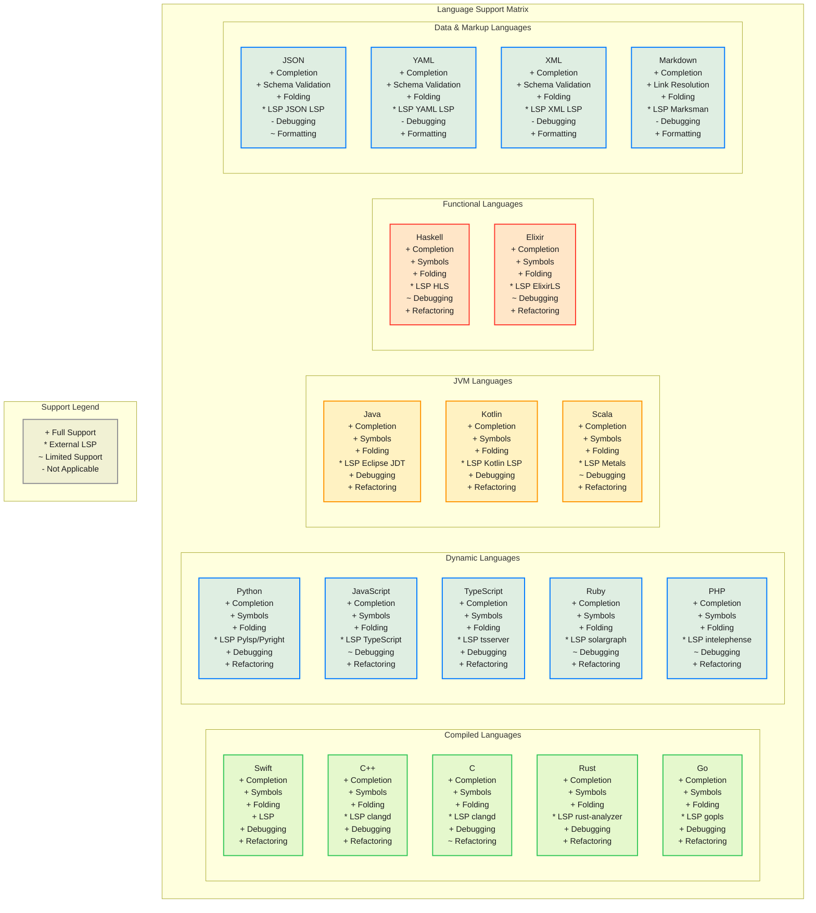

# Multi-Language Support Matrix

This diagram provides a comprehensive matrix view of language support capabilities across all 17+ supported languages in the CodeEditorPlugin framework.

## Language Capability Details

```mermaid
classDiagram
    %% Language Support Classification
    class LanguageSupportMatrix {
        +supportedLanguages: [String: LanguageSupport]
        +capabilityMatrix: [String: [Capability: SupportLevel]]
        +lspIntegrations: [String: LSPIntegration]
        +debuggerMappings: [String: DebuggerType]
        +getSupportLevel(language: String, capability: Capability) SupportLevel
        +getAvailableCapabilities(language: String) [Capability]
        +isLSPSupported(language: String) Bool
        +getDebuggerType(language: String) DebuggerType?
    }

    class LanguageSupport {
        +languageId: String
        +displayName: String
        +fileExtensions: [String]
        +supportLevel: OverallSupportLevel
        +capabilities: [Capability: SupportLevel]
        +provider: LanguageProvider
        +metadata: LanguageMetadata
    }

    class SupportLevel {
        <<enumeration>>
        full
        external
        limited
        planned
        notApplicable
    }

    class Capability {
        <<enumeration>>
        syntaxHighlighting
        codeCompletion
        symbolNavigation
        codeFolding
        errorDetection
        debugging
        refactoring
        formatting
        lspIntegration
        schemaValidation
        livePreview
    }

    class OverallSupportLevel {
        <<enumeration>>
        tier1_native
        tier2_lsp
        tier3_basic
        tier4_minimal
    }

    %% Compiled Languages Detail
    class CompiledLanguageSupport {
        +compilerIntegration: CompilerIntegration
        +buildSystemSupport: BuildSystemSupport
        +nativeDebugging: Bool
        +crossCompilation: Bool
        +linkTimeOptimization: Bool
        +staticAnalysis: StaticAnalysisSupport
    }

    class SwiftLanguageSupport {
        +swiftSyntaxIntegration: Bool
        +swiftPackageManager: Bool
        +xcodeIntegration: Bool
        +swiftUISupport: Bool
        +concurrencySupport: Bool
        +protocolOrientedFeatures: Bool
    }

    class CppLanguageSupport {
        +clangIntegration: Bool
        +cmakeSupport: Bool
        +standardVersions: [CppStandard]
        +templateSupport: TemplateSupport
        +modernCppFeatures: Bool
    }

    %% Dynamic Languages Detail
    class DynamicLanguageSupport {
        +interpreterIntegration: InterpreterIntegration
        +packageManagerSupport: PackageManagerSupport
        +virtualEnvironmentSupport: Bool
        +dynamicTyping: Bool
        +metaprogrammingSupport: Bool
        +runtimeDebugging: RuntimeDebuggingSupport
    }

    class PythonLanguageSupport {
        +pipIntegration: Bool
        +virtualEnvSupport: Bool
        +jupyterNotebooks: Bool
        +typeHintSupport: Bool
        +asyncAwaitSupport: Bool
        +packageDiscovery: PackageDiscoverySupport
    }

    class JavaScriptLanguageSupport {
        +nodeJsSupport: Bool
        +npmIntegration: Bool
        +babelSupport: Bool
        +webpackIntegration: Bool
        +frameworkSupport: [JSFramework]
    }

    class TypeScriptLanguageSupport {
        +typeChecking: Bool
        +interfaceSupport: Bool
        +decoratorSupport: Bool
        +moduleResolution: ModuleResolutionSupport
        +definitionFiles: Bool
    }

    %% JVM Languages Detail
    class JVMLanguageSupport {
        +jvmVersion: [JVMVersion]
        +buildToolSupport: [BuildTool]
        +libraryIntegration: LibraryIntegration
        +bytecodeAnalysis: Bool
        +hotswapDebugging: Bool
        +profilerIntegration: ProfilerIntegration
    }

    class JavaLanguageSupport {
        +mavenSupport: Bool
        +gradleSupport: Bool
        +springFrameworkSupport: Bool
        +annotationProcessing: Bool
        +lambdaSupport: Bool
        +modulesSupport: Bool
    }

    class KotlinLanguageSupport {
        +coroutineSupport: Bool
        +multiplatformSupport: Bool
        +javaInterop: Bool
        +androidSupport: Bool
        +nativeSupport: Bool
    }

    %% Functional Languages Detail
    class FunctionalLanguageSupport {
        +pureFunction: Bool
        +immutability: Bool
        +typeInference: TypeInferenceSupport
        +patternMatching: Bool
        +higherOrderFunctions: Bool
        +categoryTheory: Bool
    }

    class HaskellLanguageSupport {
        +ghcIntegration: Bool
        +cabalSupport: Bool
        +stackSupport: Bool
        +typeClasses: Bool
        +monadSupport: Bool
        +lazyEvaluation: Bool
    }

    %% Data Format Support Detail
    class DataFormatSupport {
        +schemaValidation: SchemaValidationSupport
        +autoCompletion: AutoCompletionSupport
        +formatValidation: Bool
        +prettyPrinting: Bool
        +minification: Bool
        +conversionSupport: [DataFormat]
    }

    class JSONLanguageSupport {
        +jsonSchemaSupport: Bool
        +jsonPathSupport: Bool
        +prettyFormatting: Bool
        +schemaGeneration: Bool
        +validationErrors: ValidationErrorSupport
    }

    class YAMLLanguageSupport {
        +yamlSchemaSupport: Bool
        +anchorSupport: Bool
        +multiDocumentSupport: Bool
        +indentationValidation: Bool
        +flowStyleSupport: Bool
    }

    %% LSP Integration Details
    class LSPIntegration {
        +serverName: String
        +serverCommand: [String]
        +initializationOptions: [String: Any]
        +capabilities: [LSPCapability]
        +customExtensions: [LSPExtension]
        +healthCheck: LSPHealthCheck
    }

    class LSPCapability {
        +capabilityName: String
        +isSupported: Bool
        +configuration: LSPCapabilityConfig?
    }

    %% Debugging Integration
    class DebuggingSupport {
        +debuggerType: DebuggerType
        +breakpointSupport: BreakpointSupport
        +variableInspection: VariableInspectionSupport
        +callStackSupport: Bool
        +stepDebugging: Bool
        +remoteDebugging: Bool
    }

    %% Performance Matrix
    class LanguagePerformanceMetrics {
        +syntaxHighlightingPerformance: PerformanceMetric
        +completionResponseTime: PerformanceMetric
        +symbolResolutionTime: PerformanceMetric
        +memoryUsage: MemoryMetric
        +startupTime: TimeMetric
    }

    %% Relationships
    LanguageSupportMatrix --> LanguageSupport : contains
    LanguageSupport --> SupportLevel : categorized by
    LanguageSupport --> Capability : supports
    LanguageSupport --> OverallSupportLevel : classified as

    LanguageSupport <|-- CompiledLanguageSupport : specializes to
    LanguageSupport <|-- DynamicLanguageSupport : specializes to
    LanguageSupport <|-- JVMLanguageSupport : specializes to
    LanguageSupport <|-- FunctionalLanguageSupport : specializes to
    LanguageSupport <|-- DataFormatSupport : specializes to

    CompiledLanguageSupport <|-- SwiftLanguageSupport : implements
    CompiledLanguageSupport <|-- CppLanguageSupport : implements

    DynamicLanguageSupport <|-- PythonLanguageSupport : implements
    DynamicLanguageSupport <|-- JavaScriptLanguageSupport : implements
    DynamicLanguageSupport <|-- TypeScriptLanguageSupport : implements

    JVMLanguageSupport <|-- JavaLanguageSupport : implements
    JVMLanguageSupport <|-- KotlinLanguageSupport : implements

    FunctionalLanguageSupport <|-- HaskellLanguageSupport : implements

    DataFormatSupport <|-- JSONLanguageSupport : implements
    DataFormatSupport <|-- YAMLLanguageSupport : implements

    LanguageSupport --> LSPIntegration : may use
    LanguageSupport --> DebuggingSupport : may support
    LanguageSupport --> LanguagePerformanceMetrics : measured by

    LSPIntegration --> LSPCapability : provides
    DebuggingSupport --> BreakpointSupport : includes

    %% Styling - Dark mode friendly colors
    classDef matrix fill:#007AFF20,stroke:#007AFF,stroke-width:3px,color:#1D1D1F
    classDef support fill:#AF52DE20,stroke:#AF52DE,stroke-width:2px,color:#1D1D1F
    classDef compiled fill:#34C75920,stroke:#34C759,stroke-width:2px,color:#1D1D1F
    classDef dynamic fill:#007AFF20,stroke:#007AFF,stroke-width:2px,color:#1D1D1F
    classDef jvm fill:#FF950020,stroke:#FF9500,stroke-width:2px,color:#1D1D1F
    classDef functional fill:#FF3B3020,stroke:#FF3B30,stroke-width:2px,color:#1D1D1F
    classDef data fill:#007AFF20,stroke:#007AFF,stroke-width:2px,color:#1D1D1F
    classDef integration fill:#AF52DE20,stroke:#AF52DE,stroke-width:2px,color:#1D1D1F
    classDef performance fill:#8E8E9320,stroke:#8E8E93,stroke-width:2px,color:#1D1D1F
    classDef enum fill:#8E8E9320,stroke:#8E8E93,stroke-width:2px,color:#1D1D1F

    class LanguageSupportMatrix matrix
    class LanguageSupport support
    class CompiledLanguageSupport compiled
    class SwiftLanguageSupport compiled
    class CppLanguageSupport compiled
    class DynamicLanguageSupport dynamic
    class PythonLanguageSupport dynamic
    class JavaScriptLanguageSupport dynamic
    class TypeScriptLanguageSupport dynamic
    class JVMLanguageSupport jvm
    class JavaLanguageSupport jvm
    class KotlinLanguageSupport jvm
    class FunctionalLanguageSupport functional
    class HaskellLanguageSupport functional
    class DataFormatSupport data
    class JSONLanguageSupport data
    class YAMLLanguageSupport data
    class LSPIntegration integration
    class LSPCapability integration
    class DebuggingSupport integration
    class LanguagePerformanceMetrics performance
    class SupportLevel enum
    class Capability enum
    class OverallSupportLevel enum
```

## Language Support Tiers

### Tier 1: Native Support (Full Integration)
- **Swift**: Complete native integration with SwiftSyntax
- **C/C++**: Full Clang-based parsing and analysis
- **JSON/YAML**: Native parsing with schema validation

### Tier 2: LSP Integration (External Server)
- **TypeScript/JavaScript**: Via TypeScript Language Server
- **Python**: Via Pylsp or Pyright
- **Rust**: Via rust-analyzer
- **Go**: Via gopls
- **Java**: Via Eclipse JDT Language Server
- **Kotlin**: Via Kotlin Language Server

### Tier 3: Basic Support (Pattern-Based)
- **Ruby**: Basic syntax highlighting and completion
- **PHP**: Pattern-based with limited completion
- **Scala**: Basic support with Metals LSP option

### Tier 4: Minimal Support (Syntax Only)
- **Markdown**: Basic syntax highlighting with link resolution
- **XML**: Basic parsing with schema validation

## Feature Comparison Matrix

| Language | Completion | Symbols | Folding | LSP | Debugging | Refactoring |
|----------|------------|---------|---------|-----|-----------|-------------|
| Swift | ✅ Native | ✅ Full | ✅ Full | ✅ Built-in | ✅ LLDB | ✅ Full |
| C++ | ✅ Clang | ✅ Full | ✅ Full | ⚡ clangd | ✅ GDB/LLDB | ✅ Full |
| C | ✅ Basic | ✅ Full | ✅ Full | ⚡ clangd | ✅ GDB/LLDB | ⚠️ Limited |
| Rust | ✅ Full | ✅ Full | ✅ Full | ⚡ rust-analyzer | ✅ GDB/LLDB | ✅ Full |
| Go | ✅ Full | ✅ Full | ✅ Full | ⚡ gopls | ✅ Delve | ✅ Full |
| Python | ✅ Full | ✅ Full | ✅ Full | ⚡ Pylsp/Pyright | ✅ pdb | ✅ Full |
| JavaScript | ✅ Full | ✅ Full | ✅ Full | ⚡ tsserver | ⚠️ Node.js | ✅ Full |
| TypeScript | ✅ Full | ✅ Full | ✅ Full | ⚡ tsserver | ✅ Node.js | ✅ Full |
| Java | ✅ Full | ✅ Full | ✅ Full | ⚡ Eclipse JDT | ✅ JDB | ✅ Full |
| Kotlin | ✅ Full | ✅ Full | ✅ Full | ⚡ Kotlin LSP | ✅ JDB | ✅ Full |
| Scala | ✅ Basic | ✅ Limited | ✅ Full | ⚡ Metals | ⚠️ JDB | ✅ Limited |
| Haskell | ✅ Full | ✅ Full | ✅ Full | ⚡ HLS | ⚠️ GHCi | ✅ Full |
| Elixir | ✅ Full | ✅ Full | ✅ Full | ⚡ ElixirLS | ⚠️ IEx | ✅ Full |
| Ruby | ✅ Basic | ✅ Limited | ✅ Full | ⚡ Solargraph | ⚠️ byebug | ✅ Limited |
| PHP | ✅ Basic | ✅ Limited | ✅ Full | ⚡ Intelephense | ⚠️ Xdebug | ✅ Limited |
| JSON | ✅ Schema | ✅ Path | ✅ Full | ⚡ JSON LSP | ❌ N/A | ⚠️ Format |
| YAML | ✅ Schema | ✅ Anchor | ✅ Full | ⚡ YAML LSP | ❌ N/A | ✅ Format |
| XML | ✅ Schema | ✅ Element | ✅ Full | ⚡ XML LSP | ❌ N/A | ✅ Format |
| Markdown | ✅ Link | ✅ Header | ✅ Full | ⚡ Marksman | ❌ N/A | ✅ Format |

## Performance Characteristics

### High Performance Languages (Native Integration)
- **Swift**: Direct AST parsing, < 50ms completion response
- **C/C++**: Clang-based parsing, < 100ms completion response
- **JSON/YAML**: Native parsing, < 10ms validation

### Medium Performance Languages (LSP Integration)
- **TypeScript**: External server, 100-300ms response time
- **Python**: External server, 150-400ms response time
- **Rust**: rust-analyzer, 200-500ms response time

### Basic Performance Languages (Pattern-Based)
- **Ruby/PHP**: Pattern matching, 50-150ms response time
- **Markdown**: Simple parsing, < 50ms response time

## Extension Strategy

### Adding New Languages
1. **Assess Support Level**: Determine appropriate tier
2. **Implementation Path**: Choose native, LSP, or pattern-based approach
3. **Capability Mapping**: Define supported capabilities
4. **Performance Targets**: Set performance expectations
5. **Testing Strategy**: Create comprehensive test suite

### LSP Integration Process
1. **Server Discovery**: Identify available language servers
2. **Capability Negotiation**: Map LSP capabilities to framework features
3. **Configuration**: Set up initialization and workspace configuration
4. **Health Monitoring**: Implement server health checks
5. **Fallback Strategy**: Define behavior when LSP is unavailable

## Benefits

1. **Comprehensive Coverage**: Support for 17+ major programming languages
2. **Flexible Architecture**: Multiple integration approaches for different needs
3. **Performance Optimized**: Appropriate performance targets for each language
4. **Extensible Design**: Easy addition of new languages and capabilities
5. **Standards Compliant**: LSP integration ensures compatibility with ecosystem tools
6. **Consistent Experience**: Unified API despite different underlying implementations