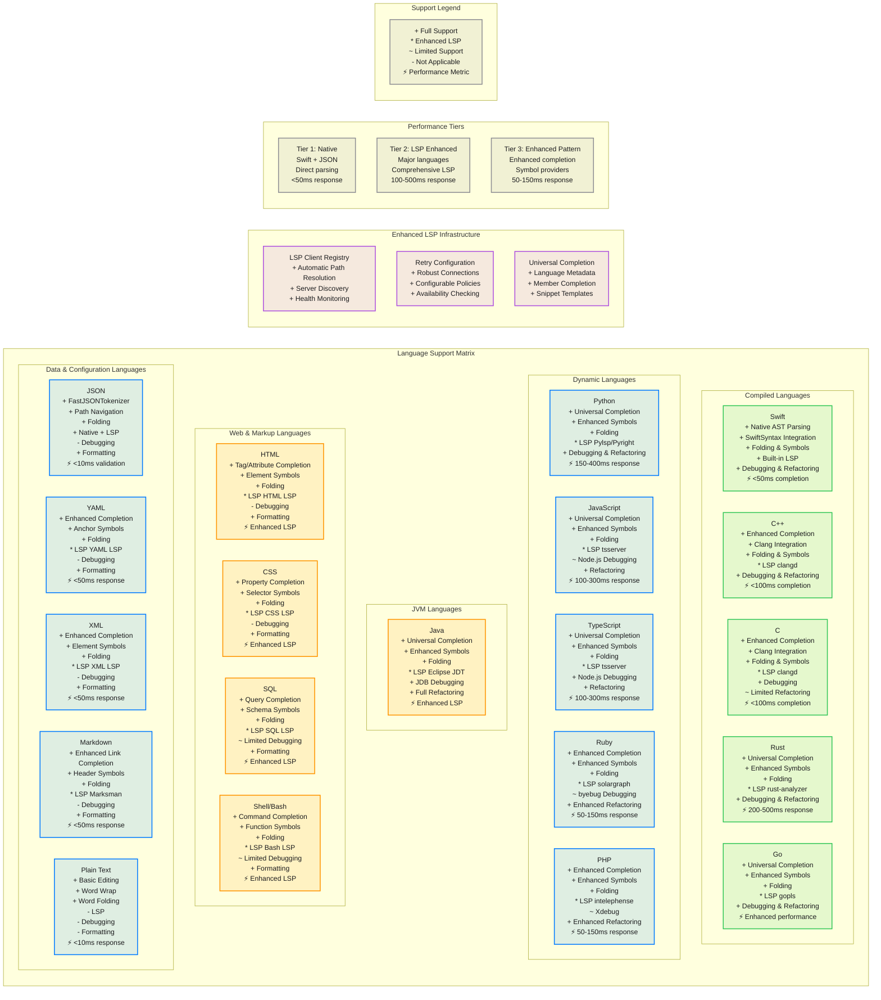

# Multi-Language Support Matrix

This diagram provides a comprehensive matrix view of language support capabilities across all 20 supported languages in the CodeEditorPlugin framework.

## Language Capability Details

```mermaid
classDiagram
    %% Language Support Classification
    class LanguageSupportMatrix {
        +supportedLanguages: [String: LanguageSupport]
        +capabilityMatrix: [String: [Capability: SupportLevel]]
        +lspIntegrations: [String: LSPIntegration]
        +debuggerMappings: [String: DebuggerType]
        +performanceMetrics: [String: PerformanceProfile]
        +getSupportLevel(language: String, capability: Capability) SupportLevel
        +getAvailableCapabilities(language: String) [Capability]
        +isLSPSupported(language: String) Bool
        +getDebuggerType(language: String) DebuggerType?
        +getPerformanceProfile(language: String) PerformanceProfile
    }

    class LanguageSupport {
        +languageId: String
        +displayName: String
        +fileExtensions: [String]
        +supportLevel: OverallSupportLevel
        +capabilities: [Capability: SupportLevel]
        +provider: LanguageProvider
        +metadata: LanguageMetadata
        +performanceProfile: PerformanceProfile
    }

    class SupportLevel {
        <<enumeration>>
        full
        enhanced
        external
        limited
        planned
        notApplicable
    }

    class Capability {
        <<enumeration>>
        syntaxHighlighting
        codeCompletion
        symbolNavigation
        codeFolding
        errorDetection
        debugging
        refactoring
        formatting
        lspIntegration
        schemaValidation
        livePreview
        memberCompletion
        snippetTemplates
    }

    class OverallSupportLevel {
        <<enumeration>>
        tier1_native
        tier2_lsp_enhanced
        tier3_enhanced_pattern
        tier4_basic
    }

    %% Enhanced Language Support Details
    class SwiftLanguageSupport {
        +swiftSyntaxIntegration: Bool
        +swiftPackageManager: Bool
        +xcodeIntegration: Bool
        +swiftUISupport: Bool
        +concurrencySupport: Bool
        +protocolOrientedFeatures: Bool
        +directASTCompletion: <50ms
        +universalCompletionProvider: UniversalCompletionProvider
    }

    class JSONLanguageSupport {
        +jsonSchemaSupport: Bool
        +jsonPathSupport: Bool
        +prettyFormatting: Bool
        +schemaGeneration: Bool
        +validationErrors: ValidationErrorSupport
        +fastJSONTokenizer: <10ms
        +universalCompletion: UniversalCompletionProvider
        +nativeParsing: Bool
    }

    class TypeScriptLanguageSupport {
        +typeChecking: Bool
        +interfaceSupport: Bool
        +decoratorSupport: Bool
        +moduleResolution: ModuleResolutionSupport
        +definitionFiles: Bool
        +enhancedLSPClient: LSPClientRegistry
        +memberCompletion: MemberCompletionProvider
        +responseTime: 100-300ms
    }

    class PythonLanguageSupport {
        +pipIntegration: Bool
        +virtualEnvSupport: Bool
        +jupyterNotebooks: Bool
        +typeHintSupport: Bool
        +asyncAwaitSupport: Bool
        +packageDiscovery: PackageDiscoverySupport
        +enhancedLSPClient: LSPClientRegistry
        +retryConfiguration: RetryConfigurationSystem
        +responseTime: 150-400ms
    }

    class RustLanguageSupport {
        +cargoIntegration: Bool
        +crateManagement: Bool
        +borrowChecker: Bool
        +traitSupport: Bool
        +macroExpansion: Bool
        +enhancedLSPClient: LSPClientRegistry
        +healthMonitoring: HealthMonitoringSystem
        +responseTime: 200-500ms
    }

    class HTMLLanguageSupport {
        +tagCompletion: Bool
        +attributeValidation: Bool
        +elementSymbols: Bool
        +semanticValidation: Bool
        +enhancedLSPClient: LSPClientRegistry
        +tagAttributeProvider: TagAttributeProvider
    }

    class CSSLanguageSupport {
        +propertyCompletion: Bool
        +selectorSymbols: Bool
        +colorPreview: Bool
        +mediaQuerySupport: Bool
        +enhancedLSPClient: LSPClientRegistry
        +propertyProvider: PropertyProvider
    }

    class SQLLanguageSupport {
        +queryCompletion: Bool
        +schemaValidation: Bool
        +tableSymbols: Bool
        +syntaxValidation: Bool
        +enhancedLSPClient: LSPClientRegistry
        +queryProvider: QueryProvider
    }

    class ShellLanguageSupport {
        +commandCompletion: Bool
        +functionSymbols: Bool
        +pathExpansion: Bool
        +variableSupport: Bool
        +enhancedLSPClient: LSPClientRegistry
        +commandProvider: CommandProvider
    }

    %% Enhanced LSP Infrastructure
    class LSPClientRegistry {
        +registeredServers: [String: LSPServerConfig]
        +automaticPathResolution: Bool
        +serverDiscovery: ServerDiscoveryService
        +healthMonitoring: HealthMonitoringService
        +resolveServerPath(language: String) String?
        +registerServer(config: LSPServerConfig) Bool
        +getServerHealth(language: String) HealthStatus
    }

    class RetryConfigurationSystem {
        +retryPolicies: [String: RetryPolicy]
        +connectionTimeout: TimeInterval
        +maxRetryAttempts: Int
        +backoffStrategy: BackoffStrategy
        +configureRetryPolicy(language: String, policy: RetryPolicy)
        +shouldRetry(error: LSPError) Bool
    }

    class UniversalCompletionProvider {
        +languageMetadata: [String: LanguageMetadata]
        +memberCompletionProviders: [String: MemberCompletionProvider]
        +snippetTemplateProviders: [String: SnippetTemplateProvider]
        +getCompletions(context: CompletionContext) [CompletionItem]
        +getMemberCompletions(symbol: Symbol) [MemberCompletion]
        +getSnippetTemplates(context: SnippetContext) [SnippetTemplate]
    }

    class EnhancedSymbolProvider {
        +symbolNavigation: SymbolNavigationProvider
        +foldingProviders: [String: FoldingProvider]
        +hierarchicalSymbols: Bool
        +crossLanguageNavigation: Bool
        +getSymbols(document: Document) [Symbol]
        +getFoldingRanges(document: Document) [FoldingRange]
        +navigateToSymbol(symbol: Symbol) NavigationResult
    }

    %% Performance Profiles
    class PerformanceProfile {
        +completionResponseTime: TimeInterval
        +symbolResolutionTime: TimeInterval
        +validationTime: TimeInterval
        +memoryUsage: MemoryMetric
        +tier: PerformanceTier
    }

    class PerformanceTier {
        <<enumeration>>
        native_fast
        lsp_enhanced
        pattern_enhanced
        basic_responsive
    }

    %% Relationships
    LanguageSupportMatrix --> LanguageSupport : contains
    LanguageSupport --> SupportLevel : categorized by
    LanguageSupport --> Capability : supports
    LanguageSupport --> OverallSupportLevel : classified as
    LanguageSupport --> PerformanceProfile : measured by

    LanguageSupport <|-- SwiftLanguageSupport : implements
    LanguageSupport <|-- JSONLanguageSupport : implements
    LanguageSupport <|-- TypeScriptLanguageSupport : implements
    LanguageSupport <|-- PythonLanguageSupport : implements
    LanguageSupport <|-- RustLanguageSupport : implements
    LanguageSupport <|-- HTMLLanguageSupport : implements
    LanguageSupport <|-- CSSLanguageSupport : implements
    LanguageSupport <|-- SQLLanguageSupport : implements
    LanguageSupport <|-- ShellLanguageSupport : implements

    LanguageSupport --> LSPClientRegistry : may use
    LanguageSupport --> UniversalCompletionProvider : provides
    LanguageSupport --> EnhancedSymbolProvider : uses

    LSPClientRegistry --> RetryConfigurationSystem : includes
    UniversalCompletionProvider --> EnhancedSymbolProvider : collaborates

    PerformanceProfile --> PerformanceTier : classified as

    %% Styling - Dark mode friendly colors
    classDef matrix fill:#007AFF20,stroke:#007AFF,stroke-width:3px,color:#1D1D1F
    classDef support fill:#AF52DE20,stroke:#AF52DE,stroke-width:2px,color:#1D1D1F
    classDef language fill:#34C75920,stroke:#34C759,stroke-width:2px,color:#1D1D1F
    classDef infrastructure fill:#FF950020,stroke:#FF9500,stroke-width:2px,color:#1D1D1F
    classDef performance fill:#8E8E9320,stroke:#8E8E93,stroke-width:2px,color:#1D1D1F
    classDef enum fill:#8E8E9320,stroke:#8E8E93,stroke-width:2px,color:#1D1D1F

    class LanguageSupportMatrix matrix
    class LanguageSupport support
    class SwiftLanguageSupport language
    class JSONLanguageSupport language
    class TypeScriptLanguageSupport language
    class PythonLanguageSupport language
    class RustLanguageSupport language
    class HTMLLanguageSupport language
    class CSSLanguageSupport language
    class SQLLanguageSupport language
    class ShellLanguageSupport language
    class LSPClientRegistry infrastructure
    class RetryConfigurationSystem infrastructure
    class UniversalCompletionProvider infrastructure
    class EnhancedSymbolProvider infrastructure
    class PerformanceProfile performance
    class SupportLevel enum
    class Capability enum
    class OverallSupportLevel enum
    class PerformanceTier enum
```

## Language Support Tiers

### Tier 1: Native Support (High Performance Integration)
- **Swift**: Complete native integration with SwiftSyntax, direct AST parsing, <50ms completion
- **JSON**: FastJSONTokenizer with native parsing, <10ms validation, universal completion provider

### Tier 2: LSP Enhanced (Comprehensive External Server Integration)
- **TypeScript/JavaScript**: Enhanced LSP with comprehensive client registry, 100-300ms response time
- **Python**: Enhanced LSP with retry configuration and health monitoring, 150-400ms response time
- **Rust**: Enhanced LSP with rust-analyzer and robust connection handling, 200-500ms response time
- **Go**: Enhanced LSP with gopls and automatic path resolution
- **Java**: Enhanced LSP with Eclipse JDT and universal completion provider
- **HTML/CSS**: Enhanced LSP with tag/property validation and dedicated providers
- **SQL**: Enhanced LSP with query validation and schema symbol support
- **Shell/Bash**: Enhanced LSP with command completion and function symbol navigation

### Tier 3: Enhanced Pattern-Based (Improved Completion and Symbol Providers)
- **Ruby**: Enhanced pattern matching with improved symbol providers and universal completion
- **PHP**: Enhanced pattern-based completion with member completion features
- **YAML**: Enhanced schema validation with improved folding and anchor symbol support
- **XML**: Enhanced element completion with symbol navigation and validation
- **Markdown**: Enhanced link resolution with snippet templates and header symbols

### Tier 4: Basic Support (Core Features)
- **Plain Text**: Basic editing with word wrap, word-based folding, and responsive performance

## Feature Comparison Matrix

| Language | Completion | Symbols | Folding | LSP | Debugging | Refactoring |
|----------|------------|---------|---------|-----|-----------|-------------|
| Swift | ✅ Native AST | ✅ Full | ✅ Full | ✅ Built-in | ✅ LLDB | ✅ Full |
| JavaScript | ✅ Universal | ✅ Enhanced | ✅ Full | ⚡ tsserver | ⚠️ Node.js | ✅ Full |
| TypeScript | ✅ Universal | ✅ Enhanced | ✅ Full | ⚡ tsserver | ✅ Node.js | ✅ Full |
| Python | ✅ Universal | ✅ Enhanced | ✅ Full | ⚡ Pylsp/Pyright | ✅ pdb | ✅ Full |
| Go | ✅ Universal | ✅ Enhanced | ✅ Full | ⚡ gopls | ✅ Delve | ✅ Full |
| Rust | ✅ Universal | ✅ Enhanced | ✅ Full | ⚡ rust-analyzer | ✅ GDB/LLDB | ✅ Full |
| C | ✅ Enhanced | ✅ Full | ✅ Full | ⚡ clangd | ✅ GDB/LLDB | ⚠️ Limited |
| C++ | ✅ Enhanced | ✅ Full | ✅ Full | ⚡ clangd | ✅ GDB/LLDB | ✅ Full |
| Java | ✅ Universal | ✅ Enhanced | ✅ Full | ⚡ Eclipse JDT | ✅ JDB | ✅ Full |
| HTML | ✅ Tag/Attr | ✅ Element | ✅ Full | ⚡ HTML LSP | ❌ N/A | ✅ Format |
| CSS | ✅ Property | ✅ Selector | ✅ Full | ⚡ CSS LSP | ❌ N/A | ✅ Format |
| SQL | ✅ Query | ✅ Schema | ✅ Full | ⚡ SQL LSP | ⚠️ Limited | ✅ Format |
| Shell | ✅ Command | ✅ Function | ✅ Full | ⚡ Bash LSP | ⚠️ Limited | ✅ Format |
| Ruby | ✅ Enhanced | ✅ Enhanced | ✅ Full | ⚡ Solargraph | ⚠️ byebug | ✅ Enhanced |
| PHP | ✅ Enhanced | ✅ Enhanced | ✅ Full | ⚡ Intelephense | ⚠️ Xdebug | ✅ Enhanced |
| JSON | ✅ FastToken | ✅ Path | ✅ Full | ✅ Native+LSP | ❌ N/A | ✅ Format |
| YAML | ✅ Enhanced | ✅ Anchor | ✅ Full | ⚡ YAML LSP | ❌ N/A | ✅ Format |
| XML | ✅ Enhanced | ✅ Element | ✅ Full | ⚡ XML LSP | ❌ N/A | ✅ Format |
| Markdown | ✅ Enhanced | ✅ Header | ✅ Full | ⚡ Marksman | ❌ N/A | ✅ Format |
| Plain Text | ✅ Basic | ❌ N/A | ✅ Word | ❌ N/A | ❌ N/A | ❌ N/A |

## Performance Characteristics

### High Performance Languages (Native Integration)
- **Swift**: Direct SwiftSyntax AST parsing, < 50ms completion response
- **JSON**: FastJSONTokenizer with native parsing, < 10ms validation
- **C/C++**: Clang-based parsing, < 100ms completion response

### Enhanced Performance Languages (LSP Enhanced Integration)
- **TypeScript**: Enhanced LSP with comprehensive client registry, 100-300ms response time
- **Python**: Enhanced LSP with retry configuration, 150-400ms response time
- **Rust**: rust-analyzer with health monitoring, 200-500ms response time
- **Go/Java/HTML/CSS/SQL/Shell**: Enhanced LSP infrastructure with automatic path resolution

### Optimized Performance Languages (Improved Pattern-Based)
- **Ruby/PHP**: Enhanced pattern matching with universal completion provider, 50-150ms response time
- **YAML/XML/Markdown**: Enhanced parsing with improved symbol providers, < 50ms response time
- **Plain Text**: Basic editing operations, < 10ms response time

## Enhanced LSP Infrastructure

### Comprehensive LSP Client Registry
- **Automatic Path Resolution**: Intelligent discovery of language server installations
- **Server Discovery**: Dynamic detection of available language servers
- **Health Monitoring**: Continuous monitoring of server availability and performance
- **Configuration Management**: Workspace and project-level server configurations

### Retry Configuration System
- **Robust Connection Handling**: Configurable retry policies for server connections
- **Timeout Management**: Intelligent timeout handling with backoff strategies
- **Error Recovery**: Automatic recovery from temporary server failures
- **Connection Pooling**: Efficient management of multiple server connections

### Universal Completion Provider
- **Language Metadata Support**: Rich metadata for enhanced completion contexts
- **Member Completion**: Advanced completion for object members and properties
- **Snippet Templates**: Code snippet generation with contextual templates
- **Cross-Language Integration**: Unified completion experience across all languages

### Enhanced Symbol Providers
- **Hierarchical Symbols**: Tree-based symbol navigation with nesting support
- **Cross-Reference Navigation**: Jump-to-definition and find-references across files
- **Improved Folding**: Advanced code folding with customizable fold points
- **Symbol Search**: Fast symbol lookup with fuzzy matching

## Extension Strategy

### Adding New Languages
1. **Assess Support Level**: Determine appropriate tier based on available tooling
2. **Implementation Path**: Choose native, enhanced LSP, or pattern-based approach
3. **Capability Mapping**: Define supported capabilities and performance targets
4. **Infrastructure Integration**: Leverage universal completion and symbol providers
5. **Testing Strategy**: Create comprehensive test suite with performance benchmarks

### Enhanced LSP Integration Process
1. **Comprehensive LSP Client Registry**: Automatic discovery and path resolution for language servers
2. **Retry Configuration System**: Robust connection handling with configurable retry policies
3. **Health Monitoring**: Continuous server availability checking and performance monitoring
4. **Workspace Management**: Support for both workspace and project-level language server configurations
5. **Universal Completion Provider**: Unified completion system with language metadata support
6. **Enhanced Symbol Providers**: Improved symbol navigation and folding capabilities across all languages
7. **Snippet Template Systems**: Advanced code completion with member completion features

## Emerging Language Roadmap

### Planned Language Support (Future Releases)
- **Zig**: Systems programming language with compile-time execution
- **Mojo**: AI-first programming language with Python compatibility
- **Odin**: Modern systems programming alternative to C
- **Carbon**: Experimental successor to C++ from Google

### Implementation Strategy
- **Phase 1**: Basic syntax highlighting and pattern-based completion
- **Phase 2**: LSP integration as language servers become available
- **Phase 3**: Enhanced completion and symbol providers
- **Phase 4**: Full debugging and refactoring support where applicable

## Benefits

1. **Comprehensive Coverage**: Support for 20 major programming languages with enhanced capabilities
2. **Performance Tiers**: Native integration for Swift/JSON, enhanced LSP for major languages, improved pattern-based for others
3. **Enhanced LSP Infrastructure**: Comprehensive client registry, retry configuration, and health monitoring
4. **Universal Completion System**: Unified completion provider with language metadata and member completion
5. **Robust Architecture**: Multiple integration approaches with enhanced symbol providers and folding capabilities
6. **Extensible Design**: Easy addition of new languages with snippet template systems
7. **Standards Compliant**: Enhanced LSP integration ensures compatibility with ecosystem tools
8. **Future Ready**: Emerging language roadmap including Zig, Mojo, Odin, and Carbon support
9. **Performance Optimized**: Appropriate performance targets for each language tier
10. **Consistent Experience**: Unified API and user experience across all supported languages