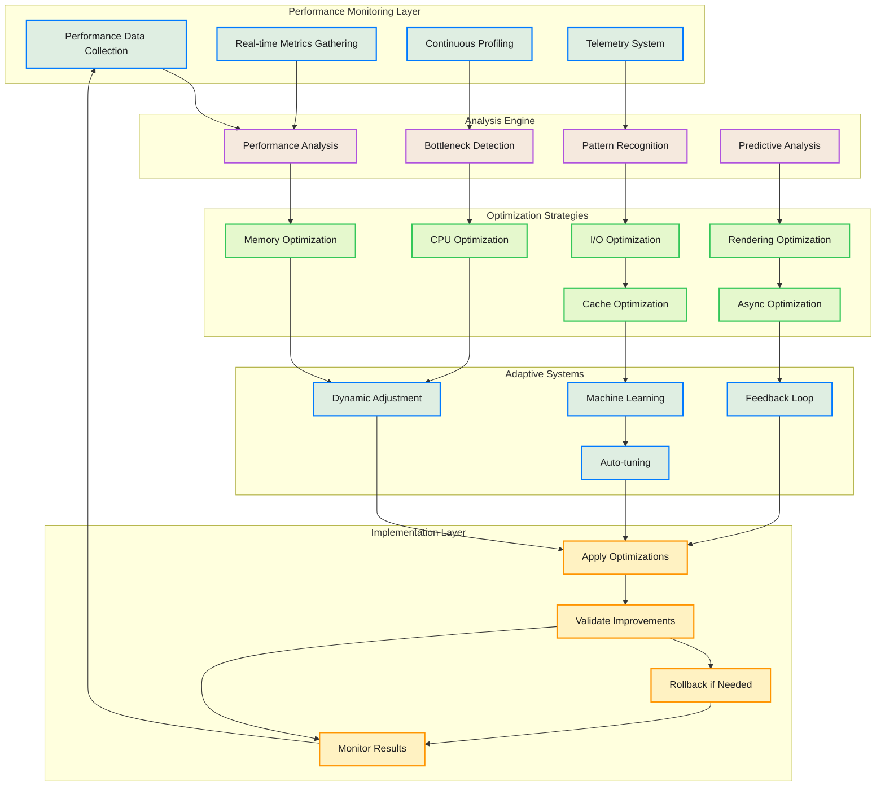
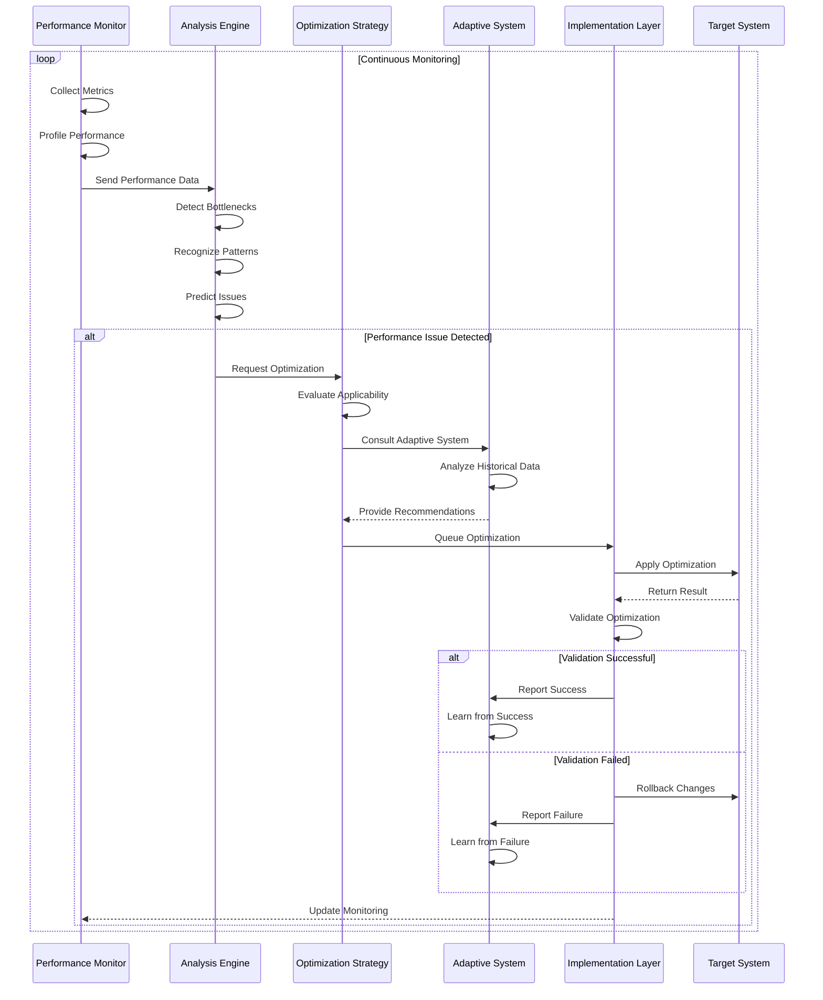

# Performance Optimization Pipeline

This diagram shows the comprehensive performance optimization pipeline that monitors, analyzes, and continuously optimizes performance across all aspects of the CodeEditorPlugin framework.

## Detailed Performance Architecture

```mermaid
classDiagram
    %% Core Performance System
    class PerformanceOptimizationPipeline {
        +monitoringSystem: PerformanceMonitoringSystem
        +analysisEngine: PerformanceAnalysisEngine
        +optimizationStrategies: [OptimizationStrategy]
        +adaptiveSystem: AdaptiveOptimizationSystem
        +implementationLayer: OptimizationImplementationLayer
        +initializePipeline()
        +startOptimization()
        +stopOptimization()
        +getPerformanceReport() PerformanceReport
    }

    %% Performance Monitoring System
    class PerformanceMonitoringSystem {
        +metricsCollector: MetricsCollector
        +profiler: ContinuousProfiler
        +telemetrySystem: TelemetrySystem
        +alertSystem: PerformanceAlertSystem
        +startMonitoring()
        +collectMetrics() PerformanceMetrics
        +generateProfile() ProfileData
        +sendTelemetry(data: TelemetryData)
    }

    class MetricsCollector {
        +cpuMetrics: CPUMetricsCollector
        +memoryMetrics: MemoryMetricsCollector
        +renderingMetrics: RenderingMetricsCollector
        +ioMetrics: IOMetricsCollector
        +networkMetrics: NetworkMetricsCollector
        +collectAllMetrics() AllMetrics
        +collectSpecificMetric(type: MetricType) Metric
        +scheduleCollection(interval: TimeInterval)
    }

    class ContinuousProfiler {
        +samplingRate: Double
        +activeProfiles: [ProfileSession]
        +callStackTracker: CallStackTracker
        +hotspotDetector: HotspotDetector
        +startProfiling(component: String)
        +stopProfiling(component: String) ProfileResult
        +analyzeProfile(result: ProfileResult) ProfileAnalysis
    }

    class TelemetrySystem {
        +telemetryProviders: [TelemetryProvider]
        +dataBuffer: TelemetryBuffer
        +privacyManager: TelemetryPrivacyManager
        +sendTelemetry(event: TelemetryEvent)
        +batchSendTelemetry(events: [TelemetryEvent])
        +configureTelemetry(settings: TelemetrySettings)
    }

    %% Performance Analysis Engine
    class PerformanceAnalysisEngine {
        +bottleneckDetector: BottleneckDetector
        +patternRecognizer: PerformancePatternRecognizer
        +predictiveAnalyzer: PredictivePerformanceAnalyzer
        +trendAnalyzer: PerformanceTrendAnalyzer
        +analyzePerformance(metrics: PerformanceMetrics) AnalysisResult
        +detectBottlenecks(profileData: ProfileData) [Bottleneck]
        +predictPerformanceIssues(trends: PerformanceTrends) [PredictedIssue]
    }

    class BottleneckDetector {
        +detectionThresholds: DetectionThresholds
        +algorithmSelector: AlgorithmSelector
        +statisticalAnalyzer: StatisticalAnalyzer
        +detectCPUBottlenecks(metrics: CPUMetrics) [CPUBottleneck]
        +detectMemoryBottlenecks(metrics: MemoryMetrics) [MemoryBottleneck]
        +detectIOBottlenecks(metrics: IOMetrics) [IOBottleneck]
        +detectRenderingBottlenecks(metrics: RenderingMetrics) [RenderingBottleneck]
    }

    class PerformancePatternRecognizer {
        +patternDatabase: PerformancePatternDatabase
        +machineLearningModel: MLPerformanceModel
        +featureExtractor: PerformanceFeatureExtractor
        +recognizePatterns(data: PerformanceData) [PerformancePattern]
        +learnNewPatterns(data: HistoricalPerformanceData)
        +classifyPerformanceIssue(symptoms: [Symptom]) IssueClassification
    }

    class PredictivePerformanceAnalyzer {
        +predictionModels: [PredictionModel]
        +timeSeriesAnalyzer: TimeSeriesAnalyzer
        +capacityPlanner: CapacityPlanner
        +predictFuturePerformance(currentMetrics: PerformanceMetrics) PerformancePrediction
        +predictResourceExhaustion(trends: ResourceTrends) ExhaustionPrediction
        +recommendPreventiveActions(prediction: PerformancePrediction) [PreventiveAction]
    }

    %% Optimization Strategies
    class OptimizationStrategy {
        <<protocol>>
        +strategyName: String
        +applicabilityConditions: [OptimizationCondition]
        +expectedImpact: ImpactEstimation
        +canApply(context: OptimizationContext) Bool
        +apply(context: OptimizationContext) OptimizationResult
        +rollback(context: OptimizationContext) RollbackResult
        +validateOptimization(result: OptimizationResult) ValidationResult
    }

    class MemoryOptimizationStrategy {
        +memoryPoolManager: MemoryPoolManager
        +garbageCollectionOptimizer: GCOptimizer
        +cacheOptimizer: CacheOptimizer
        +objectPoolManager: ObjectPoolManager
        +optimizeMemoryAllocation() MemoryOptimizationResult
        +optimizeGarbageCollection() GCOptimizationResult
        +optimizeCacheUsage() CacheOptimizationResult
        +manageObjectPools() ObjectPoolResult
    }

    class CPUOptimizationStrategy {
        +algorithmOptimizer: AlgorithmOptimizer
        +concurrencyOptimizer: ConcurrencyOptimizer
        +instructionOptimizer: InstructionOptimizer
        +loadBalancer: CPULoadBalancer
        +optimizeAlgorithms() AlgorithmOptimizationResult
        +optimizeConcurrency() ConcurrencyOptimizationResult
        +balanceLoad() LoadBalancingResult
        +reduceComputationalComplexity() ComplexityReductionResult
    }

    class RenderingOptimizationStrategy {
        +renderingPipeline: RenderingPipelineOptimizer
        +bufferOptimizer: BufferOptimizer
        +shaderOptimizer: ShaderOptimizer
        +viewportOptimizer: ViewportOptimizer
        +optimizeRenderingPipeline() RenderingOptimizationResult
        +optimizeBufferUsage() BufferOptimizationResult
        +optimizeViewportRendering() ViewportOptimizationResult
    }

    class IOOptimizationStrategy {
        +fileIOOptimizer: FileIOOptimizer
        +networkIOOptimizer: NetworkIOOptimizer
        +diskCacheOptimizer: DiskCacheOptimizer
        +compressionOptimizer: CompressionOptimizer
        +optimizeFileIO() FileIOOptimizationResult
        +optimizeNetworkIO() NetworkIOOptimizationResult
        +optimizeDiskCache() DiskCacheOptimizationResult
    }

    %% Adaptive Optimization System
    class AdaptiveOptimizationSystem {
        +dynamicAdjuster: DynamicPerformanceAdjuster
        +learningSystem: PerformanceLearningSystem
        +feedbackLoop: PerformanceFeedbackLoop
        +autoTuner: AutoTuningSystem
        +adaptOptimizations(currentState: PerformanceState) AdaptationResult
        +learnFromResults(results: [OptimizationResult])
        +processFeedback(feedback: PerformanceFeedback)
        +autoTuneParameters(parameters: [TuningParameter]) TuningResult
    }

    class DynamicPerformanceAdjuster {
        +adjustmentRules: [AdjustmentRule]
        +runtimeMonitor: RuntimePerformanceMonitor
        +thresholdManager: PerformanceThresholdManager
        +adjustPerformanceParameters(metrics: PerformanceMetrics) AdjustmentResult
        +dynamicallyScaleResources(demand: ResourceDemand) ScalingResult
        +balanceTradeoffs(tradeoffs: [PerformanceTradeoff]) BalancingResult
    }

    class PerformanceLearningSystem {
        +learningAlgorithm: ReinforcementLearningAlgorithm
        +experienceBuffer: ExperienceBuffer
        +rewardCalculator: PerformanceRewardCalculator
        +learnFromExperience(experience: PerformanceExperience)
        +updateOptimizationPolicy(results: [OptimizationResult])
        +generateOptimizationRecommendations() [OptimizationRecommendation]
    }

    class PerformanceFeedbackLoop {
        +feedbackCollector: FeedbackCollector
        +impactAnalyzer: OptimizationImpactAnalyzer
        +correlationAnalyzer: CorrelationAnalyzer
        +collectFeedback(optimization: AppliedOptimization) PerformanceFeedback
        +analyzeImpact(feedback: PerformanceFeedback) ImpactAnalysis
        +identifyCorrelations(feedbacks: [PerformanceFeedback]) [Correlation]
    }

    %% Implementation Layer
    class OptimizationImplementationLayer {
        +implementationQueue: OptimizationQueue
        +rollbackManager: RollbackManager
        +validationSystem: OptimizationValidationSystem
        +scheduleOptimization(optimization: PlannedOptimization)
        +applyOptimization(optimization: PlannedOptimization) ImplementationResult
        +validateOptimization(result: ImplementationResult) ValidationResult
        +rollbackOptimization(optimization: AppliedOptimization) RollbackResult
    }

    class OptimizationQueue {
        +queuedOptimizations: [QueuedOptimization]
        +prioritizer: OptimizationPrioritizer
        +scheduler: OptimizationScheduler
        +conflictResolver: OptimizationConflictResolver
        +enqueueOptimization(optimization: PlannedOptimization)
        +dequeueNextOptimization() PlannedOptimization?
        +resolvePriorityConflicts() ConflictResolutionResult
    }

    class RollbackManager {
        +rollbackStrategies: [RollbackStrategy]
        +snapshotManager: PerformanceSnapshotManager
        +changeTracker: OptimizationChangeTracker
        +createSnapshot(state: PerformanceState) PerformanceSnapshot
        +rollbackToSnapshot(snapshot: PerformanceSnapshot) RollbackResult
        +validateRollback(rollbackResult: RollbackResult) Bool
    }

    %% Performance Metrics and Data Types
    class PerformanceMetrics {
        +cpuMetrics: CPUMetrics
        +memoryMetrics: MemoryMetrics
        +renderingMetrics: RenderingMetrics
        +ioMetrics: IOMetrics
        +networkMetrics: NetworkMetrics
        +timestamp: Date
        +aggregatedScore: Double
    }

    class CPUMetrics {
        +cpuUsage: Double
        +coreUtilization: [Double]
        +instructionsPerSecond: UInt64
        +cacheHitRatio: Double
        +thermalState: ThermalState
    }

    class MemoryMetrics {
        +totalMemoryUsage: UInt64
        +peakMemoryUsage: UInt64
        +memoryPressure: MemoryPressure
        +allocationRate: UInt64
        +deallocationRate: UInt64
        +fragmentationLevel: Double
    }

    class RenderingMetrics {
        +frameRate: Double
        +renderTime: TimeInterval
        +gpuUtilization: Double
        +droppedFrames: UInt64
        +renderingLatency: TimeInterval
    }

    %% Relationships
    PerformanceOptimizationPipeline --> PerformanceMonitoringSystem : monitors with
    PerformanceOptimizationPipeline --> PerformanceAnalysisEngine : analyzes with
    PerformanceOptimizationPipeline --> OptimizationStrategy : applies
    PerformanceOptimizationPipeline --> AdaptiveOptimizationSystem : adapts with
    PerformanceOptimizationPipeline --> OptimizationImplementationLayer : implements with

    PerformanceMonitoringSystem --> MetricsCollector : collects with
    PerformanceMonitoringSystem --> ContinuousProfiler : profiles with
    PerformanceMonitoringSystem --> TelemetrySystem : reports with

    PerformanceAnalysisEngine --> BottleneckDetector : detects with
    PerformanceAnalysisEngine --> PerformancePatternRecognizer : recognizes with
    PerformanceAnalysisEngine --> PredictivePerformanceAnalyzer : predicts with

    OptimizationStrategy <|-- MemoryOptimizationStrategy : implements
    OptimizationStrategy <|-- CPUOptimizationStrategy : implements
    OptimizationStrategy <|-- RenderingOptimizationStrategy : implements
    OptimizationStrategy <|-- IOOptimizationStrategy : implements

    AdaptiveOptimizationSystem --> DynamicPerformanceAdjuster : adjusts with
    AdaptiveOptimizationSystem --> PerformanceLearningSystem : learns with
    AdaptiveOptimizationSystem --> PerformanceFeedbackLoop : feedback with

    OptimizationImplementationLayer --> OptimizationQueue : queues with
    OptimizationImplementationLayer --> RollbackManager : rollback with

    PerformanceMetrics --> CPUMetrics : includes
    PerformanceMetrics --> MemoryMetrics : includes  
    PerformanceMetrics --> RenderingMetrics : includes

    %% Styling - Dark mode friendly colors
    classDef pipeline fill:#007AFF20,stroke:#007AFF,stroke-width:3px,color:#1D1D1F
    classDef monitoring fill:#AF52DE20,stroke:#AF52DE,stroke-width:2px,color:#1D1D1F
    classDef analysis fill:#34C75920,stroke:#34C759,stroke-width:2px,color:#1D1D1F
    classDef strategy fill:#007AFF20,stroke:#007AFF,stroke-width:2px,color:#1D1D1F
    classDef adaptive fill:#FF950020,stroke:#FF9500,stroke-width:2px,color:#1D1D1F
    classDef implementation fill:#FF3B3020,stroke:#FF3B30,stroke-width:2px,color:#1D1D1F
    classDef metrics fill:#007AFF20,stroke:#007AFF,stroke-width:2px,color:#1D1D1F

    class PerformanceOptimizationPipeline pipeline
    class PerformanceMonitoringSystem monitoring
    class MetricsCollector monitoring
    class ContinuousProfiler monitoring
    class TelemetrySystem monitoring
    class PerformanceAnalysisEngine analysis
    class BottleneckDetector analysis
    class PerformancePatternRecognizer analysis
    class PredictivePerformanceAnalyzer analysis
    class OptimizationStrategy strategy
    class MemoryOptimizationStrategy strategy
    class CPUOptimizationStrategy strategy
    class RenderingOptimizationStrategy strategy
    class IOOptimizationStrategy strategy
    class AdaptiveOptimizationSystem adaptive
    class DynamicPerformanceAdjuster adaptive
    class PerformanceLearningSystem adaptive
    class PerformanceFeedbackLoop adaptive
    class OptimizationImplementationLayer implementation
    class OptimizationQueue implementation
    class RollbackManager implementation
    class PerformanceMetrics metrics
    class CPUMetrics metrics
    class MemoryMetrics metrics
    class RenderingMetrics metrics
```

## Performance Optimization Flow

## Key Performance Features

### 1. Comprehensive Monitoring
- **Real-time Metrics**: Continuous collection of CPU, memory, I/O, and rendering metrics
- **Continuous Profiling**: Always-on profiling with minimal overhead
- **Telemetry System**: Privacy-respecting telemetry for performance insights
- **Alert System**: Proactive alerts for performance degradation

### 2. Advanced Analysis
- **Bottleneck Detection**: Multi-algorithm bottleneck identification
- **Pattern Recognition**: ML-powered pattern recognition for performance issues
- **Predictive Analysis**: Forecast performance problems before they occur
- **Trend Analysis**: Long-term performance trend identification

### 3. Multi-Strategy Optimization
- **Memory Optimization**: Advanced memory management and allocation strategies
- **CPU Optimization**: Algorithm optimization and concurrency improvements
- **Rendering Optimization**: Graphics pipeline and viewport optimizations
- **I/O Optimization**: File system and network performance improvements

### 4. Adaptive Learning
- **Dynamic Adjustment**: Real-time parameter adjustment based on conditions
- **Machine Learning**: Reinforcement learning for optimization strategies
- **Feedback Loop**: Continuous improvement through result analysis
- **Auto-tuning**: Automatic parameter tuning for optimal performance

### 5. Safe Implementation
- **Rollback Management**: Safe rollback of failed optimizations
- **Validation System**: Comprehensive validation of optimization results
- **Conflict Resolution**: Intelligent resolution of optimization conflicts
- **Snapshot System**: Performance state snapshots for safe rollback

### 6. Performance Targets
- **60fps Rendering**: Maintain 60fps during all operations
- **Sub-100ms Response**: UI responsiveness under 100ms
- **Memory Efficiency**: Optimal memory usage with minimal fragmentation
- **Scalability**: Performance scales with document size and complexity

## Optimization Strategies

### Memory Optimization
- **Object Pooling**: Reuse objects to reduce allocation overhead
- **Memory Mapping**: Use memory-mapped files for large documents
- **Cache Optimization**: Intelligent caching with LRU eviction
- **Garbage Collection**: Optimize GC timing and frequency

### CPU Optimization  
- **Algorithm Selection**: Choose optimal algorithms based on data size
- **Concurrency**: Leverage multi-core processing effectively
- **Vectorization**: Use SIMD instructions for parallel operations
- **Load Balancing**: Distribute work across available cores

### Rendering Optimization
- **Viewport Culling**: Only render visible content
- **Batching**: Batch rendering operations to reduce overhead
- **Level of Detail**: Adjust rendering quality based on zoom level
- **Hardware Acceleration**: Leverage GPU for appropriate operations

### I/O Optimization
- **Asynchronous Operations**: Non-blocking I/O operations
- **Compression**: Compress data to reduce I/O overhead
- **Prefetching**: Anticipate and preload required data
- **Caching**: Cache frequently accessed data

## Benefits

1. **Continuous Improvement**: Performance automatically improves over time
2. **Proactive Optimization**: Problems are prevented before they impact users
3. **Adaptive Behavior**: System learns and adapts to usage patterns
4. **Safe Optimizations**: Comprehensive validation and rollback capabilities
5. **Comprehensive Coverage**: Optimizes all aspects of system performance
6. **Data-Driven Decisions**: Optimization decisions based on real performance data