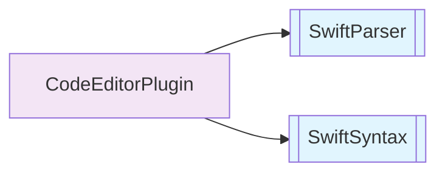
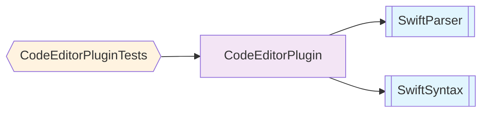
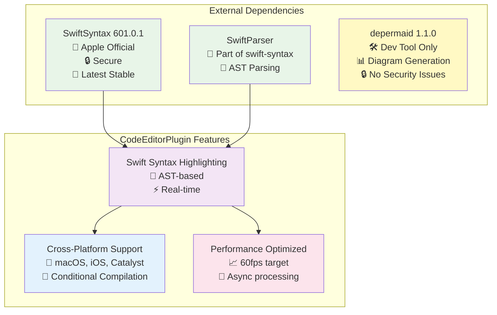

# Package Dependencies - CodeEditorPlugin

This diagram shows the package dependencies for the main CodeEditorPlugin framework.

## Overview

**Runtime Dependencies:**
- **SwiftSyntax 601.0.1** - Apple's Swift source code manipulation library
- **SwiftParser** - Swift source code parsing (part of swift-syntax)

**Development Dependencies:**
- **depermaid 1.1.0** - Mermaid diagram generation tool (build-time only)

**Security Status:** ✅ Low risk - Apple-maintained dependencies, no external services
**Platform Support:** macOS 14.0+, iOS 16.0+, Mac Catalyst 16.0+ (with SwiftSyntax fallbacks)

## Default View (Products Only)

## Complete View (Including Test Targets)

## Dependency Details

## Platform Compatibility Matrix

| Dependency | macOS | iOS | Mac Catalyst | Notes |
|------------|-------|-----|--------------|-------|
| SwiftSyntax | ✅ | ✅ | ❌ | Fallback implementation provided |
| SwiftParser | ✅ | ✅ | ❌ | Included with SwiftSyntax |
| depermaid | ✅ | ✅ | ✅ | Build-time only |

## Security & Performance Notes

**Security:**
- All dependencies maintained by Apple or have clean security profiles
- No network dependencies or external services
- Regular security updates available for SwiftSyntax
- depermaid is development-only with no runtime impact

**Performance:**
- SwiftSyntax provides efficient AST-based parsing
- Background processing prevents UI blocking
- Conditional compilation minimizes overhead on Mac Catalyst
- LRU caching for syntax highlighting results

**Dependency Injection:**
- ActorCoordinator injected via EditorConfiguration
- MemoryMonitor injected through configuration
- No singleton patterns used
- Full testability through protocol abstractions
