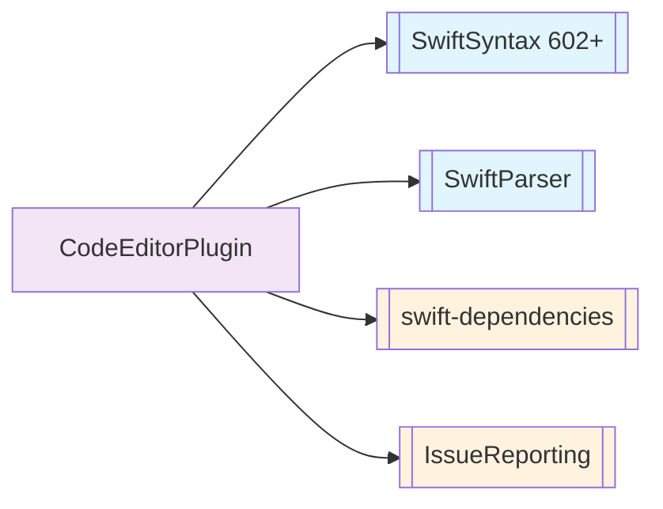
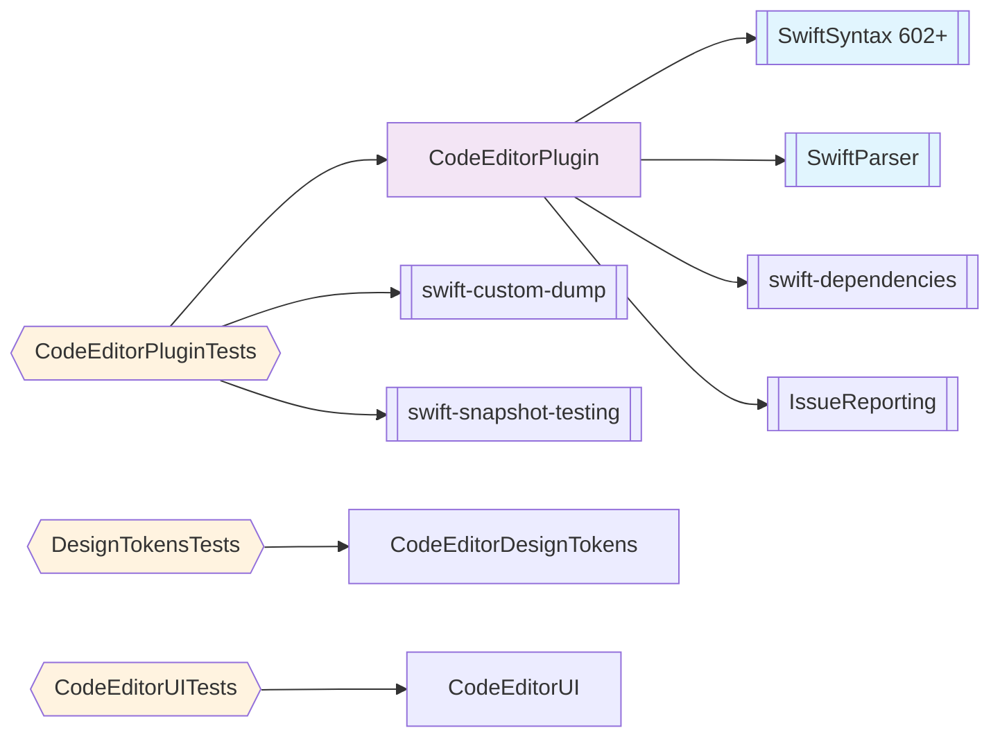

# Package Dependencies - CodeEditorPlugin

This diagram shows the package dependencies for the main CodeEditorPlugin framework.

## Overview

**Runtime Dependencies:**
- **SwiftSyntax 602.0.0+** - Apple's Swift source code manipulation library
- **SwiftParser** - Swift source code parsing (part of swift-syntax)
- **swift-dependencies** - Dependency management library (Point-Free)
- **xctest-dynamic-overlay** - Runtime issue reporting

**Development Dependencies:**
- **swift-custom-dump** - Custom pretty-printing and diffing (Point-Free)
- **swift-snapshot-testing** - Snapshot testing (Point-Free, ajmcclary fork for Swift 6.3 compat)

**Security Status:** Low risk - All dependencies from Apple or Point-Free
**Platform Support:** macOS 26.3+, iOS 26.3+, Mac Catalyst 26.3+

## Default View (Products Only)

## Complete View (Including Test Targets)

## Platform Compatibility Matrix

| Dependency | macOS | iOS | Mac Catalyst | Notes |
|------------|-------|-----|--------------|-------|
| SwiftSyntax | ✅ | ✅ | ✅ | 602.0.0+ |
| SwiftParser | ✅ | ✅ | ✅ | Included with SwiftSyntax |
| swift-dependencies | ✅ | ✅ | ✅ | Point-Free |
| IssueReporting | ✅ | ✅ | ✅ | xctest-dynamic-overlay |
| swift-custom-dump | ✅ | ✅ | ✅ | Test-only |
| swift-snapshot-testing | ✅ | ✅ | ✅ | Test-only, ajmcclary fork |

## Performance Notes

- SwiftSyntax provides efficient AST-based parsing
- Background processing via AsyncSyntaxHighlighter prevents UI blocking
- SmartTokenCache with LRU eviction for syntax highlighting results
- ActorCoordinator injected via EditorConfiguration for concurrency management
- MemoryMonitor injected through configuration for resource tracking
