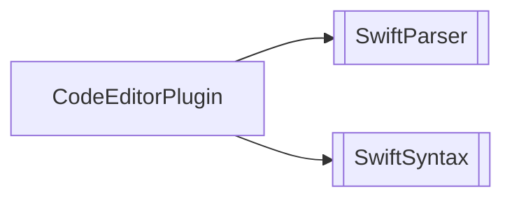
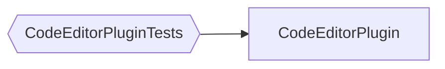

# Package Dependencies - CodeEditorPlugin

This diagram shows the package dependencies for the main CodeEditorPlugin framework.

## Default View (Products Only)

## Complete View (Including Test Targets)

## Horizontal Layout

