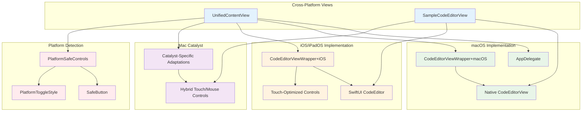
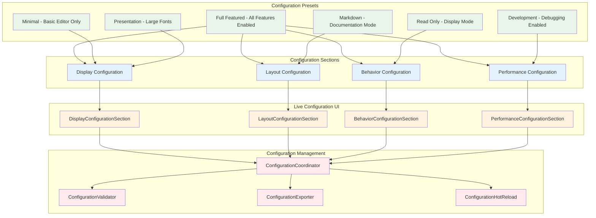

# CodeEditorSample App Dependencies Architecture

This diagram shows the comprehensive architecture and dependencies of the CodeEditorSample demonstration application.

## Overview

The CodeEditorSample app serves as a full-featured demonstration and testing ground for the CodeEditorPlugin, showcasing cross-platform implementation, advanced features, and best practices for integration.

## Core Dependencies and Architecture

```mermaid
flowchart TB
    subgraph "Sample Application"
        App[CodeEditorSampleApp]
        ContentView[UnifiedContentView]
        EditorView[SampleCodeEditorView]
        ConfigView[UnifiedConfigurationView]
        AdvancedView[AdvancedFeaturesShowcaseView]
    end

    subgraph "State Management"
        AppState[AppState]
        ConfigCoordinator[ConfigurationCoordinator]
        SampleStore[SampleCodeStore]
    end

    subgraph "Services Layer"
        AnnotationMgr[AnnotationManager]
        ConfigExporter[ConfigurationExporter]
        LangDetection[LanguageDetectionService]
        ThemeProvider[ThemeProvider]
    end

    subgraph "Model Layer"
        SwiftSamples[SwiftSamples]
        PythonSamples[PythonSamples]
        JavaSamples[JavaSamples]
        WebSamples[WebSamples]
        SystemsSamples[SystemsSamples]
        ConfigSamples[ConfigSamples]
    end

    subgraph "Core Framework"
        CodeEditorPlugin[CodeEditorPlugin]
        SwiftSyntax[SwiftSyntax]
    end

    subgraph "External Dependencies"
        Depermaid[depermaid]
    end

    subgraph "Testing Framework"
        BasicTests[BasicFunctionalityTests]
        ConfigTests[ConfigurationUITests]
        SampleTests[SampleCodeTests]
        IntegrationTests[SimplifiedIntegrationTests]
    end

    %% App Structure Dependencies
    App --> ContentView
    ContentView --> EditorView
    ContentView --> ConfigView
    ContentView --> AdvancedView

    %% State Management Dependencies
    ContentView --> AppState
    EditorView --> AppState
    ConfigView --> AppState
    AdvancedView --> AppState
    AppState --> ConfigCoordinator
    AppState --> SampleStore

    %% Service Dependencies
    AppState --> AnnotationMgr
    AppState --> ConfigExporter
    AppState --> LangDetection
    ContentView --> ThemeProvider

    %% Model Dependencies
    SampleStore --> SwiftSamples
    SampleStore --> PythonSamples
    SampleStore --> JavaSamples
    SampleStore --> WebSamples
    SampleStore --> SystemsSamples
    AppState --> ConfigSamples

    %% Core Framework Dependencies
    EditorView --> CodeEditorPlugin
    ConfigCoordinator --> CodeEditorPlugin
    AnnotationMgr --> CodeEditorPlugin
    LangDetection --> CodeEditorPlugin
    CodeEditorPlugin --> SwiftSyntax

    %% External Dependencies
    App --> Depermaid

    %% Testing Dependencies
    BasicTests --> CodeEditorPlugin
    ConfigTests --> CodeEditorPlugin
    SampleTests --> CodeEditorPlugin
    IntegrationTests --> CodeEditorPlugin
    BasicTests --> AppState
    ConfigTests --> AppState
    SampleTests --> SampleStore

    %% Styling
    classDef appLayer fill:#e1f5fe
    classDef stateLayer fill:#f3e5f5
    classDef serviceLayer fill:#e8f5e8
    classDef modelLayer fill:#fff3e0
    classDef coreLayer fill:#ffebee
    classDef testLayer fill:#f1f8e9

    class App,ContentView,EditorView,ConfigView,AdvancedView appLayer
    class AppState,ConfigCoordinator,SampleStore stateLayer
    class AnnotationMgr,ConfigExporter,LangDetection,ThemeProvider serviceLayer
    class SwiftSamples,PythonSamples,JavaSamples,WebSamples,SystemsSamples,ConfigSamples modelLayer
    class CodeEditorPlugin,SwiftSyntax,Depermaid coreLayer
    class BasicTests,ConfigTests,SampleTests,IntegrationTests testLayer
```

## Platform-Specific Implementation Details

## Sample Code Demonstration Matrix

```mermaid
flowchart TB
    subgraph "Language Support (20+ Languages)"
        Swift[Swift - SwiftUI, Concurrency, Generics]
        JavaScript[JavaScript - ES6+, React, Node.js]
        TypeScript[TypeScript - Types, Interfaces, Decorators]
        Python[Python - Classes, Decorators, Async/Await]
        Go[Go - Goroutines, Channels, Interfaces]
        Rust[Rust - Ownership, Traits, Macros]
        Java[Java - Classes, Generics, Streams]
        CPP[C++ - Templates, STL, RAII]
        HTML[HTML - Semantic Tags, Forms, Accessibility]
        CSS[CSS - Grid, Flexbox, Animations]
        JSON[JSON - Structured Data, APIs]
        Markdown[Markdown - Documentation, Tables, Code Blocks]
        YAML[YAML - Configuration, Docker, Kubernetes]
        XML[XML - Schema, Namespaces, Validation]
        SQL[SQL - Queries, Joins, Procedures]
        Ruby[Ruby - Metaprogramming, Blocks, Rails]
        PHP[PHP - OOP, Namespaces, Composer]
        Shell[Shell - Bash, Zsh, Scripting]
        PlainText[Plain Text - Configuration, Logs]
    end

    subgraph "Feature Demonstrations"
        SyntaxHL[Syntax Highlighting - Live Preview]
        LineNumbers[Line Numbers - Toggle Support]
        CodeFolding[Code Folding - Brace/Indent Based]
        Completion[Code Completion - Context-Aware]
        Annotations[Annotations - TODO/FIXME/ERROR]
        Minimap[Minimap - Navigation Aid]
        Search[Search & Replace - Regex Support]
        Themes[Theme System - Light/Dark/Custom]
        Performance[Performance - Large File Support]
        Memory[Memory Management - Monitoring]
    end

    subgraph "Advanced Features"
        MultiCursor[Multi-Cursor Editing]
        SmartEditing[Smart Editing - Auto-Indent]
        SymbolNav[Symbol Navigation - Jump to Definition]
        LSPIntegration[LSP Integration - Language Servers]
        Debugging[Debug Integration - Breakpoints]
        VimMode[Vim Mode - Modal Editing]
        KeyBindings[Custom Key Bindings]
        Plugins[Plugin System - Extensibility]
    end

    %% Language to Feature Mapping
    Swift --> SyntaxHL
    JavaScript --> Completion
    TypeScript --> SymbolNav
    Python --> LSPIntegration
    Go --> Performance
    Java --> Debugging
    Rust --> Memory
    HTML --> CodeFolding
    CSS --> Themes
    Markdown --> Annotations

    %% Feature Interconnections
    SyntaxHL --> Themes
    LineNumbers --> Minimap
    CodeFolding --> SymbolNav
    Completion --> LSPIntegration
    Search --> MultiCursor
    Performance --> Memory
    SmartEditing --> VimMode
    Debugging --> Plugins

    %% Advanced Feature Dependencies
    MultiCursor --> SmartEditing
    SymbolNav --> LSPIntegration
    LSPIntegration --> Debugging
    VimMode --> KeyBindings
    KeyBindings --> Plugins

    %% Styling
    classDef languages fill:#e8f5e8
    classDef basicFeatures fill:#e3f2fd
    classDef advancedFeatures fill:#fff3e0

    class Swift,JavaScript,TypeScript,Python,Go,Rust,Java,CPP,HTML,CSS,JSON,Markdown,YAML,XML,SQL,Ruby,PHP,Shell,PlainText languages
    class SyntaxHL,LineNumbers,CodeFolding,Completion,Annotations,Minimap,Search,Themes,Performance,Memory basicFeatures
    class MultiCursor,SmartEditing,SymbolNav,LSPIntegration,Debugging,VimMode,KeyBindings,Plugins advancedFeatures
```

## Configuration System Integration

## Testing Architecture

```mermaid
flowchart TB
    subgraph "Unit Tests"
        BasicTests[BasicFunctionalityTests]
        ConfigTests[ConfigurationUITests]
        SampleTests[SampleCodeTests]
        IntegrationTests[SimplifiedIntegrationTests]
        FlipTest[QuickIsFlippedTest]
    end

    subgraph "Test Coverage Areas"
        CoreFunctionality[Core Editor Functionality]
        UIComponents[UI Component Testing]
        Configuration[Configuration Management]
        SampleCode[Sample Code Validation]
        CrossPlatform[Cross-Platform Compatibility]
    end

    subgraph "Test Utilities"
        TestHelpers[Test Helper Methods]
        MockData[Mock Sample Data]
        ConfigFixtures[Configuration Fixtures]
        PlatformMocks[Platform-Specific Mocks]
    end

    subgraph "Performance Testing"
        MemoryTests[Memory Leak Detection]
        PerformanceTests[Performance Benchmarks]
        StressTests[Stress Testing]
        ConcurrencyTests[Concurrency Safety]
    end

    %% Test to Coverage Mapping
    BasicTests --> CoreFunctionality
    ConfigTests --> UIComponents
    ConfigTests --> Configuration
    SampleTests --> SampleCode
    IntegrationTests --> CrossPlatform
    FlipTest --> CoreFunctionality

    %% Test Utilities Dependencies
    BasicTests --> TestHelpers
    ConfigTests --> ConfigFixtures
    SampleTests --> MockData
    IntegrationTests --> PlatformMocks

    %% Performance Testing Dependencies
    BasicTests --> MemoryTests
    IntegrationTests --> PerformanceTests
    ConfigTests --> StressTests
    BasicTests --> ConcurrencyTests

    %% Styling
    classDef unitTests fill:#e8f5e8
    classDef coverage fill:#e3f2fd
    classDef utilities fill:#fff3e0
    classDef performance fill:#ffebee

    class BasicTests,ConfigTests,SampleTests,IntegrationTests,FlipTest unitTests
    class CoreFunctionality,UIComponents,Configuration,SampleCode,CrossPlatform coverage
    class TestHelpers,MockData,ConfigFixtures,PlatformMocks utilities
    class MemoryTests,PerformanceTests,StressTests,ConcurrencyTests performance
```

## Key Features Demonstrated

### 1. **Cross-Platform Support**
- **macOS**: Native NSView integration with full feature support
- **iOS/iPadOS**: Touch-optimized SwiftUI interface with adaptive layouts
- **Mac Catalyst**: Hybrid experience combining desktop and touch paradigms

### 2. **Language Support Matrix**
- **20+ Programming Languages** with syntax highlighting and completion
- **Sample Code Library** with real-world examples for each language
- **Automatic Language Detection** based on file extensions and content

### 3. **Advanced Feature Showcase**
- **Multi-cursor editing** and smart text manipulation
- **Symbol navigation** with jump-to-definition support
- **LSP integration** for language server protocol support
- **Debug integration** with breakpoint and variable inspection
- **Performance monitoring** with real-time metrics

### 4. **Configuration System**
- **Live configuration updates** without editor recreation
- **Preset system** with predefined editor configurations
- **Export/import functionality** for sharing configurations
- **Validation system** ensuring configuration consistency

### 5. **Testing Integration**
- **Comprehensive test suite** covering core functionality
- **Cross-platform testing** ensuring consistency across platforms
- **Performance benchmarks** validating editor performance
- **Memory leak detection** preventing resource leaks

## Architecture Benefits

1. **Separation of Concerns**: Clean architecture with distinct layers for UI, state management, and business logic
2. **Platform Abstraction**: Unified API that adapts to platform-specific implementations
3. **Extensibility**: Plugin system and configuration framework for customization
4. **Performance**: Optimized for large files with viewport-based rendering
5. **Testability**: Comprehensive test coverage with modular design
6. **Maintainability**: Well-documented code with consistent patterns

The sample application serves as both a demonstration of capabilities and a reference implementation for best practices when integrating the CodeEditorPlugin into production applications.