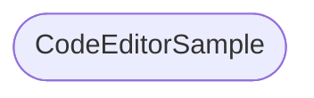
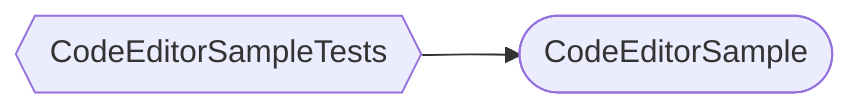
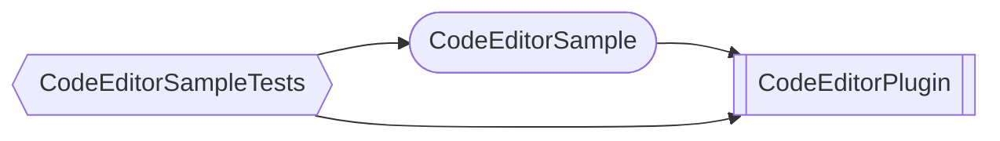

# Package Dependencies - CodeEditorSample

This diagram shows the package dependencies for the CodeEditorSample demonstration app.

## Default View (Executable and Dependencies)

## Complete View (Including Test Targets)

## Horizontal Layout with All Components

