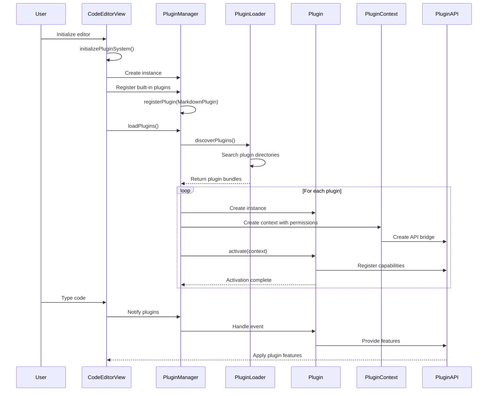

# Plugin System Architecture (Design Document)

> **Note:** The plugin system is a future design feature. No `PluginManager`, `PluginAPI`, `PluginContext`, or `MarkdownPlugin` classes currently exist in the codebase. This diagram represents the planned architecture for a plugin-based extensibility layer. Implementation work has not yet begun.

This diagram shows the planned plugin system architecture that provides extensibility, security, and lifecycle management for third-party and built-in plugins within the CodeEditorPlugin framework.

```mermaid
classDiagram
    direction LR
    
    %% Top Row - Core Plugin Components
    class Plugin {
        <<protocol>>
        +identifier String$
        +metadata PluginMetadata
        +init()
        +activate(context) async throws
        +deactivate(context) async throws
        +saveState() async PluginState
        +restoreState(state) async
    }

    class PluginMetadata {
        <<value type>>
        +identifier String
        +name String
        +version String
        +author String
        +description String
        +website URL?
        +supportedPlatforms [PluginPlatform]
        +requiredPermissions [PluginPermission]
        +dependencies [PluginDependency]
        +minimumEditorVersion String
        +enabledByDefault Bool
    }

    class PluginState {
        <<persistence>>
        +strings [String: String]
        +booleans [String: Bool]
        +integers [String: Int]
        +doubles [String: Double]
        +data [String: Data]
        +stringArrays [String: [String]]
        +lastSaved Date
    }

    %% Second Row - Plugin Management
    class PluginManager {
        <<@MainActor>>
        -plugins [String: PluginInstance]
        -contexts [String: PluginContext]
        -commands [String: [PluginCommand: Handler]]
        -loadOrder [String]
        -statePersistence PluginStatePersistence
        +registerPlugin(type) async throws
        +loadPlugins() async
        +activatePlugin(identifier) async throws
        +deactivatePlugin(identifier) async throws
        +getPlugin(identifier) Plugin?
        +isPluginActive(identifier) Bool
    }

    class PluginContext {
        <<@MainActor>>
        +languageRegistry LanguageRegistry
        +completionRegistry CompletionProviderRegistry
        +configuration EditorConfiguration
        +eventSystem UnifiedEventSystem
        +logger CrossPlatformLogger.Logger
        +permissions Set~PluginPermission~
        +pluginIdentifier String
        +workspace PluginWorkspace
        +api PluginAPI
        +hasPermission(permission) Bool
    }

    class PluginLoader {
        <<discovery>>
        -searchPaths [URL]
        -bundleCache [String: PluginBundle]
        +discoverPlugins() async [PluginBundle]
        +loadBundle(url) async throws PluginBundle
        +validateBundle(bundle) throws
        +extractMetadata(bundle) PluginMetadata
    }

    %% Third Row - Plugin API
    class PluginAPI {
        <<@MainActor protocol>>
        +apiVersion String
        +languages LanguageAPI
        +completion CompletionAPI
        +commands CommandAPI
        +themes ThemeAPI
        +editor EditorAPI
        +fileSystem FileSystemAPI
        +diagnostics DiagnosticAPI
    }

    class PluginAPIBridge {
        <<@MainActor>>
        -context PluginContext
        +languages LanguageAPIImpl
        +completion CompletionAPIImpl
        +commands CommandAPIImpl
        +themes ThemeAPIImpl
        +editor EditorAPIImpl
        +fileSystem FileSystemAPIImpl
        +diagnostics DiagnosticAPIImpl
    }

    class LanguageAPI {
        <<@MainActor protocol>>
        +registerHighlighter(highlighter, language) async throws
        +unregisterHighlighter(language) async throws
        +availableLanguages() async [Language]
        +registerLanguageConfiguration(config, language) async throws
    }

    %% Fourth Row - Security & Permissions
    class PluginPermission {
        <<enumeration>>
        languages
        completion
        commands
        themes
        editor
        fileSystem
        diagnostics
        all
    }

    class PluginWorkspace {
        <<@unchecked Sendable>>
        +workingDirectory URL
        +documentsDirectory URL
        +cacheDirectory URL
        +temporaryDirectory URL
        +read(path) async throws Data
        +write(path, data) async throws
        +exists(path) async Bool
        +createDirectory(path) async throws
    }

    class PluginLifecycleState {
        <<enumeration>>
        unloaded
        loaded
        activating
        active
        deactivating
        failed
    }

    %% Fifth Row - Plugin Events
    class PluginEvent {
        <<protocol>>
        +eventId UUID
        +eventTimestamp Date
    }

    class PluginLifecycleEvent {
        <<event>>
        +eventType LifecycleEventType
        +pluginId String
    }
    
    class LifecycleEventType {
        <<enumeration>>
        activated
        deactivated
        failed
    }

    class PluginDiagnosticEvent {
        <<event>>
        +pluginId String
        +diagnostics [PluginDiagnostic]
    }

    %% Sixth Row - Built-in Plugins
    class MarkdownPlugin {
        <<built-in plugin>>
        -state InternalState
        +identifier "markdown-support"$
        +metadata PluginMetadata
        +activate(context) async throws
        +deactivate(context) async throws
        +provideMarkdownCompletion()
        +handleMarkdownFormatting()
    }

    class PluginMarkdownCompletionProvider {
        <<completion provider>>
        +id "plugin-markdown"
        +supportedLanguages [.markdown]
        +provideCompletions(context) async throws
        +generateSnippets()
        +provideLinkCompletion()
    }

    %% Seventh Row - Supporting Types
    class PluginInstance {
        <<runtime container>>
        +plugin Plugin
        +state PluginLifecycleState
        +metadata PluginMetadata
        +activationTime Date?
        +errorCount Int
    }

    class PluginCommand {
        <<command definition>>
        +identifier String
        +title String
        +category String?
        +shortcut String?
        +handler () async throws Void
    }

    class PluginError {
        <<error types>>
        incompatibleVersion
        missingDependency
        activationFailed
        deactivationFailed
        unsupportedPlatform
        invalidMetadata
        alreadyRegistered
        notFound
        securityViolation
    }

    %% Bottom Row - Integration Points
    class CodeEditorView {
        <<integration>>
        +pluginManager PluginManager?
        +initializePluginSystem()
        -registerBuiltInPlugins()
    }

    class EditorConfiguration {
        <<extended>>
        +eventSystem UnifiedEventSystem?
        +actorCoordinator ActorCoordinator?
        +allowedPlugins Set~String~
        +pluginSettings [String: Any]
    }

    class PluginStatePersistence {
        <<persistence>>
        -storageURL URL
        +save(state, pluginId) async throws
        +load(pluginId) async throws PluginState?
        +delete(pluginId) async throws
        +listSavedStates() async [String]
    }

    class PluginDiscoveryView {
        <<SwiftUI>>
        +availablePlugins [PluginInfo]
        +loadPlugins() async
        +togglePlugin(plugin) async
        +applyChanges() async
    }

    %% Relationships
    Plugin <|.. MarkdownPlugin : implements
    Plugin --> PluginMetadata : has
    Plugin --> PluginState : saves/restores
    
    PluginManager *-- PluginInstance : manages
    PluginManager --> PluginContext : creates
    PluginManager --> PluginLoader : uses
    PluginManager --> PluginStatePersistence : uses
    
    PluginContext --> PluginAPI : provides
    PluginContext --> PluginPermission : enforces
    PluginContext --> PluginWorkspace : includes
    
    PluginAPI <|.. PluginAPIBridge : implements
    PluginAPIBridge --> PluginContext : uses
    PluginAPIBridge *-- LanguageAPI : includes
    
    PluginInstance --> Plugin : contains
    PluginInstance --> PluginLifecycleState : tracks
    
    PluginEvent <|.. PluginLifecycleEvent : implements
    PluginEvent <|.. PluginDiagnosticEvent : implements
    PluginLifecycleEvent --> LifecycleEventType : uses
    
    MarkdownPlugin --> PluginMarkdownCompletionProvider : creates
    
    CodeEditorView --> PluginManager : uses
    EditorConfiguration --> PluginManager : configures
    PluginDiscoveryView --> PluginManager : manages
    
    %% Styling - Light/Dark mode compatible colors
    classDef protocol fill:#34C75920,stroke:#34C759,stroke-width:2px,color:#1D1D1F
    classDef core fill:#007AFF20,stroke:#007AFF,stroke-width:3px,color:#1D1D1F
    classDef api fill:#AF52DE20,stroke:#AF52DE,stroke-width:2px,color:#1D1D1F
    classDef security fill:#FF3B3020,stroke:#FF3B30,stroke-width:2px,color:#1D1D1F
    classDef event fill:#FF950020,stroke:#FF9500,stroke-width:2px,color:#1D1D1F
    classDef plugin fill:#34C75920,stroke:#34C759,stroke-width:2px,color:#1D1D1F
    classDef support fill:#8E8E9320,stroke:#8E8E93,stroke-width:2px,color:#1D1D1F
    classDef integration fill:#007AFF20,stroke:#007AFF,stroke-width:2px,color:#1D1D1F
    classDef enum fill:#8E8E9320,stroke:#8E8E93,stroke-width:2px,color:#1D1D1F
    
    class Plugin protocol
    class PluginAPI protocol
    class LanguageAPI protocol
    class PluginEvent protocol
    class PluginManager core
    class PluginContext core
    class PluginAPIBridge api
    class PluginPermission security
    class PluginWorkspace security
    class PluginLifecycleEvent event
    class PluginDiagnosticEvent event
    class LifecycleEventType enum
    class MarkdownPlugin plugin
    class PluginMarkdownCompletionProvider plugin
    class PluginMetadata support
    class PluginState support
    class PluginInstance support
    class PluginCommand support
    class PluginError support
    class PluginLifecycleState enum
    class PluginLoader support
    class PluginStatePersistence support
    class CodeEditorView integration
    class EditorConfiguration integration
    class PluginDiscoveryView integration
```



## Plugin System Flow



## Key Features

### 1. Security Model
- **Permission-based access**: Plugins must declare required permissions
- **Sandboxed file access**: Plugins can only access designated workspace
- **API access control**: Context enforces permission checks
- **Secure state persistence**: Isolated storage per plugin

### 2. Lifecycle Management
- **Async activation/deactivation**: Non-blocking plugin operations
- **State persistence**: Plugins can save/restore state between sessions
- **Dependency resolution**: Automatic ordering based on dependencies
- **Error recovery**: Failed plugins don't crash the editor

### 3. Extensibility Points
- **Language support**: Add syntax highlighters and language configurations
- **Code completion**: Register custom completion providers
- **Commands**: Add editor commands with keyboard shortcuts
- **Themes**: Provide custom color themes
- **Diagnostics**: Report errors and warnings
- **File operations**: Controlled file system access

### 4. Built-in Plugins
- **Markdown Support**: Complete implementation with commands and completion
- **Plugin Discovery UI**: SwiftUI-based plugin management interface
- **Future plugins**: TypeScript, Python, and other language-specific features

## Design Principles

1. **Safety First**: Plugins cannot access system resources without permission
2. **Performance**: Async operations prevent blocking the UI
3. **Isolation**: Plugin failures are contained and reported
4. **Flexibility**: Rich API surface for various plugin types
5. **Discoverability**: Automatic plugin discovery and loading
6. **User Control**: Users decide which plugins to activate

## Current Implementation Status

### ✅ Fully Implemented Features

1. **Core Plugin Infrastructure**
   - Complete `Plugin` protocol with lifecycle management
   - Comprehensive `PluginMetadata` system with capabilities and dependencies
   - Robust `PluginManager` with dependency resolution and error handling
   - Secure `PluginContext` with permission-based access control

2. **Plugin Discovery and Loading**
   - `PluginLoader` with multi-path bundle discovery
   - Support for `.codeeditorplugin` bundle format with JSON manifests
   - Plugin installation/uninstallation with user directory management
   - Code signing verification infrastructure (debug/release configurations)

3. **Security Model**
   - Permission system with fine-grained access control
   - Sandboxed plugin workspace with isolated storage
   - API access validation through context permissions
   - Secure state persistence with JSON serialization

4. **API Surface**
   - Comprehensive `PluginAPI` with specialized sub-APIs
   - `PluginAPIBridge` providing stable implementation
   - Language, completion, command, theme, editor, filesystem, and diagnostic APIs
   - Cross-platform compatibility (macOS, iOS, Catalyst, visionOS)

5. **Built-in Plugin System**
   - Complete `MarkdownPlugin` implementation with commands and completion
   - Plugin command registration and execution
   - Integration with existing completion provider registry
   - SwiftUI-based plugin discovery and management interface

6. **Event System**
   - Plugin lifecycle events (activation, deactivation, failures)
   - Diagnostic event reporting
   - Command execution events
   - Discovery and loading events

### ⚠️ Partially Implemented Features

1. **Editor API Integration**
   - Editor API methods exist but are mostly placeholders
   - Need connection to actual `CodeEditorView` instances for text manipulation
   - Missing real-time text change notifications to plugins

2. **Theme System Integration**
   - Theme API exists but integration with main editor theming is incomplete
   - Need bidirectional connection with existing `EditorTheme` system
   - Theme application and switching needs implementation

3. **Language Server Protocol Support**
   - LSP capability declared but implementation is incomplete
   - Missing actual connection to language servers through plugins
   - Network permission exists but LSP client integration needed

### ❌ Missing Features

1. **Comprehensive Testing**
   - No plugin system tests found in the test suite
   - Need unit tests for plugin lifecycle, security, and API functionality
   - Missing integration tests for plugin loading and execution

2. **Plugin Marketplace Integration**
   - No remote plugin registry or discovery mechanism
   - Missing plugin update and version management
   - No plugin rating or review system

3. **Advanced Plugin Features**
   - No hot-reloading support for development
   - Missing plugin debugging and profiling tools
   - No plugin-to-plugin communication mechanism

### 🔧 Recommended Improvements

1. **Add Comprehensive Test Coverage**
   ```swift
   // Add tests for plugin lifecycle, security, and API functionality
   class PluginSystemTests, PluginSecurityTests, PluginAPITests
   ```

2. **Complete Editor API Integration**
   ```swift
   // Connect Editor API to actual CodeEditorView instances
   // Implement real-time text change notifications
   ```

3. **Enhance Plugin Development Experience**
   ```swift
   // Add plugin hot-reloading for development
   // Create plugin debugging and profiling tools
   ```

4. **Implement Plugin Marketplace**
   ```swift
   // Add remote plugin discovery and installation
   // Implement plugin update mechanism
   ```

## Architecture Quality Assessment

The plugin system demonstrates **excellent architectural quality**:

- **Security**: ✅ Permission-based access with sandboxing
- **Performance**: ✅ Async operations with proper resource management
- **Maintainability**: ✅ Clean separation of concerns and well-documented APIs
- **Extensibility**: ✅ Rich API surface for various plugin types
- **Cross-platform**: ✅ Full Apple platform support
- **Error Handling**: ✅ Comprehensive error types with recovery
- **State Management**: ✅ Persistent state with proper serialization
- **Documentation**: ✅ Extensive inline documentation and examples

The implementation closely matches industry best practices for plugin systems and provides a solid foundation for third-party extensibility.