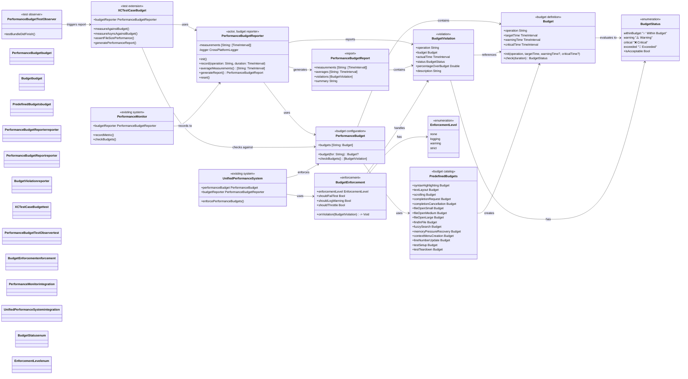
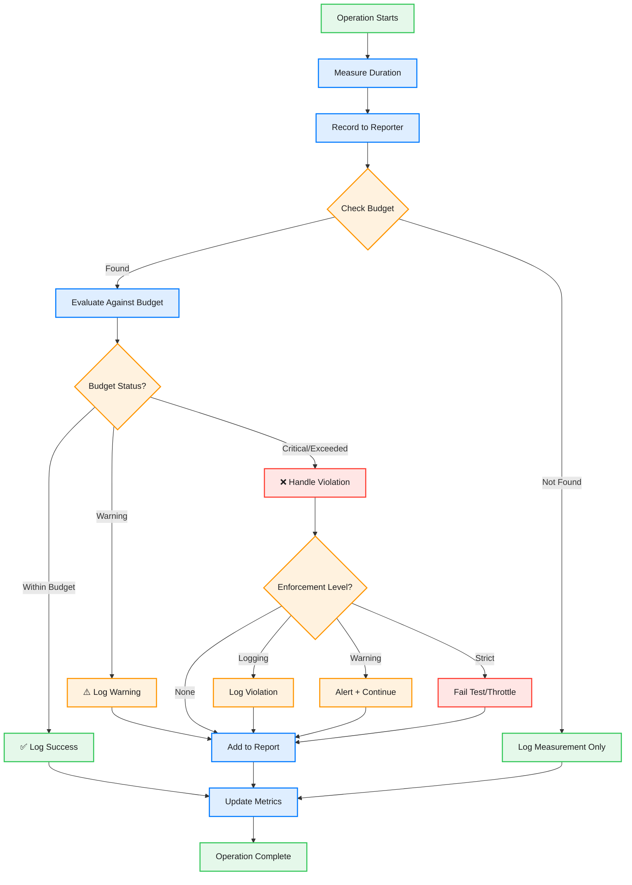

# Performance Budget System

This diagram shows the comprehensive performance budget system that monitors and enforces performance targets across all operations in CodeEditorPlugin.



## Budget Flow Diagram



## Pre-defined Performance Budgets

| Operation | Target Time | Warning Time | Critical Time |
|-----------|------------|--------------|---------------|
| **Rendering** |
| syntax_highlighting | 16ms (60fps) | 33ms (30fps) | 100ms |
| text_layout | 16ms | 50ms | 100ms |
| scrolling | 8ms (120fps) | 16ms (60fps) | 33ms |
| line_number_update | 16ms | 33ms | 100ms |
| **Completion** |
| completion_request | 50ms | 100ms | 200ms |
| completion_cancellation | 10ms | 50ms | 100ms |
| **File Operations** |
| file_open_small (<10KB) | 100ms | 200ms | 500ms |
| file_open_medium (10KB-1MB) | 500ms | 1s | 2s |
| file_open_large (>1MB) | 2s | 5s | 10s |
| **Search** |
| find_in_file | 50ms | 100ms | 200ms |
| fuzzy_search (10k items) | 100ms | 200ms | 500ms |
| **Memory** |
| memory_pressure_recovery | 500ms | 1s | 2s |
| **UI** |
| context_menu_creation | 50ms | 100ms | 500ms |
| **Test Operations** |
| test_setup | 100ms | 500ms | 1s |
| test_teardown | 100ms | 500ms | 1s |

## Usage Examples

### Basic Performance Tracking
```swift
// In production code
let reporter = PerformanceBudgetReporter()

// Record an operation
let startTime = CFAbsoluteTimeGetCurrent()
performSyntaxHighlighting()
let duration = CFAbsoluteTimeGetCurrent() - startTime

await reporter.record(operation: "syntax_highlighting", duration: duration)
```

### Test Integration
```swift
// In test code
class MyPerformanceTests: XCTestCase {
    func testSyntaxHighlightingPerformance() {
        measureAgainstBudget("syntax_highlighting") {
            // Perform syntax highlighting
            highlighter.highlight(text: largeDocument)
        }
    }
    
    func testAsyncCompletionPerformance() async throws {
        try await measureAsyncAgainstBudget("completion_request") {
            let results = try await completionManager.requestCompletions(for: context)
            XCTAssertFalse(results.isEmpty)
        }
    }
}
```

### Enforcement Configuration
```swift
let enforcement = BudgetEnforcement(
    enforcementLevel: .warning,
    onViolation: { violation in
        logger.warning("Performance budget violation: \(violation.description)")
    },
    shouldFailTest: false,
    shouldLogWarning: true,
    shouldThrottle: false
)
```

### Report Generation
```swift
let report = await reporter.generateReport()
print(report.summary)

// Output:
// Performance Budget Report
// ==================================================
// Total Operations: 15
// Total Violations: 2
//
// Violations:
//   ❌ Critical syntax_highlighting: 0.125s (150.0% over budget of 0.050s)
//   ⚠️ Warning completion_request: 0.085s (70.0% over budget of 0.050s)
//
// All Measurements (Average):
//   completion_request: 0.085s ⚠️ Warning
//   syntax_highlighting: 0.125s ❌ Critical
//   text_layout: 0.012s ✅ Within Budget
```

## Benefits

1. **Proactive Performance Management**: Catch regressions before they reach production
2. **Automated Enforcement**: Fail tests when budgets are exceeded
3. **Comprehensive Reporting**: Detailed insights into performance trends
4. **Flexible Configuration**: Adjust budgets and enforcement per environment
5. **Test Integration**: Seamless integration with XCTest framework
6. **Platform-Aware**: Adjust budgets for simulator vs device testing

## Integration Points

- **UnifiedPerformanceSystem**: Central performance monitoring
- **PerformanceMonitor**: Real-time metric collection
- **XCTest Framework**: Automated test enforcement
- **CI/CD Pipeline**: Performance regression detection
- **Development Tools**: Local performance validation