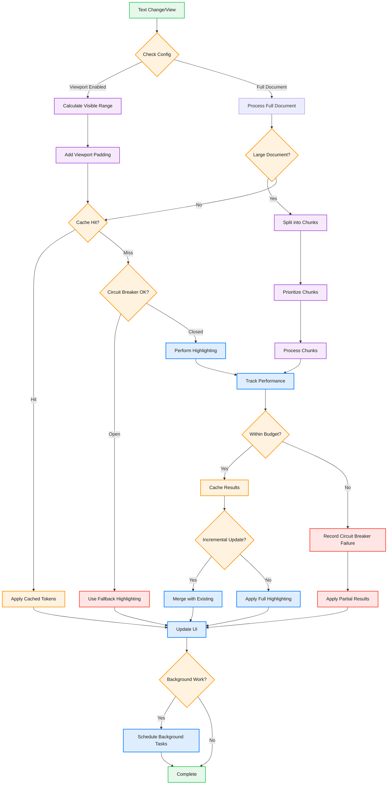

# Enhanced Syntax Highlighting Architecture

This diagram shows the optimized syntax highlighting system with advanced performance features including viewport optimization, chunking, circuit breaker pattern, and comprehensive performance tracking.

**⚠️ ARCHITECTURE STATUS:** This diagram represents the planned architecture. For the **current implementation**, see `29-enhanced-syntax-highlighting-architecture-updated.md` which reflects the actual codebase with:
- Actor-based concurrency (Swift 6)
- Streaming highlighter for large files (500KB+)  
- Integrated circuit breaker patterns
- Smart token cache with viewport filtering
- Modern async/await patterns

```mermaid
classDiagram
    direction LR
    
    %% Core Components
    class OptimizedSyntaxHighlightingCoordinator {
        <<main coordinator>>
        -coordinator SyntaxHighlightingCoordinator
        -tokenCache SmartTokenCache
        -performanceTracker SyntaxHighlightingPerformanceTracker
        -memoryMonitor MemoryMonitor
        -configuration HighlightingConfiguration
        -circuitBreaker CircuitBreaker
        -chunkingManager ChunkingManager
        -viewportOptimizer ViewportOptimizer
        +highlightDocument()
        +highlightViewport()
        +highlightChunk()
        +cancelHighlighting()
    }

    class HighlightingConfiguration {
        <<configuration>>
        +enableViewportOptimization Bool
        +viewportPadding Int
        +maxChunkSize Int
        +enableIncrementalHighlighting Bool
        +cacheWarmingEnabled Bool
        +circuitBreakerThreshold TimeInterval
        +static default Self
        +static performance Self
    }

    %% Performance Tracking
    class SyntaxHighlightingPerformanceTracker {
        <<performance tracker>>
        -metricsCollector MetricsCollector
        -performanceData [PerformanceData]
        -maxDataPoints Int
        +recordTokenizationTime()
        +recordCacheCheckTime()
        +recordHighlightingTime()
        +recordApplyAttributesTime()
        +getPerformanceReport()
        +getAverageMetrics()
    }

    class PerformanceData {
        <<data model>>
        +tokenizationTime TimeInterval
        +cacheCheckTime TimeInterval
        +highlightingTime TimeInterval
        +applyAttributesTime TimeInterval
        +tokenCount Int
        +cacheHit Bool
        +language Language
        +textLength Int
        +totalTime TimeInterval
    }

    %% Viewport Optimization
    class ViewportOptimizer {
        <<viewport optimization>>
        -textView CodeEditorView
        -visibleRange NSRange
        -paddedRange NSRange
        -scrollDirection ScrollDirection
        -lastUpdateTime TimeInterval
        +calculateVisibleRange()
        +calculatePaddedRange()
        +predictScrollDirection()
        +shouldUpdateHighlighting()
        +getOptimalHighlightingRange()
    }

    class ScrollDirection {
        <<enumeration>>
        up
        down
        none
    }

    %% Chunking System
    class ChunkingManager {
        <<chunk manager>>
        -maxChunkSize Int
        -chunks [HighlightingChunk]
        -activeChunks Set~Int~
        -completedChunks Set~Int~
        +splitIntoChunks()
        +getNextChunk()
        +markChunkComplete()
        +mergeChunkResults()
        +prioritizeChunks()
    }

    class HighlightingChunk {
        <<chunk>>
        +id Int
        +range NSRange
        +priority ChunkPriority
        +status ChunkStatus
        +tokens [SyntaxToken]?
        +error Error?
    }

    class ChunkPriority {
        <<enumeration>>
        immediate
        high
        normal
        low
    }

    class ChunkStatus {
        <<enumeration>>
        pending
        processing
        completed
        failed
        cancelled
    }

    %% Circuit Breaker
    class CircuitBreaker {
        <<reliability pattern>>
        -state CircuitBreakerState
        -failureCount Int
        -successCount Int
        -lastFailureTime Date?
        -threshold TimeInterval
        -resetTimeout TimeInterval
        +canExecute() Bool
        +recordSuccess()
        +recordFailure()
        +reset()
    }

    class CircuitBreakerState {
        <<enumeration>>
        closed
        open
        halfOpen
    }

    %% Smart Token Cache
    class SmartTokenCache {
        <<enhanced cache>>
        -lruCache LRUCache
        -cacheStatistics CacheStatistics
        -warmingQueue DispatchQueue
        -prefetchStrategy PrefetchStrategy
        +get(key) [SyntaxToken]?
        +set(key, tokens)
        +warmCache()
        +prefetch()
        +evictLeastUsed()
    }

    class CacheStatistics {
        <<statistics>>
        +hits Int
        +misses Int
        +evictions Int
        +hitRate Double
        +averageAccessTime TimeInterval
        +memoryUsage Int
    }

    class PrefetchStrategy {
        <<strategy>>
        +shouldPrefetch() Bool
        +getPrefetchKeys() [String]
        +prioritizePrefetch()
    }

    %% Incremental Highlighting
    class IncrementalHighlightingEngine {
        <<incremental engine>>
        -changeTracker DocumentChangeTracker
        -diffCalculator DiffCalculator
        -minimalUpdateStrategy MinimalUpdateStrategy
        +processIncrementalChange()
        +calculateMinimalUpdate()
        +mergeWithExisting()
        +invalidateAffectedRanges()
    }

    class DocumentChangeTracker {
        <<change tracking>>
        -changes [DocumentChange]
        -documentVersion Int
        -lastHighlightedVersion Int
        +trackChange()
        +getChangesSince()
        +consolidateChanges()
    }

    class MinimalUpdateStrategy {
        <<update strategy>>
        +determineUpdateRanges() [NSRange]
        +shouldFullReparse() Bool
        +optimizeUpdateOrder()
    }

    %% Background Processing
    class BackgroundHighlightingCoordinator {
        <<background processing>>
        -backgroundQueue DispatchQueue
        -activeTasks [BackgroundTask]
        -priorityQueue PriorityQueue
        +scheduleBackgroundHighlighting()
        +cancelBackgroundTasks()
        +adjustPriorities()
        +completeBackgroundTask()
    }

    class BackgroundTask {
        <<task>>
        +id UUID
        +range NSRange
        +priority TaskPriority
        +startTime Date
        +isCancelled Bool
    }

    %% Integration
    class SyntaxHighlightingCoordinator {
        <<existing coordinator>>
        +highlight()
        +getHighlighter()
    }

    class MemoryMonitor {
        <<existing monitor>>
        +getCurrentMemoryUsage()
        +isMemoryPressureHigh()
    }

    %% Relationships
    OptimizedSyntaxHighlightingCoordinator --> SyntaxHighlightingCoordinator : delegates to
    OptimizedSyntaxHighlightingCoordinator --> SmartTokenCache : uses
    OptimizedSyntaxHighlightingCoordinator --> SyntaxHighlightingPerformanceTracker : tracks with
    OptimizedSyntaxHighlightingCoordinator --> MemoryMonitor : monitors with
    OptimizedSyntaxHighlightingCoordinator --> HighlightingConfiguration : configured by
    OptimizedSyntaxHighlightingCoordinator --> CircuitBreaker : protected by
    OptimizedSyntaxHighlightingCoordinator --> ChunkingManager : chunks with
    OptimizedSyntaxHighlightingCoordinator --> ViewportOptimizer : optimizes with
    
    SyntaxHighlightingPerformanceTracker --> PerformanceData : collects
    
    ViewportOptimizer --> ScrollDirection : detects
    
    ChunkingManager --> HighlightingChunk : manages
    HighlightingChunk --> ChunkPriority : has
    HighlightingChunk --> ChunkStatus : has
    
    CircuitBreaker --> CircuitBreakerState : maintains
    
    SmartTokenCache --> CacheStatistics : tracks
    SmartTokenCache --> PrefetchStrategy : uses
    
    OptimizedSyntaxHighlightingCoordinator --> IncrementalHighlightingEngine : uses
    IncrementalHighlightingEngine --> DocumentChangeTracker : tracks with
    IncrementalHighlightingEngine --> MinimalUpdateStrategy : applies
    
    OptimizedSyntaxHighlightingCoordinator --> BackgroundHighlightingCoordinator : coordinates with
    BackgroundHighlightingCoordinator --> BackgroundTask : manages

    %% Styling - Dark mode friendly colors
    classDef main fill:#007AFF20,stroke:#007AFF,stroke-width:3px,color:#1D1D1F
    classDef performance fill:#34C75920,stroke:#34C759,stroke-width:2px,color:#1D1D1F
    classDef optimization fill:#AF52DE20,stroke:#AF52DE,stroke-width:2px,color:#1D1D1F
    classDef reliability fill:#FF3B3020,stroke:#FF3B30,stroke-width:2px,color:#1D1D1F
    classDef cache fill:#FF950020,stroke:#FF9500,stroke-width:2px,color:#1D1D1F
    classDef incremental fill:#007AFF20,stroke:#007AFF,stroke-width:2px,color:#1D1D1F
    classDef background fill:#8E8E9320,stroke:#8E8E93,stroke-width:2px,color:#1D1D1F
    classDef enum fill:#8E8E9320,stroke:#8E8E93,stroke-width:2px,color:#1D1D1F
    classDef existing fill:#34C75920,stroke:#34C759,stroke-width:2px,color:#1D1D1F
    
    class OptimizedSyntaxHighlightingCoordinator main
    class HighlightingConfiguration main
    class SyntaxHighlightingPerformanceTracker performance
    class PerformanceData performance
    class ViewportOptimizer optimization
    class ChunkingManager optimization
    class HighlightingChunk optimization
    class CircuitBreaker reliability
    class SmartTokenCache cache
    class CacheStatistics cache
    class PrefetchStrategy cache
    class IncrementalHighlightingEngine incremental
    class DocumentChangeTracker incremental
    class MinimalUpdateStrategy incremental
    class BackgroundHighlightingCoordinator background
    class BackgroundTask background
    class ScrollDirection enum
    class ChunkPriority enum
    class ChunkStatus enum
    class CircuitBreakerState enum
    class SyntaxHighlightingCoordinator existing
    class MemoryMonitor existing
```



## Optimized Highlighting Flow



## Key Performance Features

### 1. Viewport Optimization
- **Visible Range Detection**: Only highlight what's visible
- **Smart Padding**: Add configurable padding around viewport
- **Scroll Prediction**: Prefetch based on scroll direction
- **Adaptive Updates**: Update frequency based on scroll speed

### 2. Chunking Strategy
- **Large File Handling**: Split documents >5K chars into chunks
- **Priority-based Processing**: Process visible chunks first
- **Parallel Processing**: Process multiple chunks concurrently
- **Result Merging**: Efficiently merge chunk results

### 3. Circuit Breaker Pattern
- **Failure Detection**: Monitor highlighting performance
- **Automatic Recovery**: Reset after timeout period
- **Fallback Mode**: Basic highlighting when circuit open
- **Threshold Configuration**: Customizable failure thresholds

### 4. Smart Caching
- **LRU Cache**: Least recently used eviction policy
- **Cache Warming**: Proactive caching of likely content
- **Hit Rate Tracking**: Monitor cache effectiveness
- **Memory-aware**: Adjust cache size based on memory

### 5. Performance Tracking
- **Detailed Metrics**: Track all operation timings
- **Statistical Analysis**: Average, min, max, percentiles
- **Performance Reports**: Generate detailed reports
- **Real-time Monitoring**: Live performance dashboard

### 6. Incremental Updates
- **Change Tracking**: Monitor document modifications
- **Minimal Updates**: Only re-highlight changed areas
- **Smart Merging**: Efficiently merge new and existing tokens
- **Version Control**: Track document versions

## Configuration Examples

### Default Configuration
```swift
let config = HighlightingConfiguration.default
// enableViewportOptimization: true
// viewportPadding: 500 chars
// maxChunkSize: 5,000 chars
// circuitBreakerThreshold: 100ms
```

### Performance Configuration
```swift
let config = HighlightingConfiguration.performance
// enableViewportOptimization: true
// viewportPadding: 200 chars (smaller)
// maxChunkSize: 2,000 chars (smaller chunks)
// circuitBreakerThreshold: 50ms (stricter)
```

### Custom Configuration
```swift
var config = HighlightingConfiguration()
config.enableViewportOptimization = true
config.viewportPadding = 1000 // More aggressive prefetching
config.maxChunkSize = 10_000 // Larger chunks for powerful devices
config.enableIncrementalHighlighting = true
config.cacheWarmingEnabled = true
config.circuitBreakerThreshold = 0.2 // 200ms threshold
```

## Performance Metrics

### Tracked Metrics
- **Tokenization Time**: Time to parse and tokenize text
- **Cache Check Time**: Time to check cache for existing tokens
- **Highlighting Time**: Time to apply syntax rules
- **Apply Attributes Time**: Time to update UI attributes
- **Total Time**: End-to-end highlighting duration
- **Token Count**: Number of tokens processed
- **Cache Hit Rate**: Percentage of cache hits

### Performance Report Example
```swift
let report = tracker.getPerformanceReport()
// Average Metrics:
// - Tokenization: 15ms
// - Cache Check: 2ms
// - Highlighting: 25ms
// - Apply Attributes: 8ms
// - Total: 50ms
// - Cache Hit Rate: 85%
// - Tokens/second: 10,000
```

## Benefits

1. **Scalability**: Handles files from 1 line to 1M+ lines efficiently
2. **Responsiveness**: Maintains 60fps scrolling even with large files
3. **Memory Efficiency**: Minimal memory footprint through smart caching
4. **Reliability**: Circuit breaker prevents system overload
5. **Adaptability**: Automatically adjusts to device capabilities
6. **Observability**: Comprehensive performance metrics and reporting

## Integration Points

- **CodeEditorView**: Main text view integration
- **SyntaxHighlightingCoordinator**: Existing highlighting system
- **MemoryMonitor**: Memory pressure detection
- **PerformanceBudget**: Budget enforcement
- **UnifiedPerformanceSystem**: Central performance monitoring

---

## 📋 Current Implementation Status

**This diagram represents the planned/theoretical architecture.** The actual implementation in the codebase has evolved beyond this design with:

### ✅ **Fully Implemented:**
- `OptimizedSyntaxHighlightingCoordinator` with integrated circuit breaker
- `SyntaxHighlightingPerformanceTracker` with comprehensive metrics
- `SmartTokenCache` (actor-based) with viewport optimization
- `AsyncSyntaxHighlighter` with debouncing and cancellation
- `StreamingHighlighter` for large files (500KB+)
- Actor-based concurrency patterns (Swift 6)
- Memory pressure integration

### 🔄 **Architecture Differences:**
- Circuit breaker is integrated (not separate class)
- Chunking handled inline (no separate ChunkingManager)
- Viewport optimization embedded in coordinator
- Modern async/await patterns throughout
- TextKit2 integration with cross-platform support

### 📖 **See Updated Architecture:**
For the current implementation details, refer to:
**`29-enhanced-syntax-highlighting-architecture-updated.md`**