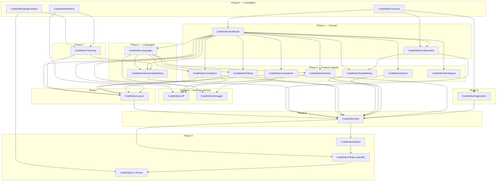

# NEXT.md — Restructuring CodeEditorPlugin for `~/Workspace/packages/`

Analysis and recommendations for splitting the current monolithic `CodeEditorPlugin` target into a layered, MusicToolkit-style package before relocating it into `~/Workspace/packages/`.

---

## 1. Goals

1. **Match the rest of the workspace.** Peer packages in `~/Workspace/packages/` are small, focused, single-purpose modules. The only multi-target package — `MusicToolkit` — uses a strictly layered architecture with phased bootstrap and a single umbrella re-export. CodeEditorPlugin should join that pattern, not start a third.
2. **Make the layers buildable in isolation.** Today, touching the gutter forces a rebuild of TextKit2 helpers, languages, LSP, and the SwiftUI surface. Slicing the 480-file target into ~10 targets gives faster incremental builds and clearer ownership.
3. **Enforce direction of dependencies through SPM, not convention.** Today nothing prevents `Theming` from depending on `Layout`, or `Languages` from reaching into `Core`. Splitting targets makes illegal edges fail at compile time.
4. **Make optional subsystems actually optional.** LSP, Debugger, SwiftUI chrome, and Performance instrumentation should be opt-in libraries, not unconditional payload in the umbrella product.
5. **Preserve the existing public API surface** — consumers that `import CodeEditorPlugin` keep working via the umbrella target.

---

## 2. What MusicToolkit gets right (the model to copy)

Reviewed at `/Users/ajmcclary/Workspace/packages/MusicToolkit`:

- **20+ products, one per concern**, all named `MusicToolkit<Concept>` (e.g. `MusicToolkitModel`, `MusicToolkitImport`, `MusicToolkitRendering`, `MusicToolkitRenderingCG`).
- **Strict bootstrap phases** (0 → 9) documented in `ARCHITECTURE.md §9`. Each target declares which phase it belongs to, and dependencies flow only downward.
- **`MusicToolkitCommon` (phase 0)** holds shared utilities. `MusicToolkitModel` (phase 1) holds the domain. Everything else builds on those two.
- **Backend split via condition'd dependencies.** `MusicToolkitRenderingCG` is Apple-only; `MusicToolkitRenderingSVG` is portable. The umbrella `MusicToolkitExport` references the Apple backend with `.target(... condition: .when(platforms: [.macOS, .iOS, .tvOS, .visionOS]))` so Linux can still compile the parsing-only surface.
- **Test infrastructure as first-class targets.** `MusicToolkitTestSupport` and `MusicToolkitTestCorpus` are real library targets that test targets depend on — no duplicated fixtures.
- **Umbrella target re-exports** the everyday public surface. `MusicToolkit` (the umbrella library) depends on the common subset (`Model`, `Import`, the major format parsers, `Midi`) so consumers can `import MusicToolkit` once for typical use.
- **Architecture is documented as a diagram + dependency table.** `ARCHITECTURE.md` has a Mermaid flow chart for the layered map and a "phases" table. New contributors see the rules immediately.

Workspace convention for **single-purpose kits** is different (kebab-case dir, single module — `platform-kit/Sources/PlatformKit`), but CodeEditorPlugin's size and shape match MusicToolkit, not the kits.

---

## 3. Current state inventory

`Sources/CodeEditorPlugin/` is one target with 21 subdirectories and ~480 Swift files. File counts by subdirectory (largest first):

| Dir | Files | Role |
|---|---|---|
| Languages/ | 66 | 25 concrete language providers, descriptors, folding/symbol/completion data |
| Core/ | 59 | `CodeEditorView`, controllers, actor coordinator, public API, `EditorController+*` slices |
| Text/ | 51 | TextKit2 bridges, range store, line geometry, parsing helpers |
| Layout/ | 40 | Gutter, container view, minimap, popover chrome, event bus |
| SyntaxHighlighting/ | 36 | Highlighting engine, descriptor-driven regex path, tree-sitter adapters |
| Platform/ | 32 | Cross-platform color/font/view shims (`#if canImport(AppKit)/(UIKit)`) |
| Theming/ | 31 | Theme model, token bridge, appearance |
| LSP/ | 24 | Language Server Protocol client |
| Features/ | 23 | Folding, smart editing, search/replace, symbol nav, debugger integration |
| Extensions/ | 22 | Catch-all type extensions |
| Completion/ | 22 | Code-completion engines and providers |
| SwiftUI/ | 19 | SwiftUI wrappers and modifiers |
| Performance/ | 16 | `MemoryMonitor`, profiling, instrumentation |
| Utilities/ | 13 | Shared helpers |
| Annotations/ | 8 | Annotation data sources / badges |
| Configuration/ | 7 | `EditorConfiguration`, presets |
| Models/ | 5 | Shared data models |
| Documents/ | 2 | `EditorDocument` + `EditorDocuments` |
| Workspace/ | 2 | Workspace indexing/search |
| Search/ | 1 | Search result types |
| Resources/ | 0 | Themes JSON only |

Sibling products today: `CodeEditorDesignTokens` (own target), `CodeEditorUI` (depends on the monolith), `CodeEditorSample` (executable).

---

## 4. Proposed layered target layout

Each target is named `CodeEditor<Concept>`, mirroring `MusicToolkit<Concept>`. Bootstrap phases enforce direction. Existing source directories map 1:1 in most cases; `Features/` and `Core/` get split because they currently bundle unrelated subsystems.

### 4.1 Phase table

| Phase | Target | Sources today | Depends on |
|---|---|---|---|
| **0 — Foundation** | `CodeEditorCommon` | `Extensions/`, `Utilities/`, `Models/` | (none) |
| 0 | `CodeEditorPlatform` | `Platform/` | (none) |
| 0 | `CodeEditorDesignTokens` | (already exists) | (none) |
| **1 — Domain** | `CodeEditorTextModel` | `Text/`, `Documents/` | Common |
| 1 | `CodeEditorConfiguration` | `Configuration/` | Common, TextModel |
| **2 — Theming** | `CodeEditorTheming` | `Theming/`, `Resources/Themes/` | DesignTokens, Platform |
| **3 — Languages** | `CodeEditorLanguages` | `Languages/` | TextModel |
| 3 | `CodeEditorSyntaxHighlighting` | `SyntaxHighlighting/` | Languages, TextModel, Theming |
| **4 — Feature engines** | `CodeEditorCompletion` | `Completion/` | Languages, TextModel |
| 4 | `CodeEditorFolding` | `Features/CodeFolding*`, `Features/Fold*`, `Features/LineFoldStorage*` | TextModel, Languages |
| 4 | `CodeEditorSmartEditing` | `Features/SmartEditing*` | TextModel, Configuration |
| 4 | `CodeEditorSearch` | `Features/SearchReplaceEngine.swift`, `Search/` | TextModel |
| 4 | `CodeEditorSymbols` | `Features/SymbolNavigation*`, `Features/SymbolProviderCatalog*`, `Features/SymbolNavigator*` | Languages, TextModel |
| 4 | `CodeEditorAnnotations` | `Annotations/` | TextModel |
| 4 | `CodeEditorWorkspace` | `Workspace/` | TextModel |
| **5 — External services** | `CodeEditorLSP` | `LSP/` | TextModel, Completion, Languages, Symbols |
| 5 | `CodeEditorDebugger` | `Features/Debugger*`, `Features/DebugAdapter*` | TextModel, Annotations |
| **6 — Diagnostics** | `CodeEditorDiagnostics` | `Performance/` | Common |
| **7 — Presentation** | `CodeEditorLayout` | `Layout/` | TextModel, Theming, Completion, Annotations, Folding, Platform |
| **8 — Editor surface** | `CodeEditorView` (or keep name `CodeEditorCore`) | `Core/`, `CodeEditorPlugin.swift` | Everything in phases 1–7 (concrete engines wired in) |
| **9 — SwiftUI** | `CodeEditorSwiftUI` | `SwiftUI/` | the Editor target |
| **Umbrella** | `CodeEditorPlugin` | (just re-exports) | TextModel, Configuration, Theming, Languages, SyntaxHighlighting, Completion, Folding, Symbols, Annotations, Editor surface, SwiftUI |
| **UI chrome** | `CodeEditorUI` (already exists) | (unchanged) | DesignTokens, umbrella |
| **Test support** | `CodeEditorTestSupport` | (new — extract fixtures + mocks from `Tests/CodeEditorPluginTests/Support`) | umbrella, snapshot helpers |
| **Sample app** | `CodeEditorSample` (already exists) | (unchanged) | DesignTokens, umbrella, UI |

### 4.2 Dependency map (Mermaid)



### 4.3 What each split buys you concretely

- **`CodeEditorLanguages` independent of `Core`.** Adding a 26th language stops triggering a TextKit2 / Layout rebuild.
- **`CodeEditorTheming` independent of `Layout`.** Theme JSON / token changes don't churn the gutter and minimap.
- **`CodeEditorLSP` and `CodeEditorDebugger` are opt-in libraries.** A consumer that doesn't want LSP simply doesn't link it; the umbrella can `@_exported import` them only when the consumer also links them, or expose them as separate products. (See §6.3.)
- **`CodeEditorDiagnostics` becomes detachable.** Today `MemoryMonitor` is reachable from anything in the monolith. As its own target with no upward callers, it can be excluded from release builds via a separate product.
- **`CodeEditorTextModel` becomes the testable core.** The `Text/` + `Documents/` boundary already exists in your head — making it a real SPM boundary is mostly a matter of declaring it.

---

## 5. Workspace placement & naming

### 5.1 Directory placement

`MusicToolkit` lives at `~/Workspace/packages/MusicToolkit/` (PascalCase, matches its module name). The kebab-case convention (`platform-kit/`, `design-tokens/`) is only used by small single-module kits. CodeEditorPlugin matches MusicToolkit's shape, so:

```
~/Workspace/packages/CodeEditorPlugin/
```

(or the rename below).

### 5.2 Rename opportunity — "Plugin" is misleading

The package isn't a plugin to anything; it's a code-editor framework. Three options:

1. **Keep `CodeEditorPlugin`** — minimum disruption, but the name remains misleading and the umbrella target name clashes semantically with what's inside it (no real plugin system exists; see `CLAUDE.md` § "Watch for stale claims": `PluginManager`/`PluginAPI` don't exist).
2. **Rename to `CodeEditorToolkit`** — mirrors `MusicToolkit`. All targets become `CodeEditorToolkit<Concept>`. Consistent with the workspace's other multi-target package.
3. **Rename to `CodeEditorKit`** — shorter, but uses the kit convention which the rest of the workspace reserves for single-module packages.

**Recommendation:** option 2 if you're willing to take the rename hit during the move (you're already touching every target name); option 1 if you want the move to be additive only.

### 5.3 What `~/Workspace/packages/CLAUDE.md` will need

A row added to its table, parallel to the existing MusicToolkit row:

> `CodeEditorPlugin/` (or `CodeEditorToolkit/`) — TextKit2-based code editor framework: text model, languages, syntax highlighting, completion, folding, LSP, layout, SwiftUI surface.

---

## 6. Migration plan

Suggested ordering minimizes broken-build windows. Each step is a single commit / PR.

### 6.0 Status (as of 2026-05-17)

**Phases 0–4 done; phase 3.5 (SH) carved out.** `CodeEditorDiagnostics` (§6.2.10) landed ahead of §6.2.7 in `e60f7857` to unblock SyntaxHighlighting. `CodeEditorSyntaxHighlighting` (§6.2.7) followed as a carve-out — 36 of 45 SH files moved to the new target; 9 `CodeEditorView`-coupled files stayed in umbrella under `Core/SyntaxHighlighting/`. Eight new SPM targets now exist alongside the existing `CodeEditorDesignTokens` / `CodeEditorPlugin` / `CodeEditorUI` / `CodeEditorSample`. 465 tests / 116 suites passing, 0 SwiftLint violations, build green on every commit.

| Target | Commit | What landed | Direct deps |
|---|---|---|---|
| `CodeEditorCommon` | `f0c438f1` | `Extensions/`, `Utilities/`, `Models/`, `Errors/` (+ `RecoverableAsyncError.swift` added during §6.2.7) | (none) |
| `CodeEditorTextModel` | `b6bfdbe9` | 32 of 51 `Text/` files (range storage, geometry, location, parsing primitives) (+ 3 RangeStore files relocated from umbrella `Core/Text/RangeStore/` during §6.2.7) | Common |
| `CodeEditorPlatform` | `77880e9f` | 20 of 34 `Platform/` files (Colors, Fonts, Constants, ServiceLayer, Capabilities, ViewReuseQueue, DeviceType, etc.) | Common |
| `CodeEditorConfiguration` | `5838c24a` | `Configuration/` (7 files) | Common, Platform, TextModel |
| `CodeEditorTheming` | `4c71e49e` | `Theming/` (32 files) + `Resources/Themes/` | Common, DesignTokens |
| `CodeEditorLanguages` | `14921a61` | 71 files (66 originals from `Languages/` + `Language` enum from SyntaxHighlighting + 2 Completion model files + 2 Folding/Symbol interface files split from Features/ + `SnippetTemplate` from Completion + `RegexSyntaxTokenType` enum split from SyntaxHighlighting; net of 2 files moving out: `SwiftSyntaxHighlighter*.swift` relocated to umbrella `SyntaxHighlighting/` then back into `CodeEditorSyntaxHighlighting` in §6.2.7) | Common, Platform, TextModel |
| `CodeEditorDiagnostics` | `e60f7857` | 14 files (13 from `Performance/` + 1 split-out `MemoryMonitor+AvailableMemory.swift` from SH; 2 dead files deleted, 1 misfiled relocated to umbrella `Layout/`, 1 misfiled relocated to umbrella `Core/`) | Common, Configuration, Languages, Platform, IssueReporting |
| `CodeEditorSyntaxHighlighting` | `f2798287` | 38 files (36 pure-engine files from umbrella `SyntaxHighlighting/` + 2 extracted during execution: `RangeQueryParser.swift` and `SyntaxHighlightingError.swift`). 9 `CodeEditorView`-coupled files relocated to `Core/SyntaxHighlighting/` in pre-commit `818df5f6`; 5 `CodeEditorDependencies.makePlatformCapabilities()` sites inlined in `AdaptiveColorSystem.swift` in pre-commit `1a5dc86c`. | Common, DesignTokens, Diagnostics, Languages, Platform, TextModel, Theming + SwiftSyntax/SwiftParser |
| `CodeEditorFolding` | `76abf928` | 4 pure fold-storage / provider-registry files from `Features/` (`FoldStoreElement`, `LineFoldStorage` + `FoldInfo`, `FoldRegionAdapter`, `FoldingProviderRegistry`). 4 `CodeEditorView`-coupled files (`CodeFoldingEngine`, `FoldingOperationsService`, `FoldPresentationStrategy`, `CodeFoldingConfiguration` — renamed from misnamed `FoldableRegion.swift`) relocated to umbrella `Core/Folding/` in pre-commit `9704e80b`. | Common, Languages, SyntaxHighlighting, TextModel |
| `CodeEditorSymbols` | `3354dddd` | 3 files in new target (2 from `Features/` — `SymbolNavigationTypes`, `SymbolProviderCatalog` — + 1 split-out `SymbolRangeIndex.swift` extracted from `SymbolProviderCatalog`). 1 `CodeEditorView`-coupled file (`SymbolNavigator`) relocated to umbrella `Core/Symbols/` in pre-commit `5d670076`. | Languages, SyntaxHighlighting |

Phase A access-modifier promotion landed in `8bac96cb` (116 `package` promotions across 40 files; baseline scan that made the per-target extractions near-mechanical for the symbols themselves — file coupling was the remaining work).

**Deviations from the original plan (§6.2.3 / §6.2.4 / §6.2.5):**

- **Step 6.2.2 ↔ 6.2.3 order swapped during execution.** Reality is `Configuration → Platform` (Configuration uses `PlatformConstants` / `PlatformColor`), the opposite of the spec's earlier "flipped graph". Platform was extracted before Configuration so Configuration could depend on it.
- **Theming has no Platform dep.** Code reality: Theming only needs DesignTokens (tokens) and Common (`Duration.timeInterval` extension). NEXT.md's "Theming depends on Platform" claim wasn't backed by any actual reference.
- **~30 files needed F3 surgery (relocate to umbrella semantic homes) rather than the planned "near-mechanical move".**
  - From `Text/` → `Core/Text/`: `ModernTextKitHelper`, `ParagraphStyleCache`, `TextKit2PerformanceHelper`, `TextLayoutFragment`, `BackgroundProcessor`, `RangeStore/`, `TemporaryAttributesStore`, `TextEditEventHub`.
  - From `Text/` → `Core/`: `TextSystemStyler`, `ThreePhaseTextSystemStyler`, `TokenSystemValidator`.
  - From `Text/Parsing/` → `SyntaxHighlighting/Parsing/`: `LanguagePatternDetector`, `PatternExtractor`, `SyntaxTreeParser`, `TextParsingUtilities`, `TokenExtractor`, `WordBoundaryFinder`.
  - From `Documents/` → `Core/Documents/`: `EditorDocument`, `EditorDocuments`.
  - From `Platform/` → `Core/Platform/`: `ContextMenuAction/Builder/Coordinator`, `CrossPlatformCoordinator` + AppKit/UIKit ext, `InputCoordinator`, `PlatformAdjustments+Extensions`, `PlatformConfigurations`, `TextInputFeatures`, `ToolbarCoordinator`, `UnifiedDrawingCoordinator`.
- **Type-erasure to break Configuration → umbrella coupling.** `UnifiedPerformanceTracking: AnyObject & Sendable` marker protocol added to Common. `EditorConfiguration.Performance.unifiedPerformanceSystem` now holds `(any UnifiedPerformanceTracking)?` instead of `UnifiedPerformanceSystem?`. The single call site (`AsyncSyntaxHighlighter`) casts back with `as? UnifiedPerformanceSystem`.
- **Four small "method-only" umbrella extensions** created so leaf targets could stay pure: `DeviceType+RecommendedConfiguration.swift`, `PlatformCapabilities+RecommendedConfiguration.swift`, `EditorConfiguration+CodeFolding.swift`, `Theme+TokenColor.swift`.
- **`ToolbarItem` re-export.** `ToolbarCoordinator.swift` (umbrella) adds `public typealias ToolbarItem = CodeEditorPlatform.ToolbarItem` so the file can disambiguate against `SwiftUI.ToolbarItem` without rewriting 47 call sites. External consumers continue to see a `ToolbarItem` re-exported through CodeEditorPlugin.

**Deviations during §6.2.6 `CodeEditorLanguages` (commit `14921a61`):**

- **`SwiftSyntaxHighlighter.swift` + `+SharedExtensions.swift` moved OUT of `Languages/` into `SyntaxHighlighting/` (umbrella).** They consume `HighlightedToken` and `TokenType` — highlighting-side concepts. Keeping them in Languages would have forced `HighlightedToken`/`TokenType` to also migrate down, dragging in `SyntaxColorScheme` and the rest of the highlighting pipeline. Cleaner to acknowledge they're a highlighting concern that happened to be filed under Languages. SwiftSyntax/SwiftParser deps therefore stay on the umbrella target rather than moving with the new target.
- **`SnippetTemplate.swift` moved from `Completion/` to `Languages/`.** It's a `LanguageDescriptor` primitive (language descriptors carry `[SnippetTemplate]`), not a completion-engine type.
- **`RegexSyntaxTokenType` enum split out of `SyntaxHighlighting/RegexSyntaxHighlighter+TypesExtensions.swift` into `Languages/RegexSyntaxTokenType.swift`.** Used by `DescriptorHighlightRule` (Languages) and by the regex highlighter (umbrella). The `.color` computed property stays in the umbrella as an extension since it references `SyntaxColorScheme`.
- **Access promotions to bridge the new target boundary:** `LanguageDescriptor` + all its stored members + static factories promoted internal → `package`. `DescriptorHighlightRule` promoted internal → `package`. Per-language `*FoldingProvider` / `*SymbolProvider` structs promoted internal → `package` with explicit `package init()` and `package func` for protocol requirements. `PHPSymbolProvider.State`, `XMLSymbolProvider.State`, `YAMLSymbolProvider.State` promoted to `package`. `DocumentSymbolKind.icon` / `.canContainSymbols` promoted internal → `package`.
- **`FoldingType` gained `Sendable` conformance.** Phase-1 promotion of `FoldableRegion` to `public` exposed that `FoldStoreElement` / `FoldInfo` (both `Sendable` structs that store `FoldingType`) now required it.
- **CodeFoldingConfiguration stays internal in `Features/FoldableRegion.swift`.** Out of scope per the spec (its home is §6.0 question 2 / §6.2.8 territory).
- **`CodeEditorUI`, `CodeEditorSample`, `CodeEditorPluginTests`, `CodeEditorSampleTests` targets gained `CodeEditorLanguages` as a direct dependency.** ~100 umbrella files plus a handful of UI / sample / test files now `import CodeEditorLanguages` explicitly. The umbrella target has `exclude: ["Info.plist", "Languages"]` so SwiftPM doesn't double-count the new target's source root.

**Deviations during §6.2.10 `CodeEditorDiagnostics` (commit `e60f7857`):**

- **Diagnostics is not a phase-6 leaf.** NEXT.md §4.1 originally claimed `Diag → only Common`. Reality after auditing: `AdaptivePerformanceMode` extends `EditorConfiguration.Performance` (Configuration dep); `AdaptivePerformanceMode` + `ProductionPerformanceMetrics` bucket metrics by `Language` (Languages dep); `MemoryMonitor` + `HardwareAcceleration` + `PerformanceInsights` + `PerformanceViews` use Platform types (Platform dep). `PerformanceInsights` also uses `IssueReporting`. Diagnostics ends up at **phase 4** with 5 direct deps.
- **Dead code dropped en route.** `IncrementalSyntaxHighlighter.swift` (zero callers, imported `CodeEditorLanguages + CodeEditorTextModel`) and `OptimizedLineIndexCache.swift` (`@available(*, deprecated)`, zero callers, replacement lives in `CodeEditorTextModel`) deleted in commit `48b9fcd5`.
- **`ViewportManager.swift` relocated to umbrella `Layout/`** rather than carried into Diagnostics. Only consumed by two test files (`IntegrationTests`, `LargeFilePerformanceTests`); structurally a viewport/layout helper that travels with the future §6.2.11 `CodeEditorLayout` target. Landed in commit `48b9fcd5`.
- **`IOSLargeFileOptimizer.swift` relocated to umbrella `Core/` mid-extraction.** It casts to `CodeEditorView` at three sites (`.configuration`, `.adaptivePerformanceMode`, `.forceMode`) — iOS-specific integration code intrinsically coupled to the umbrella. Carrying it into Diagnostics would force Diagnostics to import umbrella. Diagnostics ends up with 14 files instead of the spec's planned 14-from-Performance + 1-split = 15.
- **`extension CodeEditorView { trackPerformance(...) }` extracted** from `UnifiedPerformanceSystem.swift` into a new umbrella file `Core/CodeEditorView+TrackPerformance.swift`. Can't extend an umbrella type from a leaf target.
- **Two `CodeEditorDependencies.make*()` fallback call sites inlined.** `PerformanceInsights.swift` (`makePlatformCapabilities()` → `PlatformCapabilities()`) and `AdaptivePerformanceMode.swift` (`makeProductionPerformanceMetrics()` → `ProductionPerformanceMetrics()`). Matches each key's `liveValue` closure. The spec's claim that the factory call sites could stay was wrong — Diagnostics can't reach umbrella's `CodeEditorDependencies`.
- **Hybrid extension file split.** `SyntaxHighlighting/SyntaxHighlightingCoordinator+Extensions.swift` previously bundled two unrelated extensions; the `extension MemoryMonitor` moved out as `MemoryMonitor+AvailableMemory.swift` (carried into Diagnostics); the `extension SyntaxHighlightingCoordinator` stayed in umbrella. Landed in commit `48b9fcd5`.
- **Spec's claim that LRUCache.swift had a stale `import CodeEditorLanguages` was wrong.** It uses `CompletionContextModel` and `CompletionResult` — both Languages-target types from §6.2.6. Import kept.
- **`HardwareAcceleration` kept (not deleted).** The spec's conditional-delete branch (Step 1.5 audit) found many production consumers including a dedicated test file. Carries into Diagnostics with `internal → package` promotion (the enum + its `apply(_:to:)` static).
- **Access-modifier promotions to bridge the new target boundary:** `HardwareAcceleration` enum + `apply(_:to:)` static promoted internal → `package`. `PerformanceObservation.refreshCount` and `.refreshTaskSpawnCount` promoted `internal private(set)` → `package private(set)` for test access.
- **No marker protocols added to Common.** The original §6.0 deferred-decision option (a) — type-erase via `AnyMemoryMonitor` / `AnyProductionPerformanceMetrics` — was not needed; umbrella files that reference Diagnostics types now `import CodeEditorDiagnostics` directly.
- **`UnifiedPerformanceTracking` marker in Common stays unchanged.** Removing it would force Configuration → Diagnostics and push Configuration out of phase 1; the marker pays its keep.
- **`CodeEditorSample`, `CodeEditorPluginTests`, `CodeEditorSampleTests` targets gained `CodeEditorDiagnostics` as a direct dependency.** 31 umbrella files + 8 sample files + 57 test files gained `import CodeEditorDiagnostics`. The umbrella target has `exclude: ["Info.plist", "Languages", "Performance"]` so SwiftPM doesn't double-count source roots.
- **Productized.** Unlike Languages, Diagnostics exposes a `.library(name: "CodeEditorDiagnostics", ...)` product per NEXT.md §6.3 so consumers can omit instrumentation from release builds.

**Deviations during §6.2.7 `CodeEditorSyntaxHighlighting` (commit `f2798287`):**

- **Not "near-mechanical".** NEXT.md §10's claim was wrong. Nine SH files directly reference the umbrella `CodeEditorView` class (`RangeAttributeApplier`, `VisibleRangeProvider`, `HighlightProviderState`, `RangeBasedHighlightingController`, `RangeHighlightProviding` protocol + conformers `SyntaxHighlighterRangeAdapter` and `RegexRangeHighlightProvider`, `AsyncSyntaxHighlighter`, `StreamingHighlighter`). Carve-out adopted: those 9 stayed in umbrella relocated under `Core/SyntaxHighlighting/` in pre-commit `818df5f6`; 36 pure-engine files moved to `Sources/CodeEditorSyntaxHighlighting/` in commit `f2798287`. `CodeEditorViewProtocol` was not promoted.
- **`RangeQueryParser*` types extracted from `RegexRangeHighlightProvider.swift`.** `RangeQueryParserProtocol` + `RangeQueryParseResult` + `RangeQueryCapture` + `RangeQueryParserError` were nested inside the umbrella's `RegexRangeHighlightProvider.swift`. The conformer (`RegexIncrementalRangeQueryParser.swift`) moved into the new SH target and needed those types. Extracted into a new file `Sources/CodeEditorSyntaxHighlighting/RegexQuery/RangeQueryParser.swift`. Types promoted internal → `package`.
- **`RangeStore` types relocated from umbrella to TextModel.** `RangeStore`, `RangeStoreElement`, `RangeStoreRun` lived in umbrella `Core/Text/RangeStore/` (F3 leftover from phase 1) but `StyleElement` / `StyledRangeContainer` in the new SH target reference them. `git mv`'d into `Sources/CodeEditorTextModel/` where they semantically belong. The other umbrella dependents (`FoldStoreElement`, `LineFoldStorage`, `CodeEditorView`) already imported `CodeEditorTextModel`, so no import edits were needed for them.
- **`RecoverableAsyncError` infrastructure relocated to Common.** `SyntaxHighlightingError` enum (referenced by `BackgroundSyntaxHighlighter` in new SH target) lived in umbrella `Core/AsyncOperationErrors.swift` and conformed to `RecoverableAsyncError` (also in umbrella). Moved `RecoverableAsyncError` + `RecoveryStrategy` + `BackoffStrategy` to `CodeEditorCommon`. Moved `SyntaxHighlightingError` to the new SH target as a new file. `AsyncOperationErrors.swift` retains `CompletionAsyncError` and later error types, with explanatory comment.
- **Two `CodeEditorDependencies.makePlatformCapabilities()` sites inlined** at lines 29, 44, 59, 74, 97 of `AdaptiveColorSystem.swift` — replaced with direct `PlatformCapabilities()` construction in pre-commit `1a5dc86c`. Matches `liveValue`. Same pattern Diagnostics used. `AsyncSyntaxHighlighter`'s `CodeEditorDependencies.makeProductionPerformanceMetrics()` call stays untouched (file remains in umbrella).
- **~107 access-modifier promotions** across the new SH target to bridge the new boundary. No-modifier (defaulting to `internal`) top-level type members in `package`/`public` enclosing types were promoted `internal → package` via one-time bulk script, with manual revisions for protocol-requirement and duplicate-modifier artifacts. Surface includes: `SmartTokenCache.init/CacheKey members/CacheEntry/Coverage`; `StyledRangeContainer` methods and init; `SyntaxHighlightingPerformanceMonitor.init`/`measure`; `HeuristicFoldProvider/HeuristicSymbolProviderFacade` inits and protocol-conformance methods; `RegexIncrementalRangeQueryParser` protocol-conformance methods; `PlainTextHighlighter.init/highlight`; `StyleElement` members/init; `BackgroundHighlightingTypes` members; `RegexSyntaxHighlighter+LanguagesExtensions/+BuilderExtensions` members; `ViewportSyntaxCoordinator` private helpers retained `private`.
- **No productization.** No `.library(name: "CodeEditorSyntaxHighlighting", ...)` entry. Matches Languages precedent. Updates NEXT.md §6.3 (highlighting routes through umbrella for now).
- **`CodeEditorPluginTests` target gained `CodeEditorSyntaxHighlighting` as a direct dep.** ~19 umbrella files + 18 test files gained `import CodeEditorSyntaxHighlighting`. `ActorCoordinator.swift` additionally gained `import CodeEditorCommon` (for `RecoverableAsyncError`). The umbrella's `exclude:` list expanded to `["Info.plist", "Languages", "Performance", "SyntaxHighlighting"]` (defensive; the source dir is empty post-extraction). `SwiftSyntax` / `SwiftParser` products migrated from umbrella's `dependencies:` to the new target's.

Sample-app theme rendering visually verified by the user on 2026-05-17.

**Deviations during §6.2.8a `CodeEditorFolding` (commit `76abf928`):**

- **Half the carry-set turned out to be `CodeEditorView`-coupled.** Plan-writing scope was 8 files; reality after import survey was 4 pure + 4 coupled. Same surprise §6.2.7 had with SH's 9 `CodeEditorView`-coupled files. Carve-out adopted: 4 pure files moved to `Sources/CodeEditorFolding/`; 4 coupled files (`CodeFoldingEngine`, `FoldingOperationsService`, `FoldPresentationStrategy`, `CodeFoldingConfiguration`) relocated to `Core/Folding/` in pre-commit `9704e80b`.
- **`CodeFoldingConfiguration` placement revised mid-spec.** Brainstorming initially placed it in the new target. With the engine staying in umbrella, all three consumers (`CodeFoldingEngine`, `FoldingOperationsService`, `EditorConfiguration+CodeFolding` bridge) are now umbrella files, so the config stays with them. Avoids forcing an `import CodeEditorFolding` on every consumer for a 19-line struct.
- **`Features/FoldableRegion.swift` renamed to `Core/Folding/CodeFoldingConfiguration.swift`.** The filename was misleading — the file only ever contained `CodeFoldingConfiguration`. The actual `FoldableRegion` struct has lived in `CodeEditorLanguages` since §6.2.6.
- **Direct deps narrower than §6.2.7's pattern.** Folding's target deps are `Common, Languages, SyntaxHighlighting, TextModel` — no `Diagnostics` (only `CodeFoldingEngine` used it; stays in umbrella), no `Platform` (only `CodeFoldingConfiguration` used `PlatformColors.secondaryLabel`; stays in umbrella).
- **~5 `internal` → `package` promotions** across `FoldStoreElement`, `LineFoldStorage`, `FoldInfo`, `FoldRegionAdapter`, `FoldingProviderRegistry`. Far smaller than §6.2.7's ~107 promotions because the moving surface is smaller (4 files vs. 36).
- **Consumer surface much smaller than the plan anticipated.** Only 2 umbrella source files (`Core/Folding/CodeFoldingEngine.swift`, `Core/Folding/FoldPresentationStrategy.swift`) and 2 test files (`Features/LineFoldStorageTests.swift`, `FeatureBehaviorTests.swift`) needed `import CodeEditorFolding`. Layout / SwiftUI / `CodeFoldingCoordinatorService` reach folding state only through the umbrella `CodeFoldingEngine` and `CodeFoldingCoordinatorService.FoldControlLayout` — neither requires a new import.
- **No productization.** Matches Languages / SyntaxHighlighting precedent. Folding is core to the editor; no consumer opts out.
- **`CodeEditorPluginTests` target gained `CodeEditorFolding` as a direct dep.** Sample / UI required no new deps (verified in pre-flight).

**Deviations during §6.2.8b `CodeEditorSymbols` (commit `3354dddd`):**

- **Carve-out adopted, matching §6.2.8a precedent.** 1 of 3 `Features/` Symbol* files (`SymbolNavigator`) references `CodeEditorView` directly (5 distinct member accesses: `language`, `textKitBridge.documentString`, `selectedRange` rw, `configuration.behavior.autoScrollToCursor`, `scrollRangeToVisible(_:)`). Carve-out: 2 pure files moved to `Sources/CodeEditorSymbols/`; `SymbolNavigator` relocated to `Core/Symbols/` in pre-commit `5d670076`.
- **`SymbolRangeIndex<Value>` split into its own file mid-extraction.** Previously bundled at the bottom of `SymbolProviderCatalog.swift` by historical accident — a generic interval-tree storage type unrelated to the provider catalog. Split mirrors §6.2.7's `RangeQueryParser` extraction from `RegexRangeHighlightProvider`. New target ends up with 3 files (2 moved + 1 split).
- **Target deps narrower than the plan implied.** Final deps are `Languages, SyntaxHighlighting` — no `Common` (no moving file imports it), no `TextModel`, no `Platform`. Tighter than §6.2.8a Folding's `Common, Languages, SyntaxHighlighting, TextModel`.
- **Spec under-counted promotions; 2 extra were needed.** Plan called for ~5 `internal → package` promotions on `SymbolRangeIndex` (class + init + 3 methods). Reality: also required explicit `public init()` on `SymbolNavigationConfiguration` and explicit `public init(symbol:level:)` on `BreadcrumbItem` — the synthesised inits on these `public` structs were `internal` even though the structs are `public`, so cross-module construction in the relocated `SymbolNavigator` failed until the explicit inits were added. Net surface: 5 `package` promotions on `SymbolRangeIndex` + 2 new `public init`s on the navigation-types structs.
- **No productization.** Matches Languages / SyntaxHighlighting / Folding precedent. Symbols routes through the umbrella.
- **Net consumer ripple: 1 umbrella import + 1 test import.** `Core/Symbols/SymbolNavigator.swift` gains `import CodeEditorSymbols` (for `SymbolRangeIndex`, `SymbolProviderCatalog`, `BreadcrumbItem`, `SymbolNavigationConfiguration`). `Tests/CodeEditorPluginTests/FeatureBehaviorTests.swift` gains the same (for `SymbolProviderCatalog`). `SwiftUI/EditorController.swift`, the 3 perf tests, and `ReviewRemediationRegressionTests` need no new imports.
- **`CodeEditorPluginTests` target gained `CodeEditorSymbols` as a direct dep.** Sample / UI required no new deps (verified in pre-flight Task 1 Step 2).

### 6.1 Pre-work (do before any target split)

1. **Move docs that reference dead symbols out of authority.** `CLAUDE.md` already calls out `PluginManager`, `PluginAPI`, etc. as non-existent. Confirm nothing in `docs/` (non-archive) still describes a plugin system; if it does, archive it. Otherwise the layered diagram will inherit stale prose.
2. **Verify the `Models/` (5 files), `Workspace/` (2 files), and `Search/` (1 file) directories aren't load-bearing across domains.** If they're shared across what would become separate targets, decide their home now. (My current assumption: Models → `Common`; Search standalone; Workspace standalone.)
3. **Inventory `Core/` for genuinely "core" vs. "editor view" content.** `Core/Actors/`, `ActorCoordinator`, `CodeEditorDependencies`, `CodeEditorError` belong in `Common`. The `CodeEditorView+*Extensions.swift` files belong in the eventual `CodeEditorView` target. The split happens in step 6.2.10 — pre-work here is just labelling.

### 6.2 Step-by-step split

Do these in order; each one should leave `swift build && swift test` green.

1. **[done]** **Extract `CodeEditorCommon`** — move `Extensions/`, `Utilities/`, and `Models/` to a new target. Audit imports; nothing here should import anything else internal. (`f0c438f1`)
2. **[done — order swapped, see §6.0]** **Extract `CodeEditorPlatform`** — move `Platform/` to a new target. Cross-platform color/font/view types. Depends on `Common` (not "no internal deps" as originally claimed). 14 files relocated to umbrella `Core/Platform/` for F3 reasons. (`77880e9f`)
3. **[done]** **Extract `CodeEditorTextModel`** — move `Text/` and `Documents/`. Depends on `Common`. 19 files (15 from `Text/`, 2 from `Documents/`, plus subsequent cleanup) relocated to umbrella semantic homes. (`b6bfdbe9` + `3442009b` cleanup)
4. **[done — order swapped, see §6.0]** **Extract `CodeEditorConfiguration`** — move `Configuration/`. Depends on `Common`, `Platform`, `TextModel`. Required type-erasure of `UnifiedPerformanceSystem` via marker protocol in Common. (`5838c24a`)
5. **[done]** **Extract `CodeEditorTheming`** — move `Theming/` + the themes JSON resource. Depends on `Common`, `DesignTokens` (NOT `Platform` — reality differs from original plan). `Bundle.module` reached via `@testable import CodeEditorTheming` in tests. (`4c71e49e`)
6. **Extract `CodeEditorLanguages`** — move `Languages/`. Depends on `TextModel`. Audit: today `Languages/` may reference `SyntaxHighlighting` / `Completion` types — if so, push those types down into a `…/Interfaces.swift` in `CodeEditorLanguages` and have the higher layers conform.
7. **[done — carve-out, see §6.0]** **Extract `CodeEditorSyntaxHighlighting`** — moved 36 of 45 SH files to `Sources/CodeEditorSyntaxHighlighting/`; the 9 `CodeEditorView`-coupled files (`RangeHighlightProviding` protocol + conformers `SyntaxHighlighterRangeAdapter` and `RegexRangeHighlightProvider`, `RangeAttributeApplier`, `RangeBasedHighlightingController`, `HighlightProviderState`, `VisibleRangeProvider`, `AsyncSyntaxHighlighter`, `StreamingHighlighter`) stayed in umbrella under `Core/SyntaxHighlighting/`. Final deps: `Common`, `DesignTokens`, `Diagnostics`, `Languages`, `Platform`, `TextModel`, `Theming` + `SwiftSyntax`/`SwiftParser` products. (`f2798287` + pre-relocation `818df5f6` + factory-inline `1a5dc86c`)
8. **Extract feature engines individually** — `Completion`, `Folding`, `SmartEditing`, `Search`, `Symbols`, `Annotations`, `Workspace`. Splitting `Features/` is the only awkward step because its contents are heterogeneous. Suggested order: `Folding` → `Symbols` → `SmartEditing` → `Search` → `Annotations` → `Workspace` → `Completion` last (it has the most call sites).
   - **[done — carve-out, see §6.0]** **`CodeEditorFolding`** (§6.2.8a) — 4 pure files moved to `Sources/CodeEditorFolding/` (`FoldStoreElement`, `LineFoldStorage` + `FoldInfo`, `FoldRegionAdapter`, `FoldingProviderRegistry`). 4 `CodeEditorView`-coupled files (`CodeFoldingEngine`, `FoldingOperationsService`, `FoldPresentationStrategy`, `CodeFoldingConfiguration`) relocated to `Core/Folding/`. Final deps: `Common`, `Languages`, `SyntaxHighlighting`, `TextModel`. (`76abf928` + pre-relocation `9704e80b`)
   - **[done — carve-out, see §6.0]** **`CodeEditorSymbols`** (§6.2.8b) — 3 files in `Sources/CodeEditorSymbols/` (2 from `Features/`: `SymbolNavigationTypes`, `SymbolProviderCatalog`; plus split-out `SymbolRangeIndex.swift` extracted from `SymbolProviderCatalog`). 1 `CodeEditorView`-coupled file (`SymbolNavigator`) relocated to `Core/Symbols/`. Final deps: `Languages`, `SyntaxHighlighting`. (`3354dddd` + pre-relocation `5d670076`)
9. **Extract `CodeEditorLSP` and `CodeEditorDebugger`** — both depend on engines from step 8. Make them separate **products**, not just targets, so consumers can opt out. (Debugger may already be design-only per `CLAUDE.md`'s note about archived design — confirm whether to keep, gate behind a product, or delete.)
10. **Extract `CodeEditorDiagnostics`** — move `Performance/`. Make it a separate product so consumers can omit it from release builds.
11. **Extract `CodeEditorLayout`** — move `Layout/`. This depends on most of phase 4.
12. **Split `Core/`** — the `Actors/` subdirectory, `ActorCoordinator`, `CodeEditorAPI`, `CodeEditorDependencies`, `CodeEditorError`, `CodeEditorViewProtocol`, and the orchestration services move into the new editor-surface target (`CodeEditorView` or `CodeEditorCore`). The `CodeEditorView+*Extensions.swift` slices stay with their owning type. `Info.plist` stays as the target's resource exclude.
13. **Extract `CodeEditorSwiftUI`** — move `SwiftUI/`. Depends on the editor-surface target.
14. **Re-define the umbrella `CodeEditorPlugin` target** — strip its sources to a single `CodeEditorPlugin.swift` that `@_exported import`s the everyday public surface. All `.product(name: "CodeEditorPlugin", …)` references in `CodeEditorUI`, `CodeEditorSample`, and external consumers keep working.
15. **Add `CodeEditorTestSupport`** — extract `Tests/CodeEditorPluginTests/Support/*` (or equivalent shared fixtures) into a library target. Update test targets to depend on it. Mirrors MusicToolkit's pattern.
16. **Move to `~/Workspace/packages/`** — only after the structure is settled. Update consumers (Sonography / Bridge / PixelLift etc.) to point at the new local path. Add the row to `~/Workspace/packages/CLAUDE.md`.

### 6.3 Products to expose

To match MusicToolkit's "one product per concern" model, expose products for every target a consumer might want to opt in/out of:

- Always: `CodeEditorPlugin` (umbrella), `CodeEditorDesignTokens`, `CodeEditorUI`
- Probably: `CodeEditorTextModel`, `CodeEditorLanguages`, `CodeEditorTheming`, `CodeEditorSyntaxHighlighting`, `CodeEditorSwiftUI`
- Optional / opt-in: `CodeEditorLSP`, `CodeEditorDebugger`, `CodeEditorDiagnostics`, `CodeEditorWorkspace`

That mirrors MusicToolkit's surface where `Playback`, `PlaybackAVFAudio`, `Rendering`, `RenderingCG`, `RenderingSVG`, `MIDI`, `Export`, `LilyPondExport`, `MEI`, `ABC`, `PAE`, `MusicXML` are all separate products.

---

## 7. Tests

- Currently `CodeEditorPluginTests` is one big target with snapshot subdirectories (`Theming/__Snapshots__`, `Layout/__Snapshots__`). After the split, give each library target its own test target — `CodeEditorTextModelTests`, `CodeEditorLanguagesTests`, etc. MusicToolkit does this and it keeps test scope obvious.
- Snapshot tests stay with the target that owns the rendered surface (`CodeEditorLayoutTests`, `CodeEditorThemingTests`). The `__Snapshots__` directories continue to be in `excludes:` per target.
- `CodeEditorTestSupport` holds shared fixtures, mock `EditorConfiguration` factories, and snapshot helpers. Don't sprinkle these across test targets.
- The existing rule from memory — "skip full `swift test --parallel` after additive-only steps; trust the build and run targeted tests instead" — fits this migration well. Each extraction step should be verifiable with `swift build && swift test --filter <newTargetName>`.

---

## 8. Risks & open questions

1. **`Core/` is genuinely tangled.** 59 files in one directory, including the public API surface (`CodeEditorAPI.swift`), the AppKit/UIKit view bridge (`CodeEditorView.swift` + 17 `+Extensions` slices), the actor model (`Actors/`, `ActorCoordinator`), error types, and dirty tracking. The split in step 6.2.12 is the riskiest single move. Plan a dedicated session for it; don't combine with another extraction.
2. **`Features/` mixes shipped and not-yet-shipped subsystems.** `DebuggerIntegration*` may be design-only — confirm before promoting it to its own target. If it's not shipping, delete it instead of splitting it (matches `CLAUDE.md`'s "don't ship half-finished" stance).
3. **Naming churn vs. one-time rename.** If you're going to rename `CodeEditorPlugin` → `CodeEditorToolkit`, do it as part of the move, not before or after. Doing it before doubles the disruption; doing it after means another sweep of consumers.
4. **Cross-package consumers exist.** Per `~/Workspace/packages/CLAUDE.md`, MusicToolkit is consumed by Sonography and notation-engine. Once CodeEditorPlugin moves into `packages/`, identify its consumers (if any in `~/Workspace/products/`) and migrate their `Package.swift` paths in the same PR as the move.
5. **The snapshot-testing fork pin.** Both MusicToolkit and CodeEditorPlugin already pin `ajmcclary/swift-snapshot-testing@fix-swift-6.3-attachable` — same comment, same justification. After the move, this becomes a workspace-wide constraint; the next time you're tempted to revert to upstream, do it in both packages together.
6. **`#if canImport(AppKit)/(UIKit)` conventions.** CLAUDE.md enforces this across ~217 files. After the split, the rule still applies, but it should now mostly live inside `CodeEditorPlatform` and a few presentation targets — engines below phase 7 should rarely need it. Treat new `#if canImport` outside those targets as a code smell.

---

## 9. Non-goals

- **Not rewriting any code paths.** This restructure is import-graph surgery, not feature work. Don't combine it with debugger completion, tree-sitter expansion, or LSP changes.
- **Not building a plugin system.** The current name notwithstanding, no `PluginManager`/`PluginAPI` exists, and none should be introduced as part of this restructure.
- **Not changing supported platforms.** Mac Catalyst and TextKit1 stay retired (per CLAUDE.md). The platform floor stays at macOS 26.3 / iOS 26.3.
- **Not reintroducing DocC.** Long-form prose stays in `docs/*.md`; the layered ARCHITECTURE diagram is a Mermaid file, not a DocC catalog.

---

## 10. Suggested next session

Steps 6.2.1 → 6.2.7, 6.2.8a, and 6.2.10 are done (see §6.0). Remaining work:

- **6.2.8 feature engines** — `SmartEditing`, `Search`, `Annotations`, `Workspace`, `Completion`. `Folding` is done (§6.2.8a, carve-out — see §6.0); `Symbols` is done (§6.2.8b, carve-out — see §6.0). Full extraction of the engines themselves blocked on §6.2.12 Core split removing `CodeEditorView` coupling. One session per remaining engine. Completion last (most call sites). `Features/Debugger*` may be design-only — confirm-or-delete before promoting.
- **6.2.9 `CodeEditorLSP` + `CodeEditorDebugger`** — own session each. Expose as separate products.
- **6.2.11 `CodeEditorLayout`** — `Layout/`. Own session. Depends on most of phase 4. Note: `ViewportManager.swift` was relocated into `Layout/` during §6.2.10's cleanup, so it travels with Layout when this extracts.
- **6.2.12 split `Core/`** — the riskiest single step. Dedicated half-day. Don't combine with anything else. (Note: this dir has grown during phases 0–2 — `Core/Configuration/`, `Core/Documents/`, `Core/Platform/`, `Core/Text/` subdirs were created as F3 catch-alls. Re-evaluate which semantic homes survive into the eventual `CodeEditorView` target vs. spill into other feature targets.)
- **6.2.13 `CodeEditorSwiftUI`** — `SwiftUI/`. Straightforward after 6.2.12.
- **6.2.14 umbrella re-export** — strip `CodeEditorPlugin` to a single `CodeEditorPlugin.swift` that `@_exported import`s the everyday public surface.
- **6.2.15 `CodeEditorTestSupport`** — extract shared fixtures.
- **Move to `~/Workspace/packages/`** — one-PR mechanical change after 6.2.15.

Phases 0–2 also revealed three architectural realities worth deciding before continuing:

1. **The "Core/" umbrella is now a known F3 dumping ground.** Files like `EditorConfiguration+CodeFolding.swift` (touching Configuration + Features) and `DeviceType+RecommendedConfiguration.swift` (touching Platform + Configuration) live there because they're cross-target glue. When step 6.2.12 splits `Core/`, decide whether these stay glued to the editor-surface target, or get a dedicated "glue" target.
2. **[resolved §6.2.8a]** **`CodeFoldingConfiguration` stays in umbrella** at `Core/Folding/CodeFoldingConfiguration.swift`. Its three consumers (`CodeFoldingEngine`, `FoldingOperationsService`, `EditorConfiguration+CodeFolding` bridge) are all umbrella files. The bridge file is unchanged in shape; it gains no new import.
3. **`ToolbarItem` is documented public API but currently routed through a typealias in `Core/Platform/ToolbarCoordinator.swift`.** When step 6.2.11 extracts `CodeEditorLayout`, the typealias should move with it — or `ToolbarItem` should be re-exported by the umbrella explicitly.
