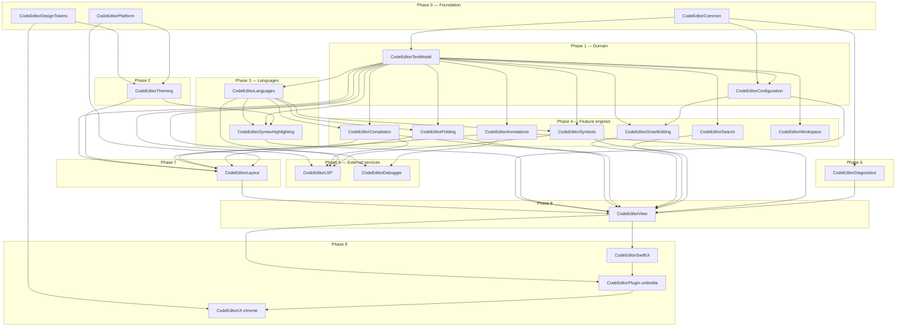

# NEXT.md — Restructuring CodeEditorPlugin for `~/Workspace/packages/`

Analysis and recommendations for splitting the current monolithic `CodeEditorPlugin` target into a layered, MusicToolkit-style package before relocating it into `~/Workspace/packages/`.

---

## 1. Goals

1. **Match the rest of the workspace.** Peer packages in `~/Workspace/packages/` are small, focused, single-purpose modules. The only multi-target package — `MusicToolkit` — uses a strictly layered architecture with phased bootstrap and a single umbrella re-export. CodeEditorPlugin should join that pattern, not start a third.
2. **Make the layers buildable in isolation.** Today, touching the gutter forces a rebuild of TextKit2 helpers, languages, LSP, and the SwiftUI surface. Slicing the 480-file target into ~10 targets gives faster incremental builds and clearer ownership.
3. **Enforce direction of dependencies through SPM, not convention.** Today nothing prevents `Theming` from depending on `Layout`, or `Languages` from reaching into `Core`. Splitting targets makes illegal edges fail at compile time.
4. **Make optional subsystems actually optional.** LSP, Debugger, SwiftUI chrome, and Performance instrumentation should be opt-in libraries, not unconditional payload in the umbrella product.
5. **Preserve the existing public API surface** — consumers that `import CodeEditorPlugin` keep working via the umbrella target.

---

## 2. What MusicToolkit gets right (the model to copy)

Reviewed at `/Users/ajmcclary/Workspace/packages/MusicToolkit`:

- **20+ products, one per concern**, all named `MusicToolkit<Concept>` (e.g. `MusicToolkitModel`, `MusicToolkitImport`, `MusicToolkitRendering`, `MusicToolkitRenderingCG`).
- **Strict bootstrap phases** (0 → 9) documented in `ARCHITECTURE.md §9`. Each target declares which phase it belongs to, and dependencies flow only downward.
- **`MusicToolkitCommon` (phase 0)** holds shared utilities. `MusicToolkitModel` (phase 1) holds the domain. Everything else builds on those two.
- **Backend split via condition'd dependencies.** `MusicToolkitRenderingCG` is Apple-only; `MusicToolkitRenderingSVG` is portable. The umbrella `MusicToolkitExport` references the Apple backend with `.target(... condition: .when(platforms: [.macOS, .iOS, .tvOS, .visionOS]))` so Linux can still compile the parsing-only surface.
- **Test infrastructure as first-class targets.** `MusicToolkitTestSupport` and `MusicToolkitTestCorpus` are real library targets that test targets depend on — no duplicated fixtures.
- **Umbrella target re-exports** the everyday public surface. `MusicToolkit` (the umbrella library) depends on the common subset (`Model`, `Import`, the major format parsers, `Midi`) so consumers can `import MusicToolkit` once for typical use.
- **Architecture is documented as a diagram + dependency table.** `ARCHITECTURE.md` has a Mermaid flow chart for the layered map and a "phases" table. New contributors see the rules immediately.

Workspace convention for **single-purpose kits** is different (kebab-case dir, single module — `platform-kit/Sources/PlatformKit`), but CodeEditorPlugin's size and shape match MusicToolkit, not the kits.

---

## 3. Current state inventory

`Sources/CodeEditorPlugin/` is one target with 21 subdirectories and ~480 Swift files. File counts by subdirectory (largest first):

| Dir | Files | Role |
|---|---|---|
| Languages/ | 66 | 25 concrete language providers, descriptors, folding/symbol/completion data |
| Core/ | 59 | `CodeEditorView`, controllers, actor coordinator, public API, `EditorController+*` slices |
| Text/ | 51 | TextKit2 bridges, range store, line geometry, parsing helpers |
| Layout/ | 40 | Gutter, container view, minimap, popover chrome, event bus |
| SyntaxHighlighting/ | 36 | Highlighting engine, descriptor-driven regex path, tree-sitter adapters |
| Platform/ | 32 | Cross-platform color/font/view shims (`#if canImport(AppKit)/(UIKit)`) |
| Theming/ | 31 | Theme model, token bridge, appearance |
| LSP/ | 24 | Language Server Protocol client |
| Features/ | 23 | Folding, smart editing, search/replace, symbol nav, debugger integration |
| Extensions/ | 22 | Catch-all type extensions |
| Completion/ | 22 | Code-completion engines and providers |
| SwiftUI/ | 19 | SwiftUI wrappers and modifiers |
| Performance/ | 16 | `MemoryMonitor`, profiling, instrumentation |
| Utilities/ | 13 | Shared helpers |
| Annotations/ | 8 | Annotation data sources / badges |
| Configuration/ | 7 | `EditorConfiguration`, presets |
| Models/ | 5 | Shared data models |
| Documents/ | 2 | `EditorDocument` + `EditorDocuments` |
| Workspace/ | 2 | Workspace indexing/search |
| Search/ | 1 | Search result types |
| Resources/ | 0 | Themes JSON only |

Sibling products today: `CodeEditorDesignTokens` (own target), `CodeEditorUI` (depends on the monolith), `CodeEditorSample` (executable).

---

## 4. Proposed layered target layout

Each target is named `CodeEditor<Concept>`, mirroring `MusicToolkit<Concept>`. Bootstrap phases enforce direction. Existing source directories map 1:1 in most cases; `Features/` and `Core/` get split because they currently bundle unrelated subsystems.

### 4.1 Phase table

| Phase | Target | Sources today | Depends on |
|---|---|---|---|
| **0 — Foundation** | `CodeEditorCommon` | `Extensions/`, `Utilities/`, `Models/` | (none) |
| 0 | `CodeEditorPlatform` | `Platform/` | (none) |
| 0 | `CodeEditorDesignTokens` | (already exists) | (none) |
| **1 — Domain** | `CodeEditorTextModel` | `Text/`, `Documents/` | Common |
| 1 | `CodeEditorConfiguration` | `Configuration/` | Common, TextModel |
| **2 — Theming** | `CodeEditorTheming` | `Theming/`, `Resources/Themes/` | DesignTokens, Platform |
| **3 — Languages** | `CodeEditorLanguages` | `Languages/` | TextModel |
| 3 | `CodeEditorSyntaxHighlighting` | `SyntaxHighlighting/` | Languages, TextModel, Theming |
| **4 — Feature engines** | `CodeEditorCompletion` | `Completion/` | Languages, TextModel |
| 4 | `CodeEditorFolding` | `Features/CodeFolding*`, `Features/Fold*`, `Features/LineFoldStorage*` | TextModel, Languages |
| 4 | `CodeEditorSmartEditing` | `Features/SmartEditing*` | TextModel, Configuration |
| 4 | `CodeEditorSearch` | `Features/SearchReplaceEngine.swift`, `Search/` | TextModel |
| 4 | `CodeEditorSymbols` | `Features/SymbolNavigation*`, `Features/SymbolProviderCatalog*`, `Features/SymbolNavigator*` | Languages, TextModel |
| 4 | `CodeEditorAnnotations` | `Annotations/` | TextModel |
| 4 | `CodeEditorWorkspace` | `Workspace/` | TextModel |
| **5 — External services** | `CodeEditorLSP` | `LSP/` | TextModel, Completion, Languages, Symbols |
| 5 | `CodeEditorDebugger` | `Features/Debugger*`, `Features/DebugAdapter*` | TextModel, Annotations |
| **6 — Diagnostics** | `CodeEditorDiagnostics` | `Performance/` | Common |
| **7 — Presentation** | `CodeEditorLayout` | `Layout/` | TextModel, Theming, Completion, Annotations, Folding, Platform |
| **8 — Editor surface** | `CodeEditorView` (or keep name `CodeEditorCore`) | `Core/`, `CodeEditorPlugin.swift` | Everything in phases 1–7 (concrete engines wired in) |
| **9 — SwiftUI** | `CodeEditorSwiftUI` | `SwiftUI/` | the Editor target |
| **Umbrella** | `CodeEditorPlugin` | (just re-exports) | TextModel, Configuration, Theming, Languages, SyntaxHighlighting, Completion, Folding, Symbols, Annotations, Editor surface, SwiftUI |
| **UI chrome** | `CodeEditorUI` (already exists) | (unchanged) | DesignTokens, umbrella |
| **Test support** | `CodeEditorTestSupport` | (new — extract fixtures + mocks from `Tests/CodeEditorPluginTests/Support`) | umbrella, snapshot helpers |
| **Sample app** | `CodeEditorSample` (already exists) | (unchanged) | DesignTokens, umbrella, UI |

### 4.2 Dependency map (Mermaid)



### 4.3 What each split buys you concretely

- **`CodeEditorLanguages` independent of `Core`.** Adding a 26th language stops triggering a TextKit2 / Layout rebuild.
- **`CodeEditorTheming` independent of `Layout`.** Theme JSON / token changes don't churn the gutter and minimap.
- **`CodeEditorLSP` and `CodeEditorDebugger` are opt-in libraries.** A consumer that doesn't want LSP simply doesn't link it; the umbrella can `@_exported import` them only when the consumer also links them, or expose them as separate products. (See §6.3.)
- **`CodeEditorDiagnostics` becomes detachable.** Today `MemoryMonitor` is reachable from anything in the monolith. As its own target with no upward callers, it can be excluded from release builds via a separate product.
- **`CodeEditorTextModel` becomes the testable core.** The `Text/` + `Documents/` boundary already exists in your head — making it a real SPM boundary is mostly a matter of declaring it.

---

## 5. Workspace placement & naming

### 5.1 Directory placement

`MusicToolkit` lives at `~/Workspace/packages/MusicToolkit/` (PascalCase, matches its module name). The kebab-case convention (`platform-kit/`, `design-tokens/`) is only used by small single-module kits. CodeEditorPlugin matches MusicToolkit's shape, so:

```
~/Workspace/packages/CodeEditorPlugin/
```

(or the rename below).

### 5.2 Rename opportunity — "Plugin" is misleading

The package isn't a plugin to anything; it's a code-editor framework. Three options:

1. **Keep `CodeEditorPlugin`** — minimum disruption, but the name remains misleading and the umbrella target name clashes semantically with what's inside it (no real plugin system exists; see `CLAUDE.md` § "Watch for stale claims": `PluginManager`/`PluginAPI` don't exist).
2. **Rename to `CodeEditorToolkit`** — mirrors `MusicToolkit`. All targets become `CodeEditorToolkit<Concept>`. Consistent with the workspace's other multi-target package.
3. **Rename to `CodeEditorKit`** — shorter, but uses the kit convention which the rest of the workspace reserves for single-module packages.

**Recommendation:** option 2 if you're willing to take the rename hit during the move (you're already touching every target name); option 1 if you want the move to be additive only.

### 5.3 What `~/Workspace/packages/CLAUDE.md` will need

A row added to its table, parallel to the existing MusicToolkit row:

> `CodeEditorPlugin/` (or `CodeEditorToolkit/`) — TextKit2-based code editor framework: text model, languages, syntax highlighting, completion, folding, LSP, layout, SwiftUI surface.

---

## 6. Migration plan

Suggested ordering minimizes broken-build windows. Each step is a single commit / PR.

### 6.1 Pre-work (do before any target split)

1. **Move docs that reference dead symbols out of authority.** `CLAUDE.md` already calls out `PluginManager`, `PluginAPI`, etc. as non-existent. Confirm nothing in `docs/` (non-archive) still describes a plugin system; if it does, archive it. Otherwise the layered diagram will inherit stale prose.
2. **Verify the `Models/` (5 files), `Workspace/` (2 files), and `Search/` (1 file) directories aren't load-bearing across domains.** If they're shared across what would become separate targets, decide their home now. (My current assumption: Models → `Common`; Search standalone; Workspace standalone.)
3. **Inventory `Core/` for genuinely "core" vs. "editor view" content.** `Core/Actors/`, `ActorCoordinator`, `CodeEditorDependencies`, `CodeEditorError` belong in `Common`. The `CodeEditorView+*Extensions.swift` files belong in the eventual `CodeEditorView` target. The split happens in step 6.2.10 — pre-work here is just labelling.

### 6.2 Step-by-step split

Do these in order; each one should leave `swift build && swift test` green.

1. **Extract `CodeEditorCommon`** — move `Extensions/`, `Utilities/`, and `Models/` to a new target. Audit imports; nothing here should import anything else internal.
2. **Extract `CodeEditorPlatform`** — move `Platform/` to a new target. Cross-platform color/font/view types. No internal deps.
3. **Extract `CodeEditorTextModel`** — move `Text/` and `Documents/`. Depends on `Common`. This is the largest single extraction and the highest-leverage one.
4. **Extract `CodeEditorConfiguration`** — move `Configuration/`. Depends on `Common`, `TextModel`.
5. **Extract `CodeEditorTheming`** — move `Theming/` + the themes JSON resource. Depends on `DesignTokens`, `Platform`.
6. **Extract `CodeEditorLanguages`** — move `Languages/`. Depends on `TextModel`. Audit: today `Languages/` may reference `SyntaxHighlighting` / `Completion` types — if so, push those types down into a `…/Interfaces.swift` in `CodeEditorLanguages` and have the higher layers conform.
7. **Extract `CodeEditorSyntaxHighlighting`** — move `SyntaxHighlighting/`. Depends on `Languages`, `TextModel`, `Theming`.
8. **Extract feature engines individually** — `Completion`, `Folding`, `SmartEditing`, `Search`, `Symbols`, `Annotations`, `Workspace`. Splitting `Features/` is the only awkward step because its contents are heterogeneous. Suggested order: `Folding` → `Symbols` → `SmartEditing` → `Search` → `Annotations` → `Workspace` → `Completion` last (it has the most call sites).
9. **Extract `CodeEditorLSP` and `CodeEditorDebugger`** — both depend on engines from step 8. Make them separate **products**, not just targets, so consumers can opt out. (Debugger may already be design-only per `CLAUDE.md`'s note about archived design — confirm whether to keep, gate behind a product, or delete.)
10. **Extract `CodeEditorDiagnostics`** — move `Performance/`. Make it a separate product so consumers can omit it from release builds.
11. **Extract `CodeEditorLayout`** — move `Layout/`. This depends on most of phase 4.
12. **Split `Core/`** — the `Actors/` subdirectory, `ActorCoordinator`, `CodeEditorAPI`, `CodeEditorDependencies`, `CodeEditorError`, `CodeEditorViewProtocol`, and the orchestration services move into the new editor-surface target (`CodeEditorView` or `CodeEditorCore`). The `CodeEditorView+*Extensions.swift` slices stay with their owning type. `Info.plist` stays as the target's resource exclude.
13. **Extract `CodeEditorSwiftUI`** — move `SwiftUI/`. Depends on the editor-surface target.
14. **Re-define the umbrella `CodeEditorPlugin` target** — strip its sources to a single `CodeEditorPlugin.swift` that `@_exported import`s the everyday public surface. All `.product(name: "CodeEditorPlugin", …)` references in `CodeEditorUI`, `CodeEditorSample`, and external consumers keep working.
15. **Add `CodeEditorTestSupport`** — extract `Tests/CodeEditorPluginTests/Support/*` (or equivalent shared fixtures) into a library target. Update test targets to depend on it. Mirrors MusicToolkit's pattern.
16. **Move to `~/Workspace/packages/`** — only after the structure is settled. Update consumers (Sonography / Bridge / PixelLift etc.) to point at the new local path. Add the row to `~/Workspace/packages/CLAUDE.md`.

### 6.3 Products to expose

To match MusicToolkit's "one product per concern" model, expose products for every target a consumer might want to opt in/out of:

- Always: `CodeEditorPlugin` (umbrella), `CodeEditorDesignTokens`, `CodeEditorUI`
- Probably: `CodeEditorTextModel`, `CodeEditorLanguages`, `CodeEditorTheming`, `CodeEditorSyntaxHighlighting`, `CodeEditorSwiftUI`
- Optional / opt-in: `CodeEditorLSP`, `CodeEditorDebugger`, `CodeEditorDiagnostics`, `CodeEditorWorkspace`

That mirrors MusicToolkit's surface where `Playback`, `PlaybackAVFAudio`, `Rendering`, `RenderingCG`, `RenderingSVG`, `MIDI`, `Export`, `LilyPondExport`, `MEI`, `ABC`, `PAE`, `MusicXML` are all separate products.

---

## 7. Tests

- Currently `CodeEditorPluginTests` is one big target with snapshot subdirectories (`Theming/__Snapshots__`, `Layout/__Snapshots__`). After the split, give each library target its own test target — `CodeEditorTextModelTests`, `CodeEditorLanguagesTests`, etc. MusicToolkit does this and it keeps test scope obvious.
- Snapshot tests stay with the target that owns the rendered surface (`CodeEditorLayoutTests`, `CodeEditorThemingTests`). The `__Snapshots__` directories continue to be in `excludes:` per target.
- `CodeEditorTestSupport` holds shared fixtures, mock `EditorConfiguration` factories, and snapshot helpers. Don't sprinkle these across test targets.
- The existing rule from memory — "skip full `swift test --parallel` after additive-only steps; trust the build and run targeted tests instead" — fits this migration well. Each extraction step should be verifiable with `swift build && swift test --filter <newTargetName>`.

---

## 8. Risks & open questions

1. **`Core/` is genuinely tangled.** 59 files in one directory, including the public API surface (`CodeEditorAPI.swift`), the AppKit/UIKit view bridge (`CodeEditorView.swift` + 17 `+Extensions` slices), the actor model (`Actors/`, `ActorCoordinator`), error types, and dirty tracking. The split in step 6.2.12 is the riskiest single move. Plan a dedicated session for it; don't combine with another extraction.
2. **`Features/` mixes shipped and not-yet-shipped subsystems.** `DebuggerIntegration*` may be design-only — confirm before promoting it to its own target. If it's not shipping, delete it instead of splitting it (matches `CLAUDE.md`'s "don't ship half-finished" stance).
3. **Naming churn vs. one-time rename.** If you're going to rename `CodeEditorPlugin` → `CodeEditorToolkit`, do it as part of the move, not before or after. Doing it before doubles the disruption; doing it after means another sweep of consumers.
4. **Cross-package consumers exist.** Per `~/Workspace/packages/CLAUDE.md`, MusicToolkit is consumed by Sonography and notation-engine. Once CodeEditorPlugin moves into `packages/`, identify its consumers (if any in `~/Workspace/products/`) and migrate their `Package.swift` paths in the same PR as the move.
5. **The snapshot-testing fork pin.** Both MusicToolkit and CodeEditorPlugin already pin `ajmcclary/swift-snapshot-testing@fix-swift-6.3-attachable` — same comment, same justification. After the move, this becomes a workspace-wide constraint; the next time you're tempted to revert to upstream, do it in both packages together.
6. **`#if canImport(AppKit)/(UIKit)` conventions.** CLAUDE.md enforces this across ~217 files. After the split, the rule still applies, but it should now mostly live inside `CodeEditorPlatform` and a few presentation targets — engines below phase 7 should rarely need it. Treat new `#if canImport` outside those targets as a code smell.

---

## 9. Non-goals

- **Not rewriting any code paths.** This restructure is import-graph surgery, not feature work. Don't combine it with debugger completion, tree-sitter expansion, or LSP changes.
- **Not building a plugin system.** The current name notwithstanding, no `PluginManager`/`PluginAPI` exists, and none should be introduced as part of this restructure.
- **Not changing supported platforms.** Mac Catalyst and TextKit1 stay retired (per CLAUDE.md). The platform floor stays at macOS 26.3 / iOS 26.3.
- **Not reintroducing DocC.** Long-form prose stays in `docs/*.md`; the layered ARCHITECTURE diagram is a Mermaid file, not a DocC catalog.

---

## 10. Suggested next session

A single session can realistically complete steps 6.2.1 → 6.2.5 (Common, Platform, TextModel, Configuration, Theming) — those are the cleanest cuts and unblock everything else. Steps 6.2.6 → 6.2.11 each warrant their own session. The `Core/` split (6.2.12) is the only step that's worth its own dedicated half-day. After 6.2.15 (test support), the move into `~/Workspace/packages/` is a one-PR mechanical change.
