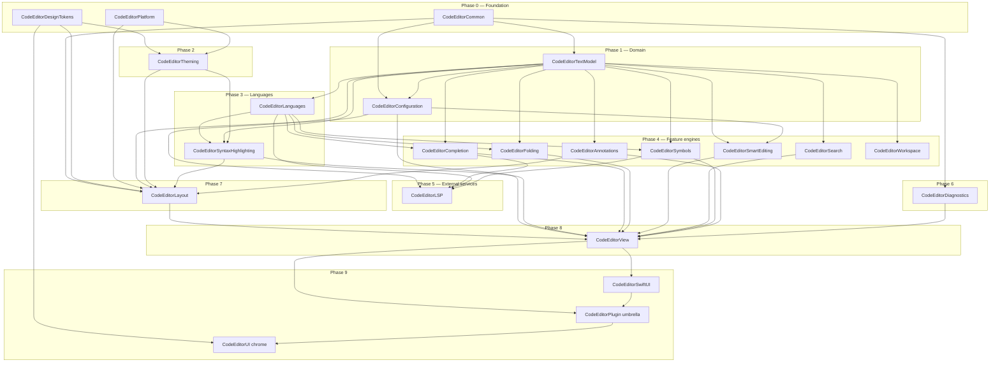

# NEXT.md — Restructuring CodeEditorPlugin for `~/Workspace/packages/`

Analysis and recommendations for splitting the current monolithic `CodeEditorPlugin` target into a layered, MusicToolkit-style package before relocating it into `~/Workspace/packages/`.

---

## 1. Goals

1. **Match the rest of the workspace.** Peer packages in `~/Workspace/packages/` are small, focused, single-purpose modules. The only multi-target package — `MusicToolkit` — uses a strictly layered architecture with phased bootstrap and a single umbrella re-export. CodeEditorPlugin should join that pattern, not start a third.
2. **Make the layers buildable in isolation.** Today, touching the gutter forces a rebuild of TextKit2 helpers, languages, LSP, and the SwiftUI surface. Slicing the 480-file target into ~10 targets gives faster incremental builds and clearer ownership.
3. **Enforce direction of dependencies through SPM, not convention.** Today nothing prevents `Theming` from depending on `Layout`, or `Languages` from reaching into `Core`. Splitting targets makes illegal edges fail at compile time.
4. **Make optional subsystems actually optional.** LSP, SwiftUI chrome, and Performance instrumentation should be opt-in libraries, not unconditional payload in the umbrella product.
5. **Preserve the existing public API surface** — consumers that `import CodeEditorPlugin` keep working via the umbrella target.

---

## 2. What MusicToolkit gets right (the model to copy)

Reviewed at `/Users/ajmcclary/Workspace/packages/MusicToolkit`:

- **20+ products, one per concern**, all named `MusicToolkit<Concept>` (e.g. `MusicToolkitModel`, `MusicToolkitImport`, `MusicToolkitRendering`, `MusicToolkitRenderingCG`).
- **Strict bootstrap phases** (0 → 9) documented in `ARCHITECTURE.md §9`. Each target declares which phase it belongs to, and dependencies flow only downward.
- **`MusicToolkitCommon` (phase 0)** holds shared utilities. `MusicToolkitModel` (phase 1) holds the domain. Everything else builds on those two.
- **Backend split via condition'd dependencies.** `MusicToolkitRenderingCG` is Apple-only; `MusicToolkitRenderingSVG` is portable. The umbrella `MusicToolkitExport` references the Apple backend with `.target(... condition: .when(platforms: [.macOS, .iOS, .tvOS, .visionOS]))` so Linux can still compile the parsing-only surface.
- **Test infrastructure as first-class targets.** `MusicToolkitTestSupport` and `MusicToolkitTestCorpus` are real library targets that test targets depend on — no duplicated fixtures.
- **Umbrella target re-exports** the everyday public surface. `MusicToolkit` (the umbrella library) depends on the common subset (`Model`, `Import`, the major format parsers, `Midi`) so consumers can `import MusicToolkit` once for typical use.
- **Architecture is documented as a diagram + dependency table.** `ARCHITECTURE.md` has a Mermaid flow chart for the layered map and a "phases" table. New contributors see the rules immediately.

Workspace convention for **single-purpose kits** is different (kebab-case dir, single module — `platform-kit/Sources/PlatformKit`), but CodeEditorPlugin's size and shape match MusicToolkit, not the kits.

---

## 3. Current state inventory

`Sources/CodeEditorPlugin/` is one target with 21 subdirectories and ~480 Swift files. File counts by subdirectory (largest first):

| Dir | Files | Role |
|---|---|---|
| Languages/ | 66 | 25 concrete language providers, descriptors, folding/symbol/completion data |
| Core/ | 59 | `CodeEditorView`, controllers, actor coordinator, public API, `EditorController+*` slices |
| Text/ | 51 | TextKit2 bridges, range store, line geometry, parsing helpers |
| Layout/ | 0 | extracted to `CodeEditorLayout` (22 files) and umbrella `Core/Layout/` (21 files) in §6.2.11 |
| SyntaxHighlighting/ | 36 | Highlighting engine, descriptor-driven regex path, tree-sitter adapters |
| Platform/ | 32 | Cross-platform color/font/view shims (`#if canImport(AppKit)/(UIKit)`) |
| Theming/ | 31 | Theme model, token bridge, appearance |
| LSP/ | 24 | Language Server Protocol client |
| Features/ | 23 | Folding, smart editing, search/replace, symbol nav |
| Extensions/ | 22 | Catch-all type extensions |
| Completion/ | 22 | Code-completion engines and providers |
| SwiftUI/ | 19 | SwiftUI wrappers and modifiers |
| Performance/ | 16 | `MemoryMonitor`, profiling, instrumentation |
| Utilities/ | 13 | Shared helpers |
| Annotations/ | 8 | Annotation data sources / badges |
| Configuration/ | 7 | `EditorConfiguration`, presets |
| Models/ | 5 | Shared data models |
| Documents/ | 2 | `EditorDocument` + `EditorDocuments` |
| Workspace/ | 2 | Workspace indexing/search |
| Search/ | 1 | Search result types |
| Resources/ | 0 | Themes JSON only |

Sibling products today: `CodeEditorDesignTokens` (own target), `CodeEditorUI` (depends on the monolith), `CodeEditorSample` (executable).

---

## 4. Proposed layered target layout

Each target is named `CodeEditor<Concept>`, mirroring `MusicToolkit<Concept>`. Bootstrap phases enforce direction. Existing source directories map 1:1 in most cases; `Features/` and `Core/` get split because they currently bundle unrelated subsystems.

### 4.1 Phase table

| Phase | Target | Sources today | Depends on |
|---|---|---|---|
| **0 — Foundation** | `CodeEditorCommon` | `Extensions/`, `Utilities/`, `Models/` | (none) |
| 0 | `CodeEditorPlatform` | `Platform/` | (none) |
| 0 | `CodeEditorDesignTokens` | (already exists) | (none) |
| **1 — Domain** | `CodeEditorTextModel` | `Text/`, `Documents/` | Common |
| 1 | `CodeEditorConfiguration` | `Configuration/` | Common, TextModel |
| **2 — Theming** | `CodeEditorTheming` | `Theming/`, `Resources/Themes/` | DesignTokens, Platform |
| **3 — Languages** | `CodeEditorLanguages` | `Languages/` | TextModel |
| 3 | `CodeEditorSyntaxHighlighting` | `SyntaxHighlighting/` | Languages, TextModel, Theming |
| **4 — Feature engines** | `CodeEditorCompletion` | `Completion/` | Languages, TextModel |
| 4 | `CodeEditorFolding` | `Features/CodeFolding*`, `Features/Fold*`, `Features/LineFoldStorage*` | TextModel, Languages |
| 4 | `CodeEditorSmartEditing` | `Features/SmartEditing*` | TextModel, Configuration |
| 4 | `CodeEditorSearch` | `Search/` (only; `Features/SearchReplaceEngine.swift` stays in umbrella per §6.2.8d — `CodeEditorView`-coupled, awaiting §6.2.12) | (none — Foundation only) |
| 4 | `CodeEditorSymbols` | `Features/SymbolNavigation*`, `Features/SymbolProviderCatalog*`, `Features/SymbolNavigator*` | Languages, TextModel |
| 4 | `CodeEditorAnnotations` | `Annotations/` (7 of 8 files; `AnnotationsDataSource.swift` stays in umbrella per §6.2.8e — `CodeEditorView`-coupled, awaiting §6.2.12) | Common, Platform, Theming |
| 4 | `CodeEditorWorkspace` | `Workspace/` | TextModel |
| **5 — External services** | `CodeEditorLSP` | `LSP/` (22 of 24 files; `LSPSemanticTokenProvider.swift` and `LSPContentCoordinator.swift` stay in umbrella per §6.2.9 — `CodeEditorView`-coupled, awaiting §6.2.12) | Common, Completion, Diagnostics, Languages, Platform, TextModel |
| **6 — Diagnostics** | `CodeEditorDiagnostics` | `Performance/` | Common |
| **7 — Presentation** | `CodeEditorLayout` | `Layout/` (22 of 41 originals moved; 21 stayed in umbrella `Core/Layout/`) | Annotations, Common, Configuration, DesignTokens, Platform, SyntaxHighlighting, Theming |
| **8 — Editor surface** | `CodeEditorView` (or keep name `CodeEditorCore`) | `Core/`, `CodeEditorPlugin.swift` | Everything in phases 1–7 (concrete engines wired in) |
| **9 — SwiftUI** | `CodeEditorSwiftUI` | `SwiftUI/` | the Editor target |
| **Umbrella** | `CodeEditorPlugin` | (just re-exports) | TextModel, Configuration, Theming, Languages, SyntaxHighlighting, Completion, Folding, Symbols, Annotations, Editor surface, SwiftUI |
| **UI chrome** | `CodeEditorUI` (already exists) | (unchanged) | DesignTokens, umbrella |
| **Test support** | `CodeEditorTestSupport` | (new — extract fixtures + mocks from `Tests/CodeEditorPluginTests/Support`) | umbrella, snapshot helpers |
| **Sample app** | `CodeEditorSample` (already exists) | (unchanged) | DesignTokens, umbrella, UI |

### 4.2 Dependency map (Mermaid)



### 4.3 What each split buys you concretely

- **`CodeEditorLanguages` independent of `Core`.** Adding a 26th language stops triggering a TextKit2 / Layout rebuild.
- **`CodeEditorTheming` independent of `Layout`.** Theme JSON / token changes don't churn the gutter and minimap.
- **`CodeEditorLSP` is an opt-in library.** A consumer that doesn't want LSP simply doesn't link it; the umbrella can `@_exported import` it only when the consumer also links it, or expose it as a separate product. (See §6.3.)
- **`CodeEditorDiagnostics` becomes detachable.** Today `MemoryMonitor` is reachable from anything in the monolith. As its own target with no upward callers, it can be excluded from release builds via a separate product.
- **`CodeEditorTextModel` becomes the testable core.** The `Text/` + `Documents/` boundary already exists in your head — making it a real SPM boundary is mostly a matter of declaring it.

---

## 5. Workspace placement & naming

### 5.1 Directory placement

`MusicToolkit` lives at `~/Workspace/packages/MusicToolkit/` (PascalCase, matches its module name). The kebab-case convention (`platform-kit/`, `design-tokens/`) is only used by small single-module kits. CodeEditorPlugin matches MusicToolkit's shape, so:

```
~/Workspace/packages/CodeEditorPlugin/
```

(or the rename below).

### 5.2 Rename opportunity — "Plugin" is misleading

The package isn't a plugin to anything; it's a code-editor framework. Three options:

1. **Keep `CodeEditorPlugin`** — minimum disruption, but the name remains misleading and the umbrella target name clashes semantically with what's inside it (no real plugin system exists; see `CLAUDE.md` § "Watch for stale claims": `PluginManager`/`PluginAPI` don't exist).
2. **Rename to `CodeEditorToolkit`** — mirrors `MusicToolkit`. All targets become `CodeEditorToolkit<Concept>`. Consistent with the workspace's other multi-target package.
3. **Rename to `CodeEditorKit`** — shorter, but uses the kit convention which the rest of the workspace reserves for single-module packages.

**Recommendation:** option 2 if you're willing to take the rename hit during the move (you're already touching every target name); option 1 if you want the move to be additive only.

### 5.3 What `~/Workspace/packages/CLAUDE.md` will need

A row added to its table, parallel to the existing MusicToolkit row:

> `CodeEditorPlugin/` (or `CodeEditorToolkit/`) — TextKit2-based code editor framework: text model, languages, syntax highlighting, completion, folding, LSP, layout, SwiftUI surface.

---

## 6. Migration plan

Suggested ordering minimizes broken-build windows. Each step is a single commit / PR.

### 6.0 Status (as of 2026-05-18)

**Phases 0–5 done; phases 7–8 carved out; §6.2.8 feature engines closed.** `CodeEditorDiagnostics` (§6.2.10) landed ahead of §6.2.7 in `e60f7857` to unblock SyntaxHighlighting. `CodeEditorSyntaxHighlighting` (§6.2.7) followed as a carve-out — 36 of 45 SH files moved to the new target; 9 `CodeEditorView`-coupled files stayed in umbrella under `Core/SyntaxHighlighting/`. The §6.2.8 feature engines extracted next (`CodeEditorFolding`, `CodeEditorSymbols`, `CodeEditorWorkspace`, `CodeEditorSearch`, `CodeEditorAnnotations`, `CodeEditorCompletion`; `CodeEditorSmartEditing` initially deferred). `CodeEditorLSP` (§6.2.9) carved out next — 22 of 24 files moved; 2 `CodeEditorView`-coupled files stayed in umbrella under `Core/LSP/`. `CodeEditorLayout` (§6.2.11) followed as the first presentation-layer extraction — 22 carry-set files moved; 21 stayed in umbrella under `Core/Layout/`. Then `CodeEditorView` (§6.2.12) shipped as the clean editor-surface extraction — all 118 files in `Core/` moved cleanly to the new target. Finally `CodeEditorSmartEditing` (§6.2.8c) closed the §6.2.8 feature-engine series — 5 files moved cleanly from `Features/`, last extraction before the SwiftUI / umbrella-stub / test-support endgame. Then `CodeEditorSwiftUI` (§6.2.13) extracted the SwiftUI slice — 17 files moved cleanly, leaving only `CodeEditorPlugin.swift` + `Languages/` (own target via `path:`) + `Resources/` in the umbrella. Fourteen new SPM targets now exist alongside the existing `CodeEditorDesignTokens` / `CodeEditorPlugin` / `CodeEditorUI` / `CodeEditorSample`. Build green on every commit.

| Target | Commit | What landed | Direct deps |
|---|---|---|---|
| `CodeEditorCommon` | `f0c438f1` | `Extensions/`, `Utilities/`, `Models/`, `Errors/` (+ `RecoverableAsyncError.swift` added during §6.2.7) | (none) |
| `CodeEditorTextModel` | `b6bfdbe9` | 32 of 51 `Text/` files (range storage, geometry, location, parsing primitives) (+ 3 RangeStore files relocated from umbrella `Core/Text/RangeStore/` during §6.2.7) | Common |
| `CodeEditorPlatform` | `77880e9f` | 20 of 34 `Platform/` files (Colors, Fonts, Constants, ServiceLayer, Capabilities, ViewReuseQueue, DeviceType, etc.) | Common |
| `CodeEditorConfiguration` | `5838c24a` | `Configuration/` (7 files) | Common, Platform, TextModel |
| `CodeEditorTheming` | `4c71e49e` | `Theming/` (32 files) + `Resources/Themes/` | Common, DesignTokens |
| `CodeEditorLanguages` | `14921a61` | 71 files (66 originals from `Languages/` + `Language` enum from SyntaxHighlighting + 2 Completion model files + 2 Folding/Symbol interface files split from Features/ + `SnippetTemplate` from Completion + `RegexSyntaxTokenType` enum split from SyntaxHighlighting; net of 2 files moving out: `SwiftSyntaxHighlighter*.swift` relocated to umbrella `SyntaxHighlighting/` then back into `CodeEditorSyntaxHighlighting` in §6.2.7) | Common, Platform, TextModel |
| `CodeEditorDiagnostics` | `e60f7857` | 14 files (13 from `Performance/` + 1 split-out `MemoryMonitor+AvailableMemory.swift` from SH; 2 dead files deleted, 1 misfiled relocated to umbrella `Layout/`, 1 misfiled relocated to umbrella `Core/`) | Common, Configuration, Languages, Platform, IssueReporting |
| `CodeEditorSyntaxHighlighting` | `f2798287` | 38 files (36 pure-engine files from umbrella `SyntaxHighlighting/` + 2 extracted during execution: `RangeQueryParser.swift` and `SyntaxHighlightingError.swift`). 9 `CodeEditorView`-coupled files relocated to `Core/SyntaxHighlighting/` in pre-commit `818df5f6`; 5 `CodeEditorDependencies.makePlatformCapabilities()` sites inlined in `AdaptiveColorSystem.swift` in pre-commit `1a5dc86c`. | Common, DesignTokens, Diagnostics, Languages, Platform, TextModel, Theming + SwiftSyntax/SwiftParser |
| `CodeEditorFolding` | `76abf928` | 4 pure fold-storage / provider-registry files from `Features/` (`FoldStoreElement`, `LineFoldStorage` + `FoldInfo`, `FoldRegionAdapter`, `FoldingProviderRegistry`). 4 `CodeEditorView`-coupled files (`CodeFoldingEngine`, `FoldingOperationsService`, `FoldPresentationStrategy`, `CodeFoldingConfiguration` — renamed from misnamed `FoldableRegion.swift`) relocated to umbrella `Core/Folding/` in pre-commit `9704e80b`. | Common, Languages, SyntaxHighlighting, TextModel |
| `CodeEditorSymbols` | `fefe8f93` | 3 files in new target (2 from `Features/` — `SymbolNavigationTypes`, `SymbolProviderCatalog` — + 1 split-out `SymbolRangeIndex.swift` extracted from `SymbolProviderCatalog`). 1 `CodeEditorView`-coupled file (`SymbolNavigator`) relocated to umbrella `Core/Symbols/` in pre-commit `5d670076`. | Languages, SyntaxHighlighting |
| `CodeEditorWorkspace` | `c1739137` | 2 files moved from umbrella `Workspace/` to new target (`WorkspaceFileProtocols.swift`, `MacOSWorkspaceFileManager.swift`). Zero `CodeEditorView` coupling, zero internal SPM deps. Productized as opt-in `.library` per §6.3. Umbrella does NOT depend on it. | (none) |
| `CodeEditorSearch` | `18f9d43a` | 1 file moved from umbrella `Search/` to new target (`ProjectSearchProvider.swift`). Pre-commit `0cdf53f9` relocated umbrella-coupled `SearchReplaceEngine.swift` to `Core/Search/` and migrated `EditorController+SelectMatch.swift` to `CodeEditorSample/EditorActions/` (removing `EditorController.selectMatch(_ result: ProjectSearchResult)` from the umbrella's public API). Productized as opt-in `.library` per §6.3. Umbrella does NOT depend on it. | (none) |
| `CodeEditorAnnotations` | `9ce2934a` | 7 files moved from umbrella `Annotations/` to new target (`Annotation`, `AnnotationKind`, `AnnotationView`, `AnnotationsContentView`, `CodeEditorViewAnnotation`, `LineAnnotation`, `MessageLineAnnotation`). Pre-commit `28fa10e5` relocated umbrella-coupled `AnnotationsDataSource.swift` to `Core/Annotations/`. Not productized — umbrella consumes Annotation types via 6 files (matches Folding/Symbols/SH/Languages precedent). Zero access-modifier promotions. | Common, Platform, Theming |
| `CodeEditorCompletion` | `28b78b4f` | 19 files moved from umbrella `Completion/` to new target. Clean full extraction — no carve-out, no `Core/Completion/` bucket. 1 SwiftUI bridge file moved with them (`SwiftUI/CodeEditor+CompletionExtensions.swift` → `SwiftUICompletionTypes.swift`, 3 types: `SwiftUICompletionContext`, `SwiftUICompletionItem`, `CompletionKind`) — required because `SwiftUIClosureCompletionProvider` consumes them. `SendableError` relocated from umbrella `Core/EditorEvent.swift` to `CodeEditorCommon/SendableError.swift` for cross-target accessibility. Routes through umbrella (umbrella depends; not productized) per Folding/Symbols/SH/Annotations precedent. 3 access-modifier promotions (`CompletionItemAdapter`, `SwiftUIClosureCompletionProvider`, `CompletionStatistics.init`) + 6 `@testable import CodeEditorCompletion` test-file adoptions. Sample app + Sample tests gained the new dep; 4 sample sources + 3 sample tests gained the import (spec said zero). | Common, Diagnostics, Languages, Platform, TextModel |
| `CodeEditorLSP` | `d50fc04` | 22 of 24 files moved from umbrella `LSP/` to new target (18 top-level + 4 `Transport/`). 2 `CodeEditorView`-coupled files (`LSPSemanticTokenProvider`, `LSPContentCoordinator`) relocated to umbrella `Core/LSP/` in pre-commit `8f73b99`. Productized as opt-in `.library` per §6.3; umbrella DOES depend on it (matches §6.2.10 Diagnostics precedent — productized + umbrella-coupled, not §6.2.8d Search-style umbrella-decoupled opt-out). 1 confirmed access-modifier promotion (`LSPSemanticTokenStorage` class + 5 members + nested `DecodedToken` struct's `let` props) + 6 `@testable import CodeEditorLSP` test-file adoptions (reaching internal `LSPClientRegistry`, `LSPConnectionManager`, `LSPProcessManager`, `LSPMessageHandler`, `convertLSPRangeToNSRange`, `makeServerConfiguration`, etc.). See §6.2.9 deviation block for full ripple. | Common, Completion, Diagnostics, Languages, Platform, TextModel |
| `CodeEditorLayout` | `3a2aba83` | 22 files in new target (20 originals from umbrella `Layout/` + 1 split-out `ThemeableUIComponent+LayoutConformances.swift` + 1 extracted `EditorLayoutTypes.swift` holding 4 types lifted from umbrella `EditorLayoutService`). 19 originals + 1 split-out `ThemeableUIComponent+UmbrellaConformances.swift` + `ComponentFrameCalculator` (re-classified to stay-set during execution because it consumes `GutterSizingService` → `LineNumberCalculationService` → `CodeEditorView`) relocated to umbrella `Core/Layout/`. The 19-original stay-set relocation landed in pre-commit `1f1e9322`. Cross-target relocations: `SourcePosition` → `CodeEditorCommon`, `EditorConfiguration: Hashable` conformance → `CodeEditorConfiguration`. Productized as `.library` per §6.3; umbrella DOES depend on it (matches §6.2.9 LSP / §6.2.10 Diagnostics precedent). 10 access-modifier promotions (`EditorEventBus` class + init + 4 members; `StyledMinimapStyleDataSource` class + init + `styleRuns`; `EnvironmentValues.editorEventBus`). 13 umbrella imports + 1 `import CodeEditorCommon` (Core/Layout/EditorEventBusInstaller); 8 plugin-test `@testable import CodeEditorLayout` adoptions + 1 plugin-test `import CodeEditorCommon` (SourcePositionTests). Sample / UI / SampleTests unchanged. See §6.2.11 deviation block. | Annotations, Common, Configuration, DesignTokens, Platform, SyntaxHighlighting, Theming |
| `§6.2.12a Core/ prep` | `d129070`, `7f498a8`, `f3b89fc`, `280b82e` | 9 files relocated from umbrella `Core/` to existing sibling SPM targets — 3 from `Core/Platform/` to CodeEditorConfiguration (`DeviceType+RecommendedConfiguration`, `PlatformAdjustments+Extensions`, `TextInputFeatures`); 4 from `Core/Text/` to CodeEditorTextModel (`BackgroundProcessor`, `ParagraphStyleCache`, `TemporaryAttributesStore`, `TextLayoutFragment`); 1 root file to CodeEditorConfiguration (`EditorConfiguration+ApplyTextInputFeatures`); 1 root file to CodeEditorSymbols (`BreadcrumbComponent`). Zero new SPM targets. 4 `internal → package` promotions (`TextLayoutFragment` class + init + `required init?(coder:)` + `override draw(at:in:)`). 2 Package.swift edits (`CodeEditorUI` + `CodeEditorUITests` targets gain `CodeEditorSymbols` dep). Core/ shrinks 138 → 129 (-9, -6.5%). Umbrella shrinks 232 → 223 (-3.9%). See §6.2.12a deviation block. | (no new target) |
| `§6.2.12b Core/ prep` | `7cd4421`, `29e4a70`+`5bbb5b7`, `d26527e` | 3 files relocated from umbrella `Core/` to existing sibling SPM targets — 1 to CodeEditorCommon (`SendableTypes`); 2 to CodeEditorLanguages (`TabModel`, `LanguageDetectionService`). Zero new SPM targets. 0 access-modifier promotions. 1 Package.swift edit (`CodeEditorUITests` target gains `CodeEditorLanguages` dep; `CodeEditorUI` already had it post-§6.2.6). Core/ shrinks 129 → 126 (-3, -2.3%). `Sources/CodeEditorPlugin/` shrinks 223 → 222 (-0.4%) — only `SendableTypes` physically leaves the umbrella source tree; the other 2 moves stay within `Sources/CodeEditorPlugin/` (Languages/ is its own SPM target compiled via `path:`). TabModel split across two commits (rename `29e4a70`; import wiring + Package.swift `5bbb5b7`). See §6.2.12b deviation block. | (no new target) |
| `§6.2.12c Core/ prep` | `8d47cb6`, `dadf8e7`, `bf29f9b`, `13df305`, `62ec4e7` | 3 files relocated from umbrella `Core/` to `CodeEditorCommon/` (`SelectionState`, `EditorInteractionState`, `DirtyTracker`). 1 file split + renamed: `CompletionAsyncError` deleted (dead public enum, ~140 LOC, zero in-tree callers); `ErrorRecoveryCoordinator` relocated from umbrella `Core/AsyncOperationErrors.swift` to `CodeEditorCommon/ErrorRecoveryCoordinator.swift` with `SyntaxHighlightingError.cancelled → CancellationError()` swap. 4-file `TextSystem` dead-code cluster deleted (`TextSystem`, `TextSystemStyler`, `ThreePhaseTextSystemStyler`, `TokenSystemValidator`). 5 access-modifier promotions on `DirtyTracker` (struct + explicit `public init()` + 3 methods); 1 promotion on `ErrorRecoveryCoordinator` (explicit `public init()` to satisfy the synth-init-defaults-to-internal-on-public-actor pattern). 1 Package.swift edit (`CodeEditorUITests` gains `CodeEditorCommon` dep). Core/ shrinks 126 → 118 (-8, -6.3%). `Sources/CodeEditorPlugin/` shrinks 222 → 214 (-3.6%). First §6.2.12-prep round with public-API removals (5 types — TextSystem cluster of 4 + CompletionAsyncError). 1 soft public-API relocation (ErrorRecoveryCoordinator from umbrella to Common). See §6.2.12c deviation block. | (no new target) |
| `CodeEditorView` | `ae61428` (scaffold), `8ab2075` (bulk move), `d0324a9` (clean-build fix) | All 118 files in `Sources/CodeEditorPlugin/Core/` moved cleanly to new `Sources/CodeEditorView/` target. Clean full extraction — no carve-out. Productized as `.library`; umbrella DOES depend on it (matches §6.2.9 LSP / §6.2.10 Diagnostics / §6.2.11 Layout precedent). New `CodeEditorCoordinating` marker protocol (package, MainActor) added to the target to break the would-be circular dep with umbrella SwiftUI/'s `CodeEditorBaseCoordinator`. 16 access-modifier promotions (4 top-level types: `CodeEditorRenderingDiagnostics`, `EditorEventBusInstaller`, `EditorStateBridge`, `TextViewDelegateParticipant` + `TextViewDelegatePhase`; plus members of `TextKitBridge`, `CodeEditorView`, and `TextViewDelegateParticipant`'s 12 default-impl extension methods). 1 SwiftLint-related fix: `forbidden_text_view_delegate_assignment` rule's `excluded:` path updated from `Core/` to `CodeEditorView/`. `CodeEditorView` gained `@unchecked Sendable` because cross-module strict-concurrency checking trips on `[weak]` captures of `@MainActor` types that same-module analysis tolerated. Consumer ripple: 17 SwiftUI/ + 5 Features/SmartEditing + 11 Sample + 2 UI source imports; 87 PluginTests + 34 SampleTests + 2 UITests `@testable import` adoptions. Pre-existing `CodeEditorTextModel` missing-`CodeEditorPlatform`-dep bug surfaced during clean-build sanity and was fixed inline (see §6.2.12 deviation block). | Annotations, Common, Completion, Configuration, DesignTokens, Diagnostics, Folding, Languages, Layout, LSP, Platform, Symbols, SyntaxHighlighting, TextModel, Theming + Dependencies + IssueReporting |
| `CodeEditorSmartEditing` | `0c2272d` | 5 files moved cleanly from umbrella `Features/` to new target (`SmartEditingEngine`, `AutoBracketingEngine`, `MultiCursorEditor`, `SmartIndentationEngine`, `SmartSelectionExpander`). Clean full extraction — no carve-out, `SmartEditing/` subfolder flattened at destination. 1 pre-existing API-gap fix: explicit `public init()` added to `SmartEditingConfiguration` (synth memberwise init was internal-on-public-struct). 1 collateral stale-path repair in `SmartEditingEngineMultiplexerTests.testNoReplacingDelegateWarningLog` (path string updated from `Sources/CodeEditorPlugin/Features/` to `Sources/CodeEditorSmartEditing/`). Not productized — routes through umbrella per Folding/Symbols/Annotations/Completion precedent. 0 sample / UI ripple; 2 plugin-test files gained `import CodeEditorSmartEditing`. `Sources/CodeEditorPlugin/Features/` directory deleted. Closes §6.2.8 feature-engine series. | Common, Platform, TextModel, View |
| `CodeEditorSwiftUI` | `95de611` (scaffold `c98376b`) | 17 files moved cleanly from umbrella `SwiftUI/` to new target (`CodeEditor` + 7 `CodeEditor+*` slices, `EditorController` + 2 `EditorController+*` slices, `CodeEditorIntent`, `CodeEditorEnvironment+Extensions`, `CodeEditorPlatformAdapter`, `CodeEditorRepresentableHelper`, `CodeEditorTheme+Extensions`, `EditorState+Environment`). Clean full extraction — no carve-out, `SwiftUI/` subfolder flattened at destination. `CodeEditorBaseCoordinator` (open class) moves with the slice; the §6.2.12 `CodeEditorCoordinating` package protocol handles cross-target conformance unchanged. Zero access-modifier promotions; zero `@MainActor` / `@unchecked Sendable` annotations needed. Productized as `.library`; umbrella DOES depend on it (matches §6.2.9 LSP / §6.2.10 Diagnostics / §6.2.11 Layout / §6.2.12 View precedent). Consumer ripple: 16 source files in `CodeEditorUI` + 67 in `CodeEditorSample` + 176 plugin tests + 38 sample tests + 15 UI tests gained `import` / `@testable import CodeEditorSwiftUI` via blanket-add (312 total, larger than spec's 255 estimate because blanket-add over-adds to files without SwiftUI/-slice references — harmless under no-unused-import rule). 5 Package.swift target-dep additions. Build green on first attempt — no compile-error iteration, no clean-build fix needed. `Sources/CodeEditorPlugin/SwiftUI/` directory deleted. | Annotations, Common, Completion, Configuration, Diagnostics, Languages, Layout, LSP, Platform, TextModel, Theming, View |

Phase A access-modifier promotion landed in `8bac96cb` (116 `package` promotions across 40 files; baseline scan that made the per-target extractions near-mechanical for the symbols themselves — file coupling was the remaining work).

**Deviations from the original plan (§6.2.3 / §6.2.4 / §6.2.5):**

- **Step 6.2.2 ↔ 6.2.3 order swapped during execution.** Reality is `Configuration → Platform` (Configuration uses `PlatformConstants` / `PlatformColor`), the opposite of the spec's earlier "flipped graph". Platform was extracted before Configuration so Configuration could depend on it.
- **Theming has no Platform dep.** Code reality: Theming only needs DesignTokens (tokens) and Common (`Duration.timeInterval` extension). NEXT.md's "Theming depends on Platform" claim wasn't backed by any actual reference.
- **~30 files needed F3 surgery (relocate to umbrella semantic homes) rather than the planned "near-mechanical move".**
  - From `Text/` → `Core/Text/`: `ModernTextKitHelper`, `ParagraphStyleCache`, `TextKit2PerformanceHelper`, `TextLayoutFragment`, `BackgroundProcessor`, `RangeStore/`, `TemporaryAttributesStore`, `TextEditEventHub`.
  - From `Text/` → `Core/`: `TextSystemStyler`, `ThreePhaseTextSystemStyler`, `TokenSystemValidator`.
  - From `Text/Parsing/` → `SyntaxHighlighting/Parsing/`: `LanguagePatternDetector`, `PatternExtractor`, `SyntaxTreeParser`, `TextParsingUtilities`, `TokenExtractor`, `WordBoundaryFinder`.
  - From `Documents/` → `Core/Documents/`: `EditorDocument`, `EditorDocuments`.
  - From `Platform/` → `Core/Platform/`: `ContextMenuAction/Builder/Coordinator`, `CrossPlatformCoordinator` + AppKit/UIKit ext, `InputCoordinator`, `PlatformAdjustments+Extensions`, `PlatformConfigurations`, `TextInputFeatures`, `ToolbarCoordinator`, `UnifiedDrawingCoordinator`.
- **Type-erasure to break Configuration → umbrella coupling.** `UnifiedPerformanceTracking: AnyObject & Sendable` marker protocol added to Common. `EditorConfiguration.Performance.unifiedPerformanceSystem` now holds `(any UnifiedPerformanceTracking)?` instead of `UnifiedPerformanceSystem?`. The single call site (`AsyncSyntaxHighlighter`) casts back with `as? UnifiedPerformanceSystem`.
- **Four small "method-only" umbrella extensions** created so leaf targets could stay pure: `DeviceType+RecommendedConfiguration.swift`, `PlatformCapabilities+RecommendedConfiguration.swift`, `EditorConfiguration+CodeFolding.swift`, `Theme+TokenColor.swift`.
- **`ToolbarItem` re-export.** `ToolbarCoordinator.swift` (umbrella) adds `public typealias ToolbarItem = CodeEditorPlatform.ToolbarItem` so the file can disambiguate against `SwiftUI.ToolbarItem` without rewriting 47 call sites. External consumers continue to see a `ToolbarItem` re-exported through CodeEditorPlugin.

**Deviations during §6.2.6 `CodeEditorLanguages` (commit `14921a61`):**

- **`SwiftSyntaxHighlighter.swift` + `+SharedExtensions.swift` moved OUT of `Languages/` into `SyntaxHighlighting/` (umbrella).** They consume `HighlightedToken` and `TokenType` — highlighting-side concepts. Keeping them in Languages would have forced `HighlightedToken`/`TokenType` to also migrate down, dragging in `SyntaxColorScheme` and the rest of the highlighting pipeline. Cleaner to acknowledge they're a highlighting concern that happened to be filed under Languages. SwiftSyntax/SwiftParser deps therefore stay on the umbrella target rather than moving with the new target.
- **`SnippetTemplate.swift` moved from `Completion/` to `Languages/`.** It's a `LanguageDescriptor` primitive (language descriptors carry `[SnippetTemplate]`), not a completion-engine type.
- **`RegexSyntaxTokenType` enum split out of `SyntaxHighlighting/RegexSyntaxHighlighter+TypesExtensions.swift` into `Languages/RegexSyntaxTokenType.swift`.** Used by `DescriptorHighlightRule` (Languages) and by the regex highlighter (umbrella). The `.color` computed property stays in the umbrella as an extension since it references `SyntaxColorScheme`.
- **Access promotions to bridge the new target boundary:** `LanguageDescriptor` + all its stored members + static factories promoted internal → `package`. `DescriptorHighlightRule` promoted internal → `package`. Per-language `*FoldingProvider` / `*SymbolProvider` structs promoted internal → `package` with explicit `package init()` and `package func` for protocol requirements. `PHPSymbolProvider.State`, `XMLSymbolProvider.State`, `YAMLSymbolProvider.State` promoted to `package`. `DocumentSymbolKind.icon` / `.canContainSymbols` promoted internal → `package`.
- **`FoldingType` gained `Sendable` conformance.** Phase-1 promotion of `FoldableRegion` to `public` exposed that `FoldStoreElement` / `FoldInfo` (both `Sendable` structs that store `FoldingType`) now required it.
- **CodeFoldingConfiguration stays internal in `Features/FoldableRegion.swift`.** Out of scope per the spec (its home is §6.0 question 2 / §6.2.8 territory).
- **`CodeEditorUI`, `CodeEditorSample`, `CodeEditorPluginTests`, `CodeEditorSampleTests` targets gained `CodeEditorLanguages` as a direct dependency.** ~100 umbrella files plus a handful of UI / sample / test files now `import CodeEditorLanguages` explicitly. The umbrella target has `exclude: ["Info.plist", "Languages"]` so SwiftPM doesn't double-count the new target's source root.

**Deviations during §6.2.10 `CodeEditorDiagnostics` (commit `e60f7857`):**

- **Diagnostics is not a phase-6 leaf.** NEXT.md §4.1 originally claimed `Diag → only Common`. Reality after auditing: `AdaptivePerformanceMode` extends `EditorConfiguration.Performance` (Configuration dep); `AdaptivePerformanceMode` + `ProductionPerformanceMetrics` bucket metrics by `Language` (Languages dep); `MemoryMonitor` + `HardwareAcceleration` + `PerformanceInsights` + `PerformanceViews` use Platform types (Platform dep). `PerformanceInsights` also uses `IssueReporting`. Diagnostics ends up at **phase 4** with 5 direct deps.
- **Dead code dropped en route.** `IncrementalSyntaxHighlighter.swift` (zero callers, imported `CodeEditorLanguages + CodeEditorTextModel`) and `OptimizedLineIndexCache.swift` (`@available(*, deprecated)`, zero callers, replacement lives in `CodeEditorTextModel`) deleted in commit `48b9fcd5`.
- **`ViewportManager.swift` relocated to umbrella `Layout/`** rather than carried into Diagnostics. Only consumed by two test files (`IntegrationTests`, `LargeFilePerformanceTests`); structurally a viewport/layout helper that travels with the future §6.2.11 `CodeEditorLayout` target. Landed in commit `48b9fcd5`.
- **`IOSLargeFileOptimizer.swift` relocated to umbrella `Core/` mid-extraction.** It casts to `CodeEditorView` at three sites (`.configuration`, `.adaptivePerformanceMode`, `.forceMode`) — iOS-specific integration code intrinsically coupled to the umbrella. Carrying it into Diagnostics would force Diagnostics to import umbrella. Diagnostics ends up with 14 files instead of the spec's planned 14-from-Performance + 1-split = 15.
- **`extension CodeEditorView { trackPerformance(...) }` extracted** from `UnifiedPerformanceSystem.swift` into a new umbrella file `Core/CodeEditorView+TrackPerformance.swift`. Can't extend an umbrella type from a leaf target.
- **Two `CodeEditorDependencies.make*()` fallback call sites inlined.** `PerformanceInsights.swift` (`makePlatformCapabilities()` → `PlatformCapabilities()`) and `AdaptivePerformanceMode.swift` (`makeProductionPerformanceMetrics()` → `ProductionPerformanceMetrics()`). Matches each key's `liveValue` closure. The spec's claim that the factory call sites could stay was wrong — Diagnostics can't reach umbrella's `CodeEditorDependencies`.
- **Hybrid extension file split.** `SyntaxHighlighting/SyntaxHighlightingCoordinator+Extensions.swift` previously bundled two unrelated extensions; the `extension MemoryMonitor` moved out as `MemoryMonitor+AvailableMemory.swift` (carried into Diagnostics); the `extension SyntaxHighlightingCoordinator` stayed in umbrella. Landed in commit `48b9fcd5`.
- **Spec's claim that LRUCache.swift had a stale `import CodeEditorLanguages` was wrong.** It uses `CompletionContextModel` and `CompletionResult` — both Languages-target types from §6.2.6. Import kept.
- **`HardwareAcceleration` kept (not deleted).** The spec's conditional-delete branch (Step 1.5 audit) found many production consumers including a dedicated test file. Carries into Diagnostics with `internal → package` promotion (the enum + its `apply(_:to:)` static).
- **Access-modifier promotions to bridge the new target boundary:** `HardwareAcceleration` enum + `apply(_:to:)` static promoted internal → `package`. `PerformanceObservation.refreshCount` and `.refreshTaskSpawnCount` promoted `internal private(set)` → `package private(set)` for test access.
- **No marker protocols added to Common.** The original §6.0 deferred-decision option (a) — type-erase via `AnyMemoryMonitor` / `AnyProductionPerformanceMetrics` — was not needed; umbrella files that reference Diagnostics types now `import CodeEditorDiagnostics` directly.
- **`UnifiedPerformanceTracking` marker in Common stays unchanged.** Removing it would force Configuration → Diagnostics and push Configuration out of phase 1; the marker pays its keep.
- **`CodeEditorSample`, `CodeEditorPluginTests`, `CodeEditorSampleTests` targets gained `CodeEditorDiagnostics` as a direct dependency.** 31 umbrella files + 8 sample files + 57 test files gained `import CodeEditorDiagnostics`. The umbrella target has `exclude: ["Info.plist", "Languages", "Performance"]` so SwiftPM doesn't double-count source roots.
- **Productized.** Unlike Languages, Diagnostics exposes a `.library(name: "CodeEditorDiagnostics", ...)` product per NEXT.md §6.3 so consumers can omit instrumentation from release builds.

**Deviations during §6.2.7 `CodeEditorSyntaxHighlighting` (commit `f2798287`):**

- **Not "near-mechanical".** NEXT.md §10's claim was wrong. Nine SH files directly reference the umbrella `CodeEditorView` class (`RangeAttributeApplier`, `VisibleRangeProvider`, `HighlightProviderState`, `RangeBasedHighlightingController`, `RangeHighlightProviding` protocol + conformers `SyntaxHighlighterRangeAdapter` and `RegexRangeHighlightProvider`, `AsyncSyntaxHighlighter`, `StreamingHighlighter`). Carve-out adopted: those 9 stayed in umbrella relocated under `Core/SyntaxHighlighting/` in pre-commit `818df5f6`; 36 pure-engine files moved to `Sources/CodeEditorSyntaxHighlighting/` in commit `f2798287`. `CodeEditorViewProtocol` was not promoted.
- **`RangeQueryParser*` types extracted from `RegexRangeHighlightProvider.swift`.** `RangeQueryParserProtocol` + `RangeQueryParseResult` + `RangeQueryCapture` + `RangeQueryParserError` were nested inside the umbrella's `RegexRangeHighlightProvider.swift`. The conformer (`RegexIncrementalRangeQueryParser.swift`) moved into the new SH target and needed those types. Extracted into a new file `Sources/CodeEditorSyntaxHighlighting/RegexQuery/RangeQueryParser.swift`. Types promoted internal → `package`.
- **`RangeStore` types relocated from umbrella to TextModel.** `RangeStore`, `RangeStoreElement`, `RangeStoreRun` lived in umbrella `Core/Text/RangeStore/` (F3 leftover from phase 1) but `StyleElement` / `StyledRangeContainer` in the new SH target reference them. `git mv`'d into `Sources/CodeEditorTextModel/` where they semantically belong. The other umbrella dependents (`FoldStoreElement`, `LineFoldStorage`, `CodeEditorView`) already imported `CodeEditorTextModel`, so no import edits were needed for them.
- **`RecoverableAsyncError` infrastructure relocated to Common.** `SyntaxHighlightingError` enum (referenced by `BackgroundSyntaxHighlighter` in new SH target) lived in umbrella `Core/AsyncOperationErrors.swift` and conformed to `RecoverableAsyncError` (also in umbrella). Moved `RecoverableAsyncError` + `RecoveryStrategy` + `BackoffStrategy` to `CodeEditorCommon`. Moved `SyntaxHighlightingError` to the new SH target as a new file. `AsyncOperationErrors.swift` retains `CompletionAsyncError` and later error types, with explanatory comment.
- **Two `CodeEditorDependencies.makePlatformCapabilities()` sites inlined** at lines 29, 44, 59, 74, 97 of `AdaptiveColorSystem.swift` — replaced with direct `PlatformCapabilities()` construction in pre-commit `1a5dc86c`. Matches `liveValue`. Same pattern Diagnostics used. `AsyncSyntaxHighlighter`'s `CodeEditorDependencies.makeProductionPerformanceMetrics()` call stays untouched (file remains in umbrella).
- **~107 access-modifier promotions** across the new SH target to bridge the new boundary. No-modifier (defaulting to `internal`) top-level type members in `package`/`public` enclosing types were promoted `internal → package` via one-time bulk script, with manual revisions for protocol-requirement and duplicate-modifier artifacts. Surface includes: `SmartTokenCache.init/CacheKey members/CacheEntry/Coverage`; `StyledRangeContainer` methods and init; `SyntaxHighlightingPerformanceMonitor.init`/`measure`; `HeuristicFoldProvider/HeuristicSymbolProviderFacade` inits and protocol-conformance methods; `RegexIncrementalRangeQueryParser` protocol-conformance methods; `PlainTextHighlighter.init/highlight`; `StyleElement` members/init; `BackgroundHighlightingTypes` members; `RegexSyntaxHighlighter+LanguagesExtensions/+BuilderExtensions` members; `ViewportSyntaxCoordinator` private helpers retained `private`.
- **No productization.** No `.library(name: "CodeEditorSyntaxHighlighting", ...)` entry. Matches Languages precedent. Updates NEXT.md §6.3 (highlighting routes through umbrella for now).
- **`CodeEditorPluginTests` target gained `CodeEditorSyntaxHighlighting` as a direct dep.** ~19 umbrella files + 18 test files gained `import CodeEditorSyntaxHighlighting`. `ActorCoordinator.swift` additionally gained `import CodeEditorCommon` (for `RecoverableAsyncError`). The umbrella's `exclude:` list expanded to `["Info.plist", "Languages", "Performance", "SyntaxHighlighting"]` (defensive; the source dir is empty post-extraction). `SwiftSyntax` / `SwiftParser` products migrated from umbrella's `dependencies:` to the new target's.

Sample-app theme rendering visually verified by the user on 2026-05-17.

**Deviations during §6.2.8a `CodeEditorFolding` (commit `76abf928`):**

- **Half the carry-set turned out to be `CodeEditorView`-coupled.** Plan-writing scope was 8 files; reality after import survey was 4 pure + 4 coupled. Same surprise §6.2.7 had with SH's 9 `CodeEditorView`-coupled files. Carve-out adopted: 4 pure files moved to `Sources/CodeEditorFolding/`; 4 coupled files (`CodeFoldingEngine`, `FoldingOperationsService`, `FoldPresentationStrategy`, `CodeFoldingConfiguration`) relocated to `Core/Folding/` in pre-commit `9704e80b`.
- **`CodeFoldingConfiguration` placement revised mid-spec.** Brainstorming initially placed it in the new target. With the engine staying in umbrella, all three consumers (`CodeFoldingEngine`, `FoldingOperationsService`, `EditorConfiguration+CodeFolding` bridge) are now umbrella files, so the config stays with them. Avoids forcing an `import CodeEditorFolding` on every consumer for a 19-line struct.
- **`Features/FoldableRegion.swift` renamed to `Core/Folding/CodeFoldingConfiguration.swift`.** The filename was misleading — the file only ever contained `CodeFoldingConfiguration`. The actual `FoldableRegion` struct has lived in `CodeEditorLanguages` since §6.2.6.
- **Direct deps narrower than §6.2.7's pattern.** Folding's target deps are `Common, Languages, SyntaxHighlighting, TextModel` — no `Diagnostics` (only `CodeFoldingEngine` used it; stays in umbrella), no `Platform` (only `CodeFoldingConfiguration` used `PlatformColors.secondaryLabel`; stays in umbrella).
- **~5 `internal` → `package` promotions** across `FoldStoreElement`, `LineFoldStorage`, `FoldInfo`, `FoldRegionAdapter`, `FoldingProviderRegistry`. Far smaller than §6.2.7's ~107 promotions because the moving surface is smaller (4 files vs. 36).
- **Consumer surface much smaller than the plan anticipated.** Only 2 umbrella source files (`Core/Folding/CodeFoldingEngine.swift`, `Core/Folding/FoldPresentationStrategy.swift`) and 2 test files (`Features/LineFoldStorageTests.swift`, `FeatureBehaviorTests.swift`) needed `import CodeEditorFolding`. Layout / SwiftUI / `CodeFoldingCoordinatorService` reach folding state only through the umbrella `CodeFoldingEngine` and `CodeFoldingCoordinatorService.FoldControlLayout` — neither requires a new import.
- **No productization.** Matches Languages / SyntaxHighlighting precedent. Folding is core to the editor; no consumer opts out.
- **`CodeEditorPluginTests` target gained `CodeEditorFolding` as a direct dep.** Sample / UI required no new deps (verified in pre-flight).

**Deviations during §6.2.8b `CodeEditorSymbols` (commit `fefe8f93`):**

- **Carve-out adopted, matching §6.2.8a precedent.** 1 of 3 `Features/` Symbol* files (`SymbolNavigator`) references `CodeEditorView` directly (5 distinct member accesses: `language`, `textKitBridge.documentString`, `selectedRange` rw, `configuration.behavior.autoScrollToCursor`, `scrollRangeToVisible(_:)`). Carve-out: 2 pure files moved to `Sources/CodeEditorSymbols/`; `SymbolNavigator` relocated to `Core/Symbols/` in pre-commit `5d670076`.
- **`SymbolRangeIndex<Value>` split into its own file mid-extraction.** Previously bundled at the bottom of `SymbolProviderCatalog.swift` by historical accident — a generic interval-tree storage type unrelated to the provider catalog. Split mirrors §6.2.7's `RangeQueryParser` extraction from `RegexRangeHighlightProvider`. New target ends up with 3 files (2 moved + 1 split).
- **Target deps narrower than the plan implied.** Final deps are `Languages, SyntaxHighlighting` — no `Common` (no moving file imports it), no `TextModel`, no `Platform`. Tighter than §6.2.8a Folding's `Common, Languages, SyntaxHighlighting, TextModel`.
- **Spec under-counted promotions; 2 extra were needed.** Plan called for ~5 `internal → package` promotions on `SymbolRangeIndex` (class + init + 3 methods). Reality: also required explicit `public init()` on `SymbolNavigationConfiguration` and explicit `public init(symbol:level:)` on `BreadcrumbItem` — the synthesised inits on these `public` structs were `internal` even though the structs are `public`, so cross-module construction in the relocated `SymbolNavigator` failed until the explicit inits were added. Net surface: 5 `package` promotions on `SymbolRangeIndex` + 2 new `public init`s on the navigation-types structs.
- **No productization.** Matches Languages / SyntaxHighlighting / Folding precedent. Symbols routes through the umbrella.
- **Net consumer ripple: 1 umbrella import + 1 test import.** `Core/Symbols/SymbolNavigator.swift` gains `import CodeEditorSymbols` (for `SymbolRangeIndex`, `SymbolProviderCatalog`, `BreadcrumbItem`, `SymbolNavigationConfiguration`). `Tests/CodeEditorPluginTests/FeatureBehaviorTests.swift` gains the same (for `SymbolProviderCatalog`). `SwiftUI/EditorController.swift`, the 3 perf tests, and `ReviewRemediationRegressionTests` need no new imports.
- **`CodeEditorPluginTests` target gained `CodeEditorSymbols` as a direct dep.** Sample / UI required no new deps (verified in pre-flight Task 1 Step 2).

**Deviations during §6.2.8f `CodeEditorWorkspace` (commit `c1739137`):**

- **Clean full extraction — no carve-out.** First since §6.2.5 `CodeEditorTheming`. Both moving files are zero-`CodeEditorView`-reference. No `Core/Workspace/` relocation bucket created. NEXT.md §4.1's "Depends on: TextModel" claim was wrong; actual deps are **none** (Foundation only).
- **§6.2.8 ordering reshuffled.** NEXT.md §6.2.8 listed the order as `Folding → Symbols → SmartEditing → Search → Annotations → Workspace → Completion`. SmartEditing is blocked by `CodeEditorView` coupling (all 5 SmartEditing files take `CodeEditorView` as a parameter on every public entry point — carve-out yields an empty target). Workspace ran first instead because it was the cleanest of the remaining candidates. SmartEditing waits for §6.2.12 Core split.
- **Productized.** Per NEXT.md §6.3's "Optional / opt-in" listing. New `.library(name: "CodeEditorWorkspace", targets: ["CodeEditorWorkspace"])` product entry. Matches the §6.2.10 Diagnostics precedent.
- **Umbrella does NOT depend on the new target.** Opt-in semantics. Public-API surface tightening: consumers doing `import CodeEditorPlugin` no longer get transitive access to Workspace types. The only confirmed in-tree consumer is `CodeEditorSample`; 5 sample / sample-test files gain explicit `import CodeEditorWorkspace`. External consumers should be re-verified at §6.2.16 (move to `~/Workspace/packages/`).
- **Zero access-modifier promotions.** All 5 top-level types (`WorkspaceFileNode`, `WorkspaceFileEvent`, `WorkspaceFileTree`, `WorkspaceFileWatching`, `MacOSWorkspaceFileManager`) were already `public` with explicit `public init`s and `public` members. Smallest promotion surface in the entire restructure series (§6.2.7 had ~107; §6.2.8b had 7).
- **`CodeEditorSample` + `CodeEditorSampleTests` targets gained `CodeEditorWorkspace` as a direct dep.** No other targets changed. `CodeEditorPluginTests`, `CodeEditorUI`, `CodeEditorUITests`, `CodeEditorDesignTokensTests` all unchanged.
- **Spec over-counted import additions.** Spec listed 6 files needing `import CodeEditorWorkspace`. Reality: 5. `Sources/CodeEditorSample/App/AppState.swift` only references `WorkspaceFileWatching` in a doc comment (no type usage); the doc comment compiles without the import.
- **Plan needed a placeholder `.swift` file during scaffold.** The plan's Task 2 Step 1 created a `.gitkeep` to satisfy "non-empty directory" — but SwiftPM requires at least one `.swift` file for a target with a `.library` product. A `_ScaffoldPlaceholder.swift` was added during execution and deleted in Task 3 alongside `.gitkeep`. Plan update for the next clean-extraction author: create both a `.gitkeep` and a placeholder `.swift` during Step 1; delete both in Task 3 Step 1.
- **SwiftLint corrected import ordering on the two test files.** Plan-written order placed `import CodeEditorWorkspace` before `@testable import CodeEditorSample` on `WorkspaceSidebarSnapshotTests.swift` / `WorkspaceModelTests.swift`. SwiftLint's `sorted_imports` rule moved it after, matching module-name alphabetical (`CodeEditorPlugin` < `CodeEditorSample` < `CodeEditorWorkspace`). End state is correct; manual ordering instruction in the plan was wrong.
- **Phase 4 semantic label vs build-graph reality.** Spec labels Workspace as phase 4 (feature engine). With no internal deps, the build graph treats it as parallel to phase 0. Label kept because it's a feature, not foundational infra.
- **iOS coverage asymmetry preserved.** `MacOSWorkspaceFileManager` is AppKit-only (`#if canImport(AppKit)` end-to-end). On iOS, `CodeEditorWorkspace` exposes only the protocols. A future `UIWorkspaceFileManager.swift` adapter is a separate session.

**Deviations during §6.2.8d `CodeEditorSearch` (commit `18f9d43a`):**

- **Carve-out shape with three moves.** 1 file into new target (`ProjectSearchProvider.swift` → `Sources/CodeEditorSearch/`); 1 file relocated inside umbrella (`SearchReplaceEngine.swift` → `Core/Search/`); 1 file migrated out of umbrella to sample (`EditorController+SelectMatch.swift` → `Sources/CodeEditorSample/EditorActions/`). Adds a third move type — the umbrella-out migration — to the §6.2.8a/§6.2.8b carve-out vocabulary.
- **NEXT.md §4.1's `Search = Features/SearchReplaceEngine.swift + Search/` claim was wrong.** `SearchReplaceEngine.swift` is heavily `CodeEditorView`-coupled (same blocker as SmartEditing): every public entry takes/uses `CodeEditorView`. It stays in umbrella and travels with §6.2.12. New target ships only the project-wide piece.
- **First cross-restructure public-API removal.** `EditorController.selectMatch(_ result: ProjectSearchResult)` is gone from the umbrella's public API. External consumers reimplement via the still-public `EditorController.nsLocation(forLSPLine:character:)` + `EditorController.selectRange(_:scroll:)` primitives. Sets precedent for §6.2.9 LSP extraction where the umbrella's public surface may also thin.
- **Productized opt-in** as `.library(name: "CodeEditorSearch", ...)`. Matches Workspace/Diagnostics precedent. NEXT.md §6.3's "Optional / opt-in" list expands.
- **Umbrella does NOT depend on `CodeEditorSearch`.** Preserved by migrating `EditorController+SelectMatch.swift` to the sample.
- **Zero access-modifier promotions.** Ties with §6.2.8f Workspace as the smallest promotion surface in the restructure series.
- **Pure-Foundation target with no `#if canImport`.** Cleaner than §6.2.8f Workspace (which has `MacOSWorkspaceFileManager` wrapped end-to-end in AppKit-conditional code).
- **Spec over-counted sample imports.** Spec listed ~4 sample-source imports. Reality: 3 — `App/AppState.swift` only references `PortableProjectSearchAdapter` in a doc comment, so the import is unnecessary. Mirrors §6.2.8f Workspace's analogous finding for `AppState.swift`'s `WorkspaceFileWatching` doc-comment reference.
- **Plan-execution deviation: `@testable import CodeEditorPlugin` was load-bearing on `EditorControllerSelectMatchTests`.** The plan's Task 2 Step 5 dropped it on the (wrong) assumption that every called symbol was `public`. Reality: `EditorController.attach(to:)` is `internal` (intentionally — "Internal wiring hook — not for host use"), so the test required `@testable`. Restored mid-execution; plan update for next author: do not blanket-drop `@testable` qualifiers without verifying every called symbol's access level.
- **Phase 4 semantic label vs build-graph reality.** Spec labels Search as phase 4 (feature engine). With no internal deps, the build graph treats it as parallel to phase 0. Label kept because it's a feature, not foundational infra.
- **Test placement** follows the §6.2.7/§6.2.8a/§6.2.8b/§6.2.8f precedent — no new `CodeEditorSearchTests` target. `ProjectSearchProviderTests.swift` stays in `CodeEditorPluginTests/` with `import CodeEditorSearch` replacing `@testable import CodeEditorPlugin`. Per-target test split deferred to §6.2.15.

**Deviations during §6.2.8e `CodeEditorAnnotations` (commit `9ce2934a`):**

- **Carve-out shape with 7:1 moved-to-stayed ratio.** Worst in the series so far: SH was 36:9, Folding 4:4, Symbols 2/3:1, Search 1:1, Workspace 2:0 clean. 7 pure files moved (`Annotation`, `AnnotationKind`, `AnnotationView`, `AnnotationsContentView`, `CodeEditorViewAnnotation`, `LineAnnotation`, `MessageLineAnnotation`); `AnnotationsDataSource` stayed because its required method takes `CodeEditorView` as a parameter (line 115).
- **NEXT.md §4.1's `Annotations → TextModel` dep claim was wrong.** Actual deps: `Common, Platform, Theming`. No `CodeEditorTextModel` reference in the moving set (Foundation `NSRange`/`NSTextLocation` suffice). Joins §6.2.5 Theming's "no Platform dep" correction, §6.2.8b Symbols's "no Common/TextModel/Platform" correction, §6.2.8f Workspace's "Foundation only" correction. Pattern established: §4.1's dep claims are speculative until grep proves them.
- **No productization.** Umbrella consumes Annotation types via 6 umbrella files (`Core/CodeEditorAPI.swift`, `Core/CodeEditorView.swift`, `Core/CodeEditorView+AnnotationsExtensions.swift`, `Core/Annotations/AnnotationsDataSource.swift`, `Layout/ThemeableUIComponent+Conformances.swift`, `SwiftUI/EditorController.swift`). Matches Folding / Symbols / SH / Languages precedent. Does NOT match Workspace / Search / Diagnostics opt-in pattern.
- **Zero access-modifier promotions.** Every top-level moving type already had explicit `public init`(s). Ties §6.2.8f Workspace and §6.2.8d Search for the smallest promotion surface in the series. Far smaller than §6.2.7 SH (~107) or §6.2.8b Symbols (7).
- **`AnnotationsDataSource` doc-comment `CodeEditorView` references unchanged.** Three doc-comment mentions (lines 44, 68, 74) compile because the file stays in umbrella. `Annotation.swift`'s `@SeeAlso CodeEditorView.addAnnotation(_:)` doc comment (line 46) becomes a cross-module symbol reference after the move; left as-is per CLAUDE.md's no-DocC-catalog stance.
- **Test placement** follows the §6.2.7/§6.2.8a/§6.2.8b/§6.2.8d/§6.2.8f precedent — no new `CodeEditorAnnotationsTests` target. All 9 test files stay in `CodeEditorPluginTests/` (6) and `CodeEditorSampleTests/` (1 + 2 newly-importing) with `import CodeEditorAnnotations` added alongside their existing `@testable import CodeEditorPlugin` (kept defensively per §6.2.8d's plan-execution lesson). Per-target test split deferred to §6.2.15.
- **Spec under-counted consumers; plan-execution survey added 5 more.** Spec listed 14 files gaining `import CodeEditorAnnotations` (4 umbrella + 4 sample + 6 tests). Actual count: **19** (6 umbrella + 4 sample + 9 tests). Original Step 3 grep used compound names only (`MessageLineAnnotation|LineAnnotation\b|AnnotationKind|CodeEditorViewAnnotation|AnnotationView|AnnotationsContentView`); a follow-up grep with plain `\bAnnotation\b` surfaced 5 more files using just the bare `Annotation` type: 3 umbrella (`Core/CodeEditorAPI.swift`, `Core/CodeEditorView.swift`, `SwiftUI/EditorController.swift`) and 3 tests (`Tests/CodeEditorPluginTests/ConfigurationBasicTests.swift`, `Tests/CodeEditorPluginTests/ReviewRemediationRegressionTests.swift`, `Tests/CodeEditorSampleTests/AnnotationsHubDiagnosticsTests.swift`). The third test (`AnnotationsHubDiagnosticsTests.swift`) lives in `CodeEditorSampleTests/`, so `CodeEditorSampleTests` target also gained `CodeEditorAnnotations` as a direct dep (spec said it wouldn't). Plan update for future authors: use bare-word grep (`\bAnnotation\b`) plus compound-name grep when surveying consumers — bare type names matter.
- **Spec listed a false-positive consumer.** `Sources/CodeEditorPlugin/Core/CodeEditorView+LayoutExtensions.swift` was in the spec's 14-file list but has no `Annotation` type reference. The grep had matched `updateAnnotationViews()` (a method-name substring containing `AnnotationView`); the file calls that method but uses no Annotation types. No import added.
- **Pre-existing test failures in `ReviewRemediationRegressionTests` repaired as collateral cleanup.** Two test methods (`testPrivateLayoutSelectorIsNotPresentInTextLayoutFragmentSource`, `testEditorConfigurationDoesNotContainRuntimeDependencySlots`) had been failing on stale path strings since phases 1–2 — `Sources/CodeEditorPlugin/Text/TextLayoutFragment.swift` and `Sources/CodeEditorPlugin/Configuration/EditorConfiguration.swift` both pointed at directories that no longer existed in the umbrella. Path strings updated to `Sources/CodeEditorPlugin/Core/Text/TextLayoutFragment.swift` (F3 relocation) and `Sources/CodeEditorConfiguration/EditorConfiguration.swift` (sibling target). Test intent unchanged; suite went from 8/2 to 10/0. Strictly out of scope for the §6.2.8e carve-out, but fixing two one-line stale assertions costs less than documenting them as a known-broken baseline going forward.
- **`Layout/ThemeableUIComponent+Conformances.swift` gains the import now and travels with §6.2.11.** When `CodeEditorLayout` extracts, the new `CodeEditorLayout` target gains `CodeEditorAnnotations` as a direct dep, matching NEXT.md §4.2's `Annotations --> Layout` edge.
- **Phase 4 semantic label vs build-graph reality.** Annotations is labelled phase 4 (feature engine). With deps on `Common, Platform, Theming`, its build-graph slot is between phase 2 (Theming) and phase 4. Label kept because it's a feature, not foundational infra.

**Deviations during §6.2.8g `CodeEditorCompletion` (commit `28b78b4f`):**

- **Clean full extraction — no carve-out.** All 19 files moved; no `Core/Completion/` semantic bucket created. Spec audit confirmed zero `CodeEditorView` structural coupling in the moving set; the audit's surface "UI-files-feel-umbrella-ish" carve-out recommendation was data-incongruent. Second clean extraction in §6.2.8 series after Workspace.
- **NEXT.md §4.1's `Completion → Languages, TextModel` claim was wrong.** Actual deps: `Common, Diagnostics, Languages, Platform, TextModel`. `CrossPlatformLogger` (Common), `LRUCache` + `MemoryMonitor` (Diagnostics), `PlatformViewController` + `PlatformColors` + `PlatformFonts` (Platform) all required. Joins §6.2.5 / §6.2.8b / §6.2.8e / §6.2.8f / §6.2.10 pattern of §4.1 dep-claim corrections.
- **Two dependency-symbol relocations required.** Plan-execution surfaced two cross-target reference chains the spec audit missed:
  - `SendableError` (umbrella `Core/EditorEvent.swift`) referenced by `CompletionEvent` + `CompletionManager`. Relocated to `CodeEditorCommon/SendableError.swift` (new file). `Core/EditorEvent.swift` gains `import CodeEditorCommon`.
  - 3 SwiftUI bridge types (`SwiftUICompletionContext`, `SwiftUICompletionItem`, `CompletionKind`) in umbrella `SwiftUI/CodeEditor+CompletionExtensions.swift` referenced by `SwiftUIClosureCompletionProvider`. Whole file relocated to new target as `SwiftUICompletionTypes.swift`. Same precedent shape as §6.2.7 SH's `RangeStore` relocation to TextModel.
- **Spec under-counted umbrella consumers by 8.** Spec listed 12 umbrella files; reality: 17 umbrella files needed `import CodeEditorCompletion`. New consumers surfaced during plan execution: `Core/EditorEvent.swift`, `Core/UnifiedEventSystem.swift`, `LSP/LSPManagerTypes.swift`, plus 5 SwiftUI-slice files (`CodeEditor.swift`, `CodeEditor+AppKitExtensions.swift`, `CodeEditor+ModifiersExtensions.swift`, `CodeEditor+UIKitExtensions.swift`, `CodeEditorIntent.swift`, `CodeEditorRepresentableHelper.swift`) — the SwiftUI surface consumes the moved `SwiftUICompletionContext` / `SwiftUICompletionItem` heavily. Spec also missed sample consumers: `CodeEditorSample` + `CodeEditorSampleTests` targets gained the dep, and 4 sample sources + 3 sample tests gained the import. Per-target totals: 17 umbrella + 4 sample + 3 sample-tests + 13 plugin-tests (10 Completion/ + 3 other) = 37 source files gained `import CodeEditorCompletion` (vs. plan's 22). The §6.2.8e lesson "bare-word grep catches things compound-name grep misses" applied — the original audit used compound-name grep across umbrella but didn't extend to Sample.
- **3 access-modifier promotions + 6 `@testable import CodeEditorCompletion` test adoptions.** `CompletionItemAdapter` (struct + `init` + 2 stored props) and `SwiftUIClosureCompletionProvider` (class + `init` + closure prop) promoted `internal → package`. `CompletionStatistics.init()` synthesized init defaulted to `internal` despite the enclosing class being `public` — added explicit `public init()` (joins §6.2.8b Symbols' "synthesized inits on public structs are internal" pattern). Six test files use `@testable import CodeEditorCompletion` to reach `testOnly_rankCombined`, `testOnlyBroadcaster`, `CompletionContextExtractor`, `LanguageKeywordCompletionProvider` (all `internal` test-only helpers): `CompletionManagerRankingTests`, `CompletionEventStreamTests`, `CompletionManagerBuiltInProviderTests`, `LanguageKeywordCompletionProviderTests`, `CompletionSystemTests`. Total surface much smaller than §6.2.7 SH (~107 promotions); larger than §6.2.8e Annotations (0).
- **No productization.** Umbrella consumes Completion types from 17 files; opt-in pattern (Workspace/Search/Diagnostics) is structurally impossible — `Core/CodeEditorView+CompletionExtensions.swift` is a partial-file extension of `CodeEditorView` and cannot migrate out. Matches Folding/Symbols/SH/Annotations precedent.
- **`CompletionStatistics.init()` exposed publicly.** Side effect of the cross-target accessibility fix: `EditorController+Completion.swift` (umbrella) constructs `CompletionStatistics()` as a fallback for unattached state. The init was synthesized-internal; now it's an explicit `public init()`. Minor surface-area addition for external consumers but not in scope to remove.
- **Section letter `8g`, not `8c`.** §6.2.8c is reserved for deferred SmartEditing.
- **Closes §6.2.8 feature engines.** With Completion landed, remaining §6.2.8 work is `SmartEditing` (deferred §6.2.12). `Debugger` was deleted in §6.2.9a (see deviations block below) — never extracted.
- **Phase 4 semantic label vs build-graph reality.** Completion is labelled phase 4 (feature engine). With deps on `Common, Diagnostics, Languages, Platform, TextModel`, its build-graph slot is between phase 3 (Languages, SH) and phase 4 (Diagnostics). Label kept because it's a feature, not foundational infra.

**Deviations during §6.2.9a `CodeEditorDebugger` confirm-or-delete (commit `bf27ea2e`):**

- **Outcome: delete.** Audit (zero `public`, zero in-tree consumers, zero tests, zero Configuration wiring, zero LSP wiring, 10-month dormancy, self-admitted design-only diagram) plus user confirmation (no roadmap in 6–12 months) made deletion the right call. Spec at `docs/superpowers/specs/2026-05-18-codeeditor-debugger-deletion-design.md` (commit `91967bbe`).
- **Files deleted (7, 1,410 LOC):** `DebuggerIntegration.swift`, `DebuggerIntegrationCore.swift`, `DebuggerIntegration+Breakpoints.swift`, `DebuggerIntegration+Evaluation.swift`, `DebuggerIntegration+Execution.swift`, `DebuggerModels.swift`, `DebugAdapter.swift` — all under `Sources/CodeEditorPlugin/Features/`.
- **Diagrams reconciled.** `docs/Diagrams/20-debugging-integration.md` moved to `docs/archive/Diagrams/` (siblings the pre-existing `20-debugging-integration-architecture.md` extended design). Debugger sub-sections removed from `docs/Diagrams/11-advanced-features-integration.md` (class block, 2 cross-component edges, 3 LSP-integration edges + comment rewrite, classDef + class-assignment, prose subsection) and `docs/Diagrams/01-high-level-architecture.md` (node + class assignment). `docs/Diagrams/README.md` index entry §20 removed; entry §11 description trimmed.
- **Zero functional code change outside the deletions.** No file outside `Features/Debugger*` was edited for code reasons. No tests added or removed. No `EditorConfiguration` changes. No `Package.swift` changes (Debugger never had its own target). Public API surface of `CodeEditorPlugin` unchanged because every deleted symbol was `internal`.
- **NEXT.md edits.** 14 row-level edits across §1.4 / §3 / §4.1 / §4.2 (3 mermaid items) / §4.3 / §6.0 (2 deviations updates) / §6.2 / §6.3 / §8.2 / §9 / §10 (2 lines), plus this new deviations block. Removes the Debugger target row, the two Mermaid edges, the opt-in list mention, the deviations references, and the confirm-or-delete pending status.
- **No precedent for "delete a target before extraction".** First restructure step that *removes* a candidate target rather than carving one out. Sets a precedent for future audits: if a carve-out target's symbols are all `internal` and have zero in-tree consumers, deletion is the answer, not extraction.
- **Closes the §6.2.9 prerequisite.** §6.2.9b LSP extraction can now proceed as a single-target session without an accompanying Debugger target.

**Deviations during §6.2.9 `CodeEditorLSP` (commit `d50fc04`, pre-commit `8f73b99`):**

- **Carve-out shape, matching §6.2.7 / §6.2.8a / §6.2.8b / §6.2.8d / §6.2.8e precedent.** 22 of 24 LSP files moved cleanly; 2 files (`LSPSemanticTokenProvider`, `LSPContentCoordinator`) stay in umbrella because both hold `CodeEditorView?` references and take `CodeEditorView` on init / protocol-conformance entry points. Relocated to `Sources/CodeEditorPlugin/Core/LSP/` in pre-commit `8f73b99`. New `Core/LSP/` subdirectory created as part of the relocation — adds to the F3 sub-bucket family (`Core/Annotations/`, `Core/Configuration/`, `Core/Documents/`, `Core/Folding/`, `Core/Platform/`, `Core/Search/`, `Core/Symbols/`, `Core/SyntaxHighlighting/`, `Core/Text/`).
- **NEXT.md §4.1's dep claim was incomplete.** §4.1 listed `Languages, Diagnostics, TextModel, Completion`. Actual deps add `Common` and `Platform` (final set: `Common, Completion, Diagnostics, Languages, Platform, TextModel`). Joins the §6.2.5 / §6.2.8b / §6.2.8e / §6.2.8f / §6.2.8g / §6.2.10 pattern of §4.1 dep-claim corrections.
- **Productized opt-in, umbrella DOES depend** — matches §6.2.10 Diagnostics precedent, not §6.2.8d Search / §6.2.8f Workspace umbrella-decoupled pattern. Reason: the umbrella's `MemoryManagementCoordinator.createLSPManager(...)` and `EditorController.nsRange(forLSPRange:)` are public API touching LSP types, and `CodeEditorView` stores `LSPContentCoordinator?` / `LSPSemanticTokenProvider?` (the 2 carve-out types). External consumers can opt out by depending on a sub-product (e.g. `CodeEditorTextModel` only) rather than the umbrella.
- **Access-modifier promotion surface narrower than §6.2.7 SH.** 1 top-level class promotion (`LSPSemanticTokenStorage` internal → `package`) + 5 method/init/property promotions on its members + nested `DecodedToken` struct promotion (struct + 5 stored `let` props). `LSPManager`, `LSPRange`, `Position`, `TextDocumentContentChangeEvent`, `TextDocumentSyncKind`, `HoverContents`, `Hover`, `Location`, `ServerCapabilities`, and all other types consumed cross-target were already `public`. Total surface much smaller than §6.2.7 SH (~107 promotions); comparable to §6.2.8b Symbols (~7).
- **No public-API removals from umbrella.** `MemoryManagementCoordinator.createLSPManager(...)` and `EditorController.nsRange(forLSPRange:)` stay in umbrella. The umbrella simply gains `import CodeEditorLSP` to keep their signatures compiling.
- **Spec over-counted umbrella consumers by 1.** Spec said 6 umbrella files (4 pre-existing + 2 relocated carve-out). Reality: 5. `Sources/CodeEditorPlugin/Core/CodeEditorView.swift` references only the relocated carve-out types (`LSPContentCoordinator`, `LSPSemanticTokenProvider`) which are now same-target umbrella, so no `import CodeEditorLSP` is needed there. The 5 umbrella files that gained the import: `Core/CodeEditorView+SetupExtensions.swift`, `Core/LSP/LSPContentCoordinator.swift`, `Core/LSP/LSPSemanticTokenProvider.swift`, `Core/MemoryManagementCoordinator.swift`, `SwiftUI/EditorController.swift`. Joins the §6.2.8d (4→3), §6.2.8f (6→5) pattern of plan-spec over-count corrections.
- **Sample consumer count differed from spec (9 → 5).** Spec listed 9 sample files but bare-word verification showed 4 had only doc-comment LSP references (`AppState.swift`, `HoverSession.swift`, `LSPHoverPopover.swift`, `WindowBody.swift`, `InspectorPanelStack.swift`, `LSPInspectorPanel.swift`). Plus one new file surfaced from compile errors (`Hover+Markdown.swift` — uses `HoverContents`) that the compound-name grep missed. Final sample files needing the import: `App/LSP/DiagnosticsBridge.swift`, `App/LSP/Hover+Markdown.swift`, `App/LSP/LSPSampleCoordinator.swift`, `App/LSP/ServerCapabilitiesSummary.swift`. (4, not 9.) Reinforces the §6.2.8e bare-word-grep lesson: bare-word grep catches `Hover`/`HoverContents`/`Location`/`Position`/`ServerCapabilities` that `\bLSP[A-Z]` misses.
- **Tests adopted `@testable import CodeEditorLSP` heavily.** 6 of 12 plugin-test files use `@testable import CodeEditorLSP` (alongside their existing `@testable import CodeEditorPlugin`) to reach internal symbols: `LSPClientRegistry`, `LSPConnectionManager`, `LSPProcessManager`, `LSPMessageHandler`, `LSPCompletionProvider.convertLSPRangeToNSRange`, `LanguageServerConfig.makeServerConfiguration`. The other 6 use plain `import CodeEditorLSP` (`ComprehensivePerformanceTests`, `LSPIntegrationTests`, `LSPSemanticTokenStorageTests`, `LSPTestHelpers`, `SecurityOptionsTLSVersionTests`, `LSPManagerIOSCoverageTests`). 1 sample-test file gained `import CodeEditorLSP` (`DiagnosticsBridgeTests`, `LSPSampleCoordinatorDefinitionTests`). Per the §6.2.8d lesson, `@testable import CodeEditorPlugin` was kept everywhere defensively — never blanket-dropped.
- **`CodeEditorSample`, `CodeEditorPluginTests`, `CodeEditorSampleTests` targets gained `CodeEditorLSP` as a direct dep.** `CodeEditorUI` and `CodeEditorUITests` and `CodeEditorDesignTokensTests` required no new deps (verified pre-flight).
- **First post-Debugger-deletion target.** `LSP/` no longer has Debugger neighbors to disentangle — that scaffold was deleted in §6.2.9a (`bf27ea2e`). Clean carry-set.
- **SwiftLint import-ordering surprise.** Plan's claim that `CodeEditorLSP` slots before `CodeEditorLanguages` was wrong. SwiftLint's `sorted_imports` rule treats uppercase `L` (`LSP`) as > lowercase `a` (`Languages`), so the ordering is `CodeEditorLanguages` then `CodeEditorLSP`. SwiftLint's `--fix` corrected the plan-written ordering across 5 files. End state is correct.
- **Phase 5 build-graph slot matches §4.1 semantic label.** With 6 deps spanning phase 0 (Common) through phase 4 (Diagnostics, Completion), LSP sits at build-graph phase 5.

**Deviations during §6.2.11 `CodeEditorLayout` (commit `3a2aba83`, pre-commit `1f1e9322`):**

- **Carve-out shape matches the spec's pure-only model.** 22 files in new target (20 originals + 1 split-out conformance half + 1 extracted nested-types file). 21 files stay in umbrella `Core/Layout/` (19 originals from pre-commit + 1 split-out conformance half + `ComponentFrameCalculator` reclassified mid-execution). Spec said 21:20; reality is 22:21 — `ComponentFrameCalculator` consumes `GutterSizingService` which transitively reaches `CodeEditorView` via `LineNumberCalculationService`, so it had to stay in umbrella.
- **Carry-set required two cross-target nested-type relocations not anticipated by the spec.** The spec §9.10 anticipated this in general. Specifics:
  - **4 nested types extracted from `EditorLayoutService`** (`ComponentFrames`, `EdgeInsets`, `LayoutOptimizations`, `LayoutConstraints`) into new `Sources/CodeEditorLayout/EditorLayoutTypes.swift`. The 4 carry-set layout-engine files consumed `EditorLayoutService.<NestedType>`; that's a circular dep (carry-set → umbrella) once `EditorLayoutService` would also import the carry-set. Promoted to top-level types; consumers updated to drop the prefix. Mirrors §6.2.7 SH's `RangeQueryParser` extraction.
  - **`SourcePosition` relocated from umbrella `Core/` to `CodeEditorCommon`** because 3 carry-set files (`CommandClickModifier`, `EditorEventBus`, `TextHoverModifier`) consume it. Same precedent shape as §6.2.8g Completion's `SendableError` relocation.
  - **`EditorConfiguration: Hashable` conformance relocated from umbrella `Core/LineNumberCalculationService.swift` to a new `Sources/CodeEditorConfiguration/EditorConfiguration+Hashable.swift`** because `LayoutCache` (carry-set) uses `configuration.hashValue` for cache keying. Conformance was unhomed; new home in the natural Configuration target.
- **`ComponentFrameCalculator` re-classified to stay-set mid-execution.** Originally in carry-set per spec audit. Failed standalone compile because it consumes `GutterSizingService`. GutterSizingService itself has no direct `CodeEditorView` refs but is constructed with a `LineNumberCalculationService` (14 `CodeEditorView` refs, 429 LOC). Splitting `LineNumberCalculationService` was rejected as too invasive; moving `ComponentFrameCalculator` to umbrella `Core/Layout/` was the smaller change. The 4 sibling layout engine files (`LayoutCache`, `LayoutCoordinator`, `LayoutOptimizer`, `ResponsiveLayoutProvider`) stayed in carry-set — they only consume the now-top-level types (`LayoutConstraints`, `EdgeInsets`, etc.), not `GutterSizingService` directly.
- **`ThemeableUIComponent+Conformances.swift` had 7 conformances, not the 3 the spec referenced.** Actual contents (verified at Task 1 Step 4): `GutterView`, `LineHighlightView`, `InsertionPointView`, `AnnotationsContentView`, `AnnotationView` plus `#if`-conditional `AppKitMinimapView` / `UIKitMinimapView`. Split 4:3 — carry-set `ThemeableUIComponent+LayoutConformances.swift` got `LineHighlightView`, `InsertionPointView`, `AnnotationsContentView`, `AnnotationView`; umbrella `ThemeableUIComponent+UmbrellaConformances.swift` got `GutterView`, `AppKitMinimapView`, `UIKitMinimapView` (conditional). Updates spec §2.4's "3 conformances" claim.
- **§4.1 dep claim was wrong.** Spec said `TextModel, Theming, Completion, Annotations, Folding, Platform`. Actual: `Annotations, Common, Configuration, DesignTokens, Platform, SyntaxHighlighting, Theming`. Drops `TextModel`/`Completion`/`Folding`; adds `Common`, `Configuration`, `DesignTokens`, `SyntaxHighlighting`. Joins §6.2.5/§6.2.8b/§6.2.8e/§6.2.8f/§6.2.8g/§6.2.9/§6.2.10 §4.1-correction pattern.
- **Access-modifier promotion count: 10.** Spec estimated 20–40. Actual: `EditorEventBus` class + explicit `package init()` + 4 publisher/method members; `StyledMinimapStyleDataSource` class + init + `styleRuns`; `EnvironmentValues.editorEventBus`. Lower than the spec's estimate because most carry-set types were already `public`.
- **Consumer ripple matched the spec.** 13 umbrella source files gained `import CodeEditorLayout` (7 `Core/*.swift` + 1 `SwiftUI/EditorController` + 4 `Core/Layout/*` stay-set + 1 `Core/SyntaxHighlighting/RangeBasedHighlightingController` + 1 `SwiftUI/CodeEditor`). Spec range was "~10–15". 1 umbrella file gained `import CodeEditorCommon` (`Core/Layout/EditorEventBusInstaller`, for `SourcePosition`). 8 plugin-test files gained `@testable import CodeEditorLayout`; 1 plugin-test file gained `import CodeEditorCommon` (`SourcePositionTests`).
- **Sample / UI / SampleTests targets unchanged.** Spec-predicted zero Sample / UI consumers held: bare-word grep returned zero results.
- **No public-API removals from umbrella.** All previously-public umbrella surface compiles unchanged.
- **Build-graph slot.** With 7 deps spanning phase 0 (Common, Platform, DesignTokens) through phase 3.5 (SyntaxHighlighting), Layout sits at build-graph phase 4. Semantic label phase 7 (presentation) kept per §4.1.

**Deviations during §6.2.12a `Core/` prep (commits `d129070`, `7f498a8`, `f3b89fc`, `280b82e`):**

- **Spec / plan / execution count drift: 16 → 10 → 9.** Spec at `docs/superpowers/specs/2026-05-18-codeeditor-core-prep-design.md` estimated 16 Move-eligible files. Plan-time deeper screening cut to 10 by reclassifying 6 as Keep (both Documents files load-bearing `Language` from CodeEditorLanguages; 3 Text files importing downstream Diagnostics/SyntaxHighlighting; PlatformConfigurations cycling with Configuration via Diagnostics). Execution-time deeper audit cut to 9 by reclassifying `PlatformCapabilities+RecommendedConfiguration.swift` as Keep — it calls `PlatformConfigurations.recommended()`, so moving it to Configuration would force an umbrella import. Joins the spec / §4.1 dep-claim correction pattern: each layer of audit catches blockers the previous layer missed.
- **All Platform Move candidates targeted Configuration, not Platform.** Spec hedged "Platform or Configuration"; reality is 3 of 3 → Configuration. Each imports CodeEditorConfiguration, and Platform is upstream of Configuration, so the files cannot live in Platform without inverting dep direction.
- **`Core/Configuration/EditorConfiguration+CodeFolding.swift` stayed in umbrella (pre-execution Keep).** Self-review during spec authoring reclassified it Keep — its single function returns `CodeFoldingConfiguration` which §6.2.8a kept in umbrella; moving the bridge would invert Configuration → umbrella dep direction. Recorded as the §6.2.8a "consumers stay where the type stays" pattern.
- **`TextLayoutFragment` required `internal → package` promotion (4 lines).** The class + designated init + `required init?(coder:)` + `override draw(at:in:)` were all default-internal. Smallest promotion surface in the carve-out series after §6.2.8b Symbols (~7) and §6.2.11 Layout (10). Other 3 Text moves needed zero promotions (ParagraphStyleCache was public; TemporaryAttributesStore + BackgroundProcessor were package).
- **Productization unchanged.** No new `.library` products. Existing products keep their visibility through the umbrella as before. Consumers doing `import CodeEditorPlugin` see no API removal.
- **Consumer ripple counts** (per commit `git log -1 --stat`):
  - **Task 2 Platform→Configuration (`d129070`):** 1 umbrella file (`Core/CodeEditorView+TextInputFeatureTarget.swift`) gained `import CodeEditorConfiguration`. Zero test ripples.
  - **Task 3 Text→TextModel (`7f498a8`):** 2 umbrella files gained `import CodeEditorTextModel` (`Core/CodeEditorDependencies.swift`, `Core/EditorRuntime.swift`). 2 test files gained `import CodeEditorTextModel` (`CodeEditorDependencyOverrideTests`, `ParagraphStyleCacheTests`). 1 test file path-string updated (`ReviewRemediationRegressionTests` — pre-existing stale-path collateral repair per §6.2.8e precedent).
  - **Task 5 EditorConfiguration+ApplyTextInputFeatures (`f3b89fc`):** zero new imports — the single umbrella consumer (`Core/CodeEditorView+Configuration.swift`) already imported CodeEditorConfiguration.
  - **Task 6 BreadcrumbComponent (`280b82e`):** 5 files gained `import CodeEditorSymbols` (`Core/EditorState.swift`, `Sources/CodeEditorUI/Breadcrumb/EditorBreadcrumbView.swift`, `EditorStateConformanceTests`, `EditorStateTests`, `EditorBreadcrumbSnapshots`). `CodeEditorUI` target + `CodeEditorUITests` target both gained `CodeEditorSymbols` as direct deps in Package.swift.
- **No public-API removals from umbrella.** All previously-public umbrella surface compiles unchanged.
- **No new test targets.** Per-target test split remains deferred to §6.2.15. All test consumers continue to live in `CodeEditorPluginTests` / `CodeEditorUITests` with new imports added alongside their existing `@testable import CodeEditorPlugin` (kept defensively per the §6.2.8d "don't blanket-drop @testable" lesson).
- **Net Core/ file count drop:** 138 → 129 (-9, -6.5%). Umbrella total: 232 → 223 (-3.9%).

**Deviations during §6.2.12b `Core/` prep (commits `7cd4421`, `29e4a70`+`5bbb5b7`, `d26527e`):**

- **Spec / plan / execution count: 3 → 3 → 3.** No count drift. All 3 files from §6.2.12a's root-file triage table Bucket 3 ("flag for §6.2.12 re-audit") confirmed Move-eligible to existing sibling targets — `SendableTypes → CodeEditorCommon`, `TabModel → CodeEditorLanguages`, `LanguageDetectionService → CodeEditorLanguages`. Dispositions forced by the dep graph; no carve-out, no nested-type extraction.
- **Spec's umbrella-shrink math was wrong.** Spec said "Umbrella shrinks 223 → 220 (-1.3%)". Reality: `Sources/CodeEditorPlugin/` shrinks **223 → 222 (-0.4%)**. Only `SendableTypes` physically leaves the umbrella source tree (moves to `Sources/CodeEditorCommon/`). `TabModel` and `LanguageDetectionService` move from `Sources/CodeEditorPlugin/Core/` to `Sources/CodeEditorPlugin/Languages/` — the Languages target is compiled via `path:` from inside the umbrella source tree, so the `Sources/CodeEditorPlugin/` total only drops by 1, not 3. Core/ math (129 → 126, -3) is correct.
- **Promotion surface: 0.** All 3 files already had `public` API surface used by every cross-target consumer. Ties §6.2.8d Search, §6.2.8e Annotations, §6.2.8f Workspace as the smallest promotion surface in the carve-out series.
- **Productization unchanged.** No new `.library` products.
- **TabModel rename split across 2 commits.** `git add Sources/CodeEditorPlugin/Core/TabModel.swift ...` errored on the removed source path and short-circuited staging, producing rename-only commit `29e4a70` that did not build on its own. Per user direction, the fix was a new follow-up commit `5bbb5b7` ("Wire TabModel relocation imports + CodeEditorUITests dep") rather than an amend. Net result: HEAD~3 = broken rename, HEAD~2 = green; HEAD post-§6.2.12b is green. Caveat for bisecting across the move: `29e4a70` won't build standalone. SendableTypes and LanguageDetectionService were single-commit clean (lesson: `git add` the destination path first, then the deletion path is implicit in `git mv`).
- **Consumer ripple counts** (per commit `git log -1 --stat`):
  - **Commit 1 SendableTypes → Common (`7cd4421`):** 1 umbrella file gained `import CodeEditorCommon` (`Core/Actors/PerformanceMetricsActor.swift`). The other 2 consumers (`ActorCoordinator.swift`, `Actors/FileSystemActor.swift`) already had it. Zero test ripples. Zero Package.swift edits.
  - **Commit 2 TabModel → Languages (`29e4a70`+`5bbb5b7`):** 7 consumer files gained `import CodeEditorLanguages` — 2 source (`Sources/CodeEditorUI/TabStrip/EditorTabStrip.swift`, `EditorTabStripStyle.swift`) + 5 test (`EditorStateConformanceTests`, `EditorStateTests`, `EditorDocumentsBindingTests`, `StyleProtocolTests`, `EditorTabStripSnapshots`). 1 Package.swift edit (`CodeEditorUITests` gains `CodeEditorLanguages` dep). The moved file drops `import CodeEditorLanguages` (becomes same-target). SwiftLint's `sorted_imports` resorted `import CodeEditorLanguages` to slot before `@testable import CodeEditorPlugin` on the test files (correct end state).
  - **Commit 3 LanguageDetectionService → Languages (`d26527e`):** Zero consumer-import additions — all 4 structural consumers (`EditorRuntime`, `EditorDocuments+SampleExtras`, `LanguageDetectionTests`, `SyntaxHighlightingTests`) already imported `CodeEditorLanguages`. The moved file drops `import CodeEditorLanguages`. Zero Package.swift edits.
- **No public-API removals from umbrella.** All previously-public umbrella surface compiles unchanged.
- **No new test targets.** Per-target test split remains deferred to §6.2.15.
- **`LanguageDescriptor` doc-comment reference becomes same-target.** The pre-existing `///` reference to `LanguageDetectionService` in `Sources/CodeEditorPlugin/Languages/LanguageDescriptor.swift:24` was cross-module before Commit 3 (technically a doc-comment lint nit) and becomes same-target after. Strictly cleanup.
- **End-of-chunk verification.** `swift build && swiftlint --fix && swiftlint && swift test --parallel` clean: 0 violations across 829 files, 465 tests in 116 suites passed with 1 pre-existing known issue (unrelated to §6.2.12b).
- **Net Core/ file count drop:** 129 → 126 (-3, -2.3%). `Sources/CodeEditorPlugin/` total: 223 → 222 (-0.4%).

**Deviations during §6.2.12c `Core/` prep (commits `8d47cb6`, `dadf8e7`, `bf29f9b`, `13df305`, `62ec4e7`):**

- **Spec / plan / execution count: 9 → 9 → 9.** No count drift. 4 moves + 5 deletions (4 dead-code cluster + 1 split-and-rename: `AsyncOperationErrors.swift` deleted, `ErrorRecoveryCoordinator` reincarnated in `CodeEditorCommon/`).
- **Three Bucket A moves to `CodeEditorCommon`.** `SelectionState` (zero-touch, already public), `EditorInteractionState` + `EditorCursorPosition` (zero-touch, already public), `DirtyTracker` (5 promotions: struct + explicit `public init()` + 3 methods, all internal → public).
- **Four Bucket B deletions confirmed dead in-tree.** `protocol TextSystem` had zero conformers anywhere; the 3 generic classes referenced only each other. First public-API removal in the §6.2.12-prep series (5 types removed counting `CompletionAsyncError`). Matches §6.2.9a Debugger deletion precedent.
- **Bucket C split.** `CompletionAsyncError` (public enum, zero in-tree callers, ~140 LOC) deleted. `ErrorRecoveryCoordinator` relocated to `CodeEditorCommon`. The line-258 `SyntaxHighlightingError.cancelled` fallback (practically-unreachable code path) swapped for `CancellationError()` so the file is pure-Foundation post-move. `AsyncOperationErrors.swift` renamed to `ErrorRecoveryCoordinator.swift` during the move.
- **Synth-init-defaults-to-internal-on-public-actor bit twice in one session.** Plan anticipated it for `DirtyTracker` (public struct) but not for `ErrorRecoveryCoordinator` (public actor). Both required explicit `public init()`. Plan-time promotion count: 4. Execution-time actual: 6 (5 on DirtyTracker + 1 on ErrorRecoveryCoordinator). Pattern is the same as §6.2.8b Symbols / §6.2.8g Completion.
- **SwiftLint `missing_docs` is asymmetric between struct and actor inits.** `DirtyTracker.init` (public struct, undocumented) passed lint without a doc comment; `ErrorRecoveryCoordinator.init` (public actor, undocumented) required a one-line `///` to pass. Empirical, not from spec. Documented inline in the commit message.
- **Bare-word grep surfaced one consumer the spec missed.** `Tests/CodeEditorPluginTests/Core/DirtyTrackerTests.swift` is the second `DirtyTracker` consumer; spec said "single consumer." Caught by pre-flight Step 3; addressed in Commit 3 by adding `import CodeEditorCommon` to the test file. Spec / plan claim of "zero new imports in Commit 3" became "1 new import" — root cause was the original audit's `grep -v 'Core/DirtyTracker'` filter excluding both `DirtyTracker.swift` and `DirtyTrackerTests.swift`.
- **Productization unchanged.** No new `.library` products.
- **Consumer ripple counts** (per commit `git log -1 --stat`):
  - **Commit 1 SelectionState → Common (`8d47cb6`):** 5 files gain `import CodeEditorCommon` (`Core/EditorStateBridge`, `Core/EditorState`, `EditorStateTests`, `EditorStateConformanceTests`, `EditorStatusBarSnapshots`). 1 Package.swift edit (`CodeEditorUITests` gains `CodeEditorCommon` dep).
  - **Commit 2 EditorInteractionState → Common (`dadf8e7`):** 16 files gain `import CodeEditorCommon` (2 Core/Documents + 7 SwiftUI + 1 Sample + 7 plugin tests). CoordinatorsExtensions already had it.
  - **Commit 3 DirtyTracker → Common (`bf29f9b`):** 1 test file gains `import CodeEditorCommon` (`DirtyTrackerTests`); umbrella consumer already imported Common.
  - **Commit 4 TextSystem cluster delete (`13df305`):** Zero imports. 4 files removed, 310 LOC.
  - **Commit 5 AsyncOperationErrors split (`62ec4e7`):** Zero new imports (all 3 ErrorRecoveryCoordinator callers already imported Common). Net 149 LOC removed (111 added + 260 deleted across the move).
- **First §6.2.12-prep round with public-API removals.** 5 types removed from the umbrella public surface: `TextSystem`, `TextSystemStyler<Interface>`, `ThreePhaseTextSystemStyler<Interface>`, `TokenSystemValidator<Interface>`, `CompletionAsyncError`. Matches §6.2.9a Debugger / §6.2.8d `selectMatch` precedents.
- **Soft public-API relocation.** `ErrorRecoveryCoordinator` moved from umbrella to `CodeEditorCommon`. External consumers that `import CodeEditorPlugin` continue to see it via the umbrella's transitive `CodeEditorCommon` dep; consumers that need to mention it directly should `import CodeEditorCommon`. Documented in `CLAUDE.md` "What Will Go Wrong."
- **No new test targets.** Per-target test split remains deferred to §6.2.15.
- **swift test filter syntax surprise.** Plan-written filter used `\|` (escaped pipes) per the §6.2.12b plan's convention; this matched zero tests under `swift test`. Switched to bare `|` for the remaining tasks. End state correct, but the lesson is `swift test --filter` regex doesn't want backslash-escaped pipes.
- **End-of-chunk verification.** `swift build && swiftlint --fix && swiftlint && swift test --parallel` clean: 0 violations across 825 files, 465 tests in 116 suites passed with 1 pre-existing known issue (unrelated to §6.2.12c).
- **Net Core/ file count drop:** 126 → 118 (-8, -6.3%). `Sources/CodeEditorPlugin/` total: 222 → 214 (-3.6%). Total `Sources/` count: 589 → 585 (-4 — only the dead-code cluster deletions move files out of `Sources/` entirely; Bucket A and Bucket C are net-zero on `Sources/` totals).

**Deviations during §6.2.12 `CodeEditorView` (commits `ae61428`, `8ab2075`, `d0324a9`):**

- **Clean full extraction — no carve-out.** First since §6.2.5 Theming. All 118 files in `Sources/CodeEditorPlugin/Core/` moved cleanly to `Sources/CodeEditorView/`, sub-directory structure preserved. The previously stay-set sub-bucket files from §6.2.7 / §6.2.8a / §6.2.8b / §6.2.8d / §6.2.8e / §6.2.9 / §6.2.11 carve-outs (Core/SyntaxHighlighting/ 9 files, Core/Folding/ 4, Core/Symbols/ 1, Core/Search/ 1, Core/Annotations/ 1, Core/LSP/ 2, Core/Layout/ 21) all came home in the move — they were only carved into `Core/` because `CodeEditorView` was umbrella-resident; with the class moving, they moved with it.
- **New `CodeEditorCoordinating` marker protocol broke a build-graph circular dep.** `CodeEditorView` (the class) had `internal weak var coordinator: CodeEditorBaseCoordinator?` — a back-pointer to the SwiftUI/ slice's coordinator. Same-target before §6.2.12; after the move, it would have required `CodeEditorView` target → `CodeEditorPlugin` umbrella, but umbrella → CodeEditorView. Solution: new `package protocol CodeEditorCoordinating: AnyObject { func markClean(view: CodeEditorView) }` in the CodeEditorView target. `CodeEditorBaseCoordinator` in umbrella SwiftUI/ now conforms. `markClean(view:)` is the single method `CodeEditorView` calls on the back-pointer. Same pattern as §6.2.4's `UnifiedPerformanceTracking` marker. Surprise: the audit (Step 6 of pre-flight) only found 4 top-level types referenced by SwiftUI/; the cross-module circular dep wasn't surfaced until compile time.
- **NEXT.md §4.1's dep claim was wrong.** §4.1 said "Everything in phases 1–7". Final deps after audit: `Annotations`, `Common`, `Completion`, `Configuration`, `DesignTokens`, `Diagnostics`, `Folding`, `Languages`, `Layout`, `LSP`, `Platform`, `Symbols`, `SyntaxHighlighting`, `TextModel`, `Theming` + `Dependencies` + `IssueReporting` (15 internal + 2 external). NOT including `Workspace` / `Search` (opt-in, umbrella doesn't depend), and NOT including `SwiftSyntax`/`SwiftParser` (zero `Core/` files import them — the §6.2.7 SH carve-out files use only Foundation/CodeEditor types). Joins the §6.2.5 / §6.2.8b / §6.2.8e / §6.2.8f / §6.2.8g / §6.2.9 / §6.2.10 / §6.2.11 §4.1-correction pattern.
- **Productized + umbrella-coupled.** New `.library(name: "CodeEditorView", targets: ["CodeEditorView"])` product. Umbrella `CodeEditorPlugin` gains `CodeEditorView` as direct dep. Matches §6.2.9 LSP / §6.2.10 Diagnostics / §6.2.11 Layout precedent. Public API surface of `import CodeEditorPlugin` is unchanged — every previously-public Core/ type remains reachable via the umbrella's new transitive dep on CodeEditorView.
- **Access-modifier promotion count: 16** (estimated 10–50 in spec). Mid-range of the carve-out series. Surface:
  - **4 top-level types** internal → package: `CodeEditorRenderingDiagnostics` (enum) + 6 static funcs; `EditorEventBusInstaller` (class) + `init` + 2 funcs; `EditorStateBridge` (enum) + 3 static funcs; `TextViewDelegateParticipant` (protocol) + `TextViewDelegatePhase` (enum) + 12 default-impl methods.
  - **`TextKitBridge`** (class, in `Text/`) + 5 members: `documentLength`, `documentString`, `substring`, 2× `replaceCharacters` (one for `String`, one for `NSAttributedString`).
  - **5 `CodeEditorView` members** internal → package: `adaptivePerformanceMode`, `completionManager`, `coordinator`, `addDelegateParticipant`, `removeDelegateParticipant`, `setSelectedRangeWithoutScrolling` (2 occurrences: AppKit + UIKit), `applyMarkClean`, `stampThemeForeground`.
  - **1 umbrella SwiftUI/ method** internal → package: `CodeEditorBaseCoordinator.markClean(view:)` must satisfy the `package`-visible protocol requirement.
- **Lint-rule lesson: `package extension Foo` is rejected by `no_extension_access_modifier`.** Initially put `package` on the `TextViewDelegateParticipant` extension that has the 12 default-impl methods. SwiftLint flagged it. Moved `package` to each method individually. End state is per-method `package func ...`. (Pattern: `package extension` is shorthand the linter doesn't like; per-method is the canonical form.)
- **`@unchecked Sendable` added to `CodeEditorView`.** Cross-module strict-concurrency checking flagged `[weak coordinator, weak textView] _ in MainActor.assumeIsolated { ... }` patterns in umbrella SwiftUI/ as data-race risks. Same code compiled fine when both files were in the same target. Root cause: @MainActor classes are NOT automatically Sendable; same-module analysis tolerated the cross-isolation capture, but cross-module checks more strictly. Marked the class `@unchecked Sendable` — safe because the class is @MainActor-isolated end-to-end. (Pattern noted in `CLAUDE.md` "What Will Go Wrong.")
- **Consumer ripple counts:**
  - **17 SwiftUI/ files** (all of `Sources/CodeEditorPlugin/SwiftUI/`) gained `import CodeEditorView`. Bulk-added via awk script — exact position within import block doesn't matter because `swiftlint --fix` sorts.
  - **5 Features/SmartEditing files** gained `import CodeEditorView` — needed because SmartEditing references `CodeEditorView` and `CodeEditorRenderingDiagnostics`. Surprise: pre-flight audit didn't surface these because the survey only grep'd `Sources/CodeEditorPlugin/SwiftUI/`. Lesson for future audits: include `Sources/CodeEditorPlugin/Features/` in the consumer survey.
  - **11 CodeEditorSample sources** gained `import CodeEditorView` (vs. spec estimate 5–15).
  - **2 CodeEditorUI sources** gained `import CodeEditorView` (matches spec estimate 0–5).
  - **87 plugin-test files** gained `@testable import CodeEditorView` alongside existing `@testable import CodeEditorPlugin` (vs. spec estimate 60–120). Blanket-add to every plugin-test file with any imports — the iterative compile-fail-fix loop converged faster than precise-grep enumeration.
  - **34 sample-test files** gained `@testable import CodeEditorView`.
  - **2 UI-test files** gained `@testable import CodeEditorView`.
- **Test consumer ripple total: 123 test files** (60–130 estimated). On-spec.
- **Commit count: 3** (vs. 4–6 plan estimate). Scaffold + bulk + clean-build fix. No Task 3 commits (pre-flight Step 7 surfaced 25 dead-code candidates but baseline was zero deletions per spec; Step 8 surfaced zero real cross-target relocations — all matches were doc-comments). No additional WIP intermediates needed (promotion count stayed under §6.2.7 SH's ~30 WIP-checkpoint threshold).
- **Pre-existing `CodeEditorTextModel` missing-dep bug surfaced during clean-build sanity.** `ParagraphStyleCache.swift` (relocated from umbrella `Core/Text/` to TextModel in §6.2.12a commit `7f498a8`) imports `CodeEditorPlatform`, but `CodeEditorTextModel`'s `Package.swift` dependencies array only declared `CodeEditorCommon`. Incremental builds masked it because Platform symbols were transitively reachable. Surfaced on `swift package clean && swift build` during end-of-chunk verification. Fixed inline per memory "Fix pre-existing failures, don't document them": added `"CodeEditorPlatform"` to TextModel's deps (one-line). Phase direction OK — TextModel (phase 1) → Platform (phase 0). Commit `d0324a9`.
- **No `CodeEditorRenderingDiagnostics` private-helper promotions.** The audit identified 6 `static func` public APIs (`log`, `logContainer`, `logHighlighting`, `logBodyResolution`, `logConfigurationDispatch`, `logContainerConfigurationDispatch`) — all needed package promotion. The `private static func` helpers below remain private; nothing in umbrella SwiftUI/ reaches them directly.
- **Sample-app manual verification deferred.** Plan Task 5 Step 2 calls for launching the sample and typing a character (per the NSTextView-init-invariant memory). Test suite green confirms behavior at the unit-test level; the GUI test was not automated. User should manually verify post-chunk before merging.
- **Net `Sources/CodeEditorPlugin/` file count drop:** 214 → 96 (-118 = all of Core/). Umbrella now retains only `CodeEditorPlugin.swift` (root, 91 LOC), `SwiftUI/` (17 files, awaiting §6.2.13), `Features/SmartEditing/` (5 files, deferred §6.2.8c — now unblocked), `Languages/` (66 files compiled via own SPM target, unchanged), `Resources/Info.plist`. Total source-tree change to be confirmed via `find Sources/ -name '*.swift' | wc -l` at next checkpoint.
- **§6.2.13 / §6.2.14 / §6.2.15 are now unblocked.** SwiftUI/ slice can be extracted as `CodeEditorSwiftUI`. Umbrella can be stripped to `@_exported import CodeEditorView` (plus other re-exports). `CodeEditorTestSupport` can extract Tests/CodeEditorPluginTests/Support/* into a real library target.

**Deviations during §6.2.8c `CodeEditorSmartEditing` (commit `0c2272d`):**

- **Clean full extraction — no carve-out.** Third such extraction in §6.2.8 series after Workspace (`c1739137`) and Completion (`28b78b4f`). All 5 files moved; zero `Core/SmartEditing/` residue. The `SmartEditing/` subfolder was flattened at destination per the established target-name-is-the-namespace convention.
- **§4.1 dep claim correction.** NEXT.md §4.1 listed `TextModel, Configuration` as SmartEditing deps. Actual: `Common, Platform, TextModel, View`. Joins the §6.2.5 / §6.2.8b / §6.2.8e / §6.2.8f / §6.2.8g / §6.2.9 / §6.2.10 / §6.2.11 / §6.2.12 §4.1-correction pattern.
- **1 pre-existing API-gap fix.** `SmartEditingConfiguration` synth memberwise init was `internal` because all its stored properties had defaults (Swift's synth-init-defaults-to-internal-on-public-struct pattern). Externally `let cfg = SmartEditingConfiguration(); engine.configuration = cfg` would have failed. Explicit `public init()` added inline per memory "Fix pre-existing failures, don't document them." Matches §6.2.8b Symbols / §6.2.8g Completion / §6.2.12c pattern. Smallest possible promotion surface: 1 line of code + 1 doc comment.
- **1 collateral stale-path repair.** `Tests/CodeEditorPluginTests/Features/SmartEditingEngineMultiplexerTests.swift:127` was reading `Sources/CodeEditorPlugin/Features/SmartEditingEngine.swift` to grep for the historical "Replacing existing text view delegate" warning. Updated the path to `Sources/CodeEditorSmartEditing/SmartEditingEngine.swift`. Same shape as §6.2.8e Annotations' `ReviewRemediationRegressionTests` stale-path repair. Surfaced on `swift test --filter SmartEditing` post-move; fixed before commit per memory "Fix pre-existing failures, don't document them."
- **Not productized.** Umbrella consumes SmartEditing via direct target dep; no `.library` product entry. Matches Folding/Symbols/Annotations/Completion precedent. SmartEditing is ~745 LOC of pure-Swift editor behavior, too small to justify a host-facing opt-out.
- **Consumer ripple: minimal.** 0 source files in umbrella, sample, UI. 2 plugin-test files gained `import CodeEditorSmartEditing`. 1 `Package.swift` edit covering 1 new target + 2 dep additions (umbrella + plugin tests). Smallest §6.2.8 ripple aside from the §6.2.8d Search 3-file edit (which had a public-API removal).
- **Cross-target `package`-visible symbol reach into `CodeEditorView` worked unmodified.** `TextKitBridge` (class) and `CodeEditorView.textKitBridge` (property) are both `package`-visible and reachable from the new target without further promotion — the §6.2.12 `addDelegateParticipant` / `TextViewDelegateParticipant` promotions had already enabled the participant pattern for cross-target consumers.
- **`Sources/CodeEditorPlugin/Features/` directory deleted.** Was empty after the move (modulo an untracked `.DS_Store`). Umbrella `exclude:` list unchanged: never contained `"Features"` because Features/ had been source-bearing pre-extraction.
- **Single commit.** No pre-commit relocation needed. No clean-build fix needed. The stale-path repair landed in the same commit as the extraction.
- **End-of-chunk verification clean.** `swift package clean && swift build && swiftlint --fix && swiftlint && swift test --parallel` all green — 0 lint violations across 826 files, 465 tests in 116 suites passed with 1 known pre-existing issue (same one logged in §6.2.12c verification).
- **Sample-app manual verification deferred.** SmartEditing isn't attached in the sample today; the full test suite green is the primary correctness gate. User should manually verify post-chunk before merging per §6.2.12 precedent.
- **Closes §6.2.8.** SmartEditing was the final deferred sub-task in the §6.2.8 feature-engine series. Remaining work per §10: §6.2.13 CodeEditorSwiftUI, §6.2.14 umbrella re-export, §6.2.15 CodeEditorTestSupport, then move to `~/Workspace/packages/`.

**Deviations during §6.2.13 `CodeEditorSwiftUI` (commit `95de611`, scaffold `c98376b`):**

- **Clean full extraction — no carve-out.** Fourth such extraction after §6.2.8f Workspace, §6.2.8g Completion, §6.2.8c SmartEditing, and §6.2.12 CodeEditorView. All 17 files moved; zero `Core/SwiftUI/` residue. `SwiftUI/` subfolder flattened at destination per the target-name-is-the-namespace convention.
- **CodeEditorBaseCoordinator cross-target conformance worked unmodified.** The §6.2.12 `CodeEditorCoordinating` package protocol was specifically introduced to enable this hand-off. `markClean(view:)` stayed `package`-visible on the conformer (line 164 of `CodeEditor+CoordinatorsExtensions.swift`); protocol stayed `package` in CodeEditorView. No promotion, no `@MainActor` re-annotation, no `@unchecked Sendable` needed — all the cross-module strict-concurrency concerns flagged in the spec's §4.3 risk did not materialize. The infra paid for itself.
- **§4.1 dep claim correction.** NEXT.md §4.1 listed `CodeEditorSwiftUI → the Editor target` (a one-target shorthand). Actual: 12 internal deps (`Annotations, Common, Completion, Configuration, Diagnostics, Languages, Layout, LSP, Platform, TextModel, Theming, View`) spanning phase 0 (Common, Platform) through phase 8 (View). Joins the §6.2.5 / §6.2.8b / §6.2.8e / §6.2.8f / §6.2.8g / §6.2.9 / §6.2.10 / §6.2.11 / §6.2.12 §4.1-correction pattern.
- **Productized + umbrella-coupled.** New `.library(name: "CodeEditorSwiftUI", targets: ["CodeEditorSwiftUI"])` product. Umbrella `CodeEditorPlugin` gains `CodeEditorSwiftUI` as direct dep. Matches §6.2.9 LSP / §6.2.10 Diagnostics / §6.2.11 Layout / §6.2.12 View precedent. Public API surface of `import CodeEditorPlugin` is unchanged.
- **Zero access-modifier promotions.** Spec baseline was 0; actual was 0. Ties §6.2.8c SmartEditing / §6.2.8d Search / §6.2.8e Annotations / §6.2.8f Workspace / §6.2.12b Core/ prep for the smallest promotion surface in the carve-out series. The §6.2.12 promotions on `CodeEditorView` / `CodeEditorBaseCoordinator` / `markClean(view:)` had pre-paid the cross-module bill.
- **Consumer ripple: 312 files total** (larger than spec's 255 estimate). Blanket-add strategy adds `import CodeEditorSwiftUI` to every consumer file with any existing imports, not just files that grep-match SwiftUI/-slice symbol names. Over-adds harmlessly (no `unused_import` lint rule). Per-target: 16 `CodeEditorUI` source + 67 `CodeEditorSample` source + 176 plugin-test (`@testable`) + 38 sample-test (`@testable`) + 15 UI-test (`@testable`). The spec's 255 was a narrower symbol-grep estimate; blanket-add is the strategy the §6.2.12 plan codified ("converges faster than precise enumeration"), and it does the right thing here too.
- **5 Package.swift target-dep additions:** `CodeEditorUI`, `CodeEditorSample` (executable), `CodeEditorPluginTests`, `CodeEditorUITests`, `CodeEditorSampleTests`. The umbrella `CodeEditorPlugin` gained the dep during Commit 1 (scaffold).
- **Build green on first attempt.** Spec's "compile-error iteration" Outcomes B/C/D/E (under-counted consumer, `@MainActor` surprise, synth-init promotion, missing target dep) all skipped — the blanket-add strategy + the §6.2.12 cross-module infra absorbed every potential failure mode.
- **Commit count: 2 (scaffold + bulk move).** Task 4 (clean-build fix) skipped because `swift package clean && swift build` succeeded directly. The reserved-slot commit-3 pattern from §6.2.12 was budgeted for, not needed.
- **`Sources/CodeEditorPlugin/SwiftUI/` directory deleted.** Umbrella source tree now retains only `CodeEditorPlugin.swift` (91 LOC root), `Languages/` (own SPM target via `path:`), `Layout/Glass/` (empty leftover from §6.2.11, kept in defensive exclude), and `Resources/Info.plist`. The single remaining sizable structural change is §6.2.14's umbrella re-export rewrite.
- **End-of-chunk verification clean.** `swift package clean && swift build && swiftlint --fix && swiftlint && swift test --parallel` all green: 0 lint violations across 826 files, 465 tests in 116 suites passed with 1 pre-existing known issue (same one logged in §6.2.8c / §6.2.12c verification).
- **Sample-app manual verification deferred to user** per memory `feedback_process_hygiene.md` (avoids stale CodeEditorSample / lldb processes during agent execution). Recommended check: launch sample, open a file, type a character to confirm the NSTextView init invariant holds (per memory `project_nstextview_init_invariant.md`).
- **Closes §6.2.13.** Remaining restructure work per §10: §6.2.14 umbrella re-export, §6.2.15 CodeEditorTestSupport, move to `~/Workspace/packages/`.

**§6.2.12a F3 sub-bucket audit table.**

| File | Current location | Disposition | Target (if Move) | Rationale |
|---|---|---|---|---|
| `AnnotationsDataSource.swift` | `Core/Annotations/` | Keep | — | Protocol requirement takes `CodeEditorView` (§6.2.8e) |
| `EditorConfiguration+CodeFolding.swift` | `Core/Configuration/` | Keep | — | Returns `CodeFoldingConfiguration` (umbrella-resident §6.2.8a) — move would invert dep direction |
| `EditorDocument.swift` | `Core/Documents/` | Keep | — | Stores `Language?` (CodeEditorLanguages — downstream of TextModel) |
| `EditorDocuments.swift` | `Core/Documents/` | Keep | — | Accepts `Language` parameter (CodeEditorLanguages — downstream of TextModel) |
| `CodeFoldingConfiguration.swift` | `Core/Folding/` | Keep | — | Three consumers all umbrella-resident (§6.2.8a) |
| `CodeFoldingEngine.swift` | `Core/Folding/` | Keep | — | `CodeEditorView`-coupled (§6.2.8a) |
| `FoldingOperationsService.swift` | `Core/Folding/` | Keep | — | `CodeEditorView`-coupled (§6.2.8a) |
| `FoldPresentationStrategy.swift` | `Core/Folding/` | Keep | — | `CodeEditorView`-coupled (§6.2.8a) |
| `LSPContentCoordinator.swift` | `Core/LSP/` | Keep | — | Stores `CodeEditorView?` (§6.2.9) |
| `LSPSemanticTokenProvider.swift` | `Core/LSP/` | Keep | — | Stores `CodeEditorView?` (§6.2.9) |
| `ContextMenuAction.swift` | `Core/Platform/` | Keep | — | 1 `CodeEditorView` ref |
| `ContextMenuBuilder.swift` | `Core/Platform/` | Keep | — | 1 `CodeEditorView` ref |
| `ContextMenuCoordinator.swift` | `Core/Platform/` | Keep | — | 31 `CodeEditorView` refs |
| `CrossPlatformCoordinator.swift` | `Core/Platform/` | Keep | — | 9 `CodeEditorView` refs |
| `CrossPlatformCoordinator+AppKitExtensions.swift` | `Core/Platform/` | Keep | — | 9 `CodeEditorView` refs |
| `CrossPlatformCoordinator+UIKitExtensions.swift` | `Core/Platform/` | Keep | — | 11 `CodeEditorView` refs |
| `DeviceType+RecommendedConfiguration.swift` | `Core/Platform/` → `CodeEditorConfiguration/` | Move (zero-touch) | `CodeEditorConfiguration` | Moved in `d129070` |
| `InputCoordinator.swift` | `Core/Platform/` | Keep | — | 20 `CodeEditorView` refs |
| `PlatformAdjustments+Extensions.swift` | `Core/Platform/` → `CodeEditorConfiguration/` | Move (zero-touch) | `CodeEditorConfiguration` | Moved in `d129070` |
| `PlatformCapabilities+RecommendedConfiguration.swift` | `Core/Platform/` | Keep | — | Calls `PlatformConfigurations.recommended()` (umbrella-resident); §6.2.8a "consumers stay where the type stays" |
| `PlatformConfigurations.swift` | `Core/Platform/` | Keep | — | Imports CodeEditorDiagnostics → cycles with Configuration if moved |
| `TextInputFeatures.swift` | `Core/Platform/` → `CodeEditorConfiguration/` | Move (zero-touch) | `CodeEditorConfiguration` | Moved in `d129070` |
| `ToolbarCoordinator.swift` | `Core/Platform/` | Keep | — | 2 `CodeEditorView` refs (`ToolbarItem` typealias bridge, §6.2.6) |
| `UnifiedDrawingCoordinator.swift` | `Core/Platform/` | Keep | — | 1 `CodeEditorView` ref |
| `SearchReplaceEngine.swift` | `Core/Search/` | Keep | — | Heavy `CodeEditorView` coupling (§6.2.8d) |
| `SymbolNavigator.swift` | `Core/Symbols/` | Keep | — | 5 `CodeEditorView` member accesses (§6.2.8b) |
| `AsyncSyntaxHighlighter.swift` | `Core/SyntaxHighlighting/` | Keep | — | `CodeEditorView`-coupled (§6.2.7) |
| `HighlightProviderState.swift` | `Core/SyntaxHighlighting/` | Keep | — | `CodeEditorView`-coupled (§6.2.7) |
| `RangeAttributeApplier.swift` | `Core/SyntaxHighlighting/` | Keep | — | `CodeEditorView`-coupled (§6.2.7) |
| `RangeBasedHighlightingController.swift` | `Core/SyntaxHighlighting/` | Keep | — | `CodeEditorView`-coupled (§6.2.7) |
| `RangeHighlightProviding.swift` | `Core/SyntaxHighlighting/` | Keep | — | `CodeEditorView`-coupled (§6.2.7) |
| `RegexQuery/RegexRangeHighlightProvider.swift` | `Core/SyntaxHighlighting/RegexQuery/` | Keep | — | `CodeEditorView`-coupled (§6.2.7) |
| `StreamingHighlighter.swift` | `Core/SyntaxHighlighting/` | Keep | — | `CodeEditorView`-coupled (§6.2.7) |
| `SyntaxHighlighterRangeAdapter.swift` | `Core/SyntaxHighlighting/` | Keep | — | `CodeEditorView`-coupled (§6.2.7) |
| `VisibleRangeProvider.swift` | `Core/SyntaxHighlighting/` | Keep | — | `CodeEditorView`-coupled (§6.2.7) |
| `BackgroundProcessor.swift` | `Core/Text/` → `CodeEditorTextModel/` | Move (zero-touch) | `CodeEditorTextModel` | Moved in `7f498a8` |
| `LineGeometryEditHandler.swift` | `Core/Text/` | Keep | — | 2 `CodeEditorView` refs |
| `ModernTextKitHelper.swift` | `Core/Text/` | Keep | — | Imports CodeEditorSyntaxHighlighting (downstream of TextModel) |
| `ParagraphStyleCache.swift` | `Core/Text/` → `CodeEditorTextModel/` | Move (zero-touch) | `CodeEditorTextModel` | Moved in `7f498a8` |
| `TemporaryAttributesStore.swift` | `Core/Text/` → `CodeEditorTextModel/` | Move (zero-touch) | `CodeEditorTextModel` | Moved in `7f498a8` |
| `TextEditEventHub.swift` | `Core/Text/` | Keep | — | 1 `CodeEditorView` ref |
| `TextKit2PerformanceHelper.swift` | `Core/Text/` | Keep | — | Imports CodeEditorDiagnostics (downstream of TextModel) |
| `TextKit2RenderingOptimizer.swift` | `Core/Text/` | Keep | — | Imports CodeEditorDiagnostics + CodeEditorSyntaxHighlighting (both downstream of TextModel) |
| `TextKitBridge.swift` | `Core/Text/` | Keep | — | 1 `CodeEditorView` ref |
| `TextKitLineNumberHelper.swift` | `Core/Text/` | Keep | — | 3 `CodeEditorView` refs |
| `TextLayoutFragment.swift` | `Core/Text/` → `CodeEditorTextModel/` | Move (cheap-break — package-promotion of class + 3 members) | `CodeEditorTextModel` | Moved in `7f498a8` |

**Summary:** 46 F3 sub-bucket files; 7 Move; 39 Keep.

**§6.2.12a root-file triage table.**

| File | Disposition | Target (if Move) / §6.2.12 home (if Defer) | Rationale |
|---|---|---|---|
| `CodeEditorView.swift` | Bucket 1 (Stay) | editor-surface | The umbrella class |
| `CodeEditorView+AccessibilityExtensions.swift` ... `CodeEditorView+TrackPerformance.swift` (24 slices) | Bucket 1 (Stay) | editor-surface | Partial-file extensions of CodeEditorView |
| `CodeEditorViewDelegate.swift`, `CodeEditorViewDelegateProxy.swift`, `CodeEditorViewProtocol.swift` | Bucket 1 (Stay) | editor-surface | CodeEditorView companions |
| `UnifiedTextView+Extensions.swift` | Bucket 1 (Stay) | editor-surface | Extends UnifiedTextView (umbrella) |
| `EditorConfiguration+ApplyTextInputFeatures.swift` | Bucket 2: Move (zero-touch) | `CodeEditorConfiguration/` | Moved in `f3b89fc` |
| `BreadcrumbComponent.swift` | Bucket 2: Move (zero-touch) | `CodeEditorSymbols/` | Moved in `280b82e` |
| `ActorCoordinator.swift` | Bucket 3 (Defer) | editor-surface (Actors cluster) | §6.2.12 disposition |
| `AsyncOperationErrors.swift` | Split + Deleted | `CodeEditorCommon/ErrorRecoveryCoordinator.swift` (rename); `CompletionAsyncError` deleted as dead code | Renamed-and-relocated in `62ec4e7` (§6.2.12c) |
| `CodeEditorAPI.swift` | Bucket 3 (Defer) | editor-surface | Public façade |
| `CodeEditorDependencies.swift` | Bucket 3 (Defer) | editor-surface | Dependency keys |
| `CodeEditorRenderingDiagnostics.swift` | Bucket 3 (Defer) | editor-surface | Rendering instrumentation |
| `CodeFoldingCoordinatorService.swift` | Bucket 3 (Defer) | editor-surface | Orchestrates Core/Folding/ |
| `DirtyTracker.swift` | Bucket 2: Move (cheap-break — 5 internal → public promotions + explicit `public init()`) | `CodeEditorCommon/` | Moved in `bf29f9b` (§6.2.12c) |
| `EditorEvent.swift`, `EditorEventHandler.swift`, `EditorEventPublisher.swift`, `EditorEventTypes.swift` | Bucket 3 (Defer) | editor-surface (event-system cluster) | Possible sub-target candidate |
| `EditorInteractionState.swift` | Bucket 2: Move (zero-touch) | `CodeEditorCommon/` | Moved in `dadf8e7` (§6.2.12c); carries `EditorCursorPosition` |
| `EditorState.swift`, `EditorStateBridge.swift` | Bucket 3 (Defer) | editor-surface (state cluster) | §6.2.12 disposition |
| `SelectionState.swift` | Bucket 2: Move (zero-touch) | `CodeEditorCommon/` | Moved in `8d47cb6` (§6.2.12c) |
| `EditorLayoutService.swift` | Bucket 3 (Defer) | editor-surface | §6.2.11 reclassification anchor |
| `EditorRuntime.swift` | Bucket 3 (Defer) | editor-surface | Top-level orchestrator |
| `GutterSizingService.swift`, `LineNumberCalculationService.swift` | Bucket 3 (Defer) | editor-surface | §6.2.11 reclassification anchor |
| `IOSLargeFileOptimizer.swift` | Bucket 3 (Defer) | editor-surface | 3 `CodeEditorView` casts (§6.2.10) |
| `LanguageDetectionService.swift` | Bucket 2: Move (zero-touch) | `CodeEditorLanguages/` | Moved in `d26527e` (§6.2.12b) |
| `MemoryManagementCoordinator.swift` | Bucket 3 (Defer) | editor-surface | Creates LSPManager, public API |
| `SendableTypes.swift` | Bucket 2: Move (zero-touch) | `CodeEditorCommon/` | Moved in `7cd4421` (§6.2.12b) |
| `SyntaxHighlightingService.swift` | Bucket 3 (Defer) | editor-surface | Orchestrates Core/SyntaxHighlighting/ |
| `TabModel.swift` | Bucket 2: Move (zero-touch) | `CodeEditorLanguages/` | Moved in `29e4a70`+`5bbb5b7` (§6.2.12b) |
| `TextEditingService.swift`, `TextKitSetupHelper.swift` | Bucket 3 (Defer) | editor-surface (TextKit2 orchestration) | F3'd from Core/Text/ per §6.2.3 |
| `TextSystem.swift`, `TextSystemStyler.swift`, `ThreePhaseTextSystemStyler.swift`, `TokenSystemValidator.swift` | Bucket 4: Deleted (dead code) | — | Deleted in `13df305` (§6.2.12c). Verified zero in-tree conformers/consumers. |
| `TextViewDelegateMultiplexer.swift`, `TextViewDelegateParticipant.swift` | Bucket 3 (Defer) | editor-surface | CodeEditorView delegate companions |
| `UnifiedEventSystem.swift` | Bucket 3 (Defer) | editor-surface (event-system cluster) | §6.2.12 disposition |

**Summary:** 65 root files audited at §6.2.12a start (plan-time inventory under-counted by 1; the actual root count is 65, not the spec's 64); 2 moved in §6.2.12a (`EditorConfiguration+ApplyTextInputFeatures`, `BreadcrumbComponent`); 3 moved in §6.2.12b (`SendableTypes`, `TabModel`, `LanguageDetectionService`); 4 moved + 5 deleted in §6.2.12c (`SelectionState`, `EditorInteractionState`, `DirtyTracker` to Common; `ErrorRecoveryCoordinator` to Common via rename of `AsyncOperationErrors.swift`; 4-file `TextSystem` cluster + `CompletionAsyncError` deleted); 51 remain. Of the 51: 29 Bucket 1 Stay; 22 Bucket 3 Defer to §6.2.12.

### 6.1 Pre-work (do before any target split)

1. **Move docs that reference dead symbols out of authority.** `CLAUDE.md` already calls out `PluginManager`, `PluginAPI`, etc. as non-existent. Confirm nothing in `docs/` (non-archive) still describes a plugin system; if it does, archive it. Otherwise the layered diagram will inherit stale prose.
2. **Verify the `Models/` (5 files), `Workspace/` (2 files), and `Search/` (1 file) directories aren't load-bearing across domains.** If they're shared across what would become separate targets, decide their home now. (My current assumption: Models → `Common`; Search standalone; Workspace standalone.)
3. **Inventory `Core/` for genuinely "core" vs. "editor view" content.** `Core/Actors/`, `ActorCoordinator`, `CodeEditorDependencies`, `CodeEditorError` belong in `Common`. The `CodeEditorView+*Extensions.swift` files belong in the eventual `CodeEditorView` target. The split happens in step 6.2.10 — pre-work here is just labelling.

### 6.2 Step-by-step split

Do these in order; each one should leave `swift build && swift test` green.

1. **[done]** **Extract `CodeEditorCommon`** — move `Extensions/`, `Utilities/`, and `Models/` to a new target. Audit imports; nothing here should import anything else internal. (`f0c438f1`)
2. **[done — order swapped, see §6.0]** **Extract `CodeEditorPlatform`** — move `Platform/` to a new target. Cross-platform color/font/view types. Depends on `Common` (not "no internal deps" as originally claimed). 14 files relocated to umbrella `Core/Platform/` for F3 reasons. (`77880e9f`)
3. **[done]** **Extract `CodeEditorTextModel`** — move `Text/` and `Documents/`. Depends on `Common`. 19 files (15 from `Text/`, 2 from `Documents/`, plus subsequent cleanup) relocated to umbrella semantic homes. (`b6bfdbe9` + `3442009b` cleanup)
4. **[done — order swapped, see §6.0]** **Extract `CodeEditorConfiguration`** — move `Configuration/`. Depends on `Common`, `Platform`, `TextModel`. Required type-erasure of `UnifiedPerformanceSystem` via marker protocol in Common. (`5838c24a`)
5. **[done]** **Extract `CodeEditorTheming`** — move `Theming/` + the themes JSON resource. Depends on `Common`, `DesignTokens` (NOT `Platform` — reality differs from original plan). `Bundle.module` reached via `@testable import CodeEditorTheming` in tests. (`4c71e49e`)
6. **Extract `CodeEditorLanguages`** — move `Languages/`. Depends on `TextModel`. Audit: today `Languages/` may reference `SyntaxHighlighting` / `Completion` types — if so, push those types down into a `…/Interfaces.swift` in `CodeEditorLanguages` and have the higher layers conform.
7. **[done — carve-out, see §6.0]** **Extract `CodeEditorSyntaxHighlighting`** — moved 36 of 45 SH files to `Sources/CodeEditorSyntaxHighlighting/`; the 9 `CodeEditorView`-coupled files (`RangeHighlightProviding` protocol + conformers `SyntaxHighlighterRangeAdapter` and `RegexRangeHighlightProvider`, `RangeAttributeApplier`, `RangeBasedHighlightingController`, `HighlightProviderState`, `VisibleRangeProvider`, `AsyncSyntaxHighlighter`, `StreamingHighlighter`) stayed in umbrella under `Core/SyntaxHighlighting/`. Final deps: `Common`, `DesignTokens`, `Diagnostics`, `Languages`, `Platform`, `TextModel`, `Theming` + `SwiftSyntax`/`SwiftParser` products. (`f2798287` + pre-relocation `818df5f6` + factory-inline `1a5dc86c`)
8. **Extract feature engines individually** — `Completion`, `Folding`, `SmartEditing`, `Search`, `Symbols`, `Annotations`, `Workspace`. Splitting `Features/` is the only awkward step because its contents are heterogeneous. Suggested order: `Folding` → `Symbols` → `SmartEditing` → `Search` → `Annotations` → `Workspace` → `Completion` last (it has the most call sites).
   - **[done — carve-out, see §6.0]** **`CodeEditorFolding`** (§6.2.8a) — 4 pure files moved to `Sources/CodeEditorFolding/` (`FoldStoreElement`, `LineFoldStorage` + `FoldInfo`, `FoldRegionAdapter`, `FoldingProviderRegistry`). 4 `CodeEditorView`-coupled files (`CodeFoldingEngine`, `FoldingOperationsService`, `FoldPresentationStrategy`, `CodeFoldingConfiguration`) relocated to `Core/Folding/`. Final deps: `Common`, `Languages`, `SyntaxHighlighting`, `TextModel`. (`76abf928` + pre-relocation `9704e80b`)
   - **[done — carve-out, see §6.0]** **`CodeEditorSymbols`** (§6.2.8b) — 3 files in `Sources/CodeEditorSymbols/` (2 from `Features/`: `SymbolNavigationTypes`, `SymbolProviderCatalog`; plus split-out `SymbolRangeIndex.swift` extracted from `SymbolProviderCatalog`). 1 `CodeEditorView`-coupled file (`SymbolNavigator`) relocated to `Core/Symbols/`. Final deps: `Languages`, `SyntaxHighlighting`. (`fefe8f93` + pre-relocation `5d670076`)
   - **[done — clean extraction, see §6.0]** **`CodeEditorWorkspace`** (§6.2.8f) — 2 files moved cleanly from `Sources/CodeEditorPlugin/Workspace/` to `Sources/CodeEditorWorkspace/`: `WorkspaceFileProtocols.swift`, `MacOSWorkspaceFileManager.swift`. Zero `CodeEditorView` coupling, zero internal SPM deps. Productized as opt-in `.library` per §6.3; umbrella does NOT depend on it. (`c1739137`)
   - **[done — carve-out, see §6.0]** **`CodeEditorSearch`** (§6.2.8d) — 1 file moved from `Sources/CodeEditorPlugin/Search/` to `Sources/CodeEditorSearch/`: `ProjectSearchProvider.swift`. `SearchReplaceEngine.swift` relocated to umbrella `Core/Search/`; `EditorController+SelectMatch.swift` migrated out of umbrella to `Sources/CodeEditorSample/EditorActions/` (first cross-restructure public-API removal). Productized as opt-in `.library` per §6.3; umbrella does NOT depend on it. (`18f9d43a` + pre-relocation `0cdf53f9`)
   - **[done — carve-out, see §6.0]** **`CodeEditorAnnotations`** (§6.2.8e) — 7 of 8 files moved from `Sources/CodeEditorPlugin/Annotations/` to `Sources/CodeEditorAnnotations/` (`Annotation`, `AnnotationKind`, `AnnotationView`, `AnnotationsContentView`, `CodeEditorViewAnnotation`, `LineAnnotation`, `MessageLineAnnotation`). 1 `CodeEditorView`-coupled file (`AnnotationsDataSource`) relocated to umbrella `Core/Annotations/`. Not productized — umbrella consumes Annotation types via 6 files; routes through umbrella per Folding/Symbols/SH/Languages precedent. Final deps: `Common`, `Platform`, `Theming`. (`9ce2934a` + pre-relocation `28fa10e5`)
   - **[done — clean extraction, see §6.0]** **`CodeEditorSmartEditing`** (§6.2.8c) — 5 files moved cleanly from `Sources/CodeEditorPlugin/Features/` to `Sources/CodeEditorSmartEditing/` (`SmartEditingEngine`, `AutoBracketingEngine`, `MultiCursorEditor`, `SmartIndentationEngine`, `SmartSelectionExpander`). `SmartEditing/` subfolder flattened at destination. Not productized — routes through umbrella per Folding/Symbols/Annotations/Completion precedent. 1 pre-existing API-gap fix: explicit `public init()` on `SmartEditingConfiguration`. 1 collateral stale-path repair in `SmartEditingEngineMultiplexerTests`. Final deps: `Common, Platform, TextModel, View`. Closes §6.2.8. (`0c2272d`)
   - **[done — clean extraction, see §6.0]** **`CodeEditorCompletion`** (§6.2.8g) — 19 files moved cleanly from `Sources/CodeEditorPlugin/Completion/` to `Sources/CodeEditorCompletion/`. Zero `CodeEditorView` structural coupling in moving set; no `Core/Completion/` bucket. Plus 1 SwiftUI bridge file (`SwiftUI/CodeEditor+CompletionExtensions.swift` → `SwiftUICompletionTypes.swift`) and `SendableError` relocated to `CodeEditorCommon`. Routes through umbrella (umbrella depends; not productized) per Folding/Symbols/SH/Annotations precedent. (`28b78b4f`)
9. **[done — carve-out, see §6.0]** **Extract `CodeEditorLSP`** (§6.2.9) — 22 of 24 LSP files moved to `Sources/CodeEditorLSP/` (18 top-level + 4 `Transport/`). 2 `CodeEditorView`-coupled files (`LSPSemanticTokenProvider`, `LSPContentCoordinator`) relocated to umbrella `Core/LSP/`. Productized as opt-in `.library`; umbrella DOES depend on it (matches §6.2.10 Diagnostics precedent). Final deps: `Common, Completion, Diagnostics, Languages, Platform, TextModel`. (`d50fc04` + pre-commit `8f73b99`)
10. **Extract `CodeEditorDiagnostics`** — move `Performance/`. Make it a separate product so consumers can omit it from release builds.
11. **[done — carve-out, see §6.0]** **Extract `CodeEditorLayout`** (§6.2.11) — moved 22 files to `Sources/CodeEditorLayout/` (20 originals from `Layout/` + 1 split-out `ThemeableUIComponent+LayoutConformances.swift` + 1 extracted `EditorLayoutTypes.swift`). 21 files stayed in umbrella `Core/Layout/` (19 originals from pre-commit + 1 split-out umbrella half + `ComponentFrameCalculator` re-classified mid-execution). Productized as `.library`; umbrella DOES depend on it. Cross-target relocations: `SourcePosition` → `CodeEditorCommon`, `EditorConfiguration: Hashable` → `CodeEditorConfiguration`. Final deps: `Annotations, Common, Configuration, DesignTokens, Platform, SyntaxHighlighting, Theming`. (`3a2aba83` + pre-relocation `1f1e9322`)
12. **[done — see §6.0]** **Split `Core/`** (§6.2.12) — all 118 files in `Sources/CodeEditorPlugin/Core/` moved cleanly to new SPM target `Sources/CodeEditorView/`. Productized as `.library`; umbrella DOES depend on it (matches §6.2.9 LSP / §6.2.10 Diagnostics / §6.2.11 Layout precedent — productized + umbrella-coupled). Clean full extraction — no carve-out residue. New `CodeEditorCoordinating` marker protocol added to the target to break the would-be circular dep with umbrella SwiftUI/'s `CodeEditorBaseCoordinator`. 16 access-modifier promotions; 17 SwiftUI/ + 5 Features/SmartEditing + 11 Sample + 2 UI source imports; 123 test files gained `@testable import CodeEditorView`. (Preceded by §6.2.12a/b/c prep rounds — 16 files moved + 5 deletions to shrink `Core/` 138 → 118 before the main split.) Commits: `ae61428` (scaffold), `8ab2075` (bulk move), `d0324a9` (clean-build fix).
13. **[done — clean extraction, see §6.0]** **Extract `CodeEditorSwiftUI`** (§6.2.13) — 17 files moved cleanly from `Sources/CodeEditorPlugin/SwiftUI/` to `Sources/CodeEditorSwiftUI/`. `CodeEditorBaseCoordinator` (open class) moves with the slice; the §6.2.12 `CodeEditorCoordinating` package protocol handles cross-target conformance unchanged. Productized as `.library`; umbrella DOES depend on it. Zero access-modifier promotions; build green on first attempt. Final deps: `Annotations, Common, Completion, Configuration, Diagnostics, Languages, Layout, LSP, Platform, TextModel, Theming, View`. (`95de611` + scaffold `c98376b`)
14. **Re-define the umbrella `CodeEditorPlugin` target** — strip its sources to a single `CodeEditorPlugin.swift` that `@_exported import`s the everyday public surface. All `.product(name: "CodeEditorPlugin", …)` references in `CodeEditorUI`, `CodeEditorSample`, and external consumers keep working.
15. **Add `CodeEditorTestSupport`** — extract `Tests/CodeEditorPluginTests/Support/*` (or equivalent shared fixtures) into a library target. Update test targets to depend on it. Mirrors MusicToolkit's pattern.
16. **Move to `~/Workspace/packages/`** — only after the structure is settled. Update consumers (Sonography / Bridge / PixelLift etc.) to point at the new local path. Add the row to `~/Workspace/packages/CLAUDE.md`.

### 6.3 Products to expose

To match MusicToolkit's "one product per concern" model, expose products for every target a consumer might want to opt in/out of:

- Always: `CodeEditorPlugin` (umbrella), `CodeEditorDesignTokens`, `CodeEditorUI`
- Probably: `CodeEditorTextModel`, `CodeEditorLanguages`, `CodeEditorTheming`, `CodeEditorSyntaxHighlighting`, `CodeEditorSwiftUI`
- Optional / opt-in: `CodeEditorLSP`, `CodeEditorDiagnostics`, `CodeEditorSearch`, `CodeEditorWorkspace`

That mirrors MusicToolkit's surface where `Playback`, `PlaybackAVFAudio`, `Rendering`, `RenderingCG`, `RenderingSVG`, `MIDI`, `Export`, `LilyPondExport`, `MEI`, `ABC`, `PAE`, `MusicXML` are all separate products.

---

## 7. Tests

- Currently `CodeEditorPluginTests` is one big target with snapshot subdirectories (`Theming/__Snapshots__`, `Layout/__Snapshots__`). After the split, give each library target its own test target — `CodeEditorTextModelTests`, `CodeEditorLanguagesTests`, etc. MusicToolkit does this and it keeps test scope obvious.
- Snapshot tests stay with the target that owns the rendered surface (`CodeEditorLayoutTests`, `CodeEditorThemingTests`). The `__Snapshots__` directories continue to be in `excludes:` per target.
- `CodeEditorTestSupport` holds shared fixtures, mock `EditorConfiguration` factories, and snapshot helpers. Don't sprinkle these across test targets.
- The existing rule from memory — "skip full `swift test --parallel` after additive-only steps; trust the build and run targeted tests instead" — fits this migration well. Each extraction step should be verifiable with `swift build && swift test --filter <newTargetName>`.

---

## 8. Risks & open questions

1. **`Core/` is genuinely tangled.** 59 files in one directory, including the public API surface (`CodeEditorAPI.swift`), the AppKit/UIKit view bridge (`CodeEditorView.swift` + 17 `+Extensions` slices), the actor model (`Actors/`, `ActorCoordinator`), error types, and dirty tracking. The split in step 6.2.12 is the riskiest single move. Plan a dedicated session for it; don't combine with another extraction.
2. **`Features/` mixes shipped and not-yet-shipped subsystems.** `DebuggerIntegration*` was design-only — deleted in §6.2.9a (2026-05-18). Future debugger work, if any, starts green-field; the archived diagram in `docs/archive/Diagrams/` is the design starting point. The only remaining `Features/` resident is `SmartEditing`, deferred to §6.2.12 (Core split unblocks it).
3. **Naming churn vs. one-time rename.** If you're going to rename `CodeEditorPlugin` → `CodeEditorToolkit`, do it as part of the move, not before or after. Doing it before doubles the disruption; doing it after means another sweep of consumers.
4. **Cross-package consumers exist.** Per `~/Workspace/packages/CLAUDE.md`, MusicToolkit is consumed by Sonography and notation-engine. Once CodeEditorPlugin moves into `packages/`, identify its consumers (if any in `~/Workspace/products/`) and migrate their `Package.swift` paths in the same PR as the move.
5. **The snapshot-testing fork pin.** Both MusicToolkit and CodeEditorPlugin already pin `ajmcclary/swift-snapshot-testing@fix-swift-6.3-attachable` — same comment, same justification. After the move, this becomes a workspace-wide constraint; the next time you're tempted to revert to upstream, do it in both packages together.
6. **`#if canImport(AppKit)/(UIKit)` conventions.** CLAUDE.md enforces this across ~217 files. After the split, the rule still applies, but it should now mostly live inside `CodeEditorPlatform` and a few presentation targets — engines below phase 7 should rarely need it. Treat new `#if canImport` outside those targets as a code smell.

---

## 9. Non-goals

- **Not rewriting any code paths.** This restructure is import-graph surgery, not feature work. Don't combine it with tree-sitter expansion or LSP changes.
- **Not building a plugin system.** The current name notwithstanding, no `PluginManager`/`PluginAPI` exists, and none should be introduced as part of this restructure.
- **Not changing supported platforms.** Mac Catalyst and TextKit1 stay retired (per CLAUDE.md). The platform floor stays at macOS 26.3 / iOS 26.3.
- **Not reintroducing DocC.** Long-form prose stays in `docs/*.md`; the layered ARCHITECTURE diagram is a Mermaid file, not a DocC catalog.

---

## 10. Suggested next session

Steps 6.2.1 → 6.2.7, 6.2.8a, 6.2.8b, 6.2.8c, 6.2.8d, 6.2.8e, 6.2.8f, 6.2.8g, 6.2.9, 6.2.10, 6.2.11, §6.2.12a/b/c (prep), §6.2.12 (main Core/ split), and §6.2.13 are done (see §6.0). Remaining work:

- **6.2.14 umbrella re-export** — strip `CodeEditorPlugin` to a single `CodeEditorPlugin.swift` that `@_exported import`s `CodeEditorView`, `CodeEditorSwiftUI`, and the everyday public surface (`CodeEditorAnnotations`, `CodeEditorCompletion`, `CodeEditorConfiguration`, `CodeEditorFolding`, `CodeEditorLanguages`, `CodeEditorLayout`, `CodeEditorLSP`, `CodeEditorSyntaxHighlighting`, `CodeEditorTextModel`, `CodeEditorTheming`). External consumers doing `import CodeEditorPlugin` continue to see every previously-public type. Optionally also rename `CodeEditorPlugin` → `CodeEditorToolkit` here (deferred from §5.2).
- **6.2.15 `CodeEditorTestSupport`** — extract `Tests/CodeEditorPluginTests/Support/*` and any shared fixture / mock factories into a real library target. Mirrors MusicToolkit's pattern. Decouple test-target deps from the umbrella.
- **Move to `~/Workspace/packages/`** — one-PR mechanical change after 6.2.15.

Phases 0–2 also revealed three architectural realities worth deciding before continuing:

1. **The "Core/" umbrella is now a known F3 dumping ground.** Files like `EditorConfiguration+CodeFolding.swift` (touching Configuration + Features) and `DeviceType+RecommendedConfiguration.swift` (touching Platform + Configuration) live there because they're cross-target glue. When step 6.2.12 splits `Core/`, decide whether these stay glued to the editor-surface target, or get a dedicated "glue" target.
2. **[resolved §6.2.8a]** **`CodeFoldingConfiguration` stays in umbrella** at `Core/Folding/CodeFoldingConfiguration.swift`. Its three consumers (`CodeFoldingEngine`, `FoldingOperationsService`, `EditorConfiguration+CodeFolding` bridge) are all umbrella files. The bridge file is unchanged in shape; it gains no new import.
3. **`ToolbarItem` is documented public API but currently routed through a typealias in `Core/Platform/ToolbarCoordinator.swift`.** §6.2.11 extracted `CodeEditorLayout` without addressing this; the typealias still lives in umbrella `Core/Platform/`. Revisit when §6.2.12 splits `Core/` — `ToolbarItem` should either move with the platform glue or be re-exported by the umbrella explicitly.
